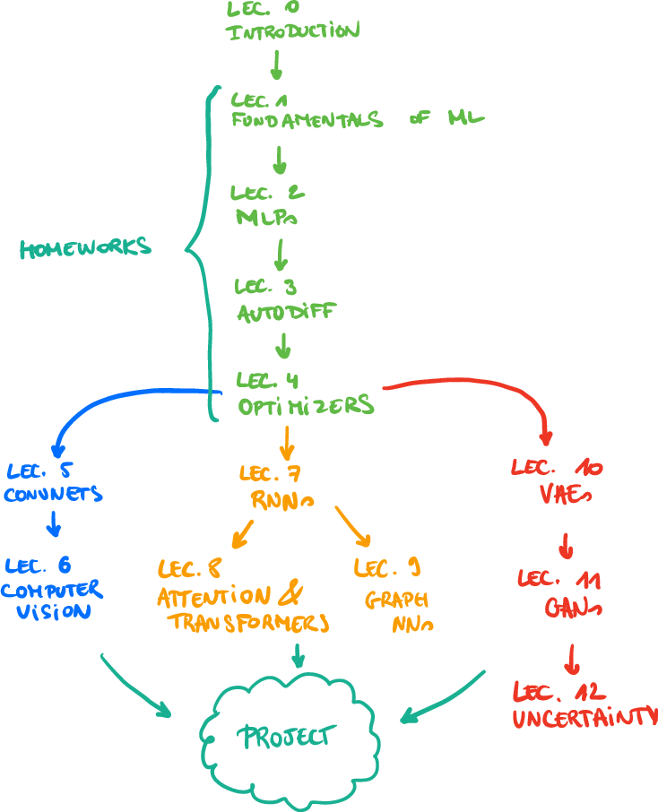
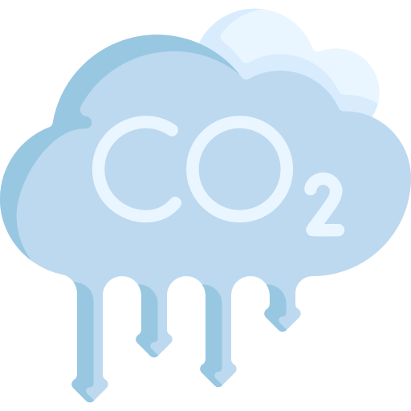

class: middle, center, title-slide

# Deep Learning

Closing remarks

  
Prof. Gilles Louppe 
[g.louppe@uliege.be](mailto:g.louppe@uliege.be)

---

class: middle, center

.width-65[]

---

class: middle

## My mission .green[&#10004;]

By the end of this course, you will have a strong and comprehensive understanding of deep learning. 

You will learn how to design deep neural networks for various advanced probabilistic inference tasks and how to train them.

The models covered in this course have broad applications in artificial intelligence, engineering, and science.

---

class: black-slide, middle

.grid[
.kol-1-2[

## A methodology

- Deep Learning is more than feedforward networks.
- It is a .bold[methodology]:
  - assemble networks of parameterized functional blocks 
  - train them from data using some form of gradient-based optimisation.
- Bricks are simple, but their nested composition can be arbitrarily complicated.
- Think like an architect: make cathedrals!
]
.kol-1-2[.width-100[]]
]

???

Artificial intelligence and deep learning are transforming science, engineering and society.

As future engineers or scientists, your new skills offers you opportunities to address some of the world's biggest and important challenges. Seize them!

---

class: middle

.center.width-10[]

## The good

- Deep learning has become a powerful tool for solving complex problems in various fields, both in science and engineering.
- The human-computer interface is evolving, with conversational assistants making digital tools more accessible.
- The pace of progress is accelerating, with new breakthroughs happening regularly.

???

- L'IA est devenue un outil capable de résoudre des problèmes complexes et de faire des découvertes.
- L'interface homme-machine est en train de changer radicalement, avec des assistants conversationnels facilitant l'utilisation du numérique.
- Les progrès continuent à un rythme effréné.

---

class: middle

.center.width-10[]

## The bad

- Deep neural networks are difficult to interpret and explain.
- AI can make mistakes, sometimes catastrophically, despite its assertive appearance of accuracy.
- Deep learning models have become very large and require significant computational resources, with substantial environmental consequences.

???

- Les modèles de deep learning sont souvent difficiles à interpréter et à expliquer.
- L'IA se trompe, et peut se tromper de manière catastrophique malgré les apparences de précision.
- Les modèles de deep learning sont devenus très gros et nécessitent des ressources de calcul importantes, avec des conséquences environnementales significatives.

---

class: middle

.center.width-10[]

## The ugly

- Deep neural networks can be biased and may perpetuate or amplify existing discriminations.
- Malicious uses of AI are becoming more common (deep fakes, bots, mass manipulation, etc.).
- A growing dependency on AI is emerging in all areas of society, with risks of dehumanization and loss of control.

???

- Les modèles de deep learning sont biaisés et peuvent perpétuer des discriminations.
- Les utilisations malveillantes de l'IA sont de plus en plus fréquentes (deep fakes, bots, manipulation, etc).
- Dans tous les domaines de la société, une dépendance à l'IA s'installe, avec des risques de déshumanisation et de perte de contrôle.

---

class: middle, center

Now what?

---

class: middle

## Exam

- 1 question on the fundamentals of deep learning (lectures 1 to 4)  
- 1 question on advanced topics (lectures 5 to 12) 
- short technical questions on your project 

---

class: middle

## Going further

- INFO8006: Introduction to Artificial Intelligence
- ELEN0062: Introduction to Machine Learning
- INFO8010: Deep Learning **.bold[← You are here]**
- INFO8004: Advanced Machine Learning
- INFO8003: Reinforcement Learning
- INFO0948: Introduction to Intelligent Robotics
- ELEN0016: Computer vision
- INFO9023: Machine Learning Systems Design )

---

class: middle

## Research opportunities

Feel free to contact us about
- MSc thesis opportunities
- PhD thesis opportunities

---

class: end-slide, center
count: false

That's all folks!
