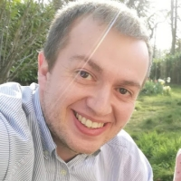
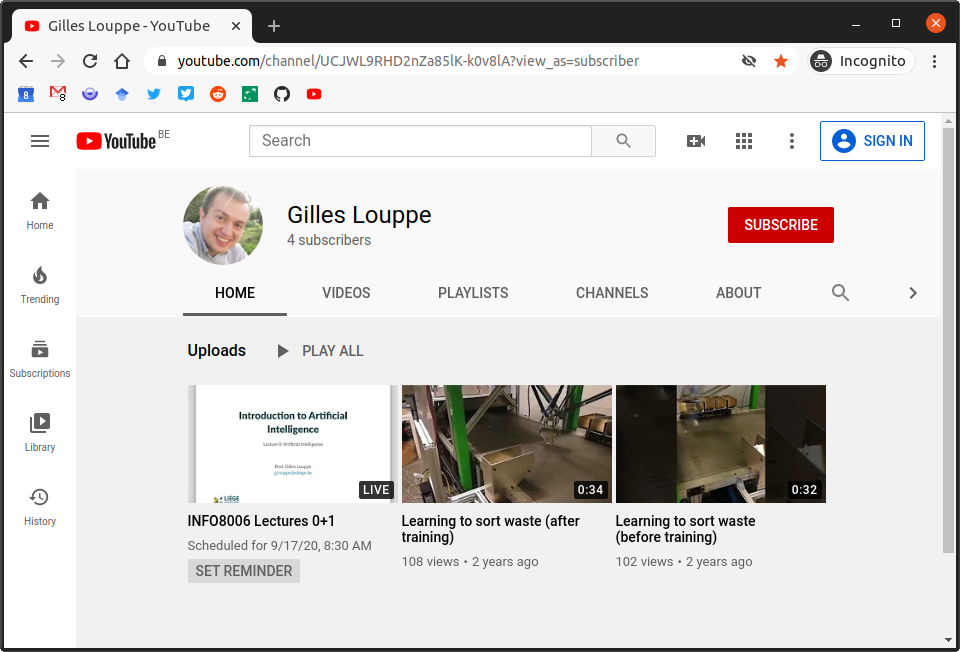
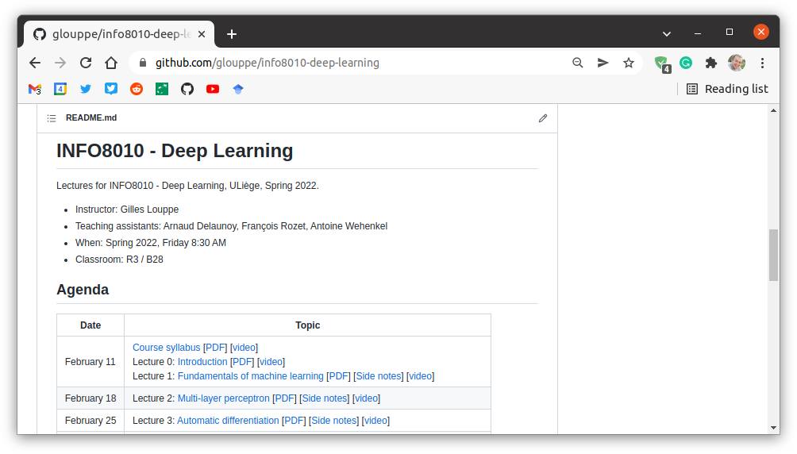
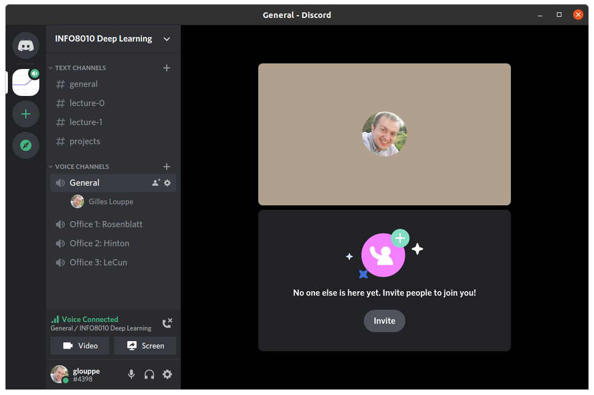
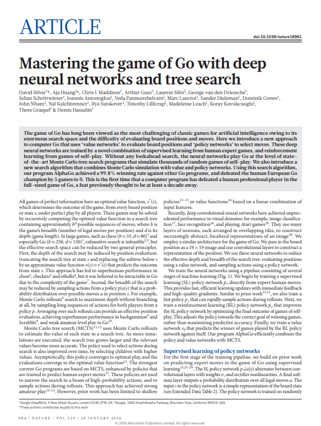

class: middle, center, title-slide

# Deep Learning

Spring 2021

  
Prof. Gilles Louppe 
[g.louppe@uliege.be](g.louppe@uliege.be)

???

R: reading assingment:http://web.stanford.edu/class/cs224n/project/project-proposal-instructions.pdf
R: https://www.cs.toronto.edu/~duvenaud/courses/csc2541/index.html projects

---

# Philosophy

## Thorough and detailed
- Understand the foundations and the landscape of deep learning.
- Be able to write from scratch, debug and run (some) deep learning algorithms.

## State-of-the-art
- Introduction to materials new from research ($\leq$ 5 years old).
- Understand some of the open questions and challenges in the field.

## Practical
- Fun and challenging course project.

---

# Us

This course is given by:
- Theory: Gilles Louppe ([g.louppe@uliege.be](mailto:g.louppe@uliege.be))
- Projects and guidance: 
  - Matthia Sabatelli 
  - Antoine Wehenkel

 

.center[
.circle.width-20[] &nbsp;
.circle.width-20[] &nbsp;
.circle.width-20[]
]

---

# Materials

This year, the course takes place online on Youtube at [https://bit.ly/3igTphO](https://bit.ly/3igTphO).
Theoretical lectures will be **streamed live**.

.center.width-80[]

---

class: middle 

## Schedule & Slides

The schedule and slides are available at [github.com/glouppe/info8010-deep-learning](https://github.com/glouppe/info8010-deep-learning).
- In HTML and in PDFs.
- Posted/updated online the day before the lesson (hopefully).

.center.width-80[]

---

class: middle

## Textbook

None!

But we would recommend "Dive into Deep Learning" ([d2l.ai](https://d2l.ai/)) for a comprehensive and practical introduction to the field.

.center.width-60[]

---

class: middle

## Discord

Live interactions will take place on Discord. 
- Ask your questions live during the livestream (in _Livestreamed Q&As_).
- Ask your questions offline in the text channels.
- Don't be shy!

.center[
.width-60[]

(See email for the invitation link.)
]

---

# Projects

## Reading assignment

Read, summarize and criticize a major scientific paper in deep learning. Details to be announced soon.

.center.width-60[]

---

class: middle

## Homeworks

Short exercises to get you started with the practicals of deep learning.

---

class: middle

## Project

Project of your choosing. Details to be announced soon.

---

# Evaluation

- Oral exam (50%)
- Reading assignment (10%)
- Projects (40%)
  - Homeworks (10%) (optional)
  - Programming project (30% or 40%)

The reading assignment and the projects are **mandatory** for presenting the exam.

---

class: end-slide, center
count: false

Let's start!
