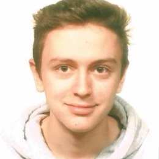

class: middle, center, title-slide

# Deep Learning

Spring 2024

  
Prof. Gilles Louppe 
[g.louppe@uliege.be](g.louppe@uliege.be)

???

R: paper https://t.co/wVg6xUmt7d

---

# Us

- Instructor: Gilles Louppe ([g.louppe@uliege.be](mailto:g.louppe@uliege.be))
- Projects and guidance: 
  - Arnaud Delaunoy
  - François Rozet
  - Yann Claes
  - Victor Dachet

 

.center[
.circle.width-15[] &nbsp;
.circle.width-15[] &nbsp;
.circle.width-15[] &nbsp;
.circle.width-15[] &nbsp;
.circle.width-15[] 
]

---

# Course hub

All important information about the course is maintained on the course hub at [github.com/glouppe/info8010-deep-learning](https://github.com/glouppe/info8010-deep-learning):

- Schedule
- Slides and materials
- Homeworks and project

.center.width-70[]

---

class: middle

## Discord

We have a Discord server for the course at [https://discord.gg/5yZqTZhXFW](https://discord.gg/5yZqTZhXFW). Ask questions, share resources, and chat with your peers and the teaching team.

.center.width-70[]

---

class: middle

.grid[
.kol-2-3[

## Textbook

We recommend .italic[Understanding Deep Learning], by Simon J.D. Prince, for a comprehensive introduction to the field.

The book is freely available at [https://udlbook.github.io/udlbook/](https://udlbook.github.io/udlbook/).

]
.kol-1-3.width-100[]
]

---

class: middle

## Videos

Videos from Spring 2021 are available at [https://bit.ly/3roQmea](https://bit.ly/3roQmea), but they are not up-to-date with the current materials.

.center.width-70[]

---

# Projects

## Reading assignment

Read, summarize and criticize a major scientific paper in deep learning. Details to be announced soon.

.center.width-60[]

---

class: middle

## Homeworks

Short exercises to get you started with the practicals of deep learning.

---

class: middle

## Project

Project of your choosing. Details to be announced soon.

---

# Evaluation

- Oral exam (50%)
- Reading assignment (10%)
- Projects (40%)
  - Homeworks (10%) (optional)
  - Programming project (30% or 40%)

The reading assignment and the projects are **mandatory** for presenting the exam.

---

class: end-slide, center
count: false

Let's start!
