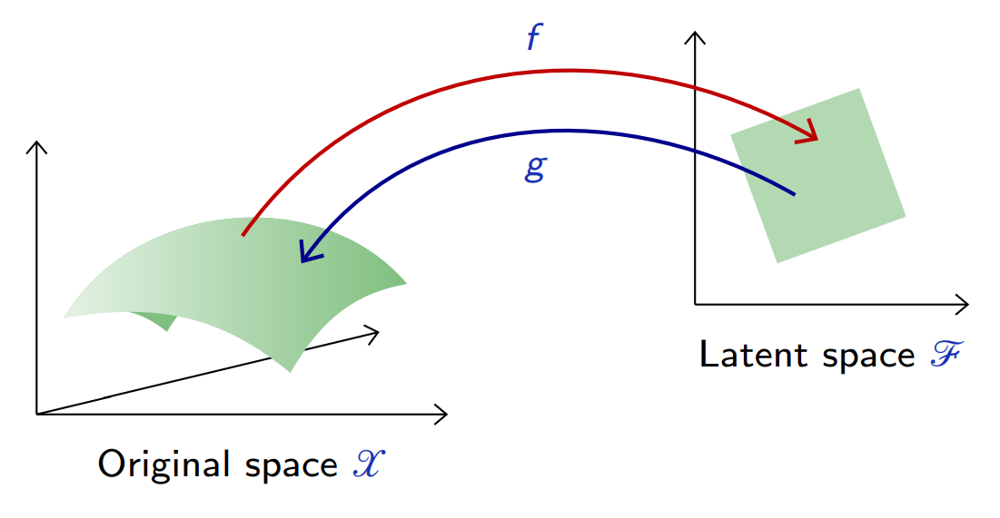
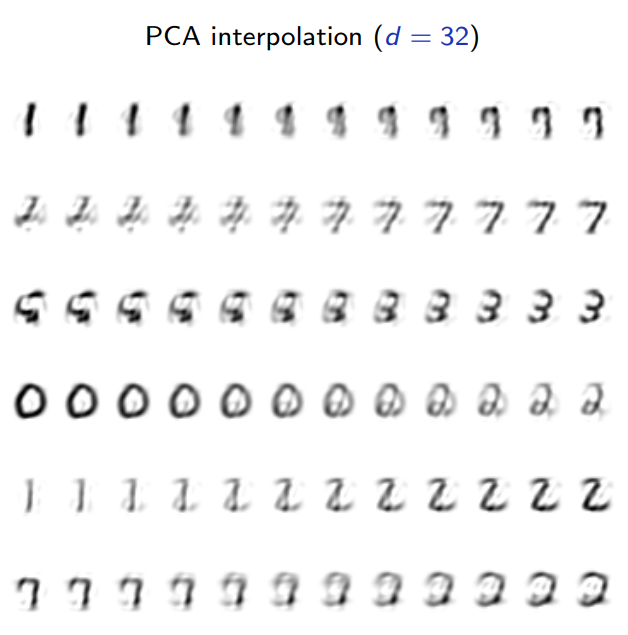
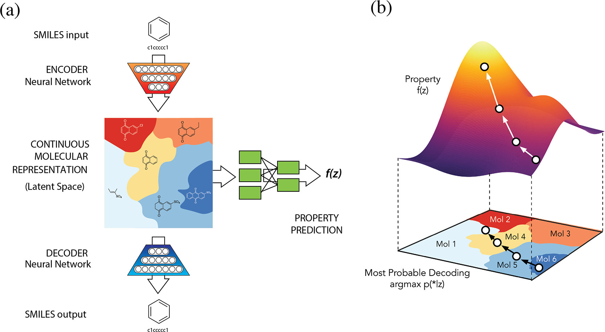
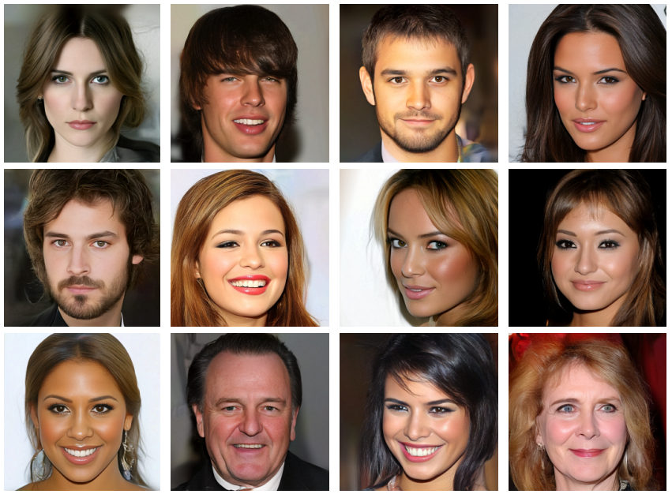

class: middle, center, title-slide

# Deep Learning

Lecture 10: Auto-encoders and variational auto-encoders

  
Prof. Gilles Louppe 
[g.louppe@uliege.be](mailto:g.louppe@uliege.be)

???

R: Don't spend too long on HVAEs... but do mention Diffusion models.
R: https://twitter.com/c_valenzuelab/status/1562579547404455936

---

class: middle

.center.width-60[]

---

# Today

Learn a model of the data.

- Auto-encoders
- Variational inference
- Variational auto-encoders

---

class: middle

.center.circle.width-30[]

.italic["The brain has about $10^{14}$ synapses and we only live for about $10^9$
seconds. So we have a lot more parameters than data. This
motivates the idea that we must do a lot of unsupervised learning
since the perceptual input (including proprioception) is the only
place we can get $10^5$ dimensions of constraint per second."]

.pull-right[Geoffrey Hinton, 2014.]

---

class: middle

.grid[
.kol-1-3[.circle.width-95[]]
.kol-2-3[.width-100[]]
]

.italic["We need tremendous amount of information to build machines that have common sense and generalize."]

.pull-right[Yann LeCun, 2016.]

---

class: middle

## Deep unsupervised learning

Deep unsupervised learning is about capturing rich patterns in raw data with deep networks in a **label-free** way.

- Generative models: recreate the raw data distribution (e.g., the distribution of natural images).
- Self-supervised learning: solve puzzle tasks that require semantic understanding (e.g., predict a missing word in a sequence).

---

class: middle

## Generative models

A **generative model** is a probabilistic model $p$ that can be used as *a simulator of the data*.
Its purpose is to generate synthetic but realistic high-dimensional data
$$\mathbf{x} \sim p(\mathbf{x};\theta),$$
that is as close as possible from the unknown data distribution $p(\mathbf{x})$, but for which we have empirical samples.

---

class: middle

## Immediate applications

.center[
.width-100[]
]
.caption[Generative models have a role in many important problems]

---

class: middle
count: false

# Auto-encoders

---

class: middle

.center.width-90[]

.footnote[Credits: Francois Fleuret, [Deep Learning](https://fleuret.org/dlc/), UNIGE/EPFL.]

---

class: middle
count: false

.center.width-90[]

.footnote[Credits: Francois Fleuret, [Deep Learning](https://fleuret.org/dlc/), UNIGE/EPFL.]

---

# Auto-encoders

An auto-encoder is a composite function made of
- an **encoder** $f$ from the original space $\mathcal{X}$ to a latent space $\mathcal{Z}$,
- a *decoder* $g$ to map back to $\mathcal{X}$,

such that $g \circ f$ is close to the identity on the data.

.center.width-80[]

.footnote[Credits: Francois Fleuret, [Deep Learning](https://fleuret.org/dlc/), UNIGE/EPFL.]

---

class: middle

Let $p(\mathbf{x})$ be the data distribution over $\mathcal{X}$. A good auto-encoder could be characterized with the reconstruction loss
$$\mathbb{E}\_{\mathbf{x} \sim p(\mathbf{x})} \left[ || \mathbf{x} - g \circ f(\mathbf{x}) ||^2 \right] \approx 0.$$

Given two parameterized mappings $f(\cdot; \theta\_f)$ and $g(\cdot;\theta\_g)$, training consists of minimizing an empirical estimate of that loss,
$$\theta\_f, \theta\_g = \arg \min\_{\theta\_f, \theta\_g} \frac{1}{N} \sum_{i=1}^N || \mathbf{x}\_i - g(f(\mathbf{x}\_i,\theta\_f), \theta\_g) ||^2.$$

.footnote[Credits: Francois Fleuret, [Deep Learning](https://fleuret.org/dlc/), UNIGE/EPFL.]

---

class: middle

For example, when the auto-encoder is linear,
$$
\begin{aligned}
f: \mathbf{z} &= \mathbf{U}^T \mathbf{x} \\\\
g: \hat{\mathbf{x}} &= \mathbf{U} \mathbf{z},
\end{aligned}
$$
with $\mathbf{U} \in \mathbb{R}^{p\times d}$, the reconstruction error reduces to
$$\mathbb{E}\_{\mathbf{x} \sim p(\mathbf{x})} \left[ || \mathbf{x} - \mathbf{U}\mathbf{U}^T \mathbf{x} ||^2 \right].$$

In this case, an optimal solution is given by PCA.

---

class: middle

## Deep auto-encoders

.center.width-80[&nbsp;&nbsp;&nbsp;&nbsp;&nbsp;]

Better results can be achieved with more sophisticated classes of mappings than linear projections: use deep neural networks for $f$ and $g$.

For instance,
- by combining a multi-layer perceptron encoder $f : \mathbb{R}^p \to \mathbb{R}^d$ with a multi-layer perceptron decoder $g: \mathbb{R}^d \to \mathbb{R}^p$.
- by combining a convolutional network encoder $f : \mathbb{R}^{w\times h \times c} \to \mathbb{R}^d$ with a decoder $g : \mathbb{R}^d \to \mathbb{R}^{w\times h \times c}$ composed of the reciprocal transposed convolutional layers.

---

class: middle

.center.width-60[]

.footnote[Credits: Francois Fleuret, [Deep Learning](https://fleuret.org/dlc/), UNIGE/EPFL.]

---

class: middle

.center.width-60[]

.footnote[Credits: Francois Fleuret, [Deep Learning](https://fleuret.org/dlc/), UNIGE/EPFL.]

---

class: middle

.center.width-60[]

.footnote[Credits: Francois Fleuret, [Deep Learning](https://fleuret.org/dlc/), UNIGE/EPFL.]

---

class: middle

## Interpolation

To get an intuition of the learned latent representation, we can pick two samples $\mathbf{x}$ and $\mathbf{x}'$ at random and interpolate samples along the line in the latent space.

 
.center.width-80[]

.footnote[Credits: Francois Fleuret, [Deep Learning](https://fleuret.org/dlc/), UNIGE/EPFL.]

---

class: middle

.center.width-60[]

.footnote[Credits: Francois Fleuret, [Deep Learning](https://fleuret.org/dlc/), UNIGE/EPFL.]

---

class: middle

.center.width-60[]

.footnote[Credits: Francois Fleuret, [Deep Learning](https://fleuret.org/dlc/), UNIGE/EPFL.]

---

# Denoising auto-encoders

Besides dimension reduction, auto-encoders can capture dependencies between signal components to restore degraded or noisy signals. 

In this case, the composition $$h = g \circ f : \mathcal{X} \to \mathcal{X}$$ is referred to as a **denoising** auto-encoder.

The goal is to optimize $h$ such that a perturbation $\tilde{\mathbf{x}}$ of the signal $\mathbf{x}$ is restored to $\mathbf{x}$, hence $$h(\tilde{\mathbf{x}}) \approx \mathbf{x}.$$

.footnote[Credits: Francois Fleuret, [Deep Learning](https://fleuret.org/dlc/), UNIGE/EPFL.]

---

class: middle

.center.width-60[]

.footnote[Credits: Francois Fleuret, [Deep Learning](https://fleuret.org/dlc/), UNIGE/EPFL.]

---

class: middle

.center.width-60[]

.footnote[Credits: Francois Fleuret, [Deep Learning](https://fleuret.org/dlc/), UNIGE/EPFL.]

---

class: middle

.center.width-60[]

.footnote[Credits: Francois Fleuret, [Deep Learning](https://fleuret.org/dlc/), UNIGE/EPFL.]

---

class: middle

.center.width-60[]

.footnote[Credits: Francois Fleuret, [Deep Learning](https://fleuret.org/dlc/), UNIGE/EPFL.]

---

class: middle

A fundamental weakness of denoising auto-encoders is that the posterior $p(\mathbf{x}|\tilde{\mathbf{x}})$ is possibly multi-modal.

If we train an auto-encoder with the quadratic loss (i.e., implicitly assuming a Gaussian posterior), then the best reconstruction is 
$$h(\tilde{\mathbf{x}}) = \mathbb{E}[\mathbf{x}|\tilde{\mathbf{x}}],$$
which may be very unlikely under $p(\mathbf{x}|\tilde{\mathbf{x}})$.

.center.width-60[]

.footnote[Credits: Francois Fleuret, [Deep Learning](https://fleuret.org/dlc/), UNIGE/EPFL.]

---

# Sampling from an AE's latent space

The generative capability of the decoder $g$ in an auto-encoder can be assessed by introducing a (simple) density model $q$ over the latent space $\mathcal{Z}$, sample there, and map the samples into the data space $\mathcal{X}$ with $g$.

.center.width-80[]

.footnote[Credits: Francois Fleuret, [Deep Learning](https://fleuret.org/dlc/), UNIGE/EPFL.]

---

class: middle

For instance, a factored Gaussian model with diagonal covariance matrix,
$$q(\mathbf{z}) = \mathcal{N}(\hat{\mu}, \hat{\Sigma}),$$
where both $\\hat{\mu}$ and $\hat{\Sigma}$ are estimated on training data.

---

class: middle

.center.width-60[]

.footnote[Credits: Francois Fleuret, [Deep Learning](https://fleuret.org/dlc/), UNIGE/EPFL.]

---

class: middle

These results are not satisfactory because the density model on the latent space is **too simple and inadequate**.

Building a good model in latent space amounts to our original problem of modeling an empirical distribution, although it may now be in a lower dimension space.

.footnote[Credits: Francois Fleuret, [Deep Learning](https://fleuret.org/dlc/), UNIGE/EPFL.]

---

class: middle
count: false

# Variational inference

???

Switch to BB.

---

class: middle

## Latent variable model

.center.width-20[]

Consider for now a **prescribed latent variable model** that relates a set of observable variables $\mathbf{x} \in \mathcal{X}$ to a set of unobserved variables $\mathbf{z} \in \mathcal{Z}$.

???

The probabilistic model is given and motivated by domain knowledge assumptions.

Examples include:
- Linear discriminant analysis
- Bayesian networks
- Hidden Markov models
- Probabilistic programs

---

class: middle, black-slide

.center[<video controls autoplay loop muted preload="auto" height="480" width="640">
  <source src="./figures/lec10/galton.mp4" type="video/mp4">
</video>]

---

class: middle

The probabilistic model defines a joint probability distribution $p(\mathbf{x}, \mathbf{z})$, which decomposes as
$$p(\mathbf{x}, \mathbf{z}) = p(\mathbf{x}|\mathbf{z}) p(\mathbf{z}).$$
If we interpret $\mathbf{z}$ as causal factors for the high-dimension representations $\mathbf{x}$, then
sampling from $p(\mathbf{x}|\mathbf{z})$ can be interpreted as **a stochastic generating process** from $\mathcal{Z}$ to $\mathcal{X}$.

For a given model $p(\mathbf{x}, \mathbf{z})$, inference consists in computing the posterior
$$p(\mathbf{z}|\mathbf{x}) = \frac{p(\mathbf{x}|\mathbf{z}) p(\mathbf{z})}{p(\mathbf{x})}.$$

For most interesting cases, this is usually intractable since it requires evaluating the evidence
$$p(\mathbf{x}) = \int p(\mathbf{x}|\mathbf{z})p(\mathbf{z}) d\mathbf{z}.$$

???

Switch to iPad.

---

# Variational inference

.center.width-80[]

**Variational inference** turns posterior inference into an optimization problem.
- Consider a family of distributions $q(\mathbf{z}|\mathbf{x}; \nu)$ that approximate the posterior $p(\mathbf{z}|\mathbf{x})$, where the
variational parameters $\nu$ index the family of distributions.
- The parameters $\nu$ are fit to minimize the KL divergence between the approximation $q(\mathbf{z}|\mathbf{x};\nu)$ and the posterior  $p(\mathbf{z}|\mathbf{x})$.

---

class: middle

Formally, we want to solve
$$\begin{aligned}
&\arg\min\_\nu \text{KL}(q\(\mathbf{z}|\mathbf{x};\nu) || p(\mathbf{z}|\mathbf{x})) \\\\
=& \arg\min\_\nu  \mathbb{E}\_{q(\mathbf{z}|\mathbf{x};\nu)}\left[\log \frac{q(\mathbf{z}|\mathbf{x} ; \nu)}{p(\mathbf{z}|\mathbf{x})}\right] \\\\
=& \arg\min\_\nu  \mathbb{E}\_{q(\mathbf{z}|\mathbf{x};\nu)}\left[ \log q(\mathbf{z}|\mathbf{x};\nu) - \log p(\mathbf{x},\mathbf{z}) \right] + \log p(\mathbf{x}).
\end{aligned}$$
For the same reason as before, the KL divergence cannot be directly minimized because
of the $\log p(\mathbf{x})$ term.

---

class: middle

However, we can write
$$\begin{aligned}
&\arg\min\_\nu \text{KL}(q(\mathbf{z}|\mathbf{x};\nu) || p(\mathbf{z}|\mathbf{x})) \\\\
=& \arg\min\_\nu  \mathbb{E}\_{q(\mathbf{z}|\mathbf{x};\nu)}\left[ \log q(\mathbf{z}|\mathbf{x};\nu) - \log p(\mathbf{x},\mathbf{z}) \right] + \log p(\mathbf{x})\\\\
=&\arg\max\_\nu \underbrace{\mathbb{E}\_{q(\mathbf{z}|\mathbf{x};\nu)}\left[ \log p(\mathbf{x},\mathbf{z}) - \log q(\mathbf{z}|\mathbf{x};\nu) \right]}\_{\text{ELBO}(\mathbf{x};\nu)}
\end{aligned}
$$
where $\text{ELBO}(\mathbf{x};\nu)$ is called the **evidence lower bound objective**.

- Since $\log p(\mathbf{x})$ does not depend on $\nu$, it can be considered as a constant, and minimizing the KL divergence is equivalent to maximizing the evidence lower bound, while being computationally tractable.
- Given a dataset $\mathbf{d} = \\\{\mathbf{x}\_i|i=1, ..., N\\\}$, the final objective is the sum $\sum\_{\\\{\mathbf{x}\_i \in \mathbf{d}\\\}} \text{ELBO}(\mathbf{x}\_i;\nu)$.

---

class: middle

Remark that
$$\begin{aligned}
\text{ELBO}(\mathbf{x};\nu) &= \mathbb{E}\_{q(\mathbf{z};|\mathbf{x}\nu)}\left[ \log p(\mathbf{x},\mathbf{z}) - \log q(\mathbf{z}|\mathbf{x};\nu) \right] \\\\
&= \mathbb{E}\_{q(\mathbf{z}|\mathbf{x};\nu)}\left[ \log p(\mathbf{x}|\mathbf{z}) p(\mathbf{z}) - \log q(\mathbf{z}|\mathbf{x};\nu) \right] \\\\
&= \mathbb{E}\_{q(\mathbf{z}|\mathbf{x};\nu)}\left[ \log p(\mathbf{x}|\mathbf{z})\right] - \text{KL}(q(\mathbf{z}|\mathbf{x};\nu) || p(\mathbf{z}))
\end{aligned}$$
Therefore, maximizing the ELBO:
- encourages distributions to place their mass on configurations of latent variables that explain the observed data (first term);
- encourages distributions close to the prior (second term).

---

class: middle

## Optimization

We want
$$\begin{aligned}
\nu^{\*} &= \arg \max\_\nu \text{ELBO}(\mathbf{x};\nu) \\\\
&= \arg \max\_\nu \mathbb{E}\_{q(\mathbf{z}|\mathbf{x};\nu)}\left[ \log p(\mathbf{x},\mathbf{z}) - \log q(\mathbf{z}|\mathbf{x};\nu) \right].
\end{aligned}$$

We can proceed by gradient ascent, provided we can evaluate $\nabla\_\nu \text{ELBO}(\mathbf{x};\nu)$.

In general,
this gradient is difficult to compute because the expectation is unknown and the parameters $\nu$ are parameters of the distribution $q(\mathbf{z}|\mathbf{x};\nu)$ we integrate over.

---

class: middle
count: false

# Variational auto-encoders

---

class: middle

So far we assumed a prescribed probabilistic model motivated by domain knowledge.
We will now directly learn a stochastic generating process with a neural network.

---

# Variational auto-encoders

A variational auto-encoder is a deep latent variable model where:
- The prior $p(\mathbf{z})$ is prescribed, and usually chosen to be Gaussian.
- The likelihood $p(\mathbf{x}|\mathbf{z};\theta)$ is parameterized with a **generative network** $\text{NN}\_\theta$
(or decoder) that takes as input $\mathbf{z}$ and outputs parameters $\phi = \text{NN}\_\theta(\mathbf{z})$ to the data distribution. E.g.,
$$\begin{aligned}
\mu, \sigma &= \text{NN}\_\theta(\mathbf{z}) \\\\
p(\mathbf{x}|\mathbf{z};\theta) &= \mathcal{N}(\mathbf{x}; \mu, \sigma^2\mathbf{I})
\end{aligned}$$
- The approximate posterior $q(\mathbf{z}|\mathbf{x};\varphi)$ is parameterized
with an **inference network** $\text{NN}\_\varphi$ (or encoder) that takes as input $\mathbf{x}$ and
outputs parameters $\nu = \text{NN}\_\varphi(\mathbf{x})$ to the approximate posterior. E.g.,
$$\begin{aligned}
\mu, \sigma &= \text{NN}\_\varphi(\mathbf{x}) \\\\
q(\mathbf{z}|\mathbf{x};\varphi) &= \mathcal{N}(\mathbf{z}; \mu, \sigma^2\mathbf{I})
\end{aligned}$$

---

class: middle

.center.width-80[]

.footnote[Credits: Francois Fleuret, [Deep Learning](https://fleuret.org/dlc/), UNIGE/EPFL.]

---

class: middle

As before, we can use variational inference, but to jointly optimize the generative and the inference networks parameters $\theta$ and $\varphi$.

We want
$$\begin{aligned}
\theta^{\*}, \varphi^{\*} &= \arg \max\_{\theta,\varphi} \text{ELBO}(\mathbf{x};\theta,\varphi) \\\\
&= \arg \max\_{\theta,\varphi} \mathbb{E}\_{q(\mathbf{z}|\mathbf{x};\varphi)}\left[ \log p(\mathbf{x}|\mathbf{z};\theta)\right] - \text{KL}(q(\mathbf{z}|\mathbf{x};\varphi) || p(\mathbf{z})).
\end{aligned}$$

- Given some generative network $\theta$, we want to put the mass of the latent variables, by adjusting $\varphi$, such that they explain the observed data, while remaining close to the prior.
- Given some inference network $\varphi$, we want to put the mass of the observed variables, by adjusting $\theta$, such that
they are well explained by the latent variables.

---

class: middle

Unbiased gradients of the ELBO with respect to the generative model parameters $\theta$ are simple to obtain:
$$\begin{aligned}
\nabla\_\theta \text{ELBO}(\mathbf{x};\theta,\varphi) &= \nabla\_\theta \mathbb{E}\_{q(\mathbf{z}|\mathbf{x};\varphi)}\left[ \log p(\mathbf{x},\mathbf{z};\theta) - \log q(\mathbf{z}|\mathbf{x};\varphi)\right] \\\\
&= \mathbb{E}\_{q(\mathbf{z}|\mathbf{x};\varphi)}\left[ \nabla\_\theta ( \log p(\mathbf{x},\mathbf{z};\theta) - \log q(\mathbf{z}|\mathbf{x};\varphi) ) \right] \\\\
&= \mathbb{E}\_{q(\mathbf{z}|\mathbf{x};\varphi)}\left[ \nabla\_\theta \log p(\mathbf{x},\mathbf{z};\theta) \right],
\end{aligned}$$
which can be estimated with Monte Carlo integration.

However, gradients with respect to the inference model parameters $\varphi$ are
more difficult to obtain:
$$\begin{aligned}
\nabla\_\varphi \text{ELBO}(\mathbf{x};\theta,\varphi) &= \nabla\_\varphi \mathbb{E}\_{q(\mathbf{z}|\mathbf{x};\varphi)}\left[ \log p(\mathbf{x},\mathbf{z};\theta) - \log q(\mathbf{z}|\mathbf{x};\varphi)\right] \\\\
&\neq \mathbb{E}\_{q(\mathbf{z}|\mathbf{x};\varphi)}\left[ \nabla\_\varphi ( \log p(\mathbf{x},\mathbf{z};\theta) - \log q(\mathbf{z}|\mathbf{x};\varphi) ) \right]
\end{aligned}$$

---

class: middle

Let us abbreviate
$$\begin{aligned}
\text{ELBO}(\mathbf{x};\theta,\varphi) &= \mathbb{E}\_{q(\mathbf{z}|\mathbf{x};\varphi)}\left[ \log p(\mathbf{x},\mathbf{z};\theta) - \log q(\mathbf{z}|\mathbf{x};\varphi)\right] \\\\
&= \mathbb{E}\_{q(\mathbf{z}|\mathbf{x};\varphi)}\left[ f(\mathbf{x}, \mathbf{z}; \varphi) \right].
\end{aligned}$$
We have
.grid[
.kol-1-5[]
.kol-4-5[.center.width-90[]]
]

We cannot backpropagate through the stochastic node $\mathbf{z}$ to compute $\nabla\_\varphi f$!

---

# Reparameterization trick

The .bold[reparameterization trick] consists in re-expressing the variable $$\mathbf{z} \sim q(\mathbf{z}|\mathbf{x};\varphi)$$ as some differentiable and invertible transformation
of another random variable $\epsilon$ given $\mathbf{x}$ and $\varphi$,
$$\mathbf{z} = g(\varphi, \mathbf{x}, \epsilon),$$
such that the distribution of $\epsilon$ is independent of $\mathbf{x}$ or $\varphi$.

---

class: middle

.grid[
.kol-1-5[]
.kol-4-5[.center.width-90[]]
]

For example, if $q(\mathbf{z}|\mathbf{x};\varphi) = \mathcal{N}(\mathbf{z}; \mu(\mathbf{x};\varphi), \sigma^2(\mathbf{x};\varphi))$, where $\mu(\mathbf{x};\varphi)$ and $\sigma^2(\mathbf{x};\varphi)$
are the outputs of the inference network $NN\_\varphi$, then a common reparameterization is:
$$\begin{aligned}
p(\epsilon) &= \mathcal{N}(\epsilon; \mathbf{0}, \mathbf{I}) \\\\
\mathbf{z} &= \mu(\mathbf{x};\varphi) + \sigma(\mathbf{x};\varphi) \odot \epsilon
\end{aligned}$$

---

class: middle

Given such a change of variable, the ELBO can be rewritten as:
$$\begin{aligned}
\text{ELBO}(\mathbf{x};\theta,\varphi) &= \mathbb{E}\_{q(\mathbf{z}|\mathbf{x};\varphi)}\left[ f(\mathbf{x}, \mathbf{z}; \varphi) \right]\\\\
&= \mathbb{E}\_{p(\epsilon)} \left[ f(\mathbf{x}, g(\varphi,\mathbf{x},\epsilon); \varphi) \right]
\end{aligned}$$
Therefore,
$$\begin{aligned}
\nabla\_\varphi \text{ELBO}(\mathbf{x};\theta,\varphi) &= \nabla\_\varphi \mathbb{E}\_{p(\epsilon)} \left[  f(\mathbf{x}, g(\varphi,\mathbf{x},\epsilon); \varphi) \right] \\\\
&= \mathbb{E}\_{p(\epsilon)} \left[ \nabla\_\varphi  f(\mathbf{x}, g(\varphi,\mathbf{x},\epsilon); \varphi) \right],
\end{aligned}$$
which we can now estimate with Monte Carlo integration.

The last required ingredient is the evaluation of the likelihood $q(\mathbf{z}|\mathbf{x};\varphi)$ given the change of variable $g$. As long as $g$ is invertible, we have:
$$\log q(\mathbf{z}|\mathbf{x};\varphi) = \log p(\epsilon) - \log \left| \det\left( \frac{\partial \mathbf{z}}{\partial \epsilon} \right) \right|.$$

---

# Example

Consider the following setup:
- Generative model:
$$\begin{aligned}
\mathbf{z} &\in \mathbb{R}^d \\\\
p(\mathbf{z}) &= \mathcal{N}(\mathbf{z}; \mathbf{0},\mathbf{I})\\\\
p(\mathbf{x}|\mathbf{z};\theta) &= \mathcal{N}(\mathbf{x};\mu(\mathbf{z};\theta), \sigma^2(\mathbf{z};\theta)\mathbf{I}) \\\\
\mu(\mathbf{z};\theta) &= \mathbf{W}\_2^T\mathbf{h} + \mathbf{b}\_2 \\\\
\log \sigma^2(\mathbf{z};\theta) &= \mathbf{W}\_3^T\mathbf{h} + \mathbf{b}\_3 \\\\
\mathbf{h} &= \text{ReLU}(\mathbf{W}\_1^T \mathbf{z} + \mathbf{b}\_1)\\\\
\theta &= \\\{ \mathbf{W}\_1, \mathbf{b}\_1, \mathbf{W}\_2, \mathbf{b}\_2, \mathbf{W}\_3, \mathbf{b}\_3 \\\}
\end{aligned}$$

---

class: middle

- Inference model:
$$\begin{aligned}
q(\mathbf{z}|\mathbf{x};\varphi) &=  \mathcal{N}(\mathbf{z};\mu(\mathbf{x};\varphi), \sigma^2(\mathbf{x};\varphi)\mathbf{I}) \\\\
p(\epsilon) &= \mathcal{N}(\epsilon; \mathbf{0}, \mathbf{I}) \\\\
\mathbf{z} &= \mu(\mathbf{x};\varphi) + \sigma(\mathbf{x};\varphi) \odot \epsilon \\\\
\mu(\mathbf{x};\varphi) &= \mathbf{W}\_5^T\mathbf{h} + \mathbf{b}\_5 \\\\
\log \sigma^2(\mathbf{x};\varphi) &= \mathbf{W}\_6^T\mathbf{h} + \mathbf{b}\_6 \\\\
\mathbf{h} &= \text{ReLU}(\mathbf{W}\_4^T \mathbf{x} + \mathbf{b}\_4)\\\\
\varphi &= \\\{ \mathbf{W}\_4, \mathbf{b}\_4, \mathbf{W}\_5, \mathbf{b}\_5, \mathbf{W}\_6, \mathbf{b}\_6 \\\}
\end{aligned}$$

Note that there is no restriction on the generative and inference network architectures.
They could as well be arbitrarily complex convolutional networks.

---

class: middle

Plugging everything together, the objective can be expressed as:
$$\begin{aligned}
\text{ELBO}(\mathbf{x};\theta,\varphi) &= \mathbb{E}\_{q(\mathbf{z}|\mathbf{x};\varphi)} \left[ \log p(\mathbf{x}|\mathbf{z};\theta) \right] - \text{KL}(q(\mathbf{z}|\mathbf{x};\varphi) || p(\mathbf{z})) \\\\
&= \mathbb{E}\_{p(\epsilon)} \left[  \log p(\mathbf{x}|\mathbf{z}=g(\varphi,\mathbf{x},\epsilon);\theta) \right] - \text{KL}(q(\mathbf{z}|\mathbf{x};\varphi) || p(\mathbf{z}))
\end{aligned}
$$
where the KL divergence can be expressed  analytically as
$$\text{KL}(q(\mathbf{z}|\mathbf{x};\varphi) || p(\mathbf{z})) = \frac{1}{2} \sum\_{j=1}^d \left( 1 + \log(\sigma\_j^2(\mathbf{x};\varphi)) - \mu\_j^2(\mathbf{x};\varphi) - \sigma\_j^2(\mathbf{x};\varphi)\right),$$
which allows to evaluate its derivative without approximation.

---

class: middle

Consider as data $\mathbf{d}$ the MNIST digit dataset:

.center.width-100[]

---

class: middle, center

.width-100[]

(Kingma and Welling, 2013)

---

class: middle, center

.width-95[]

(Kingma and Welling, 2013)

---

# Applications

 

.center[
.width-90[]

Hierarchical .bold[compression of images and other data],  e.g., in video conferencing systems (Gregor et al, 2016).
]

---

class: middle

.center[
.width-100[]

.bold[Understanding the factors of variation and invariances] (Higgins et al, 2017).
]

---

class: middle 

.center[

.width-80[]

.bold[Voice style transfer] [[demo](https://avdnoord.github.io/homepage/vqvae/)] (van den Oord et al, 2017).
]

---

class: middle

.center.width-100[]

.center[.bold[Design of new molecules] with desired chemical properties  (Gomez-Bombarelli et al, 2016).]

---

class: middle

.center[

<iframe width="640" height="400" src="https://www.youtube.com/embed/Wd-1WU8emkw?&loop=1&start=0" frameborder="0" volume="0" allowfullscreen></iframe>

Bridging the .bold[simulation-to-reality] gap (Inoue et al, 2017).

]

---

# Hierarchical VAEs

See side notes.

---

class: middle

.center.width-90[]

.center[VDVAE: Very Deep VAEs (Child, 2020-2021).]

---

class: middle

.center.width-70[]

.center[VDVAE samples (Child, 2020-2021).]

---

class: middle

.center.width-100[]

.center[NVAE: A Deep Hierarchical Variational Autoencoder (Vahdat and Kautz, 2020).]

---

class: middle

.center.width-90[]

.center[NVAE samples (Vahdat and Kautz, 2020).]

---

class: black-slide, middle

.center[
.width-60[]

NVAE: Random walks in latent space. (Vahdat and Kautz, 2020)

]

---

class: end-slide, center
count: false

The end.
