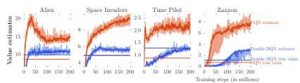
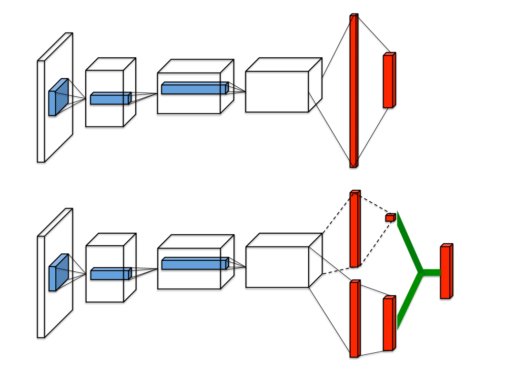

class: middle, center, title-slide

# Deep Learning

Lecture 10: Deep reinforcement learning

  
Guest lecture by Matthia Sabatelli 
[m.sabatelli@uliege.be](mailto:m.sabatelli@uliege.be )

---

# Today

Understand the field of Reinforcement Learning (RL) and see how it can be combined with neural networks.

- Markov Decision Processes
- Value functions and optimal policies
- Temporal Difference Learning
- Function approximators

---

class: middle

# Reinforcement Learning

---

class: middle, center, black-slide

<iframe width="600" height="450" src="https://www.youtube.com/embed/_5T7F_QRIqk" frameborder="0" allowfullscreen></iframe>

---

# Markov Decision Processes

Markov Decision Processes (MDP) are a classical formalization when it comes to sequential decision making problems.

MDPs allow us to mathematically define RL problems for which precise and sound statements can be made.

An MDP consists of the following elements:
- a set of possible states $\mathcal{S}$,
- a set of possible actions $\mathcal{A}$,
- a reward signal $R(s\_t,a\_t,s\_{t+1})$,
- a transition probability distribution $p(s\_{t+1}|s\_t,a\_t)$.

---

class: middle 

When it comes to most RL settings, the MDPs can come in a **more challenging** form than the one they have when we use *planning* or *dynamic programming* algorithms.

Specifically we consider cases in which the following information is **not known**:
- the transition probability distribution $p(s\_{t+1}|s\_t,a\_t)$
- the reward $R(s\_t,a\_t,s\_{t+1})$

In practice this means that we do not know beforehand which states are good or bad, and therefore also do not know what actions to take.

---

class: middle

.center.width-90[]

## The agent-environment interface

- The agent corresponds to the learner, sometimes also defined as the decision maker, which has the ability to continually interact with the environment.
- Each time an action is performed the environment has the ability to change and will present new situations to the agent.

.footnote[Credits: [Sutton and Barto](https://mitpress.mit.edu/books/reinforcement-learning-second-edition), 2018.]

---

class: middle

Differently from supervised learning, in RL we have to deal with the component of time:
- At each discrete time-step $t=0,1,2,3, ...$ the agent receives a state representation $s\_t$, selects an action $a\_t$, and receives a numerical reward $r\_t \in \mathbb{R}$ after which it will find itself in a new state $s\_{t+1}$.
- This gives rise to trajectories
$$s\_t, a\_t, r\_t, s\_{t+1}, a\_{t+1}, r\_{t+1}, s\_{t+2}, ... $$

---

class: middle

- $s\_t$ and $a\_t$ at time-step $t$ give all the necessary information that is required for predicting to which state the agent will step next.
- This is related to the fact that the environment is **Markovian**, where an action $a\_t$ only depends on the current state $s\_t$  
$$\begin{aligned}
p(s\_{t+1}|s\_t, a\_t, s\_{t-1}, a\_{t-1}, ...) &= p(s\_{t+1} | s\_t, a\_t) \\\\
&= T(s\_t, a\_{t}, s\_{t+1}). \end{aligned}$$
For predicting the future it does not matter how an agent arrived in a particular current state.
- Similarly, the reward that is obtained is only determined by the previous action and not by the history of all previously taken actions,
$$p(r\_t| s\_t, a\_t, ..., s\_1, a\_1) = p(r\_t|s\_t,a\_t).$$

---

# Goals and returns

So far we have properly defined how an agent can interact with an environment but have not seen .bold[why] this should be done.

- The purpose of an RL agent is formalized by $r\_t \in \mathbb{R}$, which is a numerical quantity that we want to **maximize**.
- We do not want to maximize the immediate reward but rather the cumulative reward
$$G\_t = r\_t + r\_{t+1} + r\_{t+2} + ... + r\_{T}.$$
- Mathematically this can be seen as maximizing the expected value of the cumulative sum of a scalar signal.

---

class: middle

To properly define the concept of return we need one additional component: the discount factor $\gamma$.

- The idea of *discounting* allows our agent to select actions which will maximize the sum of discounted rewards, therefore maximizing the discounted return:
$$\begin{aligned}
G\_t &= r\_t+\gamma r\_{t+1}, \gamma^{2} r\_{t+2} + ... \\\\
&= \sum\_{k-0}^{\infty}\gamma^{k} r\_{t+k+1}.
\end{aligned}$$
- The discount factor $0\leq \gamma \leq 1$ and controls the trade-off between immediate and long-term rewards.

---

# Policies and value functions

Basically all RL algorithms involve the concept of **value function**, functions that are able to estimate how *good* or *bad* it is for an agent to be in a particular state.

- The goodness of a state is defined in terms of future rewards that can be expected by being in state $s$.
- Just being in a good state is not enough, since the rewards will depend on which actions will be performed in the future. 
- We need the concept of **policy**:
  $$\pi: \mathcal{S} \rightarrow \mathcal{A} $$

RL methods specify how the agent's policy is changed as a result of its experience.

---

class: middle

When it comes to value functions there are two popular value functions we care about

- The **state-value** function:  
  $$V^{\pi}(s)=\mathbb{E}\bigg[\sum\_{k=0}^{\infty}\gamma^{k}r\_{t+k}\bigg| s\_t = s, \pi \bigg]$$
- The **state-action** value function:
$$ Q^{\pi}(s,a)=\mathbb{E}\bigg[\sum\_{k=0}^{\infty}\gamma^{k}r\_{t+k} \bigg| s\_t = s, a\_t=a, \pi\bigg].$$

Both value functions can compute the desirability of being in a specific state. 

---

class: middle

The goal of a RL agent is to find
an **optimal policy** that realizes the optimal expected return
$$V^\* (s)=\underset{\pi}{\max}\:V^{\pi}(s), \ \text{for all} \ s\in\mathcal{S}$$
and the optimal state-action value function
$$ Q^\* (s,a)= \underset{\pi}{\max}\:Q^{\pi}(s,a) \ \text{for all} \ s\in\mathcal{S} \ \text{and} \ a \in\mathcal{A}.$$

Both of these optimal value functions satisfy the **Bellman optimality equation**, and can be learned via Monte-Carlo or Temporal-Difference learning methods.

---

class: middle

What do value functions represent in practice?
- Remember that the environment is **unknown**. 
- We can see value functions as some sort of *knowledge representation* of an agent.
- Through its interactions with the environment, the agent accumulates knowledge which is stored by updating its value function.
- If a value function is accurate an agent will know everything he needs to know for interacting with an environment.

---

# Monte Carlo (MC) methods

- The first method than can be used for learning a value function without assuming complete knowledge of the environment: **model-free RL**.
- The only requirement of MC methods is *experience*: sampling sequences of states, actions and rewards from an environment which can be simulated.

---

class: middle

The idea is to compute the **real return** once an episode terminates
$$G\_t = \sum\_{k=0}^{\infty}\gamma^{k}r\_{t+k+1}$$
and keep track of the value of a single state based on the amount of times this state has been visited
$$V(s\_t)=\frac{\sum\_{i=1}^{k}G\_t(s)}{N(s)}.$$
This estimate can then get updated as follows:
$$V(s\_t):= V(s\_t)+\alpha[G\_t -V(s\_t)].$$

---

class: middle

## Drawbacks

- We need to wait until an episode is terminated because only then $G\_t$ will be known.
- Convergence is slowed down.

---

# Temporal Difference (TD)-Learning

- TD-Learning is a combination of Monte Carlo ideas and dynamic programming ideas. It is the most central and novel idea of entire Reinforcement Learning

- Just like MC methods TD-Learning approaches can simply learn from raw experiences without the need for a model of the environment. Like DP techniques, the update estimates are based (in part) on other learned estimates.

- This means we do not have to wait until the end of an episode anymore but instead rely on **bootstrapping**:
$$V(s\_t) := V(s\_t)+\alpha[r\_t+\gamma V(s\_{t+1}) - V(s\_t)]$$

---

class: middle

The core idea of TD-Learning is the concept of **TD-error**, or sometimes called target
$$\delta\_t = r\_t+\gamma V(s\_{t+1}) - V(s\_t).$$

- It corresponds to the only information that is needed in order to update our value estimates
  (remember that we **do not** have access to $V^* (s)$ and we want to overcome waiting for $G\_t$!)
- We are learning $V^*(s)$ by guessing the value estimates that the exact same function provides at $s\_{t+1}$

---

class: middle

We have seen the simplest form of how to update an estimate based on another estimate, but is this really a good idea?

- TD-Learning methods do not require a model of the environment, its rewards nor the $s_{t+1}$ probability distributions
- They are implemented in an online, fully incremental fashion.
- We only need to wait one-step before starting learning (might also be a drawback!).
- TD methods are also **sound** and convergence of any fixed policy $\pi$ to $V^\pi$ is guaranteed.
This policy might however not be the optimal one!
- A convergence proof on the speed of TD methods vs MC methods is still missing!

---

# Eligibility Traces

So far we have seen that we can update a value function from the real final return $G\_t$ obtained at the end of an episode, or based on an immediate future estimate $V(s\_{t+1})$. 

- There is however an intermediate approach between MC and TD-Learning called TD-($\lambda$):
$$G^{n}\_{t}=r\_t+\gamma r\_{t+1}+\gamma^2 r\_{t+2} + ... + \gamma^{n} V\_t(s\_{t+n})$$
- With setting $0\leq\gamma\leq1$ we are able to compute updates based on n-step returns.
- The problem is that we would have to wait indefinitely for computing $G\_t^{\infty}$. This is also known as *the problem of the forward view of* TD($\lambda$)

---

class: middle

We could however partially overcome this problem by **incrementally** updating the eligibility trace of a state, which nicely allows us to perform n-step backups in an elegant way.

- For each state $s\in\mathcal{S}$ a trace $e\_t(s)$ is kept in memory and initialized at $0$.
- At each state we update $e\_t(s)$ as
$$e\_t(s) = \begin{cases}
\gamma\lambda e\_{t-1}(s) & \text{if} & s \neq s\_t \\\\
\gamma\lambda e\_{t-1}(s)+ 1 & \text{if} & s = s\_t
\end{cases} $$

---

class: middle

The trace of each state is increased every time that particular state is visited and decreases exponentially otherwise due to $\lambda$.

If we again consider the TD-error as
$$\delta\_t = r\_t+\gamma V(s\_{t+1})-V(s\_t),$$
then on every step we want to update a state in proportion to its eligibility trace, which results in the following update:
$$V(s\_t):= V(s\_t) + \alpha \delta\_t e\_t(s\_t).$$

This results in a generic mechanism for learning from n-step returns.
* For $\lambda=1$ we have MC-Learning.
* For $\lambda=0$ we have TD-Learning.

---

# Exploration vs Exploitation

* We know that if a complete model of an environment is given it is easy to compute an optimal policy (like Dynamic-Programming).
* As we have seen so far in the general RL setting this is unfortunately not the case, therefore learning an optimal policy becomes as process of *trial and error*.
* During this process the only feedback that is available to the agent is the reward that is obtained at the end of an
action

---

class: middle

So why is the exploration-exploitation dilemma so **challenging?**

* In RL the amount of feedback that the agent gets compared to e.g. SL is much less. There is no direct relationship between a learning sample and its output which allows us to evaluate a *general* performance
* In SL we usually deal with **static** datasets, similarly in Unsupervised Learning we learn a hopefully useful partition of an unlabeled dataset. In RL we have to deal with *time*.
* The RL "dataset" is considered as a **moving target** which makes it hard to quantify how well e.g. an objective function is minimized.

---

class: middle

Let us assume that we have learned the **optimal** $Q$ function:
$$ Q^\*(s,a)= \underset{\pi}{\max}\:Q^{\pi}(s,a) \ \text{for all} \ s\in\mathcal{S} \ \text{and} \ a \in\mathcal{A}.$$

We know that this equation satisfies the Bellman optimality equation as given by:
$$ Q^\*(s\_t,a\_t)=\sum\_{s\_{t+1}}p(s\_{t+1} | s\_{t}, a\_{t})  \bigg[R(s\_{t}, a\_{t}, s\_{t+1}) + \gamma \: \underset{a}{\max} \: Q^\* (s\_{t+1}, a) \bigg].$$

If such a function is learned it is straightforward to derive and **optimal policy** which does not require exploration
$$\pi^\*(s\_t)= \underset{a \in \mathcal{A}}{\text{argmax}} \; Q^{\pi}(s\_t, a\_t).$$

Unfortunately we first need to learn $Q$.

---

class: middle

## $\epsilon$-greedy exploration

- An agent which always learns from the same experience will learn fast but will never increase its knowledge and performance.
- But once the agent has learned enough we do not want it to make sub-optimal decisions anymore since deviating from a greedy policy can cause some loss.
- The most popular way of dealing with this dilemma is the $\epsilon$-greedy approach
$$a\_{t} = \begin{cases}
  \max\_{a} Q(s\_{t}, a\_{t}) & \text{with prob 1-}\epsilon \\\\
  \text{random action with prob } \epsilon
\end{cases}$$
where $\epsilon$ is annealed linearly over time to encourage exploration in the early training stages.

---

# On-policy vs Off-policy learning

- We have seen how important it is to learn a policy and how this governs the behavior of an agent.
- Policies also define the underlying **RL algorithm** which we use when learning a value function.
- Specifically they are of interest when we need to compute a TD-error
$$\begin{aligned}\delta\_t &= r\_t+\gamma V(s\_{t+1}) - V(s\_t)\\\\
&=  r\_{t} + \gamma \: \underset{a\in \mathcal{A}}{\max}\: Q(s\_{t+1}, a) - Q(s\_t, a\_t).
\end{aligned}$$

---

class: middle

- The first TD-error defines an *on-policy* RL algorithm since the estimate at $V(s\_{t+1})$ will always be defined by the current policy the agent is following

- The second TD-error defines an **off-policy** RL algorithm since the TD-error $r\_{t} + \gamma \: \underset{a\in \mathcal{A}}{\max}\: Q(s\_{t+1}, a)$ is always greedy because it is defined by the **$\max$** operator. Remember that because of the exploration-exploitation trade-off the agent might not follow this greedy policy in practice

- Overall we can see off-policy algorithms as methods which learn **many** policies whereas on-policy ones only learn **one** policy. Both methods come with their pros and cons and the choice of a particular algorithm depends on the problem at hand.

- This difference starts to play a significant role when neural networks are used.

---

class: middle

## Q-Learning

$$Q(s\_{t}, a\_{t}) := Q(s\_{t}, a\_{t}) + \alpha \big[r\_{t} + \gamma \max\_{a \in \mathcal{A}} Q(s\_{t+1}, a) - Q(s\_{t}, a\_{t})\big]$$

- The most popular RL algorithm.
- Based on a variation of the simplest form of TD-Learning.
- Learns the $Q$ function in an off-policy learning setting.
- (In the limit) Converges to the optimal policy regardless of the exploration strategy used.
- Suffers from numerous biases.

---

class: middle

## SARSA

$$Q(s\_{t}, a\_{t}) := Q(s\_{t}, a\_{t}) + \alpha \big[r\_{t} + \gamma Q(s\_{t+1}, a\_{t+1}) - Q(s\_{t}, a\_{t})\big]$$

- An on-policy variation of Q-Learning.
- The TD-error is given by the estimate at $s\_{t+1}$ which is based on the current policy.
- When function approximators are used it diverges less when compared to Q-Learning.

---

class: middle

## QV-Learning

Jointly learns the state-value function $V$ and the state-action value function $Q$

$$V(s\_t) := V(s\_t) + \alpha \big[r\_{t} + \gamma V(s\_{t+1}) - V(s\_t))]e\_t(s)$$
$$Q(s\_t, a\_t) :=  Q(s\_{t}, a\_{t}) + \alpha \big[r\_{t} + \gamma V(s\_{t+1}) - Q(s\_{t}, a\_{t})\big] $$

- Learns on-policy.
- Learning two value functions might accelerate learning.
- Uses the same TD-error to learn two value functions.

---

class: middle

## Actor-Critic Learning

A branch of TD methods which keep the policy **(Actor)**
from a learned value function **(Critic)**.

The TD error
$$\delta\_t = r\_t+\gamma V(s\_{t+1})-V(s\_t)$$
is used by the critic to evaluate the action which was taken by the actor.

With this error we can strengthen or weaken the selection of an action by modifying the preference of selecting an action
$$p(s\_t, a\_t):= p(s\_t, a\_t)+\beta\delta\_t$$
where $\beta$ determines the size of the update.

---

class: middle, center, black-slide

## A practical example

<iframe width="600" height="450" src="https://www.youtube.com/embed/dJ2l4X5AWsI" frameborder="0" allowfullscreen></iframe>

---

class: middle

# Deep Reinforcement Learning (DRL)

---

# The need for function approximators 

- All previously mentioned RL algorithms work well when the size of the MDP is relatively **small**.
- In practice value functions are usually represented by a look-up table where for example each state-action pair has an entry representing $Q(s, a)$.
- Storing such data structures is however not possible when the state-action space is too large.
- We want to replace a value function with a **function approximator** e.g. a neural network:
  - $V(s; \theta)\approx V^{\pi}(s)$
  - $Q(s,a;\theta)\approx Q^{\pi}(s,a)$

---

class: middle

Using a function approximator allows us to drastically increase the complexity of the MDP
- TD-Gammon: $10^{20}$ possible states   
- Alpha-Go: $10^{20}$ possible states
- Many real world situations ranging from autonomous driving cars, to personalized web-services

In these examples RL methods with function approximators are mostly used in combination with other AI techniques e.g. tree-search

There are no restrictions on the type of function approximator that is used:
- Linear vs Non-Linear
- Neural Networks
- Regression Trees

---

class: middle

## Deep neural networks as function approximators

- Despite the recent hype of DRL the combination between MLPs and RL algorithms is not new.
- Before DRL existed this research field was known as **Connectionist Reinforcement Learning**
- We start speaking of DRL when more complex neural architectures are used as function approximators, one above all Convolutional Neural Networks (CNNs).
- CNNs are then combined with other techniques which make DRL algorithms stable and will correspond to a *DRL cooking recipe*.

---

class: middle

Most of the DRL algorithms we will see from now on use a CNN as a function approximator
- Universal function approximators
- Powerful feature extractors
- This allows us to learn an appoximation of a value function from *raw* dimensional feature inputs.

The CNN itself will be directly modeling the **value function**, or in case of policy gradient methods it will represent the **policy** of our agent.

---

class: middle

One question needs to be answered, how do we exactly **train** a neural network on a RL problem?

Let us consider the Q-Learning algorithm
$$Q(s\_{t}, a\_{t}) := Q(s\_{t}, a\_{t}) + \alpha \big[r\_{t} + \gamma \max\_{a \in \mathcal{A}} Q(s\_{t+1}, a) - Q(s\_{t}, a\_{t})\big].$$

This update rule is very different from the objective functions which we have encountered so far in the course:
- There are no parameters $\theta$ defining a neural network.
- There is no loss function $\mathcal{L}(\theta)$.
- **What should we minimize?**

---

class: middle

The answer comes when considering the **TD-error** that defines Q-Learning update's rule
$$\delta\_t=r\_{t} + \gamma \max\_{a \in \mathcal{A}} Q(s\_{t+1}, a) - Q(s\_{t}, a\_{t}).$$

This quantity is telling us to update our current $Q(s\_t, a\_t)$ estimate with respect to the greedy $s\_{t+1}$ one, which is an idea that resembles the **Mean Squared Error** loss
$$\mathcal{L}(y,f(x)) = (y-f(x))^2$$
which we can adapt to obtain the following objective function:
$$\mathcal{L}(\theta) = \big(r\_{t} + \gamma \: \underset{a\in \mathcal{A}}{\max}\: Q(s\_{t+1}, a; \theta) - Q(s\_{t}, a\_{t}; \theta)\big)^{2}$$
where $\theta$ represents the neural network approximating the $Q$ function.

---

# DQN

The popular DQN algorithm integrates two additional components into the previous objective function which ensure **stable** and **robust** training:
- Experience Replay
- Target Networks

$$\mathcal{L}(\theta) = \mathbb{E}\_{ {\langle s\_{t},a\_{t},r\_{t},s\_{t+1}\rangle\sim U(D)}} \bigg[\big(r\_{t} + \gamma \: \underset{a\in \mathcal{A}}{\max}\: Q(s\_{t+1}, a; {\theta^{-}})  - Q(s\_{t}, a\_{t}; \theta)\big)^{2}\bigg]$$

Given a training iteration $i$, differentiating this objective function with respect to $\theta$ gives the following gradient:
.smaller-x[
$$\begin{aligned}
&\nabla\_{\theta\_{i}}y^{DQN}\_{t}(\theta\_{i}) = \mathbb{E}\_{\langle s\_{t},a\_{t},r\_{t},s\_{t+1}\rangle\sim U(D)} \bigg[\big(r\_{t} + \gamma \: \underset{a\in \mathcal{A}}{\max}\: Q(s\_{t+1}, a; \theta^{-}\_{i-1})  - Q(s\_{t}, a\_{t}; \theta\_{i})\big)\nabla\_{\theta\_{i}} Q(s\_{t}, a\_{t}; \theta\_{i})\bigg]
\end{aligned}$$]

---

class: middle

Integrating the popular Q-Learning algorithm with an experience replay memory buffer and a separate network ensures that training is stable only until a certain point.
- DRL algorithms suffer from the same problems that characterize their tabular counterparts.
- This is especially true for TD methods which are built upon *biased expectations*.
- Biases get even more enhanced because of the use of function approximators which can make training even more unstable.

An example of these biases is the **overestimation bias** of the $Q$ function that characterizes Q-Learning and therefore DQN.

---

# DDQN

DQN's objective function tells us that the same set of actions is used when **selecting** and **evaluating** an action.

This becomes clearer if we look at DQN's target:
$$\delta\_{t} = r\_{t} + \gamma \: {\underset{a\in \mathcal{A}}{\max}}\: Q(s\_{t+1}, {a}; \theta^{-})$$
and rewrite it as:
$$\delta\_t =  r\_{t} + \gamma \: Q(s\_{t+1}, \underset{a\in \mathcal{A}}{\text{argmax}}\: Q(s\_{t+1}, a; \theta); \theta^{-}).$$

DQN tends to approximate the expected maximum value of a state, instead of its maximum expected value, resulting in $Q$ values that are overestimated.

DDQN partially solves this problem by untangling the selection and the evaluation of an action by taking advantage of the target network.

---

class: middle

.center.width-100[]

.center[The overestimation in practice.]

.footnote[Credits: [Van Hasselt et al](https://arxiv.org/abs/1509.06461), 2016.]

---

# Prioritized Experience Replay (PER)

The original formulation of experience replay memory buffer presented some **limitations**:
- A large amount of the $\langle s\_t, a\_t, r\_t, s\_{t+1}\rangle$ trajectories that are stored in the buffer might correspond to similar situations.
- Each trajectory is treated as equally important, but when it comes to learning  there might be some situations which are more informative than others.
- Assuming there is more informative trajectories than others, uniform sampling techniques will still treat all trajectories equally.

---

class: middle

PER addresses all these remarks by introducing a stochastic sampling method that interpolates between pure greedy prioritization and uniform random sampling.

The probability of sampling a transition $i$ is defined as
$$P(i)=\frac{p\_i^{\alpha}}{\sum\_k p\_k^{\alpha}}$$
where $p\_i$ is the **priority** of a transition and $\alpha$
is the degree of prioritization we want to use (if $\alpha=0$ we are in the uniform sampling case).

The priority $p\_i$ is defined by the **TD-error** associated to a transition $p\_i= |\delta\_i|+\epsilon$.

---

# The DQV-Family of Algorithms

So far we have considered neural networks which approximate the state-action value function only. We know that in addition to the $Q$ function there also is the $V$ which provides us with significant information.

The idea of **jointly approximating** two value functions over one is what characterizes the DQV-family of DRL algorithms.

- $V(s_t)$ is simpler to learn than $Q(s_t, a_t)$
- The convergence of $V(s_t)$ can help the convergence of $Q(s_t, a_t)$
- Regressing the $Q$ function towards itself leads to biased Q-estimates

Defines **two neural networks** which are responsible for each learning an approximation of either the state-value function or the state-action value function

* $V(s_t; \Phi) \approx V(s)$
* $Q(s_t,a_t ; \theta) \approx Q(s, a)$

---

class: middle

DQV-Learning is an *on-policy* DRL algorithm which learns the state-value function with the simplest form of TD-Learning
$$\mathcal{L}(\Phi) = \mathbb{E}\_{\langle s\_{t},a\_{t},r\_{t},s\_{t+1}\rangle\sim U(D)} \bigg[\big(r\_{t} + \gamma V(s\_{t+1}; \Phi^{-}) - V(s\_{t}; \Phi)\big)^{2}\bigg]$$
while the state-action value function is learned as follows:
$$\mathcal{L}(\theta) = \mathbb{E}\_{\langle s\_{t},a\_{t},r\_{t},s\_{t+1}\rangle\sim U(D)} \bigg[\big(r\_{t} + \gamma V(s\_{t+1}; \Phi^{-}) - Q(s\_{t}, a_{t}; \theta)\big)^{2}\bigg].$$

DQV has the interesting property of requiring the computation of **one** TD-error which can be used for learning two value functions simultaneously.

---

class: middle

## The DQV-Family of Algorithms

**DQV-Max Learning** is an *off-policy* DRL algorithm which combines ideas from DQV and DQN. The idea is to reintroduce DQN's $\underset{a\in \mathcal{A}}{\max}\: Q(s\_{t+1}, a)$ operator and use it for learning the state-value function
$$\mathcal{L}(\Phi) = \mathbb{E}\_{\langle s\_{t},a\_{t},r\_{t},s\_{t+1}\rangle\sim U(D)} \bigg[\big(r\_{t} + \gamma \: \underset{a\in \mathcal{A}}{\max}\: Q(s\_{t+1}, a; \theta^{-}) - V(s\_{t}; \Phi)\big)^{2}\bigg]$$
while we keep learning the state-action value function as we did with DQV
$$\mathcal{L}(\theta) = \mathbb{E}\_{\langle s\_{t},a\_{t},r\_{t},s\_{t+1}\rangle\sim U(D)} \bigg[\big(r\_{t} + \gamma V(s\_{t+1}; \Phi)- Q(s\_{t}, a\_{t}; \theta)\big)^{2}\bigg].$$

Note that we are now computing **two** TD-errors and not one anymore

---

class: middle 

.center.width-100[]

.footnote[Credits: [Sabatelli et al](https://arxiv.org/abs/1909.01779), 2019.]

---

class: middle

The DQV family of algorithms is characterized by the idea of learning different value estimates and then **transfer** them in the form of TD-errors from one value function to another.

This presents some nice benefits:
- Overall obtain higher cumulative rewards on popular DRL benchmarks
- Converge significantly faster than methods which only learn one value function
- They suffer less from the overestimation bias (especially DQV)

But comes at the price of being:
- Memory wise more expensive
- Computationally more expensive
- Greater risk of encountering divergence issues

---

# Dueling Architectures

The idea of learning multiple value functions is also used by the Dueling network architecture. In addition to the $Q$ and $V$ estimates this kind of method also learns the **Advantage** function:
$$A^{\pi}(s\_t, a\_t) = Q^\pi (s\_t, a\_t) - V^\pi(s\_t)$$

- Intuitively $A^{\pi}(s\_t, a\_t)$ tells us how much of a good idea it was to select action $a\_t$ in state $s\_t$.
- All estimates are computed within the same neural network ($\theta$), which has different streams that are responsible for the different value estimates

---

class: middle

.center.width-90[]
.footnote[Credits: [Wang et al](https://arxiv.org/abs/1511.06581), 2015.]

---

class: middle

The different $Q$ values will depend from all the different "heads" of the network and have to satisfy the following **forward mapping**
$$Q(s\_t, a\_t; \theta, \alpha, \beta) = V(s\_t; \theta, \beta) + A((s\_t, a\_t; \theta, \alpha) - \frac{1}{|\mathcal{A}|} \sum_{a^{'}} A(s\_t, a\_t; \theta, \alpha).$$  

If this equality is satisfied this intuitively means that the $Q$ values that are learned are maximizing the correct state-value estimates (identifiability issue).
- Dueling Architectures are trained in a DDQN fashion
- Uses Prioritized Experience Replay
- Achieved SOA results on the popular Atari-2600 benchmark

---

# Rainbow

We have seen that DRL is characterized by several independent improvements which combine RL theory and deep neural networks.

The idea of the Rainbow agent is to combine all these improvements into a *super-agent* which gets the best out of six different DRL contributions:
* DDQN
* PER
* Dueling Architectures
* A3C
* Distributional DRL
* Noisy Exploration

---

class: middle

.center.width-40[]

After many experiments and lots of hyperparameter tuning the Rainbow agent significantly outperforms all previous DRL methods while also being more data efficient.

Despite all the improvements Rainbow still failed to master some of the games of the Atari benchmark. This has only recently been overcome with the **Agent-57** algorithm.

.footnote[Credits: [Hessel et al](https://arxiv.org/abs/1710.02298), 2017.]

---

class: middle, center, black-slide

## Montezuma's Revenge in 2012

<iframe width="600" height="450" src="
https://www.youtube.com/embed?list=PLqYmG7hTraZB5YFgejiwDoKBkg50SlY6z&time_continue=9&v=o4b9FBvr28Y&feature=emb_title" frameborder="0" allowfullscreen></iframe>

---

class: middle, center, black-slide

## Montezuma's Revenge in 2020

<iframe width="600" height="450" src="
https://www.youtube.com/embed?v=M9Yn1kYZb6E&list=PLqYmG7hTraZB5YFgejiwDoKBkg50SlY6z&index=2" frameborder="0" allowfullscreen></iframe>

---

# The Deadly Triad of DRL

But is DRL as hard and tricky as we have been warning you? :P  

- So far I have presented you a set of results that seem to make it easy to be a successful DRL researcher, but why is it then that DRL became so popular only recently?

- If we go back to tabular RL algorithms there is no mention of

  * Experience Replay memory buffers
  * Target networks
  * PER

DRL can work well but it requires RL algorithms to be coupled with a lot of additional techniques which ensure that training can be done in a stable way.

---

class: middle

The **cause** of potential issues is known as the *Deadly Triad of DRL*.
- Function Approximators: we are learning an approximation of a value-function.
- Bootstrapping: when the estimates of a value function are learned wrt other estimates which come from the same value function.
- Off-policy training: training on trajectories that are different from the one which are being followed.

---

class: middle

If any of the three elements is absent then instability can be avoided, but it is hard to choose which components to discard.

- Function Approximators: clearly we cannot give up on this, if we want to scale RL up we need at least a linear function approximator
- Bootstrapping: it is possible to find alternatives ($n$-step updates or MC methods) but this has to be done at the cost of computational data and efficiency, besides TD-Learning seems to work better in practice
- Off-policy Learning: we can create on-policy DRL algorithms (Deep-SARSA, DQV, ...) but training them in a robust way makes these methods closer to off-policy algorithms than one might think.  Furthermore if we want to learn in parallel off-policy methods are the only way to go.

---

class: end-slide, center
count: false

The end.

---

count: false

# References

.smaller-x[
- Richard Sutton and Samuel Barto, [Reinforcement Learning: an introduction, second edition](https://mitpress.mit.edu/books/reinforcement-learning-second-edition)
- Richard Sutton [Learning to predict by the methods of temporal differences](https://link.springer.com/article/10.1007/BF00115009)
- Marco Wiering and Martijn van Otterlo, [Reinforcement Learning](https://www.springer.com/gp/book/9783642276446)
- Watkins Christopher and Peter Dayan, [Q-Learning](https://link.springer.com/article/10.1007/BF00992698)
- Hado Van Hasselt [Double Q-Learning](https://papers.nips.cc/paper/3964-double-q-learning)
- Marco Wiering and Hado Van Hasselt [The QV Family Compared to Other Reinforcement Learning Algorithms](https://www.rug.nl/research/portal/publications/the-qv-family-compared-to-other-reinforcement-learning-algorithms(f46669c4-8de6-4efb-ad92-e262c8d1732c).html)
- Mnih et al. [Human-level control through deep reinforcement learning](https://www.nature.com/articles/nature14236)
- Van Hasselt et al. [Deep Reinforcement Learning with Double Q-learning](https://arxiv.org/abs/1509.06461)
- Sabatelli et al. [Deep Quality-Value (DQV) Learning](https://arxiv.org/abs/1810.00368)
- Sabatelli et al. [Towards characterizing a new family of Deep Reinforcement Learning algorithms](https://arxiv.org/abs/1909.01779)
- Schaul et al. [Prioritized Experience Replay](https://arxiv.org/abs/1511.05952)
- Hessel et al. [Rainbow: Combining Improvements in Deep Reinforcement Learning](https://arxiv.org/abs/1710.02298)
- Rashid et al. [QMIX: Monotonic Value Function Factorisation for
Deep Multi-Agent Reinforcement Learning](https://arxiv.org/pdf/1803.11485.pdf)
- Van Hasselt et al. [Deep Reinforcement Learning and the Deadly Triad](https://arxiv.org/abs/1812.02648)
]
