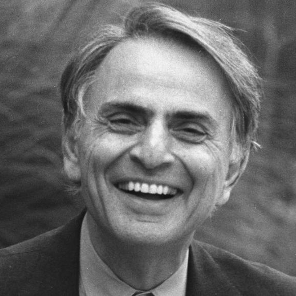
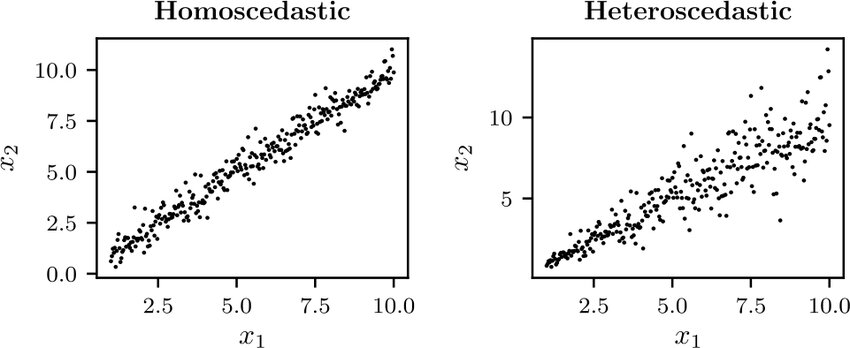
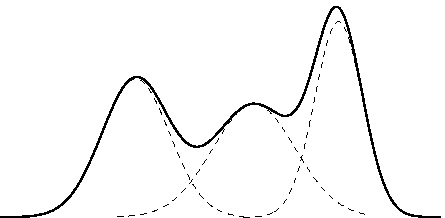
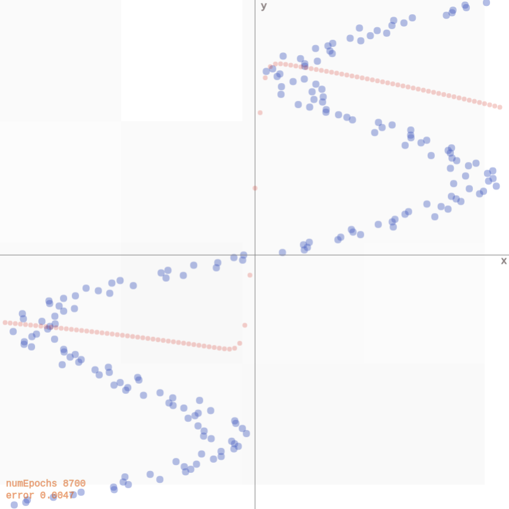
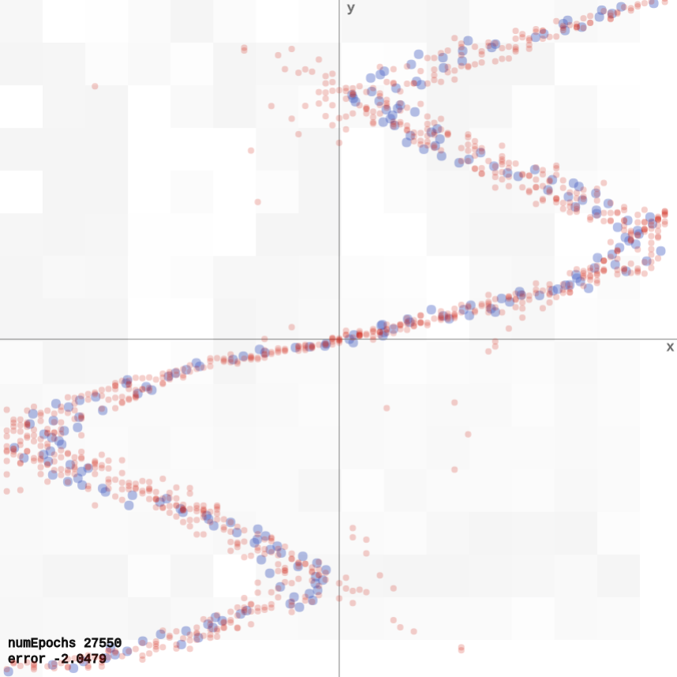
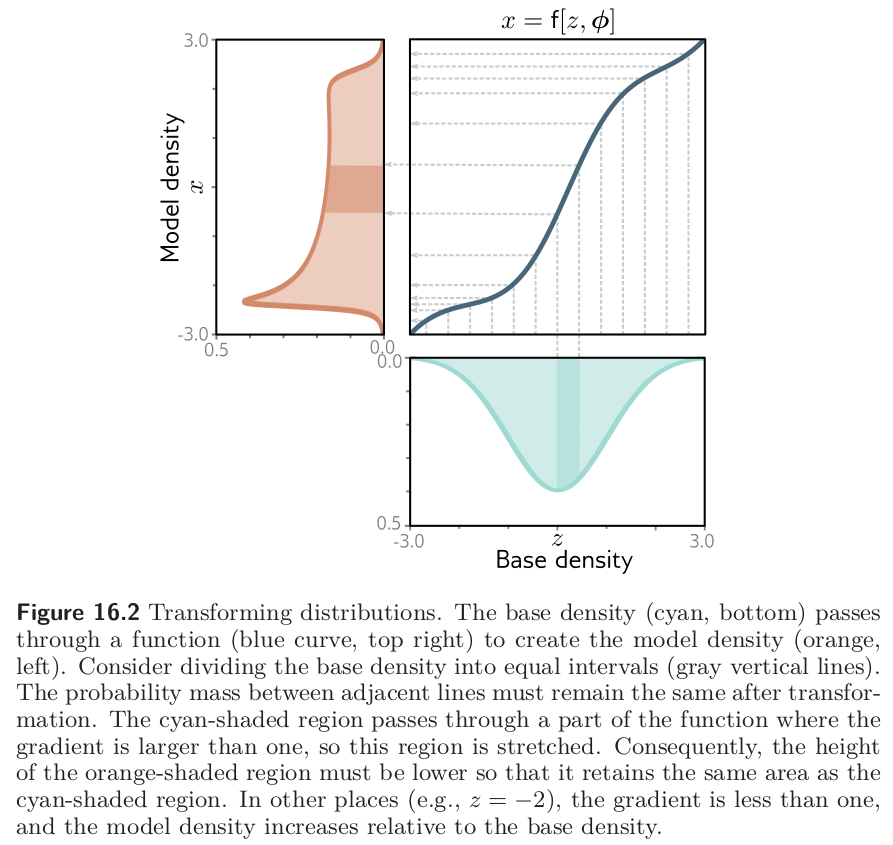
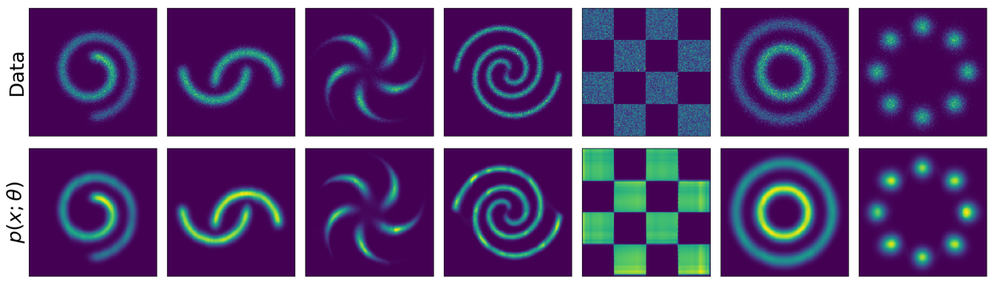
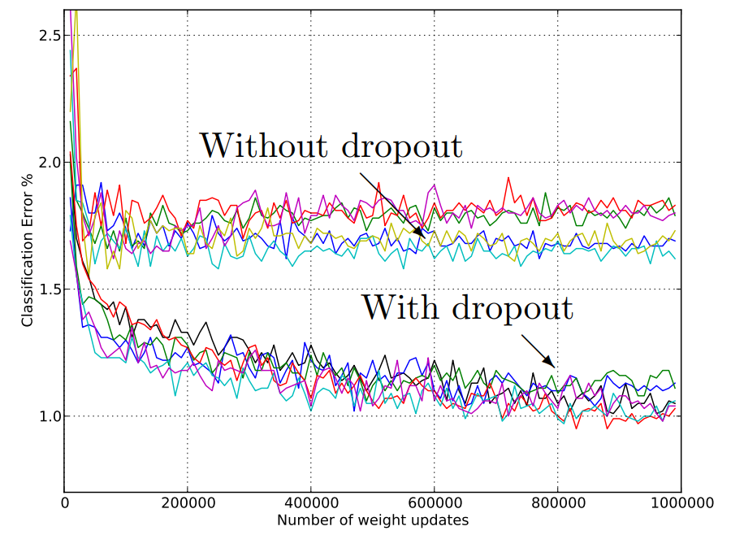
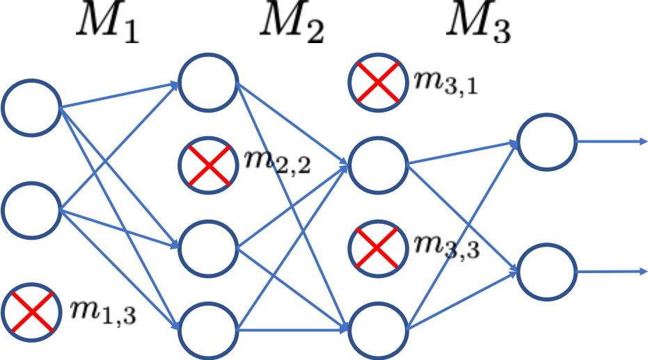
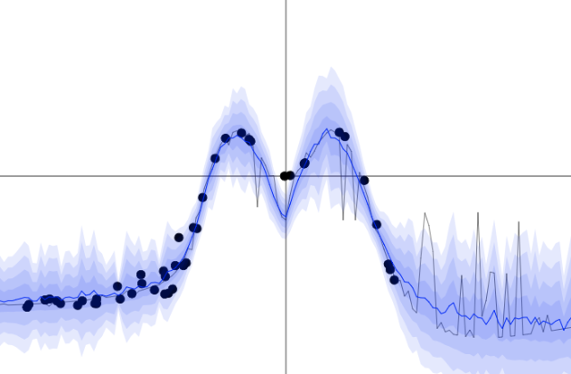

class: middle, center, title-slide

# Deep Learning

Lecture 10: Uncertainty

  
Prof. Gilles Louppe 
[g.louppe@uliege.be](mailto:g.louppe@uliege.be)

???

R: better glue Normalizing Flows with the rest of the lecture -> if p(y|x) is complex, then it would require many mixture components to approximate it. We need a stronger class of density estimators.
R: NFs are introduced as a way to estimate p(x) -> revise the notation to make it clear it can similarly be used to estimate p(y|x).

---

class: middle

.center.width-60[]

---

# Today

How to model *uncertainty* in deep learning?
- Uncertainty
- Aleatoric uncertainty
- Epistemic uncertainty

---

class: middle

.center.circle.width-30[]

.italic["Every time a scientific paper presents a bit of data, it's accompanied
by an .bold[error bar] – a quiet but insistent reminder that no knowledge is complete or perfect. It's a .bold[calibration of how much we trust what we think we know]."]

.pull-right[Carl Sagan]

???

Knowledge is an artefact. It is a mental construct.

Uncertainty is how much we trust this construct.

---

class: middle

# Uncertainty

---

class: middle

Uncertainty refers to epistemic situations involving imperfect or unknown information. It applies to predictions of future events, to physical measurements that are already made, or to the unknown. 

Uncertainty arises in partially observable or stochastic environments, as well as due to ignorance, indolence, or both.

.footnote[Credits: [Wikipedia](https://en.wikipedia.org/wiki/Uncertainty), 2023.]

???

## Why is uncertainty important?

Accounting for uncertainty leads to optimal decisions. Not accounting for uncertainty leads to suboptimal, wrong, or even catastrophic decisions.

---

class: middle

.italic[Case 1]. First assisted driving fatality in May 2016: Perception system mistook trailer's white side for bright sky.

.grid[
.kol-2-3[.center.width-100[]]
.kol-1-3[.center.width-100[]]
]

.footnote[Credits: Kendall and Gal, [What Uncertainties Do We Need in Bayesian Deep Learning for Computer Vision?](https://papers.nips.cc/paper/7141-what-uncertainties-do-we-need-in-bayesian-deep-learning-for-computer-vision.pdf), 2017.]

---

class: middle, center

.center[<video controls autoplay loop muted preload="auto" height="500" width="640">
  <source src="./figures/lec10/tesla.mp4" type="video/mp4">
</video>]

---

class: middle

.center.width-60[]

.italic[Case 2]. An image classification system erroneously identifies two African Americans as gorillas, raising concerns of racial discrimination.

.footnote[Credits: Kendall and Gal, [What Uncertainties Do We Need in Bayesian Deep Learning for Computer Vision?](https://papers.nips.cc/paper/7141-what-uncertainties-do-we-need-in-bayesian-deep-learning-for-computer-vision.pdf), 2017.]

---

class: middle

If these systems had assigned a high level of uncertainty to their erroneous predictions, then they might have been capable of making better decisions, and likely averting disaster.

---

class: middle

# Aleatoric uncertainty

---

class: middle

**Aleatoric** uncertainty captures noise inherent in the observations. For example, sensor noise or motion noise result in uncertainty.

This uncertainty *cannot be reduced* with more data.
However, aleatoric uncertainty could be reduced with better measurements.

???

It arises from the true data generating process being stochastic.

---

class: middle

Aleatoric uncertainty can further be categorized into:
- Homoscedastic uncertainty, which relates to the uncertainty that a particular task might cause. It stays constant for different inputs.
- Heteroscedastic uncertainty, which depends on the inputs to the model, with some inputs potentially having more noisy outputs than others.

 
.center.width-90[]

---

# Neural density estimation

Consider training data $(\mathbf{x}, y) \sim p(\mathbf{x}, y)$, with
- $\mathbf{x} \in \mathbb{R}^p$,
- $y \in \mathbb{R}$.

We do not wish to learn a function $\hat{y} = f(\mathbf{x})$, which would only produce point estimates. 

Instead we want to learn the full conditional density $$p(y|\mathbf{x}).$$

---

class: middle

## NN with Gaussian output layer 

We can model aleatoric uncertainty in the output by modelling the conditional distribution as a Gaussian distribution,
$$p(y|\mathbf{x}) = \mathcal{N}(y; \mu(\mathbf{x}), \sigma^2(\mathbf{x})),$$
where $\mu(x)$ and $\sigma^2(\mathbf{x})$ are parametric functions to be learned, such as neural networks.

Note: The Gaussian distribution is a modelling choice. Other parametric distributions can be used.

---

class: middle

.center.width-80[]

.center[Case 1: Homoscedastic aleatoric uncertainty]

---

class: middle

We have,
$$\begin{aligned}
&\arg \max\_{\theta,\sigma^2} p(\mathbf{d}|\theta,\sigma^2) \\\\
&= \arg \max\_{\theta,\sigma^2} \prod\_{\mathbf{x}\_i, y\_i \in \mathbf{d}} p(y\_i|\mathbf{x}\_i, \theta,\sigma^2) \\\\
&= \arg \max\_{\theta,\sigma^2} \prod\_{\mathbf{x}\_i, y\_i \in \mathbf{d}} \frac{1}{\sqrt{2\pi} \sigma} \exp\left(-\frac{(y\_i-\mu(\mathbf{x}\_i))^2}{2\sigma^2}\right) \\\\
&= \arg \min\_{\theta,\sigma^2} \sum\_{\mathbf{x}\_i, y\_i \in \mathbf{d}}  \frac{(y\_i-\mu(\mathbf{x}\_i))^2}{2\sigma^2} + \log(\sigma) + C
\end{aligned}$$

.question[What if $\sigma^2$ was fixed?]

---

class: middle

.center.width-80[]

.center[Case 2: Heteroscedastic aleatoric uncertainty]

---

class: middle

Same as for the homoscedastic case, except that that $\sigma^2$ is now a function of $\mathbf{x}\_i$:
$$\begin{aligned}
&\arg \max\_{\theta} p(\mathbf{d}|\theta) \\\\
&= \arg \max\_{\theta} \prod\_{\mathbf{x}\_i, y\_i \in \mathbf{d}} p(y\_i|\mathbf{x}\_i, \theta) \\\\
&= \arg \max\_{\theta} \prod\_{\mathbf{x}\_i, y\_i \in \mathbf{d}} \frac{1}{\sqrt{2\pi} \sigma(\mathbf{x}\_i)} \exp\left(-\frac{(y\_i-\mu(\mathbf{x}\_i))^2}{2\sigma^2(\mathbf{x}\_i)}\right) \\\\
&= \arg \min\_{\theta} \sum\_{\mathbf{x}\_i, y\_i \in \mathbf{d}}  \frac{(y\_i-\mu(\mathbf{x}\_i))^2}{2\sigma^2(\mathbf{x}\_i)} + \log(\sigma(\mathbf{x}\_i)) + C
\end{aligned}$$

.question[What is the purpose of $2\sigma^2(\mathbf{x}\_i)$? What about $\log(\sigma(\mathbf{x}\_i))$?]

???

Take care of properly parametrizing $\sigma^2(\mathbf{x}\_i)$ to ensure that it is positive.

---

class: middle

Modelling $p(y|\mathbf{x})$ as a unimodal (Gaussian) distribution can be inadequate since the conditional distribution may be .bold[multimodal].

???

Illustrate on the blackboard.

---

class: middle

## Gaussian mixture model

A **Gaussian mixture model** (GMM) defines instead $p(y|\mathbf{x})$ as a mixture of $K$ Gaussian components,
$$p(y|\mathbf{x}) = \sum\_{k=1}^K \pi\_k \mathcal{N}(y;\mu\_k, \sigma\_k^2),$$
where $0 \leq \pi\_k \leq 1$ for all $k$ and $\sum\_{k=1}^K \pi\_k = 1$.

.center.width-60[]

---

class: middle

A **mixture density network** (MDN) is a neural network implementation of the Gaussian mixture model.

.center.width-100[]

---

class: middle

## Illustration

Let us consider training data generated randomly as
$$y\_i = \mathbf{x}\_i + 0.3\sin(4\pi \mathbf{x}\_i) + \epsilon\_i$$
with $\epsilon\_i \sim \mathcal{N}$.

---

class: middle

.center[

.width-55[]

The data can be fit with a 2-layer network producing point estimates for $y$
([demo](http://otoro.net/ml/mixture/index.html)).

]

.footnote[Credits: David Ha, [Mixture Density Networks](http://blog.otoro.net/2015/06/14/mixture-density-networks/), 2015.]

---

class: middle

.center[

.width-55[]

If we flip $\mathbf{x}\_i$ and $y\_i$, the network faces issues since for each input, there are multiple outputs that can work. It produces an average of the correct values
([demo](http://otoro.net/ml/mixture/inverse.html)).

]

.footnote[Credits: David Ha, [Mixture Density Networks](http://blog.otoro.net/2015/06/14/mixture-density-networks/), 2015.]

---

class: middle

.center[

.width-55[]

A mixture density network models the data correctly, as it predicts for each input a distribution for the output, rather than a point estimate
([demo](http://otoro.net/ml/mixture/mixture.html)).

]

.footnote[Credits: David Ha, [Mixture Density Networks](http://blog.otoro.net/2015/06/14/mixture-density-networks/), 2015.]

---

# Normalizing flows

.center.width-80[]

Assume $p(\mathbf{z})$ is a uniformly distributed unit cube in $\mathbb{R}^3$ and $\mathbf{x} = f(\mathbf{z}) = 2\mathbf{z}$.

Since the total probability mass must be conserved, 
$$p(\mathbf{x}=f(\mathbf{z})) = p(\mathbf{z})\frac{V\_\mathbf{z}}{V\_\mathbf{x}}=p(\mathbf{z}) \frac{1}{8},$$
where $\frac{1}{8} = \left| \det \left( \begin{matrix}
2 & 0 & 0 \\\\ 
0 & 2 & 0 \\\\
0 & 0 & 2
\end{matrix} \right)\right|^{-1}$ represents the inverse determinant of the linear transformation $f$.

???

Motivate that picking a parametric family of distributions is not always easy. We want something more flexible.

---

class: middle

What if $f$ is non-linear?

.center.width-70[]

.footnote[Image credits: Simon J.D. Prince, [Understanding Deep Learning](https://udlbook.github.io/udlbook/), 2023.]

---

class: middle

## Change of variables theorem

If $f$ is non-linear,
- the Jacobian $J\_f(\mathbf{z})$ of $\mathbf{x} = f(\mathbf{z})$ represents the infinitesimal linear transformation in the neighborhood of $\mathbf{z}$;
- if the function is a bijective map, then the mass must be conserved locally.

Therefore, the local change of density yields
$$p(\mathbf{x}=f(\mathbf{z})) = p(\mathbf{z})\left| \det J\_f(\mathbf{z}) \right|^{-1}.$$

Similarly, for $g = f^{-1}$, we have $$p(\mathbf{x})=p(\mathbf{z}=g(\mathbf{x}))\left| \det J\_g(\mathbf{x}) \right|.$$

???

The Jacobian matrix of a function f: R^n -> R^m at a point z in R^n is an m x n matrix that represents the linear transformation induced by the function at that point. Geometrically, the Jacobian matrix can be thought of as a matrix of partial derivatives that describes how the function locally stretches or shrinks areas and volumes in the vicinity of the point z.

The determinant of the Jacobian matrix of f at z has a geometric interpretation as the factor by which the function locally scales areas or volumes. Specifically, if the determinant is positive, then the function locally expands areas and volumes, while if it is negative, the function locally contracts areas and volumes. The absolute value of the determinant gives the factor by which the function scales the areas or volumes.

---

class: middle 

## Normalizing flows

A normalizing flow is a change of variable $f$ that transforms a base distribution $p(\mathbf{z})$ into $p(\mathbf{x})$ by a series of invertible transformations.

.center.width-100[]

---

class: middle

Formally, 
- $f$ is a composition $f=f\_K \circ ... \circ f\_1$, where each $f\_k$ is an invertible neural transformation;
- $g_k = f^{-1}_k$;
- $\mathbf{z}\_k = f\_k(\mathbf{z}_{k-1})$, with $\mathbf{z}\_0 = \mathbf{z}$ and $\mathbf{z}\_K = \mathbf{x}$;
- $p(\mathbf{z}\_k) = p(\mathbf{z}\_{k-1} = g\_k(\mathbf{z}\_k)) \left| \det J\_{g\_k}(\mathbf{z}\_k) \right|$.

.footnote[Image credits: [Lilian Weng](https://lilianweng.github.io/lil-log/2018/10/13/flow-based-deep-generative-models), 2018.]

---

class: middle

## Example: coupling layers 

Assume $\mathbf{z} = (\mathbf{z}\_a, \mathbf{z}\_b)$ and $\mathbf{x} = (\mathbf{x}\_a, \mathbf{x}\_b)$. Then,
- Forward mapping $\mathbf{x} = f(\mathbf{z})$: 
$$\mathbf{x}\_a = \mathbf{z}\_a, \quad \mathbf{x}\_b = \mathbf{z}\_b \odot \exp(s(\mathbf{z}\_a)) + t(\mathbf{z}\_a),$$
- Inverse mapping $\mathbf{z} = g(\mathbf{x})$:
$$\mathbf{z}\_a = \mathbf{x}\_a, \quad \mathbf{z}\_b = (\mathbf{x}\_b - t(\mathbf{x}\_a)) \odot \exp(-s(\mathbf{x}\_a)),$$

where $s$ and $t$ are arbitrary neural networks.

---

class: middle

For $\mathbf{x} = (\mathbf{x}\_a, \mathbf{x}\_b)$, the log-likelihood is
$$\begin{aligned}\log p(\mathbf{x}) &= \log p(\mathbf{z} = g(\mathbf{x})) \left| \det J\_g(\mathbf{x}) \right|\end{aligned}$$
where the Jacobian $J\_g(\mathbf{x}) = \frac{\partial \mathbf{z}}{\partial \mathbf{x}}$ is a lower triangular matrix $$\left( \begin{matrix}
\mathbf{I} & 0 \\\\
\frac{\partial \mathbf{z}\_b}{\partial \mathbf{x}\_a} & \text{diag}(\exp(-s(\mathbf{x}\_a))) \end{matrix} \right),$$
such that $\left| \det J\_g(\mathbf{x}) \right| = \prod\_i \exp(-s(\mathbf{x}\_a))\_i = \exp(-\sum\_i s(\mathbf{x}\_a)\_i)$.

Therefore, the log-likelihood is $$\log p(\mathbf{x}) = \log p(\mathbf{z} = g(\mathbf{x})) -\sum\_i s(\mathbf{x}\_a)\_i.$$

---

class: middle

.center.width-90[]

.center[Normalizing flows can fit complex multimodal discontinuous densities.]

.footnote[Image credits: [Wehenkel and Louppe](https://arxiv.org/abs/1908.05164), 2019.]

---

class: middle

# Epistemic uncertainty

---

class: middle

**Epistemic** uncertainty accounts for uncertainty in the model or in its parameters.
It captures our *ignorance* about which model generated the collected data.

It can be explained away given enough data.

.footnote[Credits: Kendall and Gal, [What Uncertainties Do We Need in Bayesian Deep Learning for Computer Vision?](https://papers.nips.cc/paper/7141-what-uncertainties-do-we-need-in-bayesian-deep-learning-for-computer-vision.pdf), 2017.]

???

Once we have decided on a model of the true data generating process, we face uncertainty in how much we can trust the model or its parameters.

---

# Bayesian neural networks

To capture epistemic uncertainty in a neural network, we model our ignorance with a prior distribution $p(\mathbf{\omega})$ over its weights.

Then we invoke Bayes for making predictions.

  
.center[
.width-60[] &nbsp;&nbsp;&nbsp;&nbsp; .circle.width-30[]
]

---

class: middle

The prior predictive distribution at $\mathbf{x}$ is given by integrating over all possible weight configurations,
$$p(y|\mathbf{x}) = \int p(y|\mathbf{x}, \mathbf{\omega}) p(\mathbf{\omega}) d\mathbf{\omega}.$$

Given training data $\mathbf{d}=\\{(\mathbf{x}\_1, y\_1), ..., (\mathbf{x}\_N, y\_N)\\}$ a Bayesian update results in the posterior
$$p(\mathbf{\omega}|\mathbf{d}) = \frac{p(\mathbf{d}|\mathbf{\omega})p(\mathbf{\omega})}{p(\mathbf{d})}$$
where the likelihood $p(\mathbf{d}|\omega) = \prod\_i p(y\_i | \mathbf{x}\_i, \omega).$

The posterior predictive distribution is then given by
$$p(y|\mathbf{x},\mathbf{d}) = \int p(y|\mathbf{x}, \mathbf{\omega}) p(\mathbf{\omega}|\mathbf{d}) d\mathbf{\omega}.$$

---

class: middle

Bayesian neural networks are *easy to formulate*,  but notoriously **difficult** to perform inference in.

$p(\mathbf{d})$ is intractable to evaluate, which results in the posterior $p(\mathbf{\omega}|\mathbf{d})$ not being tractable either.

Therefore, we must rely on approximations.

---

# Variational inference

Variational inference can be used for building an approximation $q(\mathbf{\omega};\nu)$ of the posterior $p(\mathbf{\omega}|\mathbf{d})$.

We can show that minimizing
$$\text{KL}(q(\mathbf{\omega};\nu) || p(\mathbf{\omega}|\mathbf{d}))$$
with respect to the variational parameters $\nu$, is identical to maximizing the evidence lower bound objective (ELBO)
$$\text{ELBO}(\nu) = \mathbb{E}\_{q(\mathbf{\omega};\nu)} \left[\log p(\mathbf{d}| \mathbf{\omega})\right] - \text{KL}(q(\mathbf{\omega};\nu) || p(\mathbf{\omega})).$$

???

Do it on the blackboard.

---

class: middle

The integral in the ELBO is not tractable for almost all $q$, but it can be maximized with stochastic gradient ascent:

1. Sample $\hat{\omega} \sim q(\mathbf{\omega};\nu)$.
2. Do one step of maximization with respect to $\nu$ on
$$\hat{L}(\nu) = \log p(\mathbf{d}|\hat{\omega}) - \log\frac{q(\hat{\omega};\nu)}{p(\hat{\omega})} $$

In the context of Bayesian neural networks, this procedure is also known as **Bayes by backprop** (Blundell et al, 2015).

---

# Dropout

Dropout is an **empirical** technique that was first proposed to avoid overfitting in neural networks.

At *each training step* (i.e., for each sample within a mini-batch):
- Remove each node in the network with a probability $p$.
- Update the weights of the remaining nodes with backpropagation.

.center.width-70[]

???

Remind the students we used Dropout in Lec 8 when implementing a Transformer.

---

class: middle

At **test time**, either:
- Make predictions using the trained network *without* dropout but rescaling the weights by the dropout probability $p$ (fast and standard).
- Sample $T$ neural networks using dropout and average their predictions (slower but better principled).

---

class: middle, center

.width-100[]

---

class: middle

## Why does dropout work?
- It makes the learned weights of a node less sensitive to the weights of the other nodes.
- This forces the network to learn several independent representations of the patterns and thus decreases overfitting.
- It approximates **Bayesian model averaging**.

---

class: middle

## Dropout does variational inference

What variational family $q$ would correspond to dropout?

- Let us split the weights $\omega$ per layer,
$\omega = \\{ \mathbf{W}\_1, ..., \mathbf{W}\_L \\},$
where $\mathbf{W}\_i$ is further split per unit
$\mathbf{W}\_i = \\{ \mathbf{w}\_{i,1}, ..., \mathbf{w}\_{i,q\_i} \\}.$
- Variational parameters $\nu$ are split similarly into $\nu = \\{ \mathbf{M}\_1, ..., \mathbf{M}\_L \\}$, with $\mathbf{M}\_i = \\{ \mathbf{m}\_{i,1}, ..., \mathbf{m}\_{i,q\_i} \\}$.
- Then, the proposed $q(\omega;\nu)$ is defined as follows:
$$
\begin{aligned}
q(\omega;\nu) &= \prod\_{i=1}^L q(\mathbf{W}\_i; \mathbf{M}\_i) \\\\
q(\mathbf{W}\_i; \mathbf{M}\_i)  &= \prod\_{k=1}^{q\_i} q(\mathbf{w}\_{i,k}; \mathbf{m}\_{i,k}) \\\\
q(\mathbf{w}\_{i,k}; \mathbf{m}\_{i,k}) &= p\delta\_0(\mathbf{w}\_{i,k}) + (1-p)\delta\_{\mathbf{m}\_{i,k}}(\mathbf{w}\_{i,k})
\end{aligned}
$$
where $\delta\_a(x)$ denotes a (multivariate) Dirac distribution centered at $a$.

???

Note that this assumes the parameterization $\mathbf{h} = \mathbf{W}\mathbf{x}$, without the transpose on $\mathbf{W}$. 

---

class: middle

Given the previous definition for $q$, sampling parameters $\hat{\omega} = \\{ \hat{\mathbf{W}}\_1, ..., \hat{\mathbf{W}}\_L \\}$ is done as follows:
- Draw binary  $z\_{i,k} \sim \text{Bernoulli}(1-p)$ for each layer $i$ and unit $k$.
- Compute $\hat{\mathbf{W}}\_i = \mathbf{M}\_i \text{diag}([z\_{i,k}]\_{k=1}^{q\_{i-1}})$,
where $\mathbf{M}\_i$ denotes a matrix composed of the columns $\mathbf{m}\_{i,k}$.

.grid[
.kol-3-5[
That is, $\hat{\mathbf{W}}\_i$ are obtained by setting columns of $\mathbf{M}\_i$ to zero with probability $p$.

This is **strictly equivalent to dropout**, i.e. removing units from the network with probability $p$.

]
.kol-2-5[.center.width-100[]]
]

---

class: middle

Therefore, one step of stochastic gradient descent on the ELBO becomes:
1. Sample $\hat{\omega} \sim q(\mathbf{\omega};\nu)$ $\Leftrightarrow$ Randomly set units of the network to zero $\Leftrightarrow$ Dropout.
2. Do one step of maximization with respect to $\nu = \\{ \mathbf{M}\_i \\}$ on
$$\hat{L}(\nu) = \log p(\mathbf{d}|\hat{\omega}) - \text{KL}(q(\mathbf{\omega};\nu) || p(\mathbf{\omega})).$$

---

class: middle

Maximizing $\hat{L}(\nu)$ is equivalent to minimizing
$$-\hat{L}(\nu) = -\log p(\mathbf{d}|\hat{\omega}) + \text{KL}(q(\mathbf{\omega};\nu) || p(\mathbf{\omega})) $$

This is also equivalent to one minimization step of a standard classification or regression objective:
- The first term is the typical objective (such as the cross-entropy).
- The second term forces $q$ to remain close to the prior $p(\omega)$.
    - If $p(\omega)$ is Gaussian, minimizing the $\text{KL}$ is equivalent to $\ell\_2$ regularization.
    - If $p(\omega)$ is Laplacian, minimizing the $\text{KL}$ is equivalent to  $\ell\_1$ regularization.

---

class: middle

Conversely, this shows that when **training a network with dropout** with a standard classification or regression objective, one *is actually implicitly doing variational inference* to match the posterior distribution of the weights.

---

class: middle

## Uncertainty estimates from dropout

Proper epistemic uncertainty estimates at $\mathbf{x}$ can be obtained in a principled way using Monte-Carlo integration:
- Draw $T$ sets of network parameters $\hat{\omega}\_t$ from $q(\omega;\nu)$.
- Compute the predictions for the $T$ networks, $\\{ f(\mathbf{x};\hat{\omega}\_t) \\}\_{t=1}^T$.
- Approximate the predictive mean and variance as follows:
$$
\begin{aligned}
\mathbb{E}\_{p(y|\mathbf{x},\mathbf{d})}\left[y\right] &\approx \frac{1}{T} \sum\_{t=1}^T f(\mathbf{x};\hat{\omega}\_t) \\\\
\mathbb{V}\_{p(y|\mathbf{x},\mathbf{d})}\left[y\right] &\approx \frac{1}{T} \sum\_{t=1}^T f(\mathbf{x};\hat{\omega}\_t)^2 - \hat{\mathbb{E}}\left[y\right]^2
\end{aligned}
$$

---

class: middle, center

.center.width-80[]

([demo](https://www.cs.ox.ac.uk/people/yarin.gal/website/blog_2248.html))

---

class: middle

## Pixel-wise depth regression

.center.width-80[]

.footnote[Credits: Kendall and Gal, [What Uncertainties Do We Need in Bayesian Deep Learning for Computer Vision?](https://papers.nips.cc/paper/7141-what-uncertainties-do-we-need-in-bayesian-deep-learning-for-computer-vision.pdf), 2017.]

---

exclude: true

# Bayesian Infinite Networks

Consider the 1-layer MLP with a hidden layer of size $q$ and a bounded activation function $\sigma$:

$$\begin{aligned}
f(x) &= b + \sum\_{j=1}^q v\_j h\_j(x)\\\\
h\_j(x) &= \sigma\left(a\_j + \sum\_{i=1}^p u\_{i,j}x\_i\right)
\end{aligned}$$

Assume Gaussian priors $v\_j \sim \mathcal{N}(0, \sigma\_v^2)$, $b \sim \mathcal{N}(0, \sigma\_b^2)$, $u\_{i,j} \sim \mathcal{N}(0, \sigma\_u^2)$ and $a\_j \sim \mathcal{N}(0, \sigma\_a^2)$.

---

exclude: true
class: middle

For a fixed value $x^{(1)}$, let us consider the prior distribution of $f(x^{(1)})$ implied by
the prior distributions for the weights and biases.

We have
$$\mathbb{E}[v\_j h\_j(x^{(1)})] = \mathbb{E}[v\_j] \mathbb{E}[h\_j(x^{(1)})] = 0,$$
since $v\_j$ and $h\_j(x^{(1)})$ are statistically independent and $v\_j$ has zero mean by hypothesis.

The variance of the contribution of each hidden unit $h\_j$ is
$$\begin{aligned}
\mathbb{V}[v\_j h\_j(x^{(1)})] &= \mathbb{E}[(v\_j h\_j(x^{(1)}))^2] - \mathbb{E}[v\_j h\_j(x^{(1)})]^2 \\\\
&= \mathbb{E}[v\_j^2] \mathbb{E}[h\_j(x^{(1)})^2] \\\\
&= \sigma\_v^2 \mathbb{E}[h\_j(x^{(1)})^2],
\end{aligned}$$
which must be finite since $h\_j$ is bounded by its activation function.

We define $V(x^{(1)}) = \mathbb{E}[h\_j(x^{(1)})^2]$, and is the same for all $j$.

---

exclude: true
class: middle

## What if $q \to \infty$?

By the Central Limit Theorem, as $q \to \infty$, the total contribution
of the hidden units, $\sum\_{j=1}^q v\_j h\_j(x)$, to the value of $f(x^{(1)})$ becomes a Gaussian with variance $q \sigma_v^2 V(x^{(1)})$.

The bias $b$ is also Gaussian, of variance $\sigma\_b^2$, so for large $q$, the prior
distribution $f(x^{(1)})$ is a Gaussian of variance $\sigma\_b^2 + q \sigma_v^2 V(x^{(1)})$.

---

exclude: true
class: middle

Accordingly, for $\sigma\_v = \omega\_v q^{-\frac{1}{2}}$, for some fixed $\omega\_v$, the prior $f(x^{(1)})$ converges to a Gaussian of mean zero and variance $\sigma\_b^2 + \omega\_v^2 \sigma_v^2 V(x^{(1)})$ as $q \to \infty$.

For two or more fixed values $x^{(1)}, x^{(2)}, ...$, a similar argument shows that,
as $q \to \infty$, the joint distribution of the outputs converges to a multivariate Gaussian
with means of zero and covariances of
$$\begin{aligned}
\mathbb{E}[f(x^{(1)})f(x^{(2)})] &= \sigma\_b^2 + \sum\_{j=1}^q \sigma\_v^2 \mathbb{E}[h\_j(x^{(1)}) h\_j(x^{(2)})] \\\\
&= \sigma\_b^2 + \omega_v^2 C(x^{(1)}, x^{(2)})
\end{aligned}$$
where $C(x^{(1)}, x^{(2)}) = \mathbb{E}[h\_j(x^{(1)}) h\_j(x^{(2)})]$ and is the same for all $j$.

---

exclude: true
class: middle

This result states that for any set of fixed points $x^{(1)}, x^{(2)}, ...$,
the joint distribution of $f(x^{(1)}), f(x^{(2)}), ...$ is a multivariate
Gaussian.

In other words,  the *infinitely wide 1-layer MLP* converges towards
a  **Gaussian process**.

 

.center.width-80[]

.center[(Neal, 1995)]

---

class: end-slide, center
count: false

The end.
