class: middle, center, title-slide

# Deep Learning

Lecture 11: Auto-encoders and variational auto-encoders

  
Prof. Gilles Louppe 
[g.louppe@uliege.be](mailto:g.louppe@uliege.be)

---

# Today

Learn a model of the data.

- Auto-encoders
- Variational inference
- Variational auto-encoders

---

class: middle

.center.circle.width-30[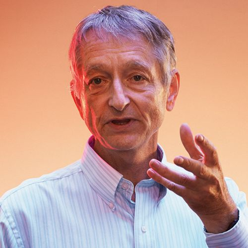]

.italic["The brain has about $10^{14}$ synapses and we only live for about $10^9$
seconds. So we have a lot more parameters than data. This
motivates the idea that we must do a lot of unsupervised learning
since the perceptual input (including proprioception) is the only
place we can get $10^5$ dimensions of constraint per second."]

.pull-right[Geoffrey Hinton, 2014.]

---

class: middle

.grid[
.kol-1-3[.circle.width-95[]]
.kol-2-3[.width-100[]]
]

.italic["We need tremendous amount of information to build machines that have common sense and generalize."]

.pull-right[Yann LeCun, 2016.]

---

class: middle

## Deep unsupervised learning

Deep unsupervised learning is about learning a model of the data, explicitly or implicitly, without requiring labels.

- *Generative models*: recreate the raw data distribution (e.g., the distribution of natural images).
- **Self-supervised learning**: solve puzzle tasks that require semantic understanding (e.g., predict a missing word in a sequence).

---

class: middle

## Generative models

A (deep) **generative model** is a probabilistic model $p\_\theta$ that can be used as a simulator of the data. 

Formally, a generative model defines a probability distribution $p\_\theta(\mathbf{x})$ over the data $\mathbf{x} \in \mathcal{X}$, where the parameters $\theta$ are learned to match the (unknown) data distribution $p(\mathbf{x})$.

.center.width-60[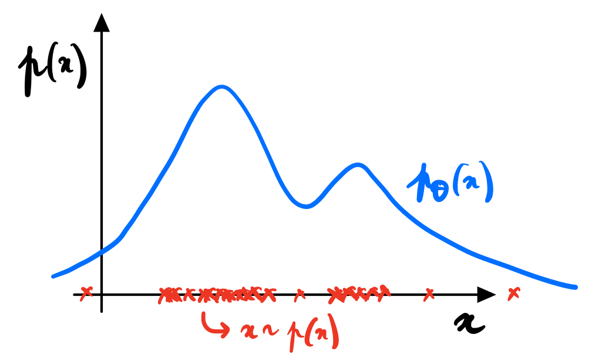]

???

This is conceptually identical to what we already did in Lecture 10 when we wanted to learn $p(y|x)$. We still want to learn a distribution, but this time it is the distribution of the input data itself.

---

class: middle, black-slide

.grid[
.kol-1-2.center[
.width-80[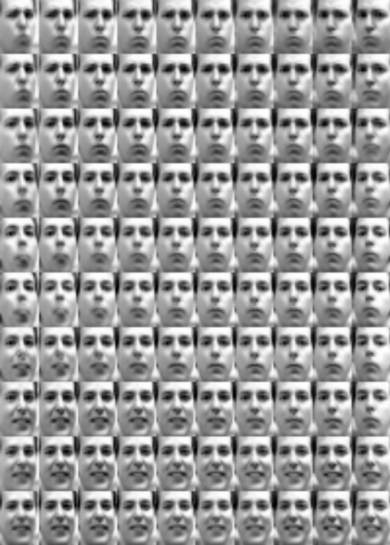]
]
.kol-1-2.center[
 
.width-75[]
]
]
.grid[
.kol-1-2.center[

Variational auto-encoders  (Kingma and Welling, 2013)

]
.kol-1-2.center[

Diffusion models 
(Midjourney, 2023)

]
]

---

class: black-slide
background-image: url(./figures/lec11/landscape.png)
background-size: contain

.footnote[Credits: [Karsten et al](https://cvpr2022-tutorial-diffusion-models.github.io/), 2022; [Siddharth Mishra-Sharma](https://smsharma.io/iaifi-summer-school-2023/), 2023.]

---

class: middle

## What can we do with generative models?

.grid[
.kol-1-3.center[

Produce samples $$\mathbf{x} \sim p(\mathbf{x} | \theta)$$

]
.kol-1-3.center[
Evaluate densities $$p(\mathbf{x}|\theta)$$ $$p(\theta | \mathbf{x}) = \frac{p(\mathbf{x} | \theta) p(\theta)}{p(\mathbf{x})}$$

]
.kol-1-3.center[
Encode complex priors $$p(\mathbf{x})$$

]
]

.grid[
.kol-1-3.center[.width-100[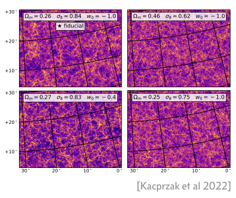]]
.kol-1-3.center[.width-100[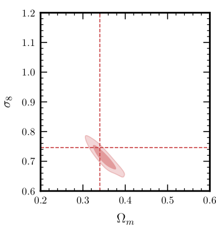]]
.kol-1-3.center[.width-90[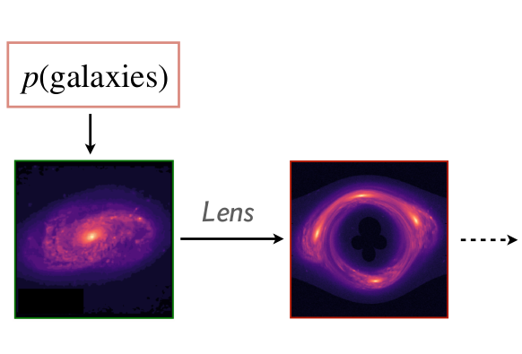]]
]

.footnote[Credits: [Siddharth Mishra-Sharma](https://smsharma.io/iaifi-summer-school-2023/), 2023.]

---

class: middle
count: false

# Auto-encoders

---

class: middle

.center.width-90[]

.footnote[Credits: Francois Fleuret, [Deep Learning](https://fleuret.org/dlc/), UNIGE/EPFL.]

---

class: middle
count: false

.center.width-90[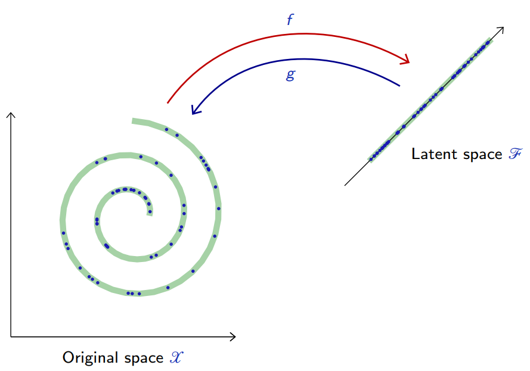]

.footnote[Credits: Francois Fleuret, [Deep Learning](https://fleuret.org/dlc/), UNIGE/EPFL.]

---

# Auto-encoders

An auto-encoder is a composite function made of
- an **encoder** $f$ from the original space $\mathcal{X}$ to a latent space $\mathcal{Z}$,
- a *decoder* $g$ to map back to $\mathcal{X}$,

such that $g \circ f$ is close to the identity on the data.

.center.width-80[]

.footnote[Credits: Francois Fleuret, [Deep Learning](https://fleuret.org/dlc/), UNIGE/EPFL.]

---

class: middle

Let $p(\mathbf{x})$ be the data distribution over $\mathcal{X}$. A good auto-encoder could be characterized with the reconstruction loss
$$\mathbb{E}\_{\mathbf{x} \sim p(\mathbf{x})} \left[ || \mathbf{x} - g \circ f(\mathbf{x}) ||^2 \right] \approx 0.$$

Given two parameterized mappings $f(\cdot; \theta\_f)$ and $g(\cdot;\theta\_g)$, training consists of minimizing an empirical estimate of that loss,
$$\theta\_f, \theta\_g = \arg \min\_{\theta\_f, \theta\_g} \frac{1}{N} \sum_{i=1}^N || \mathbf{x}\_i - g(f(\mathbf{x}\_i,\theta\_f), \theta\_g) ||^2.$$

.footnote[Credits: Francois Fleuret, [Deep Learning](https://fleuret.org/dlc/), UNIGE/EPFL.]

---

class: middle

For example, when the auto-encoder is linear,
$$
\begin{aligned}
f: \mathbf{z} &= \mathbf{U}^T \mathbf{x} \\\\
g: \hat{\mathbf{x}} &= \mathbf{U} \mathbf{z},
\end{aligned}
$$
with $\mathbf{U} \in \mathbb{R}^{p\times d}$, the reconstruction error reduces to
$$\mathbb{E}\_{\mathbf{x} \sim p(\mathbf{x})} \left[ || \mathbf{x} - \mathbf{U}\mathbf{U}^T \mathbf{x} ||^2 \right].$$

In this case, an optimal solution is given by PCA.

---

class: middle

## Deep auto-encoders

.center.width-80[&nbsp;&nbsp;&nbsp;&nbsp;&nbsp;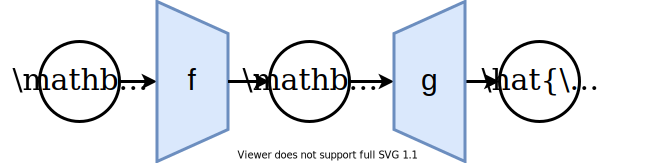]

Better results can be achieved with more sophisticated classes of mappings than linear projections: use deep neural networks for $f$ and $g$.

For instance,
- by combining a multi-layer perceptron encoder $f : \mathbb{R}^p \to \mathbb{R}^d$ with a multi-layer perceptron decoder $g: \mathbb{R}^d \to \mathbb{R}^p$.
- by combining a convolutional network encoder $f : \mathbb{R}^{w\times h \times c} \to \mathbb{R}^d$ with a decoder $g : \mathbb{R}^d \to \mathbb{R}^{w\times h \times c}$ composed of the reciprocal transposed convolutional layers.

---

class: middle

.center.width-60[]

.footnote[Credits: Francois Fleuret, [Deep Learning](https://fleuret.org/dlc/), UNIGE/EPFL.]

---

class: middle

.center.width-60[]

.footnote[Credits: Francois Fleuret, [Deep Learning](https://fleuret.org/dlc/), UNIGE/EPFL.]

---

class: middle

.center.width-60[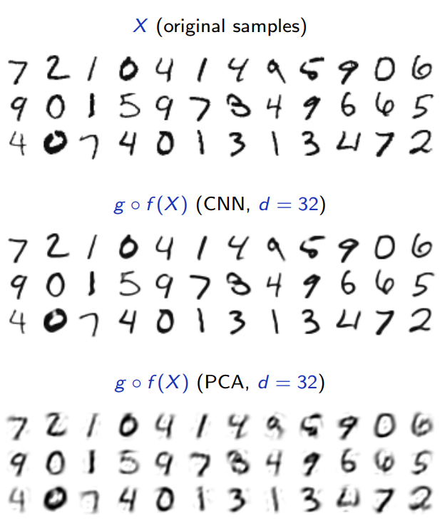]

.footnote[Credits: Francois Fleuret, [Deep Learning](https://fleuret.org/dlc/), UNIGE/EPFL.]

---

class: middle

## Interpolation

To get an intuition of the learned latent representation, we can pick two samples $\mathbf{x}$ and $\mathbf{x}'$ at random and interpolate samples along the line in the latent space.

 
.center.width-80[]

.footnote[Credits: Francois Fleuret, [Deep Learning](https://fleuret.org/dlc/), UNIGE/EPFL.]

---

class: middle

.center.width-60[]

.footnote[Credits: Francois Fleuret, [Deep Learning](https://fleuret.org/dlc/), UNIGE/EPFL.]

---

class: middle

.center.width-60[]

.footnote[Credits: Francois Fleuret, [Deep Learning](https://fleuret.org/dlc/), UNIGE/EPFL.]

---

# Denoising auto-encoders

Besides dimension reduction, auto-encoders can capture dependencies between signal components to restore degraded or noisy signals. 
In this case, the composition $$h = g \circ f : \mathcal{X} \to \mathcal{X}$$ is a **denoising** auto-encoder.

The goal is to optimize $h$ such that a perturbation $\tilde{\mathbf{x}}$ of the signal $\mathbf{x}$ is restored to $\mathbf{x}$, hence $$h(\tilde{\mathbf{x}}) \approx \mathbf{x}.$$

.footnote[Credits: Francois Fleuret, [Deep Learning](https://fleuret.org/dlc/), UNIGE/EPFL.]

---

class: middle

.center.width-60[]

.footnote[Credits: Francois Fleuret, [Deep Learning](https://fleuret.org/dlc/), UNIGE/EPFL.]

---

class: middle

.center.width-60[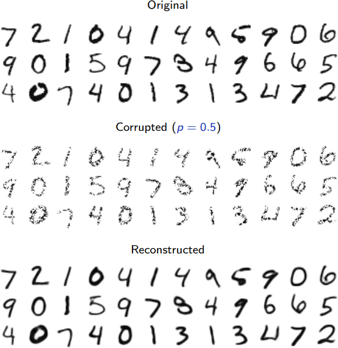]

.footnote[Credits: Francois Fleuret, [Deep Learning](https://fleuret.org/dlc/), UNIGE/EPFL.]

---

class: middle

.center.width-60[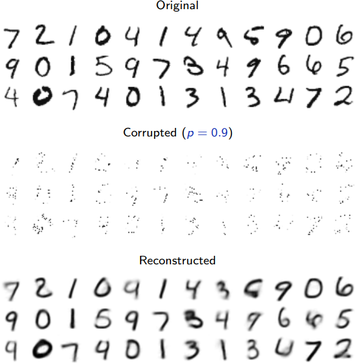]

.footnote[Credits: Francois Fleuret, [Deep Learning](https://fleuret.org/dlc/), UNIGE/EPFL.]

---

class: middle

.center.width-60[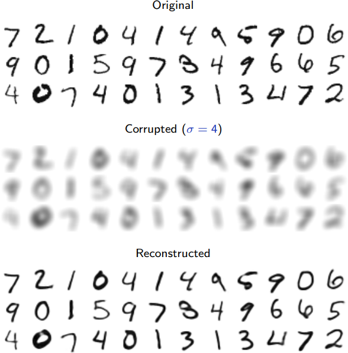]

.footnote[Credits: Francois Fleuret, [Deep Learning](https://fleuret.org/dlc/), UNIGE/EPFL.]

---

class: middle

A fundamental weakness of denoising auto-encoders is that the posterior $p(\mathbf{x}|\tilde{\mathbf{x}})$ is possibly multi-modal.

If we train an auto-encoder with the quadratic loss (i.e., implicitly assuming a Gaussian likelihood), then the best reconstruction is 
$$h(\tilde{\mathbf{x}}) = \mathbb{E}[\mathbf{x}|\tilde{\mathbf{x}}],$$
which may be very unlikely under $p(\mathbf{x}|\tilde{\mathbf{x}})$.

.center.width-60[]

.footnote[Credits: Francois Fleuret, [Deep Learning](https://fleuret.org/dlc/), UNIGE/EPFL.]

???

Also, the quadratic loss leads to blurry and unrealistic reconstructions, for the reason that the quadratic loss minimizer may be very unlikely under the posterior.

---

# Sampling from an AE's latent space

The generative capability of the decoder $g$ in an auto-encoder can be assessed by introducing a (simple) density model $q$ over the latent space $\mathcal{Z}$, sample there, and map the samples into the data space $\mathcal{X}$ with $g$.

.center.width-80[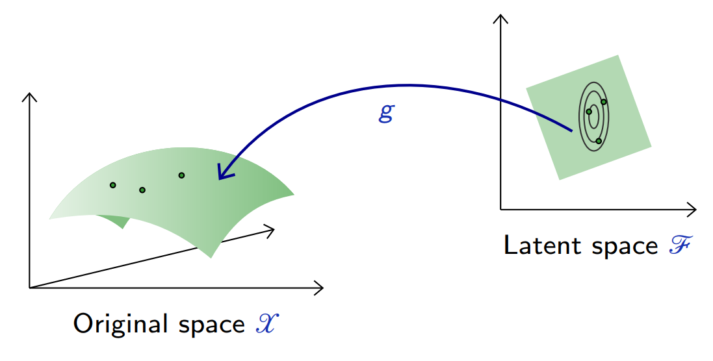]

.footnote[Credits: Francois Fleuret, [Deep Learning](https://fleuret.org/dlc/), UNIGE/EPFL.]

---

class: middle

For instance, a factored Gaussian model with diagonal covariance matrix,
$$q(\mathbf{z}) = \mathcal{N}(\hat{\mu}, \hat{\Sigma}),$$
where both $\\hat{\mu}$ and $\hat{\Sigma}$ are estimated on training data.

---

class: middle

.center.width-60[]

.footnote[Credits: Francois Fleuret, [Deep Learning](https://fleuret.org/dlc/), UNIGE/EPFL.]

---

class: middle

These results are not satisfactory because the density model on the latent space is **too simple and inadequate**.

Building a good model in latent space amounts to our original problem of modeling an empirical distribution, although it may now be in a lower dimension space.

.footnote[Credits: Francois Fleuret, [Deep Learning](https://fleuret.org/dlc/), UNIGE/EPFL.]

---

class: middle
count: false

# Variational inference

???

Switch to BB.

---

class: middle

## Latent variable model

.center.width-20[]

Consider for now a **prescribed latent variable model** that relates a set of observable variables $\mathbf{x} \in \mathcal{X}$ to a set of unobserved variables $\mathbf{z} \in \mathcal{Z}$.

The probabilistic model defines a joint probability distribution $p\_\theta(\mathbf{x}, \mathbf{z})$, which decomposes as
$$p\_\theta(\mathbf{x}, \mathbf{z}) = p\_\theta(\mathbf{x}|\mathbf{z}) p(\mathbf{z}).$$

???

The probabilistic model is given and motivated by domain knowledge assumptions.

Examples include:
- Linear discriminant analysis
- Bayesian networks
- Hidden Markov models
- Probabilistic programs

---

class: middle, black-slide

.center[<video controls autoplay loop muted preload="auto" height="480" width="640">
  <source src="./figures/lec11/galton.mp4" type="video/mp4">
</video>]

???

If we interpret $\mathbf{z}$ as causal factors for the high-dimension representations $\mathbf{x}$, then
sampling from $p\_\theta(\mathbf{x}|\mathbf{z})$ can be interpreted as **a stochastic generating process** from $\mathcal{Z}$ to $\mathcal{X}$.

---

   

## How to fit a latent variable model?

$$\begin{aligned}
\theta^{\*} &= \arg \max\_\theta p\_\theta(\mathbf{x}) \\\\
&= \arg \max\_\theta \int p\_\theta(\mathbf{x}|\mathbf{z}) p(\mathbf{z}) d\mathbf{z}\\\\
&= \arg \max\_\theta \mathbb{E}\_{p(\mathbf{z})}\left[ p\_\theta(\mathbf{x}|\mathbf{z}) \right] d\mathbf{z}\\\\
&\approx \arg \max\_\theta \frac{1}{N} \sum\_{i=1}^N p\_\theta(\mathbf{x}|\mathbf{z}\_i) 
\end{aligned}$$

--

count: false

.alert[The curse of dimensionality will lead to poor estimates of the expectation.]

---

class: middle

## Variational inference

Let us instead consider a variational approach to fit the model parameters $\theta$.

Using a **variational distribution** $q\_\phi(\mathbf{z})$ over the latent variables $\mathbf{z}$, we have
$$\begin{aligned}
\log p\_\theta(\mathbf{x}) &= \log \mathbb{E}\_{p(\mathbf{z})}\left[ p\_\theta(\mathbf{x}|\mathbf{z}) \right]  \\\\
&= \log \mathbb{E}\_{q\_\phi(\mathbf{z})}\left[ \frac{p\_\theta(\mathbf{x}|\mathbf{z})  p(\mathbf{z})}{q\_\phi(\mathbf{z})} \right] \\\\
&\geq \mathbb{E}\_{q\_\phi(\mathbf{z})}\left[ \log \frac{p\_\theta(\mathbf{x}|\mathbf{z}) p(\mathbf{z})}{q\_\phi(\mathbf{z})}  \right] \quad (\text{ELBO}(\mathbf{x};\theta, \phi)) \\\\
&= \mathbb{E}\_{q\_\phi(\mathbf{z})}\left[ \log p\_\theta(\mathbf{x}|\mathbf{z}) \right] - \text{KL}(q\_\phi(\mathbf{z}) || p(\mathbf{z}))
\end{aligned}$$

---

class: middle

Using the Bayes rule, we can also write
$$\begin{aligned}
\text{ELBO}(\mathbf{x};\theta, \phi) &= \mathbb{E}\_{q\_\phi(\mathbf{z})}\left[ \log \frac{p\_\theta(\mathbf{x}|\mathbf{z}) p(\mathbf{z})}{q\_\phi(\mathbf{z})} \right] \\\\
&= \mathbb{E}\_{q\_\phi(\mathbf{z})}\left[ \log \frac{p\_\theta(\mathbf{x}|\mathbf{z}) p(\mathbf{z})}{q\_\phi(\mathbf{z})} \frac{p\_\theta(\mathbf{x})}{p\_\theta(\mathbf{x})} \right] \\\\
&= \mathbb{E}\_{q\_\phi(\mathbf{z})}\left[ \log \frac{p\_\theta(\mathbf{z}|\mathbf{x})}{q\_\phi(\mathbf{z})} p\_\theta(\mathbf{x}) \right] \\\\
&= \log p\_\theta(\mathbf{x}) - \text{KL}(q\_\phi(\mathbf{z}) || p\_\theta(\mathbf{z}|\mathbf{x})).
\end{aligned}$$

Therefore, $\log p\_\theta(\mathbf{x}) = \text{ELBO}(\mathbf{x};\theta, \phi) + \text{KL}(q\_\phi(\mathbf{z}) || p\_\theta(\mathbf{z}|\mathbf{x}))$.

---

class: middle

.center.width-70[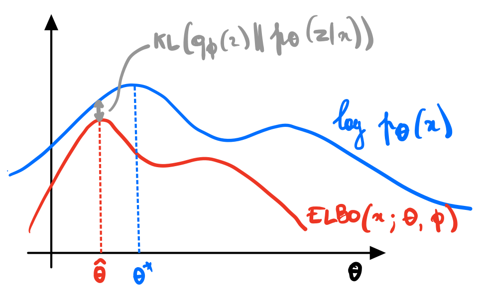]

Provided the KL gap remains small, the model parameters can now be optimized by maximizing the ELBO,
$$\theta^{\*}, \phi^{\*} = \arg \max\_{\theta,\phi} \text{ELBO}(\mathbf{x};\theta,\phi).$$

---

class: middle

## Optimization

$$\begin{aligned}
\theta^{\*}, \phi^{\*} &= \arg \max\_{\theta, \phi} \text{ELBO}(\mathbf{x};\theta, \phi).
\end{aligned}$$

We can proceed by gradient ascent, provided we can evaluate $\nabla\_\theta \text{ELBO}(\mathbf{x};\theta, \phi)$ and $\nabla\_\phi \text{ELBO}(\mathbf{x};\theta, \phi)$.

In general, the gradient of the ELBO is intractable to compute, but we can estimate it with Monte Carlo integration.

---

class: middle
count: false

# Variational auto-encoders

---

class: middle

class: middle

.center[]

So far we assumed a prescribed probabilistic model motivated by domain knowledge.
We will now directly learn a stochastic generating process $p\_\theta(\mathbf{x}|\mathbf{z})$ with a neural network.

We will also amortize the inference process by learning a second neural network $q\_\phi(\mathbf{z}|\mathbf{x})$ approximating the posterior, conditionally on the observed data $\mathbf{x}$.

---

class: middle

## Variational auto-encoders

.center.width-100[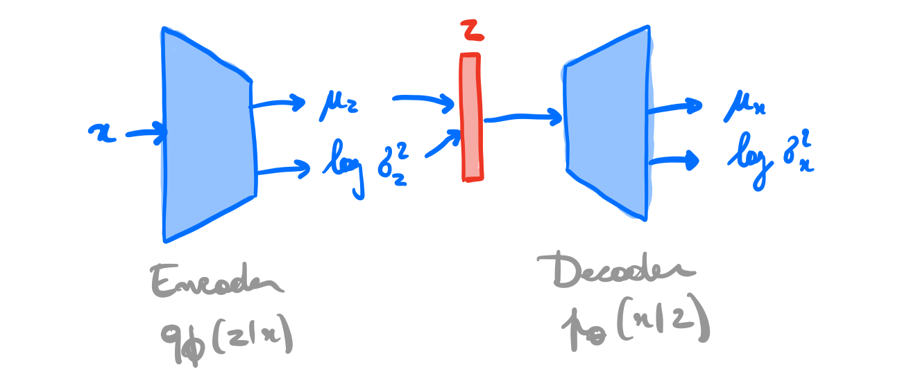]

---

class: middle

A variational auto-encoder is a deep latent variable model where:
- The prior $p(\mathbf{z})$ is prescribed, and usually chosen to be Gaussian.
- The likelihood $p\_\theta(\mathbf{x}|\mathbf{z})$ is parameterized with a **generative network** $\text{NN}\_\theta$
(or decoder) that takes as input $\mathbf{z}$ and outputs parameters $\varphi = \text{NN}\_\theta(\mathbf{z})$ to the data distribution. E.g.,
$$\begin{aligned}
\mu, \sigma &= \text{NN}\_\theta(\mathbf{z}) \\\\
p\_\theta(\mathbf{x}|\mathbf{z}) &= \mathcal{N}(\mathbf{x}; \mu, \sigma^2\mathbf{I})
\end{aligned}$$
- The approximate posterior $q\_\phi(\mathbf{z}|\mathbf{x})$ is parameterized
with an *inference network* $\text{NN}\_\phi$ (or encoder) that takes as input $\mathbf{x}$ and
outputs parameters $\nu = \text{NN}\_\phi(\mathbf{x})$ to the approximate posterior. E.g.,
$$\begin{aligned}
\mu, \sigma &= \text{NN}\_\phi(\mathbf{x}) \\\\
q\_\phi(\mathbf{z}|\mathbf{x}) &= \mathcal{N}(\mathbf{z}; \mu, \sigma^2\mathbf{I})
\end{aligned}$$

---

class: middle

As before, we can use variational inference to jointly optimize the encoder and decoder networks parameters $\phi$ and $\theta$, but now in expectation over the data distribution $p(\mathbf{x})$:
$$\begin{aligned}
\theta^{\*}, \phi^{\*} &= \arg \max\_{\theta,\phi} \mathbb{E}\_{p(\mathbf{x})} \left[ \text{ELBO}(\mathbf{x};\theta,\phi) \right] \\\\
&= \arg \max\_{\theta,\phi} \mathbb{E}\_{p(\mathbf{x})}\left[ \mathbb{E}\_{q\_\phi(\mathbf{z}|\mathbf{x})} [ \log \frac{p\_\theta(\mathbf{x}|\mathbf{z}) p(\mathbf{z})}{q\_\phi(\mathbf{z}|\mathbf{x})} ] \right] \\\\
&= \arg \max\_{\theta,\phi} \mathbb{E}\_{p(\mathbf{x})}\left[ \mathbb{E}\_{q\_\phi(\mathbf{z}|\mathbf{x})}\left[ \log p\_\theta(\mathbf{x}|\mathbf{z})\right] - \text{KL}(q\_\phi(\mathbf{z}|\mathbf{x}) || p(\mathbf{z})) \right].
\end{aligned}$$

Interpretation:
- Given some decoder network set at $\theta$, we want to put the mass of the latent variables, by adjusting $\phi$, such that they explain the observed data, while remaining close to the prior.
- Given some encoder network set at $\phi$, we want to put the mass of the observed variables, by adjusting $\theta$, such that
they are well explained by the latent variables.

---

class: middle

Unbiased gradients of the ELBO with respect to the generative model parameters $\theta$ are simple to obtain, as
$$\begin{aligned}
\nabla\_\theta \text{ELBO}(\mathbf{x};\theta,\phi) &= \nabla\_\theta \mathbb{E}\_{q\_\phi(\mathbf{z}|\mathbf{x})}\left[ \log p\_\theta(\mathbf{x},\mathbf{z}) - \log q\_\phi(\mathbf{z}|\mathbf{x})\right] \\\\
&= \mathbb{E}\_{q\_\phi(\mathbf{z}|\mathbf{x})}\left[ \nabla\_\theta ( \log p\_\theta(\mathbf{x},\mathbf{z}) - \log q\_\phi(\mathbf{z}|\mathbf{x}) ) \right] \\\\
&= \mathbb{E}\_{q\_\phi(\mathbf{z}|\mathbf{x})}\left[ \nabla\_\theta \log p\_\theta(\mathbf{x},\mathbf{z}) \right],
\end{aligned}$$
which can be estimated with Monte Carlo integration.

However, gradients with respect to the inference model parameters $\phi$ are
more difficult to obtain since
$$\begin{aligned}
\nabla\_\phi \text{ELBO}(\mathbf{x};\theta,\phi) &= \nabla\_\phi \mathbb{E}\_{q\_\phi(\mathbf{z}|\mathbf{x})}\left[ \log p\_\theta(\mathbf{x},\mathbf{z}) - \log q\_\phi(\mathbf{z}|\mathbf{x})\right] \\\\
&\neq \mathbb{E}\_{q\_\phi(\mathbf{z}|\mathbf{x})}\left[ \nabla\_\phi ( \log p\_\theta(\mathbf{x},\mathbf{z}) - \log q\_\phi(\mathbf{z}|\mathbf{x}) ) \right].
\end{aligned}$$

---

class: middle

## Reparameterization trick

Let us abbreviate
$$\begin{aligned}
\text{ELBO}(\mathbf{x};\theta,\phi) &= \mathbb{E}\_{q\_\phi(\mathbf{z}|\mathbf{x})}\left[ \log p\_\theta(\mathbf{x},\mathbf{z}) - \log q\_\phi(\mathbf{z}|\mathbf{x})\right] \\\\
&= \mathbb{E}\_{q\_\phi(\mathbf{z}|\mathbf{x})}\left[ f(\mathbf{x}, \mathbf{z}; \phi) \right].
\end{aligned}$$
The computational graph of a Monte Carlo estimate of the ELBO would look like
.grid[
.kol-1-5[]
.kol-4-5[.center.width-75[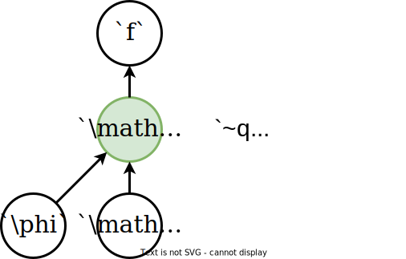]]
]

Issue: We cannot backpropagate through the stochastic node $\mathbf{z}$ to compute $\nabla\_\phi f$!

---

class: middle

The reparameterization trick consists in re-expressing the variable $$\mathbf{z} \sim q\_\phi(\mathbf{z}|\mathbf{x})$$ as some differentiable and invertible transformation
of another random variable $\epsilon$ given $\mathbf{x}$ and $\phi$,
$$\mathbf{z} = g(\phi, \mathbf{x}, \epsilon),$$
such that the distribution of $\epsilon$ is independent of $\mathbf{x}$ or $\phi$.

---

class: middle

.grid[
.kol-1-5[]
.kol-4-5[.center.width-70[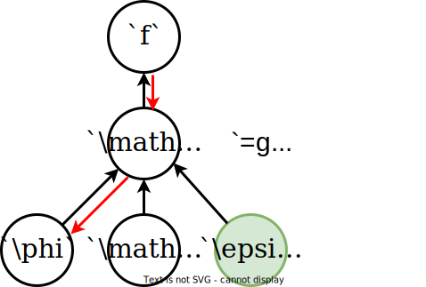]]
]

If $q\_\phi(\mathbf{z}|\mathbf{x}) = \mathcal{N}(\mathbf{z}; \mu(\mathbf{x};\phi), \sigma^2(\mathbf{x};\phi))$, where $\mu(\mathbf{x};\phi)$ and $\sigma^2(\mathbf{x};\phi)$
are the outputs of the inference network $NN\_\phi$, then a common reparameterization is
$$\begin{aligned}
p(\epsilon) &= \mathcal{N}(\epsilon; \mathbf{0}, \mathbf{I}) \\\\
\mathbf{z} &= \mu(\mathbf{x};\phi) + \sigma(\mathbf{x};\phi) \odot \epsilon.
\end{aligned}$$

---

class: middle

Given this change of variable, the ELBO can be rewritten as
$$\begin{aligned}
\text{ELBO}(\mathbf{x};\theta,\phi) &= \mathbb{E}\_{q\_\phi(\mathbf{z}|\mathbf{x})}\left[ f(\mathbf{x}, \mathbf{z}; \phi) \right]\\\\
&= \mathbb{E}\_{p(\epsilon)} \left[ f(\mathbf{x}, g(\phi,\mathbf{x},\epsilon); \phi) \right].
\end{aligned}$$
Therefore estimating the gradient of the ELBO with respect to $\phi$ is now easy, as
$$\begin{aligned}
\nabla\_\phi \text{ELBO}(\mathbf{x};\theta,\phi) &= \nabla\_\phi \mathbb{E}\_{p(\epsilon)} \left[  f(\mathbf{x}, g(\phi,\mathbf{x},\epsilon); \phi) \right] \\\\
&= \mathbb{E}\_{p(\epsilon)} \left[ \nabla\_\phi  f(\mathbf{x}, g(\phi,\mathbf{x},\epsilon); \phi) \right],
\end{aligned}$$
which we can now estimate with Monte Carlo integration.

The last required ingredient is the evaluation of the approximate posterior $q\_\phi(\mathbf{z}|\mathbf{x})$ given the change of variable $g$. As long as $g$ is invertible, we have
$$\log q\_\phi(\mathbf{z}|\mathbf{x}) = \log p(\epsilon) - \log \left| \det\left( \frac{\partial \mathbf{z}}{\partial \epsilon} \right) \right|.$$

---

class: middle

## Step-by-step example

Consider as data $\mathbf{d}$ the MNIST digit dataset:

.center.width-80[]

---

class: middle

.center.width-90[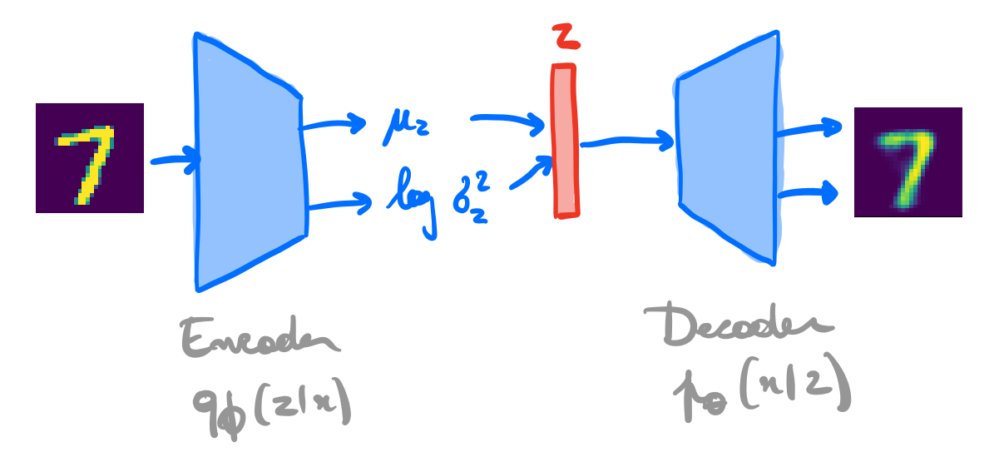]

---

class: middle

- Decoder $p\_\theta(\mathbf{x}|\mathbf{z})$:
$$\begin{aligned}
\mathbf{z} &\in \mathbb{R}^d \\\\
p(\mathbf{z}) &= \mathcal{N}(\mathbf{z}; \mathbf{0},\mathbf{I})\\\\
p\_\theta(\mathbf{x}|\mathbf{z}) &= \mathcal{N}(\mathbf{x};\mu(\mathbf{z};\theta), \sigma^2(\mathbf{z};\theta)\mathbf{I}) \\\\
\mu(\mathbf{z};\theta) &= \mathbf{W}\_2^T\mathbf{h} + \mathbf{b}\_2 \\\\
\log \sigma^2(\mathbf{z};\theta) &= \mathbf{W}\_3^T\mathbf{h} + \mathbf{b}\_3 \\\\
\mathbf{h} &= \text{ReLU}(\mathbf{W}\_1^T \mathbf{z} + \mathbf{b}\_1)\\\\
\theta &= \\\{ \mathbf{W}\_1, \mathbf{b}\_1, \mathbf{W}\_2, \mathbf{b}\_2, \mathbf{W}\_3, \mathbf{b}\_3 \\\}
\end{aligned}$$

---

class: middle

- Encoder $q\_\phi(\mathbf{z}|\mathbf{x})$:
$$\begin{aligned}
q\_\phi(\mathbf{z}|\mathbf{x}) &=  \mathcal{N}(\mathbf{z};\mu(\mathbf{x};\phi), \sigma^2(\mathbf{x};\phi)\mathbf{I}) \\\\
p(\epsilon) &= \mathcal{N}(\epsilon; \mathbf{0}, \mathbf{I}) \\\\
\mathbf{z} &= \mu(\mathbf{x};\phi) + \sigma(\mathbf{x};\phi) \odot \epsilon \\\\
\mu(\mathbf{x};\phi) &= \mathbf{W}\_5^T\mathbf{h} + \mathbf{b}\_5 \\\\
\log \sigma^2(\mathbf{x};\phi) &= \mathbf{W}\_6^T\mathbf{h} + \mathbf{b}\_6 \\\\
\mathbf{h} &= \text{ReLU}(\mathbf{W}\_4^T \mathbf{x} + \mathbf{b}\_4)\\\\
\phi &= \\\{ \mathbf{W}\_4, \mathbf{b}\_4, \mathbf{W}\_5, \mathbf{b}\_5, \mathbf{W}\_6, \mathbf{b}\_6 \\\}
\end{aligned}$$

Note that there is no restriction on the encoder and decoder network architectures.
They could as well be arbitrarily complex convolutional networks.

---

class: middle

Plugging everything together, the objective can be expressed as
$$\begin{aligned}
\text{ELBO}(\mathbf{x};\theta,\phi) &= \mathbb{E}\_{q\_\phi(\mathbf{z}|\mathbf{x})} \left[ \log p\_\theta(\mathbf{x}|\mathbf{z}) \right] - \text{KL}(q\_\phi(\mathbf{z}|\mathbf{x}) || p(\mathbf{z})) \\\\
&= \mathbb{E}\_{p(\epsilon)} \left[  \log p(\mathbf{x}|\mathbf{z}=g(\phi,\mathbf{x},\epsilon);\theta) \right] - \text{KL}(q\_\phi(\mathbf{z}|\mathbf{x}) || p(\mathbf{z})),
\end{aligned}
$$
where the negative KL divergence can be expressed  analytically as
$$-\text{KL}(q\_\phi(\mathbf{z}|\mathbf{x}) || p(\mathbf{z})) = \frac{1}{2} \sum\_{j=1}^d \left( 1 + \log(\sigma\_j^2(\mathbf{x};\phi)) - \mu\_j^2(\mathbf{x};\phi) - \sigma\_j^2(\mathbf{x};\phi)\right),$$
which allows to evaluate its derivative without approximation.

---

class: middle

.center.width-100[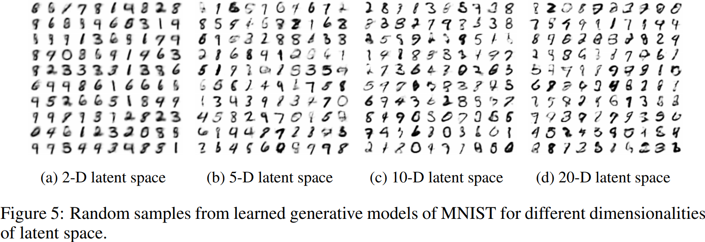]

.footnote[Credits: [Kingma and Welling](https://arxiv.org/abs/1312.6114), 2013.]

---

class: middle

.center.width-95[]

.footnote[Credits: [Kingma and Welling](https://arxiv.org/abs/1312.6114), 2013.]

---

class: middle

## A semantically meaningful latent space

The prior-matching term $\text{KL}(q\_\phi(\mathbf{z}|\mathbf{x}) || p(\mathbf{z}))$ enforces simplicity in the latent space, encouraging learned semantic structure and disentanglement.

.center.width-100[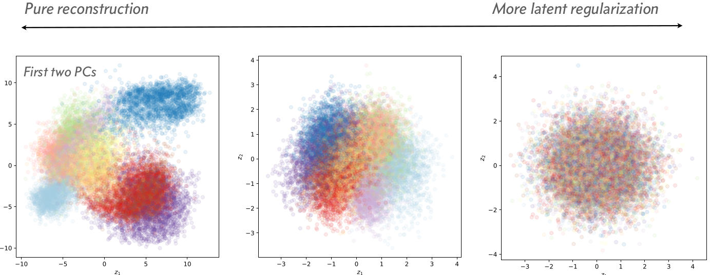]

.footnote[Credits: [Siddharth Mishra-Sharma](https://smsharma.io/iaifi-summer-school-2023/), 2023.]

---

# Some selected applications

 

.center[
.width-90[]

Hierarchical .bold[compression of images and other data],  e.g., in video conferencing systems (Gregor et al, 2016).
]

---

exclude: true
class: middle

.center[
.width-100[]

.bold[Understanding the factors of variation and invariances] (Higgins et al, 2017).
]

---

class: middle 

.center[

.width-80[]

.bold[Voice style transfer] [[demo](https://avdnoord.github.io/homepage/vqvae/)] (van den Oord et al, 2017).
]

---

class: middle

.center.width-100[]

.center[.bold[Design of new molecules] with desired chemical properties  (Gomez-Bombarelli et al, 2016).]

---

exclude: true
class: middle

.center[

<iframe width="640" height="400" src="https://www.youtube.com/embed/Wd-1WU8emkw?&loop=1&start=0" frameborder="0" volume="0" allowfullscreen></iframe>

Bridging the .bold[simulation-to-reality] gap (Inoue et al, 2017).

]

---

class: end-slide, center
count: false

The end.
