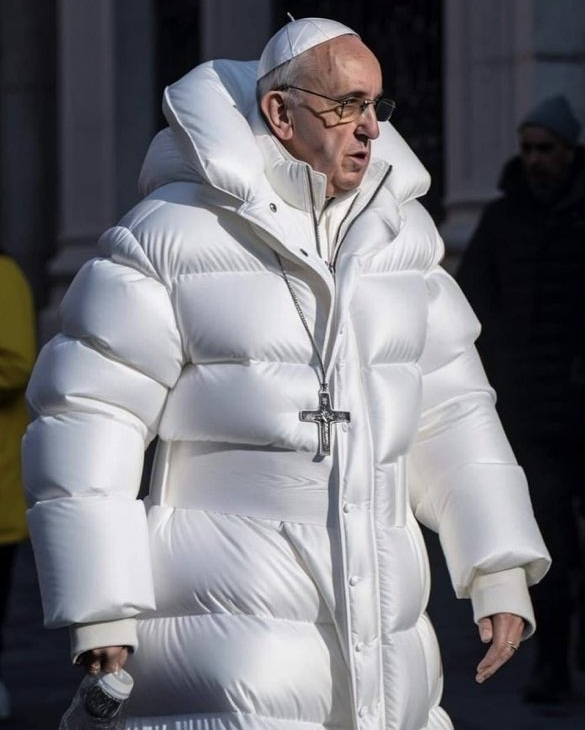
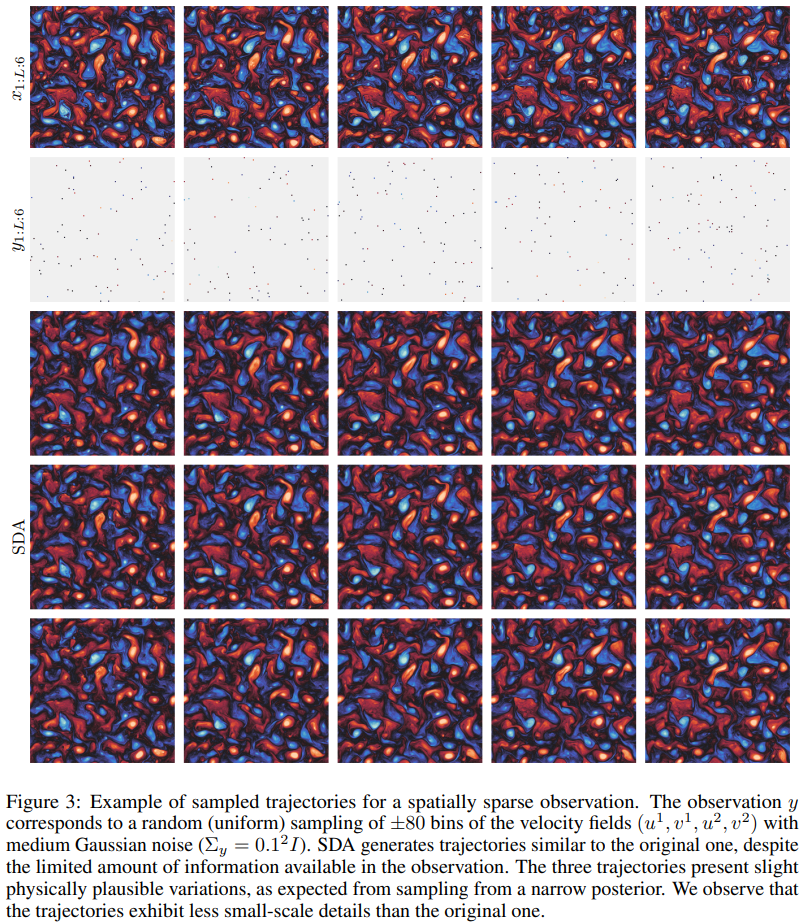
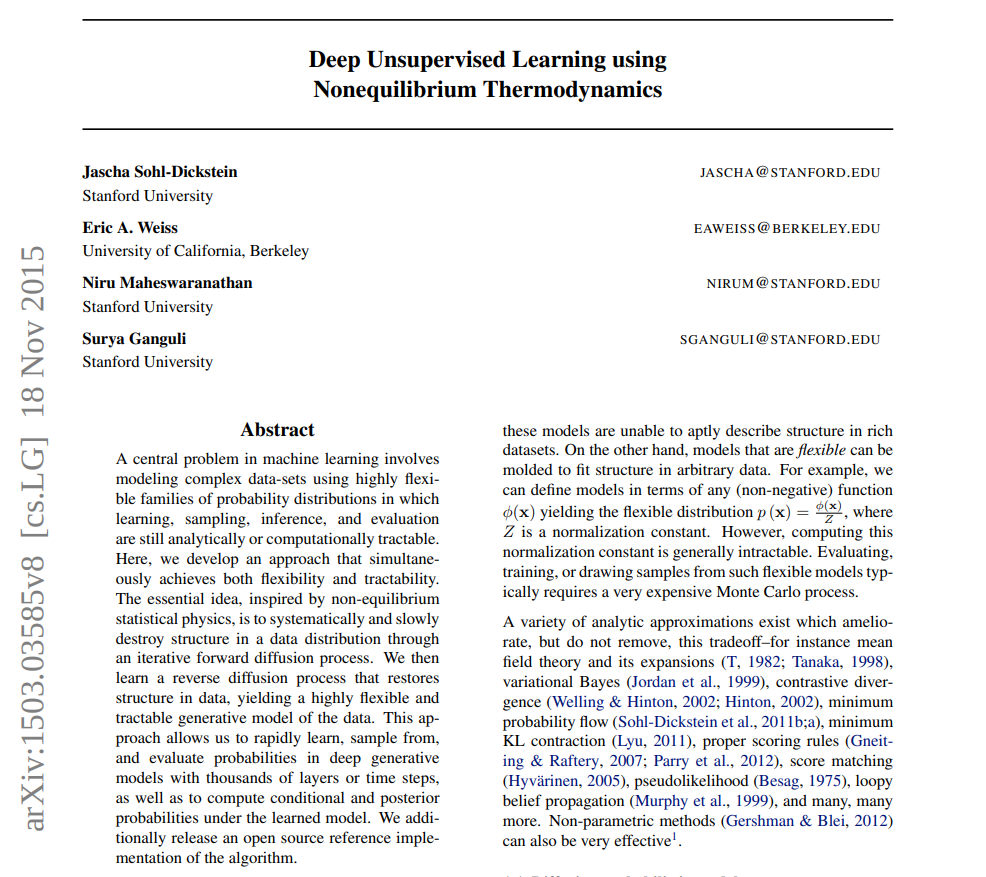
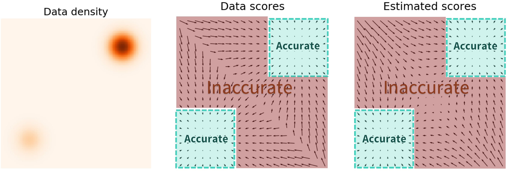
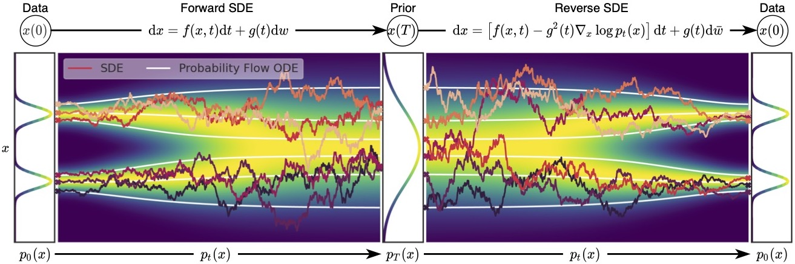

class: middle, center, title-slide

# Deep Learning

Lecture 12: Diffusion models

  
Prof. Gilles Louppe 
[g.louppe@uliege.be](mailto:g.louppe@uliege.be)

???

R: it takes 2h30 to cover the first part (up to score-based models, excluded).
=> Stop there, show a code example instead, but keep the rest of the slides for reference.
R: the applications are pretty cool but their presentation is too superficial. Go in more details and explain where/how the diffusion models are used in each case. Drop a few examples if needed.
R: check Francis Bach's slides on diffusion models without diffusion

---

# Today

- VAEs
- Variational diffusion models
- Score-based generative models

.alert[Caution: See also the side notes derived in class.]

---

class: middle

# Applications

A few motivating examples.

---

class: middle

## Content generation

.center[.width-45[] .width-45[]]

.center[Diffusion models have emerged as powerful generative models, beating previous state-of-the-art models (such as GANs) on a variety of tasks.]

.footnote[Credits: [Dhariwal and Nichol](https://arxiv.org/pdf/2105.05233.pdf), 2021; [Ho et al](https://arxiv.org/pdf/2106.15282.pdf), 2021.]

---

class: middle

## Image super-resolution

.center[

<video autoplay muted loop width="720" height="420">
     <source src="./figures/lec12/super-resolution.m4v" type="video/mp4">
</video>

]

.footnote[Credits: [Saharia et al](https://arxiv.org/abs/2104.07636), 2021.]

---

class: middle

## Text-to-image generation

.center[

.width-50[]

.italic[A group of teddy bears in suite in a corporate office celebrating  the birthday of their friend. There is a pizza cake on the desk.]

]

.footnote[Credits: [Saharia et al](https://arxiv.org/abs/2205.11487), 2022.]

---

class: middle, black-slide

.center.width-50[]

.center[... or deepfakes.]

---

class: middle

## Artistic tools and image editing

.center.width-100[]

.footnote[Credits: [Meng et al](https://arxiv.org/abs/2108.01073), 2021.]

---

class: middle

## Inverse problems in medical imaging

.center.width-100[]

.footnote[Credits: [Song et al](https://arxiv.org/pdf/2111.08005.pdf), 2021.]

---

class: middle

## Data assimilation in ocean models

.center.width-65[]

.footnote[Credits: [Rozet and Louppe](https://arxiv.org/pdf/2306.10574.pdf), 2023.]

---

class: middle

# VAEs

A short recap.

---

class: middle

## Variational autoencoders

.center[]

???

Recap on the black board.

---

class: middle

## Training

$$\begin{aligned}
\theta^{\*}, \phi^{\*} &= \arg \max\_{\theta,\phi} \mathbb{E}\_{p(\mathbf{x})} \text{ELBO}(\mathbf{x};\theta,\phi) \\\\
&= \arg \max\_{\theta,\phi} \mathbb{E}\_{p(\mathbf{x})} \mathbb{E}\_{q\_\phi(\mathbf{z}|\mathbf{x})}\left[ \log \frac{p\_\theta(\mathbf{x},\mathbf{z})}{q\_\phi(\mathbf{z}|\mathbf{x})} \right] \\\\
&= \arg \max\_{\theta,\phi} \mathbb{E}\_{p(\mathbf{x})} \left[ \mathbb{E}\_{q\_\phi(\mathbf{z}|\mathbf{x})}\left[ \log p\_\theta(\mathbf{x}|\mathbf{z})\right] - \text{KL}(q\_\phi(\mathbf{z}|\mathbf{x}) || p(\mathbf{z})) \right].
\end{aligned}$$

.alert[Issue: The prior matching term limits the expressivity of the model.]

---

class: middle, black-slide, center
count: false

 Solution: Make $p(\mathbf{z})$ a learnable distribution.

.width-80[]

???

Explain the maths on the black board, taking the expectation wrt $p(\mathbf{x})$ of the ELBO and consider the expected KL terms.

---

class: middle

## (Markovian) Hierarchical VAEs

The prior $p(\mathbf{z})$ is itself a VAE, and recursively so for its own hyper-prior.

.center[]

---

class: middle

Similarly to VAEs, training is done by maximizing the ELBO, using a variational distribution $q\_\phi(\mathbf{z}\_{1:T} | \mathbf{x})$ over all levels of latent variables:
$$\begin{aligned}
\log p\_\theta(\mathbf{x}) &\geq \mathbb{E}\_{q\_\phi(\mathbf{z}\_{1:T} | \mathbf{x})}\left[ \log \frac{p(\mathbf{x},\mathbf{z}\_{1:T})}{q\_\phi(\mathbf{z}\_{1:T}|\mathbf{x})} \right] 
\end{aligned}$$

???

Rederive the ELBO.

---

class: middle

# Variational diffusion models

---

class: middle

.center.width-100[]

---

class: middle

Variational diffusion models are Markovian HVAEs with the following constraints:
- The latent dimension is the same as the data dimension.
- The encoder is fixed to linear Gaussian transitions $q(\mathbf{x}\_t | \mathbf{x}\_{t-1})$.
- The hyper-parameters are set such that $q(\mathbf{x}_T | \mathbf{x}_0)$ is a standard Gaussian. 

 

.center.width-100[]

.footnote[Credits: [Kreis et al](https://cvpr2022-tutorial-diffusion-models.github.io/), 2022.]

---

class: middle

## Forward diffusion process

.center.width-100[]

With $\epsilon \sim \mathcal{N}(\mathbf{0}, \mathbf{I})$, we have
$$\begin{aligned}
\mathbf{x}\_t &= \sqrt{ {\alpha}\_t} \mathbf{x}\_{t-1} + \sqrt{1-{\alpha}\_t} \epsilon \\\\
q(\mathbf{x}\_t | \mathbf{x}\_{t-1}) &= \mathcal{N}(\mathbf{x}\_t ; \sqrt{\alpha\_t} \mathbf{x}\_{t-1}, (1-\alpha\_t)\mathbf{I}) \\\\
q(\mathbf{x}\_{1:T} | \mathbf{x}\_{0}) &=  \prod\_{t=1}^T q(\mathbf{x}\_t | \mathbf{x}\_{t-1}) 
\end{aligned}$$

.footnote[Credits: [Kreis et al](https://cvpr2022-tutorial-diffusion-models.github.io/), 2022.]

???

Start drawing the full probabilistic graphical model as the forward and reverse processes are presented.

---

class: middle

.center.width-100[]

.footnote[Credits: [Simon J.D. Prince](https://udlbook.github.io/udlbook/), 2023.]

---

class: middle

## Diffusion kernel

.center.width-100[]

With $\bar{\alpha}\_t = \prod\_{i=1}^t \alpha\_i$ and $\epsilon \sim \mathcal{N}(\mathbf{0}, \mathbf{I})$, we have

$$\begin{aligned}
\mathbf{x}\_t &= \sqrt{\bar{\alpha}\_t} \mathbf{x}\_{0} + \sqrt{1-\bar{\alpha}\_t} \epsilon \\\\
q(\mathbf{x}\_t | \mathbf{x}\_{0}) &= \mathcal{N}(\mathbf{x}\_t ; \sqrt{\bar{\alpha}\_t} \mathbf{x}\_{0}, (1-\bar{\alpha}\_t)\mathbf{I})
\end{aligned}$$

.footnote[Credits: [Kreis et al](https://cvpr2022-tutorial-diffusion-models.github.io/), 2022.]

---

class: middle

.center.width-100[]

.center[
     
Diffusion kernel $q(\mathbf{x}\_t | \mathbf{x}\_{0})$ for different noise levels $t$.

]

.footnote[Credits: [Simon J.D. Prince](https://udlbook.github.io/udlbook/), 2023.]

---

class: middle

.center.width-100[]

.center[

Marginal distribution $q(\mathbf{x}\_t)$.

]

.footnote[Credits: [Simon J.D. Prince](https://udlbook.github.io/udlbook/), 2023.]

---

class: middle

## Reverse denoising process

.center.width-100[]

$$\begin{aligned}
p(\mathbf{x}\_{0:T}) &= p(\mathbf{x}\_T) \prod\_{t=1}^T p\_\theta(\mathbf{x}\_{t-1} | \mathbf{x}\_t)\\\\
p(\mathbf{x}\_T) &= \mathcal{N}(\mathbf{x}\_T; \mathbf{0}, I) \\\\
p\_\theta(\mathbf{x}\_{t-1} | \mathbf{x}\_t) &= \mathcal{N}(\mathbf{x}\_{t-1}; \mu\_\theta(\mathbf{x}\_t, t), \sigma^2\_\theta(\mathbf{x}\_t, t)\mathbf{I}) \\\\
\mathbf{x}\_{t-1} &= \mu\_\theta(\mathbf{x}\_t, t) + \sigma\_\theta(\mathbf{x}\_t, t) \mathbf{z} 
\end{aligned}$$
with $\mathbf{z} \sim \mathcal{N}(\mathbf{0}, \mathbf{I})$.

.footnote[Credits: [Kreis et al](https://cvpr2022-tutorial-diffusion-models.github.io/), 2022.]

---

class: middle

## Training

For learning the parameters $\theta$ of the reverse process, we can form a variational lower bound on the log-likelihood of the data as 

$$\mathbb{E}\_{q(\mathbf{x}\_0)}\left[ \log p\_\theta(\mathbf{x}\_0) \right] \geq \mathbb{E}\_{q(\mathbf{x}\_0)q(\mathbf{x}\_{1:T}|\mathbf{x}\_0)}\left[ \log \frac{p\_\theta(\mathbf{x}\_{0:T})}{q(\mathbf{x}\_{1:T} | \mathbf{x}\_0)} \right] := L$$

???

Derive on the board.

---

class: middle

This objective can be rewritten as
$$\begin{aligned}
L &= \mathbb{E}\_{q(\mathbf{x}\_0)q(\mathbf{x}\_{1:T}|\mathbf{x}\_0)}\left[ \log \frac{p\_\theta(\mathbf{x}\_{0:T})}{q(\mathbf{x}\_{1:T} | \mathbf{x}\_0)} \right] \\\\
&= \mathbb{E}\_{q(\mathbf{x}\_0)} \left[L\_0 - \sum\_{t>1} L\_{t-1} - L\_T\right]
\end{aligned}$$
where
- $L\_0 = \mathbb{E}\_{q(\mathbf{x}\_1 | \mathbf{x}\_0)}[\log p\_\theta(\mathbf{x}\_0 | \mathbf{x}\_1)]$ can be interpreted as a reconstruction term. It can be approximated and optimized using a Monte Carlo estimate.
- $L\_{t-1} = \mathbb{E}\_{q(\mathbf{x}\_t | \mathbf{x}\_0)}\text{KL}(q(\mathbf{x}\_{t-1}|\mathbf{x}\_t, \mathbf{x}\_0) || p\_\theta(\mathbf{x}\_{t-1} | \mathbf{x}\_t) )$ is a denoising matching term. The transition $q(\mathbf{x}\_{t-1}|\mathbf{x}\_t, \mathbf{x}\_0)$ provides a learning signal for the reverse process, since it defines how to denoise the noisified input $\mathbf{x}\_t$ with access to the original input $\mathbf{x}\_0$.
- $L\_T = \text{KL}(q(\mathbf{x}\_T | \mathbf{x}\_0) || p\_\theta(\mathbf{x}\_T))$ represents how close the distribution of the final noisified input is to the standard Gaussian. It has no trainable parameters.

---

class: middle

.center[]

The distribution $q(\mathbf{x}\_{t-1}|\mathbf{x}\_t, \mathbf{x}\_0)$ is the tractable posterior distribution
$$\begin{aligned}
q(\mathbf{x}\_{t-1}|\mathbf{x}\_t, \mathbf{x}\_0) &= \frac{q(\mathbf{x}\_t | \mathbf{x}\_{t-1}, \mathbf{x}\_0) q(\mathbf{x}\_{t-1} | \mathbf{x}\_0)}{q(\mathbf{x}\_t | \mathbf{x}\_0)} \\\\
&= \mathcal{N}(\mathbf{x}\_{t-1}; \mu\_q(\mathbf{x}\_t, \mathbf{x}\_0, t), \sigma^2\_t I)
\end{aligned}$$
where
$$\begin{aligned}
\mu\_q(\mathbf{x}\_t, \mathbf{x}\_0, t) &= \frac{\sqrt{\alpha\_t}(1-\bar{\alpha}\_{t-1})}{1-\bar{\alpha}\_t}\mathbf{x}\_t + \frac{\sqrt{\bar{\alpha}\_{t-1}}(1-\alpha\_t)}{1-\bar{\alpha}\_t}\mathbf{x}\_0 \\\\
\sigma^2\_t &= \frac{(1-\alpha\_t)(1-\bar{\alpha}\_{t-1})}{1-\bar{\alpha}\_t}
\end{aligned}$$

???

Take the time to do the derivation on the board.

---

class: middle

## Interpretation 1: Denoising

To minimize the expected KL divergence $L\_{t-1}$, we need to match the reverse process $p\_\theta(\mathbf{x}\_{t-1}|\mathbf{x}\_t)$ to the tractable posterior. Since both are Gaussian, we can match their means and variances.

By construction, the variance of the reverse process can be set to the known variance $\sigma^2\_t$ of the tractable posterior.

For the mean, we reuse the analytical form of $\mu\_q(\mathbf{x}\_t, \mathbf{x}\_0, t)$ and parameterize the mean of the reverse process using a .bold[denoising network] as
$$\mu\_\theta(\mathbf{x}\_t, t) = \frac{\sqrt{\alpha\_t}(1-\bar{\alpha}\_{t-1})}{1-\bar{\alpha}\_t}\mathbf{x}\_t + \frac{\sqrt{\bar{\alpha}\_{t-1}}(1-\alpha\_t)}{1-\bar{\alpha}\_t}\hat{\mathbf{x}}\_\theta(\mathbf{x}\_t, t).$$

???

Derive on the board.

---

class: middle

Under this parameterization, the minimization of expected KL divergence $L\_{t-1}$ can be rewritten as
$$\begin{aligned}
&\arg \min\_\theta \mathbb{E}\_{q(\mathbf{x}\_t | \mathbf{x}\_0)}\text{KL}(q(\mathbf{x}\_{t-1}|\mathbf{x}\_t, \mathbf{x}\_0) || p\_\theta(\mathbf{x}\_{t-1} | \mathbf{x}\_t) )\\\\
=&\arg \min\_\theta \mathbb{E}\_{q(\mathbf{x}\_t | \mathbf{x}\_0)} \frac{1}{2\sigma^2\_t} || \mu\_\theta(\mathbf{x}\_t, t) - \mu\_q(\mathbf{x}\_t, \mathbf{x}\_0, t) ||\_2^2 \\\\
=&\arg \min\_\theta \mathbb{E}\_{q(\mathbf{x}\_t | \mathbf{x}\_0)} \frac{1}{2\sigma^2\_t} \frac{\bar{\alpha}\_{t-1}(1-\alpha\_t)^2}{(1-\bar{\alpha}\_t)^2} || \hat{\mathbf{x}}\_\theta(\mathbf{x}\_t, t) - \mathbf{x}\_0 ||\_2^2
\end{aligned}$$

.success[Optimizing a VDM amounts to learning a neural network that predicts the original ground truth $\mathbf{x}\_0$ from a noisy input $\mathbf{x}\_t$.]

---

class: middle

Finally, minimizing the summation of the $L\_{t-1}$ terms across all noise levels $t$ can be approximated by minimizing the expectation over all timesteps as
$$\arg \min\_\theta \mathbb{E}\_{t \sim U\\{2,T\\}} \mathbb{E}\_{q(\mathbf{x}\_t | \mathbf{x}\_0)}\text{KL}(q(\mathbf{x}\_{t-1}|\mathbf{x}\_t, \mathbf{x}\_0) || p\_\theta(\mathbf{x}\_{t-1} | \mathbf{x}\_t) ).$$

---

class: middle

## Interpretation 2: Noise prediction

A second interpretation of VDMs can be obtained using the reparameterization trick. 
Using $$\mathbf{x}\_0 = \frac{\mathbf{x}\_t - \sqrt{1-\bar{\alpha}\_t} \epsilon}{\sqrt{\bar{\alpha}\_t}},$$
we can rewrite the mean of the tractable posterior as
$$\begin{aligned}
\mu\_q(\mathbf{x}\_t, \mathbf{x}\_0, t) &= \frac{\sqrt{\alpha\_t}(1-\bar{\alpha}\_{t-1})}{1-\bar{\alpha}\_t}\mathbf{x}\_t + \frac{\sqrt{\bar{\alpha}\_{t-1}}(1-\alpha\_t)}{1-\bar{\alpha}\_t}\mathbf{x}\_0 \\\\
&= \frac{\sqrt{\alpha\_t}(1-\bar{\alpha}\_{t-1})}{1-\bar{\alpha}\_t}\mathbf{x}\_t + \frac{\sqrt{\bar{\alpha}\_{t-1}}(1-\alpha\_t)}{1-\bar{\alpha}\_t}\frac{\mathbf{x}\_t - \sqrt{1-\bar{\alpha}\_t} \epsilon}{\sqrt{\bar{\alpha}\_t}} \\\\
&= ... \\\\
&= \frac{1}{\sqrt{\alpha}\_t} \mathbf{x}\_t - \frac{1-\alpha\_t}{\sqrt{(1-\bar{\alpha}\_t)\alpha\_t}}\epsilon
\end{aligned}$$

???

Derive on the board.

---

class: middle

Accordingly, the mean of the reverse process can be parameterized with a .bold[noise-prediction network] as

$$\mu\_\theta(\mathbf{x}\_t, t) = \frac{1}{\sqrt{\alpha}\_t} \mathbf{x}\_t - \frac{1-\alpha\_t}{\sqrt{(1-\bar{\alpha}\_t)\alpha\_t}}{\epsilon}\_\theta(\mathbf{x}\_t, t).$$

Under this parameterization, the minimization of the expected KL divergence $L\_{t-1}$ can be rewritten as
$$\begin{aligned}
&\arg \min\_\theta \mathbb{E}\_{q(\mathbf{x}\_t | \mathbf{x}\_0)}\text{KL}(q(\mathbf{x}\_{t-1}|\mathbf{x}\_t, \mathbf{x}\_0) || p\_\theta(\mathbf{x}\_{t-1} | \mathbf{x}\_t) )\\\\
=&\arg \min\_\theta \mathbb{E}\_{\mathcal{N}(\epsilon;\mathbf{0}, I)} \frac{1}{2\sigma^2\_t} \frac{(1-\alpha\_t)^2}{(1-\bar{\alpha}\_t) \alpha\_t} || {\epsilon}\_\theta(\underbrace{\sqrt{\bar{\alpha}\_t} \mathbf{x}\_{0} + \sqrt{1-\bar{\alpha}\_t} \epsilon}\_{\mathbf{x}\_t}, t) - \epsilon ||_2^2
\end{aligned}$$

.success[Optimizing a VDM amounts to learning a neural network that predicts the noise $\epsilon$ that was added to the original ground truth $\mathbf{x}\_0$ to obtain the noisy $\mathbf{x}\_t$.]

---

class: middle

In summary, training and sampling thus eventually boils down to:

.center.width-100[]

???

Note that in practice, the coefficient before the norm in the loss function is often omitted. Setting it to 1 is found to increase the sample quality.

---

class: middle

## Network architectures

Diffusion models often use U-Net architectures (at least for image data)  with ResNet blocks and self-attention layers to represent $\hat{\mathbf{x}}\_\theta(\mathbf{x}\_t, t)$ or $\epsilon\_\theta(\mathbf{x}\_t, t)$.

 

.center.width-100[]

.footnote[Credits: [Kreis et al](https://cvpr2022-tutorial-diffusion-models.github.io/), 2022.]

---

class: middle

# Score-based generative models

---

class: middle

## Score-based models

Maximum likelihood estimation for energy-based probabilistic models $$p\_{\theta}(\mathbf{x}) = \frac{1}{Z\_{\theta}} \exp(-f\_{\theta}(\mathbf{x}))$$ can be intractable when the partition function $Z\_{\theta}$ is unknown.
We can sidestep this issue with a score-based model $$s\_\theta(\mathbf{x}) \approx \nabla\_{\mathbf{x}} \log p(\mathbf{x})$$ that approximates the (Stein) .bold[score function] of the data distribution. If we parameterize the score-based model with an energy-based model, then we have $$s\_\theta(\mathbf{x}) = \nabla\_{\mathbf{x}} \log p\_{\theta}(\mathbf{x}) = -\nabla\_{\mathbf{x}} f\_{\theta}(\mathbf{x}) - \nabla\_{\mathbf{x}} \log Z\_{\theta} = -\nabla\_{\mathbf{x}} f\_{\theta}(\mathbf{x}),$$
which discards the intractable partition function and expands the family of models that can be used.

---

class: middle

The score function points in the direction of the highest density of the data distribution. 
It can be used to find modes of the data distribution or to generate samples by .bold[Langevin dynamics] by iterating the following sampling rule
$$\mathbf{x}\_{i+1} = \mathbf{x}\_i + \epsilon \nabla\_{\mathbf{x}\_i} \log p(\mathbf{x}\_i) + \sqrt{2\epsilon} \mathbf{z}\_i,$$
where $\epsilon$ is the step size and $\mathbf{z}\_i \sim \mathcal{N}(\mathbf{0}, \mathbf{I})$. When $\epsilon$ is small, Langevin dynamics will converge to the data distribution $p(\mathbf{x})$.

.center.width-30[]

.footnote[Credits: [Song](https://yang-song.net/blog/2021/score/), 2021.]

---

class: middle

Similarly to likelihood-based models, score-based models can be trained by minimizing the .bold[Fisher divergence] between the data distribution $p(\mathbf{x})$ and the model distribution $p\_\theta(\mathbf{x})$ as
$$\mathbb{E}\_{p(\mathbf{x})} \left[ || \nabla\_{\mathbf{x}} \log p(\mathbf{x}) - s\_\theta(\mathbf{x}) ||\_2^2 \right].$$

---

class: middle

Unfortunately, the explicit score matching objective leads to inaccurate estimates in low-density regions, where few data points are available to constrain the score. 

Since initial sample points are likely to be in low-density regions in high-dimensional spaces, the inaccurate score-based model will derail the Langevin dynamics and lead to poor sample quality.

.center.width-100[]

.footnote[Credits: [Song](https://yang-song.net/blog/2021/score/), 2021.]

---

class: middle

To address this issue, .bold[denoising score matching] can be used to train the score-based model to predict the score of increasingly noisified data points.

For each noise level $t$, the score-based model $s\_\theta(\mathbf{x}\_t, t)$ is trained to predict the score of the noisified data point $\mathbf{x}\_t$ as
$$s\_\theta(\mathbf{x}\_t, t) \approx \nabla\_{\mathbf{x}\_t} \log p\_{t} (\mathbf{x}\_t)$$
where $p\_{t} (\mathbf{x}\_t)$ is the noise-perturbed data distribution 
$$p\_{t} (\mathbf{x}\_t) = \int p(\mathbf{x}\_0) \mathcal{N}(\mathbf{x}\_t ; \mathbf{x}\_0, \sigma^2\_t \mathbf{I}) d\mathbf{x}\_0$$
and $\sigma^2\_t$ is an increasing sequence of noise levels.

---

class: middle

The training objective for $s\_\theta(\mathbf{x}\_t, t)$ is then a weighted sum of Fisher divergences for all noise levels $t$, 
$$\sum\_{t=1}^T \lambda(t) \mathbb{E}\_{p\_{t}(\mathbf{x}\_t)} \left[ || \nabla\_{\mathbf{x}\_t} \log p\_{t}(\mathbf{x}\_t) - s\_\theta(\mathbf{x}\_t, t) ||\_2^2 \right]$$
where $\lambda(t)$ is a weighting function.

---

class: middle

Finally, annealed Langevin dynamics can be used to sample from the score-based model by running Langevin dynamics with decreasing noise levels $t=T, ..., 1$.

.center.width-100[]

.footnote[Credits: [Song](https://yang-song.net/blog/2021/score/), 2021.]

---

class: middle

## Interpretation 3: Denoising score matching

A third interpretation of VDMs can be obtained by reparameterizing $\mathbf{x}\_0$ using Tweedie's formula, as
$$\mathbf{x}\_0 = \frac{\mathbf{x}\_t + (1-\bar{\alpha}\_t) \nabla\_{\mathbf{x}\_t} \log q(\mathbf{x}\_t) }{\sqrt{\bar{\alpha}\_t}},$$
which we can plug into the the mean of the tractable posterior to obtain
$$\begin{aligned}
\mu\_q(\mathbf{x}\_t, \mathbf{x}\_0, t) &= \frac{\sqrt{\alpha\_t}(1-\bar{\alpha}\_{t-1})}{1-\bar{\alpha}\_t}\mathbf{x}\_t + \frac{\sqrt{\bar{\alpha}\_{t-1}}(1-\alpha\_t)}{1-\bar{\alpha}\_t}\mathbf{x}\_0 \\\\
&= ... \\\\
&= \frac{1}{\sqrt{\alpha}\_t} \mathbf{x}\_t + \frac{1-\alpha\_t}{\sqrt{\alpha\_t}} \nabla\_{\mathbf{x}\_t} \log q(\mathbf{x}\_t).
\end{aligned}$$

???

Derive on the board.

---

class: middle

The mean of the reverse process can be parameterized with a .bold[score network] as
$$\mu\_\theta(\mathbf{x}\_t, t) = \frac{1}{\sqrt{\alpha}\_t} \mathbf{x}\_t + \frac{1-\alpha\_t}{\sqrt{\alpha\_t}} s\_\theta(\mathbf{x}\_t, t).$$

Under this parameterization, the minimization of the expected KL divergence $L\_{t-1}$ can be rewritten as
$$\begin{aligned}
&\arg \min\_\theta \mathbb{E}\_{q(\mathbf{x}\_t | \mathbf{x}\_0)}\text{KL}(q(\mathbf{x}\_{t-1}|\mathbf{x}\_t, \mathbf{x}\_0) || p\_\theta(\mathbf{x}\_{t-1} | \mathbf{x}\_t) )\\\\
=&\arg \min\_\theta \mathbb{E}\_{q(\mathbf{x}\_t | \mathbf{x}\_0)} \frac{1}{2\sigma^2\_t} \frac{(1-\alpha\_t)^2}{\alpha\_t} || s\_\theta(\mathbf{x}\_t, t) - \nabla\_{\mathbf{x}\_t}  \log q(\mathbf{x}\_t) ||_2^2
\end{aligned}$$

.success[Optimizing a score-based model amounts to learning a neural network that predicts the score $\nabla\_{\mathbf{x}\_t} \log q(\mathbf{x}\_t)$.]

---

class: middle

Unfortunately, $\nabla\_{\mathbf{x}\_t} \log q(\mathbf{x}\_t)$ is not tractable in general. 
However, since $s\_\theta(\mathbf{x}\_t, t)$ is learned in expectation over the data distribution $q(\mathbf{x}\_0)$, minimizing instead
$$\mathbb{E}\_{q(\mathbf{x}\_0)} \mathbb{E}\_{q(\mathbf{x}\_t | \mathbf{x}\_0)} \frac{1}{2\sigma^2\_t} \frac{(1-\alpha\_t)^2}{\alpha\_t} || s\_\theta(\mathbf{x}\_t, t) - \nabla\_{\mathbf{x}\_t}  \log q(\mathbf{x}\_t | \mathbf{x}\_0) ||\_2^2$$
ensures that $s\_\theta(\mathbf{x}\_t, t) \approx \nabla\_{\mathbf{x}\_t} \log q(\mathbf{x}\_t)$.

---

exclude: true
class: middle

## Ancestral sampling

Sampling from the score-based diffusion model is done by starting from $\mathbf{x}\_T \sim p(\mathbf{x}\_T)=\mathcal{N}(\mathbf{0}, \mathbf{I})$ and then following the estimated reverse Markov chain, as
$$\mathbf{x}\_{t-1} = \frac{1}{\sqrt{\alpha}\_t} \mathbf{x}\_t + \frac{1-\alpha\_t}{\sqrt{\alpha\_t}} s\_\theta(\mathbf{x}\_t, t) + \sigma\_t \mathbf{z}\_t,$$
where $\mathbf{z}\_t \sim \mathcal{N}(\mathbf{0}, \mathbf{I})$, for $t=T, ..., 1$. 

---

class: middle

## Conditional sampling

To turn a diffusion model $p\_\theta(\mathbf{x}\_{0:T})$ into a conditional model, we can add conditioning information $y$ at each step of the reverse process, as
$$p\_\theta(\mathbf{x}\_{0:T} | y) = p(\mathbf{x}\_T) \prod\_{t=1}^T p\_\theta(\mathbf{x}\_{t-1} | \mathbf{x}\_t, y).$$

---

class: middle

With a score-based model however, we can use the Bayes rule and notice that
$$\nabla\_{\mathbf{x}\_t} \log p(\mathbf{x}\_t | y) = \nabla\_{\mathbf{x}\_t} \log p(\mathbf{x}\_t) + \nabla\_{\mathbf{x}\_t} \log p(y | \mathbf{x}\_t),$$
where we leverage the fact that the gradient of $\log p(y)$ with respect to $\mathbf{x}\_t$ is zero.

In other words, controllable generation can be achieved by adding a conditioning signal during sampling, without having to retrain the model. E.g., train an extra classifier $p(y | \mathbf{x}\_t)$ and use it to control the sampling process by adding its gradient to the score.

---

class: middle

## Continuous-time diffusion models

.center.width-100[]

With $\beta\_t = 1 - \alpha\_t$, we can rewrite the forward process as
$$\begin{aligned}
\mathbf{x}\_t &= \sqrt{ {\alpha}\_t} \mathbf{x}\_{t-1} + \sqrt{1-{\alpha}\_t} \mathcal{N}(\mathbf{0}, \mathbf{I}) \\\\
&= \sqrt{1 - {\beta}\_t} \mathbf{x}\_{t-1} + \sqrt{ {\beta}\_t} \mathcal{N}(\mathbf{0}, \mathbf{I}) \\\\
&= \sqrt{1 - {\beta}(t)\Delta\_t} \mathbf{x}\_{t-1} + \sqrt{ {\beta}(t)\Delta\_t} \mathcal{N}(\mathbf{0}, \mathbf{I})
\end{aligned}$$

.footnote[Credits: [Kreis et al](https://cvpr2022-tutorial-diffusion-models.github.io/), 2022.]

---

class: middle

When $\Delta\_t \rightarrow 0$, we can further rewrite the forward process as
$$\begin{aligned}
\mathbf{x}\_t &= \sqrt{1 - {\beta}(t)\Delta\_t} \mathbf{x}\_{t-1} + \sqrt{ {\beta}(t)\Delta\_t} \mathcal{N}(\mathbf{0}, \mathbf{I}) \\\\
&\approx \mathbf{x}\_{t-1} - \frac{\beta(t)\Delta\_t}{2} \mathbf{x}\_{t-1} + \sqrt{ {\beta}(t)\Delta\_t} \mathcal{N}(\mathbf{0}, \mathbf{I}) 
\end{aligned}.$$

This last update rule corresponds to the Euler-Maruyama discretization of the stochastic differential equation (SDE)
$$\text{d}\mathbf{x}\_t = -\frac{1}{2}\beta(t)\mathbf{x}\_t \text{d}t + \sqrt{\beta(t)} \text{d}\mathbf{w}\_t$$
describing the diffusion in the infinitesimal limit.

.center.width-80[]

---

class: middle

The reverse process satisfies a reverse-time SDE that can be derived analytically from the forward-time SDE and the score of the marginal distribution $q(\mathbf{x}\_t)$, as
$$\text{d}\mathbf{x}\_t = \left[ -\frac{1}{2}\beta(t)\mathbf{x}\_t - \beta(t)\nabla\_{\mathbf{x}\_t} \log q(\mathbf{x}\_t) \right] \text{d}t + \sqrt{\beta(t)} \text{d}\mathbf{w}\_t.$$

.center.width-80[]

.footnote[Credits: [Song](https://yang-song.net/blog/2021/score/), 2021.]

---

class: middle

The score $\nabla\_{\mathbf{x}\_t} \log q(\mathbf{x}\_t)$ of the marginal diffused density $q(\mathbf{x}\_t)$ is not tractable, but can be estimated using denoising score matching (DSM) by solving
$$\arg \min\_\theta \mathbb{E}\_{q(\mathbf{x}\_0)} \mathbb{E}\_{t\sim U[0,T]} \mathbb{E}\_{q(\mathbf{x}\_t | \mathbf{x}\_0)} || s\_\theta(\mathbf{x}\_t, t) - \nabla\_{\mathbf{x}\_t} \log q(\mathbf{x}\_t | \mathbf{x}\_0) ||\_2^2,$$
which will result in $s\_\theta(\mathbf{x}\_t, t) \approx \nabla\_{\mathbf{x}\_t} \log q(\mathbf{x}\_t)$ because of the outer expectation over $q(\mathbf{x}\_0)$.

.success[This is just the .bold[same objective] as for VDMs! (See Interpretation 3)]

---

class: middle

## Probability flow ODE

For any diffusion process, there exists a corresponding deterministic process 
$$\text{d}\mathbf{x}\_t = \left[ \mathbf{f}(t, \mathbf{x}\_t) - \frac{1}{2} g^2(t) \nabla\_{\mathbf{x}\_t} \log p(\mathbf{x}\_t) \right] \text{d}t$$
whose trajectories share the same marginal densities $p(\mathbf{x}\_t)$.

Therefore, when $\nabla\_{\mathbf{x}\_t} \log p(\mathbf{x}\_t)$ is replaced by its approximation $s\_\theta(\mathbf{x}\_t, t)$, the probability flow ODE becomes a special case of a neural ODE. In particular, it is an example of continuous-time normalizing flows!

.center.width-80[]

.footnote[Credits: [Song](https://yang-song.net/blog/2021/score/), 2021.]

---

class: middle

## Latent-space diffusion models

Directly modeling the data distribution can be make the denoising process difficult to learn. A more effective approach is to combine VAEs with a diffusion prior.
- The distribution of latent embeddings is simpler to model.
- Diffusion on non-image data is possible with tailored autoencoders.

 

.center.width-100[]

.footnote[Credits: [Vahdat et al](https://nvlabs.github.io/LSGM/), 2021.]

---

class: black-slide, middle
count: false

.center[

<video autoplay muted loop width="400" height="300">
     <source src="./figures/lec12/teddy_bear_guitar.mp4" type="video/mp4">
</video>

The end.

]

.footnote[Credits: [Blattmann et al](https://research.nvidia.com/labs/toronto-ai/VideoLDM/), 2023. Prompt: "A teddy bear is playing the electric guitar, high definition, 4k."]
