class: middle, center, title-slide

# Deep Learning

Lecture 12: Diffusion models

  
Prof. Gilles Louppe 
[g.louppe@uliege.be](mailto:g.louppe@uliege.be)

???

Good references:
- https://arxiv.org/pdf/2208.11970.pdf
- https://cvpr2022-tutorial-diffusion-models.github.io/

---

# Today

- VAEs
- Variational diffusion models
- Score-based generative models

.alert[Caution: See also the side notes derived in class.]

---

class: middle

# Applications

A few motivating examples.

---

class: middle

.center[.width-45[] .width-45[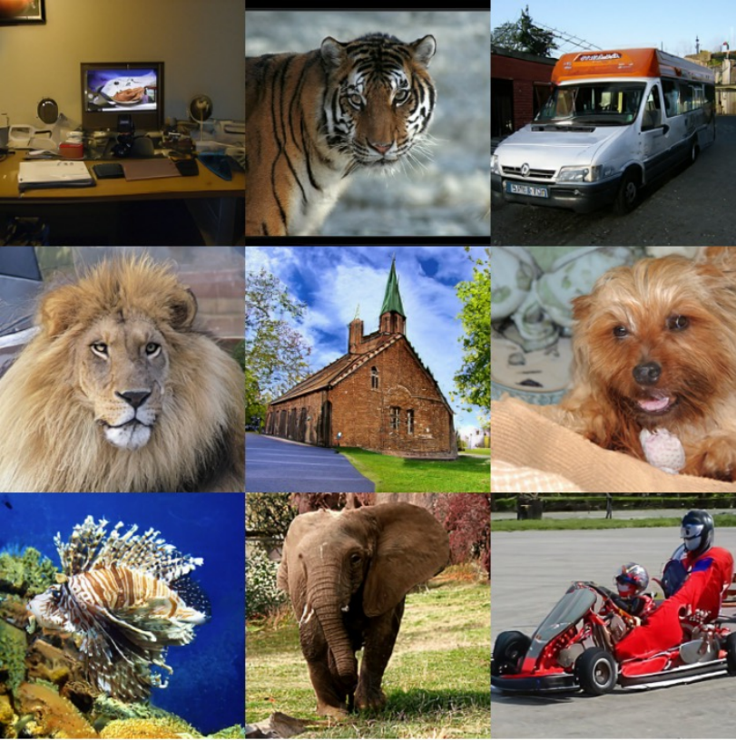]]

.center[Diffusion models have emerged as powerful generative models, beating previous state-of-the-art models (such as GANs) on a variety of tasks.]

.footnote[Credits: [Dhariwal and Nichol](https://arxiv.org/pdf/2105.05233.pdf), 2021; [Ho et al](https://arxiv.org/pdf/2106.15282.pdf), 2021.]

---

class: middle

.center[

<video autoplay muted loop width="720" height="420">
     <source src="./figures/lec12/super-resolution.m4v" type="video/mp4">
</video>

]

.center[Image super-resolution]

.footnote[Credits: [Saharia et al](https://arxiv.org/abs/2104.07636), 2021.]

---

class: middle

.center[

.italic[A group of teddy bears in suite in a corporate office celebrating  the birthday of their friend. There is a pizza cake on the desk.]

.width-60[]

]

.center[Text-to-image generation]

.footnote[Credits: [Saharia et al](https://arxiv.org/abs/2205.11487), 2022.]

---

class: middle

.center.width-100[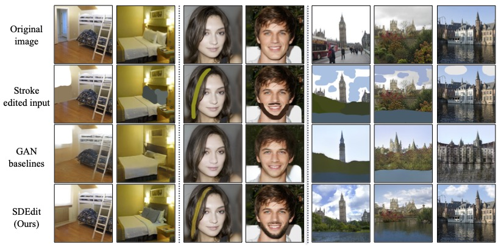]

.center[Artistic tools and image editing]

.footnote[Credits: [Meng et al](https://arxiv.org/abs/2108.01073), 2021.]

---

class: middle

.center.width-100[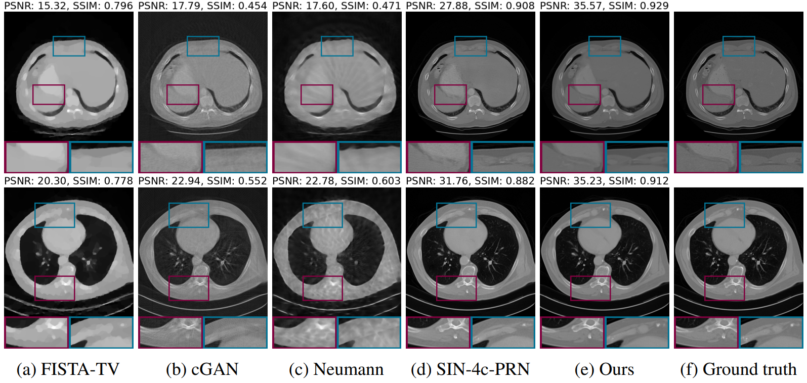]

.center[Solving inverse problems in medical imaging]

.footnote[Credits: [Song et al](https://arxiv.org/pdf/2111.08005.pdf), 2021.]

---

class: middle

# VAEs

A short recap.

---

class: middle

## Variational autoencoders

.center[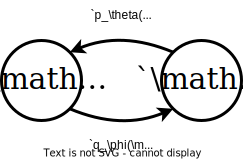]

---

class: middle

## Training

$$\begin{aligned}
\theta^{\*}, \phi^{\*} &= \arg \max\_{\theta,\phi} \mathbb{E}\_{p(\mathbf{x})} \text{ELBO}(\mathbf{x};\theta,\phi) \\\\
&= \arg \max\_{\theta,\phi} \mathbb{E}\_{p(\mathbf{x})} \mathbb{E}\_{q\_\phi(\mathbf{z}|\mathbf{x})}\left[ \log \frac{p\_\theta(\mathbf{x},\mathbf{z})}{q\_\phi(\mathbf{z}|\mathbf{x})} \right] \\\\
&= \arg \max\_{\theta,\phi} \mathbb{E}\_{p(\mathbf{x})} \left[ \mathbb{E}\_{q\_\phi(\mathbf{z}|\mathbf{x})}\left[ \log p\_\theta(\mathbf{x}|\mathbf{z})\right] - \text{KL}(q\_\phi(\mathbf{z}|\mathbf{x}) || p(\mathbf{z})) \right].
\end{aligned}$$

---

class: middle

The prior matching term limits the expressivity of the model.

Solution: Make $p(\mathbf{z})$ a learnable distribution.

---

class: middle, black-slide, center
count: false

.width-80[]

---

class: middle

## Hierarchical VAEs

The prior $p(\mathbf{z})$ is itself a VAE, and recursively so for its own hyper-prior.

.center[]

---

class: middle

Similarly to VAEs, training is done by maximizing the ELBO.

(See side notes.)

---

class: middle

# Variational diffusion models

---

class: middle

Variational diffusion models are HVAEs with the following constraints:
- The latent dimension is the same as the data dimension.
- The encoder is fixed to linear Gaussian transitions $q(\mathbf{x}\_t | \mathbf{x}\_{t-1})$.
- The hyper-parameters are set such that $q(\mathbf{x}_T | \mathbf{x}_0)$ is a standard Gaussian. 

 

.center.width-100[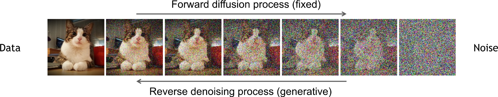]

.footnote[Credits: [Kreis et al](https://cvpr2022-tutorial-diffusion-models.github.io/), 2022.]

---

class: middle

## Forward diffusion process

 

.center.width-100[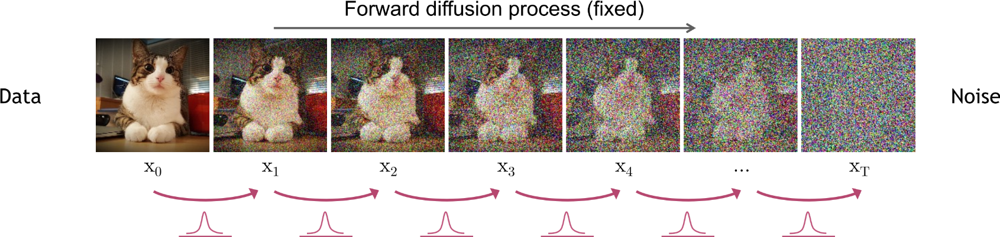]

 

With $\epsilon \sim \mathcal{N}(\mathbf{0}, \mathbf{I})$, we have
$$\begin{aligned}
\mathbf{x}\_t &= \sqrt{ {\alpha}\_t} \mathbf{x}\_{t-1} + \sqrt{1-{\alpha}\_t} \epsilon \\\\
q(\mathbf{x}\_t | \mathbf{x}\_{t-1}) &= \mathcal{N}(\mathbf{x}\_t ; \sqrt{\alpha\_t} \mathbf{x}\_{t-1}, (1-\alpha\_t)\mathbf{I}) \\\\
q(\mathbf{x}\_{1:T} | \mathbf{x}\_{0}) &=  \prod\_{t=1}^T q(\mathbf{x}\_t | \mathbf{x}\_{t-1}) 
\end{aligned}$$

.footnote[Credits: [Kreis et al](https://cvpr2022-tutorial-diffusion-models.github.io/), 2022.]

---

class: middle

.center.width-100[]

.footnote[Credits: [Simon J.D. Prince](https://udlbook.github.io/udlbook/), 2023.]

---

class: middle

## Diffusion kernel

 

.center.width-100[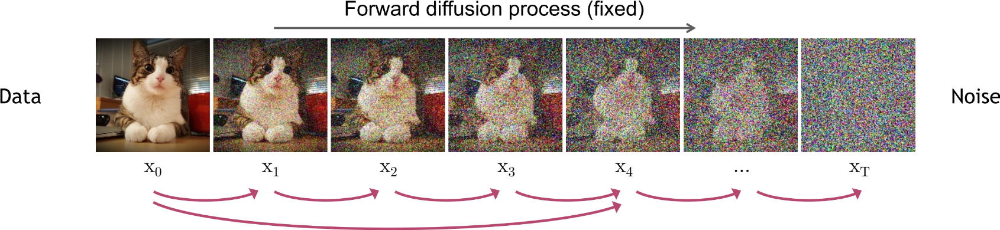]

 

With $\bar{\alpha}\_t = \prod\_{i=1}^t \alpha\_i$ and $\epsilon \sim \mathcal{N}(\mathbf{0}, \mathbf{I})$, we have

$$\begin{aligned}
\mathbf{x}\_t &= \sqrt{\bar{\alpha}\_t} \mathbf{x}\_{0} + \sqrt{1-\bar{\alpha}\_t} \epsilon \\\\
q(\mathbf{x}\_t | \mathbf{x}\_{0}) &= \mathcal{N}(\mathbf{x}\_t ; \sqrt{\bar{\alpha}\_t} \mathbf{x}\_{0}, (1-\bar{\alpha}\_t)\mathbf{I})
\end{aligned}$$

.footnote[Credits: [Kreis et al](https://cvpr2022-tutorial-diffusion-models.github.io/), 2022.]

---

class: middle

.center.width-100[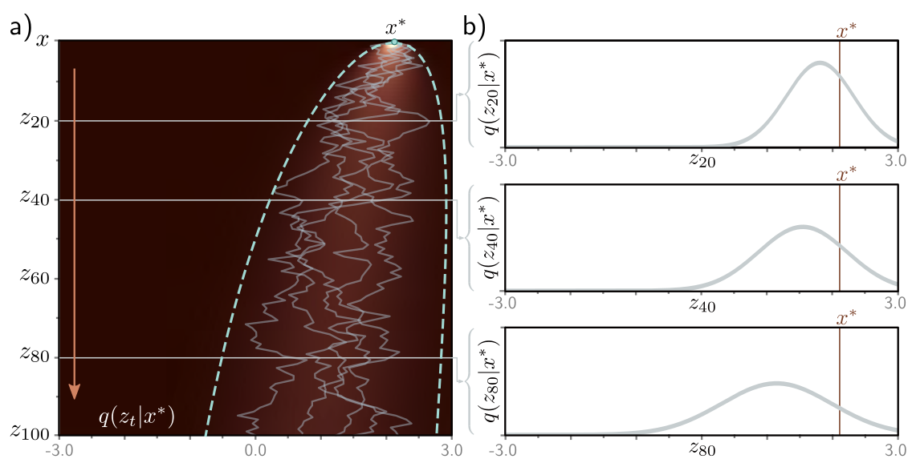]

.footnote[Credits: [Simon J.D. Prince](https://udlbook.github.io/udlbook/), 2023.]

---

class: middle

.center.width-100[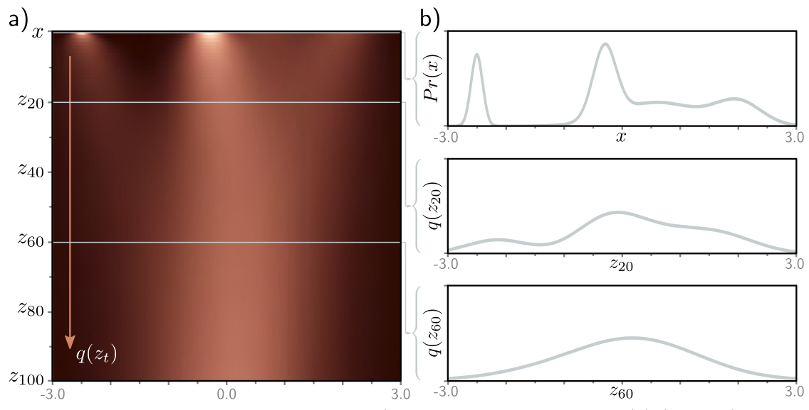]

.footnote[Credits: [Simon J.D. Prince](https://udlbook.github.io/udlbook/), 2023.]

---

class: middle

## Reverse denoising process

 

.center.width-100[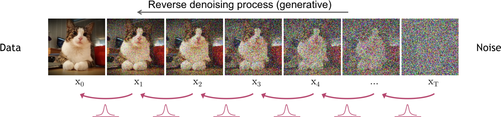]

 

$$\begin{aligned}
p(\mathbf{x}\_T) &= \mathcal{N}(\mathbf{x}\_T; \mathbf{0}, I) \\\\
p\_\theta(\mathbf{x}\_{t-1} | \mathbf{x}\_t) &= \mathcal{N}(\mathbf{x}\_{t-1}; \mu\_\theta(\mathbf{x}\_t), \Sigma\_\theta(\mathbf{x}\_t)) \\\\
p(\mathbf{x}\_{0:T}) &= p(\mathbf{x}\_T) \prod\_{t=1}^T p\_\theta(\mathbf{x}\_{t-1} | \mathbf{x}\_t)
\end{aligned}$$

.footnote[Credits: [Kreis et al](https://cvpr2022-tutorial-diffusion-models.github.io/), 2022.]

---

class: middle

## Training

For learning the parameters $\theta$ of the reverse process, we can form a variational lower bound on the log-likelihood of the data as 

$$\mathbb{E}\_{q(\mathbf{x}\_0)}\left[ \log p\_\theta(\mathbf{x}\_0) \right] \geq \mathbb{E}\_{q(\mathbf{x}\_0)q(\mathbf{x}\_{1:T}|\mathbf{x}\_0)}\left[ \log \frac{p\_\theta(\mathbf{x}\_{0:T})}{q(\mathbf{x}\_{1:T} | \mathbf{x}\_0)} \right] := L$$

---

class: middle

This objective can be rewritten as
$$\begin{aligned}
L &= \mathbb{E}\_{q(\mathbf{x}\_0)q(\mathbf{x}\_{1:T}|\mathbf{x}\_0)}\left[ \log \frac{p\_\theta(\mathbf{x}\_{0:T})}{q(\mathbf{x}\_{1:T} | \mathbf{x}\_0)} \right] \\\\
&= \mathbb{E}\_q(\mathbf{x}\_0) \left[L\_0 - \sum\_{t>1} L\_{t-1} - L\_T\right]
\end{aligned}$$
where
- $L\_0 = \mathbb{E}\_{q(\mathbf{x}\_1 | \mathbf{x}\_0)}[\log p\_\theta(\mathbf{x}\_0 | \mathbf{x}\_1)]$ can be interpreted as a reconstruction term. It can be approximated and optimized using a Monte Carlo estimate.
- $L\_{t-1} = \mathbb{E}\_{q(\mathbf{x}\_t | \mathbf{x}\_0)}\text{KL}(q(\mathbf{x}\_{t-1}|\mathbf{x}\_t, \mathbf{x}\_0) || p\_\theta(\mathbf{x}\_{t-1} | \mathbf{x}\_t) )$ is a denoising matching term. The transition $q(\mathbf{x}\_{t-1}|\mathbf{x}\_t, \mathbf{x}\_0)$ provides a learning signal for the reverse process, since it defines how to denoise the noisified input $\mathbf{x}\_t$ with access to the original input $\mathbf{x}\_0$.
- $L\_T = \text{KL}(q(\mathbf{x}\_T | \mathbf{x}\_0) || p\_\theta(\mathbf{x}\_T))$ represents how close the distribution of the final noisified input is to the standard Gaussian. It has no trainable parameters.

---

class: middle

.center[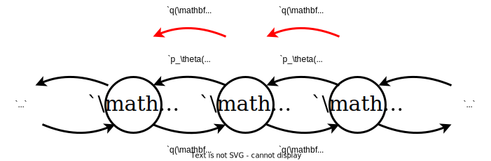]

The distribution $q(\mathbf{x}\_{t-1}|\mathbf{x}\_t, \mathbf{x}\_0)$ is the tractable posterior distribution
$$\begin{aligned}
q(\mathbf{x}\_{t-1}|\mathbf{x}\_t, \mathbf{x}\_0) &= \frac{q(\mathbf{x}\_t | \mathbf{x}\_{t-1}, \mathbf{x}\_0) q(\mathbf{x}\_{t-1} | \mathbf{x}\_0)}{q(\mathbf{x}\_t | \mathbf{x}\_0)} \\\\
&= \mathcal{N}(\mathbf{x}\_{t-1}; \mu\_q(\mathbf{x}\_t, \mathbf{x}\_0, t), \sigma^2\_t I)
\end{aligned}$$
where
$$\begin{aligned}
\mu\_q(\mathbf{x}\_t, \mathbf{x}\_0, t) &= \frac{\sqrt{\alpha\_t}(1-\bar{\alpha}\_{t-1})}{1-\bar{\alpha}\_t}\mathbf{x}\_t + \frac{\sqrt{\bar{\alpha}\_{t-1}}(1-\alpha\_t)}{1-\bar{\alpha}\_t}\mathbf{x}\_0 \\\\
\sigma^2\_t &= \frac{(1-\alpha\_t)(1-\bar{\alpha}\_{t-1})}{1-\bar{\alpha}\_t}
\end{aligned}$$

---

class: middle

## Interpretation 1: Denoising

To minimize the expected KL divergence $L\_{t-1}$, we need to match the reverse process $p\_\theta(\mathbf{x}\_{t-1}|\mathbf{x}\_t)$ to the tractable posterior. Since both are Gaussian, we can match their means and variances.

By construction, the variance of the reverse process can be set to the known variance $\sigma^2\_t$ of the tractable posterior.

For the mean, we reuse the analytical form of $\mu\_q(\mathbf{x}\_t, \mathbf{x}\_0, t)$ and parameterize the mean of the reverse process using a .bold[denoising network] as
$$\mu\_\theta(\mathbf{x}\_t) = \frac{\sqrt{\alpha\_t}(1-\bar{\alpha}\_{t-1})}{1-\bar{\alpha}\_t}\mathbf{x}\_t + \frac{\sqrt{\bar{\alpha}\_{t-1}}(1-\alpha\_t)}{1-\bar{\alpha}\_t}\hat{\mathbf{x}}\_\theta(\mathbf{x}\_t, t).$$

---

class: middle

Under this parameterization, the minimization of expected KL divergence $L\_{t-1}$ can be rewritten as
$$\begin{aligned}
&\arg \min\_\theta \mathbb{E}\_{q(\mathbf{x}\_t | \mathbf{x}\_0)}\text{KL}(q(\mathbf{x}\_{t-1}|\mathbf{x}\_t, \mathbf{x}\_0) || p\_\theta(\mathbf{x}\_{t-1} | \mathbf{x}\_t) )\\\\
=&\arg \min\_\theta \mathbb{E}\_{q(\mathbf{x}\_t | \mathbf{x}\_0)} \frac{1}{2\sigma^2\_t} || \mu\_\theta(\mathbf{x}\_t) - \mu\_q(\mathbf{x}\_t, \mathbf{x}\_0, t) ||\_2^2 \\\\
=&\arg \min\_\theta \mathbb{E}\_{q(\mathbf{x}\_t | \mathbf{x}\_0)} \frac{1}{2\sigma^2\_t} \frac{\bar{\alpha}\_{t-1}(1-\alpha\_t)^2}{(1-\bar{\alpha}\_t)^2} || \hat{\mathbf{x}}\_\theta(\mathbf{x}\_t, t) - \mathbf{x}\_0 ||\_2^2
\end{aligned}$$

.success[Optimizing a VDM amounts to learning a neural network that predicts the original ground truth $\mathbf{x}\_0$ from a noisy input $\mathbf{x}\_t$.]

---

class: middle

Finally, minimizing the summation of the $L\_{t-1}$ terms across all noise levels $t$ can be approximated by minimizing the expectation over all timesteps as
$$\arg \min\_\theta \mathbb{E}\_{t \sim U\\{2,T\\}} \mathbb{E}\_{q(\mathbf{x}\_t | \mathbf{x}\_0)}\text{KL}(q(\mathbf{x}\_{t-1}|\mathbf{x}\_t, \mathbf{x}\_0) || p\_\theta(\mathbf{x}\_{t-1} | \mathbf{x}\_t) ).$$

---

class: middle

## Interpretation 2: Noise prediction

A second interpretation of VDMs can be obtained using the reparameterization trick. 
Using $$\mathbf{x}\_0 = \frac{\mathbf{x}\_t - \sqrt{1-\bar{\alpha}\_t} \epsilon}{\sqrt{\bar{\alpha}\_t}},$$
we can rewrite the mean of the tractable posterior as
$$\begin{aligned}
\mu\_q(\mathbf{x}\_t, \mathbf{x}\_0, t) &= \frac{\sqrt{\alpha\_t}(1-\bar{\alpha}\_{t-1})}{1-\bar{\alpha}\_t}\mathbf{x}\_t + \frac{\sqrt{\bar{\alpha}\_{t-1}}(1-\alpha\_t)}{1-\bar{\alpha}\_t}\mathbf{x}\_0 \\\\
&= \frac{\sqrt{\alpha\_t}(1-\bar{\alpha}\_{t-1})}{1-\bar{\alpha}\_t}\mathbf{x}\_t + \frac{\sqrt{\bar{\alpha}\_{t-1}}(1-\alpha\_t)}{1-\bar{\alpha}\_t}\frac{\mathbf{x}\_t - \sqrt{1-\bar{\alpha}\_t} \epsilon}{\sqrt{\bar{\alpha}\_t}} \\\\
&= ... \\\\
&= \frac{1}{\sqrt{\alpha}\_t} \mathbf{x}\_t - \frac{1-\alpha\_t}{\sqrt{(1-\bar{\alpha}\_t)\alpha\_t}}\epsilon
\end{aligned}$$

---

class: middle

Accordingly, the mean of the reverse process can be parameterized with a .bold[noise-prediction network] as

$$\mu\_\theta(\mathbf{x}\_t) = \frac{1}{\sqrt{\alpha}\_t} \mathbf{x}\_t - \frac{1-\alpha\_t}{\sqrt{(1-\bar{\alpha}\_t)\alpha\_t}}{\epsilon}\_\theta(\mathbf{x}\_t, t).$$

Under this parameterization, the minimization of the expected KL divergence $L\_{t-1}$ can be rewritten as
$$\begin{aligned}
&\arg \min\_\theta \mathbb{E}\_{q(\mathbf{x}\_t | \mathbf{x}\_0)}\text{KL}(q(\mathbf{x}\_{t-1}|\mathbf{x}\_t, \mathbf{x}\_0) || p\_\theta(\mathbf{x}\_{t-1} | \mathbf{x}\_t) )\\\\
=&\arg \min\_\theta \mathbb{E}\_{\mathcal{N}(\epsilon;\mathbf{0}, I)} \frac{1}{2\sigma^2\_t} \frac{(1-\alpha\_t)^2}{(1-\bar{\alpha}\_t) \alpha\_t} || {\epsilon}\_\theta(\underbrace{\sqrt{\bar{\alpha}\_t} \mathbf{x}\_{0} + \sqrt{1-\bar{\alpha}\_t} \epsilon}\_{\mathbf{x}\_t}, t) - \epsilon ||_2^2
\end{aligned}$$

.success[Optimizing a VDM amounts to learning a neural network that predicts the noise $\epsilon$ that was added to the original ground truth $\mathbf{x}\_0$ to obtain the noisy $\mathbf{x}\_t$.]

---

class: middle

## Algorithms

.center.width-100[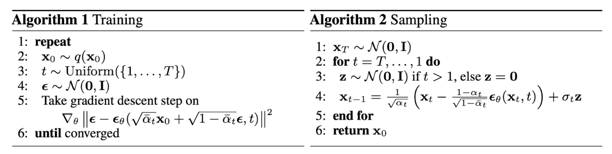]

---

class: middle

## Network architectures

Diffusion models often use U-Net architectures with ResNet blocks and self-attention layers to represent $\epsilon\_\theta(\mathbf{x}\_t, t)$.

 

.center.width-100[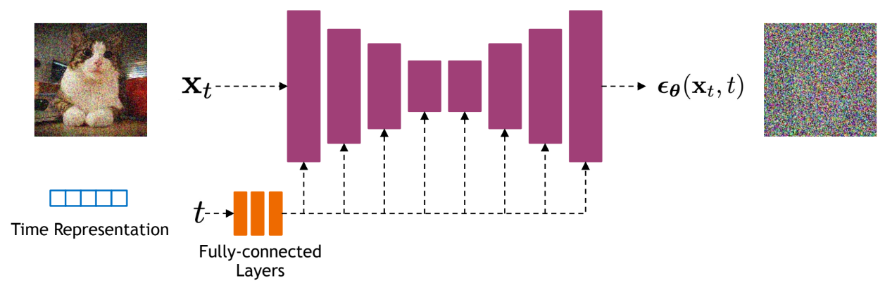]

.footnote[Credits: [Kreis et al](https://cvpr2022-tutorial-diffusion-models.github.io/), 2022.]

---

class: middle

# Score-based generative models

---

class: middle

## The score function

The score function $\nabla\_{\mathbf{x}\_0} \log q(\mathbf{x}\_0)$ is a vector field that points in the direction of the highest density of the data distribution $q(\mathbf{x}\_0)$.

It can be used to find modes of the data distribution or to generate samples by Langevin dynamics.

.center.width-40[]

.footnote[Credits: [Song](https://yang-song.net/blog/2021/score/), 2021.]

---

class: middle

## Interpretation 3: Denoising score matching

A third interpretation of VDMs can be obtained by reparameterizing $\mathbf{x}\_0$ using Tweedie's formula, as
$$\mathbf{x}\_0 = \frac{\mathbf{x}\_t + (1-\bar{\alpha}\_t) \nabla\_{\mathbf{x}\_t} \log q(\mathbf{x}\_t | \mathbf{x}\_0) }{\sqrt{\bar{\alpha}\_t}},$$
which we can plug into the the mean of the tractable posterior to obtain
$$\begin{aligned}
\mu\_q(\mathbf{x}\_t, \mathbf{x}\_0, t) &= \frac{\sqrt{\alpha\_t}(1-\bar{\alpha}\_{t-1})}{1-\bar{\alpha}\_t}\mathbf{x}\_t + \frac{\sqrt{\bar{\alpha}\_{t-1}}(1-\alpha\_t)}{1-\bar{\alpha}\_t}\mathbf{x}\_0 \\\\
&= ... \\\\
&= \frac{1}{\sqrt{\alpha}\_t} \mathbf{x}\_t + \frac{1-\alpha\_t}{\sqrt{\alpha\_t}} \nabla\_{\mathbf{x}\_t} \log q(\mathbf{x}\_t | \mathbf{x}\_0).
\end{aligned}$$

---

class: middle

The mean of the reverse process can be parameterized with a .bold[score network] as
$$\mu\_\theta(\mathbf{x}\_t) = \frac{1}{\sqrt{\alpha}\_t} \mathbf{x}\_t + \frac{1-\alpha\_t}{\sqrt{\alpha\_t}} s\_\theta(\mathbf{x}\_t, t).$$

Under this parameterization, the minimization of the expected KL divergence $L\_{t-1}$ can be rewritten as
$$\begin{aligned}
&\arg \min\_\theta \mathbb{E}\_{q(\mathbf{x}\_t | \mathbf{x}\_0)}\text{KL}(q(\mathbf{x}\_{t-1}|\mathbf{x}\_t, \mathbf{x}\_0) || p\_\theta(\mathbf{x}\_{t-1} | \mathbf{x}\_t) )\\\\
=&\arg \min\_\theta \mathbb{E}\_{q(\mathbf{x}\_t | \mathbf{x}\_0)} \frac{1}{2\sigma^2\_t} \frac{(1-\alpha\_t)^2}{\alpha\_t} || s\_\theta(\mathbf{x}\_t, t) - \nabla\_{\mathbf{x}\_t}  \log q(\mathbf{x}\_t | \mathbf{x}\_0) ||_2^2
\end{aligned}$$

.success[Optimizing a score-based model amounts to learning a neural network that predicts the score $\nabla\_{\mathbf{x}\_t} \log q(\mathbf{x}\_t | \mathbf{x}\_0)$  of the tractable posterior.]

---

class: middle

Since $s\_\theta(\mathbf{x}\_t, t)$ is learned in expectation over the data distribution $q(\mathbf{x}\_0)$, the score network will eventually approximate the score of the marginal distribution $q(\mathbf{x}\_t$), for each noise level $t$, that is
$$s\_\theta(\mathbf{x}\_t, t) \approx \nabla\_{\mathbf{x}\_t} \log q(\mathbf{x}\_t).$$

---

class: middle

## Ancestral sampling

Sampling from the score-based diffusion model is done by starting from $\mathbf{x}\_T \sim p(\mathbf{x}\_T)=\mathcal{N}(\mathbf{0}, \mathbf{I})$ and then following the estimated reverse Markov chain, as
$$\mathbf{x}\_{t-1} = \frac{1}{\sqrt{\alpha}\_t} \mathbf{x}\_t + \frac{1-\alpha\_t}{\sqrt{\alpha\_t}} s\_\theta(\mathbf{x}\_t, t) + \sigma\_t \mathbf{z}\_t,$$
where $\mathbf{z}\_t \sim \mathcal{N}(\mathbf{0}, \mathbf{I})$, for $t=T, ..., 1$. 

---

class: middle

## Conditional sampling

To turn a diffusion model $p\_\theta(\mathbf{x}\_{0:T})$ into a conditional model, we can add conditioning information $y$ at each step of the reverse process, as
$$p\_\theta(\mathbf{x}\_{0:T} | y) = p(\mathbf{x}\_T) \prod\_{t=1}^T p\_\theta(\mathbf{x}\_{t-1} | \mathbf{x}\_t, y).$$

---

class: middle

With a score-based model however, we can use the Bayes rule and notice that
$$\nabla\_{\mathbf{x}\_t} \log p(\mathbf{x}\_t | y) = \nabla\_{\mathbf{x}\_t} \log p(\mathbf{x}\_t) + \nabla\_{\mathbf{x}\_t} \log p(y | \mathbf{x}\_t),$$
where we leverage the fact that the gradient of $\log p(y)$ with respect to $\mathbf{x}\_t$ is zero.

In other words, controllable generation can be achieved by adding a conditioning signal during sampling, without having to retrain the model. E.g., train an extra classifier $p(y | \mathbf{x}\_t)$ and use it to control the sampling process by adding its gradient to the score.

---

class: middle

## Continuous-time diffusion models

 

.center.width-100[]

 

With $\beta\_t = 1 - \alpha\_t$, we can rewrite the forward process as
$$\begin{aligned}
\mathbf{x}\_t &= \sqrt{ {\alpha}\_t} \mathbf{x}\_{t-1} + \sqrt{1-{\alpha}\_t} \mathcal{N}(\mathbf{0}, \mathbf{I}) \\\\
&= \sqrt{1 - {\beta}\_t} \mathbf{x}\_{t-1} + \sqrt{{\beta}\_t} \mathcal{N}(\mathbf{0}, \mathbf{I}) \\\\
&= \sqrt{1 - {\beta}(t)\Delta\_t} \mathbf{x}\_{t-1} + \sqrt{{\beta}(t)\Delta\_t} \mathcal{N}(\mathbf{0}, \mathbf{I})
\end{aligned}$$

.footnote[Credits: [Kreis et al](https://cvpr2022-tutorial-diffusion-models.github.io/), 2022.]

---

class: middle

In the limit of many small steps, i.e. as $\Delta\_t \rightarrow 0$, we can further rewrite the forward process as
$$\begin{aligned}
\mathbf{x}\_t &= \sqrt{1 - {\beta}(t)\Delta\_t} \mathbf{x}\_{t-1} + \sqrt{{\beta}(t)\Delta\_t} \mathcal{N}(\mathbf{0}, \mathbf{I}) \\\\
&\approx \mathbf{x}\_{t-1} - \frac{\beta(t)\Delta\_t}{2} \mathbf{x}\_{t-1} + \sqrt{{\beta}(t)\Delta\_t} \mathcal{N}(\mathbf{0}, \mathbf{I}) 
\end{aligned}.$$

This last update rule corresponds to the Euler-Maruyama discretization of the stochastic differential equation (SDE)
$$\text{d}\mathbf{x}\_t = -\frac{1}{2}\beta(t)\mathbf{x}\_t \text{d}t + \sqrt{\beta(t)} \text{d}\mathbf{w}\_t$$
describing the diffusion in the infinitesimal limit.

---

class: middle

.center.width-80[]

.footnote[Credits: [Song](https://yang-song.net/blog/2021/score/), 2021.]

---

class: middle

The reverse process satisfies a reverse-time SDE that can be derived analytically from the forward-time SDE and the score of the marginal distribution $q(\mathbf{x}\_t)$, as
$$\text{d}\mathbf{x}\_t = \left[ -\frac{1}{2}\beta(t)\mathbf{x}\_t - \beta(t)\nabla\_{\mathbf{x}\_t} \log q(\mathbf{x}\_t) \right] \text{d}t + \sqrt{\beta(t)} \text{d}\mathbf{w}\_t.$$

---

class: middle

.center.width-80[]

.footnote[Credits: [Song](https://yang-song.net/blog/2021/score/), 2021.]

---

class: middle

The score $\nabla\_{\mathbf{x}\_t} \log q(\mathbf{x}\_t)$ of the marginal diffused density $q(\mathbf{x}\_t)$ is not tractable, but can be estimated using denoising score matching (DSM) by solving
$$\arg \min\_\theta \mathbb{E}\_{t\sim U[0,T]} \mathbb{E}\_{q(\mathbf{x}\_t | \mathbf{x}\_0)} || s\_\theta(\mathbf{x}\_t, t) - \nabla\_{\mathbf{x}\_t} \log q(\mathbf{x}\_t | \mathbf{x}\_0) ||\_2^2,$$
which will result in $s\_\theta(\mathbf{x}\_t, t) \approx \nabla\_{\mathbf{x}\_t} \log q(\mathbf{x}\_t)$ after expectation over $q(\mathbf{x}\_0)$.

.success[This is just the .bold[same objective] as for VDMs!]

---

class: middle

## Latent-space diffusion models

Directly modeling the data distribution can be make the denoising process difficult to learn. A more effective approach is to combine VAEs with a diffusion prior.
- The distribution of latent embeddings is simpler to model.
- Diffusion on non-image data is possible with tailored autoencoders.

 

.center.width-100[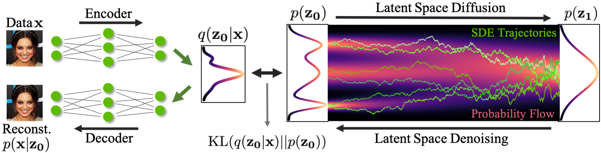]

.footnote[Credits: [Vahdat et al](https://nvlabs.github.io/LSGM/), 2021.]

---

class: black-slide, middle
count: false

.center[

<video autoplay muted loop width="400" height="300">
     <source src="./figures/lec12/teddy_bear_guitar.mp4" type="video/mp4">
</video>

The end.

]

.footnote[Credits: [Blattmann et al](https://research.nvidia.com/labs/toronto-ai/VideoLDM/), 2023. Prompt: "A teddy bear is playing the electric guitar, high definition, 4k."]
