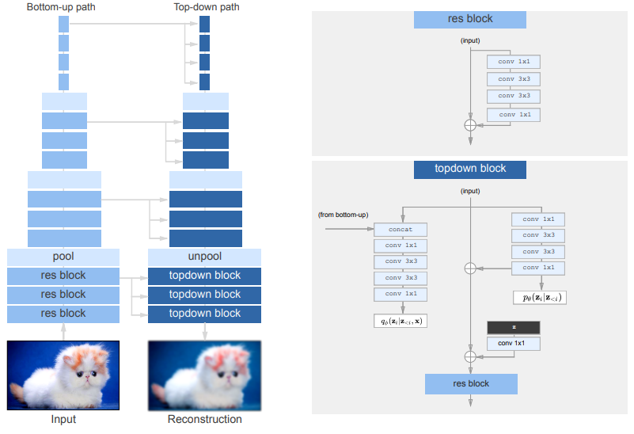
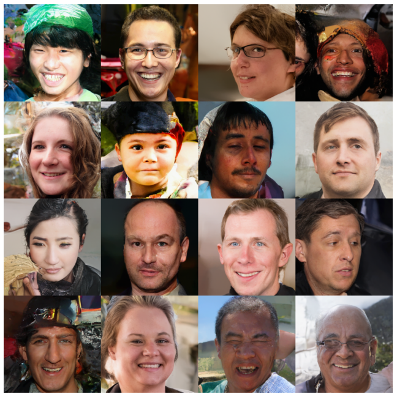
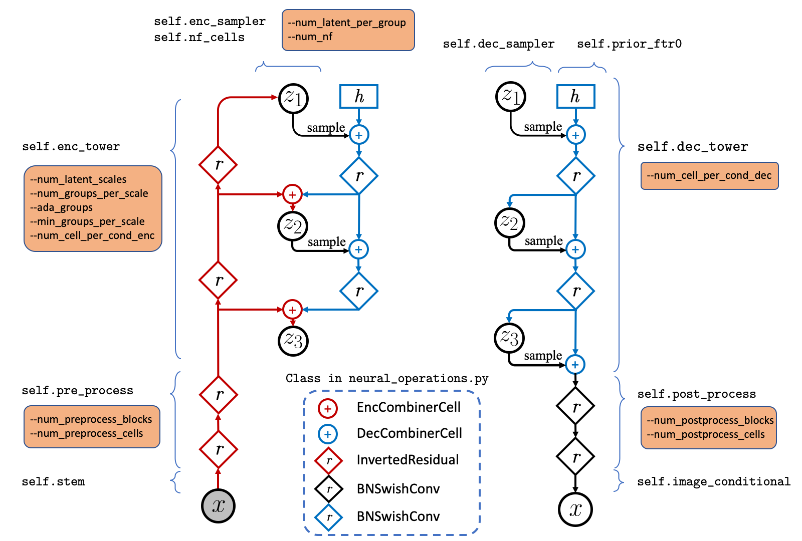

class: middle, center, title-slide

# Deep Learning

Lecture 12: Score-based diffusion models

  
Prof. Gilles Louppe 
[g.louppe@uliege.be](mailto:g.louppe@uliege.be)

???

R: https://twitter.com/c_valenzuelab/status/1562579547404455936

R: VERY GOOD https://arxiv.org/pdf/2208.11970.pdf

R: https://course.fast.ai/Lessons/part2.html  (more practical)?

R: https://twitter.com/MilesCranmer/status/1608763526138716168?t=bybrIyhZ3X8OJ-HqQQqIjw&s=03
R: https://docs.kidger.site/equinox/examples/score_based_diffusion/
R: https://arxiv.org/abs/2208.11970
https://arxiv.org/abs/2301.11108

R: prompts https://bestaiprompts.art/

R: https://scoste.fr/posts/diffusion/

---

# Hierarchical VAEs

See side notes.

---

class: middle

.center.width-90[]

.center[VDVAE: Very Deep VAEs (Child, 2020-2021).]

---

class: middle

.center.width-70[]

.center[VDVAE samples (Child, 2020-2021).]

---

class: middle

.center.width-100[]

.center[NVAE: A Deep Hierarchical Variational Autoencoder (Vahdat and Kautz, 2020).]

---

class: middle

.center.width-90[]

.center[NVAE samples (Vahdat and Kautz, 2020).]

---

class: black-slide, middle

.center[
.width-60[]

NVAE: Random walks in latent space. (Vahdat and Kautz, 2020)

]

