class: middle, center, title-slide

# Deep Learning

Lecture 2: Neural networks

  
Prof. Gilles Louppe 
[g.louppe@uliege.be](mailto:g.louppe@uliege.be)

???

R: regenerate all svg files from draw.io

R: backprop -> check https://mathematical-tours.github.io/book-sources/optim-ml/OptimML.pdf

---

# Today

Explain and motivate the basic constructs of neural networks.

- From linear discriminant analysis to logistic regression
- Stochastic gradient descent
- From logistic regression to the multi-layer perceptron
- Vanishing gradients and rectified networks
- Universal approximation theorem (teaser)

---

class: middle

# Neural networks

---

# Threshold Logic Unit

The Threshold Logic Unit (McCulloch and Pitts, 1943) was the first mathematical model for a **neuron**.

Assuming Boolean inputs and outputs, it is defined as

$$f(\mathbf{x}) = 1_{\\{\sum_i w\_i x_i + b \geq 0\\}}$$

This unit can implement:

- $\text{or}(a,b) = 1\_{\\\{a+b - 0.5 \geq 0\\\}}$
- $\text{and}(a,b) = 1\_{\\\{a+b - 1.5 \geq 0\\\}}$
- $\text{not}(a) = 1\_{\\\{-a + 0.5 \geq 0\\\}}$

Therefore, any Boolean function can be built with such units.

---

class: middle

.center.width-40[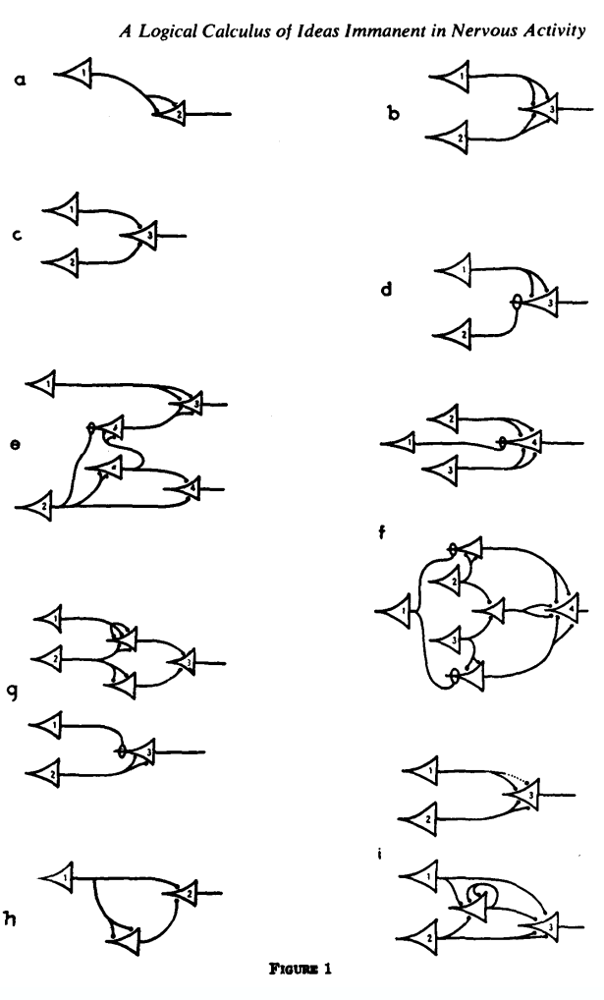]

.footnote[Credits: McCulloch and Pitts, [A logical calculus of ideas immanent in nervous activity](http://www.cse.chalmers.se/~coquand/AUTOMATA/mcp.pdf), 1943.]

---

# Perceptron

The perceptron (Rosenblatt, 1957) is very similar, except that the inputs are real:

$$f(\mathbf{x}) = \begin{cases}
   1 &\text{if } \sum_i w_i x_i + b \geq 0  \\\\
   0 &\text{otherwise}
\end{cases}$$

This model was originally motivated by biology, with $w_i$ being synaptic weights and $x_i$ and $f$ firing rates.

---

class: middle

.center.width-100[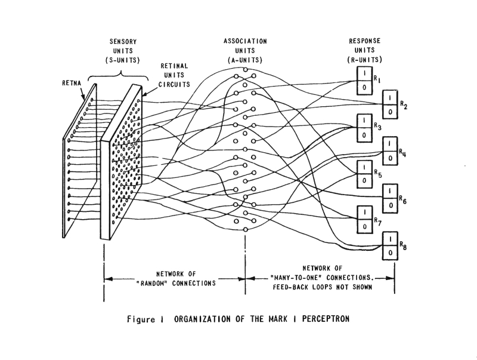]

.footnote[Credits: Frank Rosenblatt, [Mark I Perceptron operators' manual](https://apps.dtic.mil/dtic/tr/fulltext/u2/236965.pdf), 1960.]

???

A perceptron is a signal transmission network
consisting of sensory units (S units), association units
(A units), and output or response units (R units). The
‘retina’ of the perceptron is an array of sensory
elements (photocells). An S-unit produces a binary
output depending on whether or not it is excited. A
randomly selected set of retinal cells is connected to
the next level of the network, the A units. As originally
proposed there were extensive connections among the
A units, the R units, and feedback between the R units
and the A units.

In essence an association unit is also an MCP neuron which is 1 if a single specific pattern of inputs is received, and it is 0 for all other possible patterns of  inputs. Each association unit will have a certain number of inputs which are selected from all the inputs to the perceptron.  So the number of inputs to a particular association unit does not have to be the same as the total number of inputs to the perceptron, but clearly the number of inputs to an association unit  must be less than or equal to the total number of inputs to the perceptron.  Each association unit's output then becomes the input to a single MCP neuron, and the output from this single MCP neuron is the output of the perceptron.  So a perceptron consists of a "layer" of MCP neurons, and all of these neurons send their output to a single MCP neuron.

---

class: middle, center, black-slide

.grid[
.kol-1-2[.width-100[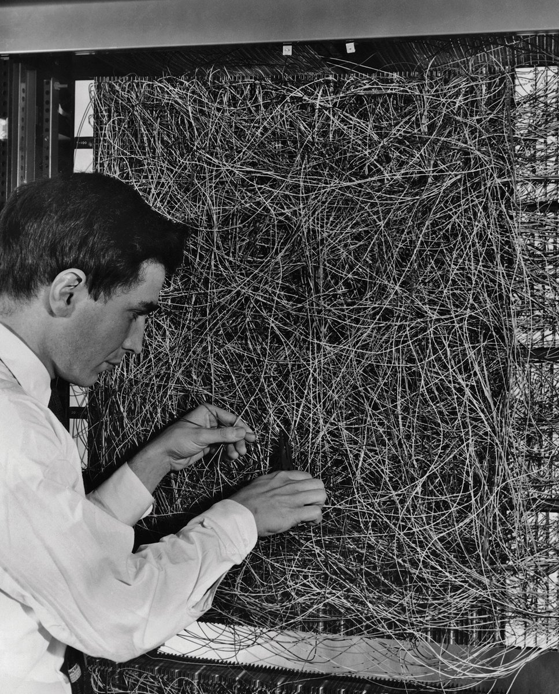]]
.kol-1-2[  .width-100[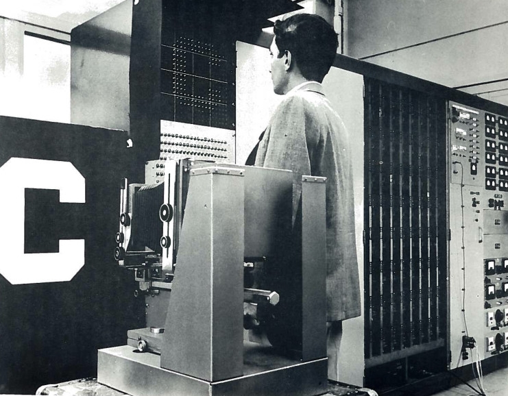]]
]

The Mark I Percetron (Frank Rosenblatt).

---

class: middle, center, black-slide

<iframe width="600" height="450" src="https://www.youtube.com/embed/cNxadbrN_aI" frameborder="0" allowfullscreen></iframe>

The Perceptron

---

class: middle

Let us define the (non-linear) **activation** function:

$$\text{sign}(x) = \begin{cases}
   1 &\text{if } x \geq 0  \\\\
   0 &\text{otherwise}
\end{cases}$$
.center[]

The perceptron classification rule can be rewritten as
$$f(\mathbf{x}) = \text{sign}(\sum\_i w\_i x\_i  + b).$$

---

class: middle

## Computational graphs

.grid[
.kol-3-5[.width-90[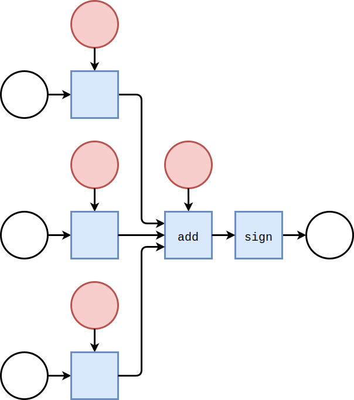]]
.kol-2-5[
The computation of
$$f(\mathbf{x}) = \text{sign}(\sum\_i w\_i x\_i  + b)$$ can be represented as a **computational graph** where
- white nodes correspond to inputs and outputs;
- red nodes correspond to model parameters;
- blue nodes correspond to intermediate operations.
]
]

???

Draw the NN diagram.

---

class: middle

In terms of **tensor operations**, $f$ can be rewritten as
$$f(\mathbf{x}) = \text{sign}(\mathbf{w}^T  \mathbf{x} + b),$$
for which the corresponding computational graph of $f$ is:

.center.width-70[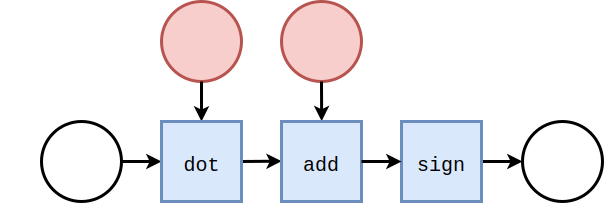]

---

# Linear discriminant analysis

Consider training data $(\mathbf{x}, y) \sim P(X,Y)$, with
- $\mathbf{x} \in \mathbb{R}^p$,
- $y \in \\\{0,1\\\}$.

Assume class populations are Gaussian, with same covariance matrix $\Sigma$ (homoscedasticity):

$$P(\mathbf{x}|y) = \frac{1}{\sqrt{(2\pi)^p |\Sigma|}} \exp \left(-\frac{1}{2}(\mathbf{x} - \mathbf{\mu}_y)^T \Sigma^{-1}(\mathbf{x} - \mathbf{\mu}_y) \right)$$

---

 
Using the Bayes' rule, we have:

$$\begin{aligned}
P(Y=1|\mathbf{x}) &= \frac{P(\mathbf{x}|Y=1) P(Y=1)}{P(\mathbf{x})} \\\\
         &= \frac{P(\mathbf{x}|Y=1) P(Y=1)}{P(\mathbf{x}|Y=0)P(Y=0) + P(\mathbf{x}|Y=1)P(Y=1)} \\\\
         &= \frac{1}{1 + \frac{P(\mathbf{x}|Y=0)P(Y=0)}{P(\mathbf{x}|Y=1)P(Y=1)}}.
\end{aligned}$$

--

count: false

It follows that with

$$\sigma(x) = \frac{1}{1 + \exp(-x)},$$

we get

$$P(Y=1|\mathbf{x}) = \sigma\left(\log \frac{P(\mathbf{x}|Y=1)}{P(\mathbf{x}|Y=0)} + \log \frac{P(Y=1)}{P(Y=0)}\right).$$

---

class: middle

Therefore,

$$\begin{aligned}
&P(Y=1|\mathbf{x}) \\\\
&= \sigma\left(\log \frac{P(\mathbf{x}|Y=1)}{P(\mathbf{x}|Y=0)} + \underbrace{\log \frac{P(Y=1)}{P(Y=0)}}\_{a}\right) \\\\
    &= \sigma\left(\log P(\mathbf{x}|Y=1) - \log P(\mathbf{x}|Y=0) + a\right) \\\\
    &= \sigma\left(-\frac{1}{2}(\mathbf{x} - \mathbf{\mu}\_1)^T \Sigma^{-1}(\mathbf{x} - \mathbf{\mu}\_1) + \frac{1}{2}(\mathbf{x} - \mathbf{\mu}\_0)^T \Sigma^{-1}(\mathbf{x} - \mathbf{\mu}\_0) + a\right) \\\\
    &= \sigma\left(\underbrace{(\mu\_1-\mu\_0)^T \Sigma^{-1}}\_{\mathbf{w}^T}\mathbf{x} + \underbrace{\frac{1}{2}(\mu\_0^T \Sigma^{-1} \mu\_0 - \mu\_1^T \Sigma^{-1} \mu\_1) + a}\_{b} \right) \\\\
    &= \sigma\left(\mathbf{w}^T \mathbf{x} + b\right)
\end{aligned}$$

---

class: middle, center

.width-100[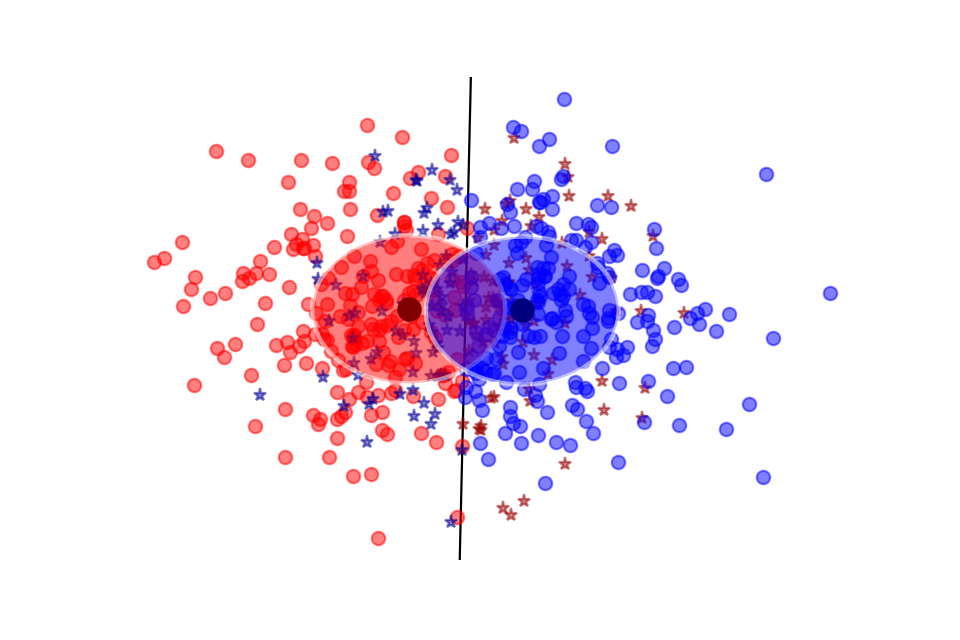]

---

count: false
class: middle, center

.width-100[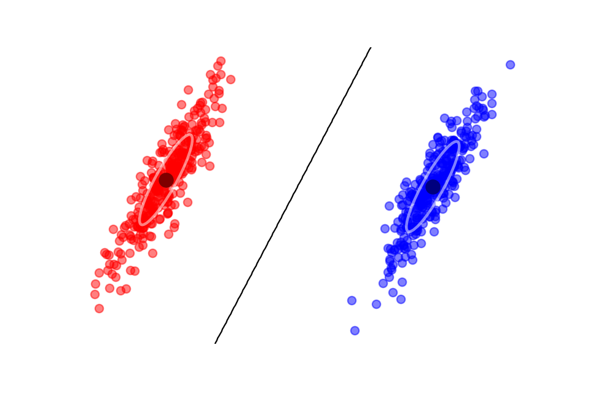]

---

count: false
class: middle, center

.width-100[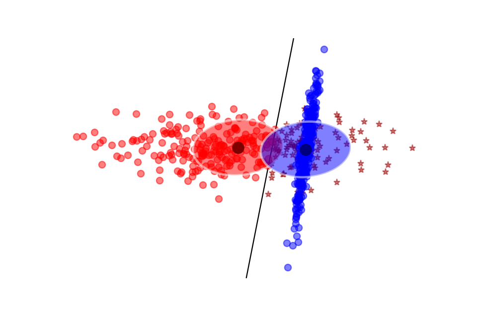]

---

class: middle

Note that the **sigmoid** function
$$\sigma(x) = \frac{1}{1 + \exp(-x)}$$
looks like a soft heavyside:

.center[]

Therefore, the overall model
$f(\mathbf{x};\mathbf{w},b) =  \sigma(\mathbf{w}^T \mathbf{x} + b)$
is very similar to the perceptron.

---

class: middle, center

.center.width-70[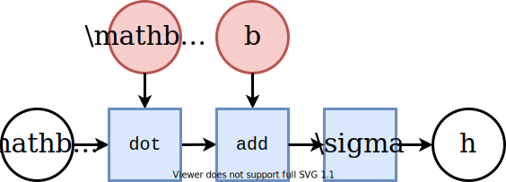]

This unit is the main **primitive** of all neural networks!

---

# Logistic regression

Same model $$P(Y=1|\mathbf{x}) = \sigma\left(\mathbf{w}^T \mathbf{x} + b\right)$$ as for linear discriminant analysis.

But,
- **ignore** model assumptions (Gaussian class populations, homoscedasticity);
- instead, find $\mathbf{w}, b$ that maximizes the likelihood of the data.

---

class: middle

We have,

$$\begin{aligned}
&\arg \max\_{\mathbf{w},b} P(\mathbf{d}|\mathbf{w},b) \\\\
&= \arg \max\_{\mathbf{w},b} \prod\_{\mathbf{x}\_i, y\_i \in \mathbf{d}} P(Y=y\_i|\mathbf{x}\_i, \mathbf{w},b) \\\\
&= \arg \max\_{\mathbf{w},b} \prod\_{\mathbf{x}\_i, y\_i \in \mathbf{d}} \sigma(\mathbf{w}^T \mathbf{x}\_i + b)^{y\_i}  (1-\sigma(\mathbf{w}^T \mathbf{x}\_i + b))^{1-y\_i}  \\\\
&= \arg \min\_{\mathbf{w},b} \underbrace{\sum\_{\mathbf{x}\_i, y\_i \in \mathbf{d}} -{y\_i} \log\sigma(\mathbf{w}^T \mathbf{x}\_i + b) - {(1-y\_i)} \log (1-\sigma(\mathbf{w}^T \mathbf{x}\_i + b))}\_{\mathcal{L}(\mathbf{w}, b) = \sum\_i \ell(y\_i, \hat{y}(\mathbf{x}\_i; \mathbf{w}, b))}
\end{aligned}$$

This loss is an instance of the **cross-entropy** $$H(p,q) = \mathbb{E}_p[-\log q]$$ for  $p=Y|\mathbf{x}\_i$ and $q=\hat{Y}|\mathbf{x}\_i$.

---

class: middle

When $Y$ takes values in $\\{-1,1\\}$, a similar derivation yields the **logistic loss** $$\mathcal{L}(\mathbf{w}, b) = -\sum_{\mathbf{x}\_i, y\_i \in \mathbf{d}} \log \sigma\left(y\_i (\mathbf{w}^T \mathbf{x}\_i + b))\right).$$

.center[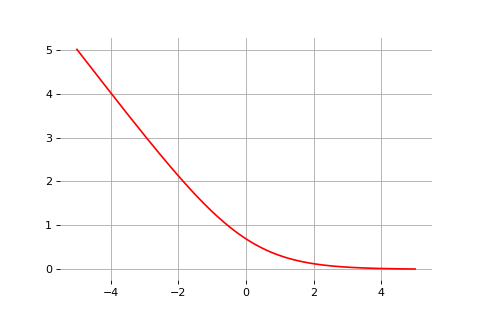]

---

class: middle

- In general, the cross-entropy and the logistic losses do not admit a minimizer that can be expressed analytically in closed form.
- However, a minimizer can be found numerically, using a general minimization technique such as **gradient descent**.

---

# Gradient descent

Let $\mathcal{L}(\theta)$ denote a loss function defined over model parameters $\theta$ (e.g., $\mathbf{w}$ and $b$).

To minimize $\mathcal{L}(\theta)$, **gradient descent** uses local linear information to iteratively move towards a (local) minimum.

For $\theta\_0 \in \mathbb{R}^d$, a first-order approximation around $\theta\_0$ can be defined as
$$\hat{\mathcal{L}}(\epsilon; \theta\_0) = \mathcal{L}(\theta\_0) + \epsilon^T\nabla\_\theta \mathcal{L}(\theta\_0) + \frac{1}{2\gamma}||\epsilon||^2.$$

.center.width-60[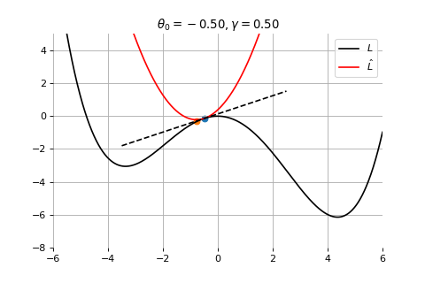]

---

class: middle

A minimizer of the approximation $\hat{\mathcal{L}}(\epsilon; \theta\_0)$ is given for
$$\begin{aligned}
\nabla\_\epsilon \hat{\mathcal{L}}(\epsilon; \theta\_0) &= 0 \\\\
 &= \nabla\_\theta \mathcal{L}(\theta\_0) + \frac{1}{\gamma} \epsilon,
\end{aligned}$$
which results in the best improvement for the step $\epsilon = -\gamma \nabla\_\theta \mathcal{L}(\theta\_0)$.

Therefore, model parameters can be updated iteratively using the update rule
$$\theta\_{t+1} = \theta\_t -\gamma \nabla\_\theta \mathcal{L}(\theta\_t),$$
where
- $\theta_0$ are the initial parameters of the model;
- $\gamma$ is the **learning rate**;
- both are critical for the convergence of the update rule.

---

class: center, middle

Example 1: Convergence to a local minima

---

count: false
class: center, middle

Example 1: Convergence to a local minima

---

count: false
class: center, middle

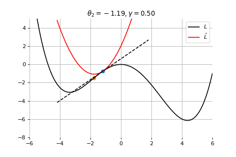

Example 1: Convergence to a local minima

---

count: false
class: center, middle

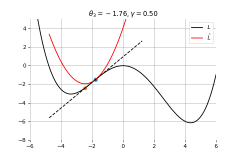

Example 1: Convergence to a local minima

---

count: false
class: center, middle

Example 1: Convergence to a local minima

---

count: false
class: center, middle

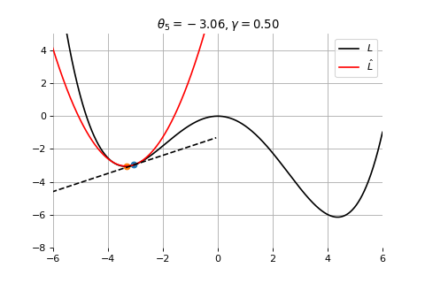

Example 1: Convergence to a local minima

---

count: false
class: center, middle

Example 1: Convergence to a local minima

---

count: false
class: center, middle

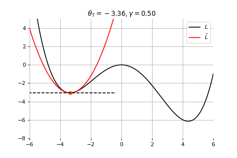

Example 1: Convergence to a local minima

---

class: center, middle

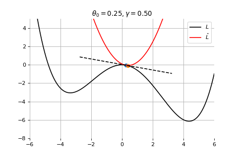

Example 2: Convergence to the global minima

---

count: false
class: center, middle

Example 2: Convergence to the global minima

---

count: false
class: center, middle

Example 2: Convergence to the global minima

---

count: false
class: center, middle

Example 2: Convergence to the global minima

---

count: false
class: center, middle

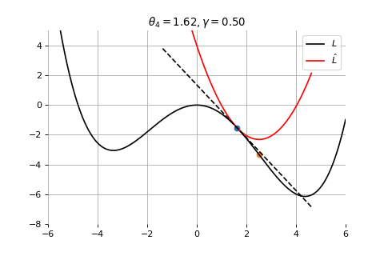

Example 2: Convergence to the global minima

---

count: false
class: center, middle

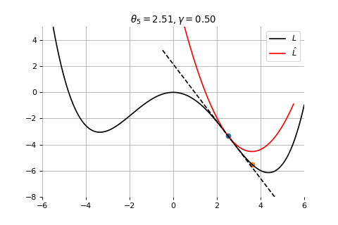

Example 2: Convergence to the global minima

---

count: false
class: center, middle

Example 2: Convergence to the global minima

---

count: false
class: center, middle

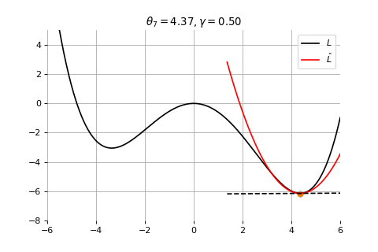

Example 2: Convergence to the global minima

---

class: center, middle

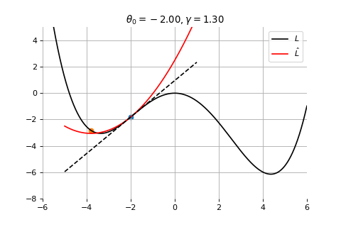

Example 3: Divergence due to a too large learning rate

---

count: false
class: center, middle

Example 3: Divergence due to a too large learning rate

---

count: false
class: center, middle

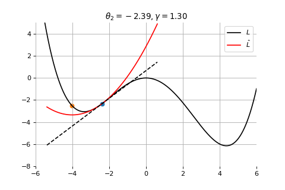

Example 3: Divergence due to a too large learning rate

---

count: false
class: center, middle

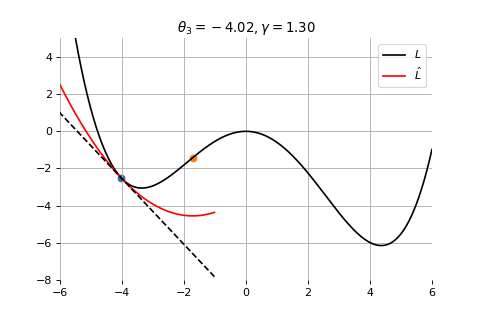

Example 3: Divergence due to a too large learning rate

---

count: false
class: center, middle

Example 3: Divergence due to a too large learning rate

---

count: false
class: center, middle

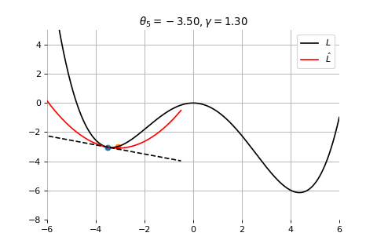

Example 3: Divergence due to a too large learning rate

---

# Stochastic gradient descent

In the empirical risk minimization setup, $\mathcal{L}(\theta)$ and its gradient decompose as
$$\begin{aligned}
\mathcal{L}(\theta) &= \frac{1}{N} \sum\_{\mathbf{x}\_i, y\_i \in \mathbf{d}} \ell(y\_i, f(\mathbf{x}\_i; \theta)) \\\\
\nabla \mathcal{L}(\theta) &= \frac{1}{N} \sum\_{\mathbf{x}\_i, y\_i \in \mathbf{d}} \nabla \ell(y\_i, f(\mathbf{x}\_i; \theta)).
\end{aligned}$$
Therefore, in **batch** gradient descent the complexity of an update grows linearly with the size $N$ of the dataset. This is bad!

---

class: middle

Since the empirical risk is already an approximation of the expected risk, it should not be necessary to carry out the minimization with great accuracy.

---

  

Instead, **stochastic** gradient descent uses as update rule:
$$\theta\_{t+1} = \theta\_t - \gamma \nabla \ell(y\_{i(t+1)}, f(\mathbf{x}\_{i(t+1)}; \theta\_t))$$

- Iteration complexity is independent of $N$.
- The stochastic process $\\\{ \theta\_t | t=1, ... \\\}$ depends on the examples $i(t)$ picked randomly at each iteration.

--

.grid.center.italic[
.kol-1-2[.width-100[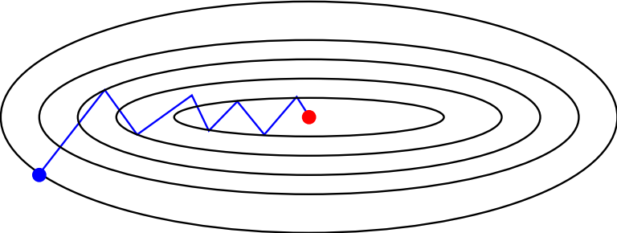]

Batch gradient descent]
.kol-1-2[.width-100[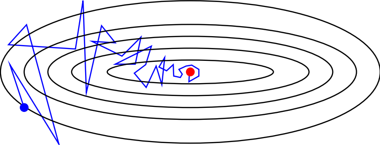]

Stochastic gradient descent
]
]

---

class: middle

Why is stochastic gradient descent still a good idea?
- Informally, averaging the update
$$\theta\_{t+1} = \theta\_t - \gamma \nabla \ell(y\_{i(t+1)}, f(\mathbf{x}\_{i(t+1)}; \theta\_t)) $$
over all choices $i(t+1)$  restores batch gradient descent.
- Formally, if the gradient estimate is **unbiased**, e.g., if
$$\begin{aligned}
\mathbb{E}\_{i(t+1)}[\nabla \ell(y\_{i(t+1)}, f(\mathbf{x}\_{i(t+1)}; \theta\_t))] &= \frac{1}{N} \sum\_{\mathbf{x}\_i, y\_i \in \mathbf{d}} \nabla \ell(y\_i, f(\mathbf{x}\_i; \theta\_t)) \\\\
&= \nabla \mathcal{L}(\theta\_t)
\end{aligned}$$
then the formal convergence of SGD can be proved, under appropriate assumptions (see references).
- If training is limited to single pass over the data, then SGD directly minimizes the **expected** risk.

---

class: middle

The excess error characterizes the expected risk discrepancy between the Bayes model and the approximate empirical risk minimizer. It can be decomposed as
$$\begin{aligned}
&\mathbb{E}\left[ R(\tilde{f}\_\*^\mathbf{d}) - R(f\_B) \right] \\\\
&= \mathbb{E}\left[ R(f\_\*) - R(f\_B) \right] + \mathbb{E}\left[ R(f\_\*^\mathbf{d}) - R(f\_\*) \right] + \mathbb{E}\left[ R(\tilde{f}\_\*^\mathbf{d}) - R(f\_\*^\mathbf{d}) \right]  \\\\
&= \mathcal{E}\_\text{app} + \mathcal{E}\_\text{est} + \mathcal{E}\_\text{opt}
\end{aligned}$$
where
- $\mathcal{E}\_\text{app}$ is the approximation error due to the choice of an hypothesis space,
- $\mathcal{E}\_\text{est}$ is the estimation error due to the empirical risk minimization principle,
- $\mathcal{E}\_\text{opt}$ is the optimization error due to the approximate optimization algorithm.

---

class: middle

A fundamental result due to Bottou and Bousquet (2011) states that stochastic optimization algorithms (e.g., SGD) yield the best generalization performance (in terms of excess error) despite being the worst optimization algorithms for minimizing the empirical risk.

---

# Multi-layer perceptron

So far we considered the logistic unit $h=\sigma\left(\mathbf{w}^T \mathbf{x} + b\right)$, where $h \in \mathbb{R}$, $\mathbf{x} \in \mathbb{R}^p$, $\mathbf{w} \in \mathbb{R}^p$ and $b \in \mathbb{R}$.

These units can be composed *in parallel* to form a **layer** with $q$ outputs:
$$\mathbf{h} = \sigma(\mathbf{W}^T \mathbf{x} + \mathbf{b})$$
where  $\mathbf{h} \in \mathbb{R}^q$, $\mathbf{x} \in \mathbb{R}^p$, $\mathbf{W} \in \mathbb{R}^{p\times q}$, $b \in \mathbb{R}^q$ and where $\sigma(\cdot)$ is upgraded to the element-wise sigmoid function.

 
.center.width-70[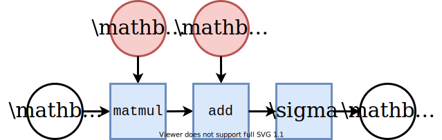]

???

Draw the NN diagram.

---

class: middle

Similarly, layers can be composed *in series*, such that:
$$\begin{aligned}
\mathbf{h}\_0 &= \mathbf{x} \\\\
\mathbf{h}\_1 &= \sigma(\mathbf{W}\_1^T \mathbf{h}\_0 + \mathbf{b}\_1) \\\\
... \\\\
\mathbf{h}\_L &= \sigma(\mathbf{W}\_L^T \mathbf{h}\_{L-1} + \mathbf{b}\_L) \\\\
f(\mathbf{x}; \theta) = \hat{y} &= \mathbf{h}\_L
\end{aligned}$$
where $\theta$ denotes the model parameters $\\{ \mathbf{W}\_k, \mathbf{b}\_k, ... | k=1, ..., L\\}$.

This model is the **multi-layer perceptron**, also known as the fully connected feedforward network.

???

Draw the NN diagram.

---

class: middle, center

.width-100[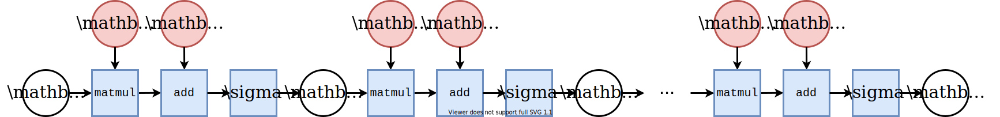]

---

class: middle

.width-100[]

.footnote[Credits: [PyTorch Deep Learning Minicourse](https://atcold.github.io/pytorch-Deep-Learning-Minicourse/), Alfredo Canziani, 2020.]

---

class: middle

## Output layer 

- For binary classification, the width $q$ of the last layer $L$ is set to $1$, which results in a single output $h\_L \in [0,1]$ that models the probability $P(Y=1|\mathbf{x})$.
- For multi-class classification, the sigmoid action $\sigma$ in the last layer can be generalized to produce a vector $\mathbf{h}\_L \in \bigtriangleup^C$ of probability estimates $P(Y=i|\mathbf{x})$.
  
This activation is the $\text{Softmax}$ function, where its $i$-th output is defined as
$$\text{Softmax}(\mathbf{z})\_i = \frac{\exp(z\_i)}{\sum\_{j=1}^C \exp(z\_j)},$$
for $i=1, ..., C$.

---

# Regression

For regression problems, one usually starts with the assumption that
$$P(y|\mathbf{x}) = \mathcal{N}(y; \mu=f(\mathbf{x}; \theta), \sigma^2=1),$$
where $f$ is parameterized with a neural network which last layer does not contain any final activation.

---

class: middle

We have,
$$\begin{aligned}
&\arg \max\_{\theta} P(\mathbf{d}|\theta) \\\\
&= \arg \max\_{\theta} \prod\_{\mathbf{x}\_i, y\_i \in \mathbf{d}} P(Y=y\_i|\mathbf{x}\_i, \theta) \\\\
&= \arg \min\_{\theta} -\sum\_{\mathbf{x}\_i, y\_i \in \mathbf{d}} \log P(Y=y\_i|\mathbf{x}\_i, \theta) \\\\
&= \arg \min\_{\theta} -\sum\_{\mathbf{x}\_i, y\_i \in \mathbf{d}} \log\left( \frac{1}{\sqrt{2\pi}} \exp\(-\frac{1}{2}(y\_i - f(\mathbf{x};\theta))^2\) \right)\\\\
&= \arg \min\_{\theta} \sum\_{\mathbf{x}\_i, y\_i \in \mathbf{d}} (y\_i - f(\mathbf{x};\theta))^2,
\end{aligned}$$
which recovers the common **squared error** loss $\ell(y, \hat{y}) = (y-\hat{y})^2$.

---

# Automatic differentiation

To minimize $\mathcal{L}(\theta)$ with stochastic gradient descent, we need the gradient $\nabla_\theta \mathcal{\ell}(\theta_t)$.

Therefore, we require the evaluation of the (total) derivatives
$$\frac{\text{d} \ell}{\text{d} \mathbf{W}\_k}  \,\text{and}\,  \frac{\text{d} \mathcal{\ell}}{\text{d} \mathbf{b}\_k}$$
of the loss $\ell$ with respect to all model parameters $\mathbf{W}\_k$, $\mathbf{b}\_k$, for $k=1, ..., L$.

These derivatives can be evaluated automatically from the *computational graph* of $\ell$ using **automatic differentiation**.

---

class: middle

## Chain rule

.center.width-60[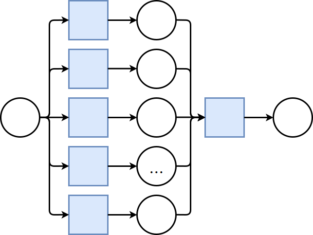]

Let us consider a 1-dimensional output composition $f \circ g$, such that
$$\begin{aligned}
y &= f(\mathbf{u}) \\\\
\mathbf{u} &= g(x) = (g\_1(x), ..., g\_m(x)).
\end{aligned}$$

---

class: middle

The **chain rule** states that $(f \circ g)' = (f' \circ g) g'.$

For the total derivative, the chain rule generalizes to
$$
\begin{aligned}
\frac{\text{d} y}{\text{d} x} &= \sum\_{k=1}^m \frac{\partial y}{\partial u\_k} \underbrace{\frac{\text{d} u\_k}{\text{d} x}}\_{\text{recursive case}}
\end{aligned}$$

---

class: middle

## Reverse automatic differentiation

- Since a neural network is a **composition of differentiable functions**, the total
derivatives of the loss can be evaluated backward, by applying the chain rule
recursively over its computational graph.
- The implementation of this procedure is called reverse *automatic differentiation*.

---

class: middle

Let us consider a simplified 2-layer MLP and the following loss function:
$$\begin{aligned}
f(\mathbf{x}; \mathbf{W}\_1, \mathbf{W}\_2) &= \sigma\left( \mathbf{W}\_2^T \sigma\left( \mathbf{W}\_1^T \mathbf{x} \right)\right) \\\\
\mathcal{\ell}(y, \hat{y}; \mathbf{W}\_1, \mathbf{W}\_2) &= \text{cross\\\_ent}(y, \hat{y}) + \lambda \left( ||\mathbf{W}_1||\_2 + ||\mathbf{W}\_2||\_2 \right)
\end{aligned}$$
for $\mathbf{x} \in \mathbb{R^p}$, $y \in \mathbb{R}$, $\mathbf{W}\_1 \in \mathbb{R}^{p \times q}$ and $\mathbf{W}\_2 \in \mathbb{R}^q$.

---

class: middle

In the *forward pass*, intermediate values are all computed from inputs to outputs, which results in the annotated computational graph below:

.width-100[]

---

class: middle

The total derivative can be computed through a **backward pass**, by walking through all paths from outputs to parameters in the computational graph and accumulating the terms. For example, for $\frac{\text{d} \ell}{\text{d} \mathbf{W}\_1}$  we have:
$$\begin{aligned}
\frac{\text{d} \ell}{\text{d} \mathbf{W}\_1} &= \frac{\partial \ell}{\partial u\_8}\frac{\text{d} u\_8}{\text{d} \mathbf{W}\_1} + \frac{\partial \ell}{\partial u\_4}\frac{\text{d} u\_4}{\text{d} \mathbf{W}\_1} \\\\
\frac{\text{d} u\_8}{\text{d} \mathbf{W}\_1} &= ...
\end{aligned}$$

.width-100[]

---

class: middle

.width-100[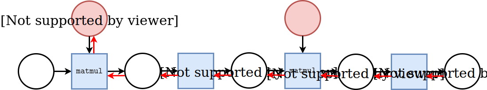]

Let us zoom in on the computation of the network output $\hat{y}$ and of its derivative with respect to $\mathbf{W}\_1$.

- *Forward pass*: values $u\_1$, $u\_2$, $u\_3$ and $\hat{y}$ are computed by traversing the graph from inputs to outputs given $\mathbf{x}$, $\mathbf{W}\_1$ and $\mathbf{W}\_2$.
- **Backward pass**: by the chain rule we have
$$\begin{aligned}
\frac{\text{d} \hat{y}}{\text{d} \mathbf{W}\_1} &= \frac{\partial \hat{y}}{\partial u\_3} \frac{\partial u\_3}{\partial u\_2} \frac{\partial u\_2}{\partial u\_1} \frac{\partial u\_1}{\partial \mathbf{W}\_1} \\\\
&= \frac{\partial \sigma(u\_3)}{\partial u\_3} \frac{\partial \mathbf{W}\_2^T u\_2}{\partial u\_2} \frac{\partial \sigma(u\_1)}{\partial u\_1} \frac{\partial \mathbf{W}\_1^T \mathbf{x}}{\partial \mathbf{W}\_1}
\end{aligned}$$
Note how evaluating the partial derivatives requires the intermediate values computed forward.

---

class: middle

- This algorithm is also known as **backpropagation**.
- An equivalent procedure can be defined to evaluate the derivatives in *forward mode*, from inputs to outputs.
- Since differentiation is a linear operator, automatic differentiation can be implemented efficiently in terms of tensor operations.

---

# Vanishing gradients

Training deep MLPs with many layers has for long (pre-2011) been very difficult due to the **vanishing gradient** problem.
- Small gradients slow down, and eventually block, stochastic gradient descent.
- This results in a limited capacity of learning.

.width-100[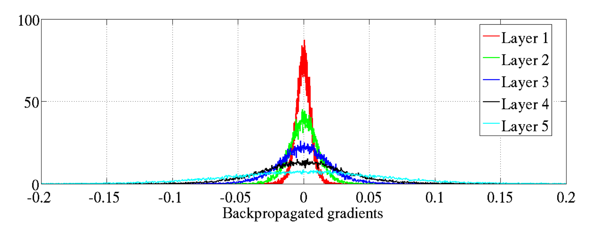]
.caption[Backpropagated gradients normalized histograms (Glorot and Bengio, 2010).  Gradients for layers far from the output vanish to zero. ]

---

class: middle

Let us consider a simplified 3-layer MLP, with $x, w\_1, w\_2, w\_3 \in\mathbb{R}$, such that
$$f(x; w\_1, w\_2, w\_3) = \sigma\left(w\_3\sigma\left( w\_2 \sigma\left( w\_1 x \right)\right)\right). $$

Under the hood, this would be evaluated as
$$\begin{aligned}
u\_1 &= w\_1 x \\\\
u\_2 &= \sigma(u\_1) \\\\
u\_3 &= w\_2 u\_2 \\\\
u\_4 &= \sigma(u\_3) \\\\
u\_5 &= w\_3 u\_4 \\\\
\hat{y} &= \sigma(u\_5)
\end{aligned}$$
and its derivative $\frac{\text{d}\hat{y}}{\text{d}w\_1}$ as
$$\begin{aligned}\frac{\text{d}\hat{y}}{\text{d}w\_1} &= \frac{\partial \hat{y}}{\partial u\_5} \frac{\partial u\_5}{\partial u\_4} \frac{\partial u\_4}{\partial u\_3} \frac{\partial u\_3}{\partial u\_2}\frac{\partial u\_2}{\partial u\_1}\frac{\partial u\_1}{\partial w\_1}\\\\
&= \frac{\partial \sigma(u\_5)}{\partial u\_5} w\_3 \frac{\partial \sigma(u\_3)}{\partial u\_3} w\_2 \frac{\partial \sigma(u\_1)}{\partial u\_1} x
\end{aligned}$$

---

class: middle

The derivative of the sigmoid activation function $\sigma$ is:

.center[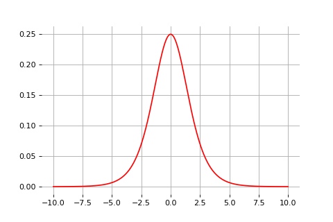]

$$\frac{\text{d} \sigma}{\text{d} x}(x) = \sigma(x)(1-\sigma(x))$$

Notice that $0 \leq \frac{\text{d} \sigma}{\text{d} x}(x) \leq \frac{1}{4}$ for all $x$.

---

class: middle

Assume that weights $w\_1, w\_2, w\_3$ are initialized randomly from a Gaussian with zero-mean and  small variance, such that with high probability $-1 \leq w\_i \leq 1$.

Then,

$$\frac{\text{d}\hat{y}}{\text{d}w\_1} = \underbrace{\frac{\partial \sigma(u\_5)}{\partial u\_5}}\_{\leq \frac{1}{4}} \underbrace{w\_3}\_{\leq 1} \underbrace{\frac{\partial \sigma(u\_3)}{\partial u\_3}}\_{\leq \frac{1}{4}} \underbrace{w\_2}\_{\leq 1} \underbrace{\frac{\sigma(u\_1)}{\partial u\_1}}\_{\leq \frac{1}{4}} x$$

This implies that the gradient $\frac{\text{d}\hat{y}}{\text{d}w\_1}$ **exponentially** shrinks to zero as the number of layers in the network increases.

Hence the vanishing gradient problem.

- In general, bounded activation functions (sigmoid, tanh, etc) are prone to the vanishing gradient problem.
- Note the importance of a proper initialization scheme.

---

# Rectified linear units

Instead of the sigmoid activation function, modern neural networks
are for most based on **rectified linear units** (ReLU) (Glorot et al, 2011):

$$\text{ReLU}(x) = \max(0, x)$$

.center[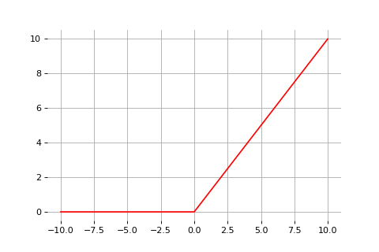]

---

class: middle

Note that the derivative of the ReLU function is

$$\frac{\text{d}}{\text{d}x} \text{ReLU}(x) = \begin{cases}
   0 &\text{if } x \leq 0  \\\\
   1 &\text{otherwise}
\end{cases}$$
.center[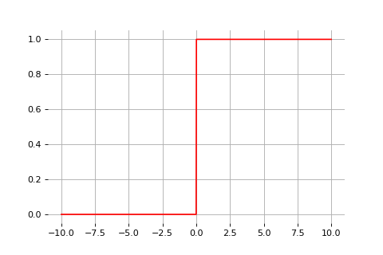]

For $x=0$, the derivative is undefined. In practice, it is set to zero.

---

class: middle

Therefore,

$$\frac{\text{d}\hat{y}}{\text{d}w\_1} = \underbrace{\frac{\partial \sigma(u\_5)}{\partial u\_5}}\_{= 1} w\_3 \underbrace{\frac{\partial \sigma(u\_3)}{\partial u\_3}}\_{= 1} w\_2 \underbrace{\frac{\partial \sigma(u\_1)}{\partial u\_1}}\_{= 1} x$$

This **solves** the vanishing gradient problem, even for deep networks! (provided proper initialization)

Note that:
- The ReLU unit dies when its input is negative, which might block gradient descent.
- This is actually a useful property to induce *sparsity*.
- This issue can also be solved using **leaky** ReLUs, defined as $$\text{LeakyReLU}(x) = \max(\alpha x, x)$$ for a small $\alpha \in \mathbb{R}^+$ (e.g., $\alpha=0.1$).

---

# Universal approximation (teaser)

Let us consider the 1-layer MLP
$$f(x) = \sum w\_i \text{ReLU}(x + b_i).$$  
This model can approximate *any* smooth 1D function, provided enough hidden units.

---

class: middle

.center[]

---

class: middle
count: false

.center[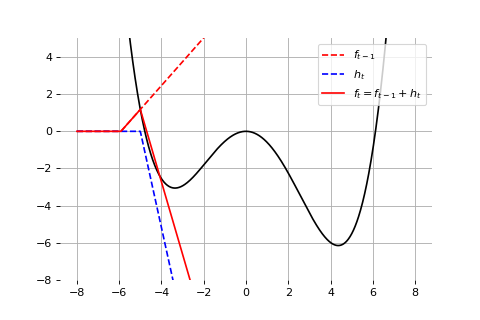]

---

class: middle
count: false

.center[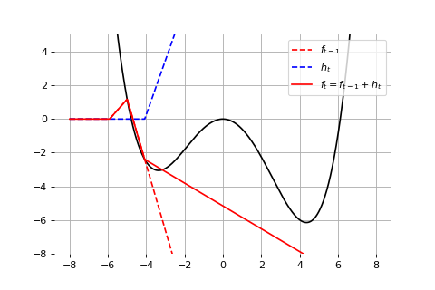]

---

class: middle
count: false

.center[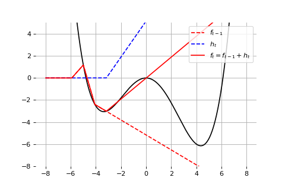]

---

class: middle
count: false

.center[]

---

class: middle
count: false

.center[]

---

class: middle
count: false

.center[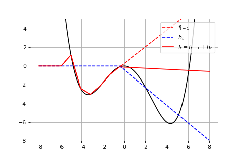]

---

class: middle
count: false

.center[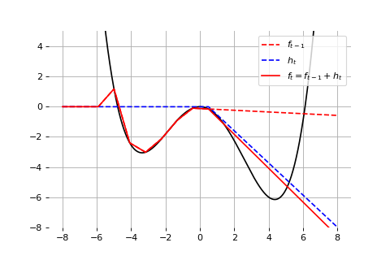]

---

class: middle
count: false

.center[]

---

class: middle
count: false

.center[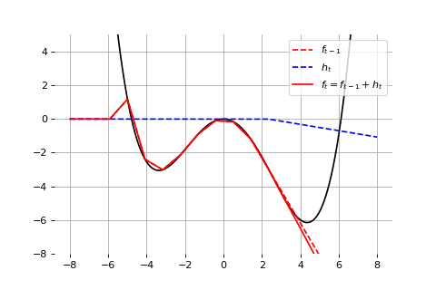]

---

class: middle
count: false

.center[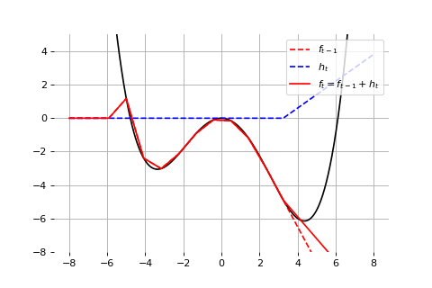]

---

class: middle
count: false

.center[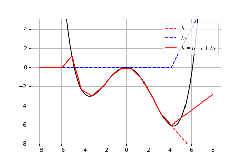]

---

class: middle
count: false

.center[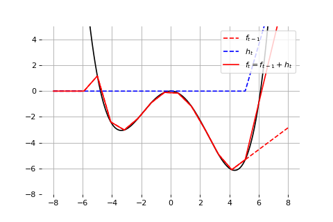]

---

class: middle, center

(demo)

---

# LEGO® Deep Learning 

    

.center.width-50[]

---

class: middle

.center.circle.width-30[]

.italic[
People are now building a new kind of software by .bold[assembling networks of parameterized functional blocks] and by .bold[training them from examples using some form of gradient-based optimization].
]

.pull-right[Yann LeCun, 2018.]

---

class: middle

## DL as an architectural language

.width-100[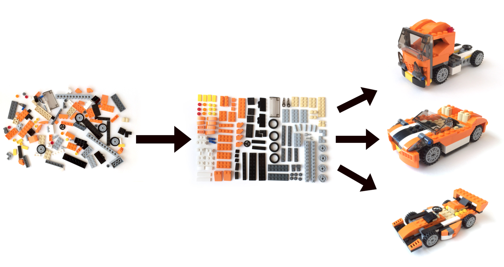]

---

class: middle

.center[
<video preload="auto" height="400" width="750" autoplay loop>
  <source src="./figures/lec2/toolbox.mp4" type="video/mp4">
</video>

The toolbox
]

.footnote[Credits: [Oriol Vinyals](https://twitter.com/OriolVinyalsML/status/1212422497339105280), 2020.]

---

class: black-slide

# LEGO® Creator Expert 

.center[
.width-60[]
.width-70[]
]

.footnote[Credits: [Vinyals et al, 2019](https://www.nature.com/articles/s41586-019-1724-z).]

---

class: end-slide, center
count: false

The end.

---

count: false

# References

- Rosenblatt, F. (1958). The perceptron: a probabilistic model for information storage and organization in the brain. Psychological review, 65(6), 386.
- Bottou, L., & Bousquet, O. (2008). The tradeoffs of large scale learning. In Advances in neural information processing systems (pp. 161-168).
- Rumelhart, D. E., Hinton, G. E., & Williams, R. J. (1986). Learning representations by back-propagating errors. nature, 323(6088), 533.
