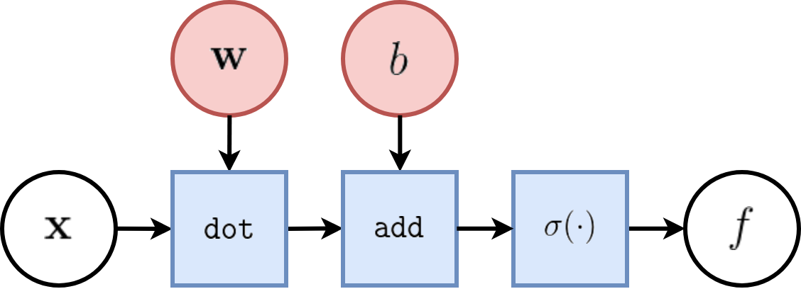
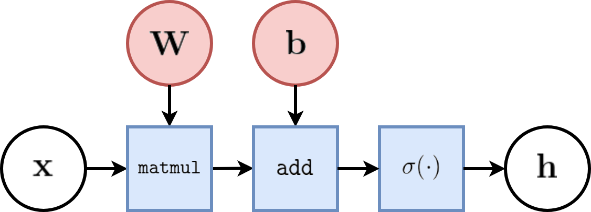
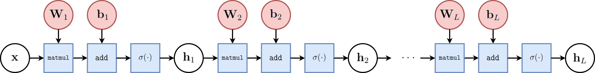
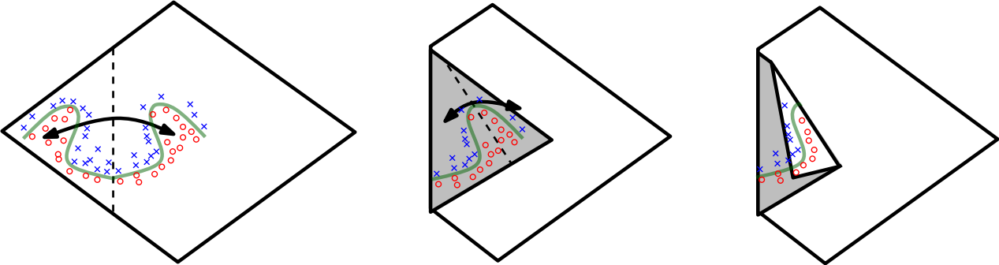

class: middle, center, title-slide

# Deep Learning

Lecture 2: Neural networks

  
Prof. Gilles Louppe 
[g.louppe@uliege.be](g.louppe@uliege.be)

???

R: lego analogy: from simple blocks to complex stuff
   deep learning is the same
R: sgd -> check /doc/
R: check fleuret history, relations to bio
R: DL = generalization and composition of graph (see fleuret 1-1 17)
R: more formalism on backprop

---

# Cooking recipe

- Get data (loads of them).
- Get good hardware.
- Define the neural network architecture as a composition of differentiable functions.
    - Stick to non-saturating activation function to avoid vanishing gradients.
    - Prefer deep over shallow architectures.
- Optimize with (variants of) stochastic gradient descent.
    - Evaluate gradients with automatic differentiation.

---

# Outline

Goal: explain and motivate the basic constructs of neural networks.

- From linear discriminant analysis to logistic regression
- Stochastic gradient descent
- From logistic regression to the multi-layer perceptron
- Vanishing gradients and rectified networks
- Universal approximation theorem

---

class: middle

# Neural networks

---

# Threshold Logic Unit

The Threshold Logic Unit (McCulloch and Pitts, 1943) was the first mathematical model for a **neuron**.
Assuming Boolean inputs and outputs, it is defined as:

$$f(\mathbf{x}) = 1_{\\{\sum_i w\_i x_i + b \geq 0\\}}$$

This unit can implement:

- $\text{or}(a,b) = 1\_{\\\{a+b - 0.5 \geq 0\\\}}$
- $\text{and}(a,b) = 1\_{\\\{a+b - 1.5 \geq 0\\\}}$
- $\text{not}(a) = 1\_{\\\{-a + 0.5 \geq 0\\\}}$

Therefore, any Boolean function can be built which such units.

---

# Perceptron

The perceptron (Rosenblatt, 1957) is very similar, except that the inputs are real:

$$f(\mathbf{x}) = \begin{cases}
   1 &\text{if } \sum_i w_i x_i + b \geq 0  \\\\
   0 &\text{otherwise}
\end{cases}$$

- This model was originally motivated by biology, with $w_i$ being synaptic weights and $x_i$ and $f$ firing rates.
- This is a **cartoonesque** biological model.

---

class: middle

Let us define the **activation** function:

$$\sigma(x) = \begin{cases}
   1 &\text{if } x \geq 0  \\\\
   0 &\text{otherwise}
\end{cases}$$
.center[]

Therefore, the perceptron classification rule can be rewritten as
$$f(\mathbf{x}) = \sigma(\mathbf{w}^T \mathbf{x} + b).$$

---

# Linear discriminant analysis

Consider training data $(\mathbf{x}, y) \sim P(X,Y)$, with
- $\mathbf{x} \in \mathbb{R}^p$,
- $y \in \\\{0,1\\\}$.

Assume class populations are Gaussian, with same covariance matrix $\Sigma$ (homoscedasticity):

$$P(\mathbf{x}|y) = \frac{1}{\sqrt{(2\pi)^p |\Sigma|}} \exp \left(-\frac{1}{2}(\mathbf{x} - \mathbf{\mu}_y)^T \Sigma^{-1}(\mathbf{x} - \mathbf{\mu}_y) \right)$$

---

Using the Bayes' rule, we have:

$$\begin{aligned}
P(Y=1|\mathbf{x}) &= \frac{P(\mathbf{x}|Y=1) P(Y=1)}{P(\mathbf{x})} \\\\
         &= \frac{P(\mathbf{x}|Y=1) P(Y=1)}{P(\mathbf{x}|Y=0)P(Y=0) + P(\mathbf{x}|Y=1)P(Y=1)} \\\\
         &= \frac{1}{1 + \frac{P(\mathbf{x}|Y=0)P(Y=0)}{P(\mathbf{x}|Y=1)P(Y=1)}}.
\end{aligned}$$

--

It follows that with

$$\sigma(x) = \frac{1}{1 + \exp(-x)},$$

we get

$$P(Y=1|\mathbf{x}) = \sigma\left(\log \frac{P(\mathbf{x}|Y=1)}{P(\mathbf{x}|Y=0)} + \log \frac{P(Y=1)}{P(Y=0)}\right).$$

---

class: middle

Therefore,

$$\begin{aligned}
&P(Y=1|\mathbf{x}) \\\\
&= \sigma\left(\log \frac{P(\mathbf{x}|Y=1)}{P(\mathbf{x}|Y=0)} + \underbrace{\log \frac{P(Y=1)}{P(Y=0)}}\_{a}\right) \\\\
    &= \sigma\left(\log P(\mathbf{x}|Y=1) - \log P(\mathbf{x}|Y=0) + a\right) \\\\
    &= \sigma\left(-\frac{1}{2}(\mathbf{x} - \mathbf{\mu}\_1)^T \Sigma^{-1}(\mathbf{x} - \mathbf{\mu}\_1) + \frac{1}{2}(\mathbf{x} - \mathbf{\mu}\_0)^T \Sigma^{-1}(\mathbf{x} - \mathbf{\mu}\_0) + a\right) \\\\
    &= \sigma\left(\underbrace{(\mu\_1-\mu\_0)^T \Sigma^{-1}}\_{\mathbf{w}^T}\mathbf{x} + \underbrace{\frac{1}{2}(\mu\_0^T \Sigma^{-1} \mu\_0 - \mu\_1^T \Sigma^{-1} \mu\_1) + a}\_{b} \right) \\\\
    &= \sigma\left(\mathbf{w}^T \mathbf{x} + b\right)
\end{aligned}$$

---

class: middle, center

.width-100[]

---

count: false
class: middle, center

.width-100[]

---

count: false
class: middle, center

.width-100[]

---

class: middle

Note that the **sigmoid** function
$$\sigma(x) = \frac{1}{1 + \exp(-x)}$$
looks like a soft heavyside:

.center[]

Therefore, the overall model
$f(\mathbf{x};\mathbf{w},b) =  \sigma(\mathbf{w}^T \mathbf{x} + b)$
is very similar to the perceptron.

---

class: middle

In terms of **tensor operations**, the computational graph of $f$ can be represented as:

.center.width-70[]

where
- white nodes correspond to inputs and outputs;
- red nodes correspond to model parameters;
- blue nodes correspond to intermediate operations, which themselves produce intermediate output values (not represented).

This unit is the *core component* all neural networks!

---

# Logistic regression

Same model $$P(Y=1|\mathbf{x}) = \sigma\left(\mathbf{w}^T \mathbf{x} + b\right)$$ as for linear discriminant analysis.

But,
- **ignore** model assumptions (Gaussian class populations, homoscedasticity);
- instead, find $\mathbf{w}, b$ that maximizes the likelihood of the data.

---

class: middle

We have,

$$\begin{aligned}
&\arg \max\_{\mathbf{w},b} P(\mathbf{d}|\mathbf{w},b) \\\\
&= \arg \max\_{\mathbf{w},b} \prod\_{\mathbf{x}\_i, y\_i \in \mathbf{d}} P(Y=y\_i|\mathbf{x}\_i, \mathbf{w},b) \\\\
&= \arg \max\_{\mathbf{w},b} \prod\_{\mathbf{x}\_i, y\_i \in \mathbf{d}} \sigma(\mathbf{w}^T \mathbf{x}\_i + b)^{y\_i}  (1-\sigma(\mathbf{w}^T \mathbf{x}\_i + b))^{1-y\_i}  \\\\
&= \arg \min\_{\mathbf{w},b} \underbrace{\sum\_{\mathbf{x}\_i, y\_i \in \mathbf{d}} -{y\_i} \log\sigma(\mathbf{w}^T \mathbf{x}\_i + b) - {(1-y\_i)} \log (1-\sigma(\mathbf{w}^T \mathbf{x}\_i + b))}\_{\mathcal{L}(\mathbf{w}, b) = \sum\_i \ell(y\_i, \hat{y}(\mathbf{x}\_i; \mathbf{w}, b))}
\end{aligned}$$

This loss is an instance of the **cross-entropy** $$H(p,q) = \mathbb{E}_p[-\log q]$$ for  $p=Y|\mathbf{x}\_i$ and $q=\hat{Y}|\mathbf{x}\_i$.

---

class: middle

When $Y$ takes values in $\\{-1,1\\}$, a similar derivation yields the **logistic loss** $$\mathcal{L}(\mathbf{w}, b) = -\sum_{\mathbf{x}\_i, y\_i \in \mathbf{d}} \log \sigma\left(y\_i (\mathbf{w}^T \mathbf{x}\_i + b))\right).$$

.center[]

- In general, the cross-entropy and the logistic losses do not admit a minimizer that can be expressed analytically in closed form.
- However, a minimizer can be found numerically, using a general minimization technique such as **gradient descent**.

---

# Gradient descent

Let $\mathcal{L}(\theta)$ denote a loss function defined over model parameters $\theta$ (e.g., $\mathbf{w}$ and $b$).

To minimize $\mathcal{L}(\theta)$, **gradient descent** uses local linear information to iteratively move towards a (local) minimum.

For $\theta\_0 \in \mathbb{R}^d$, a first-order approximation around $\theta\_0$ can be defined as
$$\hat{\mathcal{L}}(\theta\_0 + \epsilon) = \mathcal{L}(\theta\_0) + \epsilon^T\nabla\_\theta \mathcal{L}(\theta\_0) + \frac{1}{2\gamma}||\epsilon||^2.$$

---

class: middle

A minimizer of the approximation $\hat{\mathcal{L}}(\theta\_0 + \epsilon)$ is given for
$$\begin{aligned}
\nabla\_\epsilon \hat{\mathcal{L}}(\theta\_0 + \epsilon) &= 0 \\\\
 &= \nabla\_\theta \mathcal{L}(\theta\_0) + \frac{1}{\gamma} \epsilon,
\end{aligned}$$
which results in the best improvement for the step $\epsilon = -\gamma \nabla\_\theta \mathcal{L}(\theta\_0)$.

Therefore, model parameters can be updated iteratively using the update rule:
$$\theta\_{t+1} = \theta\_t -\gamma \nabla\_\theta \mathcal{L}(\theta\_t)$$

Notes:
- $\theta_0$ are the initial parameters of the model;
- $\gamma$ is the **learning rate**;
- both are critical for the convergence of the update rule.

---

class: center, middle

Example 1: Convergence to a local minima

---

count: false
class: center, middle

Example 1: Convergence to a local minima

---

count: false
class: center, middle

Example 1: Convergence to a local minima

---

count: false
class: center, middle

Example 1: Convergence to a local minima

---

count: false
class: center, middle

Example 1: Convergence to a local minima

---

count: false
class: center, middle

Example 1: Convergence to a local minima

---

count: false
class: center, middle

Example 1: Convergence to a local minima

---

count: false
class: center, middle

Example 1: Convergence to a local minima

---

class: center, middle

Example 2: Convergence to the global minima

---

count: false
class: center, middle

Example 2: Convergence to the global minima

---

count: false
class: center, middle

Example 2: Convergence to the global minima

---

count: false
class: center, middle

Example 2: Convergence to the global minima

---

count: false
class: center, middle

Example 2: Convergence to the global minima

---

count: false
class: center, middle

Example 2: Convergence to the global minima

---

count: false
class: center, middle

Example 2: Convergence to the global minima

---

count: false
class: center, middle

Example 2: Convergence to the global minima

---

class: center, middle

Example 3: Divergence due to a too large learning rate

---

count: false
class: center, middle

Example 3: Divergence due to a too large learning rate

---

count: false
class: center, middle

Example 3: Divergence due to a too large learning rate

---

count: false
class: center, middle

Example 3: Divergence due to a too large learning rate

---

count: false
class: center, middle

Example 3: Divergence due to a too large learning rate

---

count: false
class: center, middle

Example 3: Divergence due to a too large learning rate

---

# Stochastic gradient descent

In the empirical risk minimization setup, $\mathcal{L}(\theta)$ and its gradient decompose as
$$\begin{aligned}
\mathcal{L}(\theta) &= \frac{1}{N} \sum\_{\mathbf{x}\_i, y\_i \in \mathbf{d}} \ell(y\_i, f(\mathbf{x}\_i; \theta)) \\\\
\nabla \mathcal{L}(\theta) &= \frac{1}{N} \sum\_{\mathbf{x}\_i, y\_i \in \mathbf{d}} \nabla \ell(y\_i, f(\mathbf{x}\_i; \theta)).
\end{aligned}$$
Therefore, in **batch** gradient descent the complexity of an update grows linearly with the size $N$ of the dataset.

More importantly, since the empirical risk is already an approximation of the expected risk, it should not be necessary to carry out the minimization with great accuracy.

---

Instead, **stochastic** gradient descent uses as update rule:
$$\theta\_{t+1} = \theta\_t - \gamma \nabla \ell(y\_{i(t+1)}, f(\mathbf{x}\_{i(t+1)}; \theta\_t))$$

- Iteration complexity is independent of $N$.
- The stochastic process $\\\{ \theta\_t | t=1, ... \\\}$ depends on the examples $i(t)$ picked randomly at each iteration.

--

 

.grid.center.italic[
.kol-1-2[

Batch gradient descent]
.kol-1-2[

Stochastic gradient descent
]
]

---

class: middle

Why is stochastic gradient descent still a good idea?
- Informally, averaging the update
$$\theta\_{t+1} = \theta\_t - \gamma \nabla \ell(y\_{i(t+1)}, f(\mathbf{x}\_{i(t+1)}; \theta\_t)) $$
over all choices $i(t+1)$  restores batch gradient descent.
- Formally, if the gradient estimate is **unbiased**, e.g., if
$$\begin{aligned}
\mathbb{E}\_{i(t+1)}[\nabla \ell(y\_{i(t+1)}, f(\mathbf{x}\_{i(t+1)}; \theta\_t))] &= \frac{1}{N} \sum\_{\mathbf{x}\_i, y\_i \in \mathbf{d}} \nabla \ell(y\_i, f(\mathbf{x}\_i; \theta\_t)) \\\\
&= \nabla \mathcal{L}(\theta\_t)
\end{aligned}$$
then the formal convergence of SGD can be proved, under appropriate assumptions (see references).
- Interestingly, if training examples $\mathbf{x}\_i, y\_i \sim P\_{X,Y}$ are received and used in an online fashion, then SGD directly minimizes the **expected** risk.

---

class: middle

When decomposing the excess error in terms of approximation, estimation and optimization errors,
stochastic algorithms yield the best generalization performance (in terms of **expected** risk) despite being
the worst optimization algorithms (in terms of *empirical risk*) (Bottou, 2011).

$$\begin{aligned}
&\mathbb{E}\left[ R(\tilde{f}\_\*^\mathbf{d}) - R(f\_B) \right] \\\\
&= \mathbb{E}\left[ R(f\_\*) - R(f\_B) \right] + \mathbb{E}\left[ R(f\_\*^\mathbf{d}) - R(f\_\*) \right] + \mathbb{E}\left[ R(\tilde{f}\_\*^\mathbf{d}) - R(f\_\*^\mathbf{d}) \right]  \\\\
&= \mathcal{E}\_\text{app} + \mathcal{E}\_\text{est} + \mathcal{E}\_\text{opt}
\end{aligned}$$

---

# Layers

So far we considered the logistic unit $h=\sigma\left(\mathbf{w}^T \mathbf{x} + b\right)$, where $h \in \mathbb{R}$, $\mathbf{x} \in \mathbb{R}^p$, $\mathbf{w} \in \mathbb{R}^p$ and $b \in \mathbb{R}$.

These units can be composed *in parallel* to form a **layer** with $q$ outputs:
$$\mathbf{h} = \sigma(\mathbf{W}^T \mathbf{x} + \mathbf{b})$$
where  $\mathbf{h} \in \mathbb{R}^q$, $\mathbf{x} \in \mathbb{R}^p$, $\mathbf{W} \in \mathbb{R}^{p\times q}$, $b \in \mathbb{R}^q$ and where $\sigma(\cdot)$ is upgraded to the element-wise sigmoid function.

 
.center.width-70[]

---

# Multi-layer perceptron

Similarly, layers can be composed *in series*, such that:
$$\begin{aligned}
\mathbf{h}\_0 &= \mathbf{x} \\\\
\mathbf{h}\_1 &= \sigma(\mathbf{W}\_1^T \mathbf{h}\_0 + \mathbf{b}\_1) \\\\
... \\\\
\mathbf{h}\_L &= \sigma(\mathbf{W}\_L^T \mathbf{h}\_{L-1} + \mathbf{b}\_L) \\\\
f(\mathbf{x}; \theta) &= \mathbf{h}\_L
\end{aligned}$$
where $\theta$ denotes the model parameters $\\{ \mathbf{W}\_k, \mathbf{b}\_k, ... | k=1, ..., L\\}$.

- This model is the **multi-layer perceptron**, also known as the fully connected feedforward network.
- Optionally, the last activation $\sigma$ can be skipped to produce unbounded output values $\hat{y} \in \mathbb{R}$.

---

class: middle, center

.width-100[]

---

class: middle

To minimize $\mathcal{L}(\theta)$ with stochastic gradient descent, we need the gradient $\nabla_\theta \mathcal{\ell}(\theta_t)$.

Therefore, we require the evaluation of the (total) derivatives
$$\frac{\text{d} \ell}{\text{d} \mathbf{W}\_k},  \frac{\text{d} \mathcal{\ell}}{\text{d} \mathbf{b}\_k}$$
of the loss $\ell$ with respect to all model parameters $\mathbf{W}\_k$, $\mathbf{b}\_k$, for $k=1, ..., L$.

These derivatives can be evaluated automatically from the *computational graph* of $\ell$ using **automatic differentiation**.

---

# Automatic differentiation

Consider a 1-dimensional output composition $f \circ g$, such that
$$\begin{aligned}
y &= f(\mathbf{u}) \\\\
\mathbf{u} &= g(x) = (g\_1(x), ..., g\_m(x)).
\end{aligned}$$
The **chain rule** of total derivatives states that
$$\frac{\text{d} y}{\text{d} x} = \sum\_{k=1}^m \frac{\partial y}{\partial u\_k} \underbrace{\frac{\text{d} u\_k}{\text{d} x}}\_{\text{recursive case}}$$

- Since a neural network is a composition of differentiable functions, the total
derivatives of the loss can be evaluated by applying the chain rule
recursively over its computational graph.
- The implementation of this procedure is called (reverse) **automatic differentiation** (AD).
- AD is not numerical differentiation, nor symbolic differentiation.

---

As a guiding example, let us consider a simplified 2-layer MLP and the following loss function:
$$\begin{aligned}
f(\mathbf{x}; \mathbf{W}\_1, \mathbf{W}\_2) &= \sigma\left( \mathbf{W}\_2^T \sigma\left( \mathbf{W}\_1^T \mathbf{x} \right)\right) \\\\
\mathcal{\ell}(y, \hat{y}; \mathbf{W}\_1, \mathbf{W}\_2) &= \text{cross\\\_ent}(y, \hat{y}) + \lambda \left( ||\mathbf{W}_1||\_2 + ||\mathbf{W}\_2||\_2 \right)
\end{aligned}$$
for $\mathbf{x} \in \mathbb{R^p}$, $y \in \mathbb{R}$, $\mathbf{W}\_1 \in \mathbb{R}^{p \times q}$ and $\mathbf{W}\_2 \in \mathbb{R}^q$.

--

.width-100[]

---

The total derivative $\frac{\text{d} \ell}{\text{d} \mathbf{W}\_1}$ can be computed **backward**, by walking through all paths from $\ell$ to $\mathbf{W}\_1$ in the computational graph and accumulating the terms:
$$\begin{aligned}
\frac{\text{d} \ell}{\text{d} \mathbf{W}\_1} &= \frac{\partial \ell}{\partial u\_8}\frac{\text{d} u\_8}{\text{d} \mathbf{W}\_1} + \frac{\partial \ell}{\partial u\_4}\frac{\text{d} u\_4}{\text{d} \mathbf{W}\_1} \\\\
\frac{\text{d} u\_8}{\text{d} \mathbf{W}\_1} &= ...
\end{aligned}$$

.width-100[]

---

class: middle

- This algorithm is known as **reverse-mode automatic differentiation**, also called **backpropagation**.
- An equivalent procedure can be defined to evaluate the derivatives in *forward mode*, from inputs to outputs.
- Automatic differentiation generalizes to $N$ inputs and $M$ outputs.
    - if $N \gg M$, reverse-mode automatic differentiation is computationally more efficient.
    - otherwise, if $M \gg N$, forward automatic differentiation is better.
- Since differentiation is a linear operator, AD can be implemented efficiently in terms of matrix operations.

---

# Vanishing gradients

Training deep MLPs with many layers has for long (pre-2011) been very difficult due to the **vanishing gradient** problem.
- Small gradients slow down, and eventually block, stochastic gradient descent.
- This results in a limited capacity of learning.

.width-100[]

.center[Backpropagated gradients normalized histograms (Glorot and Bengio, 2010).  Gradients for layers far from the output vanish to zero. ]

---

class: middle

Consider a simplified 3-layer MLP, with $x, w\_1, w\_2, w\_3 \in\mathbb{R}$, such that
$$f(x; w\_1, w\_2, w\_3) = \sigma\left(w\_3\sigma\left( w\_2 \sigma\left( w\_1 x \right)\right)\right). $$

Under the hood, this would be evaluated as
$$\begin{aligned}
u\_1 &= w\_1 x \\\\
u\_2 &= \sigma(u\_1) \\\\
u\_3 &= w\_2 u\_2 \\\\
u\_4 &= \sigma(u\_3) \\\\
u\_5 &= w\_3 u\_4 \\\\
\hat{y} &= \sigma(u\_5)
\end{aligned}$$
and its derivative $\frac{\text{d}\hat{y}}{\text{d}w\_1}$ as
$$\begin{aligned}\frac{\text{d}\hat{y}}{\text{d}w\_1} &= \frac{\partial \hat{y}}{\partial u\_5} \frac{\partial u\_5}{\partial u\_4} \frac{\partial u\_4}{\partial u\_3} \frac{\partial u\_3}{\partial u\_2}\frac{\partial u\_2}{\partial u\_1}\frac{\partial u\_1}{\partial w\_1}\\\\
&= \frac{\partial \sigma(u\_5)}{\partial u\_5} w\_3 \frac{\partial \sigma(u\_3)}{\partial u\_3} w\_2 \frac{\partial \sigma(u\_1)}{\partial u\_1} x
\end{aligned}$$

---

class: middle

The derivative of the sigmoid activation function $\sigma$ is:

.center[]

$$\frac{\text{d} \sigma}{\text{d} x}(x) = \sigma(x)(1-\sigma(x))$$

Notice that $0 \leq \frac{\text{d} \sigma}{\text{d} x}(x) \leq \frac{1}{4}$ for all $x$.

---

class: middle

Assume that weights $w\_1, w\_2, w\_3$ are initialized randomly from a Gaussian with zero-mean and  small variance, such that with high probability $-1 \leq w\_i \leq 1$.

Then,

$$\frac{\text{d}\hat{y}}{\text{d}w\_1} = \underbrace{\frac{\partial \sigma(u\_5)}{\partial u\_5}}\_{\leq \frac{1}{4}} \underbrace{w\_3}\_{\leq 1} \underbrace{\frac{\partial \sigma(u\_3)}{\partial u\_3}}\_{\leq \frac{1}{4}} \underbrace{w\_2}\_{\leq 1} \underbrace{\frac{\sigma(u\_1)}{\partial u\_1}}\_{\leq \frac{1}{4}} x$$

This implies that the gradient $\frac{\text{d}\hat{y}}{\text{d}w\_1}$ **exponentially** shrinks to zero as the number of layers in the network increases.

Hence the vanishing gradient problem.

- In general, bounded activation functions (sigmoid, tanh, etc) are prone to the vanishing gradient problem.
- Note the importance of a proper initialization scheme.

---

# Rectified linear units

Instead of the sigmoid activation function, modern neural networks
are for most based on **rectified linear units** (ReLU) (Glorot et al, 2011):

$$\text{ReLU}(x) = \max(0, x)$$

.center[]

---

class: middle

Note that the derivative of the ReLU function is

$$\frac{\text{d}}{\text{d}x} \text{ReLU}(x) = \begin{cases}
   0 &\text{if } x \leq 0  \\\\
   1 &\text{otherwise}
\end{cases}$$
.center[]

For $x=0$, the derivative is undefined. In practice, it is set to zero.

---

class: middle

Therefore,

$$\frac{\text{d}\hat{y}}{\text{d}w\_1} = \underbrace{\frac{\partial \sigma(u\_5)}{\partial u\_5}}\_{= 1} w\_3 \underbrace{\frac{\partial \sigma(u\_3)}{\partial u\_3}}\_{= 1} w\_2 \underbrace{\frac{\partial \sigma(u\_1)}{\partial u\_1}}\_{= 1} x$$

This **solves** the vanishing gradient problem, even for deep networks! (provided proper initialization)

Note that:
- The ReLU unit dies when its input is negative, which might block gradient descent.
- This is actually a useful property to induce *sparsity*.
- This issue can also be solved using **leaky** ReLUs, defined as $$\text{LeakyReLU}(x) = \max(\alpha x, x)$$ for a small $\alpha \in \mathbb{R}^+$ (e.g., $\alpha=0.1$).

---

# Universal approximation

.bold[Theorem.] (Cybenko 1989; Hornik et al, 1991) Let $\sigma(\cdot)$ be a
bounded, non-constant continuous function. Let $I\_p$ denote the $p$-dimensional hypercube, and
$C(I\_p)$ denote the space of continuous functions on $I\_p$. Given any $f \in C(I\_p)$ and $\epsilon > 0$, there exists $q > 0$ and $v\_i, w\_i, b\_i, i=1, ..., q$ such that
$$F(x) = \sum\_{i \leq q} v\_i \sigma(w\_i^T x + b\_i)$$
satisfies
$$\sup\_{x \in I\_p} |f(x) - F(x)| < \epsilon.$$

- It guarantees that even a single hidden-layer network can represent any classification
  problem in which the boundary is locally linear (smooth);
- It does not inform about good/bad architectures, nor how they relate to the optimization procedure.
- The universal approximation theorem generalizes to any non-polynomial (possibly unbounded) activation function, including the ReLU (Leshno, 1993).

---

.bold[Theorem] (Barron, 1992) The mean integrated square error between the estimated network $\hat{F}$ and the target function $f$ is bounded by
$$O\left(\frac{C^2\_f}{q} + \frac{qp}{N}\log N\right)$$
where $N$ is the number of training points, $q$ is the number of neurons, $p$ is the input dimension, and $C\_f$ measures the global smoothness of $f$.

- Combines approximation and estimation errors.
- Provided enough data, it guarantees that adding more neurons will result in a better approximation.

---

class: middle

Consider the 1-layer MLP
$$f(x) = \sum w\_i \text{ReLU}(x + b_i).$$  
This model can approximate any smooth 1D function, provided enough hidden units.

.center[]

???

R: explain how to fit the components.

---

class: middle
count: false

Consider the 1-layer MLP
$$f(x) = \sum w\_i \text{ReLU}(x + b_i).$$  
This model can approximate any smooth 1D function, provided enough hidden units.

.center[]

---

class: middle
count: false

Consider the 1-layer MLP
$$f(x) = \sum w\_i \text{ReLU}(x + b_i).$$  
This model can approximate any smooth 1D function, provided enough hidden units.

.center[]

---

class: middle
count: false

Consider the 1-layer MLP
$$f(x) = \sum w\_i \text{ReLU}(x + b_i).$$  
This model can approximate any smooth 1D function, provided enough hidden units.

.center[]

---

class: middle
count: false

Consider the 1-layer MLP
$$f(x) = \sum w\_i \text{ReLU}(x + b_i).$$  
This model can approximate any smooth 1D function, provided enough hidden units.

.center[]

---

class: middle
count: false

Consider the 1-layer MLP
$$f(x) = \sum w\_i \text{ReLU}(x + b_i).$$  
This model can approximate any smooth 1D function, provided enough hidden units.

.center[]

---

class: middle
count: false

Consider the 1-layer MLP
$$f(x) = \sum w\_i \text{ReLU}(x + b_i).$$  
This model can approximate any smooth 1D function, provided enough hidden units.

.center[]

---

class: middle
count: false

Consider the 1-layer MLP
$$f(x) = \sum w\_i \text{ReLU}(x + b_i).$$  
This model can approximate any smooth 1D function, provided enough hidden units.

.center[]

---

class: middle
count: false

Consider the 1-layer MLP
$$f(x) = \sum w\_i \text{ReLU}(x + b_i).$$  
This model can approximate any smooth 1D function, provided enough hidden units.

.center[]

---

class: middle
count: false

Consider the 1-layer MLP
$$f(x) = \sum w\_i \text{ReLU}(x + b_i).$$  
This model can approximate any smooth 1D function, provided enough hidden units.

.center[]

---

class: middle
count: false

Consider the 1-layer MLP
$$f(x) = \sum w\_i \text{ReLU}(x + b_i).$$  
This model can approximate any smooth 1D function, provided enough hidden units.

.center[]

---

class: middle
count: false

Consider the 1-layer MLP
$$f(x) = \sum w\_i \text{ReLU}(x + b_i).$$  
This model can approximate any smooth 1D function, provided enough hidden units.

.center[]

---

class: middle
count: false

Consider the 1-layer MLP
$$f(x) = \sum w\_i \text{ReLU}(x + b_i).$$  
This model can approximate any smooth 1D function, provided enough hidden units.

.center[]

---

# (Bayesian) Infinite networks

What if $q \to \infty$?

Consider the 1-layer MLP with a hidden layer of size $q$ and a bounded activation function $\sigma$:

$$\begin{aligned}
f(x) &= b + \sum\_{j=1}^q v\_j h\_j(x)\\\\
h\_j(x) &= \sigma\left(a\_j + \sum\_{i=1}^p u\_{i,j}x\_i\right)
\end{aligned}$$

Assume Gaussian priors $v\_j \sim \mathcal{N}(0, \sigma\_v^2)$, $b \sim \mathcal{N}(0, \sigma\_b^2)$, $u\_{i,j} \sim \mathcal{N}(0, \sigma\_u^2)$ and $a\_j \sim \mathcal{N}(0, \sigma\_a^2)$.

---

class: middle

For a fixed value $x^{(1)}$, let us consider the prior distribution of $f(x^{(1)})$ implied by
the prior distributions for the weights and biases.

We have
$$\mathbb{E}[v\_j h\_j(x^{(1)})] = \mathbb{E}[v\_j] \mathbb{E}[h\_j(x^{(1)})] = 0,$$
since $v\_j$ and $h\_j(x^{(1)})$ are statistically independent and $v\_j$ has zero mean by hypothesis.

The variance of the contribution of each hidden unit $h\_j$ is
$$\begin{aligned}
\mathbb{V}[v\_j h\_j(x^{(1)})] &= \mathbb{E}[(v\_j h\_j(x^{(1)}))^2] - \mathbb{E}[v\_j h\_j(x^{(1)})]^2 \\\\
&= \mathbb{E}[v\_j^2] \mathbb{E}[h\_j(x^{(1)})^2] \\\\
&= \sigma\_v^2 \mathbb{E}[h\_j(x^{(1)})^2],
\end{aligned}$$
which must be finite since $h\_j$ is bounded by its activation function.

We define $V(x^{(1)}) = \mathbb{E}[h\_j(x^{(1)})^2]$, and is the same for all $j$.

---

By the Central Limit Theorem, as $q \to \infty$, the total contribution
of the hidden units, $\sum\_{j=1}^q v\_j h\_j(x)$, to the value of $f(x^{(1)})$ becomes a Gaussian with variance $q \sigma_v^2 V(x^{(1)})$.

The bias $b$ is also Gaussian, of variance $\sigma\_b^2$, so for large $q$, the prior
distribution $f(x^{(1)})$ is a Gaussian of variance $\sigma\_b^2 + q \sigma_v^2 V(x^{(1)})$.

Accordingly, for $\sigma\_v = \omega\_v q^{-\frac{1}{2}}$, for some fixed $\omega\_v$, the prior $f(x^{(1)})$ converges to a Gaussian of mean zero and variance $\sigma\_b^2 + \omega\_v^2 \sigma_v^2 V(x^{(1)})$ as $q \to \infty$.

For two or more fixed values $x^{(1)}, x^{(2)}, ...$, a similar argument shows that,
as $q \to \infty$, the joint distribution of the outputs converges to a multivariate Gaussian
with means of zero and covariances of
$$\begin{aligned}
\mathbb{E}[f(x^{(1)})f(x^{(2)})] &= \sigma\_b^2 + \sum\_{j=1}^q \sigma\_v^2 \mathbb{E}[h\_j(x^{(1)}) h\_j(x^{(2)})] \\\\
&= \sigma\_b^2 + \omega_v^2 C(x^{(1)}, x^{(2)})
\end{aligned}$$
where $C(x^{(1)}, x^{(2)}) = \mathbb{E}[h\_j(x^{(1)}) h\_j(x^{(2)})]$ and is the same for all $j$.

---

This result states that for any set of fixed points $x^{(1)}, x^{(2)}, ...$,
the joint distribution of $f(x^{(1)}), f(x^{(2)}), ...$ is a multivariate
Gaussian.

In other words,  the infinitely wide 1-layer MLP converges towards
a  **Gaussian process**.

 

.center.width-80[]

.center[(Neal, 1995)]

---

# Effect of depth

.bold[Theorem] (Montúfar et al, 2014) A rectifier neural network with $p$ input units and $L$ hidden layers of width $q \geq p$ can compute functions that have $\Omega((\frac{q}{p})^{(L-1)p} q^p)$ linear regions.

- That is, the number of linear regions of deep models grows **exponentially** in $L$ and polynomially in $q$.
- Even for small values of $L$ and $q$, deep rectifier models are able to produce substantially more linear regions than shallow rectifier models.

 
.center.width-80[]

---

# Cooking recipe

- Get data (loads of them).
- Get good hardware.
- Define the neural network architecture as a composition of differentiable functions.
    - Stick to non-saturating activation function to avoid vanishing gradients.
    - Prefer deep over shallow architectures.
- Optimize with (variants of) stochastic gradient descent.
    - Evaluate gradients with automatic differentiation.

---

class: end-slide, center
count: false

The end.

---

# References

Materials from the first part of the lecture are inspired from the **excellent** Deep Learning Course by Francois Fleuret (EPFL, 2018).
- [Lecture 3a: Linear classifiers, perceptron](https://documents.epfl.ch/users/f/fl/fleuret/www/dlc/dlc-slides-3a-linear.pdf)
- [Lecture 3b: Multi-layer perceptron](https://documents.epfl.ch/users/f/fl/fleuret/www/dlc/dlc-slides-3b-mlp.pdf)

Further references:
- [Introduction to ML and Stochastic optimization](https://perso.telecom-paristech.fr/rgower/pdf/optimization_I-expanded.pdf) (Gower, 2017)
- [Why are deep neural networks hard to train?](http://neuralnetworksanddeeplearning.com/chap5.html) (Nielsen, 2017)
- [Automatic differentiation in machine learning: a survey](https://arxiv.org/abs/1502.05767) (Baydin, 2015)
