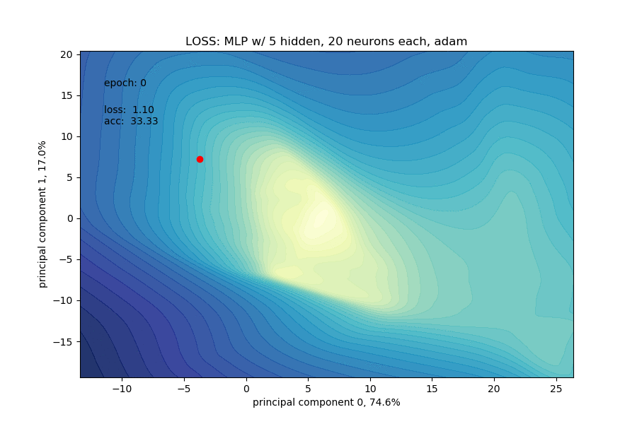
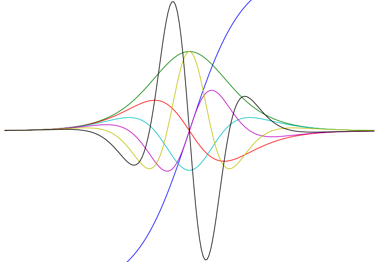
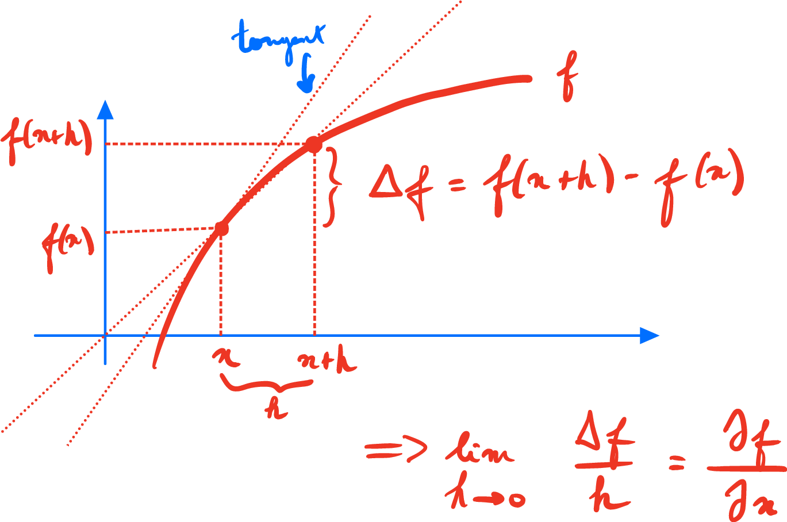
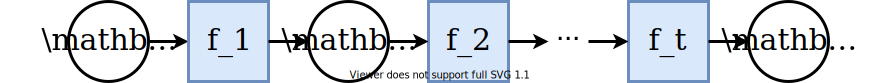
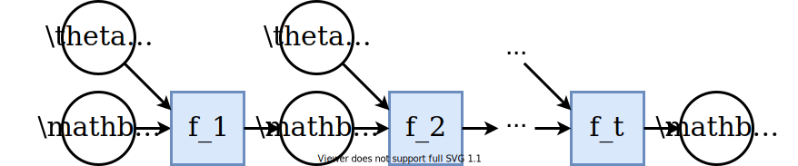
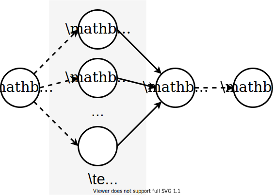
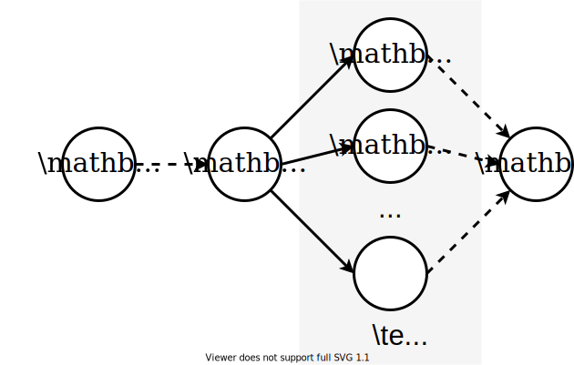
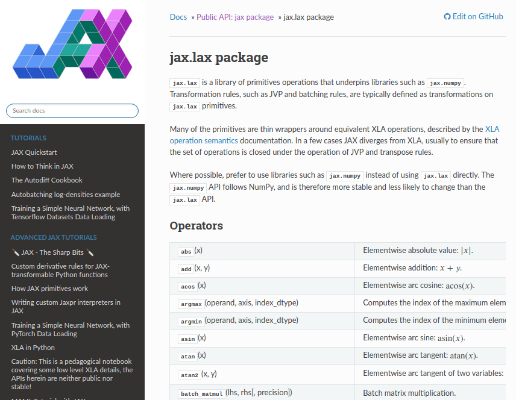
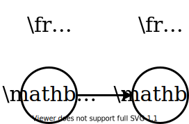

class: middle, center, title-slide

# Deep Learning

Lecture 3: Automatic differentiation

<br><br>
Prof. Gilles Louppe<br>
[g.louppe@uliege.be](mailto:g.louppe@uliege.be)

---

# Today

- Calculus
- Automatic differentiation
- Implementation
- Beyond neural networks

---

class: middle

.center.circle.width-30[]

.italic[Implementing backpropagation by hand is like programming in assembly language.
You will probably never do it, but it is important for having a mental model of how everything works.]

.pull-right[Roger Grosse]

---

class: middle

.center.width-60[]

## Motivation

- Gradient-based training algorithms are the workhose of deep learning.
- Deriving gradients by hand is tedious and error prone.
  This becomes quickly impractical for complex models.
- Changes to the model require rederiving the gradient.
  
<br>

.footnote[Image credits: [Visualizing optimization trajectory of neural nets](https://towardsdatascience.com/from-animation-to-intuition-visualizing-optimization-trajectory-in-neural-nets-726e43a08d85), Logan Yang, 2020.]

---

class: middle

## Automatic differentiation

Automatic differentiation (AD) provides a family of techniques for evaluating the **derivatives** of a function specified *by a computer program*.

- $\neq$ symbolic differentiation, which aims at identifying some human-readable expression of the derivative.
- $\neq$ numerical differentation (finite differences), which may introduce round-off errors.

---

class: middle

## Programs as differentiable functions

A program is defined as the composition of primitive operations that we know how to derive.

```python
import jax.numpy as jnp
from jax import grad

def predict(params, inputs):
    for W, b in params:
        outputs = jnp.dot(inputs, W) + b
        inputs = jnp.tanh(outputs)
    return outputs

def loss_fun(params, inputs, targets):
    preds = predict(params, inputs)
    return jnp.sum((preds - targets)**2)

grad_fun = grad(loss_fun)
```

---

class: middle

.center.width-60[]

Modern frameworks support higher-order derivatives.
```python
def tanh(x):
    y = jnp.exp(-2.0 * x)
    return (1.0 - y) / (1.0 + y)

fp = grad(tanh)
fpp = grad(grad(tanh))
...
```
---

class: middle

# Calculus

---

# Derivative

Let $f: \mathbb{R} \to \mathbb{R}$. 

The derivative of $f$ is
$$f'(x) = \frac{\partial f}{\partial x}(x) = \lim\_{h \to 0} \frac{f(x + h) - f(x)}{h},$$
where
- $f'(x)$ is the Lagrange notation,
- $\frac{\partial f}{\partial x}(x)$ is the Leibniz notation.

---

class: middle, center

.width-80[]

The derivative $\frac{\partial f(x)}{\partial x}$ of $f$ represents its instantaneous rate of change at $x$.

---

# Gradient

The gradient of $f : \mathbb{R}^n \to \mathbb{R}$ is
$$\nabla f(\mathbf{x}) = 
\begin{bmatrix}
\frac{\partial f}{\partial x\_1}(\mathbf{x}) \\\\
\\\\
\vdots \\\\
\\\\
\frac{\partial f}{\partial x\_n}(\mathbf{x})
\end{bmatrix} \in \mathbb{R}^n,$$
i.e., a vector that gathers the partial derivatives of $f$.

Applying the definition of the derivative coordinate-wise, we have
$$\left[ \nabla f(\mathbf{x}) \right]\_j = \frac{\partial f}{\partial x\_j}(\mathbf{x}) = \lim\_{h\to 0} \frac{f(\mathbf{x} + h\mathbf{e}\_j) - f(\mathbf{x})}{h},$$
where $\mathbf{e}\_j$ is the $j$-th basis vector.

---

# Jacobian

The Jacobian of $\mathbf{f} : \mathbb{R}^n \to \mathbb{R}^m$ is
$$\begin{aligned}
J\_\mathbf{f}(\mathbf{x}) = \frac{\partial \mathbf{f}}{\partial \mathbf{x}}(\mathbf{x}) &=
\begin{bmatrix}
\frac{\partial f\_1}{\partial x\_1}(\mathbf{x}) & \ldots & \frac{\partial f\_1}{\partial x\_n}(\mathbf{x})\\\\
\\\\
\vdots & & \vdots\\\\
\\\\
\frac{\partial f\_m}{\partial x\_1}(\mathbf{x}) & \ldots & \frac{\partial f\_m}{\partial x\_n}(\mathbf{x})
\end{bmatrix} \in \mathbb{R}^{m \times n} \\\\
&= \begin{bmatrix}
\frac{\partial \mathbf{f}}{\partial x\_1}(\mathbf{x}) & \ldots & \frac{\partial \mathbf{f}}{\partial x\_n}(\mathbf{x})
\end{bmatrix} \\\\
&= \begin{bmatrix}
\nabla f\_1(\mathbf{x})^T \\\\
\\\\
\vdots \\\\
\\\\
\nabla f\_m(\mathbf{x})^T 
\end{bmatrix} \\\\
\end{aligned}$$

The gradient's transpose is thus a wide Jacobian ($m=1$).

---

class: middle

# Automatic differentiation

---

# Chain composition

<br>

.center.width-100[]

<br>

Let us assume a function $\mathbf{f} : \mathbb{R}^n \to \mathbb{R}^m$ that decomposes as a chain composition
$$\mathbf{f} = \mathbf{f}\_t \circ \mathbf{f}\_{t-1} \circ \ldots \circ \mathbf{f}\_1,$$
for functions $\mathbf{f}\_k : \mathbb{R}^{n\_{k-1}} \times \mathbb{R}^{n\_k}$, for $k=1, \ldots, t$.

---

class: middle

By the **chain rule**, 
$$\frac{\partial \mathbf{x}\_t}{\partial \mathbf{x}\_0} = \frac{\partial \mathbf{x}\_t}{\partial \mathbf{x}\_{t-1}} \frac{\partial \mathbf{x}\_{t-1}}{\partial \mathbf{x}\_{t-2}} \ldots \frac{\partial \mathbf{x}\_2}{\partial \mathbf{x}\_1} \frac{\partial \mathbf{x}\_1}{\partial \mathbf{x}\_0}.$$

---

class: middle

## Forward accumulation

$$\frac{\partial \mathbf{x}\_t}{\partial \mathbf{x}\_0} = \frac{\partial \mathbf{x}\_t}{\partial \mathbf{x}\_{t-1}} \left( \frac{\partial \mathbf{x}\_{t-1}}{\partial \mathbf{x}\_{t-2}} \left( \ldots \left( \frac{\partial \mathbf{x}\_2}{\partial \mathbf{x}\_1} \frac{\partial \mathbf{x}\_1}{\partial \mathbf{x}\_0}\right) \ldots \right)\right)$$


## Reverse accumulation

$$\frac{\partial \mathbf{x}\_t}{\partial \mathbf{x}\_0} = \left(\left( \ldots \left( \frac{\partial \mathbf{x}\_t}{\partial \mathbf{x}\_{t-1}} \frac{\partial \mathbf{x}\_{t-1}}{\partial \mathbf{x}\_{t-2}} \right) \ldots \right) \frac{\partial \mathbf{x}\_2}{\partial \mathbf{x}\_1} \right) \frac{\partial \mathbf{x}\_1}{\partial \mathbf{x}\_0}$$

---

class: middle

## Complexity

The complexity of the forward and backward accumulations are
$$n\_0 \sum\_{k=1}^{t-1} n\_k n\_{k+1} \quad \text{and} \quad n\_t \sum\_{k=0}^{t-2} n\_k n\_{k+1}.$$

(Prove it!)

<br>
.success[If $n\_t  \ll n\_0$ (which is typical in deep learning), then .bold[backward accumulation is cheaper]. And vice-versa.]

???

Prove it.

---

# Multi-layer perceptron

Chain compositions can be generalized to feedforward neural networks of the form
$$\mathbf{x}\_k = \mathbf{f}\_k(\mathbf{x}\_{k-1}, \theta\_{k-1})$$
for $k=1, \ldots, t$, and where $\theta\_{k-1}$ are vectors of parameters and $\mathbf{x}\_0 \in \mathbb{R}^{n\_0}$ is given.

<br><br>
.center.width-100[]

---

class: middle, center

(whiteboard example)

---

# AD on computer programs

Let $\mathbf{f}(\mathbf{x}\_1, \ldots, \mathbf{x}\_s)$ denote a generic function where
- $\mathbf{x}\_1, \ldots, \mathbf{x}\_s$ are the input variables,
- $f(\mathbf{x}\_1, \ldots, \mathbf{x}\_s)$ is implemented by a computer program producing intermediate variables $(\mathbf{x}\_{s+1}, \ldots, \mathbf{x}\_t)$,
- $t$ is the total number of variables, with $\mathbf{x}\_t$ denoting the output variable,
- $\mathbf{x}\_k \in \mathbb{R}^{n\_k}$, for $k=1, \ldots, t$.

The goal is to compute the Jacobians $\frac{\partial \mathbf{f}}{\partial \mathbf{x}\_k} \in \mathbb{R}^{n\_t \times n\_k}$, for $k=1, \ldots, s$.

---

class: middle

## Computer programs as computational graphs

A numerical algorithm is a succession of instructions of the form
$$\forall k = s+1, \ldots, t, \quad \mathbf{x}\_k = \mathbf{f}\_k(\mathbf{x}\_1, \ldots, \mathbf{x}\_{k-1})$$
where $\mathbf{f}\_k$ is a function which only depends on the previous variables.

---

class: middle

.center.width-100[]

This computation can represented by a **directed acyclic graph** where 
- nodes are the variables $\mathbf{x}\_k$,
- an edge connects $x\_i$ to $x\_k$ if $x\_i$ is an argument of $\mathbf{f}\_k$.

The evaluation of $\mathbf{x}\_t = \mathbf{f}(\mathbf{x}\_1, \ldots, \mathbf{x}\_s)$ thus corresponds to a forward traversal of this graph.

---

# Forward mode

The *forward mode* of automatic differentiation consists in computing $$\frac{\partial \mathbf{x}\_k}{\partial \mathbf{x}\_1} \in \mathbb{R}^{n\_k \times n\_1}$$ for all variables $\mathbf{x}\_k$, iteratively from $k=s+1$ to $k=t$. 

## Initialization 

Set the Jacobians of the input nodes with
$$
\begin{aligned}
\frac{\partial \mathbf{x}\_1}{\partial \mathbf{x}\_1} &= 1\_{n\_1 \times n\_1} \\\\
\frac{\partial \mathbf{x}\_2}{\partial \mathbf{x}\_1} &= 0\_{n\_2 \times n\_1} \\\\
\ldots \\\\
\frac{\partial \mathbf{x}\_s}{\partial \mathbf{x}\_1} &= 0\_{n\_s \times n\_1}
\end{aligned}
$$

---

class: middle


## Forward recursive update

For all $k=s+1, \ldots, t$,
$$\frac{\partial \mathbf{x}\_k}{\partial \mathbf{x}\_1} = \sum\_{l \in \text{parents}(k)}\left[ \frac{\partial \mathbf{x}\_k}{\partial \mathbf{x}\_l} \right] \times \frac{\partial \mathbf{x}\_l}{\partial \mathbf{x}\_1},$$
.grid[
.kol-2-5[
where 
- $\left[ \frac{\partial \mathbf{x}\_k}{\partial \mathbf{x}\_l} \right]$ denotes the on-the-fly computation of the Jacobian locally associated to the primitive $\mathbf{f}\_k$,
- $\frac{\partial \mathbf{x}\_l}{\partial \mathbf{x}\_1}$ is obtained from the previous iterations (in topological order).
]
.kol-3-5[<br>.width-100[]]
]

---

class: middle, center

(whiteboard example)

---

class: middle

.alert[Forward mode automatic differentiation needs to be repeated for $k=1, \ldots, s$. For a large $s$, this is prohibitive.]

---

# Backward mode

Instead evaluating the Jacobians $\frac{\partial \mathbf{x}\_k}{\partial \mathbf{x}\_1} \in \mathbb{R}^{n\_k \times n\_1}$ for $k=s+1, \ldots, t$, the **reverse mode** of automatic differentation consists in computing
$$\frac{\partial \mathbf{x}\_t}{\partial \mathbf{x}\_k} \in \mathbb{R}^{n\_t \times n\_k}$$
recursively from $k=t$ down to $k=1$.

## Initialization 

Set the Jacobian of the out node to
$$\frac{\partial \mathbf{x}\_t}{\partial \mathbf{x}\_t} = 1\_{n\_t \times n\_t}.$$

---

class: middle

## Backward recursive update

For all $k=t-1, \ldots, 1$,
$$\frac{\partial \mathbf{x}\_t}{\partial \mathbf{x}\_k} = \sum\_{m \in \text{children}(k)} \frac{\partial \mathbf{x}\_t}{\partial \mathbf{x}\_m} \times \left[ \frac{\partial \mathbf{x}\_m}{\partial \mathbf{x}\_k} \right]$$
.grid[
.kol-2-5[
where
- $\frac{\partial \mathbf{x}\_t}{\partial \mathbf{x}\_m}$ is obtained from previous iterations (in reverse topological order),
- $\left[ \frac{\partial \mathbf{x}\_m}{\partial \mathbf{x}\_k} \right]$ denotes the on-the-fly computation of the Jacobian locally associated to the primitive $\mathbf{f}\_m$.
]
.kol-3-5[<br>.center.width-100[]]
]

---

class: middle, center

(whiteboard example)

---

class: middle

.success[The advantage of backward mode automatic differentiation is that a single traversal of the graph allows to compute all $\frac{\partial \mathbf{x}\_t}{\partial \mathbf{x}\_k}$.]

---

class: middle

# Implementations

---

class: middle

.center[
.width-50[]

.width-50[]

.width-30[]
]

---

class: middle

## Primitives

Most automatically-differentiable frameworks are defined by a collection of composable of *primitive* operations.

.center.width-80[]

---

class: middle

## Composing primitives

Primitive functions are composed together into a graph that describes the computation.
The computational graph is either built 
- *ahead of time*, using a dedicated API (e.g., Tensorflow 1), or
- **just in time**, by tracing the program execution (e.g., Tensorflow Eager, JAX, PyTorch).

---

class: middle

```python
import jax.numpy as jnp
from jax import grad

def add(a, b):
    return a + b

a = jnp.array([1, 2, 3])
b = jnp.array([4, 5, 6])
print(grad(add)(a, b))
```

---

class: middle

.center.width-35[]
## VJPs

In the backward recursive update, in the situation above, we have when $\mathbf{x}\_t \in \mathbb{R}$
$$\frac{\partial \mathbf{x}\_t}{\partial \mathbf{x}\_k} = \underbrace{\frac{\partial \mathbf{x}\_t}{\partial \mathbf{x}\_m}}\_{1 \times n\_m} \underbrace{\left[ \frac{\partial \mathbf{x}\_m}{\partial \mathbf{x}\_k} \right]}\_{n\_m \times n\_k}$$

- That is, the primitive only needs to define its **vector-Jacobian product** (VJP).
- Reverse mode AD actually composes JVPs backward to obtain the derivatives.
- The Jacobian $\left[ \frac{\partial \mathbf{x}\_m}{\partial \mathbf{x}\_k} \right]$ is never explicitly built. It is usually simpler and more efficient to compute the JVP directly.

---

class: middle

## Higher-order derivatives

```python
def tanh(x):
    y = jnp.exp(-2.0 * x)
    return (1.0 - y) / (1.0 + y)

fp = grad(tanh)
fpp = grad(grad(tanh))    # what sorcery is this?!
...
``` 

<br>

.center[The backward pass can itself be traced... <br>and reverse mode AD run on its computational graph!]

---

class: middle, center

(demo)

---

class: middle

# AD beyond neural networks

---

deriving through simulation

---

gradient-based hyper-opt

---

# Summary

---

class: end-slide, center
count: false

The end.

---

count: false

# References

Slides from this lecture have been largely adapted from:
- Mathieu Blondel, [Automatic differentiation](https://mblondel.org/teaching/autodiff-2020.pdf), 2020.
- Gabriel Peyré, [Course notes on Optimization for Machine Learning](https://mathematical-tours.github.io/book-sources/optim-ml/OptimML.pdf), 2020.