class: middle, center, title-slide

# Deep Learning

Lecture 3: Convolutional networks

<br><br>
Prof. Gilles Louppe<br>
[g.louppe@uliege.be](mailto:g.louppe@uliege.be)

---

# Today

How to **make neural networks see**?

- A little history
- Convolutions
- Pooling
- Convolutional networks
- Under the hood

---

class: middle

# A little history

---

class: middle

## Visual perception (Hubel and Wiesel, 1959-1962)

- David Hubel and Torsten Wiesel discover the neural basis of **visual perception**.
- Awarded the Nobel Prize of Medicine in 1981 for their discovery.

.grid.center[
.kol-4-5.center[.width-80[]]
.kol-1-5[<br>.width-100.circle[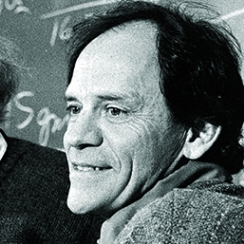].width-100.circle[]]
]

---

class: middle, black-slide

.center[

<iframe width="640" height="480" src="https://www.youtube.com/embed/IOHayh06LJ4?&loop=1&start=0" frameborder="0" volume="0" allowfullscreen></iframe>

]

.center[Hubel and Wiesel]

---

class: middle, black-slide

.center[

<iframe width="640" height="480" src="https://www.youtube.com/embed/y_l4kQ5wjiw?&loop=1&start=97" frameborder="0" volume="0" allowfullscreen></iframe>

]

.center[Hubel and Wiesel]

???

During their recordings, they noticed a few interesting things:
1. the neurons fired only when the line was in a particular place on the retina,
2. the activity of these neurons changed depending on the orientation of the line, and
3. sometimes the neurons fired only when the line was moving in a particular direction.

---

class: middle

.width-100.center[]

.footnote[Credits: Hubel and Wiesel, [Receptive fields, binocular interaction and functional architecture in the cat's visual cortex](https://www.ncbi.nlm.nih.gov/pmc/articles/PMC1359523/), 1962.]

---

class: middle

.width-100.center[]

.footnote[Credits: Hubel and Wiesel, [Receptive fields, binocular interaction and functional architecture in the cat's visual cortex](https://www.ncbi.nlm.nih.gov/pmc/articles/PMC1359523/), 1962.]

---

class: middle

## The Mark-1 Perceptron (Rosenblatt, 1957-61)

.center.width-80[]

- Rosenblatt builds the first implementation of a neural network.
- The network is an anlogic circuit. Parameters are potentiometers.
  
.footnote[Credits: Frank Rosenblatt, [Principle of Neurodynamics](http://www.dtic.mil/dtic/tr/fulltext/u2/256582.pdf), 1961.]

???


---

class: middle

.center.width-60[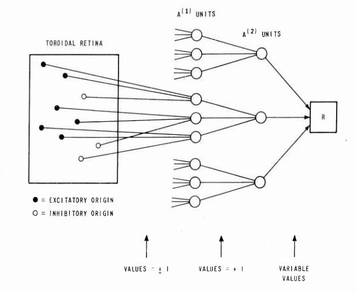]

.italic["If we show the perceptron a stimulus, say a square, and associate a response to that square, this response will immediately **generalize perfectly to all
transforms** of the square under the transformation group [...]."]

.footnote[Credits: Frank Rosenblatt, [Principle of Neurodynamics](http://www.dtic.mil/dtic/tr/fulltext/u2/256582.pdf), 1961.]

???


This is quite similar to Hubel and Wiesel's simple and complex cells!

---

class: middle


## AI winter (Minsky and Papert, 1969+)

- Minsky and Papert prove a series of impossibility results for the perceptron (or rather, a narrowly defined variant thereof).
- **AI winter** follows.

.center[.width-80[] .width-20[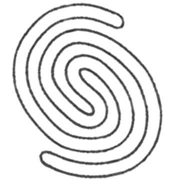]]

.footnote[Credits: Minsky and Papert, Perceptrons: an Introduction to Computational Geometry, 1969.]

---

class: middle

.center.width-40[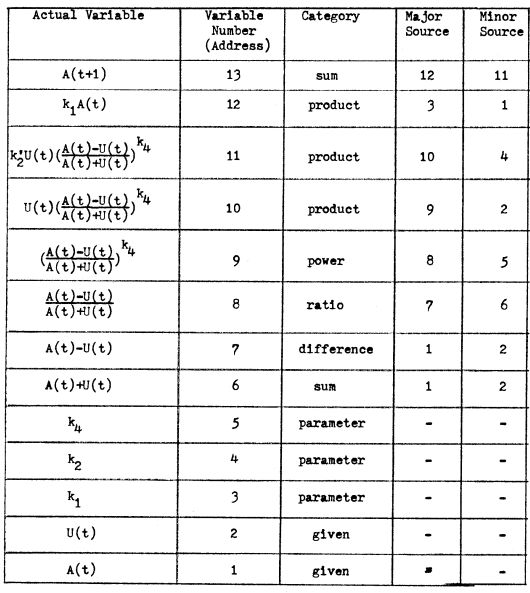]

## Automatic differentiation (Werbos, 1974)

- Werbos formulate an arbitrary function as a computational graph.
- Symbolic derivatives are computed by dynamic programming.

.footnote[Credits: Paul Werbos, Beyond regression: new tools for prediction and analysis in the behavioral sciences, 1974.]

---

class: middle

## Neocognitron (Fukushima, 1980)

.center.width-90[]

Fukushima proposes a direct neural network implementation of the hierarchy model of the visual nervous system of Hubel and Wiesel.

.footnote[Credits: Kunihiko Fukushima, [Neocognitron: A Self-organizing Neural Network Model](https://www.rctn.org/bruno/public/papers/Fukushima1980.pdf), 1980.]

---

class: middle

.grid[
.kol-1-3.center[.width-100[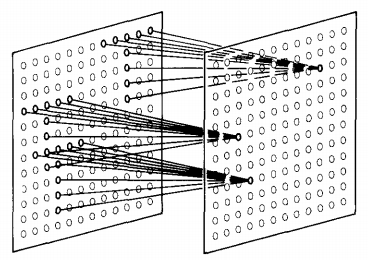]
Convolutions]
.kol-2-3.center[.width-100[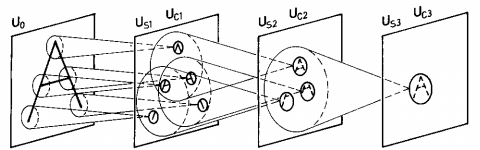]
Feature hierarchy]
]

.footnote[Credits: Kunihiko Fukushima, [Neocognitron: A Self-organizing Neural Network Model](https://www.rctn.org/bruno/public/papers/Fukushima1980.pdf), 1980.]

???

- Built upon **convolutions** and enables the composition of a *feature hierarchy*.
- Biologically-inspired training algorithm, which proves to be largely **inefficient**.

---

class: middle

## Backpropagation (Rumelhart et al, 1986)

.grid[
.kol-1-2[
- Rumelhart and Hinton introduce **backpropagation** in multi-layer networks with sigmoid non-linearities and sum of squares loss function.
- They advocate for batch gradient descent in supervised learning.
- Discuss online gradient descent, momentum and random initialization.
- Depart from *biologically plausible* training algorithms.
]
.kol-1-2[
.center.width-100[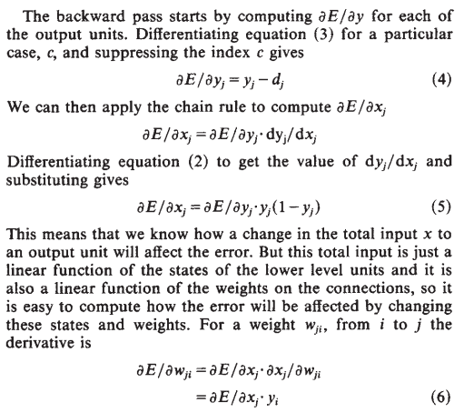]
]
]


.footnote[Credits: Rumelhart et al, [Learning representations by back-propagating errors](http://www.cs.toronto.edu/~hinton/absps/naturebp.pdf), 1986.]

---

class: middle

## Convolutional networks (LeCun, 1990)

- LeCun trains a convolutional network by backpropagation.
- He advocates for end-to-end feature learning in image classification.

.center.width-70[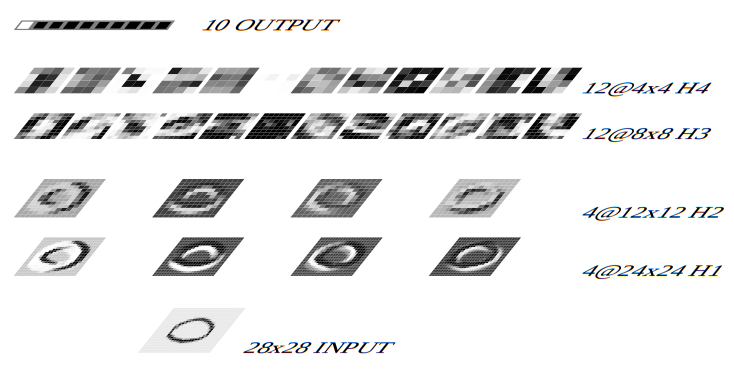]

.footnote[Credits: LeCun et al, [Handwritten Digit Recognition with a Back-Propagation Network](http://yann.lecun.com/exdb/publis/pdf/lecun-90c.pdf), 1990.]

---

class: middle, black-slide

.center[

<iframe width="640" height="480" src="https://www.youtube.com/embed/FwFduRA_L6Q?&loop=1&start=0" frameborder="0" volume="0" allowfullscreen></iframe>

]

.center[LeNet-1 (LeCun et al, 1993)]

---

class: middle

## AlexNet (Krizhevsky et al, 2012)

- Krizhevsky trains a convolutional network on ImageNet with two GPUs.
- 16.4% top-5 error on ILSVRC'12, outperforming all other entries by 10% or more.
- This event triggers the deep learning revolution.

.center.width-100[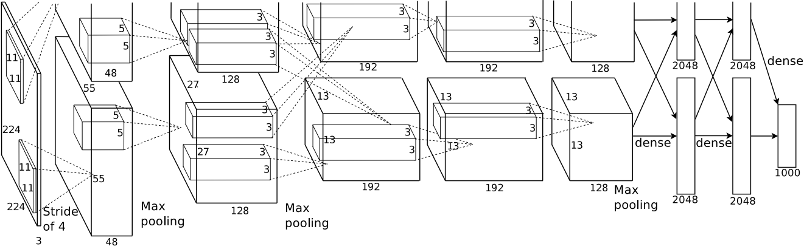]

---

class: middle

# Convolutions

---

class: middle

If they were handled as normal "unstructured" vectors, high-dimensional signals such as sound samples or images would require models of intractable size.

E.g., a linear layer taking $256\times 256$ RGB images as input and producing an image of same size would require
$$(256 \times 256 \times 3)^2 \approx 3.87e+10$$
parameters, with the corresponding memory footprint (150Gb!), and excess of capacity.

.footnote[Credits: Francois Fleuret, [EE559 Deep Learning](https://fleuret.org/ee559/), EPFL.]

---

class: middle

This requirement is also inconsistent with the intuition that such large signals have some "invariance in translation". .bold[A representation meaningful at a certain location can / should be used everywhere].

A convolution layer embodies this idea. It applies the same linear transformation locally everywhere while preserving the signal structure.

.footnote[Credits: Francois Fleuret, [EE559 Deep Learning](https://fleuret.org/ee559/), EPFL.]

---

class: middle

.center[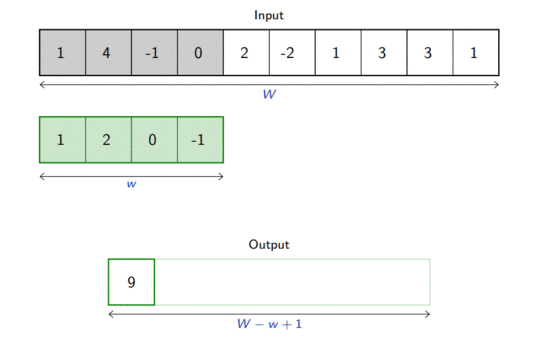]

.footnote[Credits: Francois Fleuret, [EE559 Deep Learning](https://fleuret.org/ee559/), EPFL.]

---

# Convolutions

For one-dimensional tensors, given an input vector $\mathbf{x} \in \mathbb{R}^W$ and a convolutional kernel $\mathbf{u} \in \mathbb{R}^w$,
the discrete **convolution** $\mathbf{x} \circledast \mathbf{u}$ is a vector of size $W - w + 1$ such that
$$\begin{aligned}
(\mathbf{x} \circledast \mathbf{u})[i] &= \sum\_{m=0}^{w-1} x\_{m+i}  u\_m .
\end{aligned}
$$

## Note
Technically, $\circledast$ denotes the cross-correlation operator.
However, most machine learning libraries call it convolution.

---

class: middle 

Convolutions can implement differential operators:
$$(0,0,0,0,1,2,3,4,4,4,4) \circledast (-1,1) = (0,0,0,1,1,1,1,0,0,0) $$
.center.width-100[]
or crude template matchers:
.center.width-100[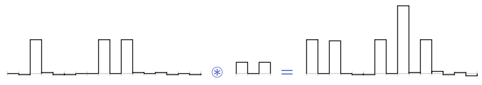]

.footnote[Credits: Francois Fleuret, [EE559 Deep Learning](https://fleuret.org/ee559/), EPFL.]


---

class: middle

Convolutions generalize to multi-dimensional tensors:
- In its most usual form, a convolution takes as input a 3D tensor $\mathbf{x} \in \mathbb{R}^{C \times H \times W}$, called the **input feature map**.
- A kernel $\mathbf{u} \in \mathbb{R}^{C \times h \times w}$ slides across the input feature map, along its height and width. The size $h \times w$ is the size of the *receptive field*.
- At each location,  the element-wise product between the kernel and the input elements it overlaps is computed and the results are summed up.

---

class: middle

.center[]

.footnote[Credits: Francois Fleuret, [EE559 Deep Learning](https://fleuret.org/ee559/), EPFL.]

---

class: middle

- The final output $\mathbf{o}$ is a 2D tensor of size $(H-h+1) \times (W-w+1)$ called the **output feature map** and such that:
$$\begin{aligned}
\mathbf{o}\_{j,i} &= \mathbf{b}\_{j,i} + \sum\_{c=0}^{C-1} (\mathbf{x}\_c \circledast \mathbf{u}\_c)[j,i] = \mathbf{b}\_{j,i} + \sum\_{c=0}^{C-1}  \sum\_{n=0}^{h-1} \sum\_{m=0}^{w-1}    \mathbf{x}\_{c,n+j,m+i} \mathbf{u}\_{c,n,m}
\end{aligned}$$
where $\mathbf{u}$ and $\mathbf{b}$ are shared parameters to learn.
- $D$ convolutions can be applied in the same way to produce a $D \times (H-h+1) \times (W-w+1)$ feature map,
where $D$ is the depth.
- Swiping across channels with a 3D convolution usually makes no sense, unless the channel index has some metric mearning.

---

class: middle

Convolutions have three additional parameters:
- The *padding* specifies the size of a zeroed frame added arount the input.
- The **stride** specifies a step size when moving the kernel across the signal.
- The *dilation* modulates the expansion of the filter without adding weights.

.footnote[Credits: Francois Fleuret, [EE559 Deep Learning](https://fleuret.org/ee559/), EPFL.]

---

class: middle

## Padding

Padding is useful to control the spatial dimension of the feature map, for example to keep it constant across layers.

.center[
.width-45[]
.width-45[]
]

.footnote[Credits: Dumoulin and Visin, [A guide to convolution arithmetic for deep learning](https://arxiv.org/abs/1603.07285), 2016.]

---

class: middle

## Strides

Stride is useful to reduce the spatial dimension of the feature map by a constant factor.

.center[
.width-45[]
]


.footnote[Credits: Dumoulin and Visin, [A guide to convolution arithmetic for deep learning](https://arxiv.org/abs/1603.07285), 2016.]


---

class: middle 

## Dilation

The dilation modulates the expansion of the kernel support by adding rows and columns of zeros between coefficients. 

Having a dilation coefficient greater than one increases the units receptive field size without increasing the number of parameters. 

.center[
.width-45[]
]

.footnote[Credits: Dumoulin and Visin, [A guide to convolution arithmetic for deep learning](https://arxiv.org/abs/1603.07285), 2016.]

---

# Equivariance

A function $f$ is **equivariant** to $g$ if $f(g(\mathbf{x})) = g(f(\mathbf{x}))$.
- Parameter sharing used in a convolutional layer causes the layer to be equivariant to translation.
- That is, if $g$ is any function that translates the input, the convolution function is equivariant to $g$.

.center.width-50[]

.caption[If an object moves in the input image, its representation will move the same amount in the output.]

.footnote[Credits: LeCun et al, Gradient-based learning applied to document recognition, 1998.]

---

class: middle

- Equivariance is useful when we know some local function is useful everywhere (e.g., edge detectors).
- Convolution is not equivariant to other operations such as change in scale or rotation.

---

# Convolutions as matrix multiplications

As a guiding example, let us consider the convolution of single-channel tensors $\mathbf{x} \in \mathbb{R}^{4 \times 4}$ and $\mathbf{u} \in \mathbb{R}^{3 \times 3}$:

$$
\mathbf{x} \circledast \mathbf{u} =
\begin{pmatrix}
4 & 5 & 8 & 7 \\\\
1 & 8 & 8 & 8 \\\\
3 & 6 & 6 & 4 \\\\
6 & 5 & 7 & 8
\end{pmatrix} \circledast \begin{pmatrix}
1 & 4 & 1 \\\\
1 & 4 & 3 \\\\
3 & 3 & 1
\end{pmatrix} =
\begin{pmatrix}
122 & 148 \\\\
126 & 134
\end{pmatrix}$$

---

class: middle

The convolution operation can be equivalently re-expressed as a single matrix multiplication:
- the convolutional kernel $\mathbf{u}$ is rearranged as a **sparse Toeplitz circulant matrix**, called the convolution matrix:
$$\mathbf{U} = \begin{pmatrix}
1 & 4 & 1 & 0 & 1 & 4 & 3 & 0 & 3 & 3 & 1 & 0 & 0 & 0 & 0 & 0 \\\\
0 & 1 & 4 & 1 & 0 & 1 & 4 & 3 & 0 & 3 & 3 & 1 & 0 & 0 & 0 & 0 \\\\
0 & 0 & 0 & 0 & 1 & 4 & 1 & 0 & 1 & 4 & 3 & 0 & 3 & 3 & 1 & 0 \\\\
0 & 0 & 0 & 0 & 0 & 1 & 4 & 1 & 0 & 1 & 4 & 3 & 0 & 3 & 3 & 1
\end{pmatrix}$$
- the input $\mathbf{x}$ is flattened row by row, from top to bottom:
$$v(\mathbf{x}) =
\begin{pmatrix}
4 & 5 & 8 & 7 & 1 & 8 & 8 & 8 & 3 & 6 & 6 & 4 & 6 & 5 & 7 & 8
\end{pmatrix}^T$$

Then,
$$\mathbf{U}v(\mathbf{x}) =
\begin{pmatrix}
122 & 148 & 126 & 134
\end{pmatrix}^T$$
which we can reshape to a $2 \times 2$ matrix to obtain $\mathbf{x} \circledast \mathbf{u}$.

---

class: middle

The same procedure generalizes to $\mathbf{x} \in \mathbb{R}^{H \times W}$ and convolutional kernel $\mathbf{u} \in \mathbb{R}^{h \times w}$, such that:
- the convolutional kernel is rearranged as a sparse Toeplitz circulant matrix $\mathbf{U}$ of shape $(H-h+1)(W-w+1) \times HW$ where
    - each row $i$ identifies an element of the output feature map,
    - each column $j$ identifies an element of the input feature map,
    - the value $\mathbf{U}\_{i,j}$ corresponds to the kernel value the element $j$ is multiplied with in output $i$;
- the input $\mathbf{x}$ is flattened into a column vector $v(\mathbf{x})$ of shape $HW \times 1$;
- the output feature map $\mathbf{x} \circledast \mathbf{u}$ is obtained by reshaping the $(H-h+1)(W-w+1) \times 1$ column vector $\mathbf{U}v(\mathbf{x})$ as a $(H-h+1) \times (W-w+1)$ matrix.

Therefore, a convolutional layer is a special case of a fully
connected layer: $$\mathbf{h} = \mathbf{x} \circledast \mathbf{u} \Leftrightarrow v(\mathbf{h}) = \mathbf{U}v(\mathbf{x}) \Leftrightarrow  v(\mathbf{h}) = \mathbf{W}^T v(\mathbf{x})$$

---

class: middle, center

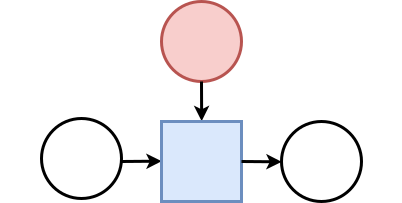

$$\Leftrightarrow$$


---

class: middle 

# Pooling 

---

class: middle

When the input volume is large, **pooling layers** can be used to reduce the input dimension while
preserving its global structure, in a way similar to a down-scaling operation.

---

# Pooling

Consider a pooling area of size $h \times w$ and a 3D input tensor $\mathbf{x} \in \mathbb{R}^{C\times(rh)\times(sw)}$.
- Max-pooling produces a tensor $\mathbf{o} \in \mathbb{R}^{C \times r \times s}$
such that
$$\mathbf{o}\_{c,j,i} = \max\_{n < h, m < w} \mathbf{x}_{c,rj+n,si+m}.$$
- Average pooling produces a tensor $\mathbf{o} \in \mathbb{R}^{C \times r \times s}$ such that
$$\mathbf{o}\_{c,j,i} = \frac{1}{hw} \sum\_{n=0}^{h-1} \sum\_{m=0}^{w-1} \mathbf{x}_{c,rj+n,si+m}.$$

Pooling is very similar in its formulation to convolution.

---

class: middle

.center[]

.footnote[Credits: Francois Fleuret, [EE559 Deep Learning](https://fleuret.org/ee559/), EPFL.]

---

# Invariance

A function $f$ is **invariant** to $g$ if $f(g(\mathbf{x})) = f(\mathbf{x})$.
- Pooling layers provide invariance to any permutation inside one cell.
- It results in (pseudo-)invariance to local translations.
- This helpful if we care more about the presence of a pattern rather than its exact position.

.center.width-60[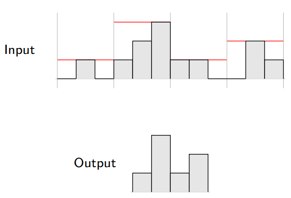]

.footnote[Credits: Francois Fleuret, [EE559 Deep Learning](https://fleuret.org/ee559/), EPFL.]

---

class: middle

# Convolutional networks

---

class: middle

A **convolutional network** is generically defined as a composition of convolutional layers ($\texttt{CONV}$), pooling layers ($\texttt{POOL}$), linear rectifiers ($\texttt{RELU}$) and fully connected layers ($\texttt{FC}$).

.center.width-100[]

---

class: middle

The most common convolutional network architecture follows the pattern:

$$\texttt{INPUT} \to [[\texttt{CONV} \to \texttt{RELU}]\texttt{\*}N \to \texttt{POOL?}]\texttt{\*}M \to [\texttt{FC} \to \texttt{RELU}]\texttt{\*}K \to \texttt{FC}$$

where:
- $\texttt{\*}$ indicates repetition;
- $\texttt{POOL?}$ indicates an optional pooling layer;
- $N \geq 0$ (and usually $N \leq 3$), $M \geq 0$, $K \geq 0$ (and usually $K < 3$);
- the last fully connected layer holds the output (e.g., the class scores).

---

class: middle

Some common architectures for convolutional networks following this pattern include:
- $\texttt{INPUT} \to \texttt{FC}$, which implements a linear classifier ($N=M=K=0$).
- $\texttt{INPUT} \to [\texttt{FC} \to \texttt{RELU}]{\*K} \to \texttt{FC}$, which implements a $K$-layer MLP.
- $\texttt{INPUT} \to \texttt{CONV} \to \texttt{RELU} \to \texttt{FC}$.
- $\texttt{INPUT} \to [\texttt{CONV} \to \texttt{RELU} \to \texttt{POOL}]\texttt{\*2} \to \texttt{FC} \to \texttt{RELU} \to \texttt{FC}$.
- $\texttt{INPUT} \to [[\texttt{CONV} \to \texttt{RELU}]\texttt{\*2} \to \texttt{POOL}]\texttt{\*3} \to [\texttt{FC} \to \texttt{RELU}]\texttt{\*2} \to \texttt{FC}$.

???

Note that for the last architecture, two $\texttt{CONV}$ layers are stacked before every $\texttt{POOL}$ layer. This is generally a good idea for larger and deeper networks, because multiple stacked $\texttt{CONV}$  layers can develop more complex features of the input volume before the destructive pooling operation.

---

class: center, middle, black-slide

.width-100[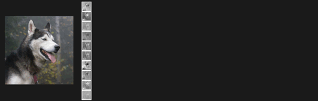]

---

class: middle

## LeNet-5 (LeCun et al, 1998)

Composition of two $\texttt{CONV}+\texttt{POOL}$ layers, followed by a block of fully-connected layers.

.center.width-110[]

.footnote[Credits: [Dive Into Deep Learning](https://d2l.ai/), 2020.]

---

class: middle

.smaller-x.center[
```
----------------------------------------------------------------
        Layer (type)               Output Shape         Param #
================================================================
            Conv2d-1            [-1, 6, 28, 28]             156
              ReLU-2            [-1, 6, 28, 28]               0
         MaxPool2d-3            [-1, 6, 14, 14]               0
            Conv2d-4           [-1, 16, 10, 10]           2,416
              ReLU-5           [-1, 16, 10, 10]               0
         MaxPool2d-6             [-1, 16, 5, 5]               0
            Conv2d-7            [-1, 120, 1, 1]          48,120
              ReLU-8            [-1, 120, 1, 1]               0
            Linear-9                   [-1, 84]          10,164
             ReLU-10                   [-1, 84]               0
           Linear-11                   [-1, 10]             850
       LogSoftmax-12                   [-1, 10]               0
================================================================
Total params: 61,706                                            
Trainable params: 61,706                                        
Non-trainable params: 0                                         
----------------------------------------------------------------
Input size (MB): 0.00                                           
Forward/backward pass size (MB): 0.11                           
Params size (MB): 0.24                                          
Estimated Total Size (MB): 0.35                                 
----------------------------------------------------------------
```
]

---

class: middle

.grid[
.kol-3-5[
<br><br><br><br>

## AlexNet (Krizhevsky et al, 2012)

Composition of a 8-layer convolutional neural network with a 3-layer MLP.

The original implementation was made of two parts such that it could fit within two GPUs.
]
.kol-2-5.center[.width-100[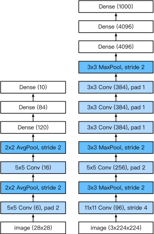]
.caption[LeNet vs. AlexNet]
]
]


.footnote[Credits: [Dive Into Deep Learning](https://d2l.ai/), 2020.]

---

class: middle

.smaller-x.center[
```
----------------------------------------------------------------
        Layer (type)               Output Shape         Param #
================================================================
            Conv2d-1           [-1, 64, 55, 55]          23,296
              ReLU-2           [-1, 64, 55, 55]               0
         MaxPool2d-3           [-1, 64, 27, 27]               0
            Conv2d-4          [-1, 192, 27, 27]         307,392
              ReLU-5          [-1, 192, 27, 27]               0
         MaxPool2d-6          [-1, 192, 13, 13]               0
            Conv2d-7          [-1, 384, 13, 13]         663,936
              ReLU-8          [-1, 384, 13, 13]               0
            Conv2d-9          [-1, 256, 13, 13]         884,992
             ReLU-10          [-1, 256, 13, 13]               0
           Conv2d-11          [-1, 256, 13, 13]         590,080
             ReLU-12          [-1, 256, 13, 13]               0
        MaxPool2d-13            [-1, 256, 6, 6]               0
          Dropout-14                 [-1, 9216]               0
           Linear-15                 [-1, 4096]      37,752,832
             ReLU-16                 [-1, 4096]               0
          Dropout-17                 [-1, 4096]               0
           Linear-18                 [-1, 4096]      16,781,312
             ReLU-19                 [-1, 4096]               0
           Linear-20                 [-1, 1000]       4,097,000
================================================================
Total params: 61,100,840                                        
Trainable params: 61,100,840                                    
Non-trainable params: 0                                         
----------------------------------------------------------------
Input size (MB): 0.57                                           
Forward/backward pass size (MB): 8.31                           
Params size (MB): 233.08                                        
Estimated Total Size (MB): 241.96                               
----------------------------------------------------------------
```
]

---

class: middle

.grid[
.kol-2-5[
  <br>

## VGG (Simonyan and Zisserman, 2014)

Composition of 5 VGG blocks consisting of $\texttt{CONV}+\texttt{POOL}$ layers, followed by a block of fully connected layers.

The network depth increased up to 19 layers, while the kernel sizes reduced to 3.
]
.kol-3-5.center[.width-100[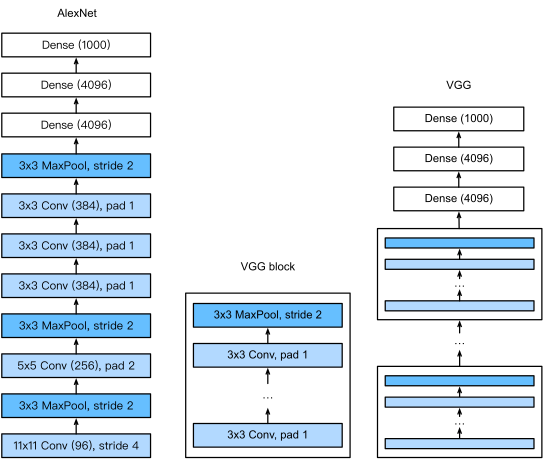]
.caption[AlexNet vs. VGG]
]
]

.footnote[Credits: [Dive Into Deep Learning](https://d2l.ai/), 2020.]

---

class: middle

.center.width-60[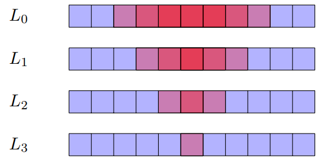]

The **effective receptive field** is the part of the visual input that affects a given unit indirectly through previous convolutional layers. It grows linearly with depth. 

E.g., a stack of two $3 \times 3$ kernels of stride $1$ has the same effective receptive field as a single $5 \times 5$ kernel, but fewer parameters.

---

class: middle

.smaller-xx.center[
```
----------------------------------------------------------------
        Layer (type)               Output Shape         Param #
================================================================
            Conv2d-1         [-1, 64, 224, 224]           1,792
              ReLU-2         [-1, 64, 224, 224]               0
            Conv2d-3         [-1, 64, 224, 224]          36,928
              ReLU-4         [-1, 64, 224, 224]               0
         MaxPool2d-5         [-1, 64, 112, 112]               0
            Conv2d-6        [-1, 128, 112, 112]          73,856
              ReLU-7        [-1, 128, 112, 112]               0
            Conv2d-8        [-1, 128, 112, 112]         147,584
              ReLU-9        [-1, 128, 112, 112]               0
        MaxPool2d-10          [-1, 128, 56, 56]               0
           Conv2d-11          [-1, 256, 56, 56]         295,168
             ReLU-12          [-1, 256, 56, 56]               0
           Conv2d-13          [-1, 256, 56, 56]         590,080
             ReLU-14          [-1, 256, 56, 56]               0
           Conv2d-15          [-1, 256, 56, 56]         590,080
             ReLU-16          [-1, 256, 56, 56]               0
        MaxPool2d-17          [-1, 256, 28, 28]               0
           Conv2d-18          [-1, 512, 28, 28]       1,180,160
             ReLU-19          [-1, 512, 28, 28]               0
           Conv2d-20          [-1, 512, 28, 28]       2,359,808
             ReLU-21          [-1, 512, 28, 28]               0
           Conv2d-22          [-1, 512, 28, 28]       2,359,808
             ReLU-23          [-1, 512, 28, 28]               0
        MaxPool2d-24          [-1, 512, 14, 14]               0
           Conv2d-25          [-1, 512, 14, 14]       2,359,808
             ReLU-26          [-1, 512, 14, 14]               0
           Conv2d-27          [-1, 512, 14, 14]       2,359,808
             ReLU-28          [-1, 512, 14, 14]               0
           Conv2d-29          [-1, 512, 14, 14]       2,359,808
             ReLU-30          [-1, 512, 14, 14]               0
        MaxPool2d-31            [-1, 512, 7, 7]               0
           Linear-32                 [-1, 4096]     102,764,544
             ReLU-33                 [-1, 4096]               0
          Dropout-34                 [-1, 4096]               0
           Linear-35                 [-1, 4096]      16,781,312
             ReLU-36                 [-1, 4096]               0
          Dropout-37                 [-1, 4096]               0
           Linear-38                 [-1, 1000]       4,097,000
================================================================
Total params: 138,357,544                                       
Trainable params: 138,357,544                                   
Non-trainable params: 0                                         
----------------------------------------------------------------
Input size (MB): 0.57                                           
Forward/backward pass size (MB): 218.59                         
Params size (MB): 527.79                                        
Estimated Total Size (MB): 746.96                               
----------------------------------------------------------------
```
]

---

class: middle

.grid[
.kol-4-5[
## GoogLeNet (Szegedy et al, 2014)

Composition of two $\texttt{CONV}+\texttt{POOL}$ layers, a stack of 9 inception blocks, and a global average pooling layer.

Each inception block is itself defined as a convolutional network with 4 parallel paths.

.center.width-80[]
.caption[Inception block]
]
.kol-1-5.center[.width-100[]]
]

.footnote[Credits: [Dive Into Deep Learning](https://d2l.ai/), 2020.]

---

class: middle

.grid[
.kol-4-5[

## ResNet (He et al, 2015)

Composition of first layers similar to GoogLeNet, a stack of 4 residual blocks, and a global average pooling layer. Extensions consider more residual blocks, up to a total of 152 layers (ResNet-152).

.center.width-80[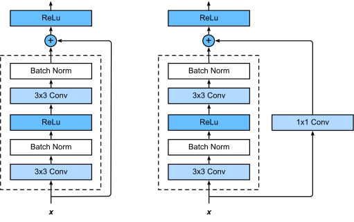]
.center.caption[Regular ResNet block vs. ResNet block with $1\times 1$ convolution.]
]
.kol-1-5[.center.width-100[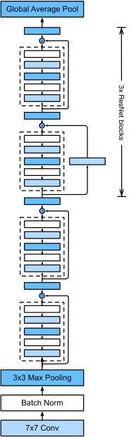]]
]

.footnote[Credits: [Dive Into Deep Learning](https://d2l.ai/), 2020.]

---

class: middle

Training networks of this depth is made possible because of the **skip connections** in the residual blocks. They allow the gradients to shortcut the layers and pass through without vanishing.

.center.width-60[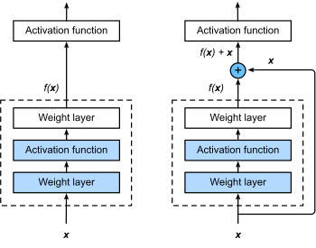]

.footnote[Credits: [Dive Into Deep Learning](https://d2l.ai/), 2020.]


---

class: middle

.grid[
.kol-1-2[

.smaller-xx.center[
```
----------------------------------------------------------------
        Layer (type)               Output Shape         Param #
================================================================
            Conv2d-1         [-1, 64, 112, 112]           9,408
       BatchNorm2d-2         [-1, 64, 112, 112]             128
              ReLU-3         [-1, 64, 112, 112]               0
         MaxPool2d-4           [-1, 64, 56, 56]               0
            Conv2d-5           [-1, 64, 56, 56]           4,096
       BatchNorm2d-6           [-1, 64, 56, 56]             128
              ReLU-7           [-1, 64, 56, 56]               0
            Conv2d-8           [-1, 64, 56, 56]          36,864
       BatchNorm2d-9           [-1, 64, 56, 56]             128
             ReLU-10           [-1, 64, 56, 56]               0
           Conv2d-11          [-1, 256, 56, 56]          16,384
      BatchNorm2d-12          [-1, 256, 56, 56]             512
           Conv2d-13          [-1, 256, 56, 56]          16,384
      BatchNorm2d-14          [-1, 256, 56, 56]             512
             ReLU-15          [-1, 256, 56, 56]               0
       Bottleneck-16          [-1, 256, 56, 56]               0
           Conv2d-17           [-1, 64, 56, 56]          16,384
      BatchNorm2d-18           [-1, 64, 56, 56]             128
             ReLU-19           [-1, 64, 56, 56]               0
           Conv2d-20           [-1, 64, 56, 56]          36,864
      BatchNorm2d-21           [-1, 64, 56, 56]             128
             ReLU-22           [-1, 64, 56, 56]               0
           Conv2d-23          [-1, 256, 56, 56]          16,384
      BatchNorm2d-24          [-1, 256, 56, 56]             512
             ReLU-25          [-1, 256, 56, 56]               0
       Bottleneck-26          [-1, 256, 56, 56]               0
           Conv2d-27           [-1, 64, 56, 56]          16,384
      BatchNorm2d-28           [-1, 64, 56, 56]             128
             ReLU-29           [-1, 64, 56, 56]               0
           Conv2d-30           [-1, 64, 56, 56]          36,864
      BatchNorm2d-31           [-1, 64, 56, 56]             128
             ReLU-32           [-1, 64, 56, 56]               0
           Conv2d-33          [-1, 256, 56, 56]          16,384
      BatchNorm2d-34          [-1, 256, 56, 56]             512
             ReLU-35          [-1, 256, 56, 56]               0
       Bottleneck-36          [-1, 256, 56, 56]               0
           Conv2d-37          [-1, 128, 56, 56]          32,768
      BatchNorm2d-38          [-1, 128, 56, 56]             256
             ReLU-39          [-1, 128, 56, 56]               0
           Conv2d-40          [-1, 128, 28, 28]         147,456
      BatchNorm2d-41          [-1, 128, 28, 28]             256
             ReLU-42          [-1, 128, 28, 28]               0
           Conv2d-43          [-1, 512, 28, 28]          65,536
      BatchNorm2d-44          [-1, 512, 28, 28]           1,024
           Conv2d-45          [-1, 512, 28, 28]         131,072
      BatchNorm2d-46          [-1, 512, 28, 28]           1,024
             ReLU-47          [-1, 512, 28, 28]               0
       Bottleneck-48          [-1, 512, 28, 28]               0
           Conv2d-49          [-1, 128, 28, 28]          65,536
      BatchNorm2d-50          [-1, 128, 28, 28]             256
             ReLU-51          [-1, 128, 28, 28]               0
           Conv2d-52          [-1, 128, 28, 28]         147,456
      BatchNorm2d-53          [-1, 128, 28, 28]             256

...
```
]

]
.kol-1-2[

.smaller-xx.center[
```

...

Bottleneck-130         [-1, 1024, 14, 14]               0
    Conv2d-131          [-1, 256, 14, 14]         262,144
BatchNorm2d-132          [-1, 256, 14, 14]             512
      ReLU-133          [-1, 256, 14, 14]               0
    Conv2d-134          [-1, 256, 14, 14]         589,824
BatchNorm2d-135          [-1, 256, 14, 14]             512
      ReLU-136          [-1, 256, 14, 14]               0
    Conv2d-137         [-1, 1024, 14, 14]         262,144
BatchNorm2d-138         [-1, 1024, 14, 14]           2,048
      ReLU-139         [-1, 1024, 14, 14]               0
Bottleneck-140         [-1, 1024, 14, 14]               0
    Conv2d-141          [-1, 512, 14, 14]         524,288
BatchNorm2d-142          [-1, 512, 14, 14]           1,024
      ReLU-143          [-1, 512, 14, 14]               0
    Conv2d-144            [-1, 512, 7, 7]       2,359,296
BatchNorm2d-145            [-1, 512, 7, 7]           1,024
      ReLU-146            [-1, 512, 7, 7]               0
    Conv2d-147           [-1, 2048, 7, 7]       1,048,576
BatchNorm2d-148           [-1, 2048, 7, 7]           4,096
    Conv2d-149           [-1, 2048, 7, 7]       2,097,152
BatchNorm2d-150           [-1, 2048, 7, 7]           4,096
      ReLU-151           [-1, 2048, 7, 7]               0
Bottleneck-152           [-1, 2048, 7, 7]               0
    Conv2d-153            [-1, 512, 7, 7]       1,048,576
BatchNorm2d-154            [-1, 512, 7, 7]           1,024
      ReLU-155            [-1, 512, 7, 7]               0
    Conv2d-156            [-1, 512, 7, 7]       2,359,296
BatchNorm2d-157            [-1, 512, 7, 7]           1,024
      ReLU-158            [-1, 512, 7, 7]               0
    Conv2d-159           [-1, 2048, 7, 7]       1,048,576
BatchNorm2d-160           [-1, 2048, 7, 7]           4,096
      ReLU-161           [-1, 2048, 7, 7]               0
Bottleneck-162           [-1, 2048, 7, 7]               0
    Conv2d-163            [-1, 512, 7, 7]       1,048,576
BatchNorm2d-164            [-1, 512, 7, 7]           1,024
      ReLU-165            [-1, 512, 7, 7]               0
    Conv2d-166            [-1, 512, 7, 7]       2,359,296
BatchNorm2d-167            [-1, 512, 7, 7]           1,024
      ReLU-168            [-1, 512, 7, 7]               0
    Conv2d-169           [-1, 2048, 7, 7]       1,048,576
BatchNorm2d-170           [-1, 2048, 7, 7]           4,096
      ReLU-171           [-1, 2048, 7, 7]               0
Bottleneck-172           [-1, 2048, 7, 7]               0
 AvgPool2d-173           [-1, 2048, 1, 1]               0
    Linear-174                 [-1, 1000]       2,049,000
================================================================
Total params: 25,557,032                                        
Trainable params: 25,557,032                                    
Non-trainable params: 0                                         
----------------------------------------------------------------
Input size (MB): 0.57                                           
Forward/backward pass size (MB): 286.56                         
Params size (MB): 97.49                                         
Estimated Total Size (MB): 384.62                               
----------------------------------------------------------------
```
]

]
]

---

class: middle

## The benefits of depth

.center.width-100[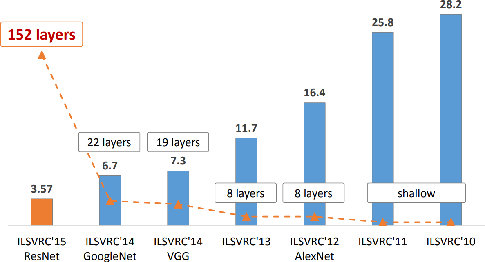]

---

class: middle

# Under the hood

---

class: middle

Understanding what is happening in deep neural networks after training is complex and the tools we have are limited.

In the case of convolutional neural networks, we can look at:
- the network's kernels as images
- internal activations on a single sample as images
- distributions of activations on a population of samples
- derivatives of the response with respect to the input
- maximum-response synthetic samples

.footnote[Credits: Francois Fleuret, [EE559 Deep Learning](https://fleuret.org/ee559/), EPFL.]

---

# Looking at filters

<br><br><br><br><br>

LeNet's first convolutional layer, all filters.

.width-100[]

.footnote[Credits: Francois Fleuret, [EE559 Deep Learning](https://fleuret.org/ee559/), EPFL.]


---

class: middle

LeNet's second convolutional layer, first 32 filters.

.center.width-70[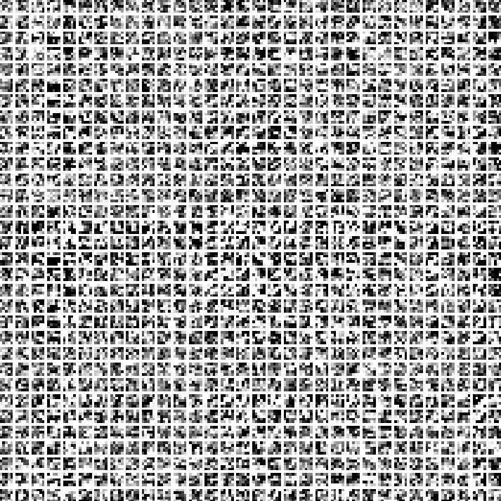]

.footnote[Credits: Francois Fleuret, [EE559 Deep Learning](https://fleuret.org/ee559/), EPFL.]

---

class: middle

AlexNet's first convolutional layer, first 20 filters.

.center.width-100[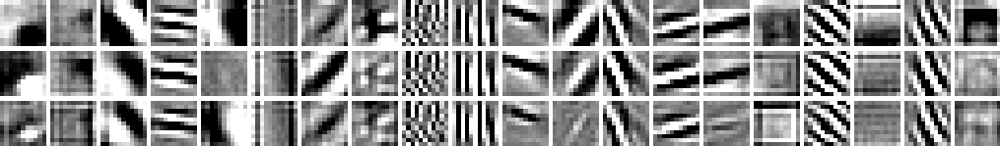]

.footnote[Credits: Francois Fleuret, [EE559 Deep Learning](https://fleuret.org/ee559/), EPFL.]


---

# Maximum response samples

Convolutional networks can be inspected by looking for synthetic input images $\mathbf{x}$ that maximize the activation $\mathbf{h}\_{\ell,d}(\mathbf{x})$ of a chosen convolutional kernel $\mathbf{u}$ at layer $\ell$ and index $d$ in the layer filter bank.

These samples can be found by gradient ascent on the input space:
$$\begin{aligned}
\mathcal{L}\_{\ell,d}(\mathbf{x}) &= ||\mathbf{h}\_{\ell,d}(\mathbf{x})||\_2\\\\
\mathbf{x}\_0 &\sim U[0,1]^{C \times H \times W } \\\\
\mathbf{x}\_{t+1} &= \mathbf{x}\_t + \gamma \nabla\_{\mathbf{x}} \mathcal{L}\_{\ell,d}(\mathbf{x}\_t)
\end{aligned}$$

---

class: middle

.width-100[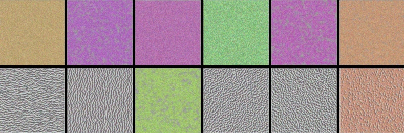]

.center[VGG-16, convolutional layer 1-1, a few of the 64 filters]

.footnote[Credits: Francois Chollet, [How convolutional neural networks see the world](https://blog.keras.io/how-convolutional-neural-networks-see-the-world.html), 2016.]

---

class: middle

.width-100[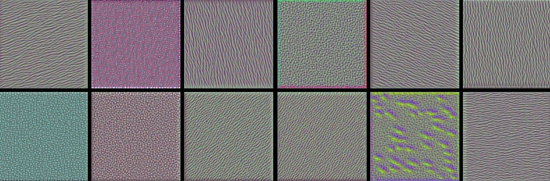]

.center[VGG-16, convolutional layer 2-1, a few of the 128 filters]

.footnote[Credits: Francois Chollet, [How convolutional neural networks see the world](https://blog.keras.io/how-convolutional-neural-networks-see-the-world.html), 2016.]

---

class: middle

.width-100[]

.center[VGG-16, convolutional layer 3-1, a few of the 256 filters]

.footnote[Credits: Francois Chollet, [How convolutional neural networks see the world](https://blog.keras.io/how-convolutional-neural-networks-see-the-world.html), 2016.]

---

class: middle

.width-100[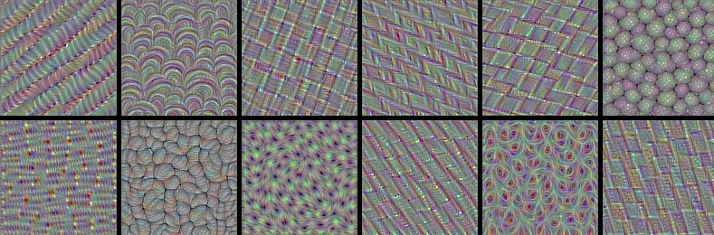]

.center[VGG-16, convolutional layer 4-1, a few of the 512 filters]

.footnote[Credits: Francois Chollet, [How convolutional neural networks see the world](https://blog.keras.io/how-convolutional-neural-networks-see-the-world.html), 2016.]

---

class: middle

.width-100[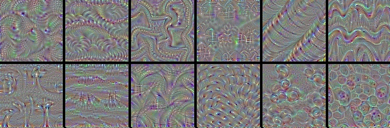]

.center[VGG-16, convolutional layer 5-1, a few of the 512 filters]

.footnote[Credits: Francois Chollet, [How convolutional neural networks see the world](https://blog.keras.io/how-convolutional-neural-networks-see-the-world.html), 2016.]

---

class: middle

Some observations:
- The first layers appear to encode direction and color.
- The direction and color filters get combined into grid and spot textures.
- These textures gradually get combined into increasingly complex patterns.

The network appears to learn a .bold[hierarchical composition of patterns].

.width-70.center[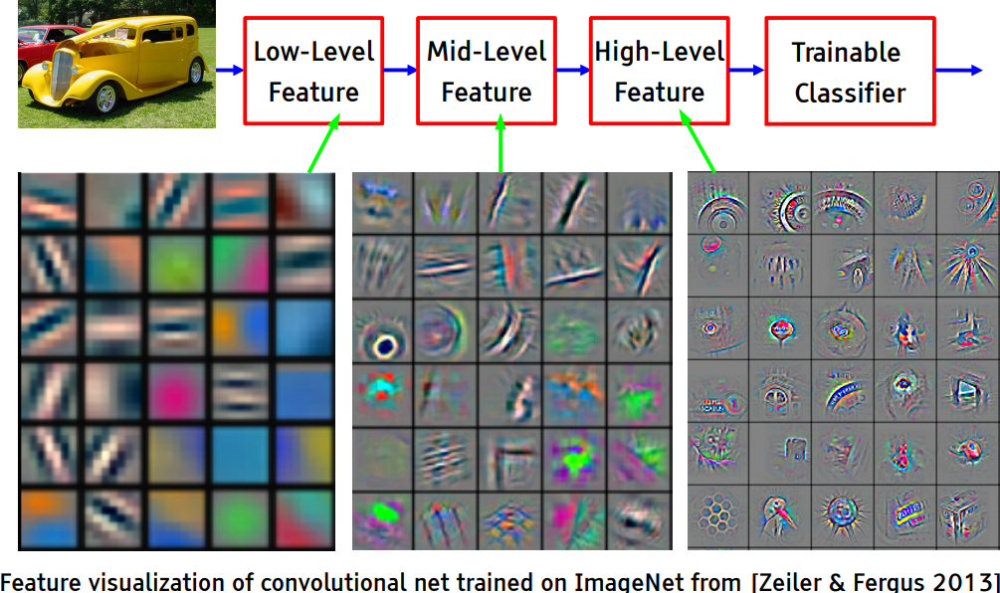]

---

<br><br><br>

What if we build images that maximize the activation of a chosen class output?

--

count: false

The left image is predicted **with 99.9% confidence** as a magpie!

.grid[
.kol-1-2.center[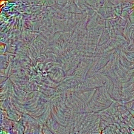]
.kol-1-2.center[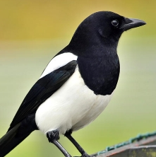]
]

.footnote[Credits: Francois Chollet, [How convolutional neural networks see the world](https://blog.keras.io/how-convolutional-neural-networks-see-the-world.html), 2016.]

---

class: middle, black-slide

.center[

<iframe width="600" height="400" src="https://www.youtube.com/embed/SCE-QeDfXtA?&loop=1&start=0" frameborder="0" volume="0" allowfullscreen></iframe>

]

.bold[Deep Dream.] Start from an image $\mathbf{x}\_t$, offset by a random jitter, enhance some layer activation at multiple scales, zoom in, repeat on the produced image $\mathbf{x}\_{t+1}$.

---

# Biological plausibility

.center.width-80[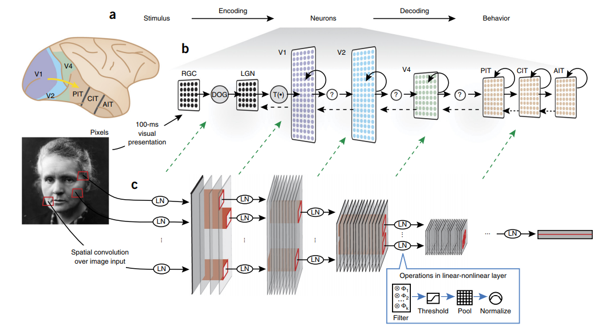]

.italic["Deep hierarchical neural networks are beginning to transform
neuroscientists’ ability to produce quantitatively accurate computational
models of the sensory systems, especially in higher cortical areas
where neural response properties had previously been enigmatic."]

.footnote[Credits: Yamins et al, Using goal-driven deep learning models to understand
sensory cortex, 2016.]

---

class: end-slide, center
count: false

The end.

---

count: false

# References

- Francois Fleuret, Deep Learning Course, [4.4. Convolutions](https://fleuret.org/ee559/ee559-slides-4-4-convolutions.pdf), EPFL, 2018.
- Yannis Avrithis, Deep Learning for Vision, [Lecture 1: Introduction](https://sif-dlv.github.io/slides/intro.pdf), University of Rennes 1, 2018.
- Yannis Avrithis, Deep Learning for Vision, [Lecture 7: Convolution and network architectures ](https://sif-dlv.github.io/slides/conv.pdf), University of Rennes 1, 2018.
- Olivier Grisel and Charles Ollion, Deep Learning, [Lecture 4: Convolutional Neural Networks for Image Classification ](https://m2dsupsdlclass.github.io/lectures-labs/slides/04_conv_nets/index.html#1), Université Paris-Saclay, 2018.
