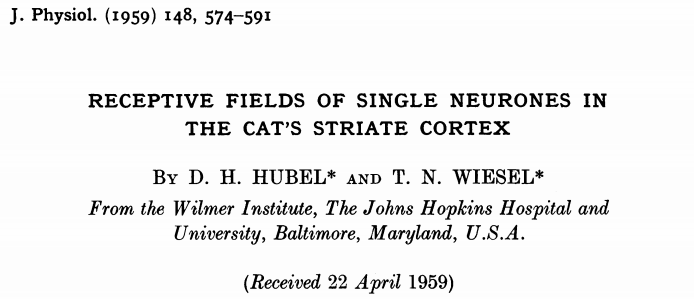
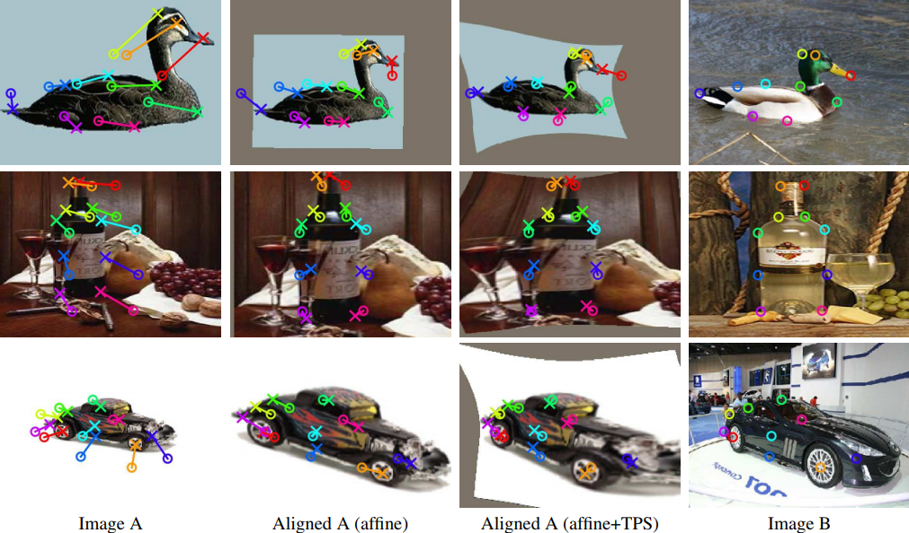
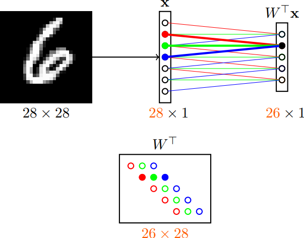
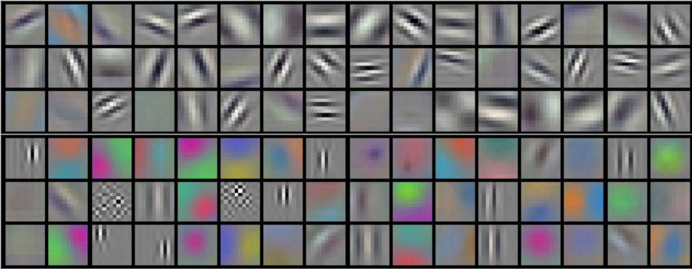
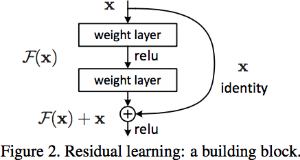

class: middle, center, title-slide

# Deep Learning

Lecture 3: Convolutional networks

<br><br>
Prof. Gilles Louppe<br>
[g.louppe@uliege.be](g.louppe@uliege.be)

???

R: Beyond classification?
R: e.g., UNet for segmentation
R: pre-trained models

---

# Today

How to apply neural networks to spatially/temporally structured data.

- A little history
- Convolutions
- Convolutional network architectures
- Beyond classification
- What is really happening?

---

class: middle

# A little history

Adapted from Yannis Avrithis, "Lecture 1: Introduction", [Deep Learning for vision](https://sif-dlv.github.io), 2018.

---

class: middle

.grid.center[
.kol-1-10[]
.kol-3-5[<br><br>.width-100[]]
.kol-1-5[.width-100.circle[].width-100.circle[]]
]
<br>

## Visual perception (Hubel and Wiesel, 1959-1962)

- David Hubel and Torsten Wiesel discover the neural basis of **visual perception**.
- Nobel Prize of Medicine in 1981 for this work.

---

class: middle, black-slide

.center[

<iframe width="640" height="480" src="https://www.youtube.com/embed/y_l4kQ5wjiw?&loop=1&start=0" frameborder="0" volume="0" allowfullscreen></iframe>

]

.center[Hubel and Wiesel]

???

During their recordings, they noticed a few interesting things:
1. the neurons fired only when the line was in a particular place on the retina,
2. the activity of these neurons changed depending on the orientation of the line, and
3. sometimes the neurons fired only when the line was moving in a particular direction.

---

class: middle

.width-90.center[]

.footnote[Credits: Hubel and Wiesel, [Receptive fields, binocular interaction and functional architecture in the cat's visual cortex](https://www.ncbi.nlm.nih.gov/pmc/articles/PMC1359523/), 1962.]

---

class: middle

.width-90.center[]

.footnote[Credits: Hubel and Wiesel, [Receptive fields, binocular interaction and functional architecture in the cat's visual cortex](https://www.ncbi.nlm.nih.gov/pmc/articles/PMC1359523/), 1962.]

---

class: middle

## Perceptron (Rosenblatt, 1959)

.grid[
.kol-1-2[<br><br>.width-100[]]
.kol-1-2[.width-100[]]
]

The Mark-1 Perceptron:
- Analog circuit implementation of a neural network,
- Parameters as potentiometers.

.footnote[Credits: Frank Rosenblatt, [Principle of Neurodynamics](http://www.dtic.mil/dtic/tr/fulltext/u2/256582.pdf), 1961.]

---

class: middle

.center.width-60[]

.italic["If we show the perceptron a stimulus, say a square, and associate a response to that square, this response will immediately *generalize perfectly to all
transforms* of the square under the transformation group [...]."]

This is quite similar to Hubel and Wiesel's simple and complex cells!


.footnote[Credits: Frank Rosenblatt, [Principle of Neurodynamics](http://www.dtic.mil/dtic/tr/fulltext/u2/256582.pdf), 1961.]

---

class: middle

.center.width-40[]

## AI winter (Minsky and Papert, 1969+)

- Minsky and Papert Redefine the perceptron as a linear classifier,
- Then they prove a series of impossiblity results. **AI winter** follows.

.footnote[Credits: Minsky and Papert, Perceptrons: an Introduction to Computational Geometry, 1969.]

---

class: middle

.center.width-40[]

## Automatic differentiation (Werbos, 1974)

- Formulate an arbitrary function as computational graph.
- Dynamic feedback: compute symbolic derivatives by dynamic programming.

.footnote[Credits: Paul Werbos, Beyond regression: new tools for prediction and analysis in the behavioral sciences, 1974.]

---

class: middle

## Neocognitron (Fukushima, 1980)

.center.width-90[]

Fukushima proposes a direct neural network implementation of the hierarchy model of the visual nervous system of Hubel and Wiesel.

.footnote[Credits: Kunihiko Fukushima, [Neocognitron: A Self-organizing Neural Network Model](https://www.rctn.org/bruno/public/papers/Fukushima1980.pdf), 1980.]

---

class: middle

.grid[
.kol-1-3.center[.width-100[]
Convolutions]
.kol-2-3.center[.width-100[]
Feature hierarchy]
]

- Build upon **convolutions** and enables the composition of a *feature hierarchy*.
- Biologically-inspired training algorithm, which proves to be largely inefficient.

.footnote[Credits: Kunihiko Fukushima, [Neocognitron: A Self-organizing Neural Network Model](https://www.rctn.org/bruno/public/papers/Fukushima1980.pdf), 1980.]

---

class: middle

## Backpropagation (Rumelhart et al, 1986)

.grid[
.kol-1-2[
- Introduce **backpropagation** in multi-layer networks with sigmoid non-linearities and sum of squares loss function.
- Advocate batch gradient descent for supervised learning.
- Discuss online gradient descent, momentum and random initialization.
- Depart from *biologically plausible* training algorithms.
]
.kol-1-2[
.center.width-100[]
]
]


.footnote[Credits: Rumelhart et al, [Learning representations by back-propagating errors](http://www.cs.toronto.edu/~hinton/absps/naturebp.pdf), 1986.]

---

class: middle

## Convolutional networks (LeCun, 1990)

- Train a convolutional network by backpropagation.
- Advocate end-to-end feature learning for image classification.

.center.width-70[]

.footnote[Credits: LeCun et al, [Handwritten Digit Recognition with a Back-Propagation Network](http://yann.lecun.com/exdb/publis/pdf/lecun-90c.pdf), 1990.]

---

class: middle, black-slide

.center[

<iframe width="640" height="480" src="https://www.youtube.com/embed/FwFduRA_L6Q?&loop=1&start=0" frameborder="0" volume="0" allowfullscreen></iframe>

]

.center[LeNet-1 (LeCun et al, 1993)]

---

class: middle, center

Convolutional networks are now **used everywhere in vision**.

.grid[
.kol-1-2[<br><br>.width-100[]<br>
Object detection<br>(Redmon et al, 2015)]
.kol-1-2[.width-70[]<br>
Geometric matching<br>(Rocco et al, 2017)]
]
.grid[
.kol-1-2[.width-70[]<br>
Semantic segmentation<br>(Long et al, 2015)]
.kol-1-2[.width-70[]<br>
Instance segmentation<br>(He et al, 2017)]
]


---

class: middle

... but also in many other applications, including:
- speech recognition and synthesis
- natural language processing
- protein/DNA binding prediction
- or more generally, any problem *with a spatial* (or sequential) *structure*.

---

class: middle

# Convolutions

---

class: middle

.center.width-70[]

Let us consider the first layer of a MLP taking images as input. What are the problems with this architecture?

.footnote[Credits: Yannis Avrithis, [Deep Learning for Vision](https://sif-dlv.github.io/), University of Rennes 1.]

---

class: middle

## Issues

- Too many parameters: $100 \times 784 + 100$.
    - What if images are $640 \times 480 \times 3$?
    - What if the first layer counts $1000$ units?
- Spatial organization of the input is destroyed.
- The network is not invariant to transformations (e.g., translation).


---

class: middle

.center.width-70[]

Instead,
let us only keep a *sparse* set of connections,
where all weights having the same color are **shared**.

.footnote[Credits: Yannis Avrithis, [Deep Learning for Vision](https://sif-dlv.github.io/), University of Rennes 1.]

---

class: middle

- The resulting operation can be seen as **shifting** the same weight triplet (*kernel*).
- The set of inputs seen by each unit is its *receptive field*.

$\Rightarrow$ This is a 1D **convolution**, which can be generalized to more dimensions.

---

# Convolutions

For one-dimensional tensors, given an input vector $\mathbf{x} \in \mathbb{R}^W$ and a convolutional kernel $\mathbf{u} \in \mathbb{R}^w$,
the discrete **convolution** $\mathbf{u} \star \mathbf{x}$ is a vector of size $W - w + 1$ such that
$$\begin{aligned}
(\mathbf{u} \star \mathbf{x})[i] &= \sum\_{m=0}^{w-1} u\_m  x\_{m+i}.
\end{aligned}
$$

- Technically, $\star$ denotes the *cross-correlation* operator.
- However, most machine learning libraries call it convolution.

---

class: middle

.center[]

.footnote[Credits: Francois Fleuret, [EE559 Deep Learning](https://fleuret.org/ee559/), EPFL.]

---

class: middle

Convolutions generalize to multi-dimensional tensors:
- In its most usual form, a convolution takes as input a 3D tensor $\mathbf{x} \in \mathbb{R}^{C \times H \times W}$, called the *input feature map*.
- A kernel $\mathbf{u} \in \mathbb{R}^{C \times h \times w}$ slides across the input feature map, along its height and width. The size $h \times w$ is the size of the receptive field.
- At each location,  the element-wise product between the kernel and the input elements it overlaps is computed and the results are summed up.

---

class: middle

.center[]

.footnote[Credits: Francois Fleuret, [EE559 Deep Learning](https://fleuret.org/ee559/), EPFL.]

---

class: middle

- The final output $\mathbf{o}$ is a 2D tensor of size $(H-h+1) \times (W-w+1)$ called the *output feature map* and such that:
$$\begin{aligned}
\mathbf{o}\_{j,i} &= \mathbf{b}\_{j,i} + \sum\_{c=0}^{C-1} (\mathbf{u}\_c \star \mathbf{x}\_c)[j,i] = \mathbf{b}\_{j,i} + \sum\_{c=0}^{C-1}  \sum\_{n=0}^{h-1} \sum\_{m=0}^{w-1}  \mathbf{u}\_{c,n,m}  \mathbf{x}\_{c,n+j,m+i}
\end{aligned}$$
where $\mathbf{u}$ and $\mathbf{b}$ are shared parameters to learn.
- $D$ convolutions can be applied in the same way to produce a $D \times (H-h+1) \times (W-w+1)$ feature map,
where $D$ is the depth.

---

class: middle

## Convolution as a matrix multiplication

As a guiding example, let us consider the convolution of single-channel tensors $\mathbf{x} \in \mathbb{R}^{4 \times 4}$ and $\mathbf{u} \in \mathbb{R}^{3 \times 3}$:

$$
\mathbf{u} \star \mathbf{x} =
\begin{pmatrix}
1 & 4 & 1 \\\\
1 & 4 & 3 \\\\
3 & 3 & 1
\end{pmatrix} \star \begin{pmatrix}
4 & 5 & 8 & 7 \\\\
1 & 8 & 8 & 8 \\\\
3 & 6 & 6 & 4 \\\\
6 & 5 & 7 & 8
\end{pmatrix} =
\begin{pmatrix}
122 & 148 \\\\
126 & 134
\end{pmatrix}$$

---

class: middle

The convolution operation can be equivalently re-expressed as a single matrix multiplication:
- the convolutional kernel $\mathbf{u}$ is rearranged as a **sparse Toeplitz circulant matrix**, called the convolution matrix:
$$\mathbf{U} = \begin{pmatrix}
1 & 4 & 1 & 0 & 1 & 4 & 3 & 0 & 3 & 3 & 1 & 0 & 0 & 0 & 0 & 0 \\\\
0 & 1 & 4 & 1 & 0 & 1 & 4 & 3 & 0 & 3 & 3 & 1 & 0 & 0 & 0 & 0 \\\\
0 & 0 & 0 & 0 & 1 & 4 & 1 & 0 & 1 & 4 & 3 & 0 & 3 & 3 & 1 & 0 \\\\
0 & 0 & 0 & 0 & 0 & 1 & 4 & 1 & 0 & 1 & 4 & 3 & 0 & 3 & 3 & 1
\end{pmatrix}$$
- the input $\mathbf{x}$ is flattened row by row, from top to bottom:
$$v(\mathbf{x}) =
\begin{pmatrix}
4 & 5 & 8 & 7 & 1 & 8 & 8 & 8 & 3 & 6 & 6 & 4 & 6 & 5 & 7 & 8
\end{pmatrix}^T$$

Then,
$$\mathbf{U}v(\mathbf{x}) =
\begin{pmatrix}
122 & 148 & 126 & 134
\end{pmatrix}^T$$
which we can reshape to a $2 \times 2$ matrix to obtain $\mathbf{u} \star \mathbf{x}$.

---

class: middle

The same procedure generalizes to $\mathbf{x} \in \mathbb{R}^{H \times W}$ and convolutional kernel $\mathbf{u} \in \mathbf{R}^{h \times w}$, such that:
- the convolutional kernel is rearranged as a sparse Toeplitz circulant matrix $\mathbf{U}$ of shape $(H-h+1)(W-w+1) \times HW$ where
    - each row $i$ identifies an element of the output feature map,
    - each column $j$ identifies an element of the input feature map,
    - the value $\mathbf{U}\_{i,j}$ corresponds to the kernel value the element $j$ is multiplied with in output $i$;
- the input $\mathbf{x}$ is flattened into a column vector $v(\mathbf{x})$ of shape $HW \times 1$;
- the output feature map $\mathbf{u} \star \mathbf{x}$ is obtained by reshaping the $(H-h+1)(W-w+1) \times 1$ column vector $\mathbf{U}v(\mathbf{x})$ as a $(H-h+1) \times (W-w+1)$ matrix.

Therefore, a convolutional layer is a special case of a fully
connected layer: $$\mathbf{h} = \mathbf{u} \star \mathbf{x} \Leftrightarrow v(\mathbf{h}) = \mathbf{U}v(\mathbf{x}) \Leftrightarrow  v(\mathbf{h}) = \mathbf{W}^T v(\mathbf{x})$$

---

class: middle, center


$$\Leftrightarrow$$


---

class: middle

.grid[
.kol-1-2[
## Strides

- The *stride* specifies the size of the step for the convolution operator.
- This parameter reduces the size of the output map.
]
.kol-1-2.center[]
]

.footnote[Credits: Dumoulin and Visin, [A guide to convolution arithmetic for deep learning](https://arxiv.org/abs/1603.07285), 2016.]

---

class: middle

.grid[
.kol-1-2[
## Padding

- **Padding** specifies whether the input volume is pad artificially around its border.
- This parameter is useful to keep spatial dimensions constant across filters.
- Zero-padding is the default mode.

]
.kol-1-2.center[]
]

.footnote[Credits: Dumoulin and Visin, [A guide to convolution arithmetic for deep learning](https://arxiv.org/abs/1603.07285), 2016.]

---

class: middle

## Equivariance

A function $f$ is **equivariant** to $g$ if $f(g(\mathbf{x})) = g(f(\mathbf{x}))$.
- Parameter sharing used in a convolutional layer causes the layer to be equivariant to translation.
- That is, if $g$ is any function that translates the input, the convolution function is equivariant to $g$.

.center.width-50[]

.caption[If an object moves in the input image, its representation will move the same amount in the output.]

.footnote[Credits: LeCun et al, Gradient-based learning applied to document recognition, 1998.]

---

class: middle

- Equivariance is useful when we know some local function is useful everywhere (e.g., edge detectors).
- Convolution is not equivariant to other operations such as change in scale or rotation.

---

# Pooling

When the input volume is large, **pooling layers** can be used to reduce the input dimension while
preserving its global structure, in a way similar to a down-scaling operation.

Consider a pooling area of size $h \times w$ and a 3D input tensor $\mathbf{x} \in \mathbb{R}^{C\times(rh)\times(sw)}$.
- Max-pooling produces a tensor $\mathbf{o} \in \mathbb{R}^{C \times r \times s}$
such that
$$\mathbf{o}\_{c,j,i} = \max\_{n < h, m < w} \mathbf{x}_{c,rj+n,si+m}.$$
- Average pooling produces a tensor $\mathbf{o} \in \mathbb{R}^{C \times r \times s}$ such that
$$\mathbf{o}\_{c,j,i} = \frac{1}{hw} \sum\_{n=0}^{h-1} \sum\_{m=0}^{w-1} \mathbf{x}_{c,rj+n,si+m}.$$

Pooling is very similar in its formulation to convolution.

---

class: middle

.center[]

.footnote[Credits: Francois Fleuret, [EE559 Deep Learning](https://fleuret.org/ee559/), EPFL.]

---

class: middle

## Invariance

A function $f$ is **invariant** to $g$ if $f(g(\mathbf{x})) = f(\mathbf{x})$.
- Pooling layers can be used for building inner activations that are (slightly) invariant to small translations of the input.
- Invariance to local translation is helpful if we care more about the presence of a pattern rather than its exact position.

---

class: middle

# Architectures

---

# Layer patterns

A **convolutional network** can often be defined as a composition of convolutional layers ($\texttt{CONV}$), pooling layers ($\texttt{POOL}$), linear rectifiers ($\texttt{RELU}$) and fully connected layers ($\texttt{FC}$).

.center.width-100[]

---

class: middle

The most common convolutional network architecture follows the pattern:

$$\texttt{INPUT} \to [[\texttt{CONV} \to \texttt{RELU}]\texttt{\*}N \to \texttt{POOL?}]\texttt{\*}M \to [\texttt{FC} \to \texttt{RELU}]\texttt{\*}K \to \texttt{FC}$$

where:
- $\texttt{\*}$ indicates repetition;
- $\texttt{POOL?}$ indicates an optional pooling layer;
- $N \geq 0$ (and usually $N \leq 3$), $M \geq 0$, $K \geq 0$ (and usually $K < 3$);
- the last fully connected layer holds the output (e.g., the class scores).

---

# Architectures

Some common architectures for convolutional networks following this pattern include:
- $\texttt{INPUT} \to \texttt{FC}$, which implements a linear classifier ($N=M=K=0$).
- $\texttt{INPUT} \to [\texttt{FC} \to \texttt{RELU}]{\*K} \to \texttt{FC}$, which implements a $K$-layer MLP.
- $\texttt{INPUT} \to \texttt{CONV} \to \texttt{RELU} \to \texttt{FC}$.
- $\texttt{INPUT} \to [\texttt{CONV} \to \texttt{RELU} \to \texttt{POOL}]\texttt{\*2} \to \texttt{FC} \to \texttt{RELU} \to \texttt{FC}$.
- $\texttt{INPUT} \to [[\texttt{CONV} \to \texttt{RELU}]\texttt{\*2} \to \texttt{POOL}]\texttt{\*3} \to [\texttt{FC} \to \texttt{RELU}]\texttt{\*2} \to \texttt{FC}$.

???

Note that for the last architecture, two $\texttt{CONV}$ layers are stacked before every $\texttt{POOL}$ layer. This is generally a good idea for larger and deeper networks, because multiple stacked $\texttt{CONV}$  layers can develop more complex features of the input volume before the destructive pooling operation.

---

class: center, middle, black-slide

.width-100[]

---

class: middle

## LeNet-5 (LeCun et al, 1998)

- First convolutional network to use backpropagation.
- Applied to character recognition.

<br>

.center.width-100[]

---

class: middle

.smaller-x.center[
```
----------------------------------------------------------------
        Layer (type)               Output Shape         Param #
================================================================
            Conv2d-1            [-1, 6, 28, 28]             156
              ReLU-2            [-1, 6, 28, 28]               0
         MaxPool2d-3            [-1, 6, 14, 14]               0
            Conv2d-4           [-1, 16, 10, 10]           2,416
              ReLU-5           [-1, 16, 10, 10]               0
         MaxPool2d-6             [-1, 16, 5, 5]               0
            Conv2d-7            [-1, 120, 1, 1]          48,120
              ReLU-8            [-1, 120, 1, 1]               0
            Linear-9                   [-1, 84]          10,164
             ReLU-10                   [-1, 84]               0
           Linear-11                   [-1, 10]             850
       LogSoftmax-12                   [-1, 10]               0
================================================================
Total params: 61,706                                            
Trainable params: 61,706                                        
Non-trainable params: 0                                         
----------------------------------------------------------------
Input size (MB): 0.00                                           
Forward/backward pass size (MB): 0.11                           
Params size (MB): 0.24                                          
Estimated Total Size (MB): 0.35                                 
----------------------------------------------------------------
```
]

---

class: middle

## AlexNet (Krizhevsky et al, 2012)

- 16.4% top-5 error on ILSVRC'12, outperformed all by 10%.
- Implementation on two GPUs, because of memory constraints.

<br>

.center.width-100[]

---

class: middle

.smaller-x.center[
```
----------------------------------------------------------------
        Layer (type)               Output Shape         Param #
================================================================
            Conv2d-1           [-1, 64, 55, 55]          23,296
              ReLU-2           [-1, 64, 55, 55]               0
         MaxPool2d-3           [-1, 64, 27, 27]               0
            Conv2d-4          [-1, 192, 27, 27]         307,392
              ReLU-5          [-1, 192, 27, 27]               0
         MaxPool2d-6          [-1, 192, 13, 13]               0
            Conv2d-7          [-1, 384, 13, 13]         663,936
              ReLU-8          [-1, 384, 13, 13]               0
            Conv2d-9          [-1, 256, 13, 13]         884,992
             ReLU-10          [-1, 256, 13, 13]               0
           Conv2d-11          [-1, 256, 13, 13]         590,080
             ReLU-12          [-1, 256, 13, 13]               0
        MaxPool2d-13            [-1, 256, 6, 6]               0
          Dropout-14                 [-1, 9216]               0
           Linear-15                 [-1, 4096]      37,752,832
             ReLU-16                 [-1, 4096]               0
          Dropout-17                 [-1, 4096]               0
           Linear-18                 [-1, 4096]      16,781,312
             ReLU-19                 [-1, 4096]               0
           Linear-20                 [-1, 1000]       4,097,000
================================================================
Total params: 61,100,840                                        
Trainable params: 61,100,840                                    
Non-trainable params: 0                                         
----------------------------------------------------------------
Input size (MB): 0.57                                           
Forward/backward pass size (MB): 8.31                           
Params size (MB): 233.08                                        
Estimated Total Size (MB): 241.96                               
----------------------------------------------------------------
```
]

---

class: middle

.center.width-90[]

- 96 $11 \times 11 \times 3$ kernels learned by the first convolutional layer.
- Top 48 kernels were learned on GPU1, while the bottom 48 kernels were learned on GPU 2.

---

class: middle

## VGG (Simonyan and Zisserman, 2014)

- 7.3% top-5 error on ILSVRC'14.
- Depth increased up to 19 layers, kernel sizes reduced to 3.

<br>

.center.width-80[]

---

class: middle

.smaller-xx.center[
```
----------------------------------------------------------------
        Layer (type)               Output Shape         Param #
================================================================
            Conv2d-1         [-1, 64, 224, 224]           1,792
              ReLU-2         [-1, 64, 224, 224]               0
            Conv2d-3         [-1, 64, 224, 224]          36,928
              ReLU-4         [-1, 64, 224, 224]               0
         MaxPool2d-5         [-1, 64, 112, 112]               0
            Conv2d-6        [-1, 128, 112, 112]          73,856
              ReLU-7        [-1, 128, 112, 112]               0
            Conv2d-8        [-1, 128, 112, 112]         147,584
              ReLU-9        [-1, 128, 112, 112]               0
        MaxPool2d-10          [-1, 128, 56, 56]               0
           Conv2d-11          [-1, 256, 56, 56]         295,168
             ReLU-12          [-1, 256, 56, 56]               0
           Conv2d-13          [-1, 256, 56, 56]         590,080
             ReLU-14          [-1, 256, 56, 56]               0
           Conv2d-15          [-1, 256, 56, 56]         590,080
             ReLU-16          [-1, 256, 56, 56]               0
        MaxPool2d-17          [-1, 256, 28, 28]               0
           Conv2d-18          [-1, 512, 28, 28]       1,180,160
             ReLU-19          [-1, 512, 28, 28]               0
           Conv2d-20          [-1, 512, 28, 28]       2,359,808
             ReLU-21          [-1, 512, 28, 28]               0
           Conv2d-22          [-1, 512, 28, 28]       2,359,808
             ReLU-23          [-1, 512, 28, 28]               0
        MaxPool2d-24          [-1, 512, 14, 14]               0
           Conv2d-25          [-1, 512, 14, 14]       2,359,808
             ReLU-26          [-1, 512, 14, 14]               0
           Conv2d-27          [-1, 512, 14, 14]       2,359,808
             ReLU-28          [-1, 512, 14, 14]               0
           Conv2d-29          [-1, 512, 14, 14]       2,359,808
             ReLU-30          [-1, 512, 14, 14]               0
        MaxPool2d-31            [-1, 512, 7, 7]               0
           Linear-32                 [-1, 4096]     102,764,544
             ReLU-33                 [-1, 4096]               0
          Dropout-34                 [-1, 4096]               0
           Linear-35                 [-1, 4096]      16,781,312
             ReLU-36                 [-1, 4096]               0
          Dropout-37                 [-1, 4096]               0
           Linear-38                 [-1, 1000]       4,097,000
================================================================
Total params: 138,357,544                                       
Trainable params: 138,357,544                                   
Non-trainable params: 0                                         
----------------------------------------------------------------
Input size (MB): 0.57                                           
Forward/backward pass size (MB): 218.59                         
Params size (MB): 527.79                                        
Estimated Total Size (MB): 746.96                               
----------------------------------------------------------------
```
]

---

class: middle

.center.width-60[]

The **effective receptive field** is the part of the visual input that affects a given unit indirectly through previous layers.
- It grows linearly with depth.
- A stack of three $3 \times 3$ kernels of stride 1 has the same effective receptive field as a single $7 \times 7$ kernel, but fewer parameters.

.footnote[Credits: Yannis Avrithis, [Deep Learning for Vision](https://sif-dlv.github.io/), University of Rennes 1.]

---

class: middle

.grid[
.kol-1-2[

## ResNet (He et al, 2015)

- Even deeper models (34, 50, 101 and 152 layers)
- Skip connections.
- Resnet-50 vs. VGG:
    - 5.25% top-5 error vs. 7.1%
    - 25M vs. 138M parameters
    - 3.8B Flops vs. 15.3B Flops
    - Fully convolutional until the last layer

<br>
.center.width-80[]

]
.kol-1-2[.center.width-70[]]
]

---

class: middle

.grid[
.kol-1-2[

.smaller-xx.center[
```
----------------------------------------------------------------
        Layer (type)               Output Shape         Param #
================================================================
            Conv2d-1         [-1, 64, 112, 112]           9,408
       BatchNorm2d-2         [-1, 64, 112, 112]             128
              ReLU-3         [-1, 64, 112, 112]               0
         MaxPool2d-4           [-1, 64, 56, 56]               0
            Conv2d-5           [-1, 64, 56, 56]           4,096
       BatchNorm2d-6           [-1, 64, 56, 56]             128
              ReLU-7           [-1, 64, 56, 56]               0
            Conv2d-8           [-1, 64, 56, 56]          36,864
       BatchNorm2d-9           [-1, 64, 56, 56]             128
             ReLU-10           [-1, 64, 56, 56]               0
           Conv2d-11          [-1, 256, 56, 56]          16,384
      BatchNorm2d-12          [-1, 256, 56, 56]             512
           Conv2d-13          [-1, 256, 56, 56]          16,384
      BatchNorm2d-14          [-1, 256, 56, 56]             512
             ReLU-15          [-1, 256, 56, 56]               0
       Bottleneck-16          [-1, 256, 56, 56]               0
           Conv2d-17           [-1, 64, 56, 56]          16,384
      BatchNorm2d-18           [-1, 64, 56, 56]             128
             ReLU-19           [-1, 64, 56, 56]               0
           Conv2d-20           [-1, 64, 56, 56]          36,864
      BatchNorm2d-21           [-1, 64, 56, 56]             128
             ReLU-22           [-1, 64, 56, 56]               0
           Conv2d-23          [-1, 256, 56, 56]          16,384
      BatchNorm2d-24          [-1, 256, 56, 56]             512
             ReLU-25          [-1, 256, 56, 56]               0
       Bottleneck-26          [-1, 256, 56, 56]               0
           Conv2d-27           [-1, 64, 56, 56]          16,384
      BatchNorm2d-28           [-1, 64, 56, 56]             128
             ReLU-29           [-1, 64, 56, 56]               0
           Conv2d-30           [-1, 64, 56, 56]          36,864
      BatchNorm2d-31           [-1, 64, 56, 56]             128
             ReLU-32           [-1, 64, 56, 56]               0
           Conv2d-33          [-1, 256, 56, 56]          16,384
      BatchNorm2d-34          [-1, 256, 56, 56]             512
             ReLU-35          [-1, 256, 56, 56]               0
       Bottleneck-36          [-1, 256, 56, 56]               0
           Conv2d-37          [-1, 128, 56, 56]          32,768
      BatchNorm2d-38          [-1, 128, 56, 56]             256
             ReLU-39          [-1, 128, 56, 56]               0
           Conv2d-40          [-1, 128, 28, 28]         147,456
      BatchNorm2d-41          [-1, 128, 28, 28]             256
             ReLU-42          [-1, 128, 28, 28]               0
           Conv2d-43          [-1, 512, 28, 28]          65,536
      BatchNorm2d-44          [-1, 512, 28, 28]           1,024
           Conv2d-45          [-1, 512, 28, 28]         131,072
      BatchNorm2d-46          [-1, 512, 28, 28]           1,024
             ReLU-47          [-1, 512, 28, 28]               0
       Bottleneck-48          [-1, 512, 28, 28]               0
           Conv2d-49          [-1, 128, 28, 28]          65,536
      BatchNorm2d-50          [-1, 128, 28, 28]             256
             ReLU-51          [-1, 128, 28, 28]               0
           Conv2d-52          [-1, 128, 28, 28]         147,456
      BatchNorm2d-53          [-1, 128, 28, 28]             256

...
```
]

]
.kol-1-2[

.smaller-xx.center[
```

...

Bottleneck-130         [-1, 1024, 14, 14]               0
    Conv2d-131          [-1, 256, 14, 14]         262,144
BatchNorm2d-132          [-1, 256, 14, 14]             512
      ReLU-133          [-1, 256, 14, 14]               0
    Conv2d-134          [-1, 256, 14, 14]         589,824
BatchNorm2d-135          [-1, 256, 14, 14]             512
      ReLU-136          [-1, 256, 14, 14]               0
    Conv2d-137         [-1, 1024, 14, 14]         262,144
BatchNorm2d-138         [-1, 1024, 14, 14]           2,048
      ReLU-139         [-1, 1024, 14, 14]               0
Bottleneck-140         [-1, 1024, 14, 14]               0
    Conv2d-141          [-1, 512, 14, 14]         524,288
BatchNorm2d-142          [-1, 512, 14, 14]           1,024
      ReLU-143          [-1, 512, 14, 14]               0
    Conv2d-144            [-1, 512, 7, 7]       2,359,296
BatchNorm2d-145            [-1, 512, 7, 7]           1,024
      ReLU-146            [-1, 512, 7, 7]               0
    Conv2d-147           [-1, 2048, 7, 7]       1,048,576
BatchNorm2d-148           [-1, 2048, 7, 7]           4,096
    Conv2d-149           [-1, 2048, 7, 7]       2,097,152
BatchNorm2d-150           [-1, 2048, 7, 7]           4,096
      ReLU-151           [-1, 2048, 7, 7]               0
Bottleneck-152           [-1, 2048, 7, 7]               0
    Conv2d-153            [-1, 512, 7, 7]       1,048,576
BatchNorm2d-154            [-1, 512, 7, 7]           1,024
      ReLU-155            [-1, 512, 7, 7]               0
    Conv2d-156            [-1, 512, 7, 7]       2,359,296
BatchNorm2d-157            [-1, 512, 7, 7]           1,024
      ReLU-158            [-1, 512, 7, 7]               0
    Conv2d-159           [-1, 2048, 7, 7]       1,048,576
BatchNorm2d-160           [-1, 2048, 7, 7]           4,096
      ReLU-161           [-1, 2048, 7, 7]               0
Bottleneck-162           [-1, 2048, 7, 7]               0
    Conv2d-163            [-1, 512, 7, 7]       1,048,576
BatchNorm2d-164            [-1, 512, 7, 7]           1,024
      ReLU-165            [-1, 512, 7, 7]               0
    Conv2d-166            [-1, 512, 7, 7]       2,359,296
BatchNorm2d-167            [-1, 512, 7, 7]           1,024
      ReLU-168            [-1, 512, 7, 7]               0
    Conv2d-169           [-1, 2048, 7, 7]       1,048,576
BatchNorm2d-170           [-1, 2048, 7, 7]           4,096
      ReLU-171           [-1, 2048, 7, 7]               0
Bottleneck-172           [-1, 2048, 7, 7]               0
 AvgPool2d-173           [-1, 2048, 1, 1]               0
    Linear-174                 [-1, 1000]       2,049,000
================================================================
Total params: 25,557,032                                        
Trainable params: 25,557,032                                    
Non-trainable params: 0                                         
----------------------------------------------------------------
Input size (MB): 0.57                                           
Forward/backward pass size (MB): 286.56                         
Params size (MB): 97.49                                         
Estimated Total Size (MB): 384.62                               
----------------------------------------------------------------
```
]

]
]

---

# Deeper is better

<br>

.center.width-100[]

---

class: middle, center

Finding the optimal neural network architecture remains an *active area of research*.

---

class: middle

# What is really happening?

---

# Maximum response samples

Convolutional networks can be inspected by looking for input images $\mathbf{x}$ that maximize the activation $\mathbf{h}\_{\ell,d}(\mathbf{x})$ of a chosen convolutional kernel $\mathbf{u}$ at layer $\ell$ and index $d$ in the layer filter bank.

Such images can be found by gradient ascent on the input space:
$$\begin{aligned}
\mathcal{L}\_{\ell,d}(\mathbf{x}) &= ||\mathbf{h}\_{\ell,d}(\mathbf{x})||\_2\\\\
\mathbf{x}\_0 &\sim U[0,1]^{C \times H \times W } \\\\
\mathbf{x}\_{t+1} &= \mathbf{x}\_t + \gamma \nabla\_{\mathbf{x}} \mathcal{L}\_{\ell,d}(\mathbf{x}\_t)
\end{aligned}$$

---

class: middle

.width-100[]

.center[VGG-16, convolutional layer 1-1, a few of the 64 filters]

.footnote[Credits: Francois Chollet, [How convolutional neural networks see the world](https://blog.keras.io/how-convolutional-neural-networks-see-the-world.html), 2016.]

---

class: middle

.width-100[]

.center[VGG-16, convolutional layer 2-1, a few of the 128 filters]

.footnote[Credits: Francois Chollet, [How convolutional neural networks see the world](https://blog.keras.io/how-convolutional-neural-networks-see-the-world.html), 2016.]

---

class: middle

.width-100[]

.center[VGG-16, convolutional layer 3-1, a few of the 256 filters]

.footnote[Credits: Francois Chollet, [How convolutional neural networks see the world](https://blog.keras.io/how-convolutional-neural-networks-see-the-world.html), 2016.]

---

class: middle

.width-100[]

.center[VGG-16, convolutional layer 4-1, a few of the 512 filters]

.footnote[Credits: Francois Chollet, [How convolutional neural networks see the world](https://blog.keras.io/how-convolutional-neural-networks-see-the-world.html), 2016.]

---

class: middle

.width-100[]

.center[VGG-16, convolutional layer 5-1, a few of the 512 filters]

.footnote[Credits: Francois Chollet, [How convolutional neural networks see the world](https://blog.keras.io/how-convolutional-neural-networks-see-the-world.html), 2016.]

---

class: middle

Some observations:
- The first layers appear to encode direction and color.
- The direction and color filters get combined into grid and spot textures.
- These textures gradually get combined into increasingly complex patterns.

In other words, the network appears to learn a hierarchical composition of patterns.

.width-70.center[]

---

class: middle

What if we build images that maximize the activation of a chosen class output?
The left image is predicted **with 99.9% confidence** as a magpie!

.grid[
.kol-1-2.center[]
.kol-1-2.center[]
]


.footnote[Credits: Francois Chollet, [How convolutional neural networks see the world](https://blog.keras.io/how-convolutional-neural-networks-see-the-world.html), 2016.]

---

class: middle, black-slide

.center[

<iframe width="600" height="400" src="https://www.youtube.com/embed/SCE-QeDfXtA?&loop=1&start=0" frameborder="0" volume="0" allowfullscreen></iframe>

]

.bold[Deep Dream.] Start from an image $\mathbf{x}\_t$, offset by a random jitter, enhance some layer activation at multiple scales, zoom in, repeat on the produced image $\mathbf{x}\_{t+1}$.

---

# Biological plausibility

.center.width-80[]

"Deep hierarchical neural networks are beginning to transform
neuroscientists’ ability to produce quantitatively accurate computational
models of the sensory systems, especially in higher cortical areas
where neural response properties had previously been enigmatic."

.footnote[Credits: Yamins et al, Using goal-driven deep learning models to understand
sensory cortex, 2016.]

---

class: end-slide, center
count: false

The end.

---

# References

xxx fleuret

xxx dlv
