class: middle, center, title-slide

# Deep Learning

Lecture 4: Computer vision

  
Prof. Gilles Louppe 
[g.louppe@uliege.be](mailto:g.louppe@uliege.be)

---

# Today 

Computer vision with deep learning:
- Classification
- Object detection
- Semantic segmentation

---

class: middle

.width-80.center[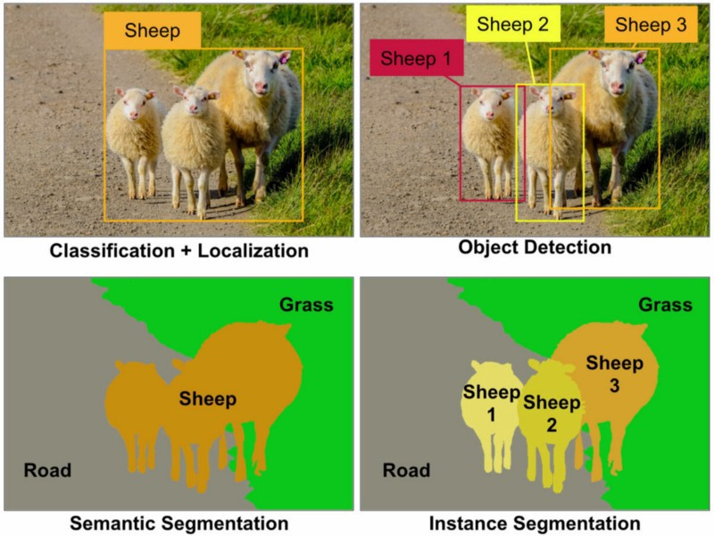]

.caption[Some of the main computer vision tasks.  Each of them requires a different neural network architecture.]

.footnote[Credits: [Aurélien Géron](https://www.oreilly.com/content/introducing-capsule-networks/), 2018.]

---

class: middle

# Classification

A few tips when using convnets for classifying images.

---

class: middle

## Convolutional neural networks

- Convolutional neural networks combine convolution, pooling and fully connected layers.
- They achieve state-of-the-art results for **spatially structured** data, such as images, sound or text.

.center.width-110[]

.footnote[Credits: [Dive Into Deep Learning](https://d2l.ai/), 2020.]

---

class: middle

For classification,
- the activation in the output layer is a Softmax activation producing a vector $\mathbf{h} \in \bigtriangleup^C$ of probability estimates $P(Y=i|\mathbf{x})$, where $C$ is the number of classes;
- the loss function is the cross-entropy loss.

---

class: middle

## Image augmentation

The lack of data is the biggest limit for performance of deep learning models.
- Collecting more data is usually expensive and laborious.
- Synthesizing data is complicated and may not represent the true distribution.
- **Augmenting** the data with base transformations is simple and efficient (e.g., as demonstrated with AlexNet).

---

class: middle

.center.width-100[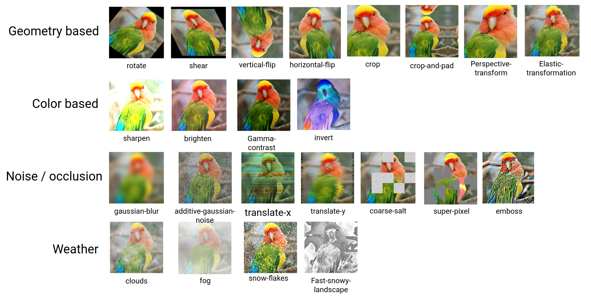]

.footnote[Credits: [DeepAugment](https://github.com/barisozmen/deepaugment), 2020.]

---

class: middle

.center.width-100[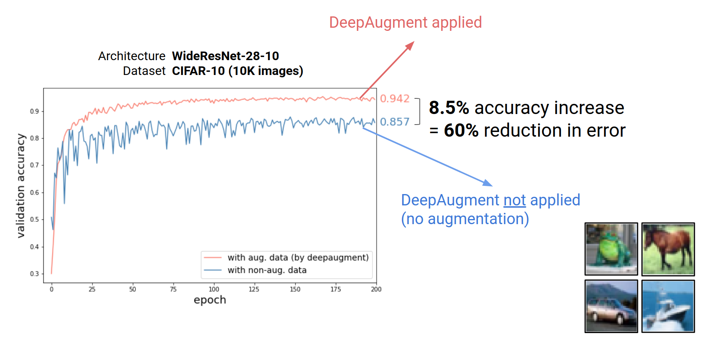]

.footnote[Credits: [DeepAugment](https://github.com/barisozmen/deepaugment), 2020.]

---

class: middle

## Pre-trained models

- Training a model on natural images, from scratch, takes **days or weeks**.
- Many models trained on ImageNet are publicly available for download. These models can be used as *feature extractors* or for smart *initialization*.
- The models themselves should be considered as generic and re-usable assets.

---

class: middle

## Transfer learning

- Take a pre-trained network, remove the last layer(s) and then treat the rest of the network as a **fixed** feature extractor.
- Train a model from these features on a new task.
- Often better than handcrafted feature extraction for natural images, or better than training from data of the new task only.

 
.center.width-100[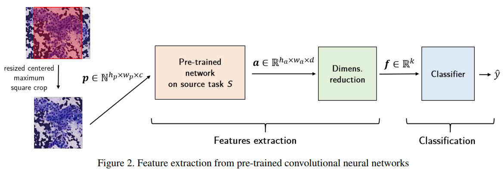]

.footnote[Credits: Mormont et al, [Comparison of deep transfer learning strategies for digital pathology](http://hdl.handle.net/2268/222511), 2018.]

---

class: middle

.center.width-65[]

## Fine-tuning

- Same as for transfer learning, but also *fine-tune* the weights of the pre-trained network by continuing backpropagation.
- All or only some of the layers can be tuned.

.footnote[Credits: [Dive Into Deep Learning](https://d2l.ai/), 2020.]

---

class: middle

In the case of models pre-trained on ImageNet, transferred/fine-tuned networks usually work even when the input images for the new task are not photographs of objects or animals, such as biomedical images, satellite images or paintings.

.center.width-70[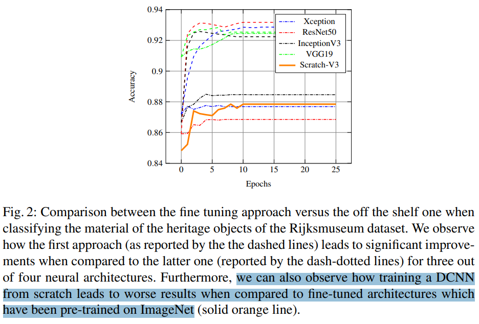]

.footnote[Credits: Matthia Sabatelli et al, [Deep Transfer Learning for Art Classification Problems](http://openaccess.thecvf.com/content_ECCVW_2018/papers/11130/Sabatelli_Deep_Transfer_Learning_for_Art_Classification_Problems_ECCVW_2018_paper.pdf), 2018.]

---

class: middle

# Object detection

---

class: middle

The simplest strategy to move from image classification to object detection is to classify local regions, at multiple scales and locations.

.center.width-80[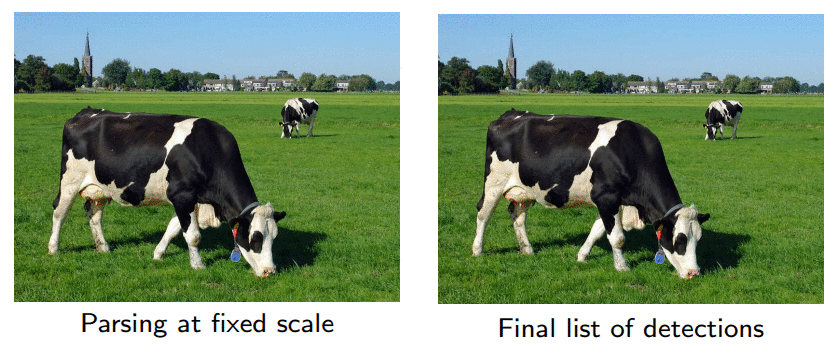]

.footnote[Credits: Francois Fleuret, [EE559 Deep Learning](https://fleuret.org/ee559/), EPFL.]

---

class: middle

## Intersection over Union (IoU)

A standard performance indicator for object detection is to evaluate the **intersection over union** (IoU) between a predicted bounding box $\hat{B}$ and an annotated bounding box $B$,
$$\text{IoU}(B,\hat{B}) = \frac{\text{area}(B \cap \hat{B})}{\text{area}(B \cup \hat{B})}.$$

.center.width-45[]

.footnote[Credits: Francois Fleuret, [EE559 Deep Learning](https://fleuret.org/ee559/), EPFL.]

---

class: middle 

## Mean Average Precision (mAP)

If $\text{IoU}(B,\hat{B})$ is larger than a fixed threshold (usually $\frac{1}{2}$), then the predicted bounding-box is valid (true positive) and wrong otherwise (false positive).

TP and FP values are accumulated for all thresholds on the predicted confidence.
The area under the resulting precision-recall curve is the *average precision* for the considered class.

The mean over the classes is the **mean average precision**.

.center.width-50[]

.footnote[Credits: [Rafael Padilla](https://github.com/rafaelpadilla/Object-Detection-Metrics), 2018.]

???

- Precision = TP / all detections 
- Recall = TP / all ground truths

---

class: middle 

The sliding window approach evaluates a classifier at large number of locations and scales. 

This approach is usually **very computationally expensive** as performance directly depends on the resolution and number of the windows fed to the classifier (the more the better, but also the more costly). 

---

# OverFeat 

.grid[
.kol-2-3[

- The complexity of the sliding window approach was mitigated in the pioneer OverFeat network (Sermanet et al, 2013) by adding a **regression head** to predict the object *bounding box* $(x,y,w,h)$.
- For training, the convolutional layers are fixed and the regression network is trained using an $\ell\_2$ loss between the predicted and the true bounding box for each example.
]
.kol-1-3[.center.width-100[]]
]

.footnote[Credits: Francois Fleuret, [EE559 Deep Learning](https://fleuret.org/ee559/), EPFL.]

---

class: middle

.center.width-80[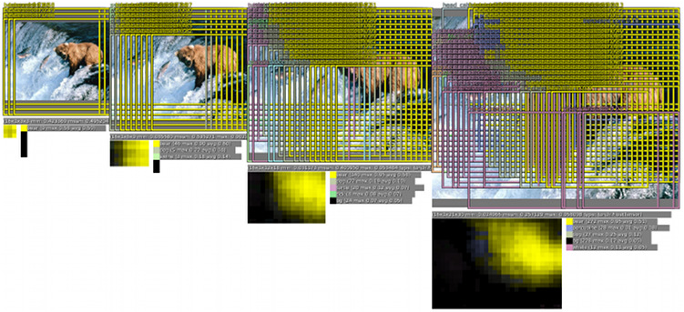]

The classifier head outputs a class and a confidence for each location and scale pre-defined from a coarse grid. Each window is resized to fit with the input dimensions of the classifier.

.footnote[Credits: Sermanet et al, 2013.]

---

class: middle

.center.width-80[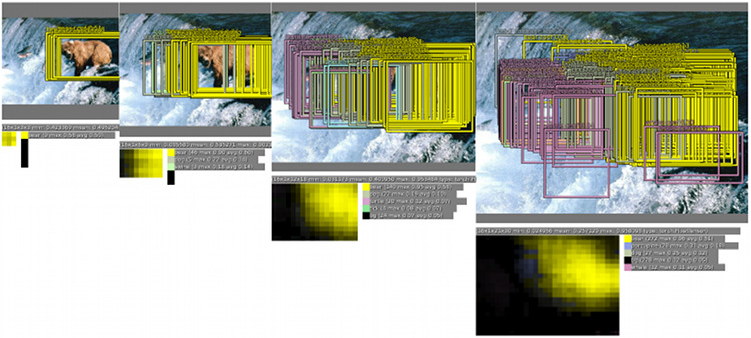]

The regression head then predicts the location of the object with respect to each window.

.footnote[Credits: Sermanet et al, 2013.]

---

class: middle

.center.width-60[]

These bounding boxes are finally merged with an *ad-hoc greedy procedure* to produce the final predictions over a small number of objects.

.footnote[Credits: Sermanet et al, 2013.]

---

class: middle

The OverFeat architecture can be adapted to object detection by adding a "background" class to the object classes.

Negative samples are taken in each scene either at random or by selecting the ones with the worst miss-classification.

.footnote[Credits: Francois Fleuret, [EE559 Deep Learning](https://fleuret.org/ee559/), EPFL.]

---

class: middle

Although OverFeat is one of the earliest successful networks for object detection, its architecture comes with several **drawbacks**:
- it is a disjoint system (2 disjoint heads with their respective losses, ad-hoc merging procedure);
- it optimizes for localization rather than detection;
- it cannot reason about global context and thus requires significant post-processing to produce coherent detections.

---

# YOLO

.center.width-65[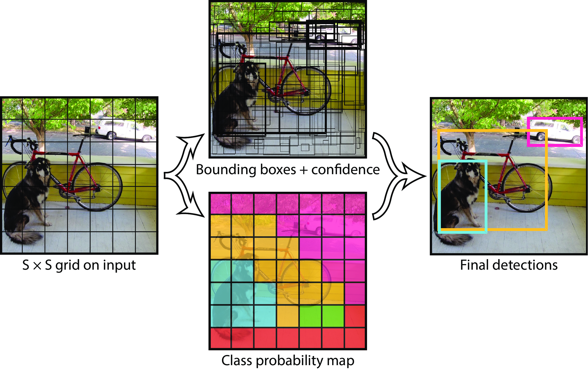]

YOLO (You Only Look Once; Redmon et al, 2015) models detection as a regression problem. 

It divides the image into an $S\times S$ grid and for each grid cell predicts $B$ bounding boxes, confidence for those boxes, and $C$ class probabilities. These predictions are encoded as an $S \times S \times (5B + C)$ tensor.

.footnote[Credits: Redmon et al, 2015.]

---

class: middle

For $S=7$, $B=2$, $C=20$, the network predicts a vector of size $30$ for each cell.

.center.width-100[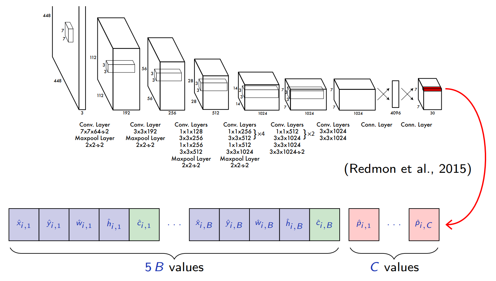]

.footnote[Credits: Francois Fleuret, [EE559 Deep Learning](https://fleuret.org/ee559/), EPFL.]

---

class: middle

The network predicts class scores and bounding-box regressions, and .bold[although the output comes from fully connected layers, it has a 2D structure].

- Unlike sliding window techniques, YOLO is therefore capable of reasoning globally about the image when making predictions. 
- It sees the entire image during training and test time, so it implicitly encodes contextual information about classes as well as their appearance.

.footnote[Credits: Francois Fleuret, [EE559 Deep Learning](https://fleuret.org/ee559/), EPFL.]

---

class: middle

During training, YOLO makes the assumptions that any of the $S\times S$ cells contains at most (the center of) a single object. We define for every image, cell index $i=1, ..., S\times S$, predicted box $j=1, ..., B$ and class index $c=1, ..., C$,
- $\mathbb{1}\_i^\text{obj}$ is $1$ if there is an object in cell $i$, and $0$ otherwise;
- $\mathbb{1}\_{i,j}^\text{obj}$ is $1$ if there is an object in cell $i$ and predicted box $j$ is the most fitting one, and $0$ otherwise;
- $p\_{i,c}$ is $1$ if there is an object of class $c$ in cell $i$, and $0$ and otherwise;
- $x\_i, y\_i, w\_i, h\_i$ the annoted bouding box (defined only if $\mathbb{1}\_i^\text{obj}=1$, and relative in location and scale to the cell);
- $c\_{i,j}$ is the IoU between the predicted box and the ground truth target.

.footnote[Credits: Francois Fleuret, [EE559 Deep Learning](https://fleuret.org/ee559/), EPFL.]

---

class: middle

The training procedure first computes on each image the value of the $\mathbb{1}\_{i,j}^\text{obj}$'s and $c\_{i,j}$, and then does one step to minimize the multi-part loss function
.smaller-x[
$$
\begin{aligned}
& \lambda\_\text{coord} \sum\_{i=1}^{S \times S} \sum\_{j=1}^B \mathbb{1}\_{i,j}^\text{obj} \left( (x\_i - \hat{x}\_{i,j})^2 + (y\_i - \hat{y}\_{i,j})^2 + (\sqrt{w\_i} - \sqrt{\hat{w}\_{i,j}})^2 + (\sqrt{h\_i} - \sqrt{\hat{h}\_{i,j}})^2\right)\\\\
& + \lambda\_\text{obj} \sum\_{i=1}^{S \times S} \sum\_{j=1}^B \mathbb{1}\_{i,j}^\text{obj} (c\_{i,j} - \hat{c}\_{i,j})^2 + \lambda\_\text{noobj} \sum\_{i=1}^{S \times S} \sum\_{j=1}^B (1-\mathbb{1}\_{i,j}^\text{obj}) \hat{c}\_{i,j}^2  \\\\
& + \lambda\_\text{classes} \sum\_{i=1}^{S \times S} \mathbb{1}\_i^\text{obj} \sum\_{c=1}^C (p\_{i,c} - \hat{p}\_{i,c})^2 
\end{aligned}
$$
]

where $\hat{p}\_{i,c}$, $\hat{x}\_{i,j}$, $\hat{y}\_{i,j}$, $\hat{w}\_{i,j}$, $\hat{h}\_{i,j}$ and $\hat{c}\_{i,j}$ are the network outputs.

.footnote[Credits: Francois Fleuret, [EE559 Deep Learning](https://fleuret.org/ee559/), EPFL.]

---

class: middle 

Training YOLO relies on many engineering choices that illustrate well how involved is deep learning in practice:

- pre-train the 20 first convolutional layers on ImageNet classification;
- use $448 \times 448$ input for detection, instead of $224 \times 224$;
- use Leaky ReLUs for all layers;
- dropout after the first convolutional layer;
- normalize bounding boxes parameters in $[0,1]$;
- use a quadratic loss not only for the bounding box coordinates, but also for the confidence and the class scores;
- reduce weight of large bounding boxes by using the square roots of the size in the loss;
- reduce the importance of empty cells by weighting less the confidence-related loss on them;
- data augmentation with scaling, translation and HSV transformation.

.footnote[Credits: Francois Fleuret, [EE559 Deep Learning](https://fleuret.org/ee559/), EPFL.]

---

class: middle, center, black-slide

<iframe width="600" height="450" src="https://www.youtube.com/embed/YmbhRxQkLMg" frameborder="0" allowfullscreen></iframe>

Redmon, 2017.

---

class: middle

## SSD

The Single Short Multi-box Detector (SSD; Liu et al, 2015) improves upon YOLO by using a fully-convolutional architecture and multi-scale maps.

.center.width-80[]

.footnote[Credits: Francois Fleuret, [EE559 Deep Learning](https://fleuret.org/ee559/), EPFL.]

---

# Region-based CNNs

An alternative strategy to having a huge predefined set of box proposals, as in OverFeat or YOLO, is to rely on *region proposals* first extracted from the image.

The main family of architectures following this principle are **region-based** convolutional neural networks:
- (Slow) R-CNN (Girshick et al, 2014)
- Fast R-CNN (Girshick et al, 2015)
- Faster R-CNN (Ren et al, 2015)
- Mask R-CNN (He et al, 2017)

---

class: middle

## R-CNN

This architecture is made of four parts:
1. Selective search is performed on the input image to select multiple high-quality region proposals.
2. A pre-trained CNN is selected and put before the output layer. It resizes each proposed region into the input dimensions required by the network and uses a forward pass to output features for the proposals.
3. The features are fed to an SVM for predicting the class.
4. The features are fed to a linear regression model for predicting the bounding-box.

.center.width-90[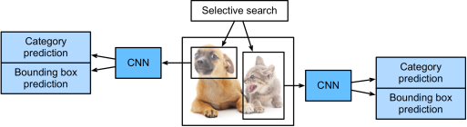]

.footnote[Credits: [Dive Into Deep Learning](https://d2l.ai/), 2020.]

---

class: middle

.center.width-80[]

Selective search (Uijlings et al, 2013) looks at the image through windows of different sizes, and for each size tries to group together adjacent pixels that are similar by texture, color or intensity.

---

class: middle

## Fast R-CNN

.grid[
.kol-3-5[
- The main performance bottleneck of an R-CNN model is the need to independently extract features for each proposed region.
- Fast R-CNN uses the entire image as input to the CNN for feature extraction, rather than each proposed region.
- Fast R-CNN introduces RoI pooling for producing feature vectors of fixed size from region proposals of different sizes.

]
.kol-2-5[.width-100[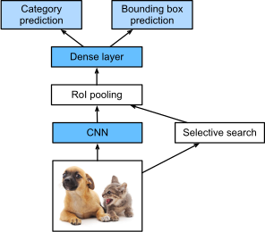]]
]

.footnote[Credits: [Dive Into Deep Learning](https://d2l.ai/), 2020.]

---

class: middle

.center.width-75[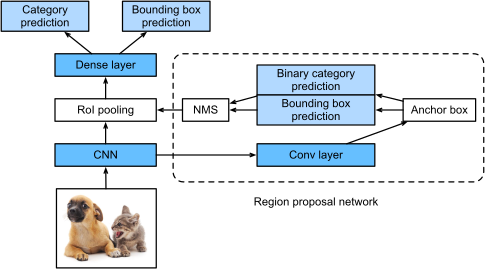]

## Faster R-CNN

- The performance of both R-CNN and Fast R-CNN is tied to the quality of the region proposals from selective search.
- Faster R-CNN replaces selective search with a region proposal network.
- This network reduces the number of proposed regions generated, while ensuring precise object detection.

.footnote[Credits: [Dive Into Deep Learning](https://d2l.ai/), 2020.]

---

class: middle, center, black-slide

<iframe width="600" height="450" src="https://www.youtube.com/embed/V4P_ptn2FF4" frameborder="0" allowfullscreen></iframe>

YOLO (v2) vs YOLO 9000 vs SSD vs Faster RCNN

---

class: middle

## Takeaways

- One-stage detectors (YOLO, SSD, RetinaNet, etc) are fast for inference but are usually not the most accurate object detectors.
- Two-stage detectors (Fast R-CNN, Faster R-CNN, R-FCN, Light head R-CNN, etc) are usually slower but are often more accurate.
- All networks depend on lots of engineering decisions.

---

class: middle

# Segmentation

---

class: middle

Semantic **segmentation** is the task of partitioning an image into regions of different semantic categories. 

These semantic regions label and predict objects at the pixel level.

.center.width-70[]

.footnote[Credits: [Dive Into Deep Learning](https://d2l.ai/), 2020.]

---

# Fully convolutional networks

The historical approach to image segmentation was to define a measure of
similarity between pixels, and to cluster groups of similar pixels. Such
approaches account poorly for semantic content.

The deep-learning approach re-casts semantic segmentation as pixel
classification, and re-uses networks trained for image classification by making
them **fully convolutional** (FCNs).

.footnote[Credits: Francois Fleuret, [EE559 Deep Learning](https://fleuret.org/ee559/), EPFL.]

---

class: middle

.center.width-100[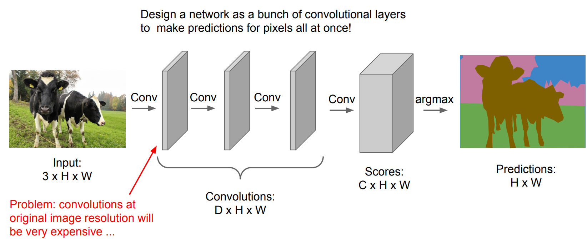]

.footnote[Credits: [CS231n, Lecture 11](http://cs231n.stanford.edu/slides/2018/cs231n_2018_lecture11.pdf), 2018.]

---

class: middle

.center.width-100[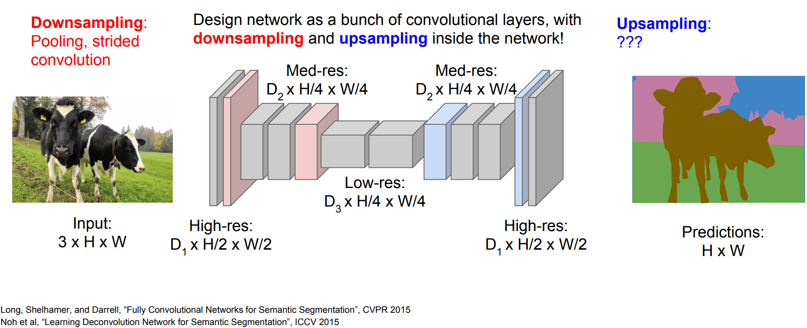]

.footnote[Credits: [CS231n, Lecture 11](http://cs231n.stanford.edu/slides/2018/cs231n_2018_lecture11.pdf), 2018.]

---

# Transposed convolution

The convolution and pooling layers introduced so far often reduce the input width and height, or keep them unchanged.
- Semantic segmentation requires to predict values for each pixel, and therefore needs to increase input width and height.
- Fully connected layers could be used for that purpose but would face the same limitations as before (spatial specialization, too many parameters).
- Ideally, we would like layers that implement the inverse of convolutional
 and pooling layers.

---

class: middle

A **transposed convolution** is a convolution where the implementation of the forward and backward passes
are swapped.

Given a convolutional kernel $\mathbf{u}$,
- the forward pass is implemented as $v(\mathbf{h}) = \mathbf{U}^T v(\mathbf{x})$ with appropriate reshaping, thereby effectively up-sampling an input $v(\mathbf{x})$ into a larger one;
- the backward pass is computed by multiplying the loss by $\mathbf{U}$ instead of $\mathbf{U}^T$.

Transposed convolutions are also referred to as fractionally-strided convolutions or deconvolutions (mistakenly).

.center.width-70[]

---

class: middle

.pull-right[  ]

$$
\begin{aligned}
\mathbf{U}^T v(\mathbf{x}) &= v(\mathbf{h}) \\\\
\begin{pmatrix}
1 & 0 & 0 & 0 \\\\
4 & 1 & 0 & 0 \\\\
1 & 4 & 0 & 0 \\\\
0 & 1 & 0 & 0 \\\\
1 & 0 & 1 & 0 \\\\
4 & 1 & 4 & 1 \\\\
3 & 4 & 1 & 4 \\\\
0 & 3 & 0 & 1 \\\\
3 & 0 & 1 & 0 \\\\
3 & 3 & 4 & 1 \\\\
1 & 3 & 3 & 4 \\\\
0 & 1 & 0 & 3 \\\\
0 & 0 & 3 & 0 \\\\
0 & 0 & 3 & 3 \\\\
0 & 0 & 1 & 3 \\\\
0 & 0 & 0 & 1
\end{pmatrix}
\begin{pmatrix}
2 \\\\
1 \\\\
4 \\\\
4
\end{pmatrix} &=
\begin{pmatrix}
2 \\\\
9 \\\\
6 \\\\
1 \\\\
6 \\\\
29 \\\\
30 \\\\
7 \\\\
10 \\\\
29 \\\\
33 \\\\
13 \\\\
12 \\\\
24 \\\\
16 \\\\
4
\end{pmatrix}
\end{aligned}$$

.footnote[Credits: Dumoulin and Visin, [A guide to convolution arithmetic for deep learning](https://arxiv.org/abs/1603.07285), 2016.]

---

# FCNs for segmentation

.grid[
.kol-3-4[
The simplest design of a fully convolutional network for semantic segmentation consists in:
- using a (pre-trained) convolutional network for downsampling and extracting image features;
- replacing the dense layers with a  $1 \times 1$ convolution layer to  transform the number of channels into the number of categories;
- upsampling the feature map to the size of the input image by using one (or several) transposed convolution layer(s).
]
.kol-1-4[.center.width-90[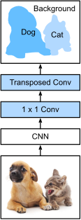]]
]

---

class: middle

Contrary to fully connected networks, the dimensions of the output of a fully convolutional network is not fixed. It directly depends on the dimensions of the input, which can be images of arbitrary sizes.

---

class: middle

.center.width-100[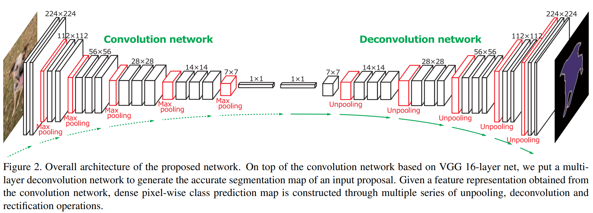]

.footnote[Credits: [Noh et al](https://arxiv.org/abs/1505.04366), 2015.]

---

class: middle

## UNet

The UNet architecture builds upon the previous FCN architecture. 

It consists in symmetric contraction and expansion paths, along with a concatenation of high resolution features from the contracting path to the unsampled features from the expanding path. These connections allow for localization.

.center.width-80[]

.footnote[Credits: [Ronneberger et al](https://arxiv.org/abs/1505.04597), 2015.]

---

class: middle

.center.width-50[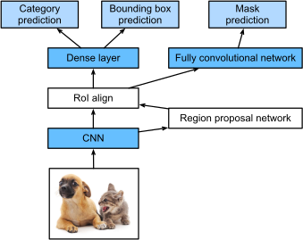]

## Mask R-CNN

Mask R-CNN extends the Faster R-CNN model for semantic segmentation. 
- The RoI pooling layer is replaced with an RoI alignment layer. 
- It branches off to an FCN for predicting a segmentation mask.
- Object detection combined with mask prediction enables *instance segmentation*.

.footnote[Credits: [Dive Into Deep Learning](https://d2l.ai/), 2020.]

---

class: middle

.center.width-100[]

.footnote[Credits: [He et al](https://arxiv.org/abs/1703.06870), 2017.]

---

class: middle, center, black-slide

<iframe width="600" height="450" src="https://www.youtube.com/embed/OOT3UIXZztE" frameborder="0" allowfullscreen></iframe>

---

class: middle

It is noteworthy that for detection and semantic segmentation, there is an heavy
re-use of large networks trained for classification.

.bold[The models themselves, as much as the source code of the algorithm that
produced them, or the training data, are generic and re-usable assets.]

.footnote[Credits: Francois Fleuret, [EE559 Deep Learning](https://fleuret.org/ee559/), EPFL.]

---

class: end-slide, center
count: false

The end.