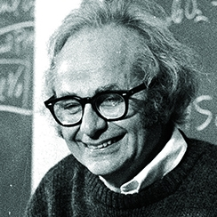
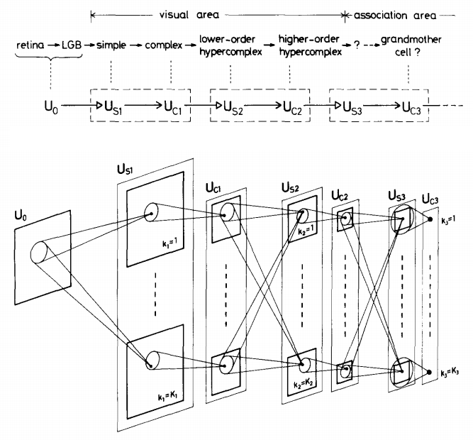
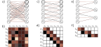
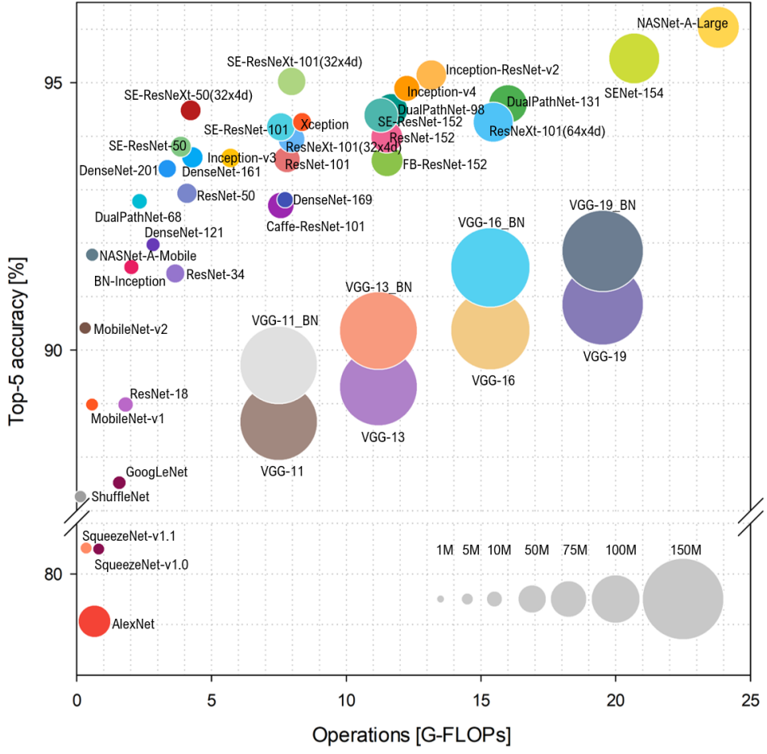
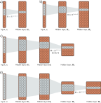
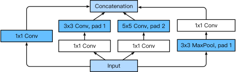
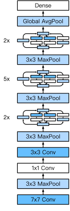
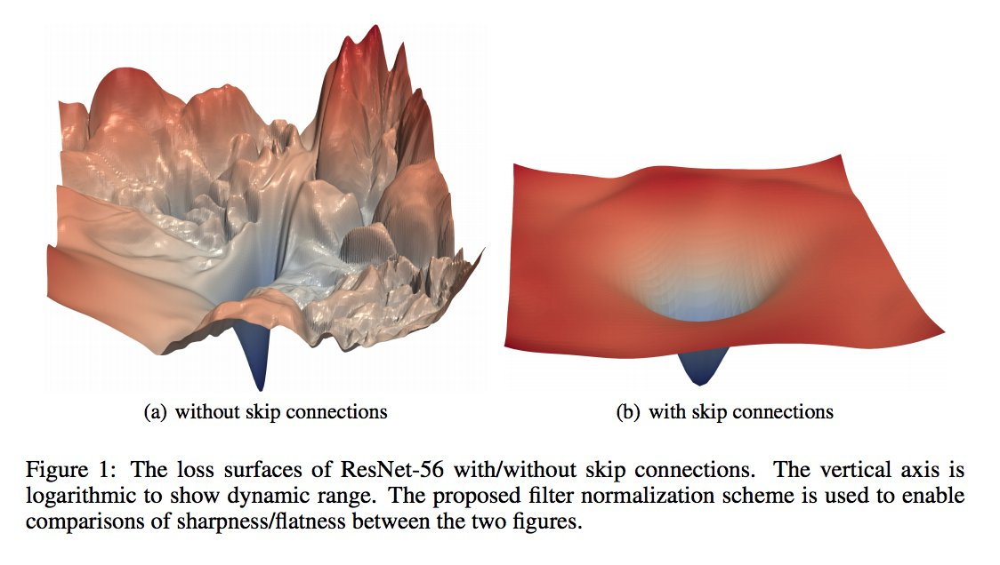
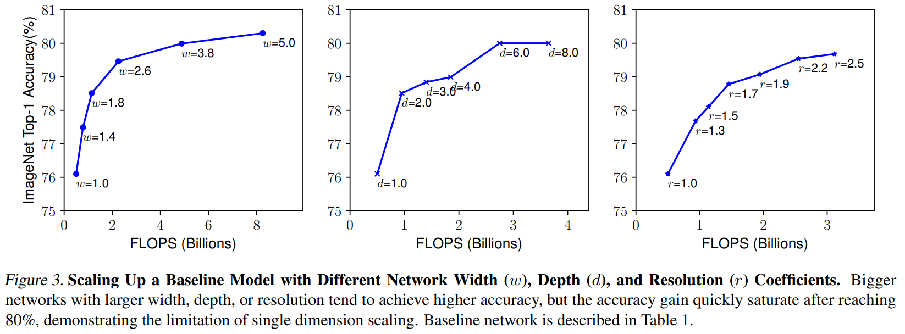
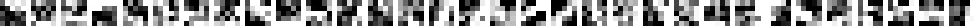

class: middle, center, title-slide

# Deep Learning

Lecture 5: Convolutional networks

  
Prof. Gilles Louppe 
[g.louppe@uliege.be](mailto:g.louppe@uliege.be)

---

count: false
class: middle

.center.width-60[]

---

# Today

How to **make neural networks see**?

- Visual perception
- Convolutions
- Pooling
- Convolutional networks

---

class: middle

# Visual perception

---

# Visual perception 

In 1959-1962, David Hubel and Torsten Wiesel identify the neural basis of information processing in the **visual system**.
They are awarded the Nobel Prize of Medicine in 1981 for their discovery.

.grid.center[
.kol-4-5.center[.width-80[]]
.kol-1-5[ .width-100.circle[].width-100.circle[]]
]

---

class: middle, black-slide

.center[

<iframe width="640" height="480" src="https://www.youtube.com/embed/IOHayh06LJ4?&loop=1&start=0" frameborder="0" volume="0" allowfullscreen></iframe>

]

???

During their recordings, they noticed a few interesting things:
1. the neurons fired only when the line was in a particular place on the retina,
2. the activity of these neurons changed depending on the orientation of the line, and
3. sometimes the neurons fired only when the line was moving in a particular direction.

---

class: middle, black-slide

.center[

<iframe width="640" height="480" src="https://www.youtube.com/embed/OGxVfKJqX5E?&loop=1" frameborder="0" volume="0" allowfullscreen></iframe>

]

---

# Inductive biases 

Can we equip neural networks with **inductive biases** tailored for vision?

- Locality (as in simple cells)
- Invariance translation (as in complex cells)
- Hierarchical compositionality (as in hypercomplex cells)

---

class: middle

.center.width-100[]

.center[Invariance and equivariance to translation.]

.footnote[Credits: Simon J.D. Prince, [Understanding Deep Learning](https://udlbook.github.io/udlbook/), 2023.]

???

- The classification of the shifted image should be the same as the classification of the original image. 
- The segmentation of the shifted image should be the shifted segmentation of the original image.

---

class: middle

## Neocognitron 

In 1980, Fukushima proposes a direct neural network implementation of the hierarchy model of the visual nervous system of Hubel and Wiesel.

.grid[
.kol-2-3.width-90.center[]
.kol-1-3[

- Built upon **convolutions** and enables the composition of a *feature hierarchy*.
- Biologically-inspired training algorithm, which proves to be largely **inefficient**.

]
]

.footnote[Credits: Kunihiko Fukushima, [Neocognitron: A Self-organizing Neural Network Model](https://www.rctn.org/bruno/public/papers/Fukushima1980.pdf), 1980.]

---

class: middle

## Convolutional networks 

In the 1980-90s, LeCun trains a convolutional network by backpropagation.
He advocates for end-to-end feature learning in image classification.

 
.center.width-70[]

.footnote[Credits: LeCun et al, [Handwritten Digit Recognition with a Back-Propagation Network](http://yann.lecun.com/exdb/publis/pdf/lecun-90c.pdf), 1990.]

---

class: middle

# Convolutions

---

# Convolutional layers

A convolutional layer applies the same linear transformation locally everywhere while preserving the signal structure.

 
.center.width-65[]

.footnote[Credits: Francois Fleuret, [EE559 Deep Learning](https://fleuret.org/ee559/), EPFL.]

???

Draw vertically.

---

class: middle

## 1d convolution

For the one-dimensional input $\mathbf{x} \in \mathbb{R}^W$ and the convolutional kernel $\mathbf{u} \in \mathbb{R}^w$, the discrete **convolution** $\mathbf{x} \circledast \mathbf{u}$ is a vector of size $W - w + 1$ such that
$$\begin{aligned}
(\mathbf{x} \circledast \mathbf{u})[i] &= \sum\_{m=0}^{w-1} \mathbf{x}\_{m+i}  \mathbf{u}\_m .
\end{aligned}
$$

.italic[
Technically, $\circledast$ denotes the cross-correlation operator.
However, most machine learning libraries call it convolution.
]

---

class: middle 

Convolutions can implement differential operators:
$$(0,0,0,0,1,2,3,4,4,4,4) \circledast (-1,1) = (0,0,0,1,1,1,1,0,0,0) $$
.center.width-100[]
or crude template matchers:
$$(0, 0, 3, 0, 0, 0, 0, 0, 3, 0, 3, 0, 0, 0) \circledast (1, 0, 1) = (3, 0, 3, 0, 0, 0, 3, 0, 6, 0, 3, 0)$$
.center.width-100[]

.footnote[Credits: Francois Fleuret, [EE559 Deep Learning](https://fleuret.org/ee559/), EPFL.]

---

class: middle

## 2d convolution

For the 2d input tensor $\mathbf{x} \in \mathbb{R}^{H \times W}$ and the 2d convolutional kernel $\mathbf{u} \in \mathbb{R}^{h \times w}$, the discrete **convolution** $\mathbf{x} \circledast \mathbf{u}$ is a matrix of size $(H-h+1) \times (W-w+1)$ such that
$$(\mathbf{x} \circledast \mathbf{u})[j,i] = \sum\_{n=0}^{h-1} \sum\_{m=0}^{w-1}    \mathbf{x}\_{n+j,m+i} \mathbf{u}\_{n,m}$$

???

Draw: Explain the intuition behind the sum of element-wise products which reduces to an inner product between the kernel and a region of the input.

---

class: middle

## Channels

The 2d convolution can be extended to tensors with multiple channels.

For the 3d input tensor $\mathbf{x} \in \mathbb{R}^{C \times H \times W}$ and the 3d convolutional kernel $\mathbf{u} \in \mathbb{R}^{C \times h \times w}$, the discrete **convolution** $\mathbf{x} \circledast \mathbf{u}$ is a tensor of size $(H-h+1) \times (W-w+1)$ such that
$$(\mathbf{x} \circledast \mathbf{u})[j,i] = \sum\_{c=0}^{C-1}\sum\_{n=0}^{h-1} \sum\_{m=0}^{w-1}    \mathbf{x}\_{c,n+j,m+i} \mathbf{u}\_{c,n,m}$$

---

class: middle

## Convolutional layers

A convolutional layer is defined by a set of $K$ kernels $\mathbf{u}\_k$ of size $C \times h \times w$. It applies the 2d convolution operation to the input tensor $\mathbf{x}$ of size $C \times H \times W$ to produce a set of $K$ feature maps $\mathbf{o}\_k$.

---

class: middle

.center[]

.footnote[Credits: Francois Fleuret, [EE559 Deep Learning](https://fleuret.org/ee559/), EPFL.]

---

class: middle

Convolutions have three additional parameters:
- The padding specifies the size of a zeroed frame added arount the input.
- The stride specifies a step size when moving the kernel across the signal.
- The dilation modulates the expansion of the filter without adding weights.

.footnote[Credits: Francois Fleuret, [EE559 Deep Learning](https://fleuret.org/ee559/), EPFL.]

---

class: middle

## Padding

Padding is useful to control the spatial dimension of the output feature map, for example to keep it constant across layers.

.center[
.width-45[]
.width-45[]
]

.footnote[Credits: Dumoulin and Visin, [A guide to convolution arithmetic for deep learning](https://arxiv.org/abs/1603.07285), 2016.]

---

class: middle

## Strides

Stride is useful to reduce the spatial dimension of the feature map by a constant factor.

.center[
.width-45[]
]

.footnote[Credits: Dumoulin and Visin, [A guide to convolution arithmetic for deep learning](https://arxiv.org/abs/1603.07285), 2016.]

---

class: middle 

## Dilation

The dilation modulates the expansion of the kernel support by adding rows and columns of zeros between coefficients. 

Having a dilation coefficient greater than one increases the units receptive field size without increasing the number of parameters. 

.center[
.width-45[]
]

.footnote[Credits: Dumoulin and Visin, [A guide to convolution arithmetic for deep learning](https://arxiv.org/abs/1603.07285), 2016.]

---

class: middle

## Equivariance

Formally, a function $f$ is equivariant to $g$ if $f(g(\mathbf{x})) = g(f(\mathbf{x}))$.

Parameter sharing used in a convolutional layer causes the layer to be equivariant to translation.

.center.width-75[]

.caption[If an object moves in the input image, its representation will move the same amount in the output.]

.footnote[Credits: LeCun et al, Gradient-based learning applied to document recognition, 1998.]

???

- Equivariance is useful when we know some local function is useful everywhere (e.g., edge detectors).
- Convolution is not equivariant to other operations such as change in scale or rotation.

---

# Convolutions as matrix multiplications

As a guiding example, let us consider the convolution of single-channel tensors $\mathbf{x} \in \mathbb{R}^{4 \times 4}$ and $\mathbf{u} \in \mathbb{R}^{3 \times 3}$:

$$
\mathbf{x} \circledast \mathbf{u} =
\begin{pmatrix}
4 & 5 & 8 & 7 \\\\
1 & 8 & 8 & 8 \\\\
3 & 6 & 6 & 4 \\\\
6 & 5 & 7 & 8
\end{pmatrix} \circledast \begin{pmatrix}
1 & 4 & 1 \\\\
1 & 4 & 3 \\\\
3 & 3 & 1
\end{pmatrix} =
\begin{pmatrix}
122 & 148 \\\\
126 & 134
\end{pmatrix}$$

???

Do this on the tablet for 1D convolutions. Draw the MLP and Wx product.

---

class: middle

The convolution operation can be equivalently re-expressed as a single matrix multiplication:
- the convolutional kernel $\mathbf{u}$ is rearranged as a **sparse Toeplitz circulant matrix**, called the convolution matrix:
$$\mathbf{U} = \begin{pmatrix}
1 & 4 & 1 & 0 & 1 & 4 & 3 & 0 & 3 & 3 & 1 & 0 & 0 & 0 & 0 & 0 \\\\
0 & 1 & 4 & 1 & 0 & 1 & 4 & 3 & 0 & 3 & 3 & 1 & 0 & 0 & 0 & 0 \\\\
0 & 0 & 0 & 0 & 1 & 4 & 1 & 0 & 1 & 4 & 3 & 0 & 3 & 3 & 1 & 0 \\\\
0 & 0 & 0 & 0 & 0 & 1 & 4 & 1 & 0 & 1 & 4 & 3 & 0 & 3 & 3 & 1
\end{pmatrix}$$
- the input $\mathbf{x}$ is flattened row by row, from top to bottom:
$$v(\mathbf{x}) =
\begin{pmatrix}
4 & 5 & 8 & 7 & 1 & 8 & 8 & 8 & 3 & 6 & 6 & 4 & 6 & 5 & 7 & 8
\end{pmatrix}^T$$

Then,
$$\mathbf{U}v(\mathbf{x}) =
\begin{pmatrix}
122 & 148 & 126 & 134
\end{pmatrix}^T$$
which we can reshape to a $2 \times 2$ matrix to obtain $\mathbf{x} \circledast \mathbf{u}$.

---

class: middle

The same procedure generalizes to $\mathbf{x} \in \mathbb{R}^{H \times W}$ and convolutional kernel $\mathbf{u} \in \mathbb{R}^{h \times w}$, such that:
- the convolutional kernel is rearranged as a sparse Toeplitz circulant matrix $\mathbf{U}$ of shape $(H-h+1)(W-w+1) \times HW$ where
    - each row $i$ identifies an element of the output feature map,
    - each column $j$ identifies an element of the input feature map,
    - the value $\mathbf{U}\_{i,j}$ corresponds to the kernel value the element $j$ is multiplied with in output $i$;
- the input $\mathbf{x}$ is flattened into a column vector $v(\mathbf{x})$ of shape $HW \times 1$;
- the output feature map $\mathbf{x} \circledast \mathbf{u}$ is obtained by reshaping the $(H-h+1)(W-w+1) \times 1$ column vector $\mathbf{U}v(\mathbf{x})$ as a $(H-h+1) \times (W-w+1)$ matrix.

Therefore, a convolutional layer is a special case of a fully
connected layer: $$\mathbf{h} = \mathbf{x} \circledast \mathbf{u} \Leftrightarrow v(\mathbf{h}) = \mathbf{U}v(\mathbf{x}) \Leftrightarrow  v(\mathbf{h}) = \mathbf{W}^T v(\mathbf{x})$$

???

Insist on how inductive biases are enforced through architecture:
- locality is enforced through sparsity and band structure
- equivariance is enforced through replication and weight sharing

---

class: middle

.center.width-100[]

.center[Fully connected vs convolutional layers.]

.footnote[Credits: Simon J.D. Prince, [Understanding Deep Learning](https://udlbook.github.io/udlbook/), 2023.]

---

class: middle 

# Pooling 

---

class: middle

When the input volume is large, **pooling layers** can be used to reduce the input dimension while
preserving its global structure, in a way similar to a down-scaling operation.

---

# Pooling

Consider a pooling area of size $h \times w$ and a 3d input tensor $\mathbf{x} \in \mathbb{R}^{C\times(rh)\times(sw)}$.
- Max-pooling produces a tensor $\mathbf{o} \in \mathbb{R}^{C \times r \times s}$
such that
$$\mathbf{o}\_{c,j,i} = \max\_{n < h, m < w} \mathbf{x}_{c,rj+n,si+m}.$$
- Average pooling produces a tensor $\mathbf{o} \in \mathbb{R}^{C \times r \times s}$ such that
$$\mathbf{o}\_{c,j,i} = \frac{1}{hw} \sum\_{n=0}^{h-1} \sum\_{m=0}^{w-1} \mathbf{x}_{c,rj+n,si+m}.$$

Pooling is very similar in its formulation to convolution.

---

class: middle

.center[]

.footnote[Credits: Francois Fleuret, [EE559 Deep Learning](https://fleuret.org/ee559/), EPFL.]

---

class: middle

## Invariance

Formally, a function $f$ is invariant to $g$ if $f(g(\mathbf{x})) = f(\mathbf{x})$.

Pooling layers provide invariance to any permutation inside one cell, which results in (pseudo-)invariance to local translations.

.center.width-60[]

.footnote[Credits: Francois Fleuret, [EE559 Deep Learning](https://fleuret.org/ee559/), EPFL.]

???

This helpful if we care more about the presence of a pattern rather than its exact position.

---

class: middle

# Convolutional networks

---

class: middle

A **convolutional network** is generically defined as a composition of convolutional layers ($\texttt{CONV}$), pooling layers ($\texttt{POOL}$), linear rectifiers ($\texttt{ReLU}$) and fully connected layers ($\texttt{FC}$).

.center.width-100[]

---

class: middle

The most common convolutional network architecture follows the pattern:

$$\texttt{INPUT} \to [[\texttt{CONV} \to \texttt{ReLU}]\texttt{\*}N \to \texttt{POOL?}]\texttt{\*}M \to [\texttt{FC} \to \texttt{ReLU}]\texttt{\*}K \to \texttt{FC}$$

where:
- $\texttt{\*}$ indicates repetition;
- $\texttt{POOL?}$ indicates an optional pooling layer;
- $N \geq 0$ (and usually $N \leq 3$), $M \geq 0$, $K \geq 0$ (and usually $K < 3$);
- the last fully connected layer holds the output (e.g., the class scores).

---

class: middle

Some common architectures for convolutional networks following this pattern include:
- $\texttt{INPUT} \to \texttt{FC}$, which implements a linear classifier ($N=M=K=0$).
- $\texttt{INPUT} \to [\texttt{FC} \to \texttt{ReLU}]{\*K} \to \texttt{FC}$, which implements a $K$-layer MLP.
- $\texttt{INPUT} \to \texttt{CONV} \to \texttt{ReLU} \to \texttt{FC}$.
- $\texttt{INPUT} \to [\texttt{CONV} \to \texttt{ReLU} \to \texttt{POOL}]\texttt{\*2} \to \texttt{FC} \to \texttt{ReLU} \to \texttt{FC}$.
- $\texttt{INPUT} \to [[\texttt{CONV} \to \texttt{ReLU}]\texttt{\*2} \to \texttt{POOL}]\texttt{\*3} \to [\texttt{FC} \to \texttt{ReLU}]\texttt{\*2} \to \texttt{FC}$.

???

Note that for the last architecture, two $\texttt{CONV}$ layers are stacked before every $\texttt{POOL}$ layer. This is generally a good idea for larger and deeper networks, because multiple stacked $\texttt{CONV}$  layers can develop more complex features of the input volume before the destructive pooling operation.

---

class: center, middle, black-slide

.width-100[]

---

class: middle, center

(demo)

???

https://poloclub.github.io/cnn-explainer/

Notebook `lec5`.

---

# Architectures (some)

.center.width-70[]

.footnote[Credits: [Bianco et al](https://arxiv.org/abs/1810.00736), 2018.]

---

class: middle

## LeNet-5 (LeCun et al, 1998)

Composition of two $\texttt{CONV}+\texttt{POOL}$ layers, followed by a block of fully-connected layers.

.center.width-110[]

.footnote[Credits: [Dive Into Deep Learning](https://d2l.ai/), 2020.]

---

class: middle, black-slide

.center[

<iframe width="640" height="480" src="https://www.youtube.com/embed/FwFduRA_L6Q?&loop=1&start=0" frameborder="0" volume="0" allowfullscreen></iframe>

]

.center[LeNet-1 (LeCun et al, 1993)]

---

class: middle

.grid[
.kol-3-5[
    

## AlexNet (Krizhevsky et al, 2012)

Composition of a 8-layer convolutional neural network with a 3-layer MLP.

The original implementation was made of two parts such that it could fit within two GPUs.
]
.kol-2-5.center[.width-100[]
.caption[LeNet vs. AlexNet]
]
]

.footnote[Credits: [Dive Into Deep Learning](https://d2l.ai/), 2020.]

---

class: middle

.grid[
.kol-2-5[
   

## VGG (Simonyan and Zisserman, 2014)

Composition of 5 VGG blocks consisting of $\texttt{CONV}+\texttt{POOL}$ layers, followed by a block of fully connected layers.

The network depth increased up to 19 layers, while the kernel sizes reduced to 3.
]
.kol-3-5.center[.width-100[]
.caption[AlexNet vs. VGG]
]
]

.footnote[Credits: [Dive Into Deep Learning](https://d2l.ai/), 2020.]

---

class: middle

The .bold[effective receptive field] is the part of the visual input that affects a given unit indirectly through previous convolutional layers. 
- It grows linearly with depth when chaining convolutional layers.
- It grows exponentially with depth when pooling layers (or strided convolutions) are interleaved with convolutional layers.

---

class: middle

.center.width-75[]

.footnote[Credits: Simon J.D. Prince, [Understanding Deep Learning](https://udlbook.github.io/udlbook/), 2023.]

---

exclude: true
class: middle

.grid[
.kol-4-5[
## GoogLeNet (Szegedy et al, 2014)

Composition of two $\texttt{CONV}+\texttt{POOL}$ layers, a stack of 9 inception blocks, and a global average pooling layer.

Each inception block is itself defined as a convolutional network with 4 parallel paths.

.center.width-80[]
.caption[Inception block]
]
.kol-1-5.center[.width-100[]]
]

.footnote[Credits: [Dive Into Deep Learning](https://d2l.ai/), 2020.]

---

class: middle

.grid[
.kol-4-5[

## ResNet (He et al, 2015)

Composition of convolutional and pooling layers organized in a stack of residual blocks. Extensions consider more residual blocks, up to a total of 152 layers (ResNet-152).

.center.width-80[]
.center.caption[Regular ResNet block vs. ResNet block with $1\times 1$ convolution.]
]
.kol-1-5[.center.width-100[]]
]

.footnote[Credits: [Dive Into Deep Learning](https://d2l.ai/), 2020.]

---

class: middle

Training networks of this depth is made possible because of the .bold[skip connections] $\mathbf{h} = \mathbf{x} + f(\mathbf{x})$ in the residual blocks. They allow the gradients to shortcut the layers and pass through without vanishing.

.center.width-60[]

.footnote[Credits: [Dive Into Deep Learning](https://d2l.ai/), 2020.]

---

class: middle

.center.width-100[]

---

class: middle

## The benefits of depth

.center.width-100[]

---

class: middle

## ... and width and resolution (Tan and Le, 2019)

.center.width-100[]

.footnote[Credits: [Tan and Le](https://arxiv.org/abs/1905.11946.pdf), 2019.]

???

We empirically observe that different scaling dimensions are
not independent. Intuitively, for higher resolution images,
we should increase network depth, such that the larger receptive fields can help capture similar features that include
more pixels in bigger images. Correspondingly, we should
also increase network width when resolution is higher, in
order to capture more fine-grained patterns with more pixels
in high resolution images. These intuitions suggest that we
need to coordinate and balance different scaling dimensions
rather than conventional single-dimension scaling

---

exclude: true
class: middle

.center.width-100[]

.footnote[Credits: [Tan and Le](https://arxiv.org/abs/1905.11946.pdf), 2019.]

---

class: middle

# Under the hood

---

class: middle

Understanding what is happening in deep neural networks after training is complex and the tools we have are limited.

In the case of convolutional neural networks, we can look at:
- the network's kernels as images
- internal activations on a single sample as images
- distributions of activations on a population of samples
- derivatives of the response with respect to the input
- maximum-response synthetic samples

.footnote[Credits: Francois Fleuret, [EE559 Deep Learning](https://fleuret.org/ee559/), EPFL.]

---

# Looking at filters

     

LeNet's first convolutional layer, all filters.

.width-100[]

.footnote[Credits: Francois Fleuret, [EE559 Deep Learning](https://fleuret.org/ee559/), EPFL.]

---

class: middle

LeNet's second convolutional layer, first 32 filters.

.center.width-70[]

.footnote[Credits: Francois Fleuret, [EE559 Deep Learning](https://fleuret.org/ee559/), EPFL.]

---

class: middle

AlexNet's first convolutional layer, first 20 filters.

.center.width-100[]

.footnote[Credits: Francois Fleuret, [EE559 Deep Learning](https://fleuret.org/ee559/), EPFL.]

---

# Maximum response samples

Convolutional networks can be inspected by looking for synthetic input images $\mathbf{x}$ that maximize the activation $\mathbf{h}_{\ell,d}(\mathbf{x})$ of a chosen convolutional kernel $\mathbf{u}$ at layer $\ell$ and index $d$ in the layer filter bank.

These samples can be found by gradient ascent on the input space:

$$
\begin{aligned}
\mathcal{L}\_{\ell,d}(\mathbf{x}) &= ||\mathbf{h}\_{\ell,d}(\mathbf{x})||\_2\\\\
\mathbf{x}\_0 &\sim U[0,1]^{C \times H \times W } \\\\
\mathbf{x}\_{t+1} &= \mathbf{x}\_t + \gamma \nabla\_{\mathbf{x}} \mathcal{L}\_{\ell,d}(\mathbf{x}\_t)
\end{aligned}
$$

Here, $\mathcal{L}\_{\ell,d}(\mathbf{x})$ represents the L2 norm of the activation $\mathbf{h}\_{\ell,d}(\mathbf{x})$, $\mathbf{x}\_0$ is the initial random input, $\mathbf{x}\_{t+1}$ is the updated input at iteration $t+1$, and $\gamma$ is the learning rate.

---

class: middle

.width-100[]

.center[VGG-16, convolutional layer 1-1, a few of the 64 filters]

.footnote[Credits: Francois Chollet, [How convolutional neural networks see the world](https://blog.keras.io/how-convolutional-neural-networks-see-the-world.html), 2016.]

---

class: middle
count: false

.width-100[]

.center[VGG-16, convolutional layer 2-1, a few of the 128 filters]

.footnote[Credits: Francois Chollet, [How convolutional neural networks see the world](https://blog.keras.io/how-convolutional-neural-networks-see-the-world.html), 2016.]

---

class: middle
count: false

.width-100[]

.center[VGG-16, convolutional layer 3-1, a few of the 256 filters]

.footnote[Credits: Francois Chollet, [How convolutional neural networks see the world](https://blog.keras.io/how-convolutional-neural-networks-see-the-world.html), 2016.]

---

class: middle
count: false

.width-100[]

.center[VGG-16, convolutional layer 4-1, a few of the 512 filters]

.footnote[Credits: Francois Chollet, [How convolutional neural networks see the world](https://blog.keras.io/how-convolutional-neural-networks-see-the-world.html), 2016.]

---

class: middle
count: false

.width-100[]

.center[VGG-16, convolutional layer 5-1, a few of the 512 filters]

.footnote[Credits: Francois Chollet, [How convolutional neural networks see the world](https://blog.keras.io/how-convolutional-neural-networks-see-the-world.html), 2016.]

---

class: middle

The network appears to learn a hierarchical composition of patterns:
- The first layers of the network seem to encode basic features such as direction and color.
- These basic features are then combined to form more complex textures, such as grids and spots.
- Finally, these textures are further combined to create increasingly intricate patterns.

.width-50.center[]

---

exclude: true

   

What if we build images that maximize the activation of a chosen class output?

--

exclude: true
count: false

The left image is predicted **with 99.9% confidence** as a magpie!

.grid[
.kol-1-2.center[]
.kol-1-2.center[]
]

.footnote[Credits: Francois Chollet, [How convolutional neural networks see the world](https://blog.keras.io/how-convolutional-neural-networks-see-the-world.html), 2016.]

---

exclude: true
class: middle, black-slide

.center[

<iframe width="600" height="400" src="https://www.youtube.com/embed/SCE-QeDfXtA?&loop=1&start=0" frameborder="0" volume="0" allowfullscreen></iframe>

]

.bold[Deep Dream.] Start from an image $\mathbf{x}\_t$, offset by a random jitter, enhance some layer activation at multiple scales, zoom in, repeat on the produced image $\mathbf{x}\_{t+1}$.

---

# Biological plausibility

.center.width-80[]

.italic["Deep hierarchical neural networks are beginning to transform
neuroscientists’ ability to produce quantitatively accurate computational
models of the sensory systems, especially in higher cortical areas
where neural response properties had previously been enigmatic."]

.footnote[Credits: Yamins et al, Using goal-driven deep learning models to understand
sensory cortex, 2016.]

---

class: end-slide, center
count: false

The end.

???

Checklist: You want to classify cats and dogs. 
- What kind of network would you use?
- What architecture would you use? (list of layers, output size, etc)
- What size of kernels would you use? How many kernels per layer?
- What kind of pooling would you use?
- What kind of activation function would you use?
- What loss function would you use?
- How would you initialize the weights?
- How would you train the network?