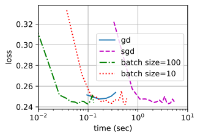
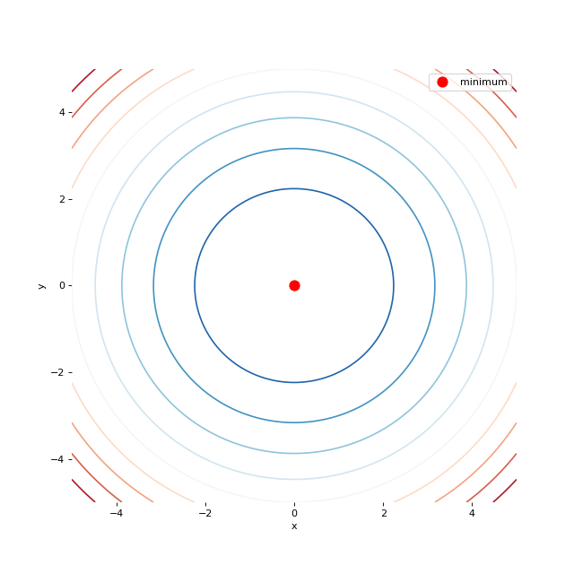
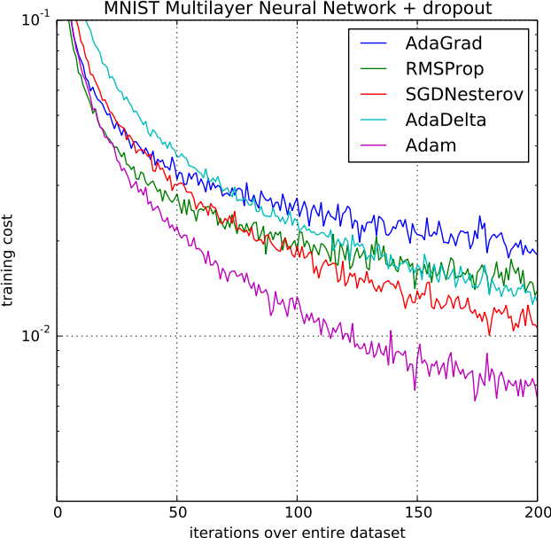
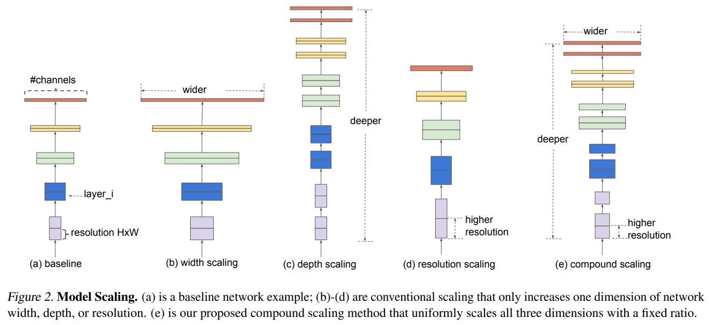
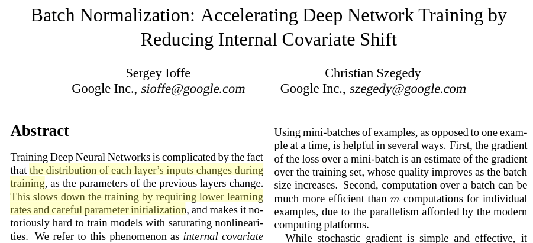

class: middle, center, title-slide

# Deep Learning

Lecture 5: Training neural networks

  
Prof. Gilles Louppe 
[g.louppe@uliege.be](mailto:g.louppe@uliege.be)

---

# Today

How to **optimize parameters** efficiently?

- Optimizers
- Initialization
- Normalization

---

class: middle

## A practical recommendation

Training a massive deep neural network is long, complex and sometimes confusing. 

A first step towards understanding, debugging and optimizing neural networks is to make use of visualization tools such as TensorBoard for
- plotting losses and metrics, 
- visualizing computational graphs,
- or show additional data as the network is being trained.

.center.width-45[]

---

class: middle

# Optimizers

---

# Gradient descent

To minimize a loss $\mathcal{L}(\theta)$ of the form
$$\mathcal{L}(\theta) = \frac{1}{N} \sum\_{n=1}^N \ell(y\_n, f(\mathbf{x}\_n; \theta)),$$
standard **batch gradient descent** (GD) consists in applying the update rule
$$\begin{aligned}
g\_t &= \frac{1}{N} \sum\_{n=1}^N \nabla\_\theta \ell(y\_n, f(\mathbf{x}\_n; \theta\_t)) \\\\
\theta\_{t+1} &= \theta\_t - \gamma g\_t,
\end{aligned}$$
where $\gamma$ is the learning rate.

---

class: middle

.center[
<video loop controls preload="auto" height="600" width="600">
  <source src="./figures/lec5/opt-gd.mp4" type="video/mp4">
</video>
]

---

class: middle

While it makes sense to compute the gradient exactly,
- it takes time to compute and becomes inefficient for large $N$,
- it is an empirical estimation of an hidden quantity (the expected risk), and any partial sum is also an unbiased estimate, although of greater variance.

.footnote[Credits: Francois Fleuret, [EE559 Deep Learning](https://fleuret.org/ee559/), EPFL.]

---

class: middle

To illustrate how partial sums are good estimates, consider an ideal case where the training set is the same set of $M \ll N$ samples replicated $K$ times. Then,
$$\begin{aligned}
\mathcal{L}(\theta) &= \frac{1}{N} \sum\_{i=n}^N \ell(y\_n, f(\mathbf{x}\_n; \theta)) \\\\
&=\frac{1}{N} \sum\_{k=1}^K \sum\_{m=1}^M \ell(y\_m, f(\mathbf{x}\_m; \theta)) \\\\
&=\frac{1}{N} K \sum\_{m=1}^M \ell(y\_m, f(\mathbf{x}\_m; \theta)).
\end{aligned}$$
Then, instead of summing over all the samples and moving by $\gamma$, we can visit only $M=N/K$ samples and move by $K\gamma$, which would cut the computation by $K$.

Although this is an ideal case, there is redundancy in practice that results in similar behaviors.

.footnote[Credits: Francois Fleuret, [EE559 Deep Learning](https://fleuret.org/ee559/), EPFL.]

---

class: middle

## Stochastic gradient descent

To reduce the computational complexity, **stochastic gradient descent** (SGD) consists in updating the parameters after every sample
$$\begin{aligned}
g\_t &= \nabla\_\theta \ell(y\_{n(t)}, f(\mathbf{x}\_{n(t)}; \theta\_t)) \\\\
\theta\_{t+1} &= \theta\_t - \gamma g\_t.
\end{aligned}$$

---

class: middle

.center[
<video loop controls preload="auto" height="600" width="600">
  <source src="./figures/lec5/opt-sgd.mp4" type="video/mp4">
</video>
]

---

class: middle

The stochastic behavior of SGD helps **evade local minima**.

While being computationally faster than batch gradient descent,
- gradient estimates used by SGD can be *very noisy*,
- SGD does not benefit from the speed-up of **batch-processing**.

---

class: middle

## Mini-batching

Instead, **mini-batch** SGD consists of visiting the samples in mini-batches and updating the parameters each time
$$
\begin{aligned}
g\_t &= \frac{1}{B} \sum\_{b=1}^B \nabla\_\theta \ell(y\_{n(t,b)}, f(\mathbf{x}\_{n(t,b)}; \theta\_t)) \\\\
\theta\_{t+1} &= \theta\_t - \gamma g\_t,
\end{aligned}
$$
where the order ${n(t,b)}$ to visit the samples can be either sequential or random.

- Increasing the batch size $B$ reduces the variance of the gradient estimates and enables the speed-up of batch processing.
- The interplay between $B$ and $\gamma$ is still unclear.

.footnote[Credits: Francois Fleuret, [EE559 Deep Learning](https://fleuret.org/ee559/), EPFL.]

---

class: middle

## Limitations

The gradient descent method makes strong assumptions about
- the magnitude of the local curvature to set the step size,
- the isotropy of the curvature, so that the same step size $\gamma$ makes sense in all directions.

.footnote[Credits: Francois Fleuret, [EE559 Deep Learning](https://fleuret.org/ee559/), EPFL.]

---

class: middle

.center[
<video loop controls preload="auto" height="550" width="550">
  <source src="./figures/lec5/opt-gd-easy-0.01.mp4" type="video/mp4">
</video>
 $\gamma=0.01$
]

---

class: middle

.center[
<video loop controls preload="auto" height="550" width="550">
  <source src="./figures/lec5/opt-gd-difficult-0.01.mp4" type="video/mp4">
</video>
 $\gamma=0.01$
]

---

class: middle

.center[
<video loop controls preload="auto" height="550" width="550">
  <source src="./figures/lec5/opt-gd-difficult-0.1.mp4" type="video/mp4">
</video>
 $\gamma=0.1$
]

---

class: middle

.center[
<video loop controls preload="auto" height="550" width="550">
  <source src="./figures/lec5/opt-gd-difficult-0.4.mp4" type="video/mp4">
</video>
 $\gamma=0.4$
]

---

class: middle

## Wolfe conditions

Let us consider a function $f$ to minimize along $x$, following a direction of descent $p$.

For $0 < c\_1 < c\_2 < 1$, the Wolfe conditions on the step size $\gamma$ are as follows:
- Sufficient decrease condition:
$$f(x + \gamma p) \leq f(x) + c\_1 \gamma p^T \nabla f(x)$$
- Curvature condition:
$$c\_2 p^T \nabla f(x) \leq p^T \nabla f(x + \gamma p)$$

Typical values are $c\_1 = 10^{-4}$ and $c\_2 = 0.9$.

???

- The sufficient decrease condition ensures that the function decreases sufficiently, as predicted by the slope of f in the direction p.
- The curvature condition ensures that steps are not too short by ensuring that the slope has decreased (in magnitude) by some relative amount.

---

class: middle

.center[
.width-100[]
The sufficient decrease condition ensures that $f$ decreases sufficiently. 
($\alpha$ is the step size.)
]

.footnote[Credits: Wikipedia, [Wolfe conditions](https://en.wikipedia.org/wiki/Wolfe_conditions).]

---

class: middle

.center[
.width-100[]
The curvature condition ensures that the slope has been reduced sufficiently.
]

.footnote[Credits: Wikipedia, [Wolfe conditions](https://en.wikipedia.org/wiki/Wolfe_conditions).]

---

class: middle

The Wolfe conditions can be used to design **line search** algorithms to automatically determine a step size $\gamma\_t$, hence *ensuring convergence* towards a local minima.

However, in deep learning,
- these algorithms are impractical because of the size of the parameter space and the overhead it would induce,
- they might lead to *overfitting* when the empirical risk is minimized too well.

---

class: middle

## The tradeoffs large-scale learning 

A fundamental result due to Bottou and Bousquet (2011) states that stochastic optimization algorithms (e.g., SGD) yield the best generalization performance (in terms of excess error) despite being the worst optimization algorithms for minimizing the empirical risk.

That is, for a fixed computational budget, stochastic optimization algorithms reach a lower test error than more sophisticated algorithms (2nd order methods, line search algorithms, etc) that would fit the training error too well or would consume too large a part of the computational budget at every step.

---

class: middle

.center.width-80[]

.footnote[Credits: [Dive Into Deep Learning](https://d2l.ai/), 2020.]

---

# Momentum

.center.width-80[]

In the situation of small but consistent gradients, as through valley floors, gradient descent moves **very slowly**.

---

class: middle

An improvement to gradient descent is to use **momentum** to add inertia in the choice of the step direction, that is

$$\begin{aligned}
u\_t  &= \alpha u\_{t-1} - \gamma g\_t \\\\
\theta\_{t+1} &= \theta\_t + u\_t.
\end{aligned}$$

.grid[
.kol-2-3[
- The new variable $u\_t$ is the velocity. It corresponds to the direction and speed by which the parameters move as the learning dynamics progresses, modeled as an exponentially decaying moving average of negative gradients.
- Gradient descent with momentum has three nice properties:
    - it can go through local barriers,
    - it accelerates if the gradient does not change much,
    - it dampens oscillations in narrow valleys.
]
.kol-1-3[
.center.width-100[]
]
]

.footnote[Credits: Francois Fleuret, [EE559 Deep Learning](https://fleuret.org/ee559/), EPFL.]

---

class: middle

The hyper-parameter $\alpha$ controls how recent gradients affect the current update.
- Usually, $\alpha=0.9$, with $\alpha > \gamma$.
- If at each update we observed $g$, the step would (eventually) be
$$u = -\frac{\gamma}{1-\alpha} g.$$
- Therefore, for $\alpha=0.9$, it is like multiplying the maximum speed by $10$ relative to the current direction.

---

class: middle

.center[
<video loop controls preload="auto" height="600" width="600">
  <source src="./figures/lec5/opt-momentum.mp4" type="video/mp4">
</video>
]

---

class: middle

## Nesterov momentum

An alternative consists in simulating a step in the direction of the velocity, then calculate the gradient and make a correction.

$$
\begin{aligned}
g\_t &= \frac{1}{N} \sum\_{n=1}^N \nabla\_\theta \ell(y\_n, f(\mathbf{x}\_n; \theta\_t + \alpha u\_{t-1}))\\\\
u\_t &= \alpha u\_{t-1} - \gamma g\_t \\\\
\theta\_{t+1} &= \theta\_t + u\_t
\end{aligned}$$

.center.width-30[]

---

class: middle

.center[
<video loop controls preload="auto" height="600" width="600">
  <source src="./figures/lec5/opt-nesterov.mp4" type="video/mp4">
</video>
]

---

# Adaptive learning rate

Vanilla gradient descent assumes the isotropy of the curvature, so that the same step size $\gamma$ applies to all parameters.

.center[
.width-45[]
.width-45[]

Isotropic vs. Anistropic
]

---

class: middle

## AdaGrad

Per-parameter downscale by square-root of sum of squares of all its historical values.

$$\begin{aligned}
r\_t  &=  r\_{t-1} + g\_t \odot g\_t \\\\
\theta\_{t+1} &= \theta\_t - \frac{\gamma}{\delta + \sqrt{r\_t}} \odot g\_t.
\end{aligned}$$

- AdaGrad eliminates the need to manually tune the learning rate.
  Most implementation use $\gamma=0.01$ as default.
- It is good when the objective is convex.
- $r_t$ grows unboundedly during training, which may cause the step size to shrink and eventually become infinitesimally small.

---

class: middle

## RMSProp

Same as AdaGrad but accumulate an exponentially decaying average of the gradient.

$$\begin{aligned}
r\_t  &=  \rho r\_{t-1} + (1-\rho) g\_t \odot g\_t \\\\
\theta\_{t+1} &= \theta\_t - \frac{\gamma}{\delta + \sqrt{r\_t}} \odot g\_t.
\end{aligned}$$

- Perform better in non-convex settings.
- Does not grow unboundedly.

---

class: middle

## Adam

Similar to RMSProp with momentum, but with bias correction terms for the first and second moments.

$$\begin{aligned}
s\_t  &=  \rho\_1 s\_{t-1} + (1-\rho\_1) g\_t \\\\
\hat{s}\_t &= \frac{s\_t}{1-\rho\_1^t} \\\\
r\_t  &=  \rho\_2 r\_{t-1} + (1-\rho\_2) g\_t \odot g\_t \\\\
\hat{r}\_t &= \frac{r\_t}{1-\rho\_2^t} \\\\
\theta\_{t+1} &= \theta\_t - \gamma \frac{\hat{s}\_t}{\delta+\sqrt{\hat{r}\_t}}
\end{aligned}$$

- Good defaults are $\rho\_1=0.9$ and $\rho\_2=0.999$.
- Adam is one of the **default optimizers** in deep learning, along with SGD with momentum.

---

.center[
<video loop controls preload="auto" height="600" width="600">
  <source src="./figures/lec5/opt-adaptive.mp4" type="video/mp4">
</video>
]

---

class: middle

.center.width-60[]

.footnote[Credits: Kingma and Ba, [Adam: A Method for Stochastic Optimization](https://arxiv.org/abs/1412.6980), 2014.]

---

# Scheduling

Despite per-parameter adaptive learning rate methods, it is usually helpful to **anneal the learning rate** $\gamma$ over time.

- Step decay: reduce the learning rate by some factor every few epochs
  (e.g, by half every 10 epochs).
- Exponential decay: $\gamma\_t = \gamma\_0 \exp(-kt)$ where $\gamma\_0$ and $k$ are hyper-parameters.
- $1/t$ decay: $\gamma\_t = \gamma\_0 / (1+kt)$ where $\gamma\_0$ and $k$ are hyper-parameters.

---

class: middle

.center[
.width-70[] 
.caption[Step decay scheduling for training ResNets.]
]

---

class: middle

# Initialization

---

class: middle

- In convex problems, provided a good learning rate $\gamma$, convergence is guaranteed regardless of the *initial parameter values*.
- In the non-convex regime, initialization is **much more important**!
- Little is known on the mathematics of initialization strategies of neural networks.
    - What is known: initialization should break symmetry.
    - What is known: the scale of weights is important.

---

class: middle, center

See [demo](https://www.deeplearning.ai/ai-notes/initialization/).

---

class: middle

## Controlling for the variance in the forward pass

A first strategy is to initialize the network parameters such that activations preserve the **same variance across layers**.

Intuitively, this ensures that the information keeps flowing during the *forward pass*, without reducing or magnifying the magnitude of input signals exponentially.

---

class: middle

Let us assume that
- we are in a linear regime at initialization (e.g., the positive part of a ReLU or the middle of a sigmoid),
- weights $w\_{ij}^l$ are initialized i.i.d,
- biases $b\_l$ are initialized to be $0$,
- input features are i.i.d, which we denote as $\mathbb{V}[x]$.

Then, the variance of the activation $h\_i^l$ of unit $i$ in layer $l$ is
$$
\begin{aligned}
\mathbb{V}\left[h\_i^l\right] &= \mathbb{V}\left[ \sum\_{j=0}^{q\_{l-1}-1} w\_{ij}^l h\_j^{l-1} \right] \\\\
&= \sum\_{j=0}^{q\_{l-1}-1} \mathbb{V}\left[ w\_{ij}^l \right] \mathbb{V}\left[ h\_j^{l-1} \right]
\end{aligned}
$$
where $q\_l$ is the width of layer $l$ and $h^0_j = x_j$ for all $j=0,..., p-1$.

???

Use
- V(AB) = V(A)V(B)+V(A)E(B)+V(B)E(A)
- V(A+B) = V(A)+V(B)+Cov(A,B)

---

class: middle

Since the weights $w\_{ij}^l$ at layer $l$ share the same variance $\mathbb{V}\left[ w^l \right]$ and the variance of the activations in the previous layer are the same, we can drop the indices and write
$$\mathbb{V}\left[h^l\right] = q\_{l-1} \mathbb{V}\left[ w^l \right] \mathbb{V}\left[ h^{l-1} \right].$$

Therefore, the variance of the activations is preserved across layers when
$$\mathbb{V}\left[ w^l \right] = \frac{1}{q\_{l-1}} \quad \forall l.$$

This condition is enforced in **LeCun's uniform initialization**, which is defined as
$$w\_{ij}^l \sim \mathcal{U}\left[-\sqrt{\frac{3}{q\_{l-1}}}, \sqrt{\frac{3}{q\_{l-1}}}\right].$$

???

Var[ U(a,b) ] = 1/12 (b-a)^2

---

class: middle

## Controlling for the variance in the backward pass

A similar idea can be applied to ensure that the gradients flow in the *backward pass* (without vanishing nor exploding), by maintaining the variance of the gradient with respect to the activations fixed across layers.

Under the same assumptions as before,
$$\begin{aligned}
\mathbb{V}\left[ \frac{\text{d}\hat{y}}{\text{d} h\_i^l} \right] &= \mathbb{V}\left[ \sum\_{j=0}^{q\_{l+1}-1} \frac{\text{d} \hat{y}}{\text{d} h\_j^{l+1}} \frac{\partial h\_j^{l+1}}{\partial h\_i^l} \right] \\\\
&= \mathbb{V}\left[ \sum\_{j=0}^{q\_{l+1}-1} \frac{\text{d} \hat{y}}{\text{d} h\_j^{l+1}} w\_{j,i}^{l+1} \right] \\\\
&= \sum\_{j=0}^{q\_{l+1}-1} \mathbb{V}\left[\frac{\text{d} \hat{y}}{\text{d} h\_j^{l+1}}\right] \mathbb{V}\left[ w\_{ji}^{l+1} \right]
\end{aligned}$$

---

class: middle

If we further assume that
- the gradients of the activations at layer $l$ share the same variance
- the weights at layer $l+1$ share the same variance $\mathbb{V}\left[ w^{l+1} \right]$,

then we can drop the indices and write
$$
\mathbb{V}\left[ \frac{\text{d}\hat{y}}{\text{d} h^l} \right] = q\_{l+1} \mathbb{V}\left[ \frac{\text{d}\hat{y}}{\text{d} h^{l+1}} \right] \mathbb{V}\left[ w^{l+1} \right].
$$

Therefore, the variance of the gradients with respect to the activations is preserved across layers when
$$\mathbb{V}\left[ w^{l} \right] = \frac{1}{q\_{l}} \quad \forall l.$$

---

class: middle

## Xavier initialization

We have derived two different conditions on the variance of $w^l$,
- $\mathbb{V}\left[w^l\right] = \frac{1}{q\_{l-1}}$
- $\mathbb{V}\left[w^l\right] = \frac{1}{q\_{l}}$.

A compromise is the **Xavier initialization**, which initializes $w^l$ randomly from a distribution with variance
$$\mathbb{V}\left[w^l\right] = \frac{1}{\frac{q\_{l-1}+q\_l}{2}} = \frac{2}{q\_{l-1}+q\_l}.$$

For example, *normalized initialization* is defined as
$$w\_{ij}^l \sim \mathcal{U}\left[-\sqrt{\frac{6}{q\_{l-1}+q\_l}}, \sqrt{\frac{6}{q\_{l-1}+q\_l}}\right].$$

---

class: middle

.center.width-70[]

.footnote[Credits: Glorot and Bengio, [Understanding the difficulty of training deep feedforward neural networks](http://proceedings.mlr.press/v9/glorot10a.html), 2010.]

---

class: middle

.center.width-70[]

.footnote[Credits: Glorot and Bengio, [Understanding the difficulty of training deep feedforward neural networks](http://proceedings.mlr.press/v9/glorot10a.html), 2010.]

---

class: middle

# Normalization

---

# Data normalization

Previous weight initialization strategies rely on preserving the activation variance constant across layers, under the initial assumption that the **input feature variances are the same**.

That is,
$$\mathbb{V}\left[x\_i\right] = \mathbb{V}\left[x\_j\right] \triangleq \mathbb{V}\left[x\right]$$
for all pairs of features $i,j$.

.footnote[Credits: Francois Fleuret, [EE559 Deep Learning](https://fleuret.org/ee559/), EPFL.]

---

class: middle

In general, this constraint is not satisfied but can be enforced by **standardizing** the input data feature-wise,
$$\mathbf{x}' = (\mathbf{x} - \hat{\mu}) \odot \frac{1}{\hat{\sigma}},$$
where
$$
\begin{aligned}
\hat{\mu} = \frac{1}{N} \sum\_{\mathbf{x} \in \mathbf{d}} \mathbf{x} \quad\quad\quad \hat{\sigma}^2 = \frac{1}{N} \sum\_{\mathbf{x} \in \mathbf{d}} (\mathbf{x} - \hat{\mu})^2.
\end{aligned}
$$

.center.width-100[]

.footnote[Credits: Scikit-Learn, [Compare the effect of different scalers on data with outliers](https://scikit-learn.org/stable/auto_examples/preprocessing/plot_all_scaling.html#standardscaler).]

---

# Batch normalization

Maintaining proper statistics of the activations and derivatives is critical for training neural networks.

This constraint can be enforced explicitly during the forward pass by re-normalizing them.
**Batch normalization** was the first method introducing this idea.

 
.center.width-80[]

.footnote[Credits: Francois Fleuret, [EE559 Deep Learning](https://fleuret.org/ee559/), EPFL; Ioffe and Szegedy, [Batch Normalization: Accelerating Deep Network Training by Reducing Internal Covariate Shift](https://arxiv.org/abs/1502.03167), 2015.]

---

class: middle

During training, batch normalization shifts and rescales according to the mean and variance estimated on the batch.

During test, it shifts and rescales according to the empirical moments estimated during training.

.footnote[Credits: Francois Fleuret, [EE559 Deep Learning](https://fleuret.org/ee559/), EPFL.]

---

class: middle

.center.width-50[]

Let us consider a minibatch of samples at training, for which $\mathbf{u}\_b \in \mathbb{R}^q$, $b=1, ..., B$, are intermediate values computed at some location in the computational graph.

In batch normalization following the node $\mathbf{u}$, the per-component mean and variance are first computed on the batch
$$
\hat{\mu}\_\text{batch} = \frac{1}{B} \sum\_{b=1}^B \mathbf{u}\_b \quad\quad\quad \hat{\sigma}^2\_\text{batch} = \frac{1}{B} \sum\_{b=1}^B (\mathbf{u}\_b - \hat{\mu}\_\text{batch})^2,
$$
from which the standardized $\mathbf{u}'\_b \in \mathbb{R}^q$ are computed such that
$$
\begin{aligned}
\mathbf{u}'\_b &= \gamma\odot (\mathbf{u}\_b - \hat{\mu}\_\text{batch}) \odot \frac{1}{\hat{\sigma}\_\text{batch} + \epsilon} + \beta
\end{aligned}
$$
where $\gamma, \beta \in \mathbb{R}^q$ are parameters to optimize.

.footnote[Credits: Francois Fleuret, [EE559 Deep Learning](https://fleuret.org/ee559/), EPFL.]

---

class: middle

.center[Exercise: How does batch normalization combine with backpropagation?]

---

class: middle

During inference, batch normalization shifts and rescales each component according to the empirical moments estimated during training:
$$\mathbf{u}' = \gamma \odot (\mathbf{u} - \hat{\mu}) \odot \frac{1}{\hat{\sigma}} + \beta.$$

.footnote[Credits: Francois Fleuret, [EE559 Deep Learning](https://fleuret.org/ee559/), EPFL.]

---

class: middle

.center.width-100[]

.footnote[Credits: Ioffe and Szegedy, [Batch Normalization: Accelerating Deep Network Training by Reducing Internal Covariate Shift](https://arxiv.org/abs/1502.03167), 2015.]

---

class: middle

The position of batch normalization relative to the non-linearity is not clear.

.center.width-50[]

.footnote[Credits: Ioffe and Szegedy, [Batch Normalization: Accelerating Deep Network Training by Reducing Internal Covariate Shift](https://arxiv.org/abs/1502.03167), 2015.]

---

class: middle

## Layer normalization

Given a single input sample $\mathbf{x}$, a similar approach can be applied
 to standardize the activations $\mathbf{u}$ across a layer instead of doing it over the batch.

---

class: end-slide, center
count: false

The end.
