class: middle, center, title-slide

# Deep Learning

Lecture 5: Convolutional networks

  
Prof. Gilles Louppe 
[g.louppe@uliege.be](mailto:g.louppe@uliege.be)

---

count: false
class: middle

.center.width-60[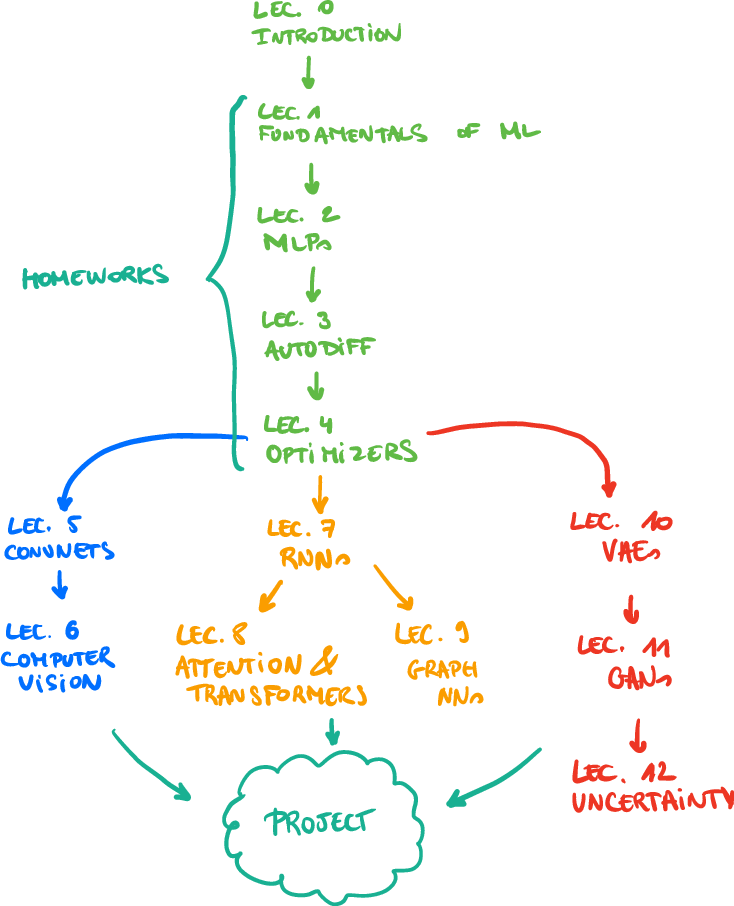]

---

# Today

How to **make neural networks see**?

- Visual perception
- Convolutions
- Pooling
- Convolutional networks

---

class: middle

# Visual perception

---

class: middle

In 1959-1962, David Hubel and Torsten Wiesel identify the neural basis of information processing in the .bold[visual system].
They are awarded the Nobel Prize of Medicine in 1981 for their discovery.

.grid.center[
.kol-4-5.center[.width-80[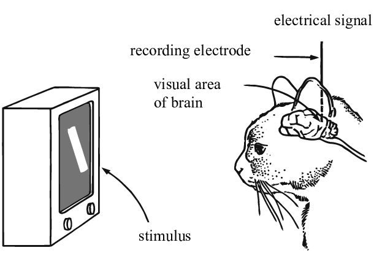]]
.kol-1-5[ .width-100.circle[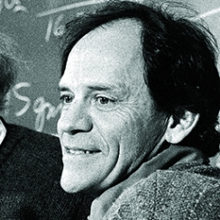].width-100.circle[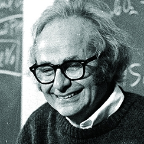]]
]

---

class: middle, black-slide

.center[

<iframe width="640" height="480" src="https://www.youtube.com/embed/IOHayh06LJ4?&loop=1&start=0" frameborder="0" volume="0" allowfullscreen></iframe>

]

???

They recorded the activity of neurons in the visual cortex of cats while showing them different visual stimuli, until they found some neurons that responded to the presence of a line in the visual field. 

During their recordings, they noticed a few interesting things:
1. the neurons fired only when the line was in a particular place on the retina,
2. the activity of these neurons changed depending on the orientation of the line, and
3. sometimes the neurons fired only when the line was moving in a particular direction.

---

class: middle, black-slide

.center[

<iframe width="640" height="480" src="https://www.youtube.com/embed/OGxVfKJqX5E?&loop=1" frameborder="0" volume="0" allowfullscreen></iframe>

]

???

Their hypothesis:
- The visual system is organized in a hierarchical way, where simple features are extracted at the early stages and more complex features are extracted at the later stages.
- Simple cells are sensitive to the presence of a line in a particular position and orientation in the visual field.
- Complex cells are sensitive to the presence of a line in a particular orientation, but not to its position.
- Hierarchies of simple+complex cells can be used to extract more complex features, such as corners, curves, and eventually objects.

---

class: middle

Can we equip neural networks with **inductive biases** tailored for vision?

- Locality (as in simple cells)
- Invariance translation (as in complex cells)
- Hierarchical compositionality (as in hypercomplex cells)

???

Can we take inspiration from the visual system to design neural network architectures that are better suited for visual perception?

---

class: middle

.center.width-100[]

.center[Invariance and equivariance to translation  are desirable properties for visual perception.]

.footnote[Credits: Simon J.D. Prince, [Understanding Deep Learning](https://udlbook.github.io/udlbook/), 2023.]

???

- The classification of the shifted image should be the same as the classification of the original image. 
- The segmentation of the shifted image should be the shifted segmentation of the original image.

---

class: middle

# Convolutional networks

---

exclude: true
class: middle
background-image: url('figures/lec5/info8006/wally.jpg')
background-size: contain
background-position: center

                 
.center[Where's Wally?]

.footnote[Credits: Martin Handford, [Where's Wally?](https://en.wikipedia.org/wiki/Where%27s_Wally%3F) series.]

???

Highlights:
- Large image with many pixels. Processing it with a fully connected layer would require a huge number of parameters.
- Nearby pixels are strongly correlated as they form parts of a same object.
- Parts combine to form objects: eyes, nose, mouth form a face; arms, legs, torso form a person; trees, people, buildings form a scene.
- Patterns (people, objects) appear at different locations. Detecting them should not require learning separate parameters for each location.
- If we slightly move or rotate the image, we should still be able to recognize the objects in it. 

---

class: middle

## 1d convolution

For the one-dimensional input $\mathbf{x} \in \mathbb{R}^W$ and the convolutional kernel $\omega \in \mathbb{R}^w$, the discrete **convolution** $\mathbf{x} \circledast \omega$ is a vector of size $W - w + 1$ such that
$$\begin{aligned}
(\mathbf{x} \circledast \omega)[i] &= \sum\_{m=0}^{w-1} \mathbf{x}\_{m+i}  \omega\_m .
\end{aligned}
$$

.italic[
Technically, $\circledast$ denotes the cross-correlation operator.
However, most machine learning libraries call it convolution.
]

---

class: middle

Optionally, 
- the input $\mathbf{x}$ can be .bold[padded] with $p$ zeros on each side before applying the convolution, resulting in an output of size $W - w + 1 + 2p$. Setting $p = \frac{w-1}{2}$ (for odd $w$) preserves the input size. 
- the convolution can be applied in a .bold[strided] fashion, skipping $s-1$ elements of the input between each application of the kernel, resulting in an output of size $\lfloor\frac{W - w + 1}{s}\rfloor$. For $s=1$, the convolution is applied at every position of the input. For $s=w$, the convolution is applied at non-overlapping positions of the input.

---

class: middle

.center.width-100[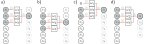]

 
.center[1d convolution with a kernel $\omega = (\omega\_1, \omega\_2, \omega\_3)$ applied to the input signal $\mathbf{x}$.  
The output is obtained by sliding the kernel over the input and computing the inner product at each position, optionally with padding.]

.footnote[Credits: [Simon J.D. Prince](https://udlbook.github.io/udlbook/), 2023.]

---

class: middle

.center.width-100[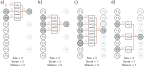]

.center[Strided and dilated convolutions.]

.footnote[Credits: [Simon J.D. Prince](https://udlbook.github.io/udlbook/), 2023.]

---

class: middle

## 2d convolution

For the 2d input tensor $\mathbf{x} \in \mathbb{R}^{H \times W}$ and the 2d convolutional kernel $\omega \in \mathbb{R}^{h \times w}$, the discrete **convolution** $\mathbf{x} \circledast \omega$ is a matrix of size $(H-h+1) \times (W-w+1)$ such that
$$(\mathbf{x} \circledast \omega)[j,i] = \sum\_{n=0}^{h-1} \sum\_{m=0}^{w-1}    \mathbf{x}\_{n+j,m+i} \omega_{n,m}$$
As for 1d convolution, padding can be applied to both spatial dimensions of the input to control the output size.

???

Draw: Explain the intuition behind the sum of element-wise products which reduces to an inner product between the kernel and a region of the input.

---

class: middle

.center.width-100[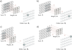]

.center[2d convolution with a kernel $\omega  \in \mathbb{R}^{3 \times 3}$ applied to the input signal $\mathbf{x}$.]

.footnote[Credits: [Simon J.D. Prince](https://udlbook.github.io/udlbook/), 2023.]

---

class: middle

## Convolution as matrix multiplication

The convolution operation can be equivalently re-expressed as a linear operation. As a guiding example, let us consider the convolution of tensors $\mathbf{x} \in \mathbb{R}^{4 \times 4}$ and $\omega \in \mathbb{R}^{3 \times 3}$,
$$
\mathbf{x} \circledast \omega =
\begin{pmatrix}
4 & 5 & 8 & 7 \\\\
1 & 8 & 8 & 8 \\\\
3 & 6 & 6 & 4 \\\\
6 & 5 & 7 & 8
\end{pmatrix} \circledast \begin{pmatrix}
1 & 4 & 1 \\\\
1 & 4 & 3 \\\\
3 & 3 & 1
\end{pmatrix} =
\begin{pmatrix}
122 & 148 \\\\
126 & 134
\end{pmatrix}.$$

???

Do this on the tablet for 1D convolutions. Draw the MLP and Wx product.

---

class: middle

The convolutional kernel $\omega$ is first rearranged as a sparse Toeplitz circulant matrix, called the .bold[convolution matrix],
$$\mathbf{W^T} = \begin{pmatrix}
1 & 4 & 1 & 0 & 1 & 4 & 3 & 0 & 3 & 3 & 1 & 0 & 0 & 0 & 0 & 0 \\\\
0 & 1 & 4 & 1 & 0 & 1 & 4 & 3 & 0 & 3 & 3 & 1 & 0 & 0 & 0 & 0 \\\\
0 & 0 & 0 & 0 & 1 & 4 & 1 & 0 & 1 & 4 & 3 & 0 & 3 & 3 & 1 & 0 \\\\
0 & 0 & 0 & 0 & 0 & 1 & 4 & 1 & 0 & 1 & 4 & 3 & 0 & 3 & 3 & 1
\end{pmatrix}.$$

The input $\mathbf{x}$ is flattened row by row, from top to bottom, into a column vector 
$$v(\mathbf{x}) =
\begin{pmatrix}
4 & 5 & 8 & 7 & 1 & 8 & 8 & 8 & 3 & 6 & 6 & 4 & 6 & 5 & 7 & 8
\end{pmatrix}^T.$$

Then,
$$\mathbf{W^T}v(\mathbf{x}) =
\begin{pmatrix}
122 & 148 & 126 & 134
\end{pmatrix}^T$$
which we can reshape to a $2 \times 2$ matrix to obtain $\mathbf{x} \circledast \omega$.

---

class: middle

The same procedure generalizes to $\mathbf{x} \in \mathbb{R}^{H \times W}$ and convolutional kernel $\omega \in \mathbb{R}^{h \times w}$, such that:
- the convolutional kernel is rearranged as a sparse Toeplitz circulant matrix $$\mathbf{W^T}$$ of shape $(H-h+1)(W-w+1) \times HW$ where
    - each row $i$ identifies an element of the output feature map,
    - each column $j$ identifies an element of the input feature map,
    - the value $\mathbf{W^T}\_{i,j}$ corresponds to the kernel value the element $j$ is multiplied with in output $i$;
- the input $\mathbf{x}$ is flattened into a column vector $v(\mathbf{x})$ of shape $HW \times 1$;
- the output feature map $\mathbf{x} \circledast \omega$ is obtained by reshaping the $(H-h+1)(W-w+1) \times 1$ column vector $\mathbf{W^T}v(\mathbf{x})$ as a $(H-h+1) \times (W-w+1)$ matrix.

Therefore, a convolutional layer is a special case of a fully
connected layer: $$\mathbf{h} = \mathbf{x} \circledast \omega \Leftrightarrow v(\mathbf{h}) = \mathbf{W^T}v(\mathbf{x})$$

???

Insist on how inductive biases are enforced through architecture:
- locality is enforced through sparsity and band structure
- equivariance is enforced through replication and weight sharing

Training:
- The backward pass is not implemented naively as the backward pass of a fully connected layer.
- The backward pass is also a convolution! 

---

class: middle

.center.width-100[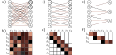]

.center[Fully connected vs convolutional layers.]

.footnote[Credits: Simon J.D. Prince, [Understanding Deep Learning](https://udlbook.github.io/udlbook/), 2023.]

---

class: middle

## Channels

The 2d convolution can be extended to tensors with multiple channels.

For the 3d input tensor $\mathbf{x} \in \mathbb{R}^{C \times H \times W}$ and the 3d convolutional kernel $\omega \in \mathbb{R}^{C \times h \times w}$, the discrete 2d convolution $\mathbf{x} \circledast \omega$ is a 2d tensor of size $(H-h+1) \times (W-w+1)$ such that
$$(\mathbf{x} \circledast \omega)[j,i] = \sum\_{c=0}^{C-1}\sum\_{n=0}^{h-1} \sum\_{m=0}^{w-1}    \mathbf{x}\_{c,n+j,m+i} \omega_{c,n,m}$$

---

class: middle

.center.width-100[]

.center[2d convolution applied to a color image with three channels (R, G, B).]

.footnote[Credits: [Simon J.D. Prince](https://udlbook.github.io/udlbook/), 2023.]

---

class: middle

## Convolutional layers

A convolutional layer is defined by a set of $K$ kernels $\omega_k$ of size $C \times h \times w$. It applies the 2d convolution operation to the input tensor $\mathbf{x}$ of size $C \times H \times W$ to produce a set of $K$ feature maps $\mathbf{o}\_k$.

Each kernel $\omega_k$ acts as a feature detector that scans the input tensor and produces a feature map $\mathbf{o}\_k$ specific to that feature. 

---

class: middle

A function $f$ is .bold[equivariant] to $g$ if $f(g(\mathbf{x})) = g(f(\mathbf{x}))$.

Parameter sharing (using the same kernel across all spatial locations) in a convolutional layer causes the layer to be equivariant to translation.

.center.width-75[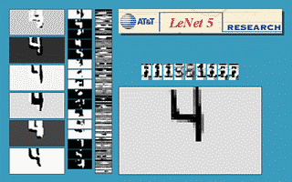]

.caption[If an object moves in the input image, its representation will move the same amount in the output.]

.footnote[Credits: LeCun et al, Gradient-based learning applied to document recognition, 1998.]

???

- Equivariance is useful when we know some local function is useful everywhere (e.g., edge detectors).
- Convolution is not equivariant to other operations such as change in scale or rotation.

---

class: middle

## Pooling layers

Pooling layers are used to progressively reduce the spatial size of the representation, hence capturing longer-range dependencies between features. 

Considering a pooling area of size $h \times w$ and a 3D input tensor $\mathbf{x} \in \mathbb{R}^{C\times(rh)\times(sw)}$, max-pooling produces a tensor $\mathbf{o} \in \mathbb{R}^{C \times r \times s}$ such that
$$\mathbf{o}\_{c,j,i} = \max\_{n < h, m < w} \mathbf{x}_{c,rj+n,si+m}.$$

---

class: middle

.center.width-100[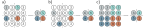]

.center[Subsampling, max-pooling and average-pooling with a pooling area of size $2 \times 2$.]

.footnote[Credits: [Simon J.D. Prince](https://udlbook.github.io/udlbook/), 2023.]

---

class: middle

A function $f$ is .bold[invariant] to $g$ if $f(g(\mathbf{x})) = f(\mathbf{x})$.

Pooling layers provide invariance to any permutation inside one cell, which results in (pseudo-)invariance to local translations.

.center.width-60[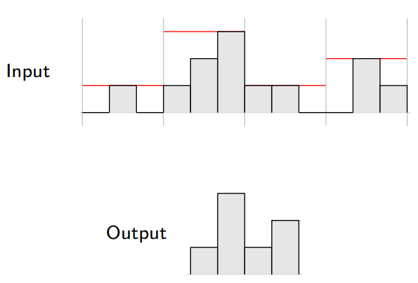]

.footnote[Credits: Francois Fleuret, [EE559 Deep Learning](https://fleuret.org/ee559/), EPFL.]

???

This helpful if we care more about the presence of a pattern rather than its exact position.

---

class: middle

## Convolutional neural networks (CNNs)

A convolutional neural network (CNN) is a deep neural network that uses convolutional layers, pooling layers, and fully connected layers to process multi-dimensional inputs such as images.

- Convolutional layers extract local features from the input while preserving spatial relationships.
- Pooling layers reduce the spatial dimensions of the feature maps, allowing the network to capture more global features.
- Fully connected layers at the end of the network combine the extracted features to make predictions.

---

class: middle

.center.width-100[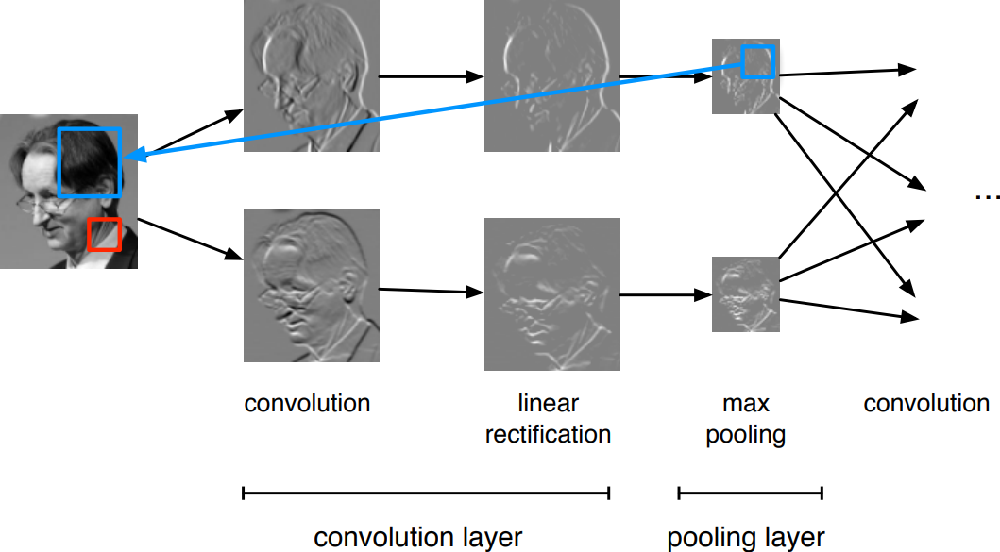]

.center[Interleaving convolutional and pooling layers enables the network to learn hierarchical features from local to global patterns.]

---

class: middle

In 1980, Fukushima proposes the .bold[Neocognitron], a direct neural network implementation of the hierarchy model of the visual nervous system of Hubel and Wiesel.

.grid[
.kol-2-3.width-90.center[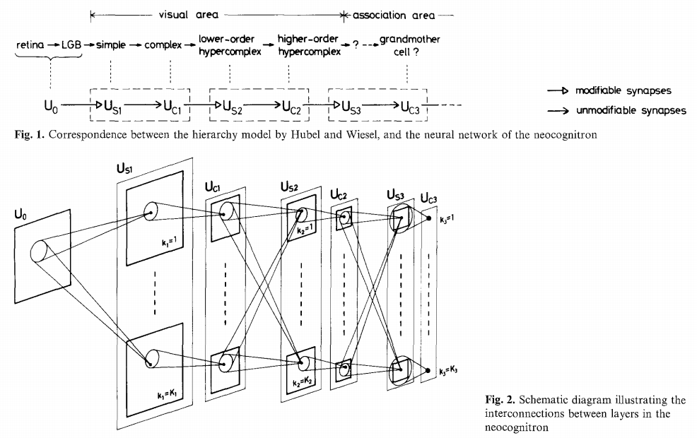]
.kol-1-3[

- Built upon **convolutions** and enables the composition of a *feature hierarchy*.
- Biologically-inspired training algorithm, which proves to be largely **inefficient**.

]
]

.footnote[Credits: Kunihiko Fukushima, [Neocognitron: A Self-organizing Neural Network Model](https://www.rctn.org/bruno/public/papers/Fukushima1980.pdf), 1980.]

---

class: middle

In the 1980-90s, LeCun and collaborators propose convolutional network architectures, called .bold[LeNet-1] to .bold[LeNet-5], and show how to train them end-to-end with backpropagation.

.center.width-110[]

.footnote[Credits: [Dive Into Deep Learning](https://d2l.ai/), 2020.]

---

class: middle, black-slide

.center[

<iframe width="640" height="480" src="https://www.youtube.com/embed/FwFduRA_L6Q?&loop=1&start=0" frameborder="0" volume="0" allowfullscreen></iframe>

]

.center[LeNet-1 (LeCun et al, 1993)]

---

class: middle

Classic convolutional network architecture have followed the same pattern as LeNet-5, which can be summarized as
$$\texttt{INPUT} \to [[\texttt{CONV} \to \texttt{ReLU}]\texttt{\*}N \to \texttt{POOL?}]\texttt{\*}M \to [\texttt{FC} \to \texttt{ReLU}]\texttt{\*}K \to \texttt{FC},$$
where:
- $\texttt{\*}$ indicates repetition;
- $\texttt{POOL?}$ indicates an optional pooling layer;
- $N \geq 0$ (and usually $N \leq 3$), $M \geq 0$, $K \geq 0$ (and usually $K < 3$);
- the last fully connected layer holds the output (e.g., the class scores).

---

class: center, middle, black-slide

.width-100[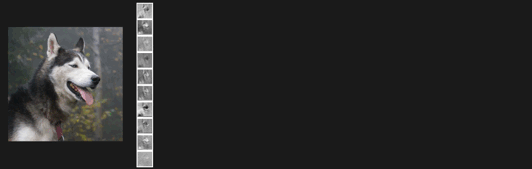]

---

class: middle, center

(demo of `code/lec5-convnet.ipynb`)

???

See also https://poloclub.github.io/cnn-explainer/

---

class: middle

# Modern architectures

---

class: middle

.center.width-70[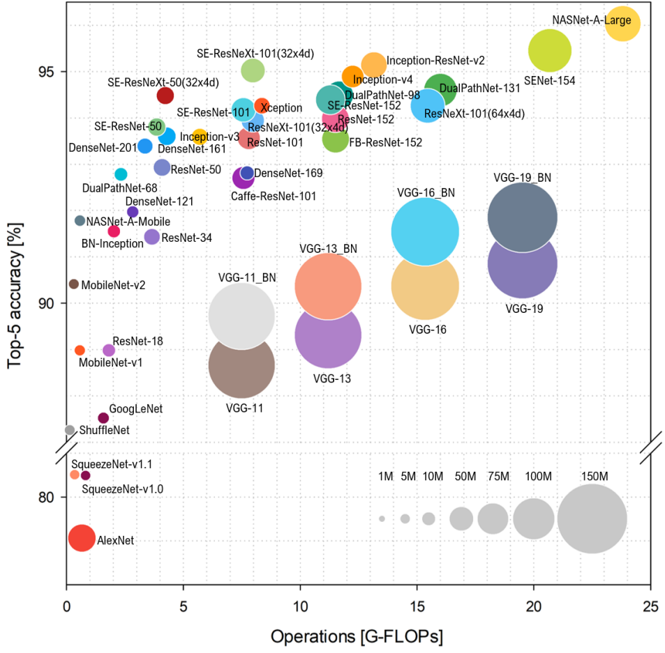]

.footnote[Credits: [Bianco et al](https://arxiv.org/abs/1810.00736), 2018.]

---

class: middle

.center.width-60[]

The .bold[AlexNet] architecture for image classification (Krizhevsky et al., 2012).
- 8-layer convolutional network with large convolutional kernels (up to $11 \times 11$) and large number of channels (up to 384).
- The convolutional layers are followed with a 3-layer MLP.

.footnote[Credits: [Simon J.D. Prince](https://udlbook.github.io/udlbook/), 2023.]

---

class: middle

.center.width-100[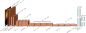]

The .bold[VGG] architecture for image classification (Simonyan and Zisserman, 2014).
- 5 VGG blocks consisting of convolutional and pooling layers, followed by a block of fully connected layers.
- The depth increased up to 19 layers, while the kernel sizes reduced to $3 \times 3$.

.footnote[Credits: [Simon J.D. Prince](https://udlbook.github.io/udlbook/), 2023.]

---

class: middle

The reduction of kernel size and the increase in depth allows the network to capture more complex features while keeping the number of parameters manageable.

Indeed, the .bold[effective receptive field] of a unit in the output feature map 
- grows with linearly with depth when chaining convolutional layers, and
- grows exponentially with depth when pooling layers (or strided convolutions) are interleaved with convolutional layers.

---

class: middle

.center.width-75[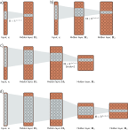]

.footnote[Credits: Simon J.D. Prince, [Understanding Deep Learning](https://udlbook.github.io/udlbook/), 2023.]

---

class: middle

.grid[
.kol-4-5[

 

The .bold[ResNet] architecture for image classification (He et al., 2015) is the first architecture to successfully train very deep convolutional networks (up to 152 layers).

.center.width-80[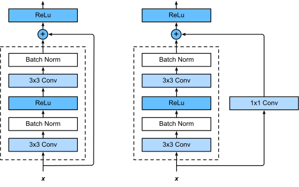]

]
.kol-1-5[.center.width-100[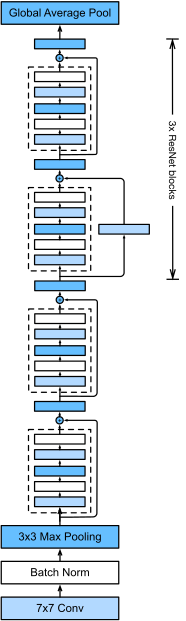]]
]

.footnote[Credits: [Dive Into Deep Learning](https://d2l.ai/), 2020.]

---

class: middle

Training networks of this depth is made possible because of the .bold[skip connections] $\mathbf{h} = \mathbf{x} + f(\mathbf{x})$ in the residual blocks. They allow the gradients to shortcut the layers and pass through without vanishing.

.center.width-60[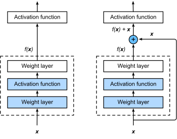]

.footnote[Credits: [Dive Into Deep Learning](https://d2l.ai/), 2020.]

---

class: middle

.center.width-100[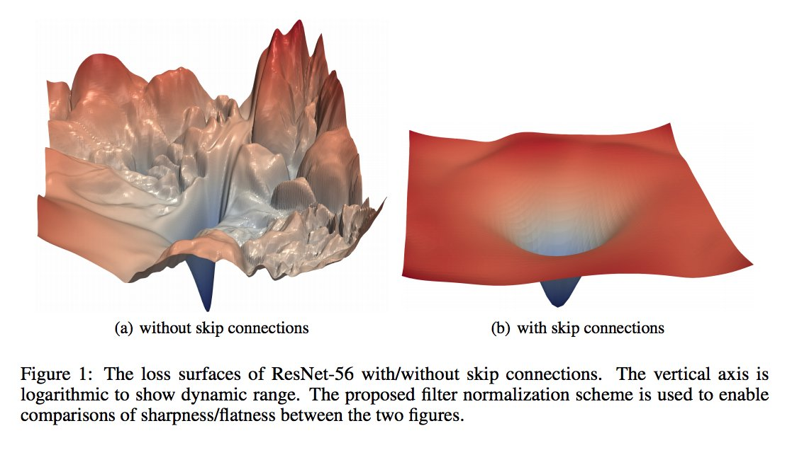]

---

class: middle

.center.width-100[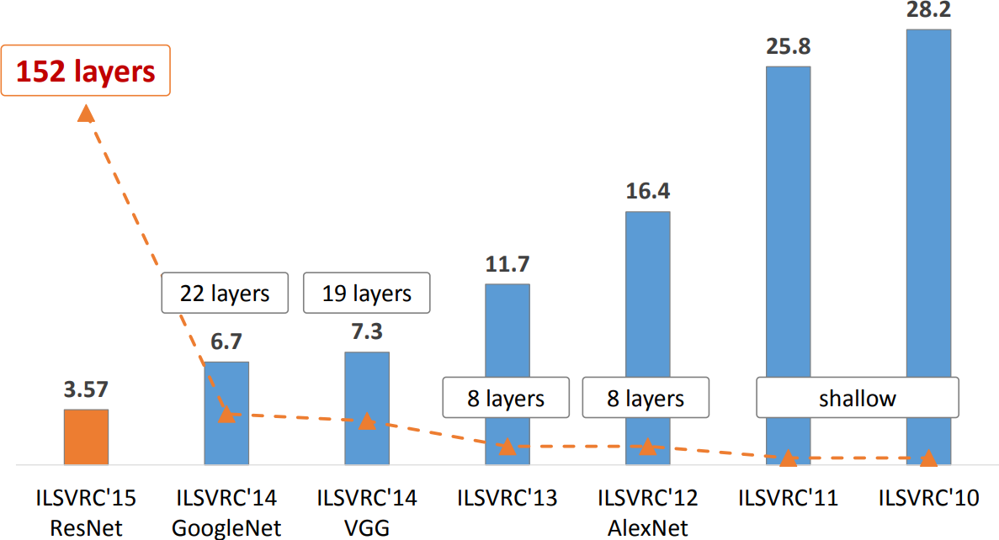]

.center[ImageNet classification error rates of different convolutional network architectures over time. The deeper the network, the better the performance.]

---

class: middle

.center.width-100[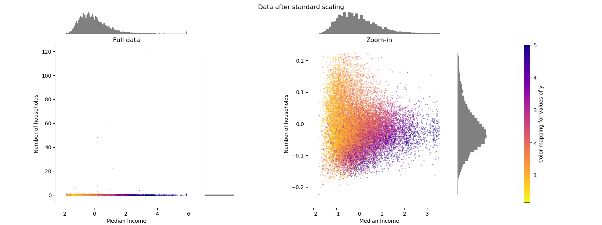]

Later, .bold[EfficientNet] (Tan and Le, 2019) proposed to scale up the depth, width and resolution of convolutional networks in a principled way. 

They empirically found that scaling up all dimensions together leads to better performance than scaling up each dimension independently.

.footnote[Credits: [Tan and Le](https://arxiv.org/abs/1905.11946.pdf), 2019.]

---

class: middle

.center.width-50[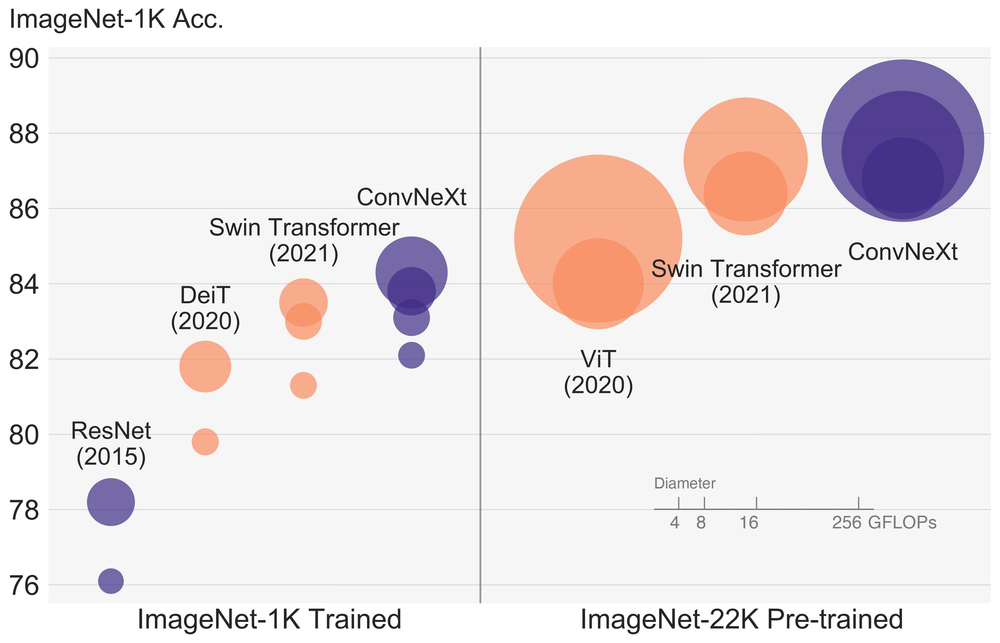]

.bold[ConvNeXt] (Liu et al., 2022) improves upon the ResNet architecture by introducing a few modifications inspired by the design of vision transformers:
- inverted bottleneck blocks with depthwise separable convolutions,
- larger convolutional kernels (e.g., $7 \times 7$ instead of $3 \times 3$),
- layer normalization instead of batch normalization,
- GELU activations instead of ReLU.

???

Note: a depthwise separable convolution is a convolution where each input channel is convolved with a separate kernel, and the outputs are then combined with a pointwise convolution (i.e., a $1 \times 1$ convolution). This reduces the number of parameters and computations compared to a standard convolution that applies a single kernel to all input channels.

---

class: middle, center

(demo of `code/lec5-convnext.ipynb`)

---

class: middle

# Under the hood

---

class: middle

Understanding what is happening in deep neural networks after training is complex and the tools we have are limited.

In the case of convolutional neural networks, we can look at:
- the network's kernels as images
- internal activations on a single sample as images
- distributions of activations on a population of samples
- derivatives of the response with respect to the input
- maximum-response synthetic samples

.footnote[Credits: Francois Fleuret, [EE559 Deep Learning](https://fleuret.org/ee559/), EPFL.]

---

class: middle 

## Kernels as images

LeNet's first convolutional layer, all kernels.

.width-100[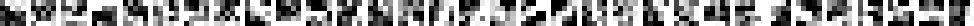]

.footnote[Credits: Francois Fleuret, [EE559 Deep Learning](https://fleuret.org/ee559/), EPFL.]

---

class: middle

LeNet's second convolutional layer, first 32 kernels.

.center.width-70[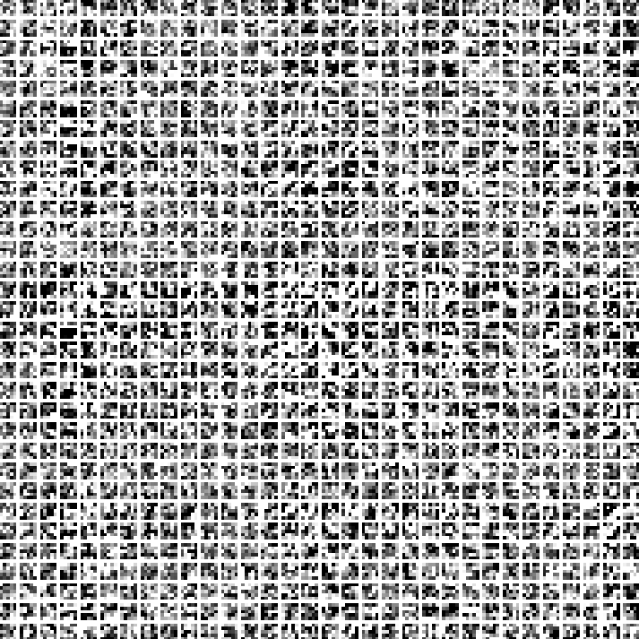]

.footnote[Credits: Francois Fleuret, [EE559 Deep Learning](https://fleuret.org/ee559/), EPFL.]

---

class: middle

AlexNet's first convolutional layer, first 20 kernels.

.center.width-100[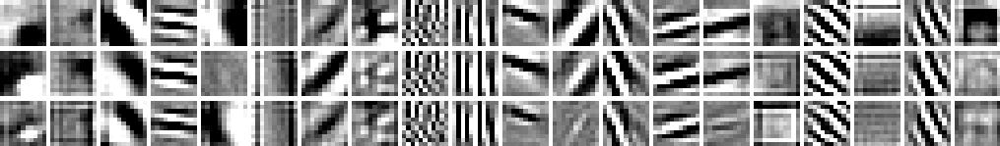]

.footnote[Credits: Francois Fleuret, [EE559 Deep Learning](https://fleuret.org/ee559/), EPFL.]

---

class: middle

## Maximum response samples

Convolutional networks can be inspected by looking for synthetic input images $\mathbf{x}$ that maximize the activation $\mathbf{h}_{\ell,d}(\mathbf{x})$ of a chosen convolutional kernel $\mathbf{u}$ at layer $\ell$ and index $d$ in the layer filter bank.

These samples can be found by gradient ascent on the input space:

$$
\begin{aligned}
\mathcal{L}\_{\ell,d}(\mathbf{x}) &= ||\mathbf{h}\_{\ell,d}(\mathbf{x})||\_2\\\\
\mathbf{x}\_0 &\sim U[0,1]^{C \times H \times W } \\\\
\mathbf{x}\_{t+1} &= \mathbf{x}\_t + \gamma \nabla\_{\mathbf{x}} \mathcal{L}\_{\ell,d}(\mathbf{x}\_t)
\end{aligned}
$$

Here, $\mathcal{L}\_{\ell,d}(\mathbf{x})$ represents the L2 norm of the activation $\mathbf{h}\_{\ell,d}(\mathbf{x})$, $\mathbf{x}\_0$ is the initial random input, $\mathbf{x}\_{t+1}$ is the updated input at iteration $t+1$, and $\gamma$ is the learning rate.

---

class: middle

.width-100[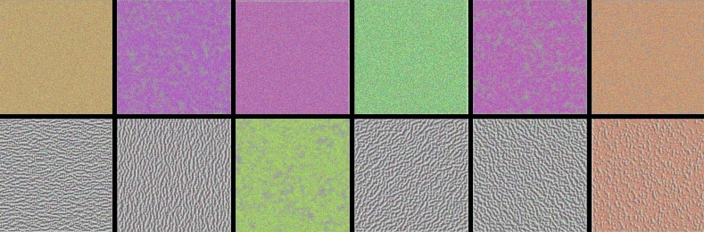]

.center[VGG-16, convolutional layer 1-1, a few of the 64 filters]

.footnote[Credits: Francois Chollet, [How convolutional neural networks see the world](https://blog.keras.io/how-convolutional-neural-networks-see-the-world.html), 2016.]

---

class: middle
count: false

.width-100[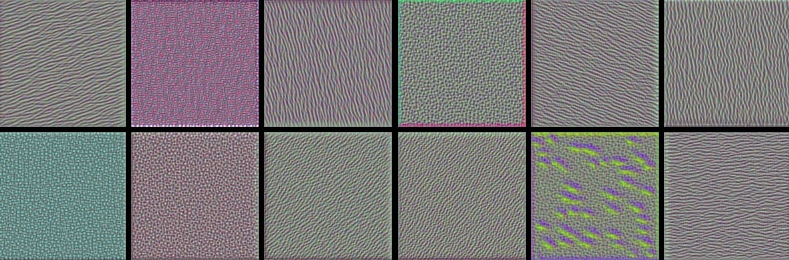]

.center[VGG-16, convolutional layer 2-1, a few of the 128 filters]

.footnote[Credits: Francois Chollet, [How convolutional neural networks see the world](https://blog.keras.io/how-convolutional-neural-networks-see-the-world.html), 2016.]

---

class: middle
count: false

.width-100[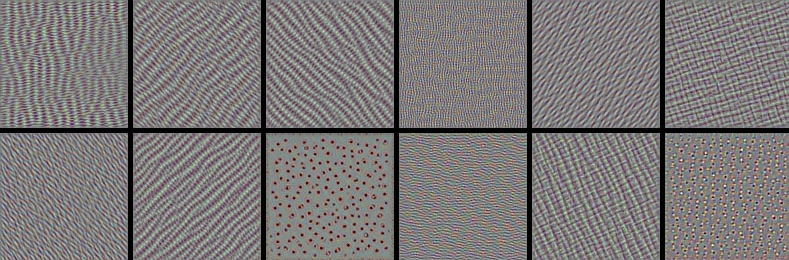]

.center[VGG-16, convolutional layer 3-1, a few of the 256 filters]

.footnote[Credits: Francois Chollet, [How convolutional neural networks see the world](https://blog.keras.io/how-convolutional-neural-networks-see-the-world.html), 2016.]

---

class: middle
count: false

.width-100[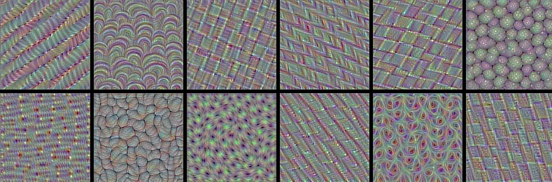]

.center[VGG-16, convolutional layer 4-1, a few of the 512 filters]

.footnote[Credits: Francois Chollet, [How convolutional neural networks see the world](https://blog.keras.io/how-convolutional-neural-networks-see-the-world.html), 2016.]

---

class: middle
count: false

.width-100[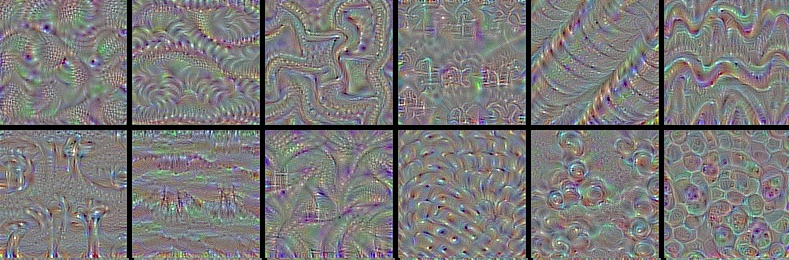]

.center[VGG-16, convolutional layer 5-1, a few of the 512 filters]

.footnote[Credits: Francois Chollet, [How convolutional neural networks see the world](https://blog.keras.io/how-convolutional-neural-networks-see-the-world.html), 2016.]

---

class: middle

The network appears to learn a .bold[hierarchical composition] of patterns:
- The first layers seem to encode basic features such as direction and color.
- These basic features are then combined to form more complex textures, such as grids and spots.
- Finally, these textures are further combined to create increasingly intricate patterns.

.width-60.center[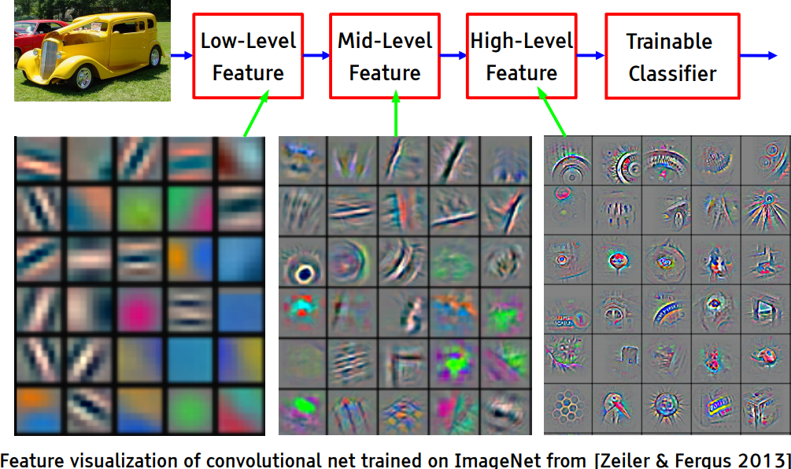]

---

class: middle

## Biological plausibility

.center.width-80[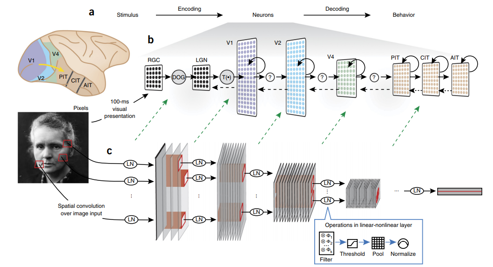]

.italic["Deep hierarchical neural networks are beginning to transform
neuroscientists’ ability to produce quantitatively accurate computational
models of the sensory systems, especially in higher cortical areas
where neural response properties had previously been enigmatic."]

.footnote[Credits: Yamins et al, Using goal-driven deep learning models to understand
sensory cortex, 2016.]

---

class: end-slide, center
count: false

The end.

???

Checklist: You want to classify cats and dogs. 
- What kind of network would you use?
- What architecture would you use? (list of layers, output size, etc)
- What size of kernels would you use? How many kernels per layer?
- What kind of pooling would you use?
- What kind of activation function would you use?
- What loss function would you use?
- How would you initialize the weights?
- How would you train the network?