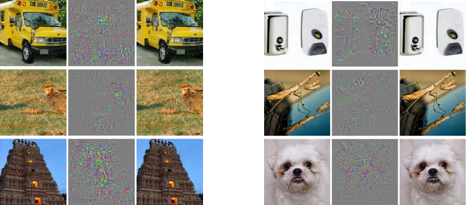
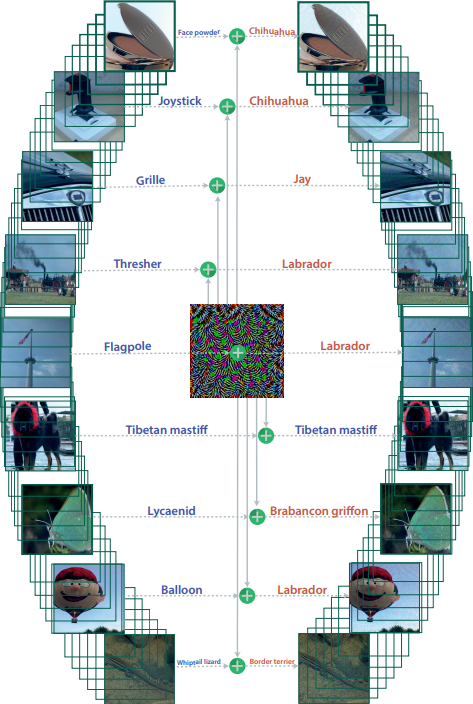

class: middle, center, title-slide

# Deep Learning

Lecture 6: Adversarial attacks and defenses

  

.bold[Gilles Louppe] 
[g.louppe@uliege.be](mailto:g.louppe@uliege.be)

---

We have seen that (convolutional) neural networks achieve
super-human performance on a large variety of tasks.

Soon enough, it seems like:
- neural networks will replace your doctor;
- neural networks will drive your car;
- neural networks will compose the music you listen to.

But is that the end of the story?

  

.center.width-80[]
.center[A recipe for success, or is it?]

---

class: middle

# Adversarial attacks

---

# Locality assumption

"The deep stack of non-linear layers are a way for the model to encode a non-local
generalization prior over the input space. In other words, it is assumed that is
possible for the output unit to assign probabilities to regions of the input
space that contain no training examples in their vicinity.

It is implicit in such arguments that local generalization—in the very proximity
of the training examples—works as expected. And that in particular, for a small
enough radius $\epsilon > 0$ in the vicinity of a given training input
$\mathbf{x}$, an $\mathbf{x} + \mathbf{r}$ satisfying $||\mathbf{r}|| < \epsilon$ will
get assigned a high probability of the correct class by the model."

.pull-right[(Szegedy et al, 2013)]

---

# Adversarial examples

$$\begin{aligned}
&\min ||\mathbf{r}||\_2 \\\\
\text{s.t. } &f(\mathbf{x}+\mathbf{r})=y'\\\\
&\mathbf{x}+\mathbf{r} \in [0,1]^p
\end{aligned}$$
where
- $y'$ is some target label, different from the original label $y$ associated to $\mathbf{x}$,
- $f$ is a trained neural network.

---

class: middle

.center.width-100[]

.center[(Left) Original images $\mathbf{x}$. (Middle) Noise $\mathbf{r}$. (Right) Modified images $\mathbf{x}+\mathbf{r}$.  All are classified as 'Ostrich'.  (Szegedy et al, 2013)]

---

Even simpler, take a step along the direction of the sign of the gradient at each pixel:
$$\mathbf{r} = \epsilon\, \text{sign}(\nabla\_\mathbf{x} \ell(y', f(\mathbf{x}))) $$
where $\epsilon$ is the magnitude of the perturbation.

--

   

.center.width-100[]

.center[The panda on the right is classified as a 'Gibbon'. (Goodfellow et al, 2014)]

---

class: middle

.center.width-70[]

.footnote[Credits: [Breaking things easy](http://www.cleverhans.io/security/privacy/ml/2016/12/15/breaking-things-is-easy.html) (Papernot and Goodfellow, 2016)]

---

# Not just for neural networks

Many other machine learning models are subject to adversarial examples, including:
- Linear models
    - Logistic regression
    - Softmax regression
    - Support vector machines
- Decision trees
- Nearest neighbors

---

# Fooling neural networks

 

.center.width-100[]

.center[(Nguyen et al, 2014)]

---

class: middle

.center.width-60[]

.center[(Nguyen et al, 2014)]

---

# One pixel attacks

.center.width-40[]

.center[(Su et al, 2017)]

---

# Universal adversarial perturbations

.center.width-40[]

.center[(Moosavi-Dezfooli et al, 2016)]

---

# Fooling deep structured prediction models

.center.width-100[]

.center[(Cisse et al, 2017)]

---

class: middle

.center.width-100[]

.center[(Cisse et al, 2017)]

---

class: middle

.center.width-100[]

.center[(Cisse et al, 2017)]

---

# Attacks in the real world

.center[

<iframe width="640" height="480" src="https://www.youtube.com/embed/oeQW5qdeyy8?&loop=1&start=0" frameborder="0" volume="0" allowfullscreen></iframe>

]

---

class: middle

.center[

<iframe width="640" height="480" src="https://www.youtube.com/embed/YXy6oX1iNoA?&loop=1&start=0" frameborder="0" volume="0" allowfullscreen></iframe>

]

---

class: middle

.center[

<iframe width="640" height="480" src="https://www.youtube.com/embed/zQ_uMenoBCk?&loop=1&start=0" frameborder="0" volume="0" allowfullscreen></iframe>

]

---

# Security threat

Adversarial attacks pose a **security threat** to machine learning systems deployed in the real world.

Examples include:
- fooling real classifiers trained by remotely hosted API (e.g., Google),
- fooling malware detector networks,
- obfuscating speech data,
- displaying adversarial examples in the physical world and fool systems that perceive them through a camera.

---

class: middle

.center.width-100[]

.footnote[Credits: [Adversarial Examples and Adversarial Training](https://berkeley-deep-learning.github.io/cs294-dl-f16/slides/2016_10_5_CS294-131.pdf) (Goodfellow, 2016)]

---

class: middle

# Adversarial defenses

---

# Defenses

  

.center.width-100[]

.footnote[Credits: [Adversarial Examples and Adversarial Training](https://berkeley-deep-learning.github.io/cs294-dl-f16/slides/2016_10_5_CS294-131.pdf) (Goodfellow, 2016)]

---

# Failed defenses

"In this paper we evaluate ten proposed defenses and demonstrate
that none of them are able to withstand a white-box attack. We do
this by constructing defense-specific loss functions that we minimize
with a strong iterative attack algorithm. With these attacks, on
CIFAR an adversary can create imperceptible adversarial examples
for each defense.

By studying these ten defenses, we have drawn two lessons: existing
defenses lack thorough security evaluations, and adversarial
examples are much more difficult to detect than previously recognized."

.pull-right[(Carlini and Wagner, 2017)]

     

.center[Adversarial attacks and defenses remain an **open research problem**.]

---

class: end-slide, center
count: false

The end.

---

# Further readings

- [Adversarial Examples: Attacks and Defenses for Deep Learning](https://arxiv.org/pdf/1712.07107.pdf) (Yuan et al, 2017)
- [Breaking things easy](http://www.cleverhans.io/security/privacy/ml/2016/12/15/breaking-things-is-easy.html) (Papernot and Goodfellow, 2016)
- [Adversarial Examples and Adversarial Training](https://berkeley-deep-learning.github.io/cs294-dl-f16/slides/2016_10_5_CS294-131.pdf) (Goodfellow, 2016)
- [Breaking Linear Classifiers on ImageNet](https://karpathy.github.io/2015/03/30/breaking-convnets/) (Andrej Karpathy, 2015)
