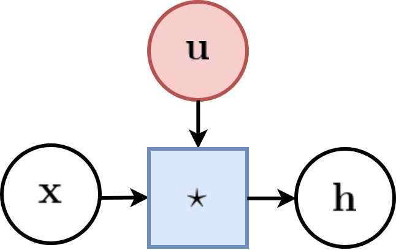
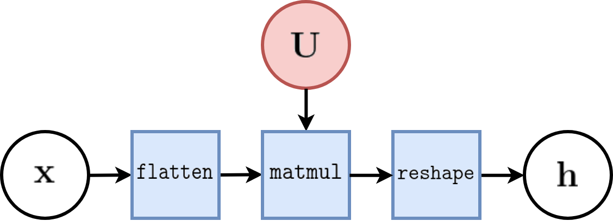
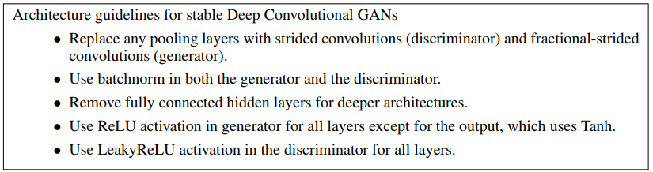
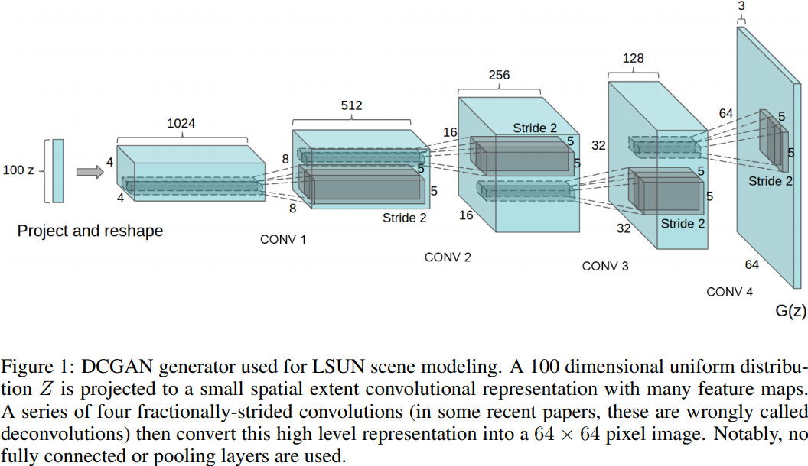
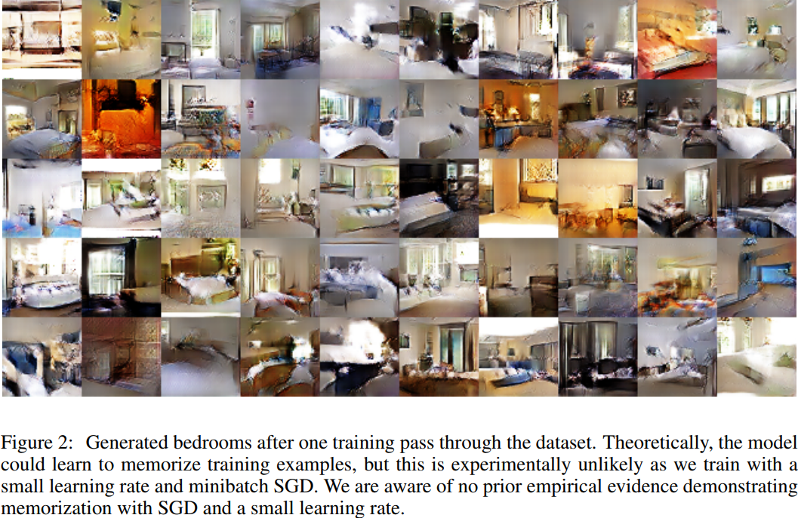
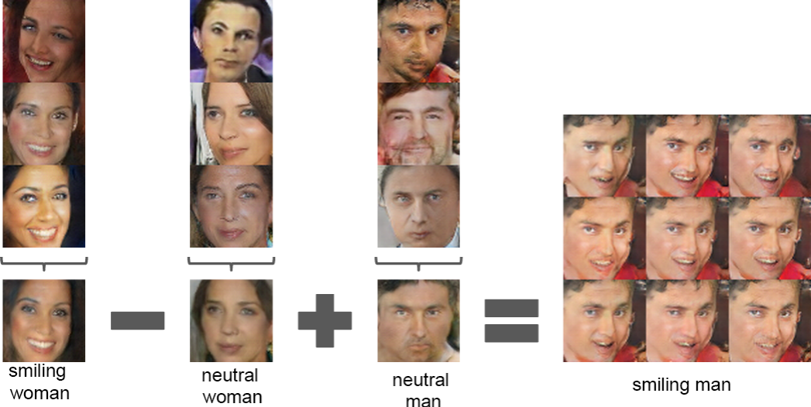
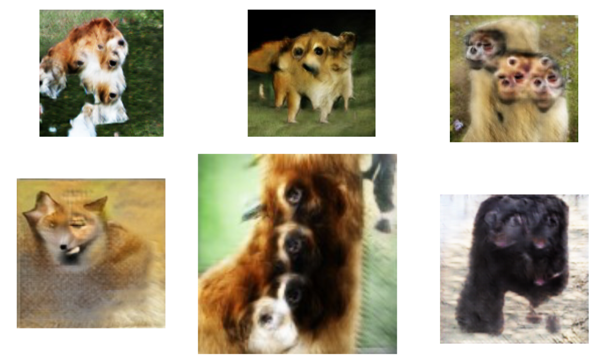
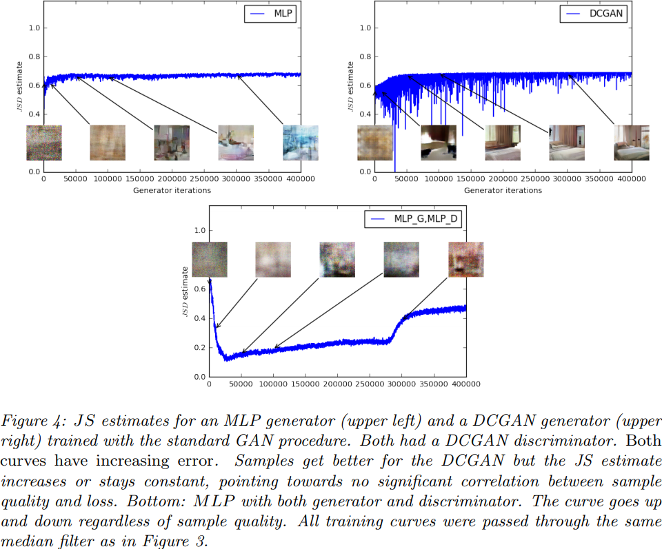
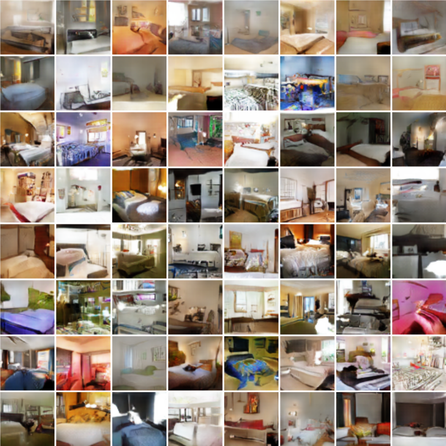

class: middle, center, title-slide

# Deep Learning

Lecture 6: Generative adversarial networks

  

.bold[Gilles Louppe] 
[g.louppe@uliege.be](mailto:g.louppe@uliege.be)

---

# Outline

Goals: Learn models of the data itself.

- Generative models (lecture 5)
- Variational inference (lecture 5)
- Variational auto-encoders (lecture 5)
- **Generative adversarial networks**

.center.width-70[]

---

class: middle

# Generative adversarial networks

---

class: middle

.center.width-80[]

---

# Generative adversarial networks

The main idea of **generative adversarial networks** (GANs) is to express the task of learning a generative model as a two-player zero-sum game between two networks.

- The first network is a generator  $g(\cdot;\theta) : \mathcal{Z} \to \mathcal{X}$, mapping a latent space equipped with a prior distribution $p(\mathbf{z})$ to the data space, thereby inducing a distribution
$$\mathbf{x} \sim p(\mathbf{x};\theta) \Leftrightarrow \mathbf{z} \sim p(\mathbf{z}), \mathbf{x} = g(\mathbf{z};\theta).$$
- The second network $d(\cdot; \phi) : \mathcal{X} \to [0,1]$ is a classifier trained to distinguish between true samples $\mathbf{x} \sim p\_r(\mathbf{x})$ and generated samples $\mathbf{x} \sim p(\mathbf{x};\theta)$.

The central mechanism will be to use supervised learning to guide the learning of the generative model.

---

class: middle

.center.width-100[]

---

# Game analysis

Consider a generator $g$ fixed at $\theta$. Given a set of observations
$$\mathbf{x}\_i \sim p\_r(\mathbf{x}), i=1, ..., N,$$
we can generate a two-class dataset
$$\mathbf{d} = \\\{ (\mathbf{x}\_1, 1), ..., (\mathbf{x}\_N,1), (g(\mathbf{z}\_1;\theta), 0), ..., (g(\mathbf{z}\_N;\theta), 0)) \\\}.$$

The best classifier $d$ is obtained by minimizing
the cross-entropy
$$\begin{aligned}
\mathcal{L}(\phi) &= -\frac{1}{2N} \left( \sum\_{i=1}^N \left[ \log d(\mathbf{x}\_i;\phi) \right] + \sum\_{i=1}^N\left[ \log (1-d(g(\mathbf{z}\_i;\theta);\phi)) \right] \right) \\\\
&\approx -\frac{1}{2} \left( \mathbb{E}\_{\mathbf{x} \sim p\_r(\mathbf{x})}\left[ \log d(\mathbf{x};\phi) \right] + \mathbb{E}\_{\mathbf{z} \sim p(\mathbf{z})}\left[ \log (1-d(g(\mathbf{z};\theta);\phi)) \right] \right)
\end{aligned}$$
with respect to $\phi$.

---

Following Goodfellow et al (2014), let us define the **value function**
$$V(\phi, \theta) =  \mathbb{E}\_{\mathbf{x} \sim p\_r(\mathbf{x})}\left[ \log d(\mathbf{x};\phi) \right] + \mathbb{E}\_{\mathbf{z} \sim p(\mathbf{z})}\left[ \log (1-d(g(\mathbf{z};\theta);\phi)) \right].$$

Then,
- $V(\phi, \theta)$ is high if $d$ is good at recognizing true from generated samples.

- If $d$ is the best classifier given $g$, and if $V$ is high, then this implies that
the generator is bad at reproducing the data distribution.

- Conversely, $g$ will be a good generative model if $V$ is low when $d$ is a perfect opponent.

Therefore, the ultimate goal is
$$\theta^\* = \arg \min\_\theta \max\_\phi V(\phi, \theta).$$

---

For a generator $g$ fixed at $\theta$, the classifier $d$ with parameters $\phi^\*\_\theta$ is optimal if and only if
$$\forall \mathbf{x}, d(\mathbf{x};\phi^\*\_\theta) = \frac{p\_r(\mathbf{x})}{p(\mathbf{x};\theta) + p\_r(\mathbf{x})}.$$

Therefore,
$$\begin{aligned}
&\min\_\theta \max\_\phi V(\phi, \theta) = \min\_\theta V(\phi^\*\_\theta, \theta) \\\\
&= \min\_\theta \mathbb{E}\_{\mathbf{x} \sim p\_r(\mathbf{x})}\left[ \log \frac{p\_r(\mathbf{x})}{p(\mathbf{x};\theta) + p\_r(\mathbf{x})} \right] + \mathbb{E}\_{\mathbf{x} \sim p(\mathbf{x};\theta)}\left[ \log \frac{p(\mathbf{x};\theta)}{p(\mathbf{x};\theta) + p\_r(\mathbf{x})} \right] \\\\
&= \min\_\theta \text{KL}\left(p\_r(\mathbf{x}) || \frac{p\_r(\mathbf{x}) + p(\mathbf{x};\theta)}{2}\right) \\\\
&\quad\quad\quad+ \text{KL}\left(p(\mathbf{x};\theta) || \frac{p\_r(\mathbf{x}) + p(\mathbf{x};\theta)}{2}\right) -\log 4\\\\
&= \min\_\theta 2\, \text{JSD}(p\_r(\mathbf{x}) || p(\mathbf{x};\theta)) - \log 4
\end{aligned}$$
where $\text{JSD}$ is the Jensen-Shannon divergence.

---

In summary, solving the minimax problem
$$\theta^\* = \arg \min\_\theta \max\_\phi V(\phi, \theta)$$
is equivalent to  
$$\theta^\* = \arg \min\_\theta \text{JSD}(p\_r(\mathbf{x}) || p(\mathbf{x};\theta)).$$

Since $\text{JSD}(p\_r(\mathbf{x}) || p(\mathbf{x};\theta))$ is minimum if and only if
$p\_r(\mathbf{x}) = p(\mathbf{x};\theta)$, this proves that the minimax solution
corresponds to a generative model that perfectly reproduces the true data distribution.

---

# Learning process

  

.center.width-100[]

.center[(Goodfellow et al, 2014)]

---

# Alternating SGD

In practice, the minimax solution is approximated using **alternating stochastic gradient descent**, for
which gradients
$$\begin{aligned}
\nabla\_\phi V(\phi, \theta) &= \mathbb{E}\_{\mathbf{x} \sim p\_r(\mathbf{x})}\left[ \nabla\_\phi \log d(\mathbf{x};\phi) \right] + \mathbb{E}\_{\mathbf{z} \sim p(\mathbf{z})}\left[  \nabla\_\phi \log (1-d(g(\mathbf{z};\theta);\phi)) \right], \\\\
\nabla\_\theta V(\phi, \theta) &= \mathbb{E}\_{\mathbf{z} \sim p(\mathbf{z})}\left[  \nabla\_\theta \log (1-d(g(\mathbf{z};\theta);\phi)) \right],
\end{aligned}$$
are approximated using Monte Carlo integration.

These noisy estimates can in turn be used alternatively
to do gradient descent on $\theta$ and gradient ascent on $\phi$.

- For one step on $\theta$, we can optionally take $k$ steps on $\phi$, since we need the classifier to remain near optimal.
- Note that to compute $\nabla\_\theta V(\phi, \theta)$, it is necessary to backprop all the way through $d$ before computing the partial derivatives with respect to $g$'s internals.

---

class: middle

.center.width-100[]

.center[(Goodfellow et al, 2014)]

---

class: middle

.center.width-80[]

.center[(Goodfellow et al, 2014)]

---

# Open problems

Training a standard GAN often results in **pathological behaviors**:

- Oscillations without convergence: contrary to standard loss minimization,
  alternating stochastic gradient descent has no guarantee of convergence.
- Vanishing gradient: when the classifier $d$ is too good, the value function saturates
  and we end up with no gradient to update the generator (more on this later).
- Mode collapse: the generator $g$ models very well a small sub-population,
  concentrating on a few modes of the data distribution.

Performance is also difficult to assess in practice.

 

.center.width-100[]

.center[Mode collapse (Metz et al, 2016)]

---

class: middle, center

# Deep convolutional GAN

---

class: middle

.center.width-50[]

Deep generative architectures require layers that increase the input dimension,
i.e., that go from $\mathbf{z} \in \mathbb{R}^q$ to $\mathbf{x}=g(\mathbf{z}) \in \mathbb{R}^p$, with $p \gg q$.

- This is the opposite of what we did so far with feedforward networks, in which we reduced the dimension of the input to a few values.
- Fully connected layers could be used for that purpose but would face the same limitations as before (spatial specialization, too many parameters).
- Ideally, we would like layers that implement the inverse of convolutional
 and pooling layers.

---

# Convolution

For $\mathbf{x} \in \mathbb{R}^{H \times W}$ and convolutional kernel $\mathbf{u} \in \mathbb{R}^{h \times w}$, we defined the discrete convolution $\mathbf{x} \star \mathbf{u}$ as a 2D tensor of size $(H-h+1) \times (W-w+1)$ such that
$$(\mathbf{x} \star \mathbf{u})\_{j,i} = \sum\_{n=0}^{h-1} \sum\_{m=0}^{w-1}  \mathbf{x}\_{j+n,i+m} \mathbf{u}\_{n,m}.$$

For example,
$$\begin{pmatrix}
4 & 5 & 8 & 7 \\\\
1 & 8 & 8 & 8 \\\\
3 & 6 & 6 & 4 \\\\
6 & 5 & 7 & 8
\end{pmatrix} \star
\begin{pmatrix}
1 & 4 & 1 \\\\
1 & 4 & 3 \\\\
3 & 3 & 1
\end{pmatrix} =
\begin{pmatrix}
122 & 148 \\\\
126 & 134
\end{pmatrix}$$

---

class: middle

.center.width-40[]

---

The convolution operation can be equivalently re-expressed as a single matrix multiplication.

Following the previous example,
- the convolutional kernel $\mathbf{u}$ is rearranged as a sparse Toeplitz circulant matrix, called the convolution matrix:
$$\mathbf{U} = \begin{pmatrix}
1 & 4 & 1 & 0 & 1 & 4 & 3 & 0 & 3 & 3 & 1 & 0 & 0 & 0 & 0 & 0 \\\\
0 & 1 & 4 & 1 & 0 & 1 & 4 & 3 & 0 & 3 & 3 & 1 & 0 & 0 & 0 & 0 \\\\
0 & 0 & 0 & 0 & 1 & 4 & 1 & 0 & 1 & 4 & 3 & 0 & 3 & 3 & 1 & 0 \\\\
0 & 0 & 0 & 0 & 0 & 1 & 4 & 1 & 0 & 1 & 4 & 3 & 0 & 3 & 3 & 1
\end{pmatrix}$$
- the input $\mathbf{x}$ is flattened row by row, from top to bottom:
$$v(\mathbf{x}) =
\begin{pmatrix}
4 & 5 & 8 & 7 & 1 & 8 & 8 & 8 & 3 & 6 & 6 & 4 & 6 & 5 & 7 & 8
\end{pmatrix}^T$$

Then,
$$\mathbf{U}v(\mathbf{x}) =
\begin{pmatrix}
122 & 148 & 126 & 134
\end{pmatrix}^T$$
which we can reshape to a $2 \times 2$ matrix to obtain $\mathbf{x} \star \mathbf{u}$.

???

Make diagram to obtain $U$.

---

The same procedure generalizes to $\mathbf{x} \in \mathbb{R}^{H \times W}$ and convolutional kernel $\mathbf{u} \in \mathbf{R}^{h \times w}$, such that:
- the convolutional kernel is rearranged as a sparse Toeplitz circulant matrix $\mathbf{U}$ of shape $(H-h+1)(W-w+1) \times HW$ where
    - each row $i$ identifies an element of the output feature map,
    - each column $j$ identifies an element of the input feature map,
    - the value $\mathbf{U}\_{i,j}$ corresponds to the kernel value the element $j$ is multiplied with in output $i$;
- the input $\mathbf{x}$ is flattened into a column vector $v(\mathbf{x})$ of shape $HW \times 1$;
- the output feature map $\mathbf{x} \star \mathbf{u}$ is obtained by reshaping the $(H-h+1)(W-w+1) \times 1$ column vector $\mathbf{U}v(\mathbf{x})$ as a $(H-h+1) \times (W-w+1)$ matrix.

Therefore, a convolutional layer is a special case of a fully
connected layer: $$\mathbf{h} = \mathbf{x} \star \mathbf{u} \Leftrightarrow v(\mathbf{h}) = \mathbf{U}v(\mathbf{x}) \Leftrightarrow  v(\mathbf{h}) = \mathbf{W}^T v(\mathbf{x})$$

---

class: middle

.center.width-70[]

---

In a fully connected layer $\mathbf{h} = \mathbf{W}^T \mathbf{x}$, the partial derivatives with respect to the layer inputs are
$$\frac{\partial \mathbf{h}}{\partial \mathbf{x}} = \mathbf{W}.$$

Since a convolutional layer $\mathbf{h} = \mathbf{x} \star \mathbf{u}$ can be expressed as a fully connected layer $v(\mathbf{h}) = \mathbf{U}v(\mathbf{x})$, the partial derivatives with respect to its inputs are
$$\frac{\partial v(\mathbf{h})}{\partial v(\mathbf{x})} = \mathbf{U}^T.$$
The backward pass of convolutional layer therefore amounts to multiplying the loss with $\mathbf{U}^T$ and reshaping
appropriately.

- The backward pass takes some $q$-dimensional vector as input and produces some $p$-dimensional vector as output, with $q < p$.
- It does so while keeping a connectivity pattern that is compatible with $\mathbf{U}$, by construction.

---

# Transposed convolution

A **transposed convolution** is a convolution where the implementation of the forward and backward passes
are swapped.

Therefore, a transposed convolution can be seen as the gradient of some
convolution with respect to its input.

Given a convolutional kernel $\mathbf{u}$,
- the forward pass is implemented as $v(\mathbf{h}) = \mathbf{U}^T v(\mathbf{x})$ with appropriate reshaping, thereby effectively up-sampling an input $v(\mathbf{x})$ into a larger one;
- the backward pass is computed by multiplying the loss by $\mathbf{U}$ instead of $\mathbf{U}^T$.

Transposed convolutions are also referred to as fractionally-stride convolutions or deconvolutions (mistakenly).

---

.center.width-70[]

---

class: middle

$$
\begin{aligned}
\mathbf{U}^T v(\mathbf{x}) &= v(\mathbf{h}) \\\\
\begin{pmatrix}
1 & 0 & 0 & 0 \\\\
4 & 1 & 0 & 0 \\\\
1 & 4 & 0 & 0 \\\\
0 & 1 & 0 & 0 \\\\
1 & 0 & 1 & 0 \\\\
4 & 1 & 4 & 1 \\\\
3 & 4 & 1 & 4 \\\\
0 & 3 & 0 & 1 \\\\
3 & 0 & 1 & 0 \\\\
3 & 3 & 4 & 1 \\\\
1 & 3 & 3 & 4 \\\\
0 & 1 & 0 & 3 \\\\
0 & 0 & 3 & 0 \\\\
0 & 0 & 3 & 3 \\\\
0 & 0 & 1 & 3 \\\\
0 & 0 & 0 & 1
\end{pmatrix}
\begin{pmatrix}
2 \\\\
1 \\\\
4 \\\\
4
\end{pmatrix} &=
\begin{pmatrix}
2 \\\\
9 \\\\
6 \\\\
1 \\\\
6 \\\\
29 \\\\
30 \\\\
7 \\\\
10 \\\\
29 \\\\
33 \\\\
13 \\\\
12 \\\\
24 \\\\
16 \\\\
4
\end{pmatrix}
\end{aligned}$$

---

class: middle, center

.width-30[]

.center[Transposed convolution (no padding, no stride)]

---

# Deep convolutional GAN

Given transposed convolutional layers, we are now equipped for building
deep convolutional generative models.

Radford et al (2015) identify the following guidelines to ensure stable training:

.center.width-100[]

---

class: middle, center

.center.width-100[]

.center[The DCGAN generator architecture (Radford et al, 2015)]

---

class: middle, center

.center.width-100[]

.center[(Radford et al, 2015)]

---

class: middle, center

.center.width-100[]

.center[(Radford et al, 2015)]

---

class: middle, center

.center.width-100[]

.center[Vector arithmetic in $\mathcal{Z}$-space (Radford et al, 2015)]

---

# Progressive growing of GANs

  

.center.width-100[]

.center[(Karras et al, 2017)]

---

class: middle

.center[

<iframe width="640" height="480" src="https://www.youtube.com/embed/XOxxPcy5Gr4?&loop=1&start=0" frameborder="0" volume="0" allowfullscreen></iframe>

.center[(Karras et al, 2017)]

]

---

# Cabinet of curiosities

While state-of-the-art results are impressive, a close inspection of the fake samples distribution $p(\mathbf{x};\theta)$ often reveals fundamental issues highlighting architectural limitations.

These issues remain an open research problem.

.center.width-80[]
.center[Cherry-picks (Goodfellow, 2016)]

---

class: middle

.center.width-100[]

.center[Problems with counting (Goodfellow, 2016)]

---

class: middle

.center.width-100[]

.center[Problems with perspective (Goodfellow, 2016)]

---

class: middle

.center.width-100[]

.center[Problems with global structures (Goodfellow, 2016)]

---

class: center, middle

# Wasserstein GAN

---

# Vanishing gradients

For most non-toy data distributions, the fake samples $\mathbf{x} \sim p(\mathbf{x};\theta)$
may be so bad initially that the response of $d$ saturates.
At the limit, when $d$ is perfect given the current generator $g$,
$$\begin{aligned}
d(\mathbf{x};\phi) &= 1, \forall \mathbf{x} \sim p\_r(\mathbf{x}), \\\\
d(\mathbf{x};\phi) &= 0, \forall \mathbf{x} \sim p(\mathbf{x};\theta).
\end{aligned}$$
Therefore,
$$V(\phi, \theta) =  \mathbb{E}\_{\mathbf{x} \sim p\_r(\mathbf{x})}\left[ \log d(\mathbf{x};\phi) \right] + \mathbb{E}\_{\mathbf{z} \sim p(\mathbf{z})}\left[ \log (1-d(g(\mathbf{z};\theta);\phi)) \right] = 0$$
and $\nabla\_\theta V(\phi,\theta) = 0$, thereby halting gradient descent.

Dilemma:
- If $d$ is bad, then $g$ does not have accurate feedback and the loss function cannot represent the reality.
- If $d$ is too good, the gradients drop to 0, thereby slowing down or even halting the optimization.

---

# Jensen-Shannon divergence

For any two distributions $p$ and $q$,
$$0 \leq JSD(p||q) \leq \log 2,$$
where
- $JSD(p||q)=0$ if and only if $p=q$,
- $JSD(p||q)=\log 2$ if and only if $p$ and $q$ have disjoint supports.

.center[]

---

Notice how the Jensen-Shannon divergence poorly accounts for the metric structure of the space.

Intuitively, instead of comparing distributions "vertically", we would like to compare them "horizontally".

.center[]

---

# Wasserstein distance

An alternative choice is the **Earth mover's distance**, which intuitively
corresponds to the minimum mass displacement to transform one distribution into
the other.

.center.width-100[]

- $p = \frac{1}{4}\mathbf{1}\_{[1,2]} + \frac{1}{4}\mathbf{1}\_{[3,4]} + \frac{1}{2}\mathbf{1}\_{[9,10]}$
- $q = \mathbf{1}\_{[5,7]}$

Then,
$$\text{W}\_1(p,q) = 4\times\frac{1}{4} + 2\times\frac{1}{4} + 3\times\frac{1}{2}=3$$

.footnote[Credits: [EE559 Deep Learning](https://documents.epfl.ch/users/f/fl/fleuret/www/dlc/dlc-slides-10-gans.pdf) (Fleuret, 2018)]

---

The Earth mover's distance is also known as the Wasserstein-1 distance and is defined as:
$$\text{W}\_1(p, q) = \inf\_{\gamma \in \Pi(p,q)} \mathbb{E}\_{(x,y)\sim \gamma} \left[||x-y||\right]$$
where:
- $\Pi(p,q)$ denotes the set of all joint distributions $\gamma(x,y)$ whose marginals are respectively $p$ and $q$;
- $\gamma(x,y)$ indicates how much mass must be transported from $x$ to $y$ in order to transform the distribution $p$ into $q$.
- $||\cdot||$ is the L1 norm and $||x-y||$ represents the cost of moving a unit of mass from $x$ to $y$.

---

class: middle

.center[]

---

Notice how the $\text{W}\_1$ distance does not saturate. Instead, it
 increases monotonically with the distance between modes:

.center[]

$$\text{W}\_1(p,q)=d$$

For any two distributions $p$ and $q$,
- $W\_1(p,q) \in \mathbb{R}^+$,
- $W\_1(p,q)=0$ if and only if $p=q$.

---

# Wasserstein GAN

Given the attractive properties of the Wasserstein-1 distance, Arjovsky et al (2017) propose
to learn a generative model by solving instead:
$$\theta^\* = \arg \min\_\theta \text{W}\_1(p\_r(\mathbf{x})||p(\mathbf{x};\theta))$$
Unfortunately, the definition of $\text{W}\_1$ does not provide with an operational way of estimating it because of the intractable $\inf$.

On the other hand, the Kantorovich-Rubinstein duality tells us that
$$\text{W}\_1(p\_r(\mathbf{x})||p(\mathbf{x};\theta)) = \sup\_{||f||\_L \leq 1} \mathbb{E}\_{\mathbf{x} \sim p\_r(\mathbf{x})}\left[ f(\mathbf{x}) \right] - \mathbb{E}\_{\mathbf{x} \sim p(\mathbf{x};\theta)} \left[f(\mathbf{x})\right]$$
where the supremum is over all the 1-Lipschitz functions $f:\mathcal{X} \to \mathbb{R}$. That is, functions $f$ such that
$$||f||\_L = \max\_{\mathbf{x},\mathbf{x}'} \frac{||f(\mathbf{x}) - f(\mathbf{x}')||}{||\mathbf{x} - \mathbf{x}'||} \leq 1.$$

---

.center.width-80[]

For $p = \frac{1}{4}\mathbf{1}\_{[1,2]} + \frac{1}{4}\mathbf{1}\_{[3,4]} + \frac{1}{2}\mathbf{1}\_{[9,10]}$
and $q = \mathbf{1}\_{[5,7]}$,
$$\begin{aligned}
\text{W}\_1(p,q) &= 4\times\frac{1}{4} + 2\times\frac{1}{4} + 3\times\frac{1}{2}=3 \\\\
&= \underbrace{\left(3\times \frac{1}{4} + 1\times\frac{1}{4}+2\times\frac{1}{2}\right)}\_{\mathbb{E}\_{\mathbf{x} \sim p\_r(\mathbf{x})}\left[ f(\mathbf{x}) \right]} - \underbrace{\left(-1\times\frac{1}{2}-1\times\frac{1}{2}\right)}\_{\mathbb{E}\_{\mathbf{x} \sim p(\mathbf{x};\theta)}\left[f(\mathbf{x})\right]} = 3
\end{aligned}
$$

.footnote[Credits: [EE559 Deep Learning](https://documents.epfl.ch/users/f/fl/fleuret/www/dlc/dlc-slides-10-gans.pdf) (Fleuret, 2018)]

---

Using this result, the Wasserstein GAN algorithm consists in solving the minimax problem:
$$\theta^\* = \arg \min\_\theta \max\_{\phi:||d(\cdot;\phi)||\_L \leq 1}  \mathbb{E}\_{\mathbf{x} \sim p\_r(\mathbf{x})}\left[ d(\mathbf{x};\phi) \right] - \mathbb{E}\_{\mathbf{x} \sim p(\mathbf{x};\theta)} \left[d(\mathbf{x};\phi)\right]$$$$
Note that this formulation is very close to the original GAN, except that:
- The classifier $d:\mathcal{X} \to [0,1]$ is replaced by a critic function $d:\mathcal{X}\to \mathbb{R}$
  and its output is not interpreted through the cross-entropy loss;
- There is a strong regularization on the form of $d$.
  In practice, to ensure 1-Lipschitzness,
    - Arjovsky et al (2017) propose to clip the weights of the critic at each iteration;
    - Gulrajani et al (2017) add a regularization term to the loss.
- As a result, Wasserstein GANs benefit from:
    - a meaningful loss metric,
    - improved stability (no mode collapse is observed).

---

class: middle

.center.width-100[]

.center[(Arjovsky et al, 2017)]

---

class: middle

.center.width-80[]

.center[(Arjovsky et al, 2017)]

---

class: middle

.center.width-80[]

.center[(Arjovsky et al, 2017)]

---

class: middle

.center.width-70[]

.center[(Arjovsky et al, 2017)]

---

class: center, middle

# Some applications

---

class: middle, center

$p(\mathbf{z})$ need not be a random noise distribution.

---

# Image-to-image translation

.center[

.width-90[]

.center[(Zhu et al, 2017)]

]

---

class: middle

.center[

<iframe width="640" height="480" src="https://www.youtube.com/embed/3AIpPlzM_qs?&loop=1&start=0" frameborder="0" volume="0" allowfullscreen></iframe>

.center[(Wang et al, 2017)]

]

---

# Captioning

 

.width-100[]

.width-100[]

.center[(Shetty et al, 2017)]

---

# Text-to-image synthesis

  

.center[

.width-100[]

.center[(Zhang et al, 2017)]

]

---

class: middle

.center[

.width-100[]

.center[(Zhang et al, 2017)]

]

---

# Unsupervised machine translation

 

.center[

.width-100[]

.center[(Lample et al, 2018)]

]

---

class: middle

.center[

.width-100[]

.center[(Lample et al, 2018)]

]

---

# Brain reading

.center[

.width-100[]

.center[(Shen et al, 2018)]

]

---

class: middle

.center[

.width-100[]

.center[(Shen et al, 2018)]

]

---

class: middle

.center[

<iframe width="640" height="480" src="https://www.youtube.com/embed/jsp1KaM-avU?&loop=1&start=0" frameborder="0" volume="0" allowfullscreen></iframe>

.center[(Shen et al, 2018)]

]

---

class: end-slide, center
count: false

The end.

---

# References

- [EE-559 Deep learning](https://documents.epfl.ch/users/f/fl/fleuret/www/dlc/) (Fleuret, 2018)
- [Tutorial: Generative adversarial networks](https://arxiv.org/abs/1701.00160) (Goodfellow, 2016)
- [From GAN to WGAN](https://lilianweng.github.io/lil-log/2017/08/20/from-GAN-to-WGAN.html) (Weng, 2017)
- [Wasserstein GAN and the Kantorovich-Rubinstein Duality](https://vincentherrmann.github.io/blog/wasserstein/) (Herrmann, 2017)
