class: middle, center, title-slide

# Deep Learning

Lecture 6: Computer vision

  
Prof. Gilles Louppe 
[g.louppe@uliege.be](mailto:g.louppe@uliege.be)

---

# Today 

How to build neural networks for (some) advanced computer vision tasks.
- Classification
- Object detection
- Segmentation

---

class: middle

.width-90.center[]

.footnote[Credits: [Aurélien Géron](https://www.oreilly.com/content/introducing-capsule-networks/), 2018.]

???

Each of these tasks requires a different neural network architecture.

... or at least it used to. 

---

class: middle

# Classification

Lessons from the field. 

---

class: middle

## Convolutional neural networks

Recap: CNNs combine convolution, pooling and fully connected layers.
They achieve state-of-the-art* results for .bold[spatially structured] data, especially images.

.center.width-100[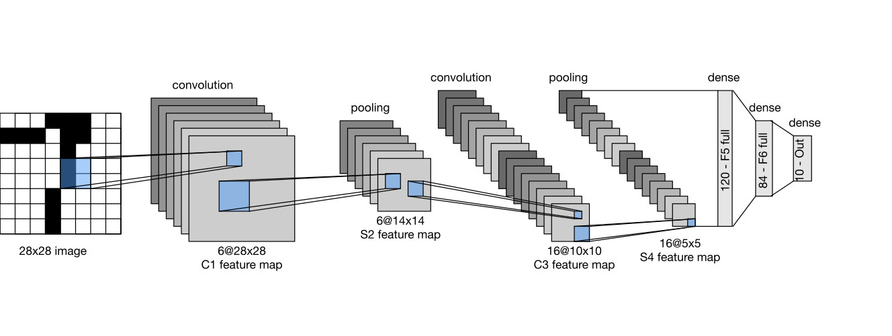]

.footnote[*: ConvNeXT (Liu et al, 2022) is the current state-of-the-art CNN for ImageNet classification, with 87.8% top-1 accuracy. Image credits: [Dive Into Deep Learning](https://d2l.ai/), 2020.]

???

Historically also dominant for sound and text, but transformers have largely taken over those domains. For images, CNNs remain competitive (ConvNeXt) but vision transformers are now equally common.

---

class: middle

For classification,
- the activation in the output layer is a Softmax activation producing a vector $\mathbf{\hat{p}} \in \bigtriangleup^C$ of probability estimates $\hat{p}\_i = p(y=i|\mathbf{x})$, where $C$ is the number of classes;
- the loss function is the cross-entropy loss $\ell(\mathbf{\hat{p}}, y) = -\log \hat{p}\_y$, where $\hat{p}\_y$ is the predicted probability of the true class $y$.

---

class: middle

## Image augmentation

Training data is the biggest bottleneck for deep learning models: .bold[augmentation] cheaply multiplies the effective dataset size by applying transformations that encode known invariances of the task.

.center.width-80[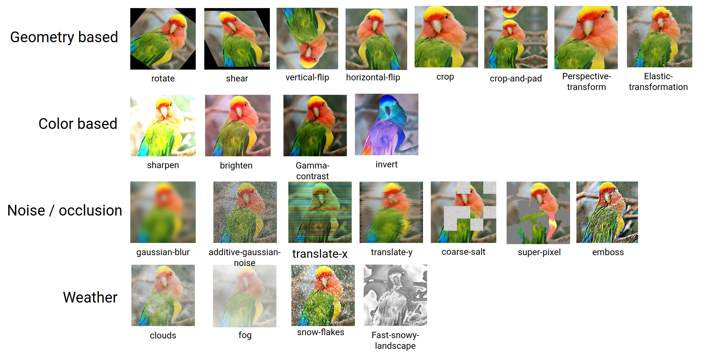]

.footnote[Credits: [DeepAugment](https://github.com/barisozmen/deepaugment), 2020.]

???

The key insight: augmentation is not just "more data". It tells the model .italic[what shouldn't matter] (position, scale, color jitter, flips, ...).

---

class: middle

.center.width-100[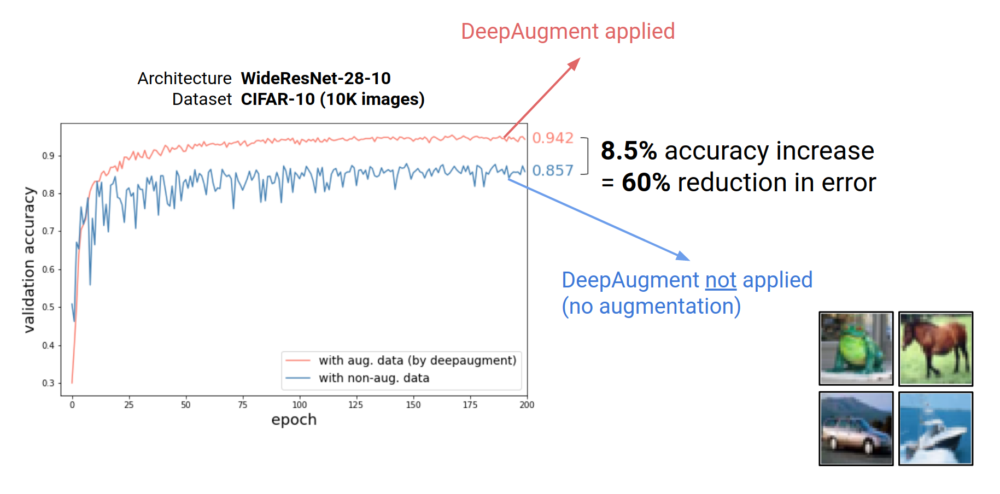]

.center[Because of the gains in performance, augmentation is now standard practice.]

.footnote[Credits: [DeepAugment](https://github.com/barisozmen/deepaugment), 2020.]

---

class: middle

## Pre-trained models

In recent years, training from scratch has become the .bold[exception], not the rule. Almost all practical vision systems start from a pre-trained backbone.
Many models pre-trained on large datasets are publicly available. 

Pre-trained models can be used 
- as feature extractors (.italic[transfer learning]) 
- or for smart initialization (.italic[fine-tuning]).

???

The models themselves should be considered as generic and re-usable assets.

---

class: middle

## Transfer learning

Take a pre-trained network, remove the last layer(s) and then treat the rest of the network as a .bold[frozen] feature extractor.
Train a new head from these features on the target task.

Often outperforms both handcrafted features and training from scratch on limited data.

 
.center.width-100[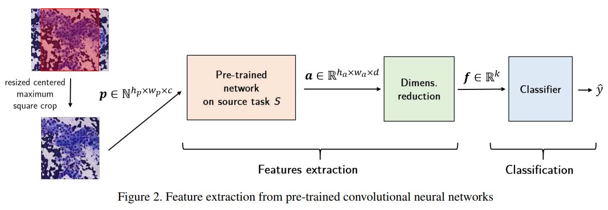]

.footnote[Credits: Mormont et al, [Comparison of deep transfer learning strategies for digital pathology](http://hdl.handle.net/2268/222511), 2018.]

---

class: middle

.center.width-65[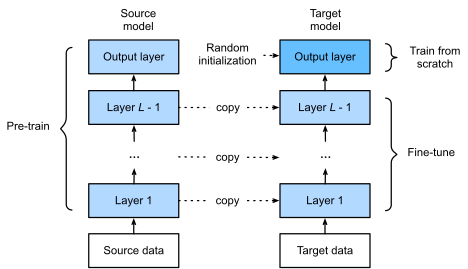]

## Fine-tuning

Same principle, but now also .bold[unfreeze] and update the weights of the pre-trained network. The entire model trains end-to-end on the new task, typically with a smaller learning rate for the pre-trained layers.

.footnote[Credits: [Dive Into Deep Learning](https://d2l.ai/), 2020.]

---

class: middle

Transferred and fine-tuned networks work even when the input domain differs significantly from the pre-training data (e.g., biomedical images, satellite imagery, paintings).

.center.width-75[]

.footnote[Credits: Matthia Sabatelli et al, [Deep Transfer Learning for Art Classification Problems](http://openaccess.thecvf.com/content_ECCVW_2018/papers/11130/Sabatelli_Deep_Transfer_Learning_for_Art_Classification_Problems_ECCVW_2018_paper.pdf), 2018.]

???

This phenomenon has only gotten stronger with larger models trained on more diverse data. Domain gap matters less than it used to.

---

class: middle

## Foundation models

Taken to its extreme, transfer learning has led to the rise of .bold[foundation models] (DINO, SigLIP, CLIP, etc):
- Pre-train a single large model on .bold[internet-scale] data (billions of images, image-text pairs, or both).
- The resulting representations are so general that they transfer to most downstream tasks with minimal or no adaptation.

???

The point is the paradigm shift: from "find a good ImageNet model and fine-tune" to "pick a foundation model that already understands your domain." 

- DINOv2: self-supervised, no labels needed. Learns from image structure alone.
- CLIP/SigLIP: trained on image-text pairs. Learns visual concepts from natural language supervision.

---

class: middle

.center.width-100[]

.center[Visualization of the first PCA components of DINOv2 features. These are so rich that they cluster images by semantic content, without any labels.]

.footnote[Credits: [Oquab et al](https://arxiv.org/abs/2304.07193), 2023.]

---

class: middle

.center.width-70[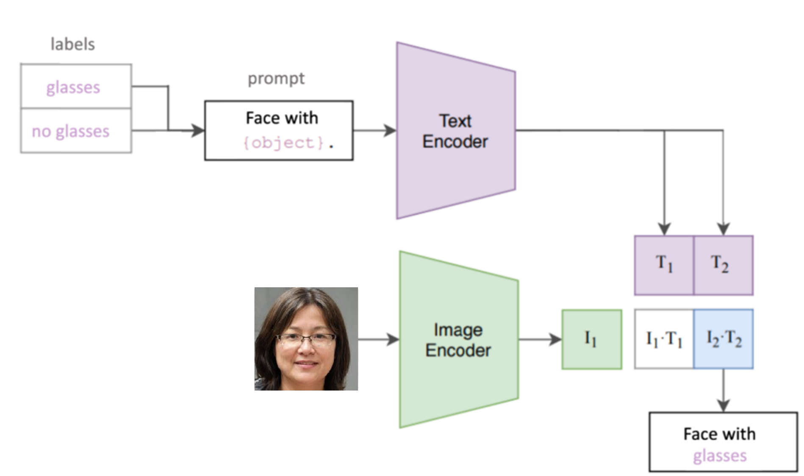]

## Zero-shot classification

Foundation models trained on image-text pairs (CLIP, SigLIP) can classify images without any task-specific training!

Given an image and a set of candidate text labels, the model scores each (image, text) pair by similarity. The highest-scoring label wins.

.footnote[Credits: [Radford et al](https://arxiv.org/abs/2103.00020), 2021.]

???

No fine-tuning. No labeled training set. Just a list of class names.

This is a genuine paradigm shift. Classical classification requires collecting labeled data, training a head, validating, etc. Zero-shot classification skips all of that.

Limitations: performance is below fine-tuned models on specialized domains, and the label set must be expressible in natural language. But for prototyping or broad categories, it often works surprisingly well.

---

class: middle, center

(demo)

---

class: middle

# Object detection

---

class: middle

The simplest strategy to move from image classification to object detection is to classify local regions, at multiple scales and locations.

.center.width-80[]

.footnote[Credits: Francois Fleuret, [EE559 Deep Learning](https://fleuret.org/ee559/), EPFL.]

---

class: middle 

.alert[The sliding window approach is .bold[computationally expensive] and does not reason about global context. Performance depends on the resolution and number of windows, and each is classified independently.]

.success[What we want instead: a single network that looks at the .bold[whole image once] and predicts all objects jointly.]

---

# YOLO

.center.width-65[]

YOLO (Redmon et al, 2015) models detection as a regression problem. 

The image is divided into an $S\times S$ grid and for each grid cell predicts $B$ bounding boxes, confidence for those boxes, and $C$ class probabilities. These predictions are encoded as an $S \times S \times (5B + C)$ tensor.

.footnote[Credits: [Redmon et al](https://arxiv.org/abs/1506.02640), 2015.]

---

class: middle

For $S=7$, $B=2$, $C=20$, the network predicts a vector of size $30$ for each cell.

.center.width-100[]

.footnote[Credits: Francois Fleuret, [EE559 Deep Learning](https://fleuret.org/ee559/), EPFL.]

---

class: middle

The network predicts class scores and bounding-box regressions, and .bold[although the output comes from fully connected layers, it has a 2D structure].

- Unlike sliding window techniques, YOLO is therefore capable of reasoning globally about the image when making predictions. 
- It sees the entire image during training and test time, so it implicitly encodes contextual information about classes as well as their appearance.

.footnote[Credits: Francois Fleuret, [EE559 Deep Learning](https://fleuret.org/ee559/), EPFL.]

---

class: middle

During training, YOLO makes the assumptions that any of the $S\times S$ cells contains at most (the center of) a single object. We define for every image, cell index $i=1, ..., S\times S$, predicted box $j=1, ..., B$ and class index $c=1, ..., C$,
- $\mathbb{1}\_i^\text{obj}$ is $1$ if there is an object in cell $i$, and $0$ otherwise;
- $\mathbb{1}\_{i,j}^\text{obj}$ is $1$ if there is an object in cell $i$ and predicted box $j$ is the most fitting one, and $0$ otherwise;
- $p\_{i,c}$ is $1$ if there is an object of class $c$ in cell $i$, and $0$ and otherwise;
- $x\_i, y\_i, w\_i, h\_i$ the annoted bouding box (defined only if $\mathbb{1}\_i^\text{obj}=1$, and relative in location and scale to the cell);
- $c\_{i,j}$ is the IoU between the predicted box and the ground truth target.

.footnote[Credits: Francois Fleuret, [EE559 Deep Learning](https://fleuret.org/ee559/), EPFL.]

---

class: middle

The training procedure first computes on each image the value of the $\mathbb{1}\_{i,j}^\text{obj}$'s and $c\_{i,j}$, and then does one step to minimize the multi-part loss function
.smaller2[
$$
\begin{aligned}
& \lambda\_\text{coord} \sum\_{i=1}^{S \times S} \sum\_{j=1}^B \mathbb{1}\_{i,j}^\text{obj} \left( (x\_i - \hat{x}\_{i,j})^2 + (y\_i - \hat{y}\_{i,j})^2 + (\sqrt{w\_i} - \sqrt{\hat{w}\_{i,j}})^2 + (\sqrt{h\_i} - \sqrt{\hat{h}\_{i,j}})^2\right)\\\\
& + \lambda\_\text{obj} \sum\_{i=1}^{S \times S} \sum\_{j=1}^B \mathbb{1}\_{i,j}^\text{obj} (c\_{i,j} - \hat{c}\_{i,j})^2 + \lambda\_\text{noobj} \sum\_{i=1}^{S \times S} \sum\_{j=1}^B (1-\mathbb{1}\_{i,j}^\text{obj}) \hat{c}\_{i,j}^2  \\\\
& + \lambda\_\text{classes} \sum\_{i=1}^{S \times S} \mathbb{1}\_i^\text{obj} \sum\_{c=1}^C (p\_{i,c} - \hat{p}\_{i,c})^2 
\end{aligned}
$$
]

where $\hat{p}\_{i,c}$, $\hat{x}\_{i,j}$, $\hat{y}\_{i,j}$, $\hat{w}\_{i,j}$, $\hat{h}\_{i,j}$ and $\hat{c}\_{i,j}$ are the network outputs.

.footnote[Credits: Francois Fleuret, [EE559 Deep Learning](https://fleuret.org/ee559/), EPFL.]

---

class: middle 

Training YOLO relies on .bold[many engineering choices] that illustrate well how involved is deep learning in practice:
- pre-train the 20 first convolutional layers on ImageNet classification;
- use $448 \times 448$ input for detection, instead of $224 \times 224$;
- use Leaky ReLUs for all layers;
- dropout after the first convolutional layer;
- normalize bounding boxes parameters in $[0,1]$;
- use a quadratic loss not only for the bounding box coordinates, but also for the confidence and the class scores;
- reduce weight of large bounding boxes by using the square roots of the size in the loss;
- reduce the importance of empty cells by weighting less the confidence-related loss on them;
- data augmentation with scaling, translation and HSV transformation.

.footnote[Credits: Francois Fleuret, [EE559 Deep Learning](https://fleuret.org/ee559/), EPFL.]

---

class: middle, center, black-slide

<iframe width="600" height="450" src="https://www.youtube.com/embed/YmbhRxQkLMg" frameborder="0" allowfullscreen></iframe>

YOLO (Redmon, 2015).

---

class: middle

## Two-stage detectors

An alternative to single-shot prediction is the two-stage approach: first, propose candidate regions that may contain objects, and then detect objects within those regions. This is the principle behind the R-CNN family (Girshick et al, 2014-2017):
- .bold[R-CNN]: Extract ~2000 region proposals (selective search), run a CNN on each. Accurate but slow.
- .bold[Fast R-CNN]: Share CNN computation across proposals using RoI pooling. Much faster.
- .bold[Faster R-CNN]: Replace selective search with a learned region proposal network (RPN). End-to-end trainable.

???

The full R-CNN evolution tells an optimization story: each iteration removes a bottleneck from the previous one. R-CNN is slow because it runs the CNN 2000 times. Fast R-CNN shares features but still uses handcrafted proposals. Faster R-CNN learns proposals too.

---

class: middle

.center.width-75[]

Faster R-CNN: a region proposal network (RPN) generates candidate boxes, which are then classified and refined by a second stage. The RPN is trained jointly with the detection head, so the whole system learns to propose and classify boxes together.

.footnote[Credits: [Dive Into Deep Learning](https://d2l.ai/), 2020.]

---

class: middle

For a long time, there was a clear accuracy gap between one-stage and two-stage detectors:
- One-stage (YOLO, SSD, RetinaNet): fast inference, simpler pipeline.
- Two-stage (Faster R-CNN and variants): traditionally more accurate, especially on small objects, but slower.

???

RetinaNet (Lin et al, 2017) is worth mentioning: it showed that one-stage detectors can match two-stage accuracy by fixing the class imbalance problem with focal loss. This was a key result that narrowed the accuracy gap.

---

class: middle, center, black-slide

<iframe width="600" height="450" src="https://www.youtube.com/embed/V4P_ptn2FF4" frameborder="0" allowfullscreen></iframe>

YOLOv2/YOLO 9000/SSD (one-stage) vs Faster R-CNN (two-stage)

---

class: middle

.width-100.center[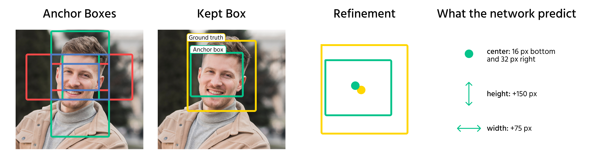]

## Beyond anchors

Both one-stage and two-stage detectors traditionally rely on .bold[anchors]: pre-defined box shapes that the network refines by predicting relative offsets. Anchors help with training stability and performance but require careful design and tuning.

Modern detectors drop anchors altogether and predict object centers and sizes directly (FCOS, CenterNet, YOLOv8+).

---

class: middle

.center.width-100[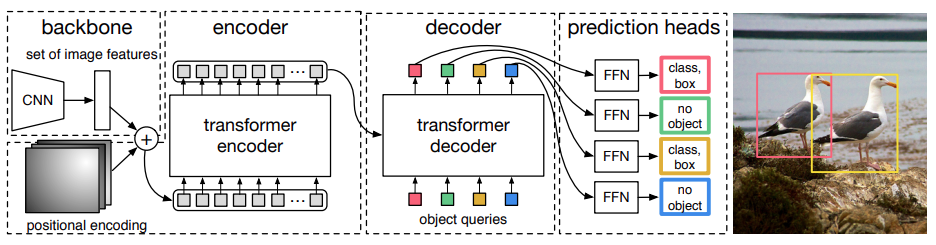]

## DETR

DETR (Carion et al, 2020) rethinks detection as a .bold[set prediction] problem.

A transformer encoder-decoder attends over the full image and directly outputs a fixed set of predictions. No anchors, no NMS, no region proposals.

.footnote[Credits: Carion et al, [End-to-End Object Detection with Transformers](https://arxiv.org/abs/2005.12872), 2020.]

???

Uses bipartite matching (Hungarian algorithm) to assign predictions to ground truth: each prediction maps to exactly one object or "no object." This replaces anchor assignment and NMS entirely.

The transformer architecture is covered in a later lecture. The key idea here is that attention enables global reasoning about all objects simultaneously.

Compare the YOLO loss (indicator functions, engineering choices) to DETR's clean set prediction loss. The complexity moves into the attention mechanism, which is general-purpose and learned.

Variants: Deformable DETR, DINO-DETR, RT-DETR (real-time).

---

class: middle

.success[The field has evolved rapidly, with many variants of both YOLO and DETR pushing the boundaries of speed and accuracy. The choice of architecture often depends on the specific requirements of the application (e.g., real-time inference, small object detection, etc.).]

.alert[However, the backbone architecture (ConvNeXt, Swin, ViT) often has a larger impact on performance than the choice of detection head (YOLO vs DETR).]

---

class: middle, center

(demo)

???

Live demo with the CV demo app. Show YOLO in action on webcam.
Compare YOLOv1-era results with modern detectors if time permits.

Use Lucie's kitchen set.
- Far vs. near detections
- Individual vs. packed detections
- Rotation, flip, etc

---

class: middle

# Segmentation

---

class: middle

.center.width-70[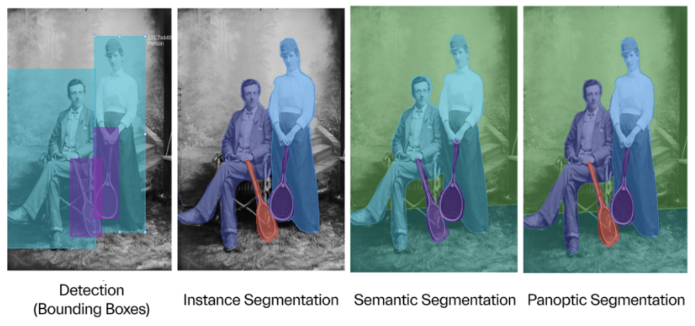]

Segmentation is the task of partitioning an image, at the pixel level, into regions:
- .bold[Semantic segmentation]: All pixels in an image are labeled with their class (e.g., car, pedestrian, road).
- .bold[Instance segmentation]: Pixels of detected objects are labeled with an instance ID (e.g., car 1, car 2, pedestrian 1).
- Panoptic segmentation: Combines semantic and instance segmentation. All pixels in an image are labeled with a class and an instance ID (if applicable).

.footnote[Credits: [Dive Into Deep Learning](https://d2l.ai/), 2020.]

---

class: middle

The deep learning approach casts semantic segmentation as pixel classification. Convolutional networks can be used for that purpose, but with a few adaptations.

---

class: middle

.center.width-100[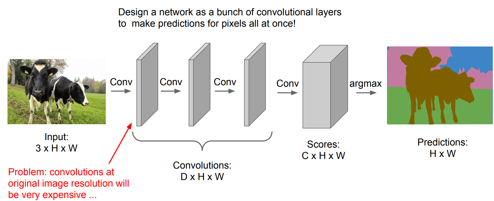]

.footnote[Credits: [CS231n, Lecture 11](http://cs231n.stanford.edu/slides/2018/cs231n_2018_lecture11.pdf), 2018.]

---

class: middle

.center.width-100[]

.footnote[Credits: [CS231n, Lecture 11](http://cs231n.stanford.edu/slides/2018/cs231n_2018_lecture11.pdf), 2018.]

???

Convolution and pooling layers reduce the input width and height, or keep them unchanged.

Semantic segmentation requires to predict values for each pixel, and therefore needs to increase input width and height.

Fully connected layers could be used for that purpose but would face the same limitations as before (spatial specialization, too many parameters).

Ideally, we would like layers that implement the inverse of convolutional
 and pooling layers.

---

class: middle

## Transposed convolution

A transposed convolution is a convolution where the implementation of the forward and backward passes
are swapped.

Given a convolutional kernel $\omega$,
- the forward pass is implemented as $v(\mathbf{h}) = \mathbf{W} v(\mathbf{x})$ with appropriate reshaping, thereby effectively up-sampling an input $v(\mathbf{x})$ into a larger one;
- the backward pass is computed by multiplying the loss by $\mathbf{W}^T$ instead of $\mathbf{W}$.

(This transposes the convolution operation, for which the forward pass is $v(\mathbf{h}) = \mathbf{W}^T v(\mathbf{x})$ and the backward pass is computed by multiplying the loss by $\mathbf{W}$.)

???

In a regular convolution,
- the forward pass is equivalent to $v(\mathbf{h}) = \mathbf{W}^T v(\mathbf{x})$;
- the backward pass is computed by multiplying the loss by $\mathbf{W}$.

Transposed convolutions are also referred to as fractionally-strided convolutions or deconvolutions (mistakenly).

---

class: middle

.center.width-100[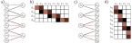]

a), b) Convolution with kernel $\omega$ of size $k=3$, stride $s=2$ and padding $p=1$.  

c), d) Transposed convolution with the same kernel, stride and padding, which implements the transposed transformation of a) and b).

---

exclude: true
class: middle

.pull-right[  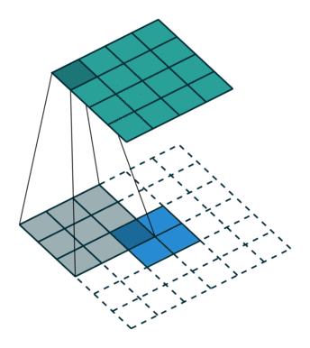]

$$
\begin{aligned}
\mathbf{W} v(\mathbf{x}) &= v(\mathbf{h}) \\\\
\begin{pmatrix}
1 & 0 & 0 & 0 \\\\
4 & 1 & 0 & 0 \\\\
1 & 4 & 0 & 0 \\\\
0 & 1 & 0 & 0 \\\\
1 & 0 & 1 & 0 \\\\
4 & 1 & 4 & 1 \\\\
3 & 4 & 1 & 4 \\\\
0 & 3 & 0 & 1 \\\\
3 & 0 & 1 & 0 \\\\
3 & 3 & 4 & 1 \\\\
1 & 3 & 3 & 4 \\\\
0 & 1 & 0 & 3 \\\\
0 & 0 & 3 & 0 \\\\
0 & 0 & 3 & 3 \\\\
0 & 0 & 1 & 3 \\\\
0 & 0 & 0 & 1
\end{pmatrix}
\begin{pmatrix}
2 \\\\
1 \\\\
4 \\\\
4
\end{pmatrix} &=
\begin{pmatrix}
2 \\\\
9 \\\\
6 \\\\
1 \\\\
6 \\\\
29 \\\\
30 \\\\
7 \\\\
10 \\\\
29 \\\\
33 \\\\
13 \\\\
12 \\\\
24 \\\\
16 \\\\
4
\end{pmatrix}
\end{aligned}$$

.footnote[Credits: Dumoulin and Visin, [A guide to convolution arithmetic for deep learning](https://arxiv.org/abs/1603.07285), 2016.]

---

class: middle

## Fully convolutional networks (FCNs)

.grid[
.kol-3-4[

A fully convolutional network (FCN) is a convolutional network that replaces the fully connected layers with convolutional layers and transposed convolutional layers. 

For semantic segmentation, the simplest design of a fully convolutional network consists in:
- using a (pre-trained) convolutional network for downsampling and extracting image features;
- replacing the dense layers with a  $1 \times 1$ convolution layer to  transform the number of channels into the number of categories;
- upsampling the feature map to the size of the input image by using one (or several) transposed convolution layer(s).
]
.kol-1-4[.center.width-90[]]
]

---

class: middle

Contrary to fully connected networks, the dimensions of the output of a fully convolutional network is not fixed. It directly depends on the dimensions of the input, which can be images of arbitrary sizes.

---

class: middle

The most natural loss for segmentation is the .bold[per-pixel cross-entropy]
$$\ell = -\frac{1}{HW}\sum\_{ij} \log \hat{p}\_{y\_{ij}},$$
where $\hat{p}\_{y\_{ij}}$ is the predicted probability of the true class $y\_{ij}$ at pixel $(i,j)$.

In practice, classes are often highly imbalanced (e.g., a small tumor in a large scan). The .bold[Dice loss] directly optimizes the overlap between predicted and ground truth masks,
$$\ell\_\text{Dice} = 1 - \frac{2 \sum\_{ij} \hat{p}\_{ij} y\_{ij}}{\sum\_{ij} \hat{p}\_{ij} + \sum\_{ij} y\_{ij}}.$$

???

Dice loss comes from the Dice coefficient (= F1 score for sets). It directly measures mask overlap, so it's less sensitive to class imbalance than cross-entropy.

For multi-class segmentation, Dice is typically computed per class and averaged.

---

class: middle

.center.width-100[]

.alert[The FCN architecture is simple and effective, but the low-resolution representation in the middle is a .bold[bottleneck] for performance. It must retain enough information to reconstruct the high-resolution segmentation map, which can be challenging.]

.footnote[Credits: Simon J.D. Prince, [Understanding Deep Learning](https://udlbook.github.io/udlbook/), 2023.]

---

class: middle

## UNet

The .bold[UNet] architecture is an encoder-decoder architecture with skip connections (usually concatenations) that directly connect the encoder and decoder layers at the same resolution. In this way, the decoder can use both
- the corresponding high-resolution features from the encoder, and
- the lower-resolution features from the previous layers.

.center.width-80[]

.footnote[Credits: Simon J.D. Prince, [Understanding Deep Learning](https://udlbook.github.io/udlbook/), 2023.]

???

Take the time to explain that that same architecture can be used for image to image mappings, as in some of their projects.

Insist once again on the increasing number of kernels (=out_channels) in the encoder and the decreasing number of kernels in the decoder.

Mention the final 1x1 convolution to reduce the number of channels to the number of classes.

---

class: middle

.center.width-100[]

3d segmentation results using a UNet architecture. (a) Slices of a 3d volume of a mouse cortex, (b) A UNet is used to classify voxels as either inside or outside neutrites. Connected regions are shown with different colors, (c) 5-member ensemble of UNets.

.footnote[Credits: Simon J.D. Prince, [Understanding Deep Learning](https://udlbook.github.io/udlbook/), 2023.]

---

class: middle

.center[(demo of `code/lec6-unet.ipynb`)]

---

class: middle

## Mask R-CNN

.grid[
.kol-1-2[

Mask R-CNN extends Faster R-CNN for .bold[instance segmentation]:
- The RoI pooling layer is replaced with an RoI alignment layer. 
- A parallel FCN branch predicts a segmentation mask for each detected object.
- Detection + mask prediction gives per-instance pixel labels.

]
.kol-1-2[.center.width-95[]]
]

.footnote[Credits: [Dive Into Deep Learning](https://d2l.ai/), 2020.]

???

Regions of interest (RoIs) are the candidate boxes proposed by the RPN. Both the detection head and the mask head operate on features pooled from these RoIs. Fixed-size feature maps are extracted for each RoI, which are then fed into the respective heads.

RoI pooling: divides the proposal region into a fixed grid and applies max pooling to each grid cell, which can cause misalignments due to quantization.

RoI alignment: uses bilinear interpolation to compute the exact values at the grid points, eliminating quantization issues and improving mask quality.

---

class: middle

.center.width-100[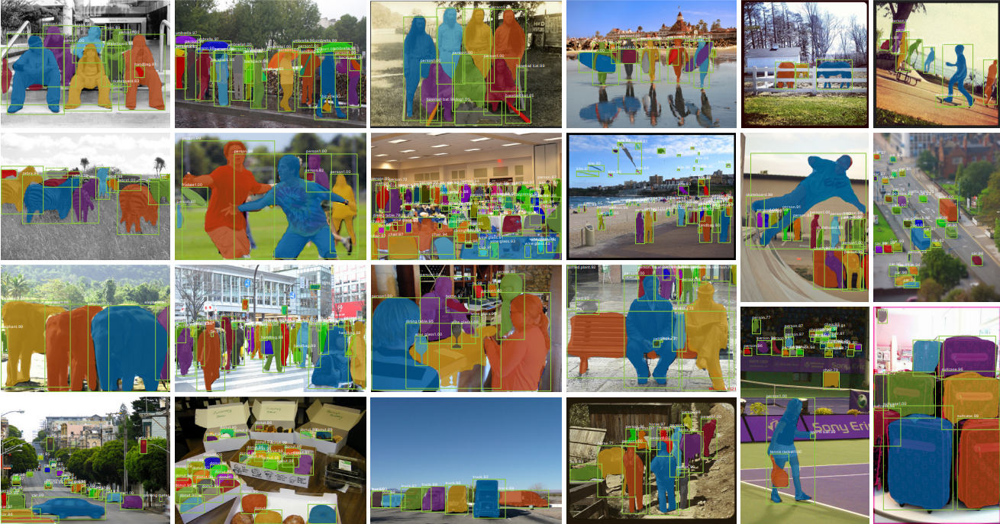]

.footnote[Credits: [He et al](https://arxiv.org/abs/1703.06870), 2017.]

---

class: middle, center, black-slide

<iframe width="600" height="450" src="https://www.youtube.com/embed/OOT3UIXZztE" frameborder="0" allowfullscreen></iframe>

---

class: middle

.center.width-100[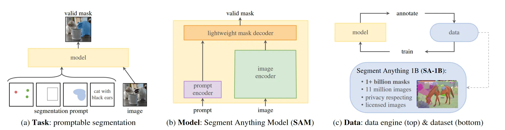]

## SAM

The Segment Anything Model (Kirillov et al, 2023) is a .bold[foundation model for segmentation].

Given a prompt (point, box, or text), SAM segments the corresponding region. Trained on 1 billion+ masks, it generalizes to unseen objects and domains without fine-tuning.

.footnote[Credits: [Kirillov et al](https://arxiv.org/abs/2304.02643), 2023.]

???

SAM consists of three components:
1. An image encoder (ViT) that computes image embeddings once.
2. A prompt encoder that encodes points, boxes, or text.
3. A lightweight mask decoder that combines both to produce masks.

The image encoder is expensive but runs once per image. The mask decoder is fast, enabling interactive segmentation in real time.

SAM is to segmentation what CLIP is to classification: a foundation model that works out of the box on nearly anything.

---

class: middle

.center[(demo)]

???

Show SAM in the CV demo: freeze a frame, click to segment objects.
Show how foreground/background points refine the mask.
Compare with Mask R-CNN or YOLOv8-seg on the same frame.

---

class: middle

## The big picture

Across classification, detection, and segmentation, the same evolution has occurred:

1. Task-specific architectures with hand-designed components.
2. Pre-trained backbones shared across tasks.
3. Foundation models that generalize with minimal or no adaptation.

.success[Common computer vision tasks are now considered "solved" in the sense that we have models that perform well on benchmarks and can be applied to real-world problems with little effort.]

???

But challenges remain: domain shift, long-tail distributions, real-time performance on edge devices, video understanding, 3D perception, etc. The field continues to evolve rapidly.

---

class: end-slide, center
count: false

The end.

???

Quiz:
- What architecture would you use on images?
- Would you train from scratch?
- What is the difference between object detection and segmentation?
- Name one architecture for object detection.
- Name one architecture for semantic segmentation.
- What kind of layer can you use to upscale a feature map?
- What is a foundation model? Give an example for each task.