class: middle, center, title-slide

# Deep Learning

Lecture 7: Attention and transformers

  
Prof. Gilles Louppe 
[g.louppe@uliege.be](mailto:g.louppe@uliege.be)

???

- Add https://poloclub.github.io/transformer-explainer/

---

# Today

Attention is all you need!
- Encoder-decoder
- Bahdanau attention
- Attention layers
- Transformers

???

Mission: learn about a novel and fundamental building block in modern neural networks. This brick can replace both FC and convolutional layers.

---

class: middle

# Encoder-decoder

---

class: middle

Many real-world problems require to process a signal with a **sequence** structure.

- Sequence classification:
    - sentiment analysis in text
    - activity/action recognition in videos
    - DNA sequence classification
- Sequence synthesis:
    - text synthesis
    - music synthesis
    - motion synthesis
- Sequence-to-sequence translation:
    - speech recognition
    - text translation
    - part-of-speech tagging

.footnote[Credits: Francois Fleuret, [14x050/EE559 Deep Learning](https://fleuret.org/dlc/), EPFL.]

???

Draw all 3 setups.

---

class: middle

Given a set $\mathcal{X}$, if $S(\mathcal{X})$ denotes the set of sequences of elements from $\mathcal{X}$,
$$S(\mathcal{X}) = \cup\_{t=1}^\infty \mathcal{X}^t,$$
then we formally define:

.grid.center[
.kol-1-2.bold[Sequence classification]
.kol-1-2[$f: S(\mathcal{X}) \to \bigtriangleup^C$]
]
.grid.center[
.kol-1-2.bold[Sequence synthesis]
.kol-1-2[$f: \mathbb{R}^d \to S(\mathcal{X})$]
]
.grid.center[
.kol-1-2.bold[Sequence-to-sequence translation]
.kol-1-2[$f: S(\mathcal{X}) \to S(\mathcal{Y})$]
]

 
In the rest of the slides, we consider only time-indexed signal, although it generalizes to arbitrary sequences.

.footnote[Credits: Francois Fleuret, [EE559 Deep Learning](https://fleuret.org/ee559/), EPFL.]

---

class: middle

When the input is a sequence $\mathbf{x} \in S(\mathbb{R}^p)$ of variable length, the historical approach is to use a recurrent .bold[encoder-decoder] architecture that first compresses the input into a single vector $v$ and then uses it to generate the output sequence.

 

.center.width-85[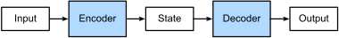]

.footnote[Credits: [Dive Into Deep Learning](https://d2l.ai), 2023.]

---

class: middle

.center.width-100[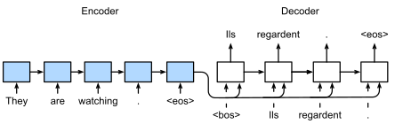]

Recurrent encoder-decoder models compress an input sequence $\mathbf{x}\_{1:T}$ into a single thought vector $v$, and then produce an output sequence $\mathbf{y}\_{1:T'}$ from an autoregressive generative model
$$\begin{aligned}
\mathbf{h}\_t &= \phi(\mathbf{x}\_t, \mathbf{h}\_{t-1})\\\\
v &= \mathbf{h}\_{T} \\\\
\mathbf{y}\_{i} &\sim p(\cdot | \mathbf{y}\_{1:i-1}, v).
\end{aligned}$$

.footnote[Credits: [Dive Into Deep Learning](https://d2l.ai), 2023.]

???

Blackboard: translate to French the following sentence. 

"The animal didn't cross the street because it was too tired."

->

"L'animal n'a pas traversé la rue car il était trop fatigué."

Imitate how the RNN would translate this sentence.

---

class: middle

.center.width-80[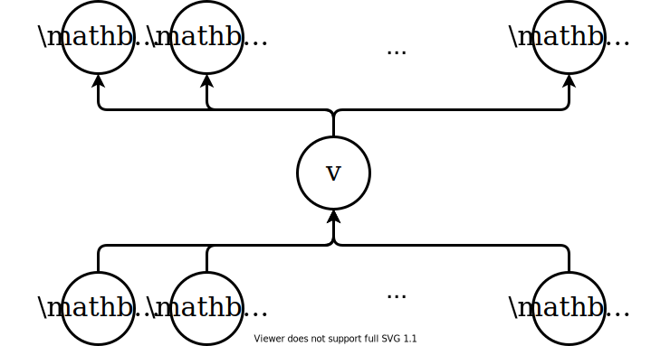]

This architecture assumes that the sole vector $v$ carries enough information to generate entire output sequences. This is often **challenging** for long sequences.

???

There are not direct "channels" to transport local information from the input sequence to the place where it is useful in the resulting sequence.

The problem is similar as last time with FCN without skip connections: the information is bottlenecked in the single vector $v$.

---

class: middle

# Bahdanau attention

---

class: black-slide
background-image: url(figures/lec7/vision.png)
background-size: cover

---

class: middle

.center.width-75[]

Using the nonvolitional cue based on saliency (red cup, non-paper), attention is involuntarily directed to the coffee.

.footnote[Credits: [Dive Into Deep Learning](https://d2l.ai), 2023.]

???

Volitional: Related to the faculty or power of using one's will.

---

class: middle

.center.width-75[]

Using the volitional cue (want to read a book) that is task-dependent, attention is directed to the book under volitional control.

.footnote[Credits: [Dive Into Deep Learning](https://d2l.ai), 2023.]

---

class: middle

.center.width-100[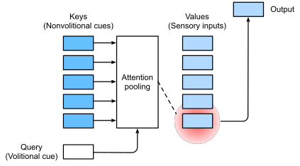]

.footnote[Credits: [Dive Into Deep Learning](https://d2l.ai), 2023.]

---

class: middle

Attention mechanisms can transport information from parts of the input signal to parts of the output .bold[specified dynamically].

Under the assumption that each output token comes from one or a handful of input tokens, the decoder should attend to only those tokens that are relevant for producing the next output token.

.center.width-80[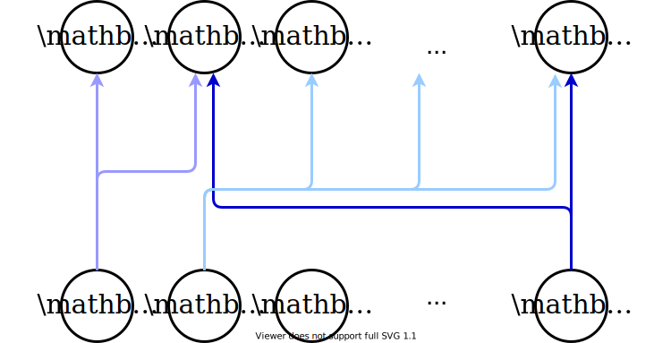]

???

Blackboard: translate to French the following sentence. 

"The animal didn't cross the street because it was too tired."

->

"L'animal n'a pas traversé la rue car il était trop fatigué."

---

class: middle

## Attention-based machine translation

.center.width-90[]

.footnote[Credits: [Dive Into Deep Learning](https://d2l.ai), 2023.]

???

Same RNN-based encoder-decoder architecture, but with an attention mechanism in between.

---

class: middle

Following Bahdanau et al. (2014), the encoder is specified as a bidirectional recurrent neural network (RNN) that computes an annotation vector for each input token,
$$\mathbf{h}\_j = (\overrightarrow{\mathbf{h}}\_j, \overleftarrow{\mathbf{h}}\_j)$$
for $j = 1, \ldots, T$, where $\overrightarrow{\mathbf{h}}\_j$ and $\overleftarrow{\mathbf{h}}\_j$ respectively denote the forward and backward hidden recurrent states of the bidirectional RNN.

From this, they compute a new process $\mathbf{s}\_i$, $i=1, \ldots, T'$, which looks at weighted averages of the $\mathbf{h}\_j$ where the .bold[weights are functions of the signal].

.footnote[Credits: Francois Fleuret, [Deep Learning](https://fleuret.org/dlc/), UNIGE/EPFL.]

---

class: middle

Given $\mathbf{y}\_1, \ldots, \mathbf{y}\_{i-1}$ and $\mathbf{s}\_1, \ldots, \mathbf{s}\_{i-1}$, first compute an attention vector
$$\mathbf{\alpha}\_{i,j} = \text{softmax}\_j(a(\mathbf{s}\_{i-1}, \mathbf{h}\_j))$$
for $j=1, \ldots, T$, whered $a$ is an .bold[attention scoring function], here specified as a one hidden layer $\text{tanh}$ MLP.

Then, compute the context vector from the weighted $\mathbf{h}\_j$'s,
$$\mathbf{c}\_i = \sum\_{j=1}^T \alpha\_{i, j} \mathbf{h}\_j.$$

.footnote[Credits: Francois Fleuret, [Deep Learning](https://fleuret.org/dlc/), UNIGE/EPFL.]

???

Note that the attention weights depend on the content, rather than on the position in sentence. This means they act as a form of *content-based* addressing.

---

class: middle

The model can now make the prediction $\mathbf{y}\_i$ as
$$
\begin{aligned}
\mathbf{s}\_i &= f(\mathbf{s}\_{i-1}, y\_{i-1}, c\_i)  \\\\
\mathbf{y}\_i &\sim g(\mathbf{y}\_{i-1}, \mathbf{s}\_i, \mathbf{c}\_i),
\end{aligned}
$$
where $f$ is a GRU.

This is **context attention**, where $\mathbf{s}\_{i-1}$ modulates what to look in $\mathbf{h}\_1, \ldots, \mathbf{h}\_{T}$ to compute $\mathbf{s}\_i$ and sample $\mathbf{y}\_i$.

???

Do a blackboard example.

---

class: middle

.center.width-100[]

???

- Source = English
- Target = French

---

class: middle

# Attention layers

---

class: middle

The attention mechanisms can be defined generically as follows.

Given a context or query vector $\mathbf{q} \in \mathbb{R}^{q}$, a key tensor $\mathbf{K} \in \mathbb{R}^{m \times k}$, and a value tensor $\mathbf{V} \in \mathbb{R}^{m \times v},$ an attention layer computes an output vector $\mathbf{y} \in \mathbb{R}^{v}$
with $$\mathbf{y} = \sum\_{i=1}^m \text{softmax}\_i(a(\mathbf{q}, \mathbf{K}\_i; \theta)) \mathbf{V}\_i,$$
where $a : \mathbb{R}^q \times \mathbb{R}^k \to \mathbb{R}$ is a scalar attention scoring function.

---

class: middle

.center.width-100[]

.footnote[Credits: [Dive Into Deep Learning](https://d2l.ai), 2023.]

---

class: middle

## Additive attention

When queries and keys are vectors of different lengths, we can use an additive attention as the scoring function.

Given $\mathbf{q} \in \mathbb{R}^{q}$ and $\mathbf{k} \in \mathbb{R}^{k}$, the **additive attention** scoring function is
$$a(\mathbf{q}, \mathbf{k}) = \mathbf{w}_v^T \tanh(\mathbf{W}\_q^T \mathbf{q} + \mathbf{W}\_k^T \mathbf{k})$$
where $\mathbf{w}_v \in \mathbb{R}^h$, $\mathbf{W}_q \in \mathbb{R}^{q \times h}$ and $\mathbf{W}_k \in \mathbb{R}^{k \times h}$ are learnable parameters.

---

class: middle

## Scaled dot-product attention

When queries and keys are vectors of the same length $d$, we can use a scaled dot-product attention as the scoring function.

Given $\mathbf{q} \in \mathbb{R}^{d}$ and $\mathbf{k} \in \mathbb{R}^{d}$, the **scaled dot-product attention** scoring function is
$$a(\mathbf{q}, \mathbf{k}) = \frac{\mathbf{q}^T \mathbf{k}}{\sqrt{d}}.$$

---

class: middle

For $n$ queries $\mathbf{Q} \in \mathbb{R}^{n \times d}$, keys $\mathbf{K} \in \mathbb{R}^{m \times d}$ and values $\mathbf{V} \in \mathbb{R}^{m \times v}$, the **scaled dot-product attention** layer computes an output tensor 
$$\mathbf{Y} = \underbrace{\text{softmax}\left(\frac{\mathbf{QK}^T}{\sqrt{d}}\right)}\_{\text{attention matrix}\, \mathbf{A}}\mathbf{V} \in \mathbb{R}^{n \times v}.$$

---

class: middle

.center.width-80[]

Recall that the dot product is simply a un-normalised cosine similarity, which tells us about the alignment of two vectors.

Therefore, the $\mathbf{QK}^T$ matrix is a **similarity matrix** between queries and keys.

---

class: middle

.center.width-100[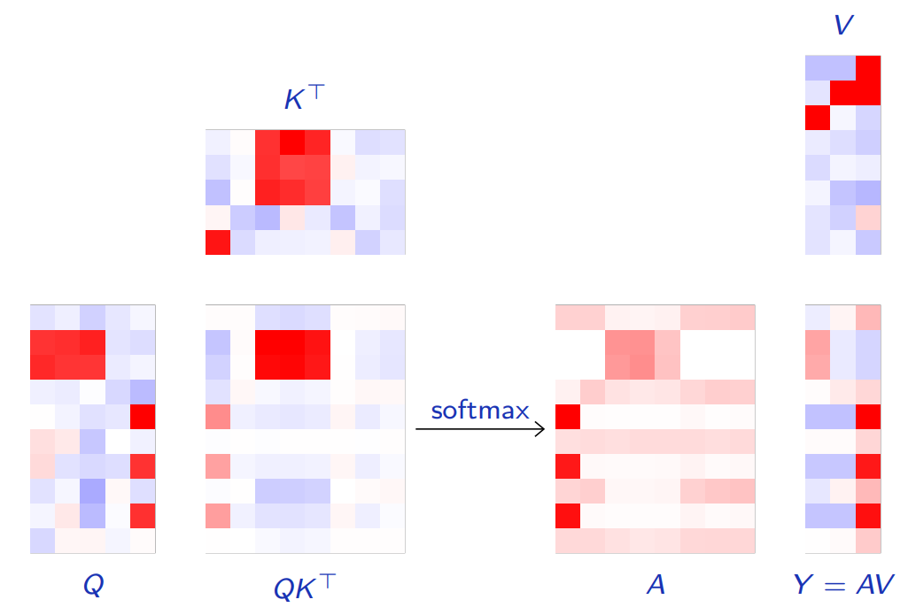]

.footnote[Credits: Francois Fleuret, [Deep Learning](https://fleuret.org/dlc/), UNIGE/EPFL.]

---

class: middle

In the currently standard models for sequences, the queries, keys and values are linear functions of the inputs.

Given the learnable matrices $\mathbf{W}\_q \in \mathbb{R}^{d \times x}$, $\mathbf{W}\_k \in \mathbb{R}^{d \times x'}$, and $\mathbf{W}\_v \in \mathbb{R}^{v \times x'}$, and two input sequences $\mathbf{X} \in \mathbb{R}^{n \times x}$ and $\mathbf{X}' \in \mathbb{R}^{m \times x'}$, we have
$$\begin{aligned} 
\mathbf{Q} &= \mathbf{X} \mathbf{W}\_q^T \in \mathbb{R}^{n \times d} \\\\
\mathbf{K} &= \mathbf{X'} \mathbf{W}\_k^T \in \mathbb{R}^{m \times d} \\\\
\mathbf{V} &= \mathbf{X'} \mathbf{W}\_v^T \in \mathbb{R}^{m \times v}.
\end{aligned}$$

---

class: middle

## Self-attention

When the queries, keys and values are derived from the same inputs, the attention mechanism is called **self-attention**.

For the scaled dot-product attention, the self-attention layer is obtained when $\mathbf{X} = \mathbf{X}'$.

Therefore, self-attention can be used as a regular feedforward-kind of layer, similarly to fully-connected or convolutional layers.

 
.center.width-60[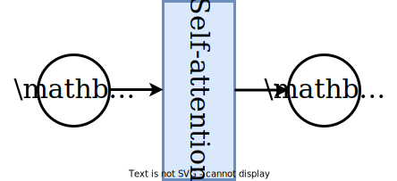]

---

class: middle 

## CNNs vs. RNNs vs. self-attention

.center.width-80[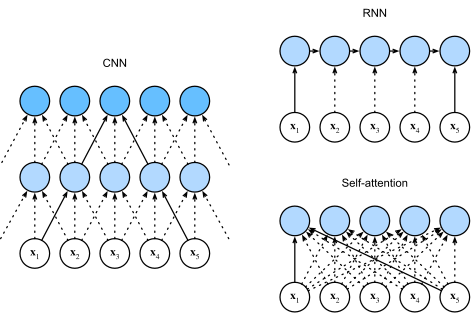]

.footnote[Credits: [Dive Into Deep Learning](https://d2l.ai), 2023.]

???

Compare visually on the blackboard and show the similarities and differences.

---

class: middle

.center.width-100[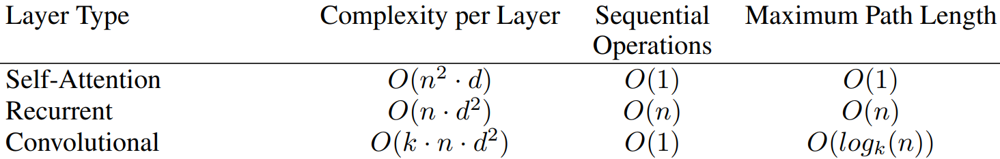]

where $n$ is the sequence length, $d$ is the embedding dimension, and $k$ is the kernel size of convolutions.

???

As noted in Table 1, a self-attention layer connects all positions with a constant number of sequentially
executed operations, whereas a recurrent layer requires O(n) sequential operations. In terms of
computational complexity, self-attention layers are faster than recurrent layers when the sequence
length n$$ is smaller than the representation dimensionality $d$, which is most often the case with
sentence representations used by state-of-the-art models in machine translations, such as word-piece
[38] and byte-pair [31] representations. 

A single convolutional layer with kernel width $k < n$ does not connect all pairs of input and output
positions. Doing so requires a stack of $O(n/k)$ convolutional layers in the case of contiguous kernels,
or $O(logk(n))$ in the case of dilated convolutions [18], increasing the length of the longest paths
between any two positions in the network. Convolutional layers are generally more expensive than
recurrent layers, by a factor of $k$. 

---

class: middle

## A toy example

To illustrate the behavior of the attention mechanism, we consider a toy problem with 1d sequences composed of two triangular and two rectangular patterns. The target sequence averages the heights in each pair of shapes.

.center.width-100[]

.footnote[Credits: Francois Fleuret, [Deep Learning](https://fleuret.org/dlc/), UNIGE/EPFL.]

---

class: middle

.center.width-80[]

.footnote[Credits: Francois Fleuret, [Deep Learning](https://fleuret.org/dlc/), UNIGE/EPFL.]

---

class: middle

We can modify the toy problem to consider targets where the pairs to average are the two right and leftmost shapes.

.center.width-100[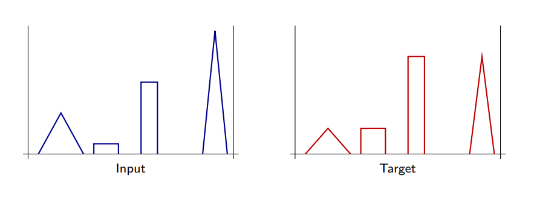]

.footnote[Credits: Francois Fleuret, [Deep Learning](https://fleuret.org/dlc/), UNIGE/EPFL.]

---

class: middle

The performance is expected to be poor given the inability of the self-attention layer to take into account absolute or relative positions. Indeed, self-attention is permutation-invariant:
$$\begin{aligned}
\mathbf{y} &= \sum\_{i=1}^m \text{softmax}\_i\left(\frac{\mathbf{q}^T{\mathbf{K}^T\_{i}}}{\sqrt{d}}\right) \mathbf{V}\_{i}\\\\
&= \sum\_{i=1}^m \text{softmax}\_{i}\left(\frac{\mathbf{q}^T{\mathbf{K}^T\_{\sigma(i)}}}{\sqrt{d}}\right) \mathbf{V}\_{\sigma(i)}
\end{aligned}$$
for any permutation $\sigma$ of the key-value pairs.

(It is also permutation-equivariant with permutation $\sigma$ of the queries.)

---

class: middle

.center.width-80[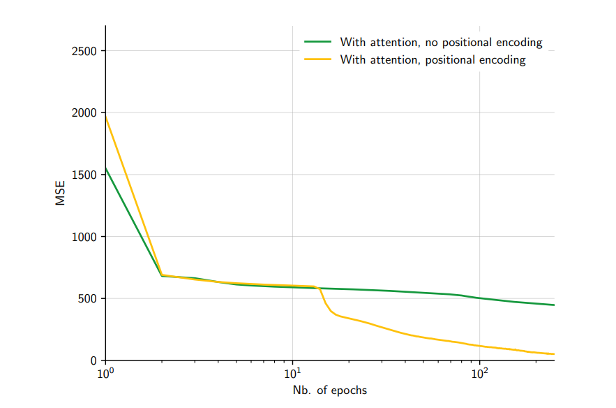]

However, this problem can be fixed by providing positional encodings explicitly to the attention layer.

.footnote[Credits: Francois Fleuret, [Deep Learning](https://fleuret.org/dlc/), UNIGE/EPFL.]

---

class: middle

# Transformers

---

class: middle

Vaswani et al. (2017) proposed to go one step further: instead of using attention mechanisms as a supplement to standard convolutional and recurrent layers, they designed a model, the .bold[transformer], combining only attention layers.

The transformer was designed for a sequence-to-sequence translation task, but it is currently key to state-of-the-art approaches across NLP tasks.

.footnote[Credits: Francois Fleuret, [Deep Learning](https://fleuret.org/dlc/), UNIGE/EPFL.]

---

class: middle

## Scaled dot-product attention

The first building block of the transformer architecture is a scaled dot-production attention module
$$\text{attention}(\mathbf{Q}, \mathbf{K}, \mathbf{V}) = \text{softmax}\left(\frac{\mathbf{Q}\mathbf{K}^T}{\sqrt{d\_k}}\right) \mathbf{V}$$
where the $1/\sqrt{d\_k}$ scaling is used to keep the (softmax's) temperature constant across different choices of the query/key dimension $d\_k$.

---

class: middle

.center.width-55[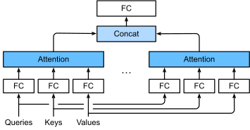]

## Multi-head attention

The transformer projects the queries, keys and values $h=8$ times with distinct linear projections to $d\_k=64$, $d\_k=64$ and $d\_v=64$ dimensions respectively.
$$
\begin{aligned}
\text{multihead}(\mathbf{Q}, \mathbf{K}, \mathbf{V}) &= \text{concat}\left(\mathbf{H}\_1, \ldots, \mathbf{H}\_h\right) \mathbf{W}^O\\\\
\mathbf{H}\_i &= \text{attention}(\mathbf{Q}\mathbf{W}\_i^Q, \mathbf{K}\mathbf{W}\_i^K, \mathbf{V}\mathbf{W}\_i^V)
\end{aligned}
$$
with
$$\mathbf{W}\_i^Q \in \mathbb{R}^{d\_\text{model} \times d\_k}, \mathbf{W}\_i^K \in \mathbb{R}^{d\_\text{model} \times d\_k}, \mathbf{W}\_i^V \in \mathbb{R}^{d\_\text{model} \times d\_v}, \mathbf{W}\_i^O \in \mathbb{R}^{hd\_v \times d\_\text{model}}$$

.footnote[Credits: [Dive Into Deep Learning](https://d2l.ai), 2023.]

---

class: middle

## Encoder-decoder architecture

The transformer model is composed of:
- An encoder that combines $N=6$ modules, each composed of a multi-head attention sub-module, and a (per-component) one-hidden-layer MLP, with residual pass-through and layer normalization. All sub-modules and embedding layers produce outputs of dimension $d\_\text{model}=512$.
- A decoder that combines $N=6$ modules similar to the encoder, but using masked self-attention to prevent positions from attending to subsequent positions. In addition, the decoder inserts a third sub-module which performs multi-head attention over the output of the encoder stack.

---

class: middle

.center.width-60[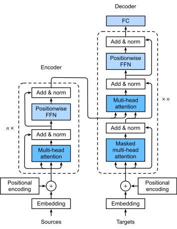]

.footnote[Credits: [Dive Into Deep Learning](https://d2l.ai), 2023.]

---

class: middle

.center.width-90[]

The encoders start by processing the input sequence. The output of the top encoder is then transformed into a set of attention vectors $\mathbf{K}$ and $\mathbf{V}$ passed to the decoders.

.footnote[Credits: Jay Alammar, [The Illustrated Transformer](https://jalammar.github.io/illustrated-transformer/).]

---

class: middle

.center.width-90[]

Each step in the decoding phase produces an output token, until a special symbol is reached indicating the completion of the transformer decoder's output.

The output of each step is fed to the bottom decoder in the next time step, and the decoders bubble up their decoding results just like the encoders did. 

.footnote[Credits: Jay Alammar, [The Illustrated Transformer](https://jalammar.github.io/illustrated-transformer/).]

---

class: middle

In the decoder:
- The first masked self-attention sub-module is only allowed to attend to earlier positions in the output sequence. This is done by masking future positions.
- The second multi-head attention sub-module works just like multi-head self-attention, except it creates its query matrix from the layer below it, and takes the keys and values matrices from the output of the encoder stack.

.footnote[Credits: Jay Alammar, [The Illustrated Transformer](https://jalammar.github.io/illustrated-transformer/).]

---

class: middle

## Positional encoding

As each word in a sentence .italic[simultaneously] flows through the encoder/decoder stack, the model itself does not have any sense of position/order for each word.

Positional information is provided through an **additive** positional encoding of the same dimension $d\_\text{model}$ as the internal representation and is of the form
$$
\begin{aligned}
\text{PE}\_{t,2i} &= \sin\left(\frac{t}{10000^{\frac{2i}{d\_\text{model}}}}\right) \\\\
\text{PE}\_{t,2i+1} &= \cos\left(\frac{t}{10000^{\frac{2i}{d\_\text{model}}}}\right).
\end{aligned}
$$

After adding the positional encoding, words will be closer to each other based on the similarity of their meaning and their relative position in the sentence, in the $d\_\text{model}$-dimensional space.

???

All words of input sequence are fed to the network with no special order or position; in contrast, in RNN architecture, 𝑛-th word is fed at step 𝑛, and in ConvNet, it is fed to specific input indices. Therefore, proposed model has no idea how the words are ordered.

Draw https://datascience.stackexchange.com/questions/51065/what-is-the-positional-encoding-in-the-transformer-model on black board.

---

class: middle

.width-100[]

.center[128-dimensional positonal encoding for a sentence with the maximum length of 50. Each row represents the embedding vector.]

---

class: middle

## Machine translation

The transformer architecture was first designed for machine translation and tested on English-to-German and English-to-French translation tasks.

.center[

.width-100[]

Self-attention layers learned that "it" could refer  to different entities, in different contexts.
  
]

.footnote[Credits: [Transformer: A Novel Neural Network Architecture for Language Understanding](https://ai.googleblog.com/2017/08/transformer-novel-neural-network.html), 2017.]

---

class: middle

.center[

.width-100[]

Attention maps extracted from the multi-head attention modules  show how input tokens relate to output tokens.
  
]

.footnote[Credits: [Transformer model for language understanding](https://www.tensorflow.org/tutorials/text/transformer).]

---

class: middle

## Decoder-only transformers

The decoder-only transformer has become the de facto architecture for large language models $p(\mathbf{x}\_t | \mathbf{x}\_{1:t-1})$.

These models are trained with self-supervised learning, where the target sequence is the same as the input sequence, but shifted by one token to the right.

.center.width-80[]

.footnote[Credits: [Dive Into Deep Learning](https://d2l.ai), 2023.]
  
---

class: middle

Historically, GPT-1 was first pre-trained and then fine-tuned on downstream tasks.

.width-100[]

.footnote[Credits: Radford et al., [Improving Language Understanding by Generative Pre-Training](https://cdn.openai.com/research-covers/language-unsupervised/language_understanding_paper.pdf), 2018.]

---

class: middle

## Scaling laws

Transformer language model performance improves smoothly as we increase the model size, the dataset size, and amount of compute used for training. 

For optimal performance, all three factors must be scaled up in tandem. Empirical performance has a power-law relationship with each individual factor when not bottlenecked by the other two.

.center.width-100[]

.footnote[Credits: [Kaplan et al](https://arxiv.org/pdf/2001.08361.pdf), 2020.]

---

class: middle

Large models also enjoy better sample efficiency than small models.
- Larger models require less data to achieve the same performance.
- The optimal model size shows to grow smoothly with the amount of compute available for training.

 
.center.width-100[]

.footnote[Credits: [Kaplan et al](https://arxiv.org/pdf/2001.08361.pdf), 2020.]

---

class: middle

## Conversational agents

.center.width-70[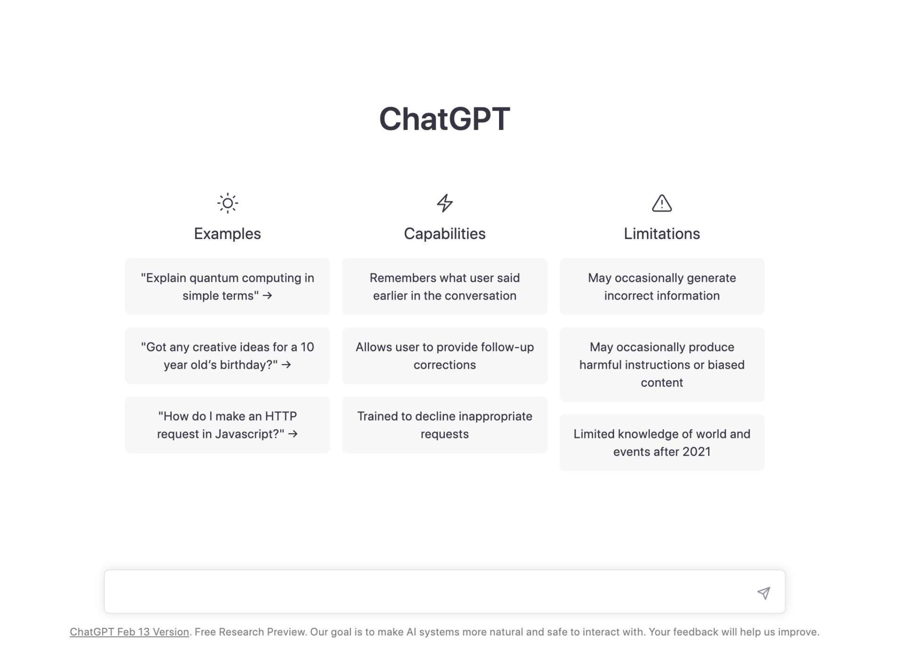]

All modern conversational agents are based on the same transformer models, scaled up to billions of parameters, trillions of training tokens, and thousands of petaflop/s-days of compute.

---

class: middle
count: false

# Transformers for images

---

class: middle

The transformer architecture was first designed for sequences, but it can be adapted to process images.

The key idea is to reshape the input image into a sequence of patches, which are then processed by a transformer encoder. This architecture is known as the .bold[vision transformer] (ViT).

---

class: middle

.center.width-80[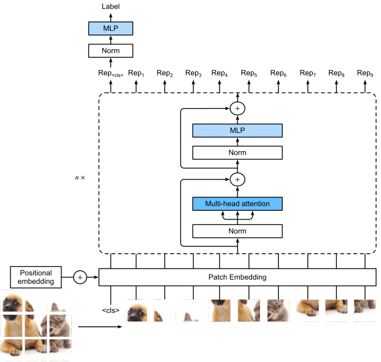]

.footnote[Credits: [Dive Into Deep Learning](https://d2l.ai), 2023.]

---

class: middle

- The input image is divided into non-overlapping patches, which are then linearly embedded into a sequence of vectors.
- The sequence of vectors is then processed by a transformer encoder, which outputs a sequence of vectors.
- Training the vision transformer can be done with supervised or self-supervised learning.

---

class: middle

Just like text transformers, vision transformers learn representations of the input image that can be used for various tasks, such as image classification, object detection, and image generation. 

---

class: middle

.center.width-100[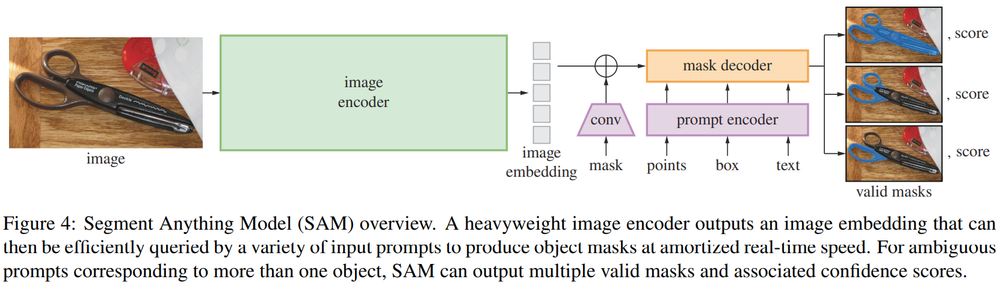]

.center.width-100[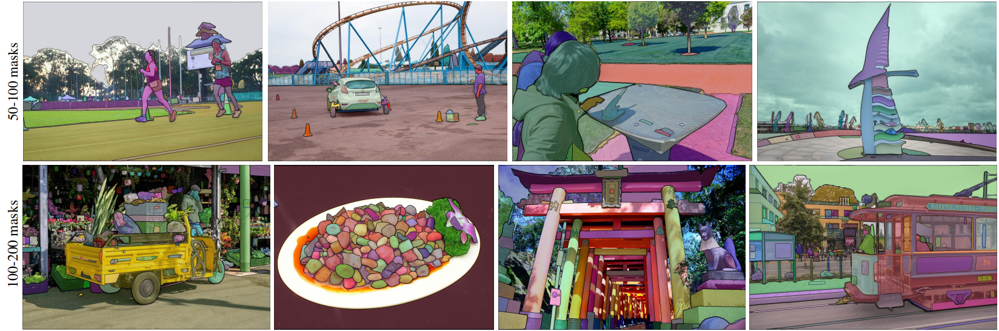]

.center[Segment anything (Kirillov et al., 2023) combines a vision transformer with a prompt encoder to produce masks with a transformer-based decoder.]

---

class: middle, center, black-slide

<iframe width="600" height="450" src="https://www.youtube.com/embed/oYUcl_cqKcs" frameborder="0" allowfullscreen></iframe>

Segment anything (Kirillov et al., 2023)
  
---

class: end-slide, center
count: false

The end.
