class: middle, center, title-slide

# Deep Learning

Lecture 7: Attention and transformers

  
Prof. Gilles Louppe 
[g.louppe@uliege.be](mailto:g.louppe@uliege.be)

---

# Today

Attention is all you need!
- From sequences to attention
- Attention layers
- Transformers
- Vision transformers

???

Mission: learn about a novel and fundamental building block in modern neural networks. This brick can replace both FC and convolutional layers.

---

class: middle

# From sequences to attention

---

class: middle

Many real-world problems require to process a signal with a **sequence** structure.

- Sequence classification:
    - sentiment analysis in text
    - activity/action recognition in videos
    - DNA sequence classification
- Sequence synthesis:
    - text synthesis
    - music synthesis
    - motion synthesis
- Sequence-to-sequence translation:
    - speech recognition
    - text translation
    - time series forecasting

.footnote[Credits: Francois Fleuret, [Deep Learning](https://fleuret.org/dlc/), UNIGE/EPFL.]

???

Draw all 3 setups.

---

class: middle

Given a set $\mathcal{X}$, if $S(\mathcal{X})$ denotes the set of sequences of elements from $\mathcal{X}$,
$$S(\mathcal{X}) = \cup\_{t=1}^\infty \mathcal{X}^t,$$
then we formally define:

.grid.center[
.kol-1-2.bold[Sequence classification]
.kol-1-2[$f: S(\mathcal{X}) \to \bigtriangleup^C$]
]
.grid.center[
.kol-1-2.bold[Sequence synthesis]
.kol-1-2[$f: \mathbb{R}^d \to S(\mathcal{X})$]
]
.grid.center[
.kol-1-2.bold[Sequence-to-sequence translation]
.kol-1-2[$f: S(\mathcal{X}) \to S(\mathcal{Y})$]
]

 
In the rest of the slides, we consider only time-indexed signals, although the formulation generalizes to arbitrary sequences.

.footnote[Credits: Francois Fleuret, [Deep Learning](https://fleuret.org/dlc/), UNIGE/EPFL.]

---

class: middle

A historical approach for variable-length input sequences $\mathbf{x} \in S(\mathbb{R}^d)$ is to use a recurrent encoder that compresses the full input into a single vector $v$, then a decoder that generates the output from $v$.

 

.center.width-85[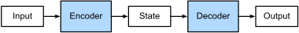]

 
.alert[This architecture assumes that the sole vector $v$ carries enough information to generate entire output sequences. This is often .bold[challenging] for long sequences.]

.footnote[Credits: [Dive Into Deep Learning](https://d2l.ai), 2023.]

???

The problem is similar to FCN without skip connections: the information is bottlenecked in the single vector $v$.

---

class: black-slide
background-image: url(figures/lec7/vision.png)
background-size: cover

 
When we look at a scene, we don't process all the information in the visual field at once. Instead, we selectively focus on specific parts of the scene, while ignoring others.

---

class: middle

.center.width-75[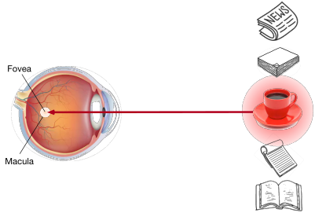]

Using the nonvolitional cue based on saliency (red cup, non-paper), attention is involuntarily directed to the coffee.

.footnote[Credits: [Dive Into Deep Learning](https://d2l.ai), 2023.]

---

class: middle

.center.width-75[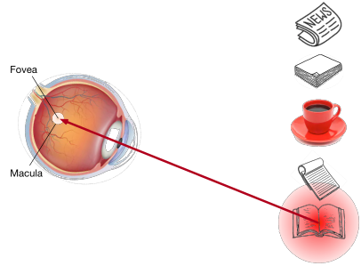]

Using the volitional cue (want to read a book) that is task-dependent, attention is directed to the book under volitional control.

.footnote[Credits: [Dive Into Deep Learning](https://d2l.ai), 2023.]

---

class: middle

.center.width-90[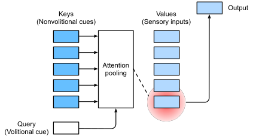]

.success[Sensory inputs are restricted to a small subset of the information available in the environment. This is the essence of attention: .bold[selectively focusing on what matters].]

.footnote[Credits: [Dive Into Deep Learning](https://d2l.ai), 2023.]

???

Blackboard: translate to French the following sentence. 

"The animal didn't cross the street because it was too tired."
->
"L'animal n'a pas traversé la rue car il était trop fatigué."

VS.

"The animal didn't cross the street because it was too wide."
->
"L'animal n'a pas traversé la rue car elle était trop large."

---

class: middle

# Attention layers

---

class: middle

Assume a sequence $\mathbf{x} = (x\_1, \ldots, x\_m)$ of $m$ vectors $x\_i \in \mathbb{R}^d$, also known as .bold[token embeddings], and a vector $\mathbf{q} \in \mathbb{R}^q$ representing a .bold[query].

If we associate to each token $x\_i$ a .bold[key] vector $\mathbf{k}\_i \in \mathbb{R}^k$ and a .bold[value] vector $\mathbf{v}\_i \in \mathbb{R}^v$, we can compute an output vector $\mathbf{y} \in \mathbb{R}^v$ as a weighted average of the value vectors, where the weights are given by the similarity between the query and the keys,
$$\mathbf{y} = \sum\_{i=1}^m \text{softmax}\_i(a(\mathbf{q}, \mathbf{k}\_i; \theta)) \mathbf{v}\_i,$$
where $a : \mathbb{R}^q \times \mathbb{R}^k \to \mathbb{R}$ is a scalar attention scoring function.

---

class: middle

.center.width-100[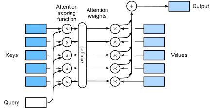]

.footnote[Credits: [Dive Into Deep Learning](https://d2l.ai), 2023.]

---

class: middle

## Additive attention

When queries and keys are vectors of different lengths, we can use an additive attention as the scoring function.

Given $\mathbf{q} \in \mathbb{R}^{q}$ and $\mathbf{k} \in \mathbb{R}^{k}$, the additive attention scoring function is
$$a(\mathbf{q}, \mathbf{k}) = \mathbf{w}_v^T \tanh(\mathbf{W}\_q^T \mathbf{q} + \mathbf{W}\_k^T \mathbf{k})$$
where $\mathbf{w}_v \in \mathbb{R}^h$, $\mathbf{W}_q \in \mathbb{R}^{q \times h}$ and $\mathbf{W}_k \in \mathbb{R}^{k \times h}$ are learnable parameters.

---

class: middle

## Scaled dot-product attention

When queries and keys are vectors of the same length $d$, we can use a scaled dot-product attention as the scoring function.

Given $\mathbf{q} \in \mathbb{R}^{d}$ and $\mathbf{k} \in \mathbb{R}^{d}$, the scaled dot-product attention scoring function is
$$a(\mathbf{q}, \mathbf{k}) = \frac{\mathbf{q}^T \mathbf{k}}{\sqrt{d}}.$$

---

class: middle

For $n$ queries $\mathbf{Q} \in \mathbb{R}^{n \times d}$, keys $\mathbf{K} \in \mathbb{R}^{m \times d}$ and values $\mathbf{V} \in \mathbb{R}^{m \times v}$, the scaled dot-product attention layer computes an output tensor 
$$\mathbf{Y} = \underbrace{\text{softmax}\left(\frac{\mathbf{QK}^T}{\sqrt{d}}\right)}\_{\text{attention matrix}\, \mathbf{A}}\mathbf{V} \in \mathbb{R}^{n \times v}.$$

---

class: middle

.center.width-80[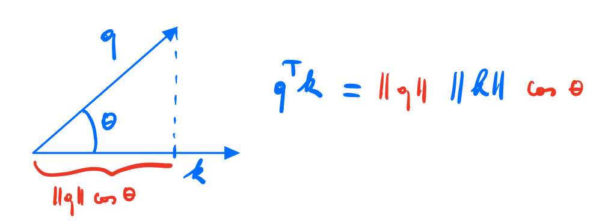]

Recall that the dot product is simply an unnormalized cosine similarity, which tells us about the alignment of two vectors.

Therefore, the $\mathbf{QK}^T$ matrix is a .bold[similarity matrix] between queries and keys.

???

Intuitively, the attention matrix $\mathbf{A}$ tells us how much each query is aligned with each key, and thus how much each value should contribute to the output.

---

class: middle

.center.width-100[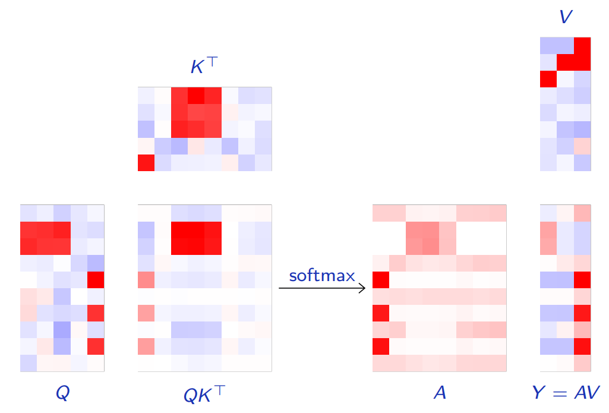]

.footnote[Credits: Francois Fleuret, [Deep Learning](https://fleuret.org/dlc/), UNIGE/EPFL.]

---

class: middle

In the currently standard models for sequences, the queries, keys and values are linear functions of the inputs.

Given the learnable matrices $\mathbf{W}\_q \in \mathbb{R}^{d \times x}$, $\mathbf{W}\_k \in \mathbb{R}^{d \times x'}$, and $\mathbf{W}\_v \in \mathbb{R}^{v \times x'}$, and two input sequences $\mathbf{X} \in \mathbb{R}^{n \times x}$ and $\mathbf{X}' \in \mathbb{R}^{m \times x'}$, we have
$$\begin{aligned} 
\mathbf{Q} &= \mathbf{X} \mathbf{W}\_q^T \in \mathbb{R}^{n \times d} \\\\
\mathbf{K} &= \mathbf{X'} \mathbf{W}\_k^T \in \mathbb{R}^{m \times d} \\\\
\mathbf{V} &= \mathbf{X'} \mathbf{W}\_v^T \in \mathbb{R}^{m \times v}.
\end{aligned}$$

---

class: middle

## Self-attention

When the queries, keys and values are derived from the same inputs (e.g., when $\mathbf{X} = \mathbf{X}'$), the attention mechanism is called .bold[self-attention].

Therefore, self-attention can be used as a regular feedforward-kind of layer, similarly to fully-connected or convolutional layers.

---

class: middle 

## Fully-connected vs. convolutional vs. self-attention layers

.center.width-100[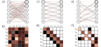]

---

class: middle

All three layers can be seen as special cases of attention layers, with different choices of the attention scoring function and the way queries, keys and values are derived from the input.
- Fully-connected layers are attention layers where the attention matrix is fixed and does not depend on the input.
- Convolutional layers are attention layers where the attention matrix is fixed and only allows local interactions between queries and keys.
- Self-attention layers are attention layers where the attention matrix is computed from the input and allows global interactions between queries and keys. The softmax ensures sparsity.

---

class: middle

Time complexity:
- Fully-connected layers: $O(m^2)$ for $m$ inputs producing $m$ outputs.
- Convolutional layers: $O(mk)$ for $m$ inputs and kernel size $k$.
- Self-attention layers: $O(m^2)$ for $m$ inputs producing $m$ outputs.

.alert[The quadratic complexity of self-attention layers can be a bottleneck for long sequences, and thus various approximations have been proposed to reduce it to linear or sub-quadratic complexity.]

---

class: middle

## A toy example

To illustrate attention mechanism, we consider a toy problem with 1d sequences composed of two triangular and two rectangular patterns. The target sequence averages the heights in each pair of shapes.

.center.width-100[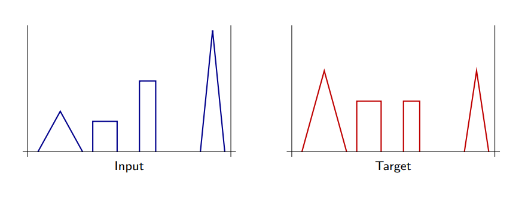]

.footnote[Credits: Francois Fleuret, [Deep Learning](https://fleuret.org/dlc/), UNIGE/EPFL.]

---

class: middle

.center.width-80[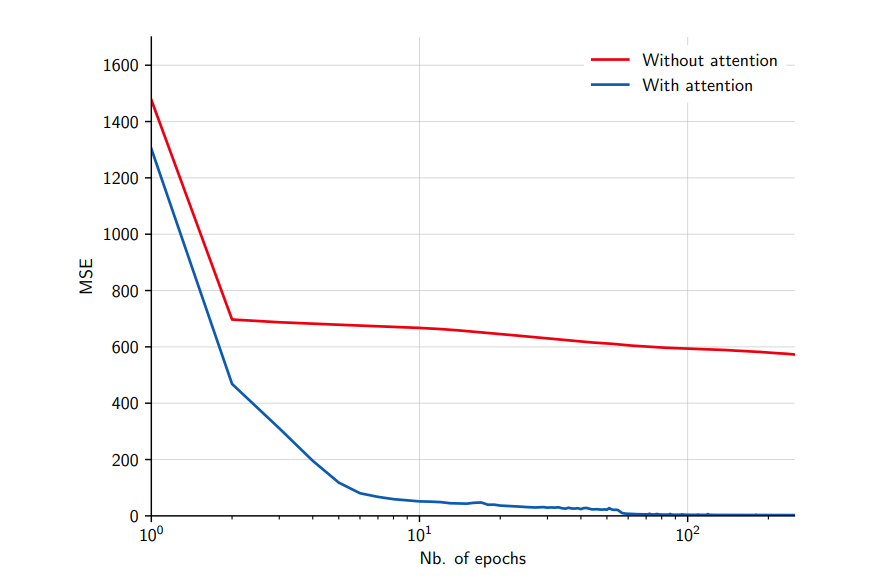]

.footnote[Credits: Francois Fleuret, [Deep Learning](https://fleuret.org/dlc/), UNIGE/EPFL.]

---

class: middle

We can modify the toy problem to consider targets where the pairs to average are the two right and leftmost shapes.

.center.width-100[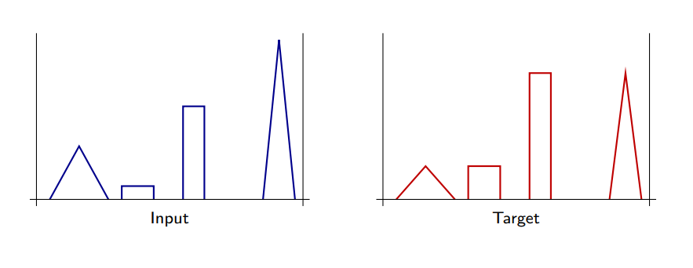]
.alert[The performance is expected to be poor given the inability of the self-attention layer to take into account absolute or relative positions.]

.footnote[Credits: Francois Fleuret, [Deep Learning](https://fleuret.org/dlc/), UNIGE/EPFL.]

---

class: middle

Formally, the self-attention layer is permutation-invariant with respect to the key-value pairs. That is, 
$$\begin{aligned}
\mathbf{y} &= \sum\_{i=1}^m \text{softmax}\_i\left(\frac{\mathbf{q}^T{\mathbf{K}^T\_{i}}}{\sqrt{d}}\right) \mathbf{V}\_{i}\\\\
&= \sum\_{i=1}^m \text{softmax}\_{i}\left(\frac{\mathbf{q}^T{\mathbf{K}^T\_{\sigma(i)}}}{\sqrt{d}}\right) \mathbf{V}\_{\sigma(i)}
\end{aligned}$$
for any permutation $\sigma$ of the key-value pairs.

For this reason, the self-attention layer cannot learn to attend to specific positions in the input sequence, and thus cannot solve the modified toy problem.

---

class: middle

.center.width-80[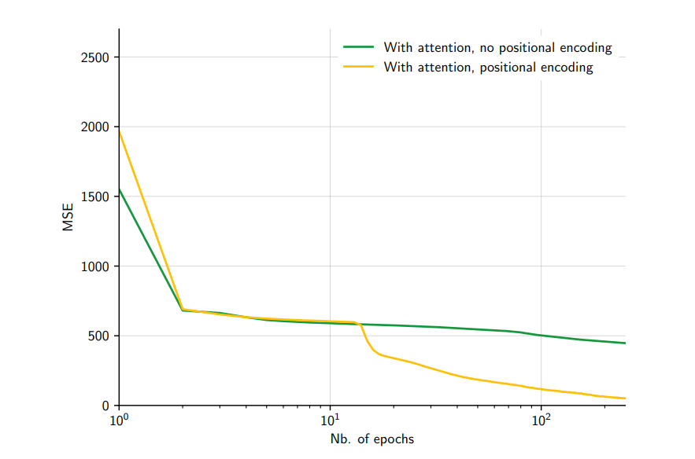]

This problem can be fixed by providing positional encodings explicitly to the attention layer (see next section).

.footnote[Credits: Francois Fleuret, [Deep Learning](https://fleuret.org/dlc/), UNIGE/EPFL.]

---

class: middle

Note however that self-attention layer is permutation-equivariant with respect to the queries, as the output will be permuted in the same way as the queries. 

---

class: middle

# Transformers

---

class: middle

Vaswani et al. (2017) proposed to go one step further: instead of using attention mechanisms (Bahdanau et al., 2014) as a supplement to standard convolutional and recurrent layers, they designed a model, the .bold[transformer], combining only attention layers.

The transformer was designed for a sequence-to-sequence translation task, but it is currently key to state-of-the-art approaches for most tasks involving sets or sequences.

.footnote[Credits: Francois Fleuret, [Deep Learning](https://fleuret.org/dlc/), UNIGE/EPFL.]

---

class: middle

Assume a sequence-to-sequence translation task, where 
- the input sequence is $\mathbf{x} = (x\_1, \ldots, x\_m)$, with tokens $x\_i \in \mathbb{R}^d$ and 
- the output sequence is $\mathbf{y} = (y\_1, \ldots, y\_n)$, with tokens $y\_i \in \mathbb{R}^d$. 

We want to predict the next token $y\_{n+1}$ given the input sequence and the previous output tokens.

---

class: middle

## Encoder-decoder architecture

The original transformer model is composed of:
- An .bold[encoder] that combines $N=6$ modules, each composed of a multi-head self-attention sub-module and a one-hidden-layer MLP, with residual connections and layer normalization. All sub-modules produce outputs of dimension $d\_\text{model}=512$. 
- A .bold[decoder] that combines $N=6$ similar modules, but using masked self-attention to prevent positions from attending to subsequent positions, plus a cross-attention sub-module over the encoder output. The decoder produces outputs of dimension $d\_\text{model}=512$.
- A linear layer connecting the last decoder output to the output vocabulary, followed by a softmax to produce the probability distribution over the next token.

---

class: middle

.center.width-60[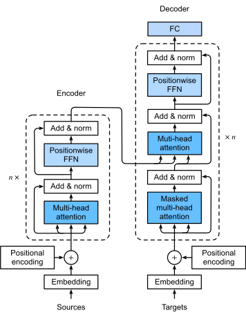]

.footnote[Credits: [Dive Into Deep Learning](https://d2l.ai), 2023.]

---

class: middle

## Scaled dot-product attention

The core building block of the transformer architecture is a scaled dot-product attention layer
$$\text{attention}(\mathbf{Q}, \mathbf{K}, \mathbf{V}) = \text{softmax}\left(\frac{\mathbf{Q}\mathbf{K}^T}{\sqrt{d\_k}}\right) \mathbf{V}$$
where the $1/\sqrt{d\_k}$ scaling is used to keep the (softmax's) temperature constant across different choices of the query/key dimension $d\_k$.

---

class: middle

.center.width-55[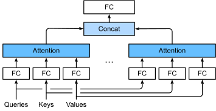]

## Multi-head attention

Multi-head attention runs $h$ parallel attention layers, called heads, and concatenates their outputs. Each head operates on distinct linear projections of the queries, keys and values.
Mathematically,
$$\begin{aligned}
\text{multihead}(\mathbf{Q}, \mathbf{K}, \mathbf{V}) &= \text{concat}\left(\mathbf{H}\_1, \ldots, \mathbf{H}\_h\right) \mathbf{W}^O\\\\ 
\mathbf{H}\_i &= \text{attention}(\mathbf{Q}\mathbf{W}\_i^Q, \mathbf{K}\mathbf{W}\_i^K, \mathbf{V}\mathbf{W}\_i^V)
\end{aligned}$$
with
$\mathbf{W}\_i^Q \in \mathbb{R}^{d\_\text{model} \times d\_k}, \mathbf{W}\_i^K \in \mathbb{R}^{d\_\text{model} \times d\_k}, \mathbf{W}\_i^V \in \mathbb{R}^{d\_\text{model} \times d\_v}, \mathbf{W}^O \in \mathbb{R}^{hd\_v \times d\_\text{model}}$.

.footnote[Credits: [Dive Into Deep Learning](https://d2l.ai), 2023.]

---

class: middle

## Masked/causal attention

In the decoder, the self-attention sub-module must not attend to future positions. This is achieved by adding a mask before the softmax:
$$\text{attention}(\mathbf{Q}, \mathbf{K}, \mathbf{V}) = \text{softmax}\left(\frac{\mathbf{Q}\mathbf{K}^T}{\sqrt{d\_k}} + \mathbf{M}\right) \mathbf{V}$$
where $\mathbf{M}\_{ij} = 0$ if $i \geq j$ and $\mathbf{M}\_{ij} = -\infty$ otherwise.

---

class: middle

## FFN 

The feedforward network (FFN) sub-module is a simple MLP, applied .bold[independently] to each position. 

Usually, the hidden layer has a larger dimension $d\_\text{ffn}$ than the input/output dimension $d\_\text{model}$, e.g., $d\_\text{ffn}=2048$ and $d\_\text{model}=512$.

---

class: middle

## Residual connections and layer normalization

The transformer architecture uses residual connections and layer normalization to facilitate training.

- Each sub-module (multi-head attention and FFN) is wrapped in a residual connection, so that the output of each sub-module is added to its input before being passed to the next sub-module.
- Layer normalization is applied after each sub-module, to stabilize the training and improve convergence.
$$\mathbf{X}' = \text{LayerNorm}(\mathbf{X} + \text{SubModule}(\mathbf{X}))$$
In modern implementations, layer normalization is applied before the sub-module, instead of after.
$$\mathbf{X}' = \mathbf{X} + \text{SubModule}(\text{LayerNorm}(\mathbf{X}))$$

---

class: middle

## Token embeddings

The transformer architecture uses token embeddings to represent the input and output tokens as vectors of dimension $d\_\text{model}$. This is effectively implemented as a .bold[hash table] mapping each token to a vector.

The token embeddings are learned during training and are shared between the encoder and decoder.

---

class: middle

## Positional encoding

The original transformer adds a fixed encoding of dimension $d\_\text{model}$ to the token embeddings:
$$
\begin{aligned}
\text{PE}\_{t,2i} &= \sin\left(\frac{t}{10000^{2i/d\_\text{model}}}\right) \\\\
\text{PE}\_{t,2i+1} &= \cos\left(\frac{t}{10000^{2i/d\_\text{model}}}\right).
\end{aligned}
$$

Each dimension oscillates at a different frequency. For any fixed offset $k$, $\text{PE}\_{t+k}$ is a linear function of $\text{PE}\_{t}$ (a rotation in each 2D subspace), so the model can learn to attend to .bold[relative positions].

---

class: middle

.width-100[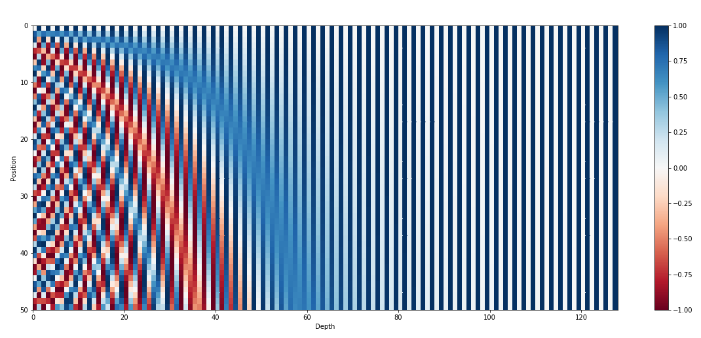]

.center[128-dimensional positional encoding for a sentence with the maximum length of 50. Each row represents the embedding vector.]

---

class: middle

Modern transformer architectures use different types of positional encodings:
- .bold[Learned positional embeddings.] Learn $\mathbf{E}\_\text{pos} \in \mathbb{R}^{T\_\text{max} \times d\_\text{model}}$ directly (GPT-1/2). Simpler, but cannot generalize beyond $T\_\text{max}$.
- .bold[Rotary positional embeddings (RoPE).] Instead of adding position to the input, RoPE (Su et al., 2021) encodes positions in the attention score by rotating queries and keys:
$$a(\mathbf{q}\_m, \mathbf{k}\_n) = (\mathbf{R}\_m \mathbf{q})^T (\mathbf{R}\_n \mathbf{k}) = \mathbf{q}^T \mathbf{R}\_{n-m} \mathbf{k}$$
where $\mathbf{R}\_t$ is a block-diagonal rotation matrix with a different frequency per 2D block. The dot product depends only on content and relative distance $m - n$.

---

class: middle

## KV caching

During autoregressive generation, naively recomputing all keys and values at every step repeats $O(t)$ work per token.

Since causal masking means past key-value vectors never change, we can .bold[cache] them and append only the new pair at each step:
$$\begin{aligned}
\mathbf{K}\_{1:t} &= \text{concat}(\underbrace{\mathbf{K}\_{1:t-1}}\_{\text{cached}},\, \mathbf{k}\_t) \\\\
\mathbf{V}\_{1:t} &= \text{concat}(\underbrace{\mathbf{V}\_{1:t-1}}\_{\text{cached}},\, \mathbf{v}\_t)
\end{aligned}$$

.alert[The tradeoff is memory: for large models and long sequences, the KV cache can reach several gigabytes.]

???

Example: a 70B parameter model with 80 layers, 64 heads, d_k=128, at 4096 tokens, needs about 40GB of KV cache in fp16.

---

class: middle

## Machine translation

The transformer architecture was first designed for machine translation and tested on English-to-German and English-to-French translation tasks.

.center[

.width-100[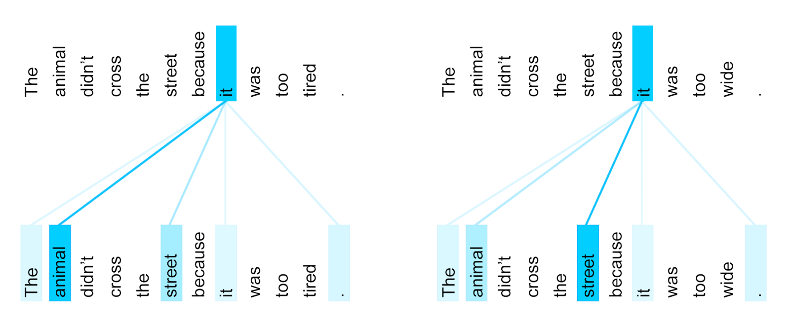]

Self-attention layers learned that "it" could refer  to different entities, in different contexts.
  
]

.footnote[Credits: [Transformer: A Novel Neural Network Architecture for Language Understanding](https://ai.googleblog.com/2017/08/transformer-novel-neural-network.html), 2017.]

---

class: middle

.center[

.width-100[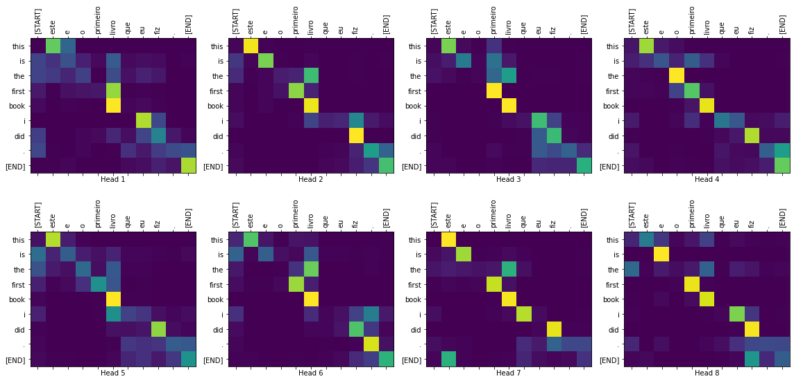]

Attention maps extracted from the multi-head attention modules  show how input tokens relate to output tokens.
  
]

.footnote[Credits: [Transformer model for language understanding](https://www.tensorflow.org/tutorials/text/transformer).]

---

class: middle

## Decoder-only transformers

The decoder-only transformer simplifies the original architecture by using only the decoder part, and removing the cross-attention sub-module. The model is trained to predict the next token $x\_{m+1}$ given the previous tokens $x\_{1:m}$.

.center.width-80[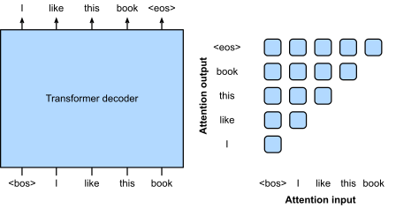]

.footnote[Credits: [Dive Into Deep Learning](https://d2l.ai), 2023.]
  
---

class: middle, center

([demo](https://poloclub.github.io/transformer-explainer/))

---

class: middle

.success[The decoder-only transformer architecture is the basis of all modern large language models.]

---

class: middle

## Scaling laws

Transformer language model performance improves smoothly as we increase the model size, the dataset size, and amount of compute used for training. 

For optimal performance, all three factors must be scaled up in tandem. Empirical performance has a power-law relationship with each individual factor when not bottlenecked by the other two.

.center.width-100[]

.footnote[Credits: [Kaplan et al](https://arxiv.org/pdf/2001.08361.pdf), 2020.]

---

class: middle

Large models also enjoy better sample efficiency than small models.
- Larger models require less data to achieve the same performance.
- The optimal model size shows to grow smoothly with the amount of compute available for training.

 
.center.width-100[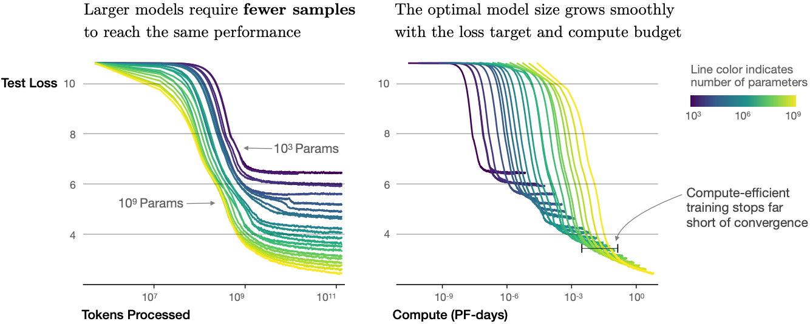]

.footnote[Credits: [Kaplan et al](https://arxiv.org/pdf/2001.08361.pdf), 2020.]

---

class: middle
count: false

# Vision transformers

---

class: middle

The transformer can be adapted to process images by reshaping the input into a sequence of patches. This architecture is the .bold[vision transformer] (ViT).

---

class: middle

.center.width-80[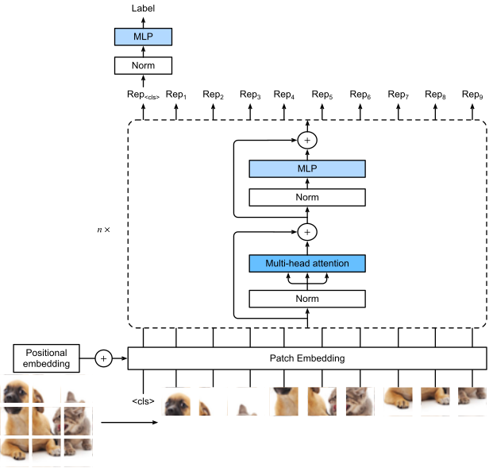]

.footnote[Credits: Dosovitskiy et al., [An Image is Worth 16x16 Words](https://arxiv.org/abs/2010.11929), 2020.]

---

class: middle

The image is split into $N = \frac{HW}{P^2}$ non-overlapping patches of size $P \times P$. Each patch is flattened, linearly projected, and augmented with a [CLS] token and position embeddings:
$$\mathbf{z}\_0 = [\mathbf{x}\_\text{class};\, \mathbf{x}\_1^p \mathbf{E};\, \ldots;\, \mathbf{x}\_N^p \mathbf{E}] + \mathbf{E}\_\text{pos}$$
where $\mathbf{E} \in \mathbb{R}^{P^2 C \times d}$ and $\mathbf{E}\_\text{pos} \in \mathbb{R}^{(N+1) \times d}$.

The sequence of patch embeddings is then processed by a standard transformer encoder, and the output corresponding to the [CLS] token is used for classification.

.footnote[Credits: Dosovitskiy et al., [An Image is Worth 16x16 Words](https://arxiv.org/abs/2010.11929), 2020.]

---

class: middle

## CNNs vs. ViTs

CNNs build in strong inductive biases: .bold[locality] (small spatial neighborhoods) and .bold[translation equivariance] (same filter everywhere). ViTs have neither.

However, ViTs can learn these properties from data, and thus can be more flexible and powerful than CNNs when trained on large datasets. 

.success[Vision transformers are now the state-of-the-art for many vision tasks, including image classification, object detection and segmentation.]

---

class: middle

## Summary

Main takeaway: if you have data and not much prior knowledge about the structure of the problem, then a transformer is a good default choice of architecture.
  
---

class: end-slide, center
count: false

The end.
