class: middle, center, title-slide

# Deep Learning

Lecture 8: Generative adversarial networks

  
Prof. Gilles Louppe 
[g.louppe@uliege.be](mailto:g.louppe@uliege.be)

???

https://arxiv.org/pdf/1801.04406.pdf

add refs as footnotes

---

class: middle 

.center.width-50[]

.italic.center["Generative adversarial networks is the coolest idea  in deep learning in the last 20 years." -- Yann LeCun.]

---

# Today

Learn a model of the data.

- Generative adversarial networks
- Wasserstein GANs
- Convergence of GANs
- State of the art
- Applications

---

class: middle

# Generative adversarial networks

---

class: middle

.center.width-80[]

---

class: middle

## A two-player game

In **generative adversarial networks** (GANs), the task of learning a generative model is expressed as a two-player zero-sum game between two networks.

- The first network is a *generator*  $g(\cdot;\theta) : \mathcal{Z} \to \mathcal{X}$, mapping a latent space equipped with a prior distribution $p(\mathbf{z})$ to the data space, thereby inducing a distribution
$$\mathbf{x} \sim q(\mathbf{x};\theta) \Leftrightarrow \mathbf{z} \sim p(\mathbf{z}), \mathbf{x} = g(\mathbf{z};\theta).$$
The generator is trained so that it produces samples following the data distribution as output.
- The second network $d(\cdot; \phi) : \mathcal{X} \to [0,1]$ is a *classifier* trained to distinguish between true samples $\mathbf{x} \sim p(\mathbf{x})$ and generated samples $\mathbf{x} \sim q(\mathbf{x};\theta)$.

---

class: middle

.center.width-100[]

The approach is **adversarial** since the two networks have antagonistic objectives.

.footnote[Credits: Francois Fleuret, [EE559 Deep Learning](https://fleuret.org/ee559/), EPFL.]

---

class: middle

For a fixed generator $g$, the classifier $d$ can be trained by generating a two-class training set
$$\mathbf{d} = \\\{ (\mathbf{x}\_1, y=1), ..., (\mathbf{x}\_N, y=1), (g(\mathbf{z}\_1; \theta), y=0), ..., (g(\mathbf{z}\_N; \theta), y=0)  \\\},$$
where $\mathbf{x}\_i \sim p(\mathbf{x})$ and $\mathbf{z}\_i \sim p(\mathbf{z})$, and minimizing the cross-entropy loss
$$\begin{aligned}
\mathcal{L}(\phi) &= -\frac{1}{2N} \sum\_{i=1}^N \left[ \log d(\mathbf{x}\_i; \phi) + \log\left(1 - d(g(\mathbf{z}\_i;\theta); \phi)\right) \right] \\\\
&\approx -\mathbb{E}\_{\mathbf{x} \sim p(\mathbf{x})}\left[ \log d(\mathbf{x};\phi) \right] - \mathbb{E}\_{\mathbf{z} \sim p(\mathbf{z})}\left[ \log (1-d(g(\mathbf{z};\theta);\phi)) \right].
\end{aligned}$$

However, the situation is slightly more complicated since we also want to train $g$ to fool the discriminator, which is equivalent to maximize $d$'s loss.

---

class: middle

## Game analysis

Let us consider the **value function** 
$$V(\phi, \theta) = \mathbb{E}\_{\mathbf{x} \sim p(\mathbf{x})}\left[ \log d(\mathbf{x};\phi) \right] + \mathbb{E}\_{\mathbf{z} \sim p(\mathbf{z})}\left[ \log (1-d(g(\mathbf{z};\theta);\phi)) \right].$$

- For a fixed $g$, $V(\phi, \theta)$ is high if $d$ is good at recognizing true from generated samples.

- If $d$ is the best classifier given $g$, and if $V$ is high, then this implies that
the generator is bad at reproducing the data distribution.

- Conversely, $g$ will be a good generative model if $V$ is low when $d$ is a perfect opponent.

Therefore, the ultimate goal is
$$\theta^\* = \arg \min\_\theta \max\_\phi V(\phi, \theta).$$

---

class: middle

For a generator $g$ fixed at $\theta$, the classifier $d$ with parameters $\phi^\*\_\theta$ is optimal if and only if
$$\forall \mathbf{x}, d(\mathbf{x};\phi^\*\_\theta) = \frac{p(\mathbf{x})}{q(\mathbf{x};\theta) + p(\mathbf{x})}.$$

---

class: middle

Therefore,
$$\begin{aligned}
&\min\_\theta \max\_\phi V(\phi, \theta) = \min\_\theta V(\phi^\*\_\theta, \theta) \\\\
&= \min\_\theta \mathbb{E}\_{\mathbf{x} \sim p(\mathbf{x})}\left[ \log \frac{p(\mathbf{x})}{q(\mathbf{x};\theta) + p(\mathbf{x})} \right] + \mathbb{E}\_{\mathbf{x} \sim q(\mathbf{x};\theta)}\left[ \log \frac{q(\mathbf{x};\theta)}{q(\mathbf{x};\theta) + p(\mathbf{x})} \right] \\\\
&= \min\_\theta \text{KL}\left(p(\mathbf{x}) || \frac{p(\mathbf{x}) + q(\mathbf{x};\theta)}{2}\right) \\\\
&\quad\quad\quad+ \text{KL}\left(q(\mathbf{x};\theta) || \frac{p(\mathbf{x}) + q(\mathbf{x};\theta)}{2}\right) -\log 4\\\\
&= \min\_\theta 2\, \text{JSD}(p(\mathbf{x}) || q(\mathbf{x};\theta)) - \log 4
\end{aligned}$$
where $\text{JSD}$ is the Jensen-Shannon divergence.

---

class: middle

In summary,
$$
\begin{aligned}
\theta^\* &= \arg \min\_\theta \max\_\phi V(\phi, \theta) \\\\
&= \arg \min\_\theta \text{JSD}(p(\mathbf{x}) || q(\mathbf{x};\theta)).
\end{aligned}$$

Since $\text{JSD}(p(\mathbf{x}) || q(\mathbf{x};\theta))$ is minimum if and only if
$$p(\mathbf{x}) = q(\mathbf{x};\theta)$$ for all $\mathbf{x}$, this proves that the minimax solution
corresponds to a generative model that perfectly reproduces the true data distribution.

---

class: middle

## Learning process

In practice, the minimax solution is approximated using *alternating* stochastic gradient descent:
$$
\begin{aligned}
\theta &\leftarrow \theta - \gamma \nabla\_\theta V(\phi, \theta) \\\\
\phi &\leftarrow \phi + \gamma \nabla\_\phi V(\phi, \theta),
\end{aligned}
$$
where gradients are estimated with Monte Carlo integration.

- For one step on $\theta$, we can optionally take $k$ steps on $\phi$, since we need the classifier to remain near optimal.
- Note that to compute $\nabla\_\theta V(\phi, \theta)$, it is necessary to backprop all the way through $d$ before computing the partial derivatives with respect to $g$'s internals.

---

class: middle

.center.width-100[]

.center[(Goodfellow et al, 2014)]

---

class: middle, center

.width-100[]

[[Demo](https://poloclub.github.io/ganlab)]

---

class: middle

## Results

.center.width-90[]

.center[(Goodfellow et al, 2014)]

---

class: middle, center

.center.width-100[]

.center[(Radford et al, 2015)]

---

class: middle, center

.center.width-100[]

.center[(Radford et al, 2015)]

---

class: middle

## Open problems

Training a standard GAN often results in pathological behaviors:

- *Oscillations* without convergence: contrary to standard loss minimization,
  alternating stochastic gradient descent has no guarantee of convergence.
- **Vanishing gradients**: when the classifier $d$ is too good, the value function saturates
  and we end up with no gradient to update the generator.
- *Mode collapse*: the generator $g$ models very well a small sub-population,
  concentrating on a few modes of the data distribution.
- Performance is also difficult to assess in practice.

 
.center.width-100[]

.center[Mode collapse (Metz et al, 2016)]

---

class: middle

## Cabinet of curiosities

While early results (2014-2016) were already impressive, a close inspection of the fake samples distribution $q(\mathbf{x};\theta)$ often revealed fundamental issues highlighting architectural limitations.

---

class: middle

.center.width-90[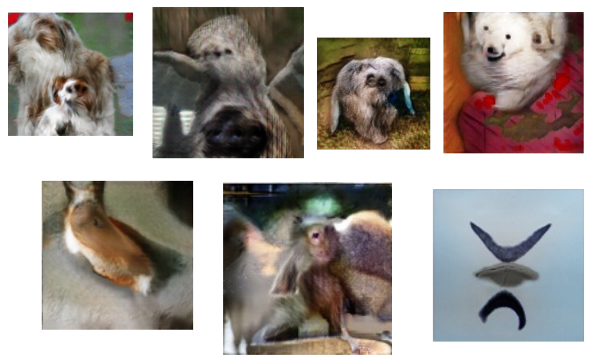]

.center[Cherry-picks (Goodfellow, 2016)]

---

class: middle

.center.width-90[]

.center[Problems with counting (Goodfellow, 2016)]

---

class: middle

.center.width-90[]

.center[Problems with perspective (Goodfellow, 2016)]

---

class: middle

.center.width-90[]

.center[Problems with global structures (Goodfellow, 2016)]

---

class: middle

# Wasserstein GANs

---

class: middle

## Return of the Vanishing Gradients

For most non-toy data distributions, the fake samples $\mathbf{x} \sim q(\mathbf{x};\theta)$
may be so bad initially that the response of $d$ saturates.

At the limit, when $d$ is perfect given the current generator $g$,
$$\begin{aligned}
d(\mathbf{x};\phi) &= 1, \forall \mathbf{x} \sim p(\mathbf{x}), \\\\
d(\mathbf{x};\phi) &= 0, \forall \mathbf{x} \sim q(\mathbf{x};\theta).
\end{aligned}$$
Therefore,
$$V(\phi, \theta) =  \mathbb{E}\_{\mathbf{x} \sim p(\mathbf{x})}\left[ \log d(\mathbf{x};\phi) \right] + \mathbb{E}\_{\mathbf{z} \sim p(\mathbf{z})}\left[ \log (1-d(g(\mathbf{z};\theta);\phi)) \right] = 0$$
and $\nabla\_\theta V(\phi,\theta) = 0$, thereby **halting** gradient descent.

---

class: middle

Dilemma :
- If $d$ is bad, then $g$ does not have accurate feedback and the loss function cannot represent the reality.
- If $d$ is too good, the gradients drop to 0, thereby slowing down or even halting the optimization.

---

class: middle

## Jensen-Shannon divergence

For any two distributions $p$ and $q$,
$$0 \leq JSD(p||q) \leq \log 2,$$
where
- $JSD(p||q)=0$ if and only if $p=q$,
- $JSD(p||q)=\log 2$ if and only if $p$ and $q$ have disjoint supports.

.center[]

---

class: middle

Notice how the Jensen-Shannon divergence poorly accounts for the metric structure of the space.

Intuitively, instead of comparing distributions "vertically", we would like to compare them "horizontally".

.center[]

---

class: middle

## Wasserstein distance

An alternative choice is the **Earth mover's distance**, which intuitively
corresponds to the minimum mass displacement to transform one distribution into
the other.

.center.width-100[]

- $p = \frac{1}{4}\mathbf{1}\_{[1,2]} + \frac{1}{4}\mathbf{1}\_{[3,4]} + \frac{1}{2}\mathbf{1}\_{[9,10]}$
- $q = \mathbf{1}\_{[5,7]}$

Then,
$$\text{W}\_1(p,q) = 4\times\frac{1}{4} + 2\times\frac{1}{4} + 3\times\frac{1}{2}=3$$

.footnote[Credits: Francois Fleuret, [EE559 Deep Learning](https://fleuret.org/ee559/), EPFL.]

---

class: middle

The Earth mover's distance is also known as the Wasserstein-1 distance and is defined as:
$$\text{W}\_1(p, q) = \inf\_{\gamma \in \Pi(p,q)} \mathbb{E}\_{(x,y)\sim \gamma} \left[||x-y||\right]$$
where:
- $\Pi(p,q)$ denotes the set of all joint distributions $\gamma(x,y)$ whose marginals are respectively $p$ and $q$;
- $\gamma(x,y)$ indicates how much mass must be transported from $x$ to $y$ in order to transform the distribution $p$ into $q$.
- $||\cdot||$ is the L1 norm and $||x-y||$ represents the cost of moving a unit of mass from $x$ to $y$.

---

class: middle

.center[]

---

class: middle

Notice how the $\text{W}\_1$ distance does not saturate. Instead, it
 increases monotonically with the distance between modes:

.center[]

$$\text{W}\_1(p,q)=d$$

For any two distributions $p$ and $q$,
- $W\_1(p,q) \in \mathbb{R}^+$,
- $W\_1(p,q)=0$ if and only if $p=q$.

---

class: middle

## Wasserstein GANs

Given the attractive properties of the Wasserstein-1 distance, Arjovsky et al (2017) propose
to learn a generative model by solving instead:
$$\theta^\* = \arg \min\_\theta \text{W}\_1(p(\mathbf{x})||q(\mathbf{x};\theta))$$
Unfortunately, the definition of $\text{W}\_1$ does not provide with an operational way of estimating it because of the intractable $\inf$.

On the other hand, the Kantorovich-Rubinstein duality tells us that
$$\text{W}\_1(p(\mathbf{x})||q(\mathbf{x};\theta)) = \sup\_{||f||\_L \leq 1} \mathbb{E}\_{\mathbf{x} \sim p(\mathbf{x})}\left[ f(\mathbf{x}) \right] - \mathbb{E}\_{\mathbf{x} \sim q(\mathbf{x};\theta)} \left[f(\mathbf{x})\right]$$
where the supremum is over all the 1-Lipschitz functions $f:\mathcal{X} \to \mathbb{R}$. That is, functions $f$ such that
$$||f||\_L = \max\_{\mathbf{x},\mathbf{x}'} \frac{||f(\mathbf{x}) - f(\mathbf{x}')||}{||\mathbf{x} - \mathbf{x}'||} \leq 1.$$

---

class: middle

.center.width-80[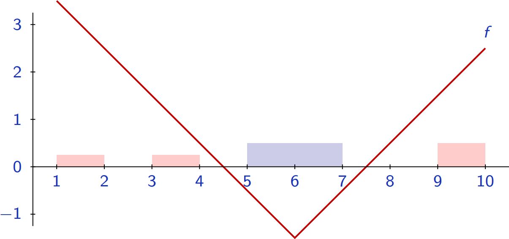]

For $p = \frac{1}{4}\mathbf{1}\_{[1,2]} + \frac{1}{4}\mathbf{1}\_{[3,4]} + \frac{1}{2}\mathbf{1}\_{[9,10]}$
and $q = \mathbf{1}\_{[5,7]}$,
$$\begin{aligned}
\text{W}\_1(p,q) &= 4\times\frac{1}{4} + 2\times\frac{1}{4} + 3\times\frac{1}{2}=3 \\\\
&= \underbrace{\left(3\times \frac{1}{4} + 1\times\frac{1}{4}+2\times\frac{1}{2}\right)}\_{\mathbb{E}\_{\mathbf{x} \sim p(\mathbf{x})}\left[ f(\mathbf{x}) \right]} - \underbrace{\left(-1\times\frac{1}{2}-1\times\frac{1}{2}\right)}\_{\mathbb{E}\_{\mathbf{x} \sim q(\mathbf{x};\theta)}\left[f(\mathbf{x})\right]} = 3
\end{aligned}
$$

.footnote[Credits: Francois Fleuret, [EE559 Deep Learning](https://fleuret.org/ee559/), EPFL.]

---

class: middle

Using this result, the Wasserstein GAN algorithm consists in solving the minimax problem:
$$\theta^\* = \arg \min\_\theta \max\_{\phi:||d(\cdot;\phi)||\_L \leq 1}  \mathbb{E}\_{\mathbf{x} \sim p(\mathbf{x})}\left[ d(\mathbf{x};\phi) \right] - \mathbb{E}\_{\mathbf{x} \sim q(\mathbf{x};\theta)} \left[d(\mathbf{x};\phi)\right]$$$$
Note that this formulation is very close to the original GANs, except that:
- The classifier $d:\mathcal{X} \to [0,1]$ is replaced by a critic function $d:\mathcal{X}\to \mathbb{R}$
  and its output is not interpreted through the cross-entropy loss;
- There is a strong regularization on the form of $d$.
  In practice, to ensure 1-Lipschitzness,
    - Arjovsky et al (2017) propose to clip the weights of the critic at each iteration;
    - Gulrajani et al (2017) add a regularization term to the loss.
- As a result, Wasserstein GANs benefit from:
    - a meaningful loss metric,
    - improved stability (no mode collapse is observed).

---

class: middle

.center.width-90[]

.center[(Arjovsky et al, 2017)]

---

class: middle

.center.width-70[]

.center[(Arjovsky et al, 2017)]

---

class: middle

# Convergence of GANs

???

Check https://mitliagkas.github.io/ift6085/ift-6085-lecture-14-notes.pdf

---

class: middle

.center[
.width-45[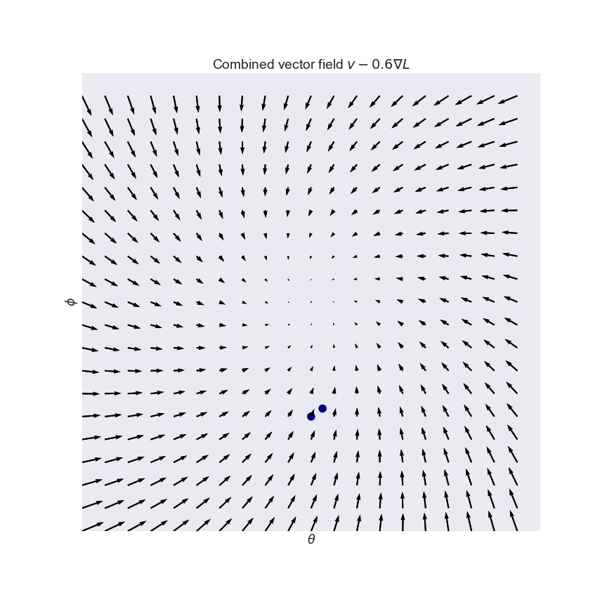]
.width-45[]
]

Solving for saddle points is different from gradient descent.
- Minimization problems yield *conservative* vector fields.
- Min-max saddle point problems may yield **non-conservative** vector fields.

.footnote[Credits: Ferenc Huszár, [GANs are Broken in More than One Way](https://www.inference.vc/my-notes-on-the-numerics-of-gans/), 2017.]

---

class: middle

Following the notations of Mescheder et al (2018), the training objective for the two players can be described by an objective function of the form
$$L(\theta,\phi) = \mathbb{E}\_{p(\mathbf{z})}\left[ f(d(g(\mathbf{z};\theta);\phi)) \right] + \mathbb{E}\_{p(\mathbf{x})}\left[f(-d(\mathbf{x};\phi))\right],$$
where the goal of the generator is to minimizes the loss, whereas the discriminator tries to maximize it.

- If $f(t)=-\log(1+\exp(-t))$, then we recover the original GAN objective (assuming that $d$ outputs the logits).
- if $f(t)=-t$ and and if we impose the Lipschitz constraint on $d$, then we recover Wassterstein GAN.

---

class: middle

Training algorithms can be described as fixed points algorithms that apply some operator $F\_h(\theta,\phi)$ to the parameters values $(\theta,\phi)$.

- For simultaneous gradient descent,
$$F\_h(\theta,\phi) = (\theta,\phi) + h v(\theta,\phi)$$
where $v(\theta,\phi)$ denotes the **gradient vector field**
$$v(\theta,\phi):= \begin{pmatrix}
-\nabla\_\theta L(\theta,\phi) \\\\
\nabla\_\phi L(\theta,\phi)
\end{pmatrix}.$$
- Similarly, alternating gradient descent can be described by an operator $F\_h = F\_{2,h} \circ F\_{1,h}$, where $F\_{1,h}$ and $F\_{2,h}$ perform an update for the generator and discriminator, respectively.

---

class: middle

## Local convergence near an equilibrium point

Let us consider the Jacobian $F'\_h(\theta^\*,\phi^\*)$ at the equilibrium $(\theta^\*,\phi^\*)$:
- if $F'\_h(\theta^\*,\phi^\*)$ has eigenvalues with absolute value bigger than 1, the training will generally not converge to $(\theta^\*,\phi^\*)$.
- if all eigenvalues have absolute value smaller than 1, the training will converge to $(\theta^\*,\phi^\*)$.
- if all eigenvalues values are on the unit circle, training can be convergent, divergent or neither.

Mescheder et al (2017) show that all eigenvalues can be forced to remain within the unit ball if and only if the learning rate $h$ is made sufficiently small.

---

class: middle

.width-90.center[]

.center[Discrete system: divergence ($h=1$, too large).]

.footnote[Credits: Mescheder et al, [Which Training Methods for GANs do actually Converge?](https://arxiv.org/abs/1801.04406), 2018.]

---

class: middle

.width-90.center[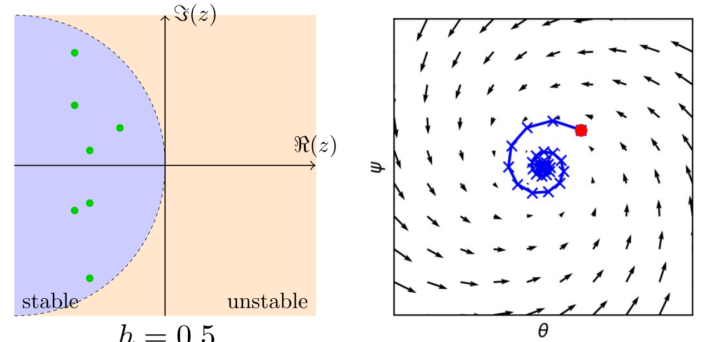]

.center[Discrete system: convergence ($h=0.5$, small enough).]

.footnote[Credits: Mescheder et al, [Which Training Methods for GANs do actually Converge?](https://arxiv.org/abs/1801.04406), 2018.]

---

class: middle

For the (idealized) continuous system
$$
\begin{pmatrix}
\dot{\theta}(t) \\\\
\dot{\phi}(t)
\end{pmatrix} =
\begin{pmatrix}
-\nabla\_\theta L(\theta,\phi) \\\\
\nabla\_\phi L(\theta,\phi)
\end{pmatrix},$$
which corresponds to training GANs with infinitely small learning rate $h \to 0$:
- if all eigenvalues of the Jacobian $v'(\theta^\*,\phi^\*)$ at a stationary point $(\theta^\*,\phi^\*)$ have negative real-part, the continuous system converges locally to $(\theta^\*,\phi^\*)$;
- if $v'(\theta^\*,\phi^\*)$ has eigenvalues with positive real-part, the continuous system is not locally convergent.
- if all eigenvalues have zero real-part, it can be convergent, divergent or neither.

---

class: middle

.width-90.center[]

.center[Continuous system: divergence.]

.footnote[Credits: Mescheder et al, [Which Training Methods for GANs do actually Converge?](https://arxiv.org/abs/1801.04406), 2018.]

---

class: middle

.width-90.center[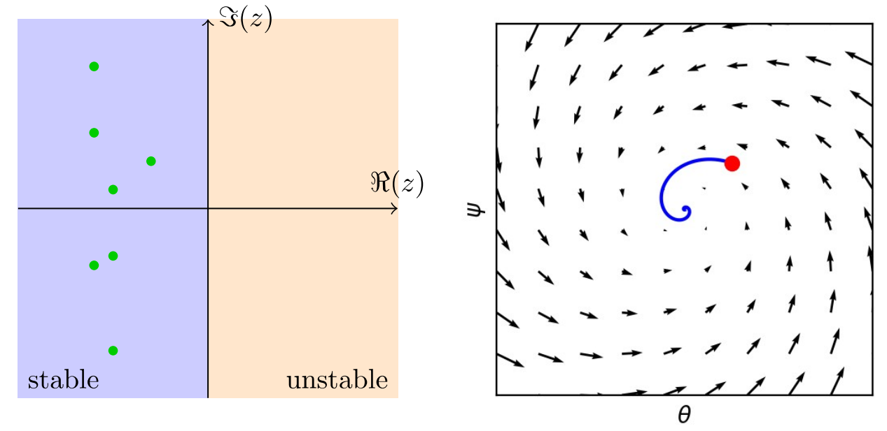]

.center[Continuous system: convergence.]

.footnote[Credits: Mescheder et al, [Which Training Methods for GANs do actually Converge?](https://arxiv.org/abs/1801.04406), 2018.]

---

class: middle

## Dirac-GAN: Vanilla GANs

.width-90.center[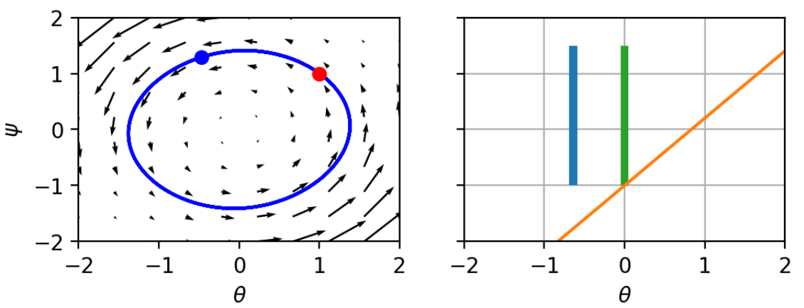]

On the Dirac-GAN toy problem, eigenvalues are $\\{ -f'(0)i, +f'(0)i \\}$.
Therefore convergence is not guaranteed.

.footnote[Credits: Mescheder et al, [Which Training Methods for GANs do actually Converge?](https://arxiv.org/abs/1801.04406), 2018.]

---

class: middle

## Dirac-GAN: Wasserstein GANs

.width-90.center[]

Eigenvalues are $\\{ -i, +i \\}$.
Therefore convergence is not guaranteed.

.footnote[Credits: Mescheder et al, [Which Training Methods for GANs do actually Converge?](https://arxiv.org/abs/1801.04406), 2018.]

---

class: middle

## Dirac-GAN: Zero-centered gradient penalties

.width-90.center[]

A penalty on the squared norm of the gradients of the discriminator results in the regularization
$$R\_1(\phi) = \frac{\gamma}{2} \mathbb{E}\_{\mathbf{x} \sim p(\mathbf{x})}\left[ || \nabla\_\mathbf{x} d(\mathbf{x};\phi)||^2 \right].$$
The resulting eigenvalues are $\\{ -\frac{\gamma}{2} \pm \sqrt{\frac{\gamma}{4} - f'(0)^2}\\}$.
Therefore, for $\gamma>0$, all eigenvalues have negative real part, hence training is locally convergent!

.footnote[Credits: Mescheder et al, [Which Training Methods for GANs do actually Converge?](https://arxiv.org/abs/1801.04406), 2018.]

---

class: middle

.center.width-70[]

.footnote[Credits: Mescheder et al, [Which Training Methods for GANs do actually Converge?](https://arxiv.org/abs/1801.04406), 2018.]

---

class: middle

.center.width-70[]

.footnote[Credits: Mescheder et al, [Which Training Methods for GANs do actually Converge?](https://arxiv.org/abs/1801.04406), 2018.]

---

class: middle

.center.width-70[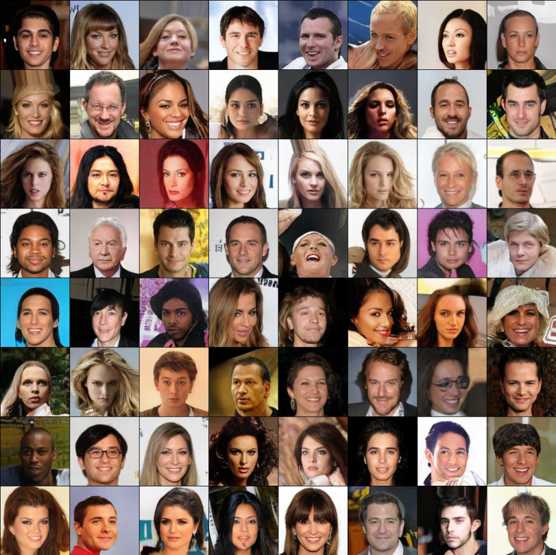]

.footnote[Credits: Mescheder et al, [Which Training Methods for GANs do actually Converge?](https://arxiv.org/abs/1801.04406), 2018.]

---

class: middle

# State of the art

---

class: middle

.center.width-70[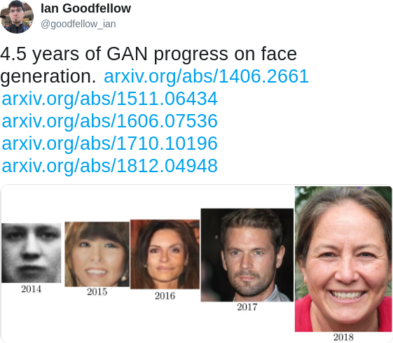]

---

class: middle

## Progressive growing of GANs

.center[

Wasserstein GANs as baseline (Arjovsky et al, 2017) +  Gradient Penalty (Gulrajani, 2017) + (quite a few other tricks)

+

]

.center.width-100[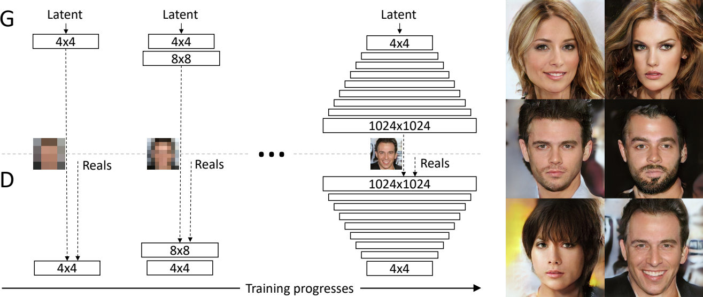]

.center[(Karras et al, 2017)]

---

class: middle

.center.width-100[]

.center[(Karras et al, 2017)]

---

class: middle, center, black-slide

<iframe width="600" height="450" src="https://www.youtube.com/embed/XOxxPcy5Gr4" frameborder="0" volume="0" allowfullscreen></iframe>

(Karras et al, 2017)

---

class: middle

## BigGANs

.center[

Self-attention GANs as baseline (Zhang et al, 2018) + Hinge loss objective (Lim and Ye, 2017; Tran et al, 2017) + Class information to $g$ with class-conditional batchnorm (de Vries et al, 2017) + Class information to $d$ with projection (Miyato and Koyama, 2018) + Half the learning rate of SAGAN, 2 $d$-steps per $g$-step   + Spectral normalization for both $g$ and $d$ + Orthogonal initialization (Saxe et al, 2014) + Large minibatches (2048) + Large number of convolution filters + Shared embedding and hierarchical latent spaces + Orthogonal regularization + Truncated sampling + (quite a few other tricks)

]

 
.center.width-100[]
.center[(Brock et al, 2018)]

---

class: middle, center, black-slide

<iframe width="600" height="450" src="https://www.youtube.com/embed/YY6LrQSxIbc" frameborder="0" allowfullscreen></iframe>

(Brock et al, 2018)

---

class: middle

## StyleGAN (v1)

.center[

Progressive GANs as baseline (Karras et al, 2017) + Non-saturating loss instead of WGAN-GP + $R\_1$ regularization (Mescheder et al, 2018) + (quite a few other tricks)

+

.width-60[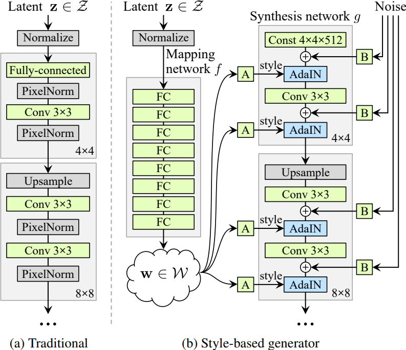]

]

---

class: middle, center, black-slide

<iframe width="600" height="450" src="https://www.youtube.com/embed/kSLJriaOumA" frameborder="0" allowfullscreen></iframe>

(Karras et al, 2018)

---

class: middle

The StyleGAN generator $g$ is so powerful that it can re-generate arbitrary faces.

.center[
.width-30[] &nbsp;
.width-30[]
]

---

class: middle

.center[.width-80[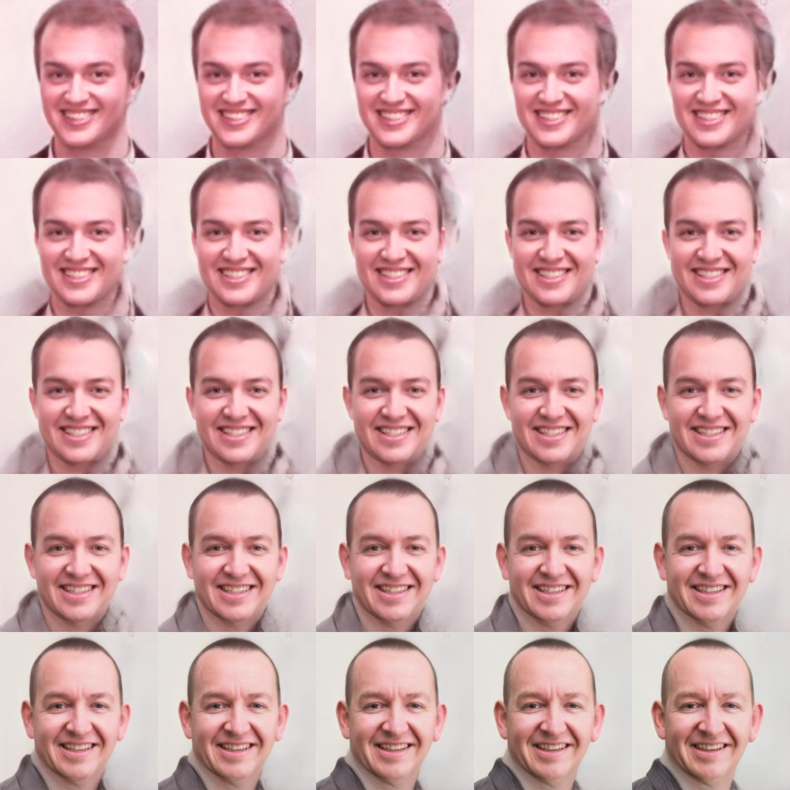]]

---

class: middle

.center[
.width-30[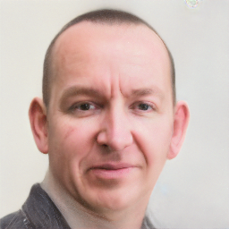] &nbsp;
.width-30[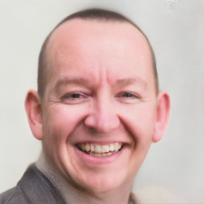]

.width-30[] &nbsp;
.width-30[]
]

---

class: middle 

## StyleGAN (v2)

.width-60.center[]

.center[(Karras et al, 2019)]

---

class: middle

# Applications

---

class: middle, center

$p(\mathbf{z})$ need not be a random noise distribution.

---

class: middle

## Image-to-image translation

.center[

.width-90[]

.center[CycleGANs (Zhu et al, 2017)]

]

---

class: middle, center, black-slide

<iframe width="600" height="450" src="https://www.youtube.com/embed/3AIpPlzM_qs" frameborder="0" volume="0" allowfullscreen></iframe>

High-resolution image synthesis (Wang et al, 2017)

---

class: middle, center, black-slide

<iframe width="600" height="450" src="https://www.youtube.com/embed/p5U4NgVGAwg" frameborder="0" allowfullscreen></iframe>

GauGAN: Changing sketches into photorealistic masterpieces (NVIDIA, 2019)

---

class: middle

## Captioning

.width-100[]

.width-100[]

.center[(Shetty et al, 2017)]

---

class: middle

## Text-to-image synthesis

.center[

.width-100[]

.center[(Zhang et al, 2017)]

]

---

class: middle

.center[

.width-100[]

.center[(Zhang et al, 2017)]

]

---

class: middle

##  Music generation

.center.width-100[]

.center[

<audio src="https://salu133445.github.io/musegan/audio/best_samples.mp3" type="audio/mpeg" controls="" controlslist="nodownload">Your browser does not support the audio element.</audio>

]

.center[MuseGAN (Dong et al, 2018)]

---

class: middle

## Accelerating scientific simulators

.grid[
.kol-2-3[.width-100[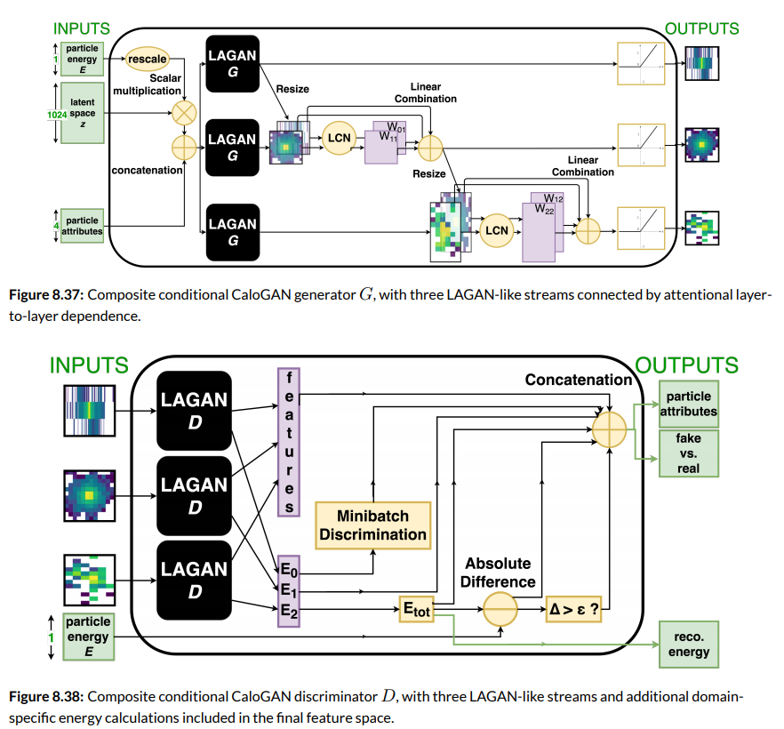]]
.kol-1-3[ .width-100[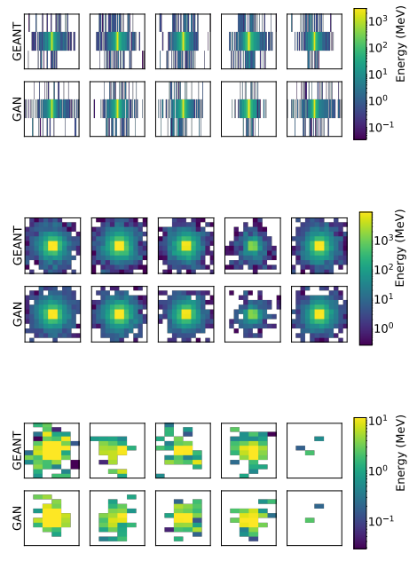]]
]

.center[Learning particle physics (Paganini et al, 2017)]

???

https://arxiv.org/pdf/1712.10321.pdf

---

class: middle

.center.width-70[]

.center[Learning cosmological models (Rodriguez et al, 2018)]

???

https://arxiv.org/pdf/1801.09070.pdf

---

class: middle

## Brain reading

.center[

.width-100[]

.center[(Shen et al, 2018)]

]

---

class: middle

.center[

.width-100[]

.center[(Shen et al, 2018)]

]

---

class: middle, center, black-slide

<iframe width="600" height="450" src="https://www.youtube.com/embed/jsp1KaM-avU?&loop=1&start=0" frameborder="0" volume="0" allowfullscreen></iframe>

Brain reading (Shen et al, 2018)

---

class: end-slide, center
count: false

The end.

---

# References

- Goodfellow, I., Pouget-Abadie, J., Mirza, M., Xu, B., Warde-Farley, D., Ozair, S., ... & Bengio, Y. (2014). Generative adversarial nets. In Advances in neural information processing systems (pp. 2672-2680).
- Arjovsky, M., Chintala, S., & Bottou, L. (2017). Wasserstein gan. arXiv preprint arXiv:1701.07875.
- Mescheder, L., Geiger, A., & Nowozin, S. (2018). Which training methods for GANs do actually Converge?. arXiv preprint arXiv:1801.04406.
