class: middle, center, title-slide

# Deep Learning

Lecture 8: Attention and transformers

  
Prof. Gilles Louppe 
[g.louppe@uliege.be](mailto:g.louppe@uliege.be)

---

# Today

Attention is all you need!
- Bahdanau attention
- Attention layers
- Transformers
- Applications

???

Mission: learn a bout a novel and fundamental building block in modern neural networks. This brick can replace both FC and convolutional layers.

---

class: black-slide
background-image: url(figures/lec8/vision.png)
background-size: cover

---

class: middle

.center.width-75[]

Using the nonvolitional cue based on saliency (red cup, non-paper), attention is involuntarily directed to the coffee.

.footnote[Credits: [Dive Into Deep Learning, 10.1](https://d2l.ai/chapter_attention-mechanisms/attention-cues.html).]

---

class: middle

.center.width-75[]

Using the volitional cue (want to read a book) that is task-dependent, attention is directed to the book under volitional control.

.footnote[Credits: [Dive Into Deep Learning, 10.1](https://d2l.ai/chapter_attention-mechanisms/attention-cues.html).]

---

class: middle

.center.width-100[]

.footnote[Credits: [Dive Into Deep Learning, 10.1](https://d2l.ai/chapter_attention-mechanisms/attention-cues.html).]

---

class: middle

# Bahdanau attention

---

class: middle

.center.width-100[]

Standard RNN-based sequence-to-sequence models compress an input sequence $\mathbf{x}\_{1:T}$ into a single thought vector $v$, and then produce an output sequence $\mathbf{y}\_{1:T'}$ from an autoregressive generative model
$$\begin{aligned}
\mathbf{h}\_t &= \phi(\mathbf{x}\_t, \mathbf{h}\_{t-1})\\\\
v &= \mathbf{h}\_{T} \\\\
\mathbf{y}\_{i} &\sim p(\cdot | \mathbf{y}\_{1:i-1}, v).
\end{aligned}$$

.footnote[Credits: [Dive Into Deep Learning, 9.7](https://d2l.ai/chapter_recurrent-modern/seq2seq.html).]

---

class: middle

.center.width-80[]

This architecture assumes that the sole vector $v$ carries enough information to generate entire output sequences. This is often **challenging** for long sequences.

???

There are not direct "channels" to transport local information from the input sequence to the place where it is useful in the resulting sequence.

---

class: middle

Instead, attention mechanisms can transport information from parts of the input signal to parts of the output .bold[specified dynamically].

Under the assumption that each output token comes from one or a handful of input tokens, the decoder should attend to only those tokens that are relevant for producing the next output token.

.center.width-80[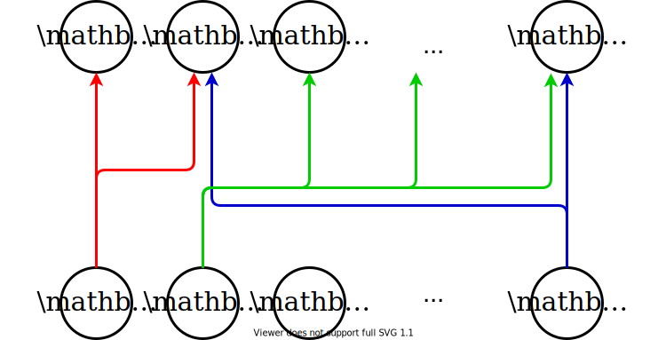]

---

class: middle

## Attention-based machine translation

.center.width-90[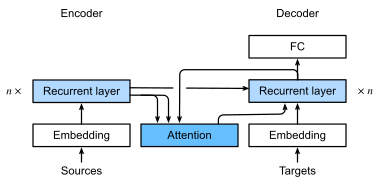]

.footnote[Credits: [Dive Into Deep Learning, 10.4](https://d2l.ai/chapter_attention-mechanisms/bahdanau-attention.html).]

???

Blackboard: translate to French the following sentence. 

"A truck is coming down the road. It drives too fast."

->

"Un camion arrive sur la route. Il roule trop vite."

---

class: middle

Following Bahdanau et al. (2014), the encoder is specified as a bidirectional RNN that computes an annotation vector for each input token,
$$\mathbf{h}\_i = (\overrightarrow{\mathbf{h}}\_i, \overleftarrow{\mathbf{h}}\_i)$$
for $i = 1, \ldots, T$, where $\overrightarrow{\mathbf{h}}\_i$ and $\overleftarrow{\mathbf{h}}\_i$ respectively denote the forward and backward hidden recurrent states of the bidirectional RNN.

From this, they compute a new process $\mathbf{s}\_i$, $i=1, \ldots, T$, which looks at weighted averages of the $\mathbf{h}\_j$ where the __weights are functions of the signal__.

.footnote[Credits: Francois Fleuret, [Deep Learning](https://fleuret.org/dlc/), UNIGE/EPFL.]

---

class: middle

Given $\mathbf{y}\_1, \ldots, \mathbf{y}\_{i-1}$ and $\mathbf{s}\_1, \ldots, \mathbf{s}\_{i-1}$, first compute an attention vector
$$\mathbf{\alpha}\_{i,j} = \text{softmax}\_j(a(\mathbf{s}\_{i-1}, \mathbf{h}\_j))$$
for $j=1, \ldots, T$, whered $a$ is an *attention scoring function*, here specified as a one hidden layer $\text{tanh}$ MLP.

Then, compute the context vector from the weighted $\mathbf{h}\_j$'s,
$$\mathbf{c}\_i = \sum\_{j=1}^T \alpha\_{i, j} \mathbf{h}\_j.$$

.footnote[Credits: Francois Fleuret, [Deep Learning](https://fleuret.org/dlc/), UNIGE/EPFL.]

???

Note that the attention weights depend on the content, rather than on the position in sentence. This means they act as a form of *content-based* addressing.

---

class: middle

The model can now make the prediction $\mathbf{y}\_i$ as
$$
\begin{aligned}
\mathbf{s}\_i &= f(\mathbf{s}\_{i-1}, y\_{i-1}, c\_i)  \\\\
\mathbf{y}\_i &\sim g(\mathbf{y}\_{i-1}, \mathbf{s}\_i, \mathbf{c}\_i),
\end{aligned}
$$
where $f$ is a GRU.

This is **context attention**, where $\mathbf{s}\_{i-1}$ modulates what to look in $\mathbf{h}\_1, \ldots, \mathbf{h}\_{T}$ to compute $\mathbf{s}\_i$ and sample $\mathbf{y}\_i$.

???

Do a blackboard example.

---

class: middle

.center.width-100[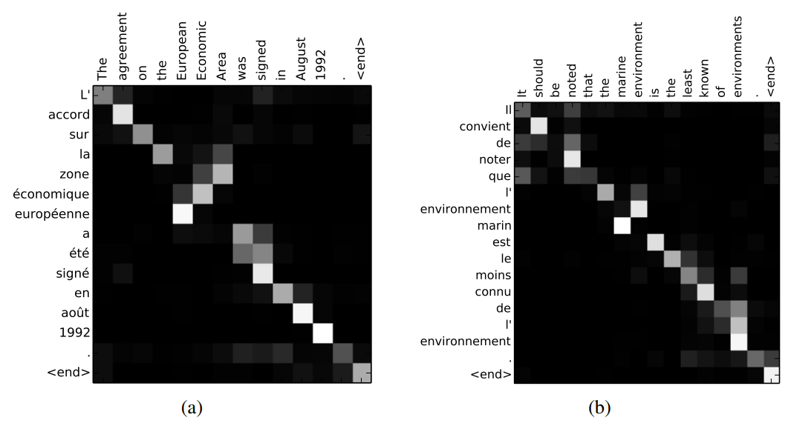]

---

class: middle

# Attention layers

---

class: middle

The attention mechanisms can be defined generically as follows.

Given a context or query vector $\mathbf{q} \in \mathbb{R}^{q}$, a key tensor $\mathbf{K} \in \mathbb{R}^{m \times k}$, and a value tensor $\mathbf{V} \in \mathbb{R}^{m \times v},$ an attention layer computes an output vector $\mathbf{y} \in \mathbb{R}^{v}$
with $$\mathbf{y} = \sum\_{i=1}^m \text{softmax}\_i(a(\mathbf{q}, \mathbf{K}\_i; \theta)) \mathbf{V}\_i,$$
where $a : \mathbb{R}^q \times \mathbb{R}^k \to \mathbb{R}$ is a scalar attention scoring function.

---

class: middle

.center.width-100[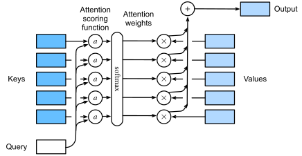]

.footnote[Credits: [Dive Into Deep Learning, 10.3](https://d2l.ai/chapter_attention-mechanisms/attention-scoring-functions.html).]

---

class: middle

## Additive attention

When queries and keys are vectors of different lengths, we can use an additive attention as the scoring function.

Given $\mathbf{q} \in \mathbb{R}^{q}$ and $\mathbf{k} \in \mathbb{R}^{k}$, the **additive attention** scoring function is
$$a(\mathbf{q}, \mathbf{k}) = \mathbf{w}_v^T \tanh(\mathbf{W}\_q^T \mathbf{q} + \mathbf{W}\_k^T \mathbf{k})$$
where $\mathbf{w}_v \in \mathbb{R}^h$, $\mathbf{W}_q \in \mathbb{R}^{q \times h}$ and $\mathbf{W}_k \in \mathbb{R}^{k \times h}$ are learnable parameters.

---

class: middle

## Scaled dot-product attention

When queries and keys are vectors of the same length $d$, we can use a scaled dot-product attention as the scoring function.

Given $\mathbf{q} \in \mathbb{R}^{d}$ and $\mathbf{k} \in \mathbb{R}^{d}$, the **scaled dot-product attention** scoring function is
$$a(\mathbf{q}, \mathbf{k}) = \frac{\mathbf{q}^T \mathbf{k}}{\sqrt{d}}.$$

---

class: middle

For $n$ queries $\mathbf{Q} \in \mathbb{R}^{n \times d}$, keys $\mathbf{K} \in \mathbb{R}^{m \times d}$ and values $\mathbf{V} \in \mathbb{R}^{m \times v}$, the **scaled dot-product attention** layer computes an output tensor 
$$\mathbf{Y} = \underbrace{\text{softmax}\left(\frac{\mathbf{QK}^T)}{\sqrt{d}}\right)}\_{\text{attention matrix}\, \mathbf{A}}\mathbf{V} \in \mathbb{R}^{n \times v}.$$

---

class: middle

.center.width-80[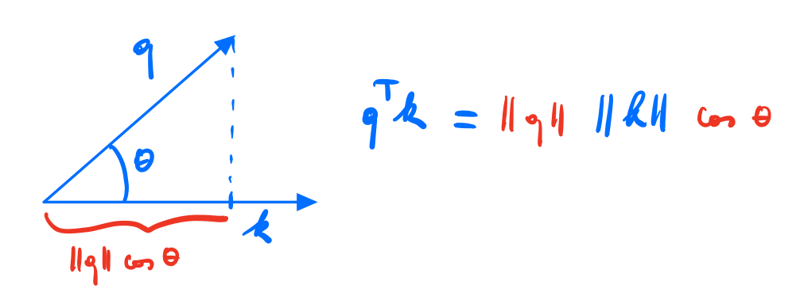]

Recall that the dot product is simply a un-normalised cosine similarity, which tells us about the alignment of two vectors.

Therefore, the $\mathbf{QK}^T$ matrix is a **similarity matrix** between queries and keys.

---

class: middle

.center.width-100[]

.footnote[Credits: Francois Fleuret, [Deep Learning](https://fleuret.org/dlc/), UNIGE/EPFL.]

---

class: middle

In the currently standard models for sequences, the queries, keys and values are linear functions of the inputs.

Given the learnable matrices $\mathbf{W}\_q \in \mathbb{R}^{d \times x}$, $\mathbf{W}\_k \in \mathbb{R}^{d \times x'}$, and $\mathbf{W}\_v \in \mathbb{R}^{v \times x'}$, and two input sequences $\mathbf{X} \in \mathbb{R}^{n \times x}$ and $\mathbf{X}' \in \mathbb{R}^{m \times x'}$, we have
$$\begin{aligned} 
\mathbf{Q} &= \mathbf{X} \mathbf{W}\_q^T \in \mathbb{R}^{n \times d} \\\\
\mathbf{K} &= \mathbf{X'} \mathbf{W}\_k^T \in \mathbb{R}^{m \times d} \\\\
\mathbf{V} &= \mathbf{X'} \mathbf{W}\_v^T \in \mathbb{R}^{m \times v}.
\end{aligned}$$

---

class: middle

## Self-attention

When the queries, keys and values are derived from the same inputs, the attention mechanism is called **self-attention**.

For the scaled dot-product attention, the self-attention layer is obtained when $\mathbf{X} = \mathbf{X}'$.

Therefore, self-attention can be used as a regular feedforward-kind of layer, similarly to fully-connected or convolutional layers.

 
.center.width-60[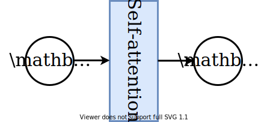]

---

class: middle 

## CNNs vs. RNNs vs. self-attention

.center.width-80[]

.footnote[Credits: [Dive Into Deep Learning, 10.6.2](http://preview.d2l.ai/d2l-en/PR-1581/chapter_attention-mechanisms/self-attention-and-positional-encoding.html#comparing-cnns-rnns-and-self-attention).]

---

class: middle

.center.width-100[]

where $n$ is the sequence length, $d$ is the embedding dimension, and $k$ is the kernel size of convolutions.

---

class: middle

## A toy example

To illustrate the behavior of the attention mechanism, we consider a toy problem with 1D sequences composed of two triangular and two rectangular patterns. The target sequence averages the heights in each pair of shapes.

.center.width-100[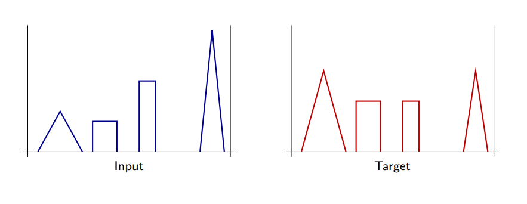]

.footnote[Credits: Francois Fleuret, [Deep Learning](https://fleuret.org/dlc/), UNIGE/EPFL.]

---

class: middle

.center.width-80[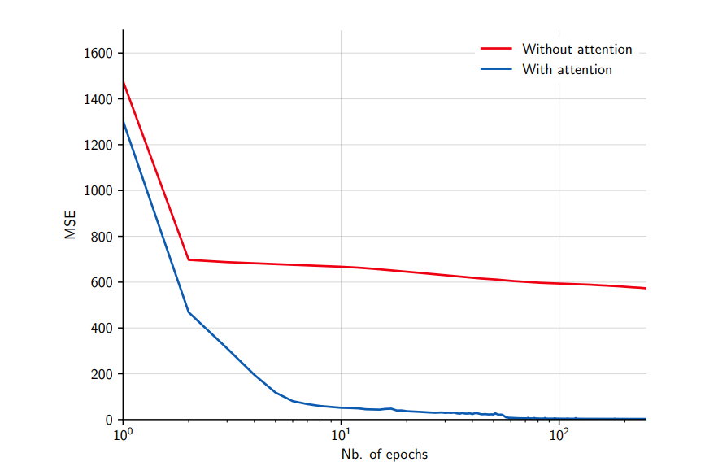]

.footnote[Credits: Francois Fleuret, [Deep Learning](https://fleuret.org/dlc/), UNIGE/EPFL.]

---

class: middle

We can modify the toy problem to consider targets where the pairs to average are the two right and leftmost shapes.

.center.width-100[]

.footnote[Credits: Francois Fleuret, [Deep Learning](https://fleuret.org/dlc/), UNIGE/EPFL.]

---

class: middle

The performance is expected to be poor given the inability of the self-attention layer to take into account absolute or relative positions. Indeed, self-attention is permutation-invariant:
$$\begin{aligned}
\mathbf{y} &= \sum\_{i=1}^m \text{softmax}\_i\left(\frac{\mathbf{q}^T{\mathbf{K}^T\_{i}}}{\sqrt{d}}\right) \mathbf{V}\_{i}\\\\
&= \sum\_{i=1}^m \text{softmax}\_{i}\left(\frac{\mathbf{q}^T{\mathbf{K}^T\_{\sigma(i)}}}{\sqrt{d}}\right) \mathbf{V}\_{\sigma(i)}
\end{aligned}$$
for any permutation $\sigma$ of the key-value pairs.

---

class: middle

.center.width-80[]

However, this problem can be fixed by providing positional encodings explicitly to the attention layer.

.footnote[Credits: Francois Fleuret, [Deep Learning](https://fleuret.org/dlc/), UNIGE/EPFL.]

---

class: middle

# Transformers

---

class: middle

Vaswani et al. (2017) proposed to go one step further: instead of using attention mechanisms as a supplement to standard convolutional and recurrent layers, they designed a model, the **transformer**, combining only attention layers.

The transformer was designed for a sequence-to-sequence translation task, but it is currently key to state-of-the-art approaches across NLP tasks.

.footnote[Credits: Francois Fleuret, [Deep Learning](https://fleuret.org/dlc/), UNIGE/EPFL.]

---

class: middle

## Scaled dot-product attention

The first building block of the transformer architecture is a scaled dot-production attention module
$$\text{attention}(\mathbf{Q}, \mathbf{K}, \mathbf{V}) = \text{softmax}\left(\frac{\mathbf{Q}\mathbf{K}^T}{\sqrt{d\_k}}\right) \mathbf{V}$$
where the $1/\sqrt{d\_k}$ scaling is used to keep the (softmax's) temperature constant across different choices of the query/key dimension $d\_k$.

---

class: middle

.grid[
.kol-2-3[

 

## Multi-head attention

The transformer architecture projects the queries, keys and values $h=8$ times with distinct, learned linear projections to $d\_k=64$, $d\_k=64$ and $d\_v=64$ dimensions respectively.
]
.kol-1-3.center.width-100[]
]

$$
\begin{aligned}
\text{multihead}(\mathbf{Q}, \mathbf{K}, \mathbf{V}) &= \text{concat}\left(\mathbf{H}\_1, \ldots, \mathbf{H}\_h\right) \mathbf{W}^O\\\\
\mathbf{H}\_i &= \text{attention}(\mathbf{Q}\mathbf{W}\_i^Q, \mathbf{K}\mathbf{W}\_i^K, \mathbf{V}\mathbf{W}\_i^V)
\end{aligned}
$$
with
$$\mathbf{W}\_i^Q \in \mathbb{R}^{d\_\text{model} \times d\_k}, \mathbf{W}\_i^K \in \mathbb{R}^{d\_\text{model} \times d\_k}, \mathbf{W}\_i^V \in \mathbb{R}^{d\_\text{model} \times d\_v}, \mathbf{W}\_i^O \in \mathbb{R}^{hd\_v \times d\_\text{model}}$$

---

class: middle

.grid[
.kol-2-3[

## Encoder-decoder architecture

The transformer model is composed of:
- An encoder that combines $N=6$ modules, each composed of a multi-head attention sub-module, and a (per-component) one-hidden-layer MLP, with residual pass-through and layer normalization. All sub-modules and embedding layers produce outputs of dimension $d\_\text{model}=512$.
- A decoder that combines $N=6$ modules similar to the encoder, but using masked self-attention to prevent positions from attending to subsequent positions. In addition, the decoder inserts a third sub-module which performs multi-head attention over the output of the encoder stack.

]
.kol-1-3.center.width-100[  ]
]

???

---

class: middle

.center.width-90[]

The encoders start by processing the input sequence. The output of the top encoder is then transformed into a set of attention vectors $\mathbf{K}$ and $\mathbf{V}$ that will help the decoders focus on appropriate places in the input sequence.

.footnote[Credits: Jay Alammar, [The Illustrated Transformer](https://jalammar.github.io/illustrated-transformer/).]

---

class: middle

.center.width-90[]

Each step in the decoding phase produces an output token, until a special symbol is reached indicating the transformer decoder has completed its output.

The output of each step is fed to the bottom decoder in the next time step, and the decoders bubble up their decoding results just like the encoders did. 

.footnote[Credits: Jay Alammar, [The Illustrated Transformer](https://jalammar.github.io/illustrated-transformer/).]

---

class: middle

In the decoder:
- The first masked self-attention sub-module is only allowed to attend to earlier positions in the output sequence. This is done by masking future positions.
- The second multi-head attention sub-module works just like multi-head self-attention, except it creates its query matrix from the layer below it, and takes the keys and values matrices from the output of the encoder stack.

.footnote[Credits: Jay Alammar, [The Illustrated Transformer](https://jalammar.github.io/illustrated-transformer/).]
  
---

class: middle

## Positional encoding

As each word in a sentence .italic[simultaneously] flows through the encoder/decoder stack, the model itself does not have any sense of position/order for each word.

Positional information is provided through an **additive** positional encoding of the same dimension $d\_\text{model}$ as the internal representation and is of the form
$$
\begin{aligned}
\text{PE}\_{t,2i} &= \sin\left(\frac{t}{10000^{\frac{2i}{d\_\text{model}}}}\right) \\\\
\text{PE}\_{t,2i+1} &= \cos\left(\frac{t}{10000^{\frac{2i}{d\_\text{model}}}}\right).
\end{aligned}
$$

After adding the positional encoding, words will be closer to each other based on the similarity of their meaning and their relative position in the sentence, in the $d\_\text{model}$-dimensional space.

---

class: middle

.width-100[]

.center[128-dimensional positonal encoding for a sentence with the maximum lenght of 50. Each row represents the embedding vector.]

---

class: middle

## Machine translation

The transformer architecture is tested on English-to-German and English-to-French translation using WMT2014 datasets.

- English-to-German: 4.5M sentence pairs, 37k tokens vocabulary.
- English-to-French: 36M sentence pairs, 32k tokens vocabulary.
- 8 P100 GPUs (150 TFlops, FP16), 0.5 day for the small model, 3.5 days for the large one.

.footnote[Credits: Francois Fleuret, [Deep Learning](https://fleuret.org/dlc/), UNIGE/EPFL.]

---

class: middle

.center[

.width-100[]

Self-attention layers learned that "it" could refer  to different entities, in different contexts.
  
]

.footnote[Credits: [Transformer: A Novel Neural Network Architecture for Language Understanding](https://ai.googleblog.com/2017/08/transformer-novel-neural-network.html), 2017.]

---

class: middle

.center[

.width-100[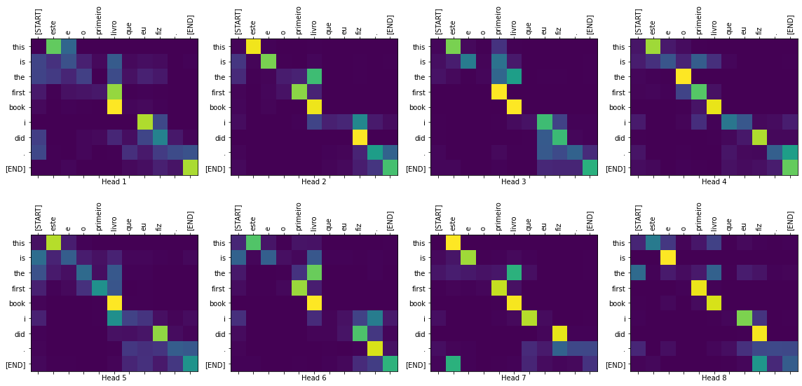]

Attention maps extracted from the multi-head attention modules  show how input tokens relate to output tokens.
  
]

.footnote[Credits: [Transformer model for language understanding](https://www.tensorflow.org/tutorials/text/transformer).]

---

class: middle

## Language pre-training

Similar to pre-training computer vision models on ImageNet, language models can be pre-trained for tasks in natural language processing.

Notably, the models can be pre-trained in a **unsupervised manner** from very large datasets and then fine-tuned on supervised tasks with small data-sets.

---

class: middle

.width-100[]

.center[GPT, Radford et al. (2018)]

.footnote[Credits: Radford et al., [Improving Language Understanding by Generative Pre-Training](https://cdn.openai.com/research-covers/language-unsupervised/language_understanding_paper.pdf), 2018.]

---

class: middle

Increasing the training data and the model size leads to significant improvement of transformer language models. These models are now .bold[the largest in deep learning].

.center.width-80[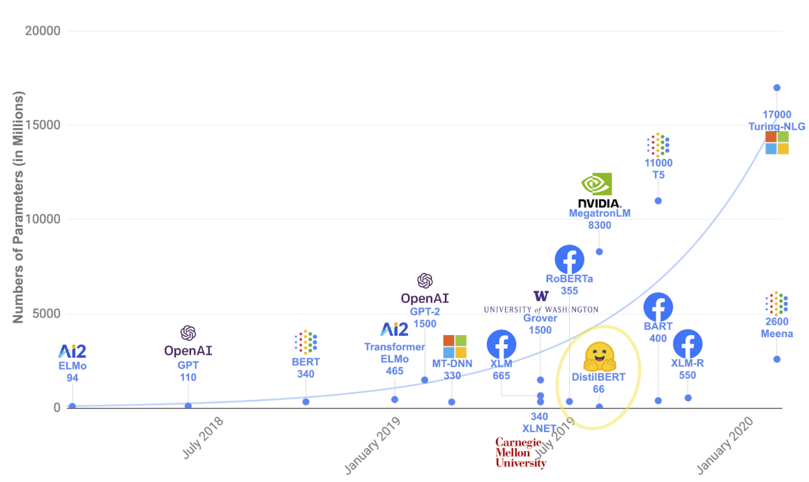]

---

class: middle

GPT-2 is a large transformer-based language model with 1.5 billion parameters, trained on a dataset of 8 million web pages. GPT-2 is trained with a simple objective: predict the next word, given all of the previous words within some text. The diversity of the dataset causes this simple goal to contain naturally occurring demonstrations of many tasks across diverse domains. GPT-2 is a direct scale-up of GPT, with more than 10X the parameters and trained on more than 10X the amount of data.

.pull-right[Radford et al. (2019)]

.footnote[Credits: Francois Fleuret, [Deep Learning](https://fleuret.org/dlc/), UNIGE/EPFL.]

---

class: middle

The GPT-3 model has 175B parameters and was trained on 300B tokens from
various sources.

.pull-right[Brown et al. (2020)]

.footnote[Credits: Francois Fleuret, [Deep Learning](https://fleuret.org/dlc/), UNIGE/EPFL.]

---

class: middle

## Vision transformers (ViTs)

.center.width-90[]

.footnote[Credits: [Dosovitskiy et al](https://arxiv.org/abs/2010.11929), 2020.]

---

class: middle

.center.width-90[]

---

class: center, middle

(demo)

---

class: middle
count: false

# Applications

---

class: black-slide, middle

.center[

.width-80[]

GPT-2 generates synthetic text samples in response to arbitrary inputs.

]

---

class: middle, center, black-slide

<iframe width="600" height="450" src="https://www.youtube.com/embed/fZSFNUT6iY8" frameborder="0" allowfullscreen></iframe>

GPT-3 generates Python code.

---

class: middle

.center[

.width-100[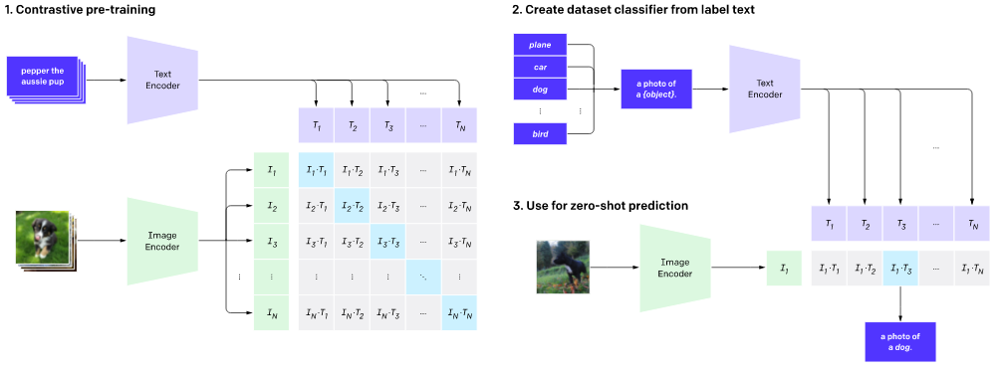]

CLIP: connecting text and images for zero-shot classification (see [demo](https://clip.backprop.co/)).

]

.footnote[Credits: [Radford et al.](https://arxiv.org/abs/2103.00020), 2021.]

---

class: middle

.center[

.width-100[]

AlphaFold: Highly accurate protein structure prediction.

]

.footnote[Credits: [Jumper et al.](https://doi.org/10.1038/s41586-021-03819-2), 2021.]

---

class: middle

.center[

.width-100[]

Decision Transformer: Reinforcement Learning via Sequence Modeling.

]

.footnote[Credits: [Chen et al.](https://arxiv.org/abs/2106.01345), 2021.]

---

# Disclaimer

Large, general language models could have significant **societal impacts**, and also have many near-term applications, including:
- AI writing assistants
- more capable dialogue agents
- unsupervised translation between languages
- better speech recognition systems.

.footnote[Credits: OpenAI [Better Language Models and Their Implications](https://openai.com/blog/better-language-models/).]

---

class: middle

However, we can also imagine the application of these models for **malicious purposes**, including the following:
- generate misleading news articles
- impersonate others online
- automate the production of abusive or faked content to post on social media
- automate the production of spam/phising content.

.alert[The public at large will need to become more skeptical of text they find online, just as the "deep fakes" phenomenon calls for more skepticism about images.]

.footnote[Credits: OpenAI [Better Language Models and Their Implications](https://openai.com/blog/better-language-models/).]

---

class: end-slide, center
count: false

The end.