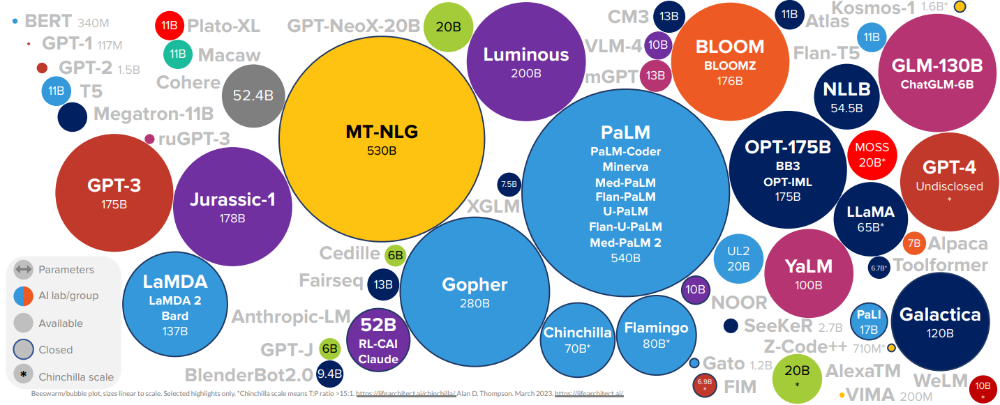
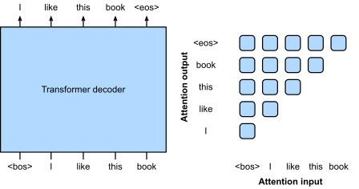
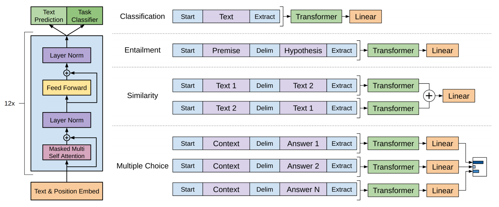
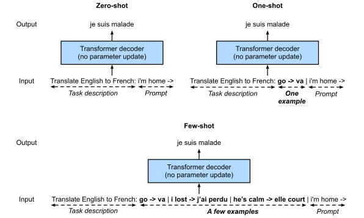
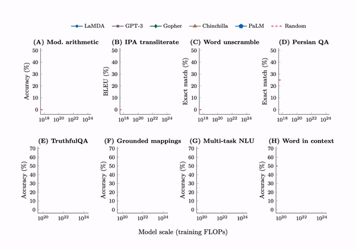
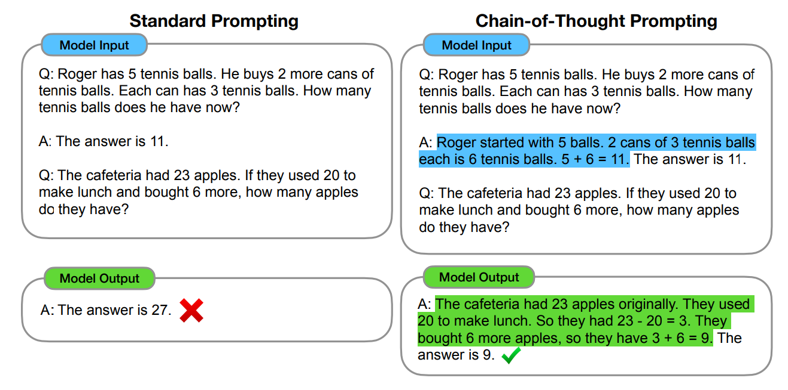
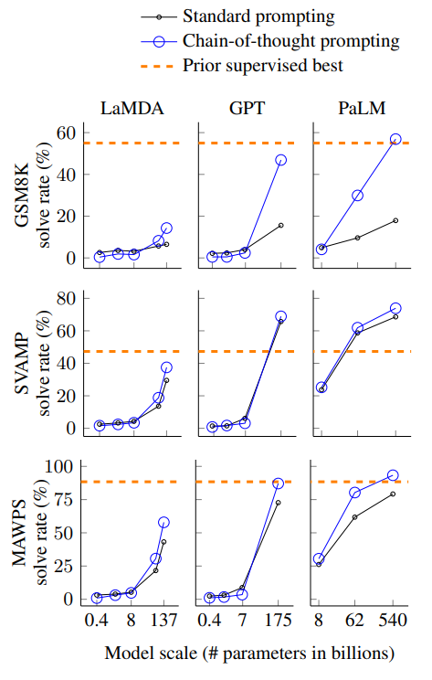
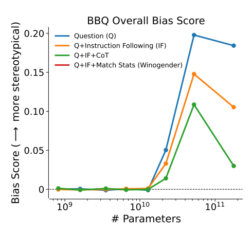
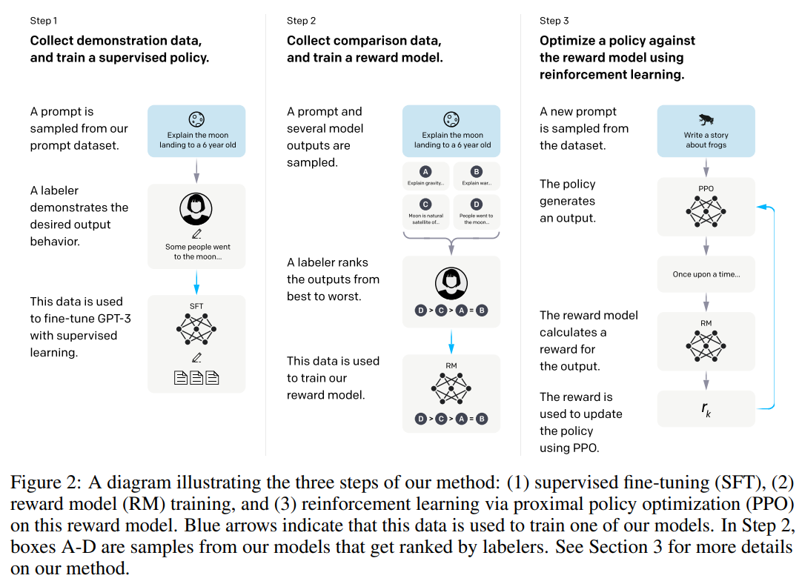
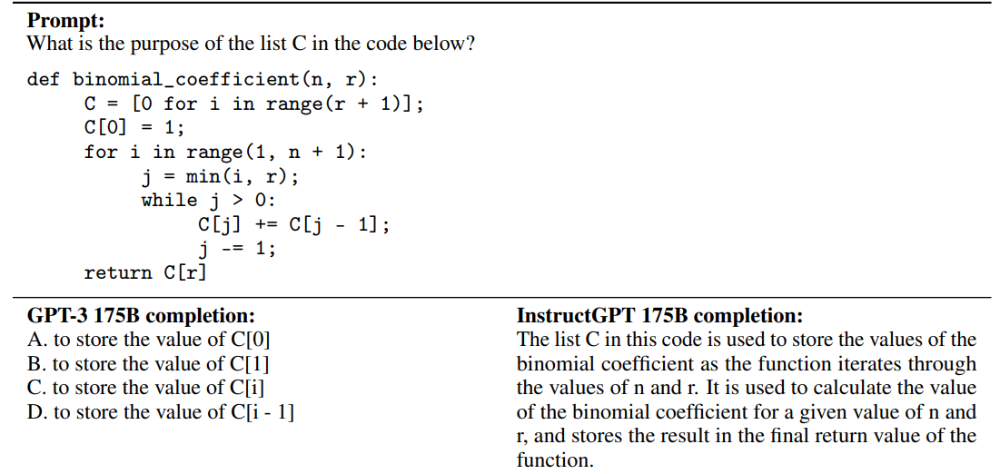

class: middle, center, title-slide

# Deep Learning

Lecture 8: GPT and Large Language Models

  
Prof. Gilles Louppe 
[g.louppe@uliege.be](mailto:g.louppe@uliege.be)

---

# Today

- BabyGPT
- Large language models

---

class: middle

.center[ See `code/gpt/`. ]

---

class: middle

# Large language models

---

class: middle

.center.width-100[]

.center[(March 2023)]

.footnote[Credits: [lifearchitect.ai/models](https://lifearchitect.ai/models/), 2023.]

---

class: middle

## Decoder-only transformers

The decoder-only transformer has become the de facto architecture for large language models.

These models are trained with self-supervised learning, where the target sequence is the same as the input sequence, but shifted by one token to the right.

.center.width-80[]

.footnote[Credits: [Dive Into Deep Learning](https://d2l.ai), 2023.]

---

class: middle

Historically, GPT-1 was first pre-trained and then fine-tuned on downstream tasks.

.width-100[]

.footnote[Credits: Radford et al., [Improving Language Understanding by Generative Pre-Training](https://cdn.openai.com/research-covers/language-unsupervised/language_understanding_paper.pdf), 2018.]

---

class: middle

## Scaling laws

Transformer language model performance improves smoothly as we increase the model size, the dataset size, and amount of compute used for training. 

For optimal performance, all three factors must be scaled up in tandem. Empirical performance has a power-law relationship with each individual factor when not bottlenecked by the other two.

.center.width-100[]

.footnote[Credits: [Kaplan et al](https://arxiv.org/pdf/2001.08361.pdf), 2020.]

---

class: middle

Large models also enjoy better sample efficiency than small models.
- Larger models require less data to achieve the same performance.
- The optimal model size shows to grow smoothly with the amount of compute available for training.

 
.center.width-100[]

.footnote[Credits: [Kaplan et al](https://arxiv.org/pdf/2001.08361.pdf), 2020.]

---

class: middle

## In-context learning

GPT-2 and following models demonstrated potential of using the same language model for multiple tasks, .bold[without updating the model weights].

Zero-shot, one-shot and few-shot learning consist in prompting the model with a few examples of the target task and letting it learn from them. This paradigm is called in-context learning.

---

class: middle

.center.width-100[]

.footnote[Credits: [Dive Into Deep Learning](https://d2l.ai), 2023.]

---

class: middle, center

(demo)

---

class: middle

## Emergent abilities

As language models grow in size, they start to exhibit emergent abilities that are not present in the original training data.

A (few-shot) prompted task is .bold[emergent] if it achieves random performance for small models and then (suddenly) improves as the model size increases.

---

class: middle

.center.width-100[]

.footnote[Credits: [Wei et al](https://arxiv.org/abs/2206.07682), 2022.]

---

class: middle

Notably, chain-of-thought reasoning is an emergent ability of large language models. It improves performance on a wide range of arithmetica, commonsense, and symbolic reasoning tasks.

.center.width-100[]

.footnote[Credits: [Wei et al](https://openreview.net/pdf?id=_VjQlMeSB_J), 2022b.]

---

class: middle

.center.width-50[]

.footnote[Credits: [Wei et al](https://openreview.net/pdf?id=_VjQlMeSB_J), 2022b.]

---

class: middle
.pull-right[]

## Alignment

Increasing the model size does not inherently makes models follow a user's intent better, despite emerging abilities.

Worse, scaling up the model may increase the likelihood of undesirable behaviors, including those that are harmful, unethical, or biased. 

---

class: middle

Human feedback can be used for better aligning language models with human intent, as shown by InstructGPT.

.center.width-80[]

.footnote[Credits: [Ouyang et al](https://arxiv.org/pdf/2203.02155.pdf), 2022.]

---

class: middle

.center.width-100[]

---

class: end-slide, center
count: false

The end.
