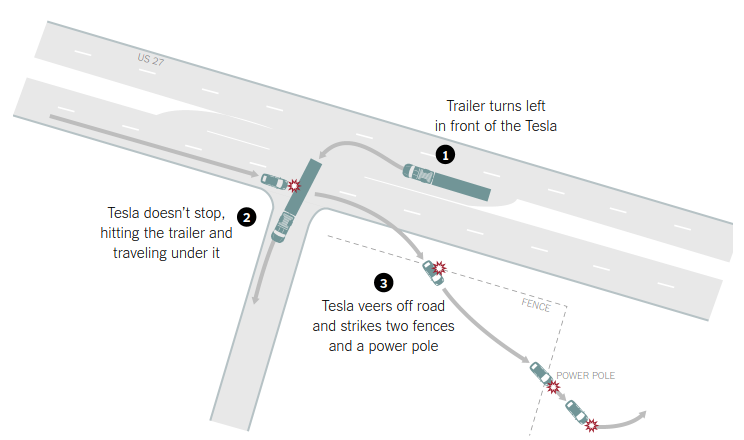
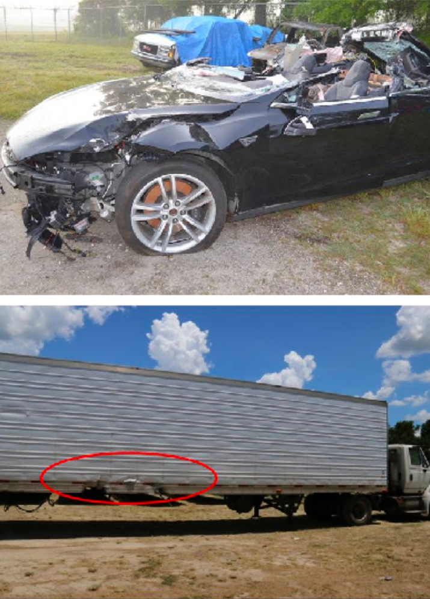
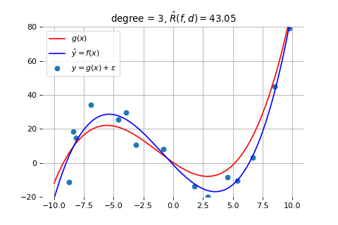
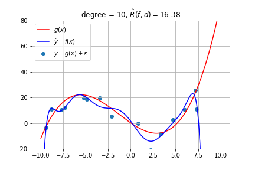
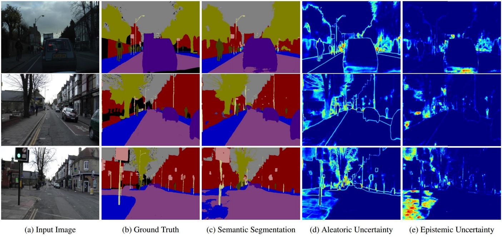
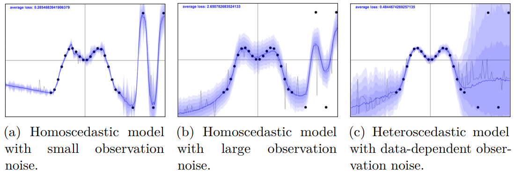
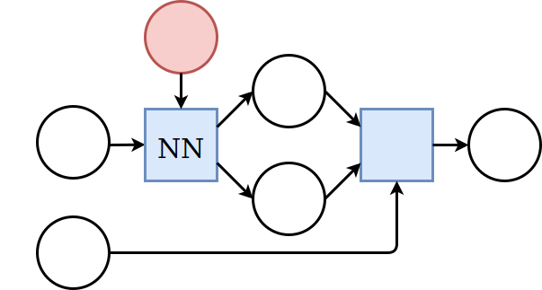
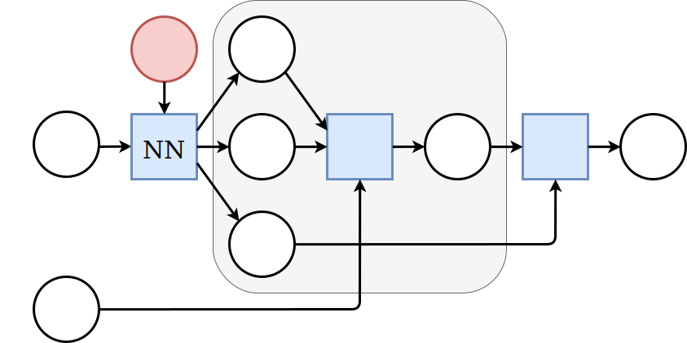
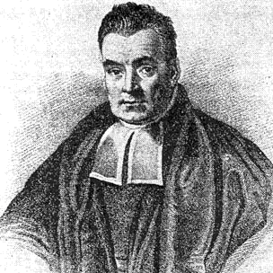

class: middle, center, title-slide

# Deep Learning

Lecture 9: Uncertainty

  
Prof. Gilles Louppe 
[g.louppe@uliege.be](mailto:g.louppe@uliege.be)

???

R: check https://drive.google.com/file/d/1G6I1hOxg9zN3PmKqm7sahXw6DvYmyYW3/view?usp=sharing
R: check https://www.slideshare.net/perone/uncertainty-estimation-in-deep-learning
R: langevin dynamics (welling)

---

# Today

How to model *uncertainty* in deep learning?
- Uncertainty
- Aleatoric uncertainty
- Epistemic uncertainty
- Adversarial attacks

---

class: middle

.center.circle.width-30[]

.italic["Every time a scientific paper presents a bit of data, it's accompanied
by an .bold[error bar] – a quiet but insistent reminder that no knowledge is complete or perfect. It's a .bold[calibration of how much we trust what we think we know]." ― Carl Sagan.]

???

Knowledge is an artefact. It is a mental construct.

Uncertainty is how much we trust this construct.

---

class: middle

# Uncertainty

---

class: middle

## Motivation

In May 2016, there was the **first fatality** from an assisted driving system, caused by the perception system confusing the white side of a trailer for bright sky.

.grid[
.kol-2-3[.center.width-100[]]
.kol-1-3[.center.width-100[]]
]

.footnote[Credits: Kendall and Gal, [What Uncertainties Do We Need in Bayesian Deep Learning for Computer Vision?](https://papers.nips.cc/paper/7141-what-uncertainties-do-we-need-in-bayesian-deep-learning-for-computer-vision.pdf), 2017.]

---

class: middle

.center.width-70[]

An image classification system erroneously identifies two African Americans as gorillas, raising concerns of racial discrimination.

.footnote[Credits: Kendall and Gal, [What Uncertainties Do We Need in Bayesian Deep Learning for Computer Vision?](https://papers.nips.cc/paper/7141-what-uncertainties-do-we-need-in-bayesian-deep-learning-for-computer-vision.pdf), 2017.]

---

class: middle

If both these algorithms were able to assign a high level of **uncertainty** to their erroneous predictions, then the systems may have been able to *make better decisions*, and likely avoid disaster.

.footnote[Credits: Kendall and Gal, [What Uncertainties Do We Need in Bayesian Deep Learning for Computer Vision?](https://papers.nips.cc/paper/7141-what-uncertainties-do-we-need-in-bayesian-deep-learning-for-computer-vision.pdf), 2017.]

---

# Types of uncertainty

## Case 1

Let us consider a neural network model trained with several pictures of dog breeds.

We ask the model to decide on a dog breed using a photo of a cat.
What would you want the model to do?

.grid[
.kol-1-2[.center.width-90[]]
.kol-1-2[.center.width-70[]]
]

---

class: middle

## Case 2

We have three different types of images to classify, cat, dog, and cow, some of which may be noisy due to the limitations of the acquisition instrument.

 
.center.width-90[]

---

class: middle

## Case 3

What are the model parameters that best explain a given dataset? What model structure should we use? What are the known unknowns and our prior beliefs?

.center[
.width-45[]
.width-45[]
]

---

class: middle

.bold[Case 1:] Given a model trained with several pictures of dog breeds. We ask the model to decide on a dog breed using a photo of a cat.

$\Rightarrow$ **Out of distribution test data**.

 

.bold[Case 2:] We have three different types of images to classify, cat, dog, and cow, some of which may be noisy due to the limitations of the acquisition instrument.

$\Rightarrow$ **Aleatoric uncertainty**.

 

.bold[Case 3:] What are the model parameters that best explain a given dataset? What model structure should we use? What are the known unknowns and our prior beliefs?

$\Rightarrow$ **Epistemic uncertainty**.

---

class: middle

.center.width-90[]

.italic["Our model exhibits in (d) increased .bold[aleatoric uncertainty on object boundaries and for objects far from the camera]. .bold[Epistemic uncertainty accounts for our ignorance about which model generated our collected data]. In (e) our model exhibits increased epistemic uncertainty for semantically and visually challenging pixels. The bottom row shows a failure case of the segmentation model when the model fails to segment the footpath due to increased epistemic uncertainty, but not aleatoric uncertainty."]

.footnote[Credits: Kendall and Gal, [What Uncertainties Do We Need in Bayesian Deep Learning for Computer Vision?](https://papers.nips.cc/paper/7141-what-uncertainties-do-we-need-in-bayesian-deep-learning-for-computer-vision.pdf), 2017.]

---

class: middle

# Aleatoric uncertainty

---

class: middle

**Aleatoric** uncertainty captures noise inherent in the observations.
- For example, sensor noise or motion noise result in uncertainty.
- This uncertainty *cannot be reduced* with more data.
- However, aleatoric could be reduced with better measurements.

---

class: middle

Aleatoric uncertainty can further be categorized into *homoscedastic* and *heteroscedastic* uncertainties:
- Homoscedastic uncertainty relates to the uncertainty that a particular task might cause. It stays constant for different inputs.
- Heteroscedastic uncertainty depends on the inputs to the model, with some inputs potentially having more noisy outputs than others.

---

class: middle

.center.width-100[]

.footnote[Credits: Yarin Gal, [Uncertainty in  Deep Learning](https://pdfs.semanticscholar.org/55cd/9e1bb7ce02cd2bb01b364e7b331fcc1ef2c7.pdf), 2016.]

---

# Regression with uncertainty

Consider training data $(\mathbf{x}, y) \sim P(X,Y)$, with
- $\mathbf{x} \in \mathbb{R}^p$,
- $y \in \mathbb{R}$.

We model aleatoric uncertainty in the output by modelling the conditional distribution as a Normal distribution,
$$p(y|\mathbf{x}) = \mathcal{N}(y; \mu(\mathbf{x}), \sigma^2(\mathbf{x})),$$
where $\mu(x)$ and $\sigma^2(\mathbf{x})$ are parametric functions to be learned, such as neural networks.

We do not wish to learn a function $\hat{y} = f(\mathbf{x})$ that would only produce point estimates.

---

class: middle

## Homoscedastic aleatoric uncertainty

.center.width-80[]

---

class: middle

We have,
$$\begin{aligned}
&\arg \max\_{\theta,\sigma^2} p(\mathbf{d}|\theta,\sigma^2) \\\\
&= \arg \max\_{\theta,\sigma^2} \prod\_{\mathbf{x}\_i, y\_i \in \mathbf{d}} p(y\_i|\mathbf{x}\_i, \theta,\sigma^2) \\\\
&= \arg \max\_{\theta,\sigma^2} \prod\_{\mathbf{x}\_i, y\_i \in \mathbf{d}} \frac{1}{\sqrt{2\pi} \sigma} \exp\left(-\frac{(y\_i-\mu(\mathbf{x}\_i))^2}{2\sigma^2}\right) \\\\
&= \arg \min\_{\theta,\sigma^2} \sum\_{\mathbf{x}\_i, y\_i \in \mathbf{d}}  \frac{(y\_i-\mu(\mathbf{x}\_i))^2}{2\sigma^2} + \log(\sigma) + C
\end{aligned}$$

.exercise[What if $\sigma^2$ was fixed?]

---

class: middle

## Heteroscedastic aleatoric uncertainty

.center.width-80[]

---

class: middle

Same as for the homoscedastic case, except that that $\sigma^2$ is now a function of $\mathbf{x}\_i$:
$$\begin{aligned}
&\arg \max\_{\theta} p(\mathbf{d}|\theta) \\\\
&= \arg \max\_{\theta} \prod\_{\mathbf{x}\_i, y\_i \in \mathbf{d}} p(y\_i|\mathbf{x}\_i, \theta) \\\\
&= \arg \max\_{\theta} \prod\_{\mathbf{x}\_i, y\_i \in \mathbf{d}} \frac{1}{\sqrt{2\pi} \sigma(\mathbf{x}\_i)} \exp\left(-\frac{(y\_i-\mu(\mathbf{x}\_i))^2}{2\sigma^2(\mathbf{x}\_i)}\right) \\\\
&= \arg \min\_{\theta} \sum\_{\mathbf{x}\_i, y\_i \in \mathbf{d}}  \frac{(y\_i-\mu(\mathbf{x}\_i))^2}{2\sigma^2(\mathbf{x}\_i)} + \log(\sigma(\mathbf{x}\_i)) + C
\end{aligned}$$

.exercise[What is the purpose of $2\sigma^2(\mathbf{x}\_i)$? What about $\log(\sigma(\mathbf{x}\_i))$?]

---

# Multimodality

Modelling $p(y|\mathbf{x})$ as a unimodal Gaussian is not always a good idea since the conditional distribution may be multimodal.

 

.center.width-90[]
.caption[(and it would be even worse to have only point estimates for $y$!)]

---

class: middle

## Gaussian mixture model

A **Gaussian mixture model** (GMM) defines instead $p(y|\mathbf{x})$ as a mixture of $K$ Gaussian components,
$$p(y|\mathbf{x}) = \sum\_{k=1}^K \pi\_k \mathcal{N}(y;\mu\_k, \sigma\_k^2),$$
where $0 \leq \pi\_k \leq 1$ for all $k$ and $\sum\_{k=1}^K \pi\_k = 1$.

.center.width-60[]

---

class: middle

## Mixture density network

A **mixture density network** is a neural network implementation of the Gaussian mixture model.

.center.width-100[]

---

class: middle

## Illustration

Let us consider training data generated randomly as
$$y\_i = \mathbf{x}\_i + 0.3\sin(4\pi \mathbf{x}\_i) + \epsilon\_i$$
with $\epsilon\_i \sim \mathcal{N}$.

---

class: middle

.center[

.width-60[]

The data can be fit with a 2-layer network producing point estimates for $y$.
[[demo](http://otoro.net/ml/mixture/index.html)]

]

.footnote[Credits: David Ha, [Mixture Density Networks](http://blog.otoro.net/2015/06/14/mixture-density-networks/), 2015.]

---

class: middle

.center[

.width-60[]

If we flip $\mathbf{x}\_i$ and $y\_i$, the network faces issues since for each input, there are multiple outputs that can work. It produces some sort of average of the correct values.
[[demo](http://otoro.net/ml/mixture/inverse.html)]

]

.footnote[Credits: David Ha, [Mixture Density Networks](http://blog.otoro.net/2015/06/14/mixture-density-networks/), 2015.]

---

class: middle

.center[

.width-60[]

A mixture density network models the data correctly, as it predicts for each input a distribution for the output, rather than a point estimate.
[[demo](http://otoro.net/ml/mixture/mixture.html)]

]

.footnote[Credits: David Ha, [Mixture Density Networks](http://blog.otoro.net/2015/06/14/mixture-density-networks/), 2015.]

---

class: middle

# Epistemic uncertainty

---

class: middle

**Epistemic** uncertainty accounts for uncertainty in the model parameters.
- It captures our *ignorance* about which model generated the collected data.
- It can be explained away given enough data (why?).
- It is also often referred to as *model uncertainty*.

.footnote[Credits: Kendall and Gal, [What Uncertainties Do We Need in Bayesian Deep Learning for Computer Vision?](https://papers.nips.cc/paper/7141-what-uncertainties-do-we-need-in-bayesian-deep-learning-for-computer-vision.pdf), 2017.]

---

# Bayesian neural networks

To capture epistemic uncertainty in a neural network, we model our ignorance with a prior distribution $p(\mathbf{\omega})$ over its weights.

Then we invoke Bayes for making predictions.

  
.center[
.width-60[] &nbsp;&nbsp;&nbsp;&nbsp; .circle.width-30[]
]

---

class: middle

- The prior predictive distribution at $\mathbf{x}$ is given by integrating over all possible weight configurations,
$$p(y|\mathbf{x}) = \int p(y|\mathbf{x}, \mathbf{\omega}) p(\mathbf{\omega}) d\mathbf{\omega}.$$
- Given training data $\mathbf{d}=\\{(\mathbf{x}\_1, y\_1), ..., (\mathbf{x}\_N, y\_N)\\}$ a Bayesian update results in the posterior
$$p(\mathbf{\omega}|\mathbf{d}) = \frac{p(\mathbf{d}|\mathbf{\omega})p(\mathbf{\omega})}{p(\mathbf{d})}$$
where the likelihood $p(\mathbf{d}|\omega) = \prod\_i p(y\_i | \mathbf{x}\_i, \omega).$
- The posterior predictive distribution is then given by
$$p(y|\mathbf{x},\mathbf{d}) = \int p(y|\mathbf{x}, \mathbf{\omega}) p(\mathbf{\omega}|\mathbf{d}) d\mathbf{\omega}.$$

---

class: middle

Bayesian neural networks are *easy to formulate*,  but notoriously **difficult** to perform inference in.

- This stems mainly from the fact that the marginal $p(\mathbf{d})$ is intractable to evaluate, which results in the posterior $p(\mathbf{\omega}|\mathbf{d})$ not being tractable either.
- Therefore, we must rely on approximations.

---

# Variational inference

Variational inference can be used for building an approximation $q(\mathbf{\omega};\nu)$ of the posterior $p(\mathbf{\omega}|\mathbf{d})$.

As before (see Lecture 7), we can show that minimizing
$$\text{KL}(q(\mathbf{\omega};\nu) || p(\mathbf{\omega}|\mathbf{d}))$$
with respect to the variational parameters $\nu$, is identical to maximizing the evidence lower bound objective (ELBO)
$$\text{ELBO}(\nu) = \mathbb{E}\_{q(\mathbf{\omega};\nu)} \left[\log p(\mathbf{d}| \mathbf{\omega})\right] - \text{KL}(q(\mathbf{\omega};\nu) || p(\mathbf{\omega})).$$

---

class: middle

The integral in the ELBO is not tractable for almost all $q$, but it can be minimized with stochastic gradient descent:

1. Sample $\hat{\omega} \sim q(\mathbf{\omega};\nu)$.
2. Do one step of maximization with respect to $\nu$ on
$$\hat{L}(\nu) = \log p(\mathbf{d}|\hat{\omega}) - \text{KL}(q(\mathbf{\omega};\nu) || p(\mathbf{\omega})) $$

In the context of Bayesian neural networks, this procedure is also known as **Bayes by backprop** (Blundell et al, 2015).

---

# Dropout

Dropout is an **empirical** technique that was first proposed to avoid overfitting in neural networks.

At *each training step* (i.e., for each sample within a mini-batch):
- Remove each node in the network with a probability $p$.
- Update the weights of the remaining nodes with backpropagation.

.center.width-70[]

---

class: middle

At **test time**, either:
- Make predictions using the trained network *without* dropout but rescaling the weights by the dropout probability $p$ (fast and standard).
- Sample $T$ neural networks using dropout and average their predictions (slower but better principled).

---

class: middle, center

.width-100[]

---

class: middle

## Why does dropout work?
- It makes the learned weights of a node less sensitive to the weights of the other nodes.
- This forces the network to learn several independent representations of the patterns and thus decreases overfitting.
- It approximates **Bayesian model averaging**.

---

class: middle

## Dropout does variational inference

What variational family $q$ would correspond to dropout?

- Let us split the weights $\omega$ per layer,
$\omega = \\{ \mathbf{W}\_1, ..., \mathbf{W}\_L \\},$
where $\mathbf{W}\_i$ is further split per unit
$\mathbf{W}\_i = \\{ \mathbf{w}\_{i,1}, ..., \mathbf{w}\_{i,q\_i} \\}.$
- Variational parameters $\nu$ are split similarly into $\nu = \\{ \mathbf{M}\_1, ..., \mathbf{M}\_L \\}$, with $\mathbf{M}\_i = \\{ \mathbf{m}\_{i,1}, ..., \mathbf{m}\_{i,q\_i} \\}$.
- Then, the proposed $q(\omega;\nu)$ is defined as follows:
$$
\begin{aligned}
q(\omega;\nu) &= \prod\_{i=1}^L q(\mathbf{W}\_i; \mathbf{M}\_i) \\\\
q(\mathbf{W}\_i; \mathbf{M}\_i)  &= \prod\_{k=1}^{q\_i} q(\mathbf{w}\_{i,k}; \mathbf{m}\_{i,k}) \\\\
q(\mathbf{w}\_{i,k}; \mathbf{m}\_{i,k}) &= p\delta\_0(\mathbf{w}\_{i,k}) + (1-p)\delta\_{\mathbf{m}\_{i,k}}(\mathbf{w}\_{i,k})
\end{aligned}
$$
where $\delta\_a(x)$ denotes a (multivariate) Dirac distribution centered at $a$.

---

class: middle

Given the previous definition for $q$, sampling parameters $\hat{\omega} = \\{ \hat{\mathbf{W}}\_1, ..., \hat{\mathbf{W}}\_L \\}$ is done as follows:
- Draw binary  $z\_{i,k} \sim \text{Bernoulli}(1-p)$ for each layer $i$ and unit $k$.
- Compute $\hat{\mathbf{W}}\_i = \mathbf{M}\_i \text{diag}([z\_{i,k}]\_{k=1}^{q\_i})$,
where $\mathbf{M}\_i$ denotes a matrix composed of the columns $\mathbf{m}\_{i,k}$.

.grid[
.kol-3-5[
That is, $\hat{\mathbf{W}}\_i$ are obtained by setting columns of $\mathbf{M}\_i$ to zero with probability $p$.

This is **strictly equivalent to dropout**, i.e. removing units from the network with probability $p$.

]
.kol-2-5[.center.width-100[]]
]

---

class: middle

Therefore, one step of stochastic gradient descent on the ELBO becomes:
1. Sample $\hat{\omega} \sim q(\mathbf{\omega};\nu)$ $\Leftrightarrow$ Randomly set units of the network to zero $\Leftrightarrow$ Dropout.
2. Do one step of maximization with respect to $\nu = \\{ \mathbf{M}\_i \\}$ on
$$\hat{L}(\nu) = \log p(\mathbf{d}|\hat{\omega}) - \text{KL}(q(\mathbf{\omega};\nu) || p(\mathbf{\omega})).$$

---

class: middle

Maximizing $\hat{L}(\nu)$ is equivalent to minimizing
$$-\hat{L}(\nu) = -\log p(\mathbf{d}|\hat{\omega}) + \text{KL}(q(\mathbf{\omega};\nu) || p(\mathbf{\omega})) $$

This is also equivalent to one minimization step of a standard classification or regression objective:
- The first term is the typical objective (such as the cross-entropy).
- The second term forces $q$ to remain close to the prior $p(\omega)$.
    - If $p(\omega)$ is Gaussian, minimizing the $\text{KL}$ is equivalent to $\ell\_2$ regularization.
    - If $p(\omega)$ is Laplacian, minimizing the $\text{KL}$ is equivalent to  $\ell\_1$ regularization.

---

class: middle

Conversely, this shows that when **training a network with dropout** with a standard classification or regression objective, one *is actually implicitly doing variational inference* to match the posterior distribution of the weights.

---

class: middle

## Uncertainty estimates from dropout

Proper epistemic uncertainty estimates at $\mathbf{x}$ can be obtained in a principled way using Monte-Carlo integration:
- Draw $T$ sets of network parameters $\hat{\omega}\_t$ from $q(\omega;\nu)$.
- Compute the predictions for the $T$ networks, $\\{ f(\mathbf{x};\hat{\omega}\_t) \\}\_{t=1}^T$.
- Approximate the predictive mean and variance as follows:
$$
\begin{aligned}
\mathbb{E}\_{p(y|\mathbf{x},\mathbf{d})}\left[y\right] &\approx \frac{1}{T} \sum\_{t=1}^T f(\mathbf{x};\hat{\omega}\_t) \\\\
\mathbb{V}\_{p(y|\mathbf{x},\mathbf{d})}\left[y\right] &\approx \sigma^2 + \frac{1}{T} \sum\_{t=1}^T f(\mathbf{x};\hat{\omega}\_t)^2 - \hat{\mathbb{E}}\left[y\right]^2
\end{aligned}
$$

---

class: middle, center

.center.width-80[]

Yarin Gal's [demo](http://mlg.eng.cam.ac.uk/yarin/blog_3d801aa532c1ce.html).

---

class: middle

## Pixel-wise depth regression

.center.width-80[]

.footnote[Credits: Kendall and Gal, [What Uncertainties Do We Need in Bayesian Deep Learning for Computer Vision?](https://papers.nips.cc/paper/7141-what-uncertainties-do-we-need-in-bayesian-deep-learning-for-computer-vision.pdf), 2017.]

---

# Bayesian Infinite Networks

Consider the 1-layer MLP with a hidden layer of size $q$ and a bounded activation function $\sigma$:

$$\begin{aligned}
f(x) &= b + \sum\_{j=1}^q v\_j h\_j(x)\\\\
h\_j(x) &= \sigma\left(a\_j + \sum\_{i=1}^p u\_{i,j}x\_i\right)
\end{aligned}$$

Assume Gaussian priors $v\_j \sim \mathcal{N}(0, \sigma\_v^2)$, $b \sim \mathcal{N}(0, \sigma\_b^2)$, $u\_{i,j} \sim \mathcal{N}(0, \sigma\_u^2)$ and $a\_j \sim \mathcal{N}(0, \sigma\_a^2)$.

---

class: middle

For a fixed value $x^{(1)}$, let us consider the prior distribution of $f(x^{(1)})$ implied by
the prior distributions for the weights and biases.

We have
$$\mathbb{E}[v\_j h\_j(x^{(1)})] = \mathbb{E}[v\_j] \mathbb{E}[h\_j(x^{(1)})] = 0,$$
since $v\_j$ and $h\_j(x^{(1)})$ are statistically independent and $v\_j$ has zero mean by hypothesis.

The variance of the contribution of each hidden unit $h\_j$ is
$$\begin{aligned}
\mathbb{V}[v\_j h\_j(x^{(1)})] &= \mathbb{E}[(v\_j h\_j(x^{(1)}))^2] - \mathbb{E}[v\_j h\_j(x^{(1)})]^2 \\\\
&= \mathbb{E}[v\_j^2] \mathbb{E}[h\_j(x^{(1)})^2] \\\\
&= \sigma\_v^2 \mathbb{E}[h\_j(x^{(1)})^2],
\end{aligned}$$
which must be finite since $h\_j$ is bounded by its activation function.

We define $V(x^{(1)}) = \mathbb{E}[h\_j(x^{(1)})^2]$, and is the same for all $j$.

---

class: middle

## What if $q \to \infty$?

By the Central Limit Theorem, as $q \to \infty$, the total contribution
of the hidden units, $\sum\_{j=1}^q v\_j h\_j(x)$, to the value of $f(x^{(1)})$ becomes a Gaussian with variance $q \sigma_v^2 V(x^{(1)})$.

The bias $b$ is also Gaussian, of variance $\sigma\_b^2$, so for large $q$, the prior
distribution $f(x^{(1)})$ is a Gaussian of variance $\sigma\_b^2 + q \sigma_v^2 V(x^{(1)})$.

---

class: middle

Accordingly, for $\sigma\_v = \omega\_v q^{-\frac{1}{2}}$, for some fixed $\omega\_v$, the prior $f(x^{(1)})$ converges to a Gaussian of mean zero and variance $\sigma\_b^2 + \omega\_v^2 \sigma_v^2 V(x^{(1)})$ as $q \to \infty$.

For two or more fixed values $x^{(1)}, x^{(2)}, ...$, a similar argument shows that,
as $q \to \infty$, the joint distribution of the outputs converges to a multivariate Gaussian
with means of zero and covariances of
$$\begin{aligned}
\mathbb{E}[f(x^{(1)})f(x^{(2)})] &= \sigma\_b^2 + \sum\_{j=1}^q \sigma\_v^2 \mathbb{E}[h\_j(x^{(1)}) h\_j(x^{(2)})] \\\\
&= \sigma\_b^2 + \omega_v^2 C(x^{(1)}, x^{(2)})
\end{aligned}$$
where $C(x^{(1)}, x^{(2)}) = \mathbb{E}[h\_j(x^{(1)}) h\_j(x^{(2)})]$ and is the same for all $j$.

---

class: middle

This result states that for any set of fixed points $x^{(1)}, x^{(2)}, ...$,
the joint distribution of $f(x^{(1)}), f(x^{(2)}), ...$ is a multivariate
Gaussian.

In other words,  the *infinitely wide 1-layer MLP* converges towards
a  **Gaussian process**.

 

.center.width-80[]

.center[(Neal, 1995)]

---

class: middle

# Adversarial attacks

---

class: middle

## Intriguing properties of neural networks

.italic["We can cause the network to *misclassify an image by applying a certain hardly perceptible perturbation*, which is found
by maximizing the network’s prediction error. In addition, the specific nature of
these perturbations is **not a random artifact of learning**: the same perturbation can
cause a different network, that was trained on a different subset of the dataset, to
misclassify the same input."

The existence of
the adversarial negatives appears to be in *contradiction with the network’s ability to achieve high
generalization performance*. Indeed, if the network can generalize well, how can it be confused
by these adversarial negatives, which are indistinguishable from the regular examples?"]

.pull-right[(Szegedy et al, 2013)]

---

# Attacks

  

.center.width-100[]

---

class: middle

.center.width-60[]

.center[(Left) Original images. (Middle) Adversarial noise. (Right) Modified images. 
All are classified as 'Ostrich'. ]

.footnote[Credits: Szegedy et al, [Intriguing properties of neural networks](https://arxiv.org/abs/1312.6199), 2013.]

---

class: middle

## Fooling deep structured prediction models

.center.width-80[]

.center.width-80[]

.center[(Cisse et al, 2017)]

---

class: middle, black-slide

## Adversarial examples in the physical world

.center[
<iframe width="600" height="450" src="https://www.youtube.com/embed/zQ_uMenoBCk" frameborder="0" volume="0" allowfullscreen></iframe>
]

---

class: middle, center, black-slide

<iframe width="600" height="450" src="https://www.youtube.com/embed/oeQW5qdeyy8" frameborder="0" volume="0" allowfullscreen></iframe>

---

class: middle, center, black-slide

<iframe width="600" height="450" src="https://www.youtube.com/embed/YXy6oX1iNoA" frameborder="0" volume="0" allowfullscreen></iframe>

---

class: middle

## Creating adversarial examples

"The deep stack of non-linear layers are a way for the model to encode a non-local
generalization prior over the input space. In other words, it is assumed that is
possible for the output unit to assign probabilities to regions of the input
space that contain no training examples in their vicinity.

It is implicit in such arguments that local generalization—in the very proximity
of the training examples—works as expected. And that in particular, for a small
enough radius $\epsilon > 0$ in the vicinity of a given training input
$\mathbf{x}$, an $\mathbf{x} + \mathbf{r}$ satisfying $||\mathbf{r}|| < \epsilon$ will
get assigned a high probability of the correct class by the model."

.pull-right[(Szegedy et al, 2013)]

---

class: middle

$$\begin{aligned}
\min\_{\mathbf{r}}&\, \ell(y\_\text{target}, f(\mathbf{x}+\mathbf{r};\theta))\\\\
\text{subject to}&\, ||\mathbf{r}||\leq L
\end{aligned}$$

---

class: middle 

## A security threat

Adversarial attacks pose a **security threat** to machine learning systems deployed in the real world.

Examples include:
- fooling real classifiers trained by remotely hosted API (e.g., Google),
- fooling malware detector networks,
- obfuscating speech data,
- displaying adversarial examples in the physical world and fool systems that perceive them through a camera.

---

class: middle, black-slide

.center.width-50[]

.center[What if adversarial patches are put on road signs?  Say, for a self-driving car?]

---

# Origins of the vulnerability

## Conjecture 1: Overfitting

Natural images are within the correct regions, but are also sufficiently close to the decision boundary.

.center.width-70[]

---

class: middle

## Conjecture 2: Excessive linearity

The decision boundary for most ML models, including neural networks, are near piecewise linear.

Then, for an adversarial sample $\hat{\mathbf{x}}$, its dot product with a weight vector $\mathbf{w}$ is such that
$$\mathbf{w}^T \hat{\mathbf{x}} = \mathbf{w}^T\mathbf{x} + \mathbf{w}^T\mathbf{r}.$$
- The adversarial perturbation causes the activation to grow by $\mathbf{w}^T\mathbf{r}$.
- For $\mathbf{r} = \epsilon \text{sign}(\mathbf{w})$, if $\mathbf{w}$ has $n$ dimensions and the average magnitude of an element is $m$, then the activation will grow by $\epsilon mn$.
- Therefore, for high dimensional problems, we can make
many infinitesimal changes to the input that add up to one large change to the output.

???

See also https://arxiv.org/pdf/1608.07690.pdf

---

class: middle

.center.width-70[]

.center[Empirical observation: neural networks produce nearly linear responses over $\epsilon$.]

---

# Defenses

- Data augmentation
- Adversarial training
- Denoising / smoothing

---

class: middle

## Denoising

- Train the network to remove adversarial perturbations before using the input.
- The winning team of the defense track of the NIPS 2017 competition trained a denoising U-Net to remove adversarial noise.

 

.center.width-100[]

.footnote[Credits: Liao et al, [Defense against Adversarial Attacks Using High-Level Representation Guided Denoiser](http://bigml.cs.tsinghua.edu.cn/~jun/pub/adversarial-defense.pdf), 2017.]

???

http://bigml.cs.tsinghua.edu.cn/~jun/pub/adversarial-defense.pdf

---

class: middle

## Failed defenses

.italic["In this paper we evaluate ten proposed defenses and **demonstrate
that none of them are able to withstand a white-box attack**. We do
this by constructing defense-specific loss functions that we minimize
with a strong iterative attack algorithm. With these attacks, on
CIFAR an adversary can create imperceptible adversarial examples
for each defense.

By studying these ten defenses, we have drawn two lessons: existing
defenses lack thorough security evaluations, and adversarial
examples are much more difficult to detect than previously recognized."]

.pull-right[(Carlini and Wagner, 2017)]

  

.italic["No method of defending against adversarial examples is yet completely satisfactory. This remains a rapidly evolving research area."]

.pull-right[(Kurakin, Goodfellow and Bengio, 2018)]

---

class: end-slide, center
count: false

The end.

---

count: false

# References

- Bishop, C. M. (1994). Mixture density networks (p. 7). Technical Report NCRG/4288, Aston University, Birmingham, UK.
- Kendall, A., & Gal, Y. (2017). What uncertainties do we need in bayesian deep learning for computer vision?. In Advances in neural information processing systems (pp. 5574-5584).
- Srivastava, N., Hinton, G., Krizhevsky, A., Sutskever, I., & Salakhutdinov, R. (2014). Dropout: a simple way to prevent neural networks from overfitting. The Journal of Machine Learning Research, 15(1), 1929-1958.
- Pierre Geurts, [INFO8004 Advanced Machine Learning - Lecture 1](https://glouppe.github.io/info8004-advanced-machine-learning/pdf/lec1.pdf), 2019.
