class: middle, center, title-slide

# Deep Learning

Lecture 9: Graph neural networks

  
Prof. Gilles Louppe 
[g.louppe@uliege.be](mailto:g.louppe@uliege.be)

???

R: since the lecture is short, add a code example at the end

---

# Today

- Graphs 
- Graph neural networks
- Special cases
- Applications

---

class: middle

## Motivation

Many real-world problems do not fit into the tabular format of machine learning. Instead, many problems involve data that is naturally represented as .italic[graphs]:
- (bio)molecular structures,
- traffic networks,
- scene graphs,
- social networks,
- computer programs,
- ... [and many more](https://arxiv.org/abs/1901.00596)!

---

class: middle

## The case of molecules

Molecules are naturally represented as graphs, where nodes are atoms and edges are bonds.

Features can be associated with each node and edge, e.g. the atomic number, the number of bonds, etc.

.center.width-100[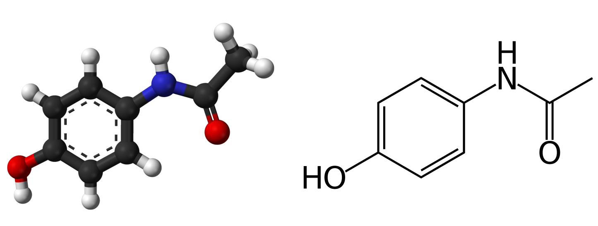]

.footnote[Credits: Petar Veličković, [CST Wednesday Seminar](https://petar-v.com/talks/GNN-Wednesday.pdf), 2021.]

---

class: middle

An interesting problem is to predict whether a molecule is a potent drug. 
This can be formulated as a binary classification problem, where 
- the input is a graph representation of the molecule and 
- the output is a binary label (e.g., whether the drug will inhibit bacterial growth).

.center.width-100[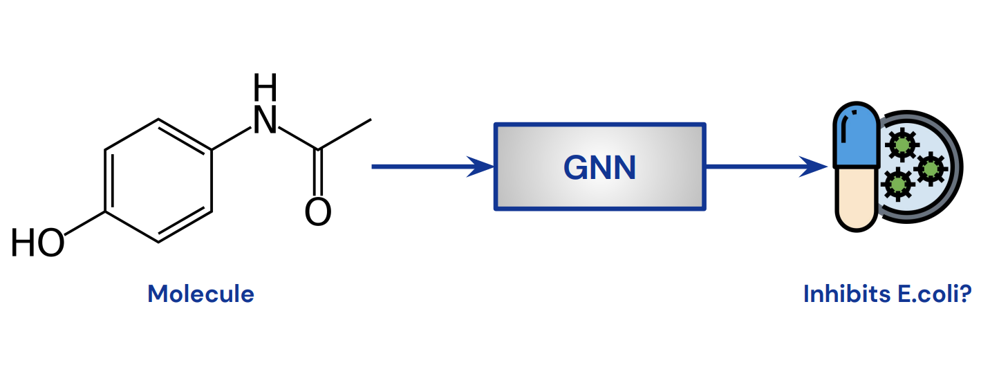]

.footnote[Credits: Petar Veličković, [CST Wednesday Seminar](https://petar-v.com/talks/GNN-Wednesday.pdf), 2021.]

???

- Binary classification on whether the drug will inhibit bacterial growth (E. coli).
- Train a graph neural network (GNN) on a curated dataset $O(10^4)$ of known drugs.

---

  

Once a GNN can accurately predict whether a molecule is a potent drug, we can use it on arbitrary new graphs to identify potential drugs:
- Run on large dataset of candidates.
- Select top-100 with the highest predicted potency.
- Manually inspect top-100.

--

This very approach led to the discovery of .italic[Halicin], a previously overlooked compound that is a highly potent antibiotic!

.center.width-70[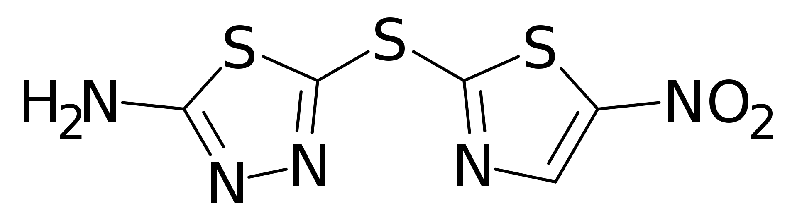]

.footnote[Credits: Petar Veličković, [CST Wednesday Seminar](https://petar-v.com/talks/GNN-Wednesday.pdf), 2021.]

---

class: middle

.center.width-60[]

---

class: middle, black-slide

.center.width-80[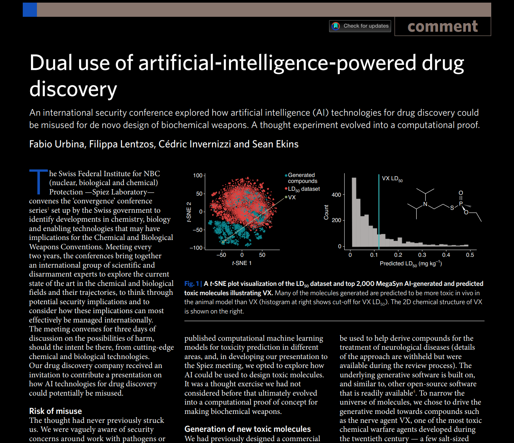]

---

class: middle

# Graphs

---

class: middle

## Basics

A graph $\mathcal{G} = (\mathcal{V}, \mathcal{E})$ is defined by a set of nodes $\mathcal{V}$ and a set of edges $\mathcal{E} \subseteq \mathcal{V} \times \mathcal{V}$.

Edges can be represented by an adjacency matrix $$\mathbf{A} \in \\{0,1\\}^{|\mathcal{V}| \times |\mathcal{V}|},$$ where $\mathbf{A}\_{ij} = 1$ if there is an edge from node $i$ to $j$, and $\mathbf{A} \_{ij} = 0$ otherwise.

The features of the nodes are represented by a matrix $$\mathbf{X} \in \mathbb{R}^{|\mathcal{V}| \times d}$$ where $d$ is the dimensionality of the node features.

???

Draw an example on the board.

---

class: middle

.grid[
.kol-1-2[ 

.center.width-90[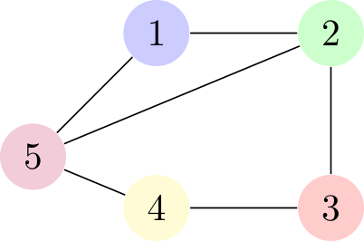]]
.kol-1-2[

$$\begin{aligned}\mathbf{X} &= \begin{bmatrix}a & b\\\\
c & d\\\\
e & f\\\\
g & h\\\\
i & j\end{bmatrix}\\\\
\mathbf{A} &= \begin{bmatrix}0 & 1 & 0 & 0 & 1\\\\
1 & 0 & 1 & 0 & 1\\\\
0 & 1 & 0 & 1 & 0\\\\
0 & 0 & 1 & 0 & 1\\\\
1 & 1 & 0 & 1 & 0\end{bmatrix}\end{aligned}$$

]
]

???

Draw on the blackboard, nodes, edges and their features.

---

class: middle

## Tasks

Given a graph $\mathcal{G} = (\mathcal{V}, \mathcal{E})$ and its $(\mathbf{X}, \mathbf{A})$ representation, we want to make
- graph-level predictions $y \in \mathcal{Y}$, using graph-level functions $f(\mathbf{X}, \mathbf{A})$,
- node-level predictions $\mathbf{y} \in \mathcal{Y}^{|\mathcal{V}|}$, using node-level functions $\mathbf{F}(\mathbf{X}, \mathbf{A})$.
- edge-level predictions $\mathbf{y} \in \mathcal{Y}^{|\mathcal{E}|}$, using edge-level functions $\mathbf{F}(\mathbf{X}, \mathbf{A})$.

---

class: middle

.center.width-80[]

.footnote[Credits: Simon J.D. Prince, [Understanding Deep Learning](https://udlbook.github.io/udlbook/), 2023.]

---

class: middle

## Permutation matrices

A permutation matrix $\mathbf{P} \in \\{0,1\\}^{|\mathcal{V}| \times |\mathcal{V}|}$ is a matrix with $|\mathcal{V}|$ rows and columns, where each row and column contains a single $1$ and the remaining entries are $0$.

---

class: middle

.center.width-40[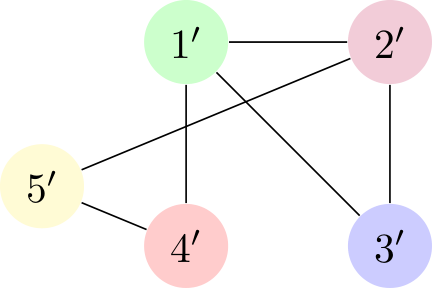]

$$\begin{aligned}\mathbf{P}\mathbf{X} &= \begin{bmatrix}0 & 1 & 0 & 0 & 0\\\\
0 & 0 & 0 & 0 & 1\\\\
1 & 0 & 0 & 0 & 0\\\\
0 & 0 & 1 & 0 & 0\\\\
0 & 0 & 0 & 1 & 0\end{bmatrix} \begin{bmatrix}a & b\\\\
c & d\\\\
e & f\\\\
g & h\\\\
i & j\end{bmatrix} = \begin{bmatrix}c & d\\\\
i & j\\\\
a & b\\\\
e & f\\\\
g & h\end{bmatrix}\\\\
\mathbf{P}\mathbf{A}\mathbf{P}^T &= \begin{bmatrix}0 & 1 & 1 & 1 & 0\\\\
1 & 0 & 1 & 0 & 1\\\\
1 & 1 & 0 & 0 & 0\\\\
1 & 0 & 0 & 0 & 1\\\\
0 & 1 & 0 & 1 & 0\end{bmatrix}\end{aligned}$$

---

class: middle

## Permutation invariance

The very representation $(\mathbf{X}, \mathbf{A})$ of a graph imposes a .italic[node ordering], which does not align with the nodes and edges being unordered. Permuting the nodes of the graph should not modify the results!

For graph-level tasks, we want permutation invariance, i.e.
$$f(\mathbf{P}\mathbf{X}, \mathbf{P}\mathbf{A}\mathbf{P}^T) = f(\mathbf{X}, \mathbf{A})$$ 
for all permutation matrices $\mathbf{P}$.

---

class: middle

## Permutation equivariance

For node-level tasks, we want permutation equivariance, i.e.
$$\mathbf{F}(\mathbf{P}\mathbf{X}, \mathbf{P}\mathbf{A}\mathbf{P}^T) = \mathbf{P}\mathbf{F}(\mathbf{X}, \mathbf{A})$$
for all permutation matrices $\mathbf{P}$.

???

That is, permuting the nodes of the graph should modify the results only up to their permutation.

---

class: middle

# Graph neural networks

---

class: middle

## Blueprint

Graph neural networks (GNNs) are neural networks that operate on graphs. They implement graph-level permutation invariance and node-level permutation equivariance.

The general blueprint is to stack permutation equivariant function(s), optionally followed by a permutation invariant function. 

---

class: middle

.center.width-100[]

.footnote[Image credits: Petar Veličković, [Everything is Connected: Graph Neural Networks](https://arxiv.org/abs/2301.08210), 2023.]

---

class: middle
count: false

.center.width-100[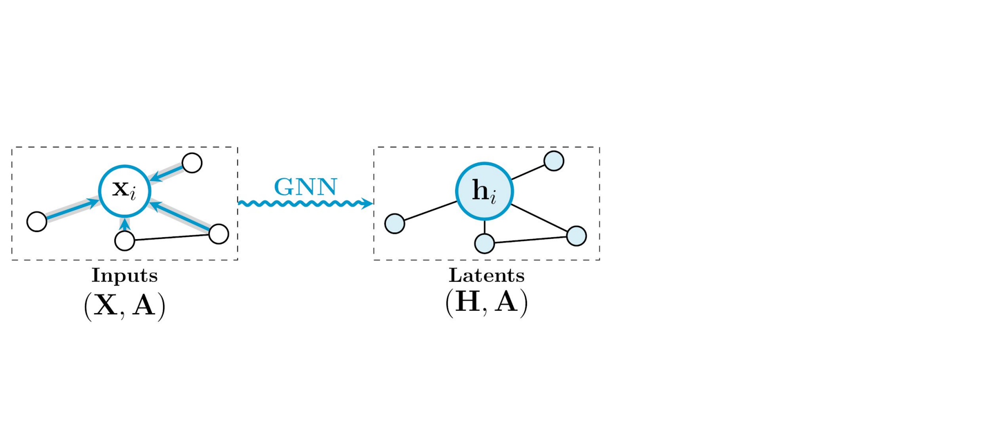]

.footnote[Image credits: Petar Veličković, [Everything is Connected: Graph Neural Networks](https://arxiv.org/abs/2301.08210), 2023.]

---

class: middle
count: false

.center.width-100[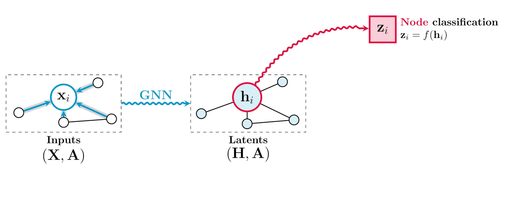]

.footnote[Image credits: Petar Veličković, [Everything is Connected: Graph Neural Networks](https://arxiv.org/abs/2301.08210), 2023.]

---

class: middle
count: false

.center.width-100[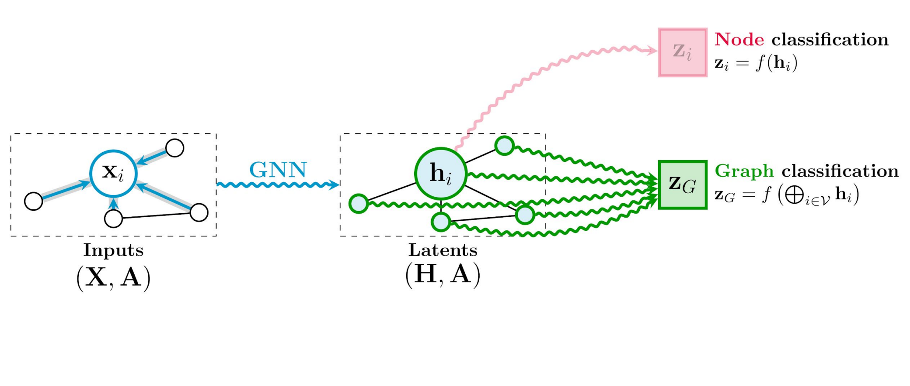]

.footnote[Image credits: Petar Veličković, [Everything is Connected: Graph Neural Networks](https://arxiv.org/abs/2301.08210), 2023.]

---

class: middle
count: false

.center.width-100[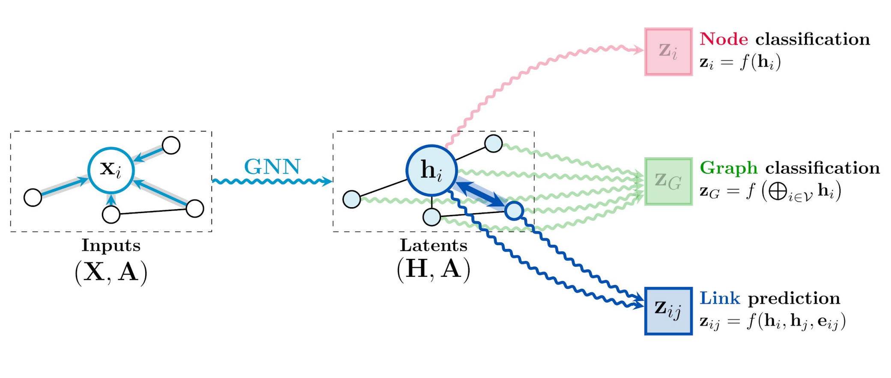]

.footnote[Image credits: Petar Veličković, [Everything is Connected: Graph Neural Networks](https://arxiv.org/abs/2301.08210), 2023.]

---

class: middle

If we denote $\mathbf{h}\_i = \phi(\mathbf{x}\_i, \mathbf{X})$ for $i \in \mathcal{V}$, then 
$$\begin{aligned}
f(\mathbf{X}, \mathbf{A}) &= g(\bigoplus\_{i \in \mathcal{V}} \mathbf{h}\_i)\\\\
\mathbf{F}(\mathbf{X}, \mathbf{A}) &= \begin{bmatrix}\mathbf{h}\_1\\\\
\vdots\\\\
\mathbf{h}\_{\mathcal{V}}\end{bmatrix}\end{aligned}$$
where $g$ is an arbitrary function, $\phi$ is a .italic[shared] permutation invariant function in $\mathbf{X}$, and $\bigoplus$ is a permutation invariant aggregator (e.g., sum, average or max).

???

Illustrate on the board.

New feature vectors $\mathbf{h}\_i$ are computed for each node $i$ by applying a shared function $\phi$ to the node's feature vector $\mathbf{x}\_i$ and the entire feature matrix $\mathbf{X}$.

---

class: middle

## Locality

A strong inductive bias of graph neural networks is based on locality. It assumes that the information about a node is most relevant to its close neighbors rather than distant ones.

For a node $i \in \mathcal{V}$, we denote its .italic[neighborhood] as $\mathcal{N}\_i = \\{j \in \mathcal{V} \mid (i, j) \in \mathcal{E} \vee (j, i) \in \mathcal{E}\\} \cup \\{ i \\}$.

Accordingly, $\phi$ is redefined as a .italic[local] function that is applied to the node $i$ and its neighborhood $\mathcal{N}\_i$ to compute  $\mathbf{h}\_i = \phi(\mathbf{x}\_i, \mathbf{X}\_{\mathcal{N}\_i})$. 

As previously, $\mathbf{F}$ is permutation equivariant if $\phi$ is permutation invariant in $\mathbf{X}\_{\mathcal{N}\_i}$.

---

class: middle

.center.width-100[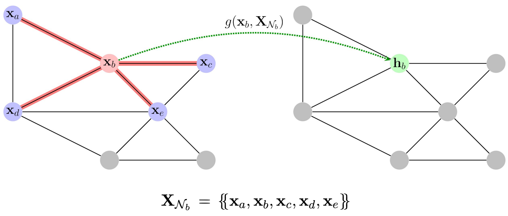]

.footnote[Note: $g$ denotes $\phi$.]

---

class: middle

## Layers

Permutation equivariant functions $\mathbf{F}$ are often referred to as .italic[GNN layers]. 

Similarly to regular layers, a GNN layer computes a new representation $$\mathbf{H} = \mathbf{F}(\mathbf{X}, \mathbf{A}) = \begin{bmatrix}\mathbf{h}\_1\\\\
\vdots\\\\
\mathbf{h}\_{|\mathcal{V}|}\end{bmatrix} = \begin{bmatrix}\phi(\mathbf{x}\_1, \mathbf{X}\_{\mathcal{N}\_1})\\\
\vdots\\\\
\phi(\mathbf{x}\_{|\mathcal{V}|}, \mathbf{X}\_{\mathcal{N}\_{|\mathcal{V}|}})\end{bmatrix}$$ from the input representation $(\mathbf{X}, \mathbf{A})$ of the graph. 

---

class: middle

GNN layers are usually classified in three spatial flavors depending on how they implement the propagation operator $\phi$:
- Convolutional
- Attentional
- Message-passing

---

class: middle

.grid[
.kol-1-2[

## Convolutional

Features of neighboring nodes are aggregated with fixed coefficients $c\_{ij}$:

$$\mathbf{h}\\\_i = \phi\left( \mathbf{x}\\\_i, \bigoplus\\\_{j \in \mathcal{N}\\\_i} c\\\_{ij} \varphi(\mathbf{x}\\\_j) \right)$$

Example:

$$\mathbf{h}\\\_i = \sigma\left( \sum\\\_{j \in \mathcal{N}\\\_i} \frac{1}{|\mathcal{N}\\\_i|} \mathbf{W}^T \mathbf{x}\\\_j \right)$$

]
.kol-1-2[ 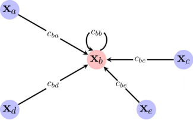]
]

.footnote[Image credits: Bronstein et al., [Geometric Deep Learning](https://arxiv.org/abs/2104.13478.pdf), 2021.]

???

Illustrate on the board, with a larger graph.

---

class: middle

.grid[
.kol-1-2[

## Attentional

Features of neighboring nodes are aggregated with implicit weights via an attention mechanism:

$$\mathbf{h}\\\_i = \phi\left( \mathbf{x}\\\_i, \bigoplus\\\_{j \in \mathcal{N}\\\_i} a(\mathbf{x}\_i, \mathbf{x}\_j) \varphi(\mathbf{x}\\\_j) \right)$$

Example:

$$\mathbf{h}\\\_i = \sigma\left( \sum\\\_{j \in \mathcal{N}\\\_i} \alpha\\\_{ij} \mathbf{W}^T \mathbf{x}\\\_j \right)$$

]
.kol-1-2[ 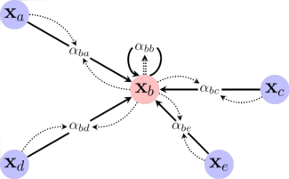]
]

.footnote[Image credits: Bronstein et al., [Geometric Deep Learning](https://arxiv.org/abs/2104.13478.pdf), 2021.]

---

class: middle

.grid[
.kol-1-2[

## Message passing

Compute arbitrary vectors (or .italic[messages]) to be sent across the edges of the graph:

$$\mathbf{h}\\\_i = \phi\left( \mathbf{x}\\\_i, \bigoplus\\\_{j \in \mathcal{N}\\\_i} \varphi(\mathbf{x}\\\_i, \mathbf{x}\\\_j) \right)$$

This is the most generic form of GNN layers.

]
.kol-1-2[ 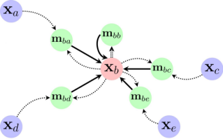]
]

.footnote[Image credits: Bronstein et al., [Geometric Deep Learning](https://arxiv.org/abs/2104.13478.pdf), 2021.]

???

Illustrate on the board, with a larger graph.

---

class: middle

## Parallel composition

Each flavor of GNN layers can be composed in parallel and then combined (e.g., by concatenation or average) to form the final representation $\mathbf{H}$ as
$$\begin{aligned}\mathbf{H} &= \text{concat}(\mathbf{H}\_{1}, ..., \mathbf{H}\_{K})\\\\
\mathbf{H}\_{k} &= \mathbf{F}\_{k}(\mathbf{X}, \mathbf{A})\end{aligned}.$$

This is similar to having multiple kernels in a convolutional layer or multiple attention heads in an attention layer.

???

Draw a full architecture on the blackboard, stopping at the parallel composition.

---

class: middle

.center.width-80[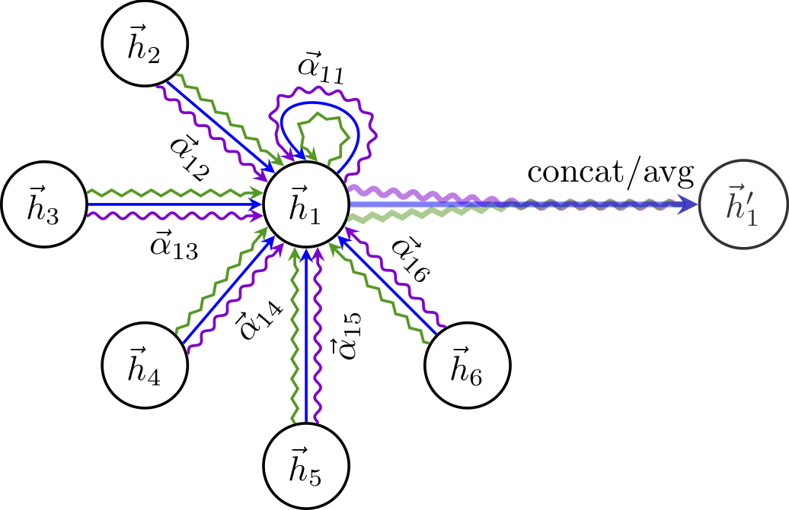]

.footnote[Image credits: Petar Veličković, [Graph Attention Networks](https://arxiv.org/abs/1710.10903), 2017.]

---

class: middle

## Sequential composition

Layers can be stacked in series to form deep graph neural networks:
$$\begin{aligned}\mathbf{H}\_0 &= \mathbf{X} \\\\
\mathbf{H}\_1 &= \mathbf{F}\_1(\mathbf{H}\_0, \mathbf{A}) \\\\
... & \\\\
\mathbf{H}\_L &= \mathbf{F}\_L(\mathbf{H}\_{L-1}, \mathbf{A}) 
\end{aligned}$$
This is similar to stacking convolutional layers in a convolutional neural network or stacking transformer blocks in a transformer.

???

Continue the drawing on the blackboard, by stacking layers in series.

Elaborate on the propagation of information across the graph. 
- The effective neighborhood of a node grows with the depth of the network
- Similar to CNNs in which the effective receptive field grows with the depth of the network.

---

class: middle, center

.center.width-50[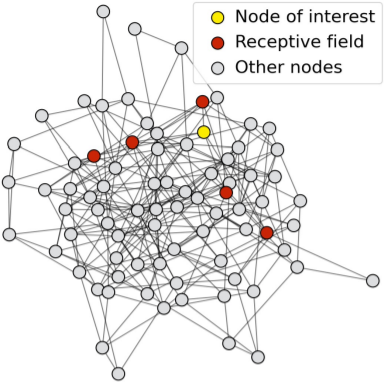]
.italic[1-layer GNN]

Stacking layers in series increases the effective receptive field of each node.

---

class: middle, center
count: false

.center.width-50[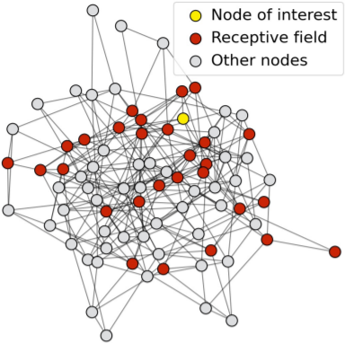]
.italic[2-layer GNN]

Stacking layers in series increases the effective receptive field of each node.

---

class: middle, center
count: false

.center.width-50[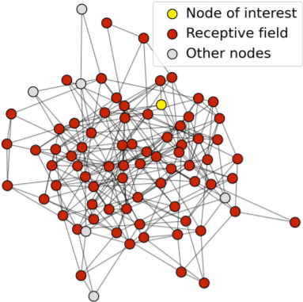]
.italic[3-layer GNN]

Stacking layers in series increases the effective receptive field of each node.

---

class: middle

## Global pooling

To make graph-level predictions, the node representations $\mathbf{H}$ are aggregated into a single vector $$\bar{\mathbf{h}} = \bigoplus\_{i \in \mathcal{V}} \mathbf{h}\_i$$ using a permutation invariant pooling operator (e.g., max, mean, sum, etc.)

$\bar{\mathbf{h}}$ is then usually passed through a regular MLP $g$ to make the final prediction.

---

class: middle

# Special cases

---

class: middle

.center.width-40[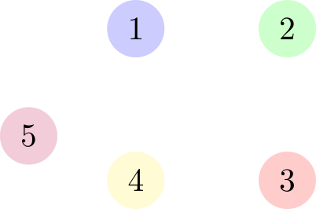]

## Empty graph

When the set of edges is empty, the graph reduces to a set of isolated nodes. In this case, $\mathcal{N}\_i = \\{ i \\}$ for all $i$ and the propagation operator $\phi$ degenerates to a function $\varphi$ applied in isolation to each node,
$$\begin{aligned}g(\bigoplus\_{i \in \mathcal{V}} \phi(\mathbf{x}\_i, \mathbf{X}\_{\mathcal{N}\_i})) = g(\bigoplus\_{i \in \mathcal{V}} \varphi(\mathbf{x}\_i))\end{aligned}.$$

Such a structure is often referred to as a .italic[Deep Set] and can be considered as a special case of a GNN.

---

class: middle 

.center.width-40[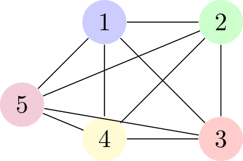]

## Complete graph

When nodes are expected to have a relational structure but the edges are unknown, it is common to assume that all nodes are connected to each other. In this case, $\mathcal{N}\_i = \mathcal{V}$ for all $i$ and no coefficient $c\_{ij}$ of interaction can be assumed.

---

class: middle

For convolutional GNN layers, $$\mathbf{h}\_i = \phi\left( \mathbf{x}\_i, \bigoplus\_{j \in \mathcal{V}} \varphi(\mathbf{x}\_j) \right),$$ in which $\bigoplus\_{j \in \mathcal{V}} \varphi(\mathbf{x}\_j)$ is identical for all nodes $i$. The model is thus equivalently expressive to ignoring that input altogether.

---

class: middle

For attentional GNN layers however, $$\mathbf{h}\_i = \phi\left( \mathbf{x}\_i, \bigoplus\_{j \in \mathcal{V}} a(\mathbf{x}\_i, \mathbf{x}\_j) \varphi(\mathbf{x}\_j) \right),$$ which yields the .bold[self-attention] layer.

In other words, the transformer architecture is a special case of a GNN.

---

class: middle

.center.width-80[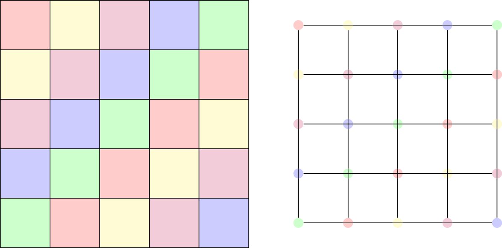]

## Images as graphs

Images can be represented as graphs, where each pixel is a node and the edges are defined by the spatial adjacency of the pixels.

That is, convolutional neural networks can be seen as a special case of GNNs.

---

class: middle

# Applications

---

class: middle

## Graph neural networks for antiobiotic discovery

.center.width-90[]

.footnote[Credits: Stokes et al, [A Deep Learning Approach to Antibiotic Discovery](https://doi.org/10.1016/j.cell.2020.01.021), 2020.]

---

class: middle

## Graph neural network for object detection in point clouds

.center.width-100[] 

.footnote[Credits: Shi and Rajkumar, [Point-GNN](https://arxiv.org/abs/2003.01251), 2020.]

---

class: middle

.grid[
.kol-2-3[ 

## Travel time prediction in Google Maps

.width-95[]

]
.kol-1-3[.width-100[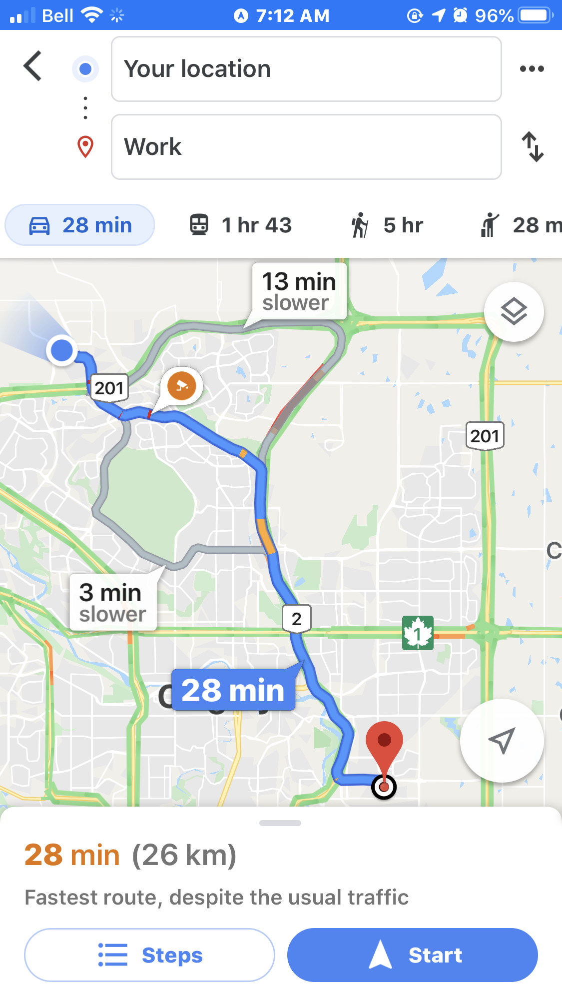]]
]

.footnote[Credits: [Derrow-Pinion et al](https://arxiv.org/abs/2108.11482), 2021.]

---

class: middle 

## Learning to simulate physics with graph networks

.center.width-100[] 

.footnote[Credits: [Sanchez-Gonzalez et al](https://arxiv.org/abs/2002.09405), 2020.]

---

class: middle, black-slide

.center[
<video loop controls preload="auto" height="400" width="600">
  <source src="./figures/archives-lec-rnn/physics-simulation.mp4" type="video/mp4">
</video>
]

.footnote[Credits: [Sanchez-Gonzalez et al](https://arxiv.org/abs/2002.09405), 2020.]

---

class: middle

## Medium-range global weather forecasting

.center.width-85[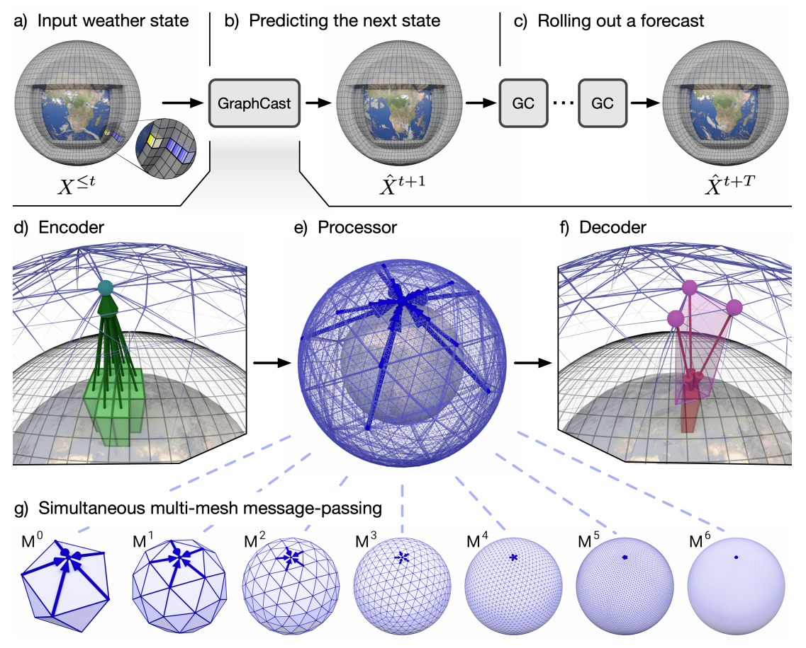]

.footnote[Credits: [Lam et al](https://arxiv.org/abs/2212.12794), 2022.]

---

class: end-slide, center
count: false

The end.
