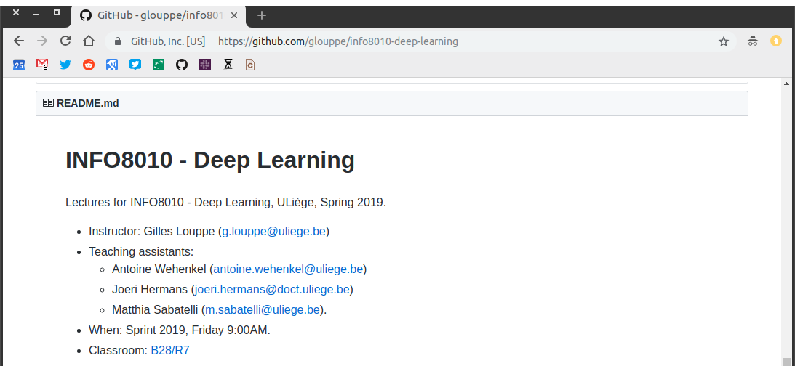

class: middle, center, title-slide

# Deep Learning

Course syllabus, Spring 2020

  
Prof. Gilles Louppe 
[g.louppe@uliege.be](g.louppe@uliege.be)

???

R: reading assingment:http://web.stanford.edu/class/cs224n/project/project-proposal-instructions.pdf
R: https://www.cs.toronto.edu/~duvenaud/courses/csc2541/index.html projects

R: add overview maps for each lecture, as in INFO8002
R: lec10 on RL -> restructure partly as a lecture on World Models -> nice comprehensive pedagogical example (combine mdn, rnn, vae, rl) into a big network
R: lec - theory of DL -> universal approx theorem, double descent

R: projects -> use github classroom https://classroom.github.com/

---

# AI at ULiège

This course is part of the many other courses available at ULiège and related to AI, including:

- INFO8006: Introduction to Artificial Intelligence
- ELEN0062: Introduction to Machine Learning
- **INFO8010: Deep Learning $\leftarrow$ you are there**
- INFO8003: Optimal decision making for complex problems
- INFO8004: Advanced Machine Learning
- INFO0948: Introduction to Intelligent Robotics
- INFO0049: Knowledge representation
- ELEN0016: Computer vision
- DROI8031: Introduction to the law of robots

---

# Logistics

This course is given by:
- Theory: Prof. Gilles Louppe ([g.louppe@uliege.be](mailto:g.louppe@uliege.be))
- Projects and guidance: 
  - Matthia Sabatelli ([m.sabatelli@uliege.be](mailto:m.sabatelli@uliege.be))
  - Antoine Wehenkel ([antoine.wehenkel@uliege.be](mailto:antoine.wehenkel@uliege.be))

Feel free to contact us for help!

 

.center[
.circle.width-25[] &nbsp;
.circle.width-25[] &nbsp;
.circle.width-25[]
]

---

# Lectures

- Theoretical lectures
- Programming tutorials
- (No exercise sessions)

---

# Materials

Slides are available at [github.com/glouppe/info8010-deep-learning](https://github.com/glouppe/info8010-deep-learning).
- In HTML and in PDFs.
- Posted online the day before the lesson (hopefully).

Some lessons are partially adapted from "[EE-559 Deep Learning](https://fleuret.org/ee559)" by Francois Fleuret at EPFL.

.center.width-80[]

---

class: middle

## Textbook

None!

But we would recommend "Dive into Deep Learning" ([d2l.ai](https://d2l.ai/)) for a comprehensive and practical introduction to the field.

.center.width-60[]

---

# Philosophy

## Thorough and detailed
- Understand the foundations and the landscape of deep learning.
- Be able to write from scratch, debug and run (some) deep learning algorithms.

## State-of-the-art
- Introduction to materials new from research ($\leq$ 5 years old).
- Understand some of the open questions and challenges in the field.

## Practical
- Fun and challenging course project.

---

# Outline

- Lecture 0: Introduction
- Lecture 1: Fundamentals of machine learning
- Lecture 2: Neural networks
- Lecture 3: Convolutional neural networks
- Lecture 4: Computer vision
- Lecture 5: Training neural networks
- Lecture 6: Recurrent neural networks
- Lecture 7: Attention and transformer networks
- Lecture 8: Auto-encoders and generative models
- Lecture 9: Generative adversarial networks
- Lecture 10: Uncertainty
- Lecture 11: Theory of deep learning
- Lecture 12: Deep reinforcement learning

---

# Projects

## Reading assignment

Read, summarize and criticize a major scientific paper in deep learning.

Pick one of the following three papers:

- J. Redmon, A. Farhadi, "YOLO9000: Better, Faster, Stronger", 2017. [[pdf](https://arxiv.org/abs/1612.08242)]
- A. Vaswani et al, "Attention is all you need", 2017. [[pdf](https://arxiv.org/abs/1706.03762)]
- M. Geiger et al, "Scaling description of generalization with number of parameters in deep learning", 2019. [[pdf](https://arxiv.org/abs/1901.01608)]

Deadline: April 3, 2020 at 23:59.

---

class: middle

## Project

Project of your choosing. Details to be announced soon.

---

# Evaluation

- Exam (50%)
- Reading assignment (10%)
- Project (40%)

The reading assignment and the project are **mandatory** for presenting the exam.

---

class: end-slide, center
count: false

Let's start!
